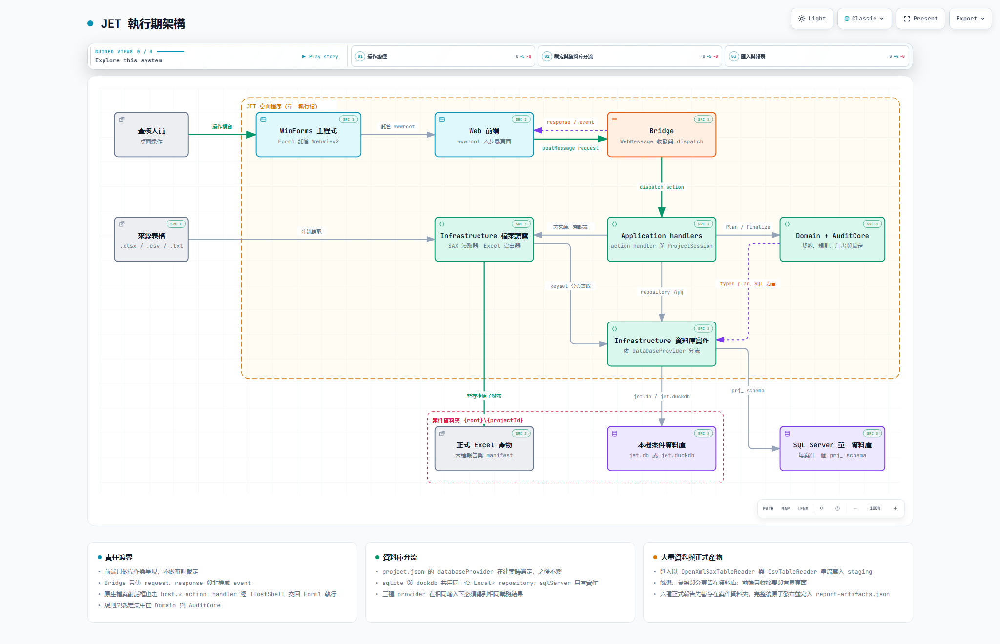

# JET 執行期架構圖

更新日期：2026-08-30

這組檔案說明 JET 桌面程式執行時，畫面、action 通道、應用流程、審計規則、資料庫實作與 Excel 產物如何
串接。圖上每個程式節點都附 [`src/JET/JET/`](../../src/JET/JET/) 的出處，並釘在 Git 修訂
`c89e3dd338d049fe3b0fcbc180cf12564ae4a2bd`；精確行為仍以程式與有效測試為準。



## 檔案

| 檔案 | 用途 |
|:---|:---|
| [`jet-runtime-architecture.html`](jet-runtime-architecture.html) | 主要成品。單一 HTML 可離線開啟，能切換淺色／深色、聚焦三條導覽路徑；節點右上角的 SRC 徽章標示程式出處數量。依 Archify 說明，Export 選單可匯出 PNG、JPEG、WebP 或 SVG。 |
| [`jet-runtime-architecture.png`](jet-runtime-architecture.png) | 供 GitHub 直接預覽的 2048×1320 淺色截圖，由 `visual-check` 產生。 |
| [`jet-runtime-architecture.archify.json`](jet-runtime-architecture.archify.json) | Archify 來源檔。重新驗證與產生 HTML 時以它為輸入，程式出處與修訂編號也記在這裡。 |

Viewer 本身的介面文字（Light／Dark、Present、Export、Guided views 等）固定為英文：Archify 的 `meta.locale`
只支援 `en` 與 `zh-CN`，本圖內容使用繁體中文，因此未設定 locale，`<html lang>` 也退回英文。圖上的節點、
關係與卡片文字不受影響。

## 圖上呈現的範圍

- 第一列是操作路徑。查核人員操作 WinForms 視窗，`Form1` 把 WebView2 導向虛擬主機上的
  `wwwroot/index.html`；前端只透過 `jet-api.js` 的 `postMessage` 送出 request，`JetWebMessageBridge`
  收到後交給 `ActionDispatcher`，response 與單向 event 再回到前端。
- Application handlers 依 action 分派：向 `JetAuditProgram` 取計畫與裁定、透過 Domain 的 repository
  介面存取資料、呼叫檔案讀取器與 Excel 寫出器。
- Infrastructure 資料庫實作以 `ProviderRouting*` 依 `project.json` 的 `databaseProvider` 分流。`sqlite`
  與 `duckdb` 共用 `Local*` repository，各自對應案件資料夾內的 `jet.db` 或 `jet.duckdb`；`sqlServer` 走
  `SqlServer*` 實作，每個案件在單一資料庫內使用一個 `prj_` 開頭的 schema，連線字串只來自環境變數
  `JET_SQLSERVER_CONNECTION`。
- 來源表格由 `OpenXmlSaxTableReader` 與 `CsvTableReader` 串流讀入。六種正式報告由 `LegacyReportWriter`
  與 `WorkpaperWriter` 以 keyset 分頁從資料庫讀取並串流寫出，`ProjectReportArtifactStore` 在案件資料夾
  內先暫存，完整後才發布並更新 `report-artifacts.json`。
- 原生檔案對話框沒有另外畫邊：`host.*` action 同樣經 Bridge 進入 handler，再由 handler 透過
  `IHostShell` 交回 `Form1` 執行。這一點寫在圖下方的卡片。

這張圖不涵蓋測試專案、只在 `AgentGuiTest` 組態編譯的程式、`legacy/`、建置輸出（`bin/`、`obj/`）與任何
私人案件資料。診斷日誌（`RingBufferLoggerProvider`、`NdjsonFileLoggerProvider`）只在啟用開發工具時註冊，
也沒有畫入。

## 本次驗證結果

- `validate architecture … --quality showcase --repo-root <repo>`：通過。9 項 artifact 檢查全部通過，
  composition 0 error、0 warning。
- `deliver`：通過。來源檔 SHA-256 `6e4779dcf413d6b26f7aef5b2e029aa1a57bf1c0ef96b0f46c4e642facf77a12`
  （10,997 bytes），HTML SHA-256 `a8c9f2be932de5fc0381134004b43bc1412cb4de8c54784110d4a83261a0e6b4`
  （745,271 bytes）；30 筆程式出處對照上述修訂驗證通過。
- `visual-check`：1440×900、1600×1000、1920×1080、2048×1320 四種尺寸都沒有水平或垂直捲軸，最小投影
  文字 6.6px（門檻 6px）。淺色與深色截圖已在 1440×900 與 2048×1320 人工檢視，未發現線段穿越節點、
  標籤壓線或明顯的空白下緣。
- 修正紀錄：交付前經三輪版面修正（移除橫穿第一列的回頭邊並重排成四列、依診斷加 `labelDy`、縮短一個
  副標），視覺檢視後沒有再修改。

## 重新產生

以下命令假設 Archify 安裝在使用者層的 `~/.agents/skills/archify`。先在 Git 忽略的 `artifacts/` 內驗證，
人工檢視截圖後再把 HTML、JSON 與 2048×1320 淺色截圖複製回 `docs/architecture/`：

```powershell
$archify = Join-Path $HOME '.agents\skills\archify\bin\archify.mjs'
$qa = 'artifacts\archify\jet-runtime-architecture'

New-Item -ItemType Directory -Force $qa | Out-Null
Copy-Item docs\architecture\jet-runtime-architecture.archify.json $qa

node $archify validate architecture "$qa\jet-runtime-architecture.archify.json" `
  --quality showcase --repo-root . --json

node $archify deliver architecture "$qa\jet-runtime-architecture.archify.json" `
  "$qa\jet-runtime-architecture.html" --quality showcase --repo-root . --json

node $archify visual-check "$qa\jet-runtime-architecture.html" --json
```

改過 `src/JET/JET/` 之後，要同步更新來源檔內 `sources` 的路徑與行號，並把 `meta.repository.revision`
改成實際查核的修訂；`deliver` 失敗時會保留舊 HTML，不能拿舊檔跑 `visual-check` 當作新結果。
