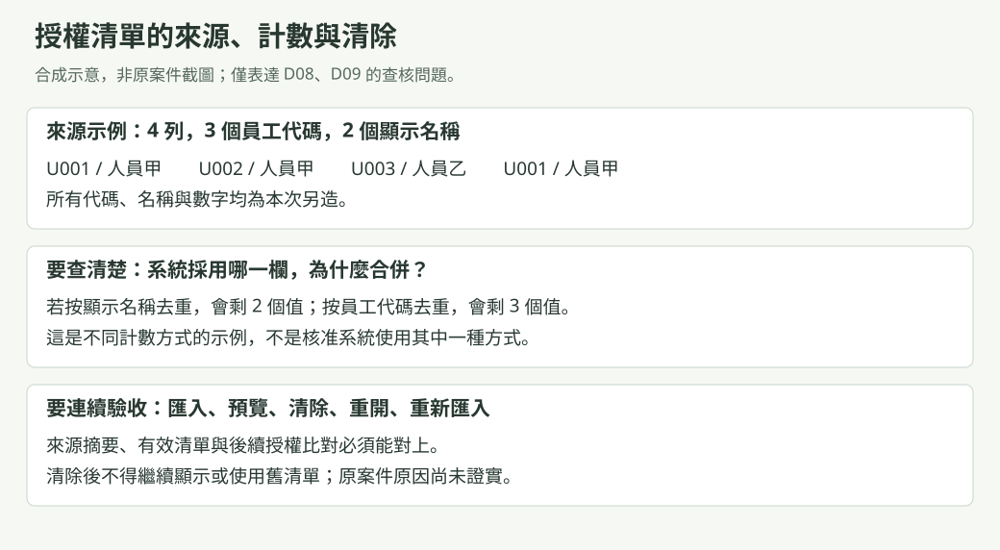
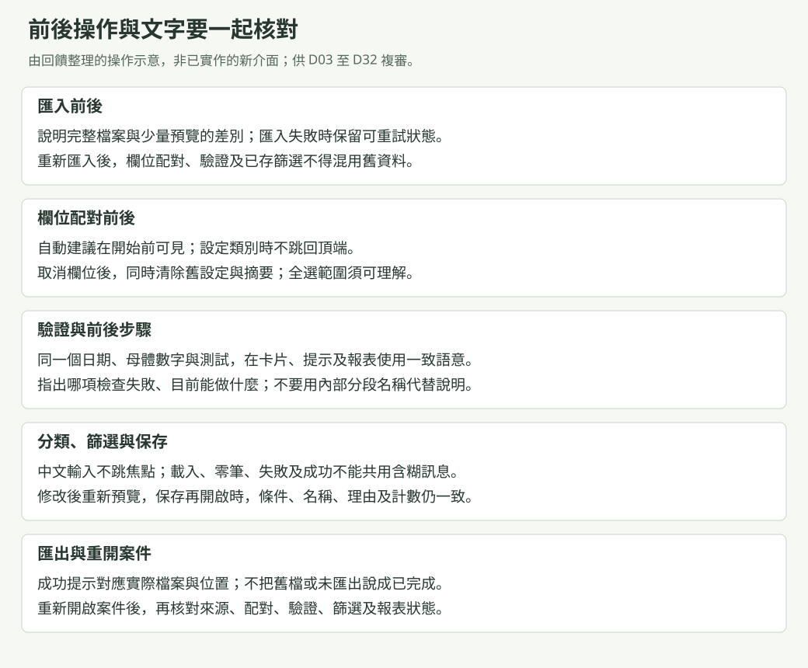
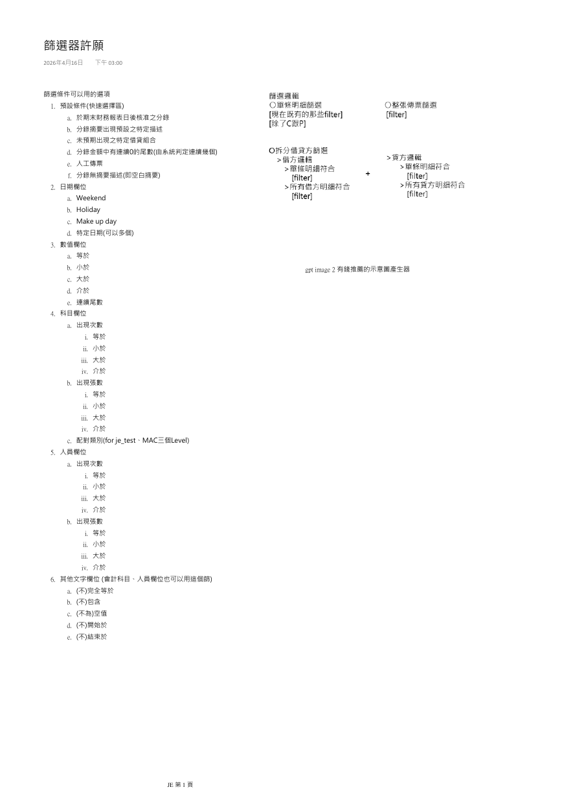
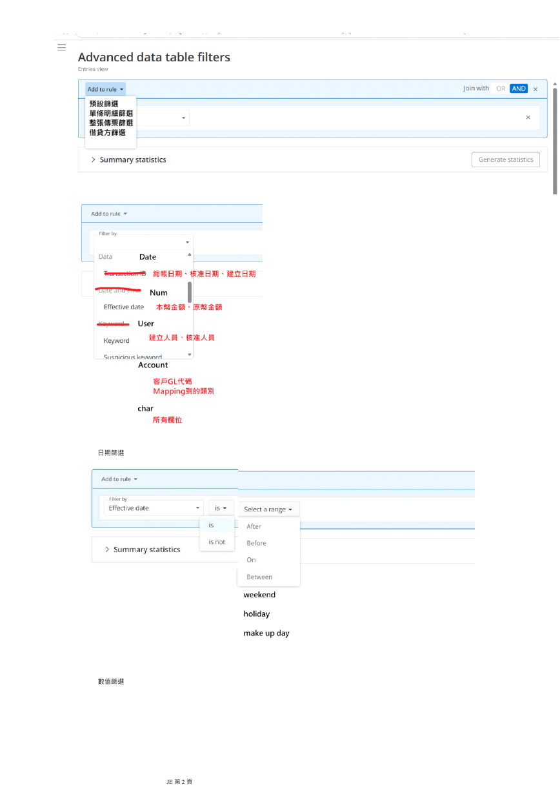

# 使用者回饋與操作流程一致性修正計畫

更新日期：2026-10-05

狀態：待使用者驗收。2026-10-05 完成交付前修正與完整驗證後，從 `docs/specs/` 移到 `docs/history/specs/`；
使用者在測試環境驗收後，才改成已完成。收尾紀錄在文末「交付前修正（2026-10-05 裁定）」的「收尾紀錄」。

## 現在要做什麼

### 第二遍回饋審閱與修正（2026-10-04 起）
<!-- jet-context:start -->
整體複審第 0 到第 6 階段已在 2026-10-03 完成，成果保持待驗收。2026-10-04 使用者先增加工作事項，累積後再交付測試環境。
第一件是 D01 到 D32、F01 到 F18 兩份回饋的第二遍完整審閱，已完成；使用者同日回覆 27 項待決事項。依裁定，這一輪修正
C2 到 C9 八類問題，含低嚴重度問題，C1 不修；88 個還沒驗證的低嚴重度問題先查證再修。工作分成第 0 到第 8 批，
寫在文末「第二遍回饋審閱與修正」；第 1 批是文字檔與 .xls 匯入，要在交付測試環境前完成。
使用者 2026-10-04 另裁定分兩個 session 執行：第 0 到第 2 批由 Claude Code 的 Fable 5.1 做，第 3 到第 8 批與完整驗證由
GPT 在 Codex 做；交接清單、平台差異與兩份提示在文末「Session 分工與交接」與「交給新 session 的提示」。
第 0 到第 2 批已在 2026-10-04 由第一個 session 完成；第二個 session 已完成第 3 到第 9 批與完整驗證，收據及限制寫在文末；第 0 批查證結果、第 1 與第 2 批的
做法、收據與改過的檔案都寫在各批下面。同日第一個 session 另做了系統審閱，使用者裁定 L65、L71 與審閱提出的 R1 到 R10，並同意新增
第 9 批（審閱找到的明確缺陷，高嚴重度先做）；裁定都已寫回各批，第二個 session 負責第 3 到第 9 批與完整驗證。九批完成後做
第三遍確認；回饋都已穩健改善時，再做提交前的獨立複審並整理到可提交狀態。工作樹的改動都還沒暫存、提交或推送，
使用者下令之前不動 Git。

本次接手範圍依使用者 2026-10-04 原話：「你負責第 3 到第 9 批與「完整驗證」，依序做」及
「完整驗證寫回後回報我，不要自行開始第三遍確認」。第二個 session 已完成寫回並停止，沒有執行第三遍確認，也沒有暫存、提交或推送。
各批記錄的驗證編號，可在 `artifacts/harness/runs/` 下找到同名目錄，其中的 `receipt.json` 是該次收據，旁邊保留測試輸出與第一次失敗證據。

2026-10-05 使用者要求保存第二個 session 的完整執行紀錄，另開新 session 做最後複審；交接在文末「本 session 執行總結與最後複審交接」。
最後獨立複審已在同日完成，結論在文末「最後獨立複審（2026-10-05）」：正式檢查在目前工作樹全部通過，50 項回饋中 38 項穩健、7 項部分完成；
另發現 DuckDB 的完整性科目表會漏掉空白科目那一列等事項。使用者同日回覆 19 項裁定，選擇先修再提交推送；
工作寫在文末「交付前修正（2026-10-05 裁定）」，由新的 session 依序執行，每一項先評估再動手。
這九項已在同日完成，完整驗證全部通過，提交前的獨立複審沒有發現阻擋交付的缺口；計畫隨後移到歷史文件，狀態是待使用者驗收。
使用者同日授權後，以明確路徑提交並推送到 `origin/main`。接手先讀文末這兩節；需要背景時，再讀文末「第二遍回饋審閱與修正」與下方「回饋第二遍審閱」。
<!-- jet-context:end -->

### 回饋第二遍審閱（2026-10-04）

整體複審第 0 到第 6 階段已在 2026-10-03 完成，工作樹整理到可提交狀態；過程見文末「整體複審」。2026-10-04 使用者決定
成果繼續保持待驗收、提交前的獨立複審也先保留，改為先增加工作事項，累積後再交付測試環境驗收。新增的第一件工作，是對
2026-09-09「待討論項目」與 2026-04-16「篩選器許願」兩份回饋，也就是本計畫的 D01 到 D32、F01 到 F18，做第二遍完整審閱。
審閱已完成，結論是還不能說都已穩健改善；待決事項整理成本機頁面 `artifacts/review/second-review-decision-checklist.html`，
共 27 項。使用者同日回覆，回覆全文與依裁定寫成的工作在文末「第二遍回饋審閱與修正」。

使用者 2026-10-04 原話，對 Agent 前一則回覆逐點註記：

> 我已經了解，請繼續保持為待驗收，因為我要繼續增加工作事項，人工驗收會在測試環境執行，因此我要累積進度再讓你 commit+push 以便測試環境驗收。

（針對「你的驗收」一點。）

> 沒關係，那就同樣先繼續保留，我要先增加工作事項，完成後再一併處理。

（針對「提交前的獨立複審還沒做」一點。）

> 基於以上註解，現在我要增加工作事項，我有再一次附上三個文件，這是上一輪驗收後得到的使用者反饋，我已經有請 codex 那裏先進行一遍的修正，而現在我想要請你做第二遍完全的審閱，確認使用者回饋是否都已經得到穩健的改善? 如果都已經完成，那就可以準備 commit+push，如果尚有缺失或額外研究出問題需要處理，則與我討論該如何處理，並整理為新的工作計畫，並於新的 session 執行。

三個文件是兩份回饋原件與一張授權清單匯入的截圖；原件含真實案件資訊，只在使用者電腦，不寫進本計畫。截圖對應 D08。
「準備 commit+push」以審閱結論為前提，不是現在的 Git 授權。

審閱做法：主線讀兩份原件，確認 50 項已涵蓋原件的全部要求；再以一個 workflow 分 12 組審閱，每組有審閱員、挑戰者與反方驗證，
最後由總檢查員找跨項目問題，共 101 個子代理，全部只讀。主線抽查高嚴重度結論，並在瀏覽器主機用 54 列的合成授權清單重現截圖，
合成檔在 session 暫存資料夾。完整結果存在 `artifacts/review/second-review/`（只在這台電腦）：`verdicts.md` 是各項結論，
`upheld.txt` 是驗證後成立的問題，`open-questions.md` 是待裁定問題，`low-unverified.md` 是未送驗證的低嚴重度問題，
`issues.json` 與 `workflow-result.json` 是完整資料。

結論摘要：50 項中 19 項穩健（其中 D11、D19、F14 挑戰者認為只算部分），27 項部分完成，F05 有缺口，D06、D25、D27 已裁定不做或延後。
驗證後成立的問題 67 個（高 6、中 41、低 20），另有 88 個低嚴重度問題沒送驗證，只有 1 個被推翻。主要根因：

- 第五步用到沒有配對的欄位時不擋下，結果默默變成 0 筆（F05、F01、F08、F17、D11、D32、F03、F09）。
- 文字檔欄位中間出現一個雙引號時，後面的資料列被默默併掉，匯入仍顯示成功；以合成檔實測確認。
- `.xls` 與 Access 讀取時不去頭尾空白，SQLite 與 DuckDB 去空白的範圍也不同，同一份資料換格式或換資料庫答案不同。
- 科目分類條件預設用「相同分類用途」比對，條件說明與報告卻不寫出選取方式（D29、F13）。
- 授權清單重開案件後不再顯示原始列數與重複數，選錯識別欄也沒有提醒（D08，主線實測確認）。
- 建案後不能修改案件資料：客戶名稱留空時報告的公司名稱是空白，期末財報準備日留空就永遠不能用 A 條件。
- 使用者在原件提供的完整性與借貸不平說明句，9/21 提交時還在，9/22 依九則註解精簡畫面文字時被改成「差異需查明原因」；
  那批的處理範圍與第一次失敗紀錄都沒寫到這兩句，查不到授權。

### 整體複審併入後的位置（2026-10-03）

2026-10-01 起的整體複審，依使用者裁定在 2026-10-03 第 5 階段結束時併入本計畫，內容在文末「整體複審」一節，原本獨立的
計畫檔已移除。整體複審第 0 到第 5 階段都已完成：第 5 階段五批修正都已驗證，S1、S2、S9 的實測也做完，完整驗證的收據
寫在文末的「第 5 批：依標註修正前端並實測」。
第 5 階段結束時的待決事項，2026-10-03 整理成本機頁面 `artifacts/review/phase5-decision-checklist.html`，共 26 項，
使用者同日回覆：S2 五點維持現況，S9 五則不必再處理，七項畫面觀察要修，已改變的行為都可接受，並裁定先修完要修的項目
再進第 6 階段。回覆全文與處理見文末「第 5 批之後：待決清單的回覆與補充修正」。七項已修正並驗證，第 6 階段收尾同日完成，
工作樹整理到可提交狀態。

### 配對欄位與情境操作順序複審（2026-09-23 晚間）

本次承接下列五則瀏覽器註解。前次欄位目錄核對沒有涵蓋實際渲染時額外刪掉的欄位，
操作測試也沒有串起自動命名、保存、重開與移除。前次通過紀錄不能證明這些缺口不存在。
本次不變更審計規則、必要資料、日期用途或正式底稿版本政策。

使用者原話：

> 還記得先前請你檢查資料綱要嗎? 因為這裡有嚴重錯誤但在前面幾次的檢查中你仍然沒有解決，簡易清單的欄位和對照表格的欄位顯示是不一樣的，其中一個案例是 `傳票核准日`，這意味著你並沒有確實檢查所有資料綱要的完整性，以及對應至前後端的設計，而前面我也指出說不要只針對我提出的地方做修正，而是要對發現的問題找出相似的脈絡並對整個系統做全盤檢查。

> 如果我沒有核准日，那為什麼還要選擇來源欄位? 這裡的三個 radioButton 是對應三種情境，但看起來你仍然沒有設計好對應的 UI/UX 而導致整個程序看起來毫無關聯。

> 這四個按鈕可以統一標準成更常見的名稱，例如 "操作" 之類的，因為我看到後面進階條件篩選那裏也有類似的功能按鈕，請統一整個系統的按鈕命名方式

> 最上面這個呈現和下面看起來很割裂，甚至顏色也不一樣，我可以理解下面要操作時會對應高亮所選擇的條件組或條件，但上面這個只負責顯示 "條件組合" 的標題還有 "新增組合" 的按鈕，我想這裡應該可以有更好的 UIUX

> 對於這部分仍然有bug問題，如果我反覆前後點選G或H，那麼篩選情境名稱那裏不會有對應正確我最後變更的順序，甚至我在 "已保存情境與矩陣" 那裏移除條件組合後，在這裡 "篩選與檢視" 的頁面也不會更新。還有其他很多操作順序的問題我沒有指出來，因為避免你再次只針對我提出的地方做修正，因此請你確實審查該區塊的邏輯順序和模組功能間的依賴，確保他的運行是完整正確的。

本次查核與修正：

| 範圍 | 原因與處理 |
|:---|:---|
| 欄位綱要 | 領域目錄及前端目錄原本都有 `docDate`，但簡易清單另行排除。改用共用的金額模式欄位集合；新增 GL 四模式和 TB 四模式的實際渲染測試。既有目錄測試繼續逐欄核對名稱、鍵、必填、字面值、儲存欄及日期用途。 |
| 核准日期 | 兩種介面共用三態控制項。簡易清單把控制項放回「傳票核准日」該列；只有由來源欄提供時顯示來源選單。換模式、換介面及取消變更沿用同一份草稿及後端投影政策。 |
| 命名與視覺 | 展開匯入操作的四個按鈕統一稱「操作」，執行匯入的按鈕仍使用動作名稱。條件組合標頭改為同底色工具列，保留組數及新增入口，不與條件選取狀態競爭。 |
| 情境生命週期 | 保存成功原本一律把名稱標成手動；晚到回應也會蓋掉新文字。改為保存命名來源，手動文字保留，自動名稱依目前條件更新。舊情境未記錄命名來源時不猜測、不覆寫。 |
| 清單與編輯器 | 保存結果以一次通知同步清單、結果及編輯連結。移除正在編輯的情境才清空草稿及預覽；移除其他情境會調整位置，獨立新草稿保留。失敗不清除。 |
| 回應順序 | 保存、移除及重新保存核對案件實例、相依資料及清單。草稿預覽另核對條件版本；保存情境預覽和矩陣核對清單及結果版本。舊案件、同案重開或資料變更前的回應不寫入新畫面；較新的草稿或文字不被保存回應取代。 |

KCT 字母仍依既有 A 至 J 排序，反覆勾選改變的是目前條件集合，不自行改成另一套篩選邏輯。
`editorOrigins` 增加兩個選填布林值，只描述名稱及動機是否自動產生；不參與 SQL 編譯或命中判定。
沒有新增資料庫欄位或第二套規則引擎。

第一次失敗的證據保存於本機收據：`20260923-101530311-0cc7d5fe203b46b1b99c97664c62d8ad`
及 `20260923-101712959-59b8f25c4c894d5a8b8c8301f0b965db`，涵蓋缺欄、模式顯示、命名、晚到回應及刪除未同步。
命名來源型別檢查的第一次失敗為 `20260923-102449679-e3e2766b91204082a1f33dc2f658c650`。

既有四項原始碼斷言須跟著設計修改，不刪除驗證目的：核准模式不再要求空的排除函式；
移除提示不再要求重產底稿；錯誤提示先排除失效回應；三條保存路徑改驗證共用的一次性狀態更新。
原斷言失敗收據為 `20260923-103000830-375b53d5602a466b8811b8ce64b0f244`。
核准日期桌面測試增加兩次選擇「由來源欄提供」，不再操作本來不該顯示的選單。
KCT 桌面測試增加保存後反覆勾選及移除目前編輯情境，共增加十四次操作。

桌面測試另找出成功提示的誤判：保存回應與草稿的 JSON 屬性排列不同，原本被當成內容變更。
比較改為忽略物件屬性順序，但仍保留條件陣列順序；沒有放寬保存成功、預覽保留及清單同步的斷言。
失敗收據為 `20260923-104257891-fdfe55b975b942af93f5c7f40671a221`；
重現此差異的前端測試失敗收據為 `20260923-104748030-fb22bf716fb5430c8929e11747220ef8`。
保存期間把同一名稱重新輸入的手動命名歸屬也納入檢查，第一次失敗為
`20260923-103937294-e4c1d4c804f3446d8a86626030b54c6e`。

核准日桌面測試原本還在尋找「修改尚未生效」，與先前已改成的「配對已修改」不同；
`20260923-103505781-8243aec135a24602807531267a55b47a` 保留這次逾時紀錄。
測試已改查實際提示，仍檢查草稿、模式及已保存配對的獨立快照。

| 本次驗證 | 實際結果及收據 |
|:---|:---|
| FrontendMapping | 112 項通過，無跳過。`20260923-104809776-3fb75ecaa358471896f49c14698efafe`。涵蓋八種配對模式、核准日期、來源共用、命名、移除、回應失效與既有前端回歸。 |
| FilterWorkflowPreviewTests | 七項及 325 項共用檢查通過。`20260923-103156088-1c7c795fd6cc48b5b539689e946326e7`。包含 SQLite 和 DuckDB 的命名來源保存及重開；最後固定命中數斷言另隨完整 Public 重跑。 |
| approval-mapping-modes | 49 次操作及一張截圖通過。`20260923-104110821-417c25676b424efd97738619ca010d67`。 |
| filter-kct-editing | 88 次操作及一張截圖通過。`20260923-104831808-c685db1d174341fd9fa5105f5bc6e24b`。 |
| filter-auditor-journey | 99 次操作及兩張截圖通過。`20260923-104954873-d5c54360f4314ab8a6a93d413f7fff75`。包括自訂條件自動文字、手動文字保留、跨組選取、預覽、保存、矩陣、窄版及雙欄版面。 |
| 合成預覽重建 | `FrontendPreviewFixtureTests` 及共用檢查通過。`20260923-105032609-44520f87353446869674a8be8d7ca97d`。已重建 C# 固定答案並刷新原瀏覽器分頁。 |
| Public | Release 建置及 3,690 項公開測試全部通過，無跳過。`20260923-105147708-9369a4213e7e4dc4811280ff35406cc8`。包含 GL、TB 欄位目錄、投影、前後端鏡像及兩個資料庫的完整回歸。 |
| Contract | 共用框架檢查通過。`20260923-110843248-f86973306f1e4088b37cddb962d924f6`。 |
| Documentation | 37 份文件通過，零錯誤、零警告。`20260923-110919201-d1c63ab9108a49b1af7e3a825da5185a`。已逐段重讀本次改動，核對來源、數字、例外、操作影響及原話；新增本列後再次執行文件檢查。 |

本機瀏覽器另已檢視同底色條件工具列、簡易清單的核准日列、三態來源欄互斥、切換對照表格保留模式，
以及四個「操作」入口。預覽工具仍不提供未準備的來源資料查詢、保存或匯出，這些操作不得用回放冒稱成功；
真正保存與移除已由上述隔離桌面情境驗證。

本次修正及上述回歸已完成；預覽停在簡易清單的核准日設定，可繼續註解。
本次未重跑完整十七條 Gui、Package、原生 Excel 或 Access 匯入，也未執行私人案件及 SQL Server。
前述較早修訂的通過記錄仍有效地描述當次執行，但不是本次重跑。使用者畫面驗收仍待確認。

### 整體修訂與第三方複審（2026-09-23）
晚間五則瀏覽器註解已修正並更新預覽，仍待使用者試用。最新結果是 112 項前端檢查、三條桌面流程共 236 次操作，
以及 3,690 項公開測試通過；來源及第一次失敗見前節。以下 32 項及驗證數字是同日較早的整體修訂紀錄，
不是 9/21 Git 交付的續授權。
本輪已修改 Access 取消、欄位配對及 Unicode 比較、中文組字與草稿保存、局部分頁、失效結果重算、
所選情境匯出、報告清單失敗回應及現行文件。使用者已採用「總帳入帳日」，保留另外兩種日期；
不更名既有 schema/action 識別字或 legacy 報表原欄標。

較早修訂的驗證：FrontendMapping 80 項通過；feedback-workflow 80 次桌面操作、filter-auditor-journey 99 次操作通過。
Excel 六份工作簿及三種來源格式在兩種資料庫的六組匯入檢查通過。最後完整 Public 3,686 項全數通過，沒有跳過；
Package 104 項及 Release 單檔發布通過。檢查範圍及收據記在本節驗證表，不沿用上一輪數字。

核心維持共用 Domain、AuditCore、AST 及資料庫集合查詢，不把 UI、報表與匯入各自擴成規則來源。
GL 和 TB 匯入與配對仍必要；完整性差異不擋後續；預篩選及 Criteria 報告不是底稿前置。
Windows 主機帳號已符合部門用途，不加企業認證；正式底稿仍每次新增版本，其他報告可重產。

D06 兩期 TB 分檔及 D07 原始文字檔失敗明列未完成，後者未證明與較早 PBC 是同一來源，也未讀私人原檔。
DPP 方法指引、MAC 外部表、SQL Server 企業/live、audit log 政策及 KCT 未提供規範仍維持原邊界。
公司 9/17 的既有三項驗收不重新宣告欠缺；本輪新功能仍須使用者試用。
工作樹包含本輪開始前的大量修改，全部保留；未暫存、提交、推送，不讀私人案件，不啟動 SQL Server。

使用者本輪原話：

> 現在請基於我註解的內容做一次完整的大版本修訂，首先你要先回顧過往的對話紀錄，確認你抓到與我討論時提出的多個方案和決策，並找到你發生問題的原因去解決它，然後再根據我多次註解修訂的意見和調整去改善整個 `je-tool` 的細節，主要得維持唯一中心化的審計業務為核心，而其他衍伸的功能和模組都得圍繞該核心業務運作，並請你往下逐個審閱每個分支，包括資料流程、功能模組、代碼結構、系統架構、前後端整合等等，同時還要扮演第三方顧問來審查每個代碼模組之間的關聯是否有被過度工程、過度複雜化，由於該 `je-tool` 系統是由多個 agent 經歷數個月長時間協同開發的產物，因此你還得修訂文字敘述、註解、資料綱要、業務流程等等，避免審查過程中因為錯誤的提示引導而忽略本該被修正的矛盾點或漏洞。

以下編號對應這次回覆註解，不另造一份需求清單；每項仍沿用 D01 至 D32 的來源。

| 註解與項目 | 使用者原話 |
|:---|:---|
| 1，D01 | ok |
| 2，D02 | ok，不過關於你提到的企業級認證，目前暫時不需要考慮這麼嚴苛的標準，因為目前 `je-tool` 僅為部門內務使用，而公司電腦皆由IT部門管理相關規範，且帳號系統是遵循微軟的服務，因此只要確保能抓到使用者所運行主機的帳號資訊就可以確認操作人員了 |
| 3，D03 | ok |
| 4，D04 | ok |
| 5，D05 | 請排定 Access 資料庫運作的完備性，確保該資料庫的運作相容於目前的 `je-tool`，以便匯入相關格式的檔案 |
| 6，D06 | 將他移到未完成項目 |
| 7，D07 | 將他移到未完成項目 |
| 8，D08 | ok |
| 9，D09 | ok |
| 10，D10 | ok |
| 11，D11 | 這個仍需要釐清，因為這屬於不同領域之間術語混淆的問題，首先是 GL (general ledger) 和 JE (journal entry) 這兩個名詞對於該系統的定義，以及兩者對於中文翻譯的定義，因而影響 `je-tool` 對其名詞的定義與定位不同，請重新評估整個審計業務流程，並研究一個避免使用者混淆的方案，看是要只留下GL還是JE，還是這兩個欄位修改其中一個名稱? 請評估。 |
| 12，D12 | ok |
| 13，D13 | ok |
| 14，D14 | 你仍然需要嚴謹測試該項目，尤其是前後端的整合完整和對應的業務邏輯是否符合定義 |
| 15，D15 | 這個要再更細節的重新評估，確保沒有相關程序被遺漏 |
| 16，D16 | 這個請複審對應的業務邏輯是不是真的有對齊至當前描述的問題 |
| 17，D17 | ok |
| 18，D18 | 為了避免後續衍伸問題，請確保前後端的名詞與定義標準一致 |
| 19，D19 | ok |
| 20，D20 | ok |
| 21，D21 | 同上，請確認前後端的命名標準一致 |
| 22，D22 | 請確認是否符合 legacy 的業務邏輯，你不用擅自決定 |
| 23，D23 | ok |
| 24，D24 | ok |
| 25，D25 | ok |
| 26，D26 | ok |
| 27，D27 | ok |
| 28，D28 | ok |
| 29，D29 | ok，不過我希望你可以在紀錄文件中明確說明該功能的運作機制和目的 |
| 30，D30 | ok |
| 31，D31 | 這個部分相對隱藏於後端但大幅影響使用者體驗，這應該重新復審一遍，並依據使用者體驗的理念研究可改善方案 |
| 32，D32 | ok |

#### 本輪如何判斷與交付

已接受項目保持現行行為。Access 是輸入來源，不新增案件資料庫 provider；D06 兩份 TB 和 D07 原始文字檔原因
列為未完成，不以一般匯入成功代替。Windows 主機帳號已足以滿足目前部門內務用途，不新增企業身分驗證前置。
日期與 INF 的不同來源若仍支持兩種業務答案，先明列差異，再由使用者裁定；其餘修正繼續，不把歧義變成整輪停工。

審計核心仍由現有 Domain、AuditCore 及資料庫集合查詢共同表達；中央化的是規則與資料含義，不是將所有程式塞進
單一類別。UI、匯入、查詢、報表、診斷和驗證工具都不得各自創造新的審計前置。既有 AST、action 和資料庫欄位
先保留，只有找到具體矛盾或多餘依賴才修改，不以大版本名義做沒有驗收答案的全面重寫。

| 分支 | 本輪核對與完成條件 |
|:---|:---|
| 歷次裁定與文字來源 | 回讀本任務可取得的原始對話，核對本計畫保存的原話；分開最新裁定、歷史提案及明確未完成項目。 |
| 建案與身分 | 確認帳號來源、畫面及保存一致；將新部門用途裁定寫回現行背景，不新增安全關卡。 |
| Access 匯入 | 核對表選取、schema、預覽、串流完整匯入、取消、失敗重試和原資料保留；公開替身測試與本機 ACE 實際測試分開記錄。 |
| 欄位配對 | 核對單側補集、空白、來源替換、晚到回應、草稿、焦點、取消、保存及重開，不只改提示。 |
| 驗證與預篩選 | 對照 legacy 的 INF 目的、母體、筆數與選用方式；保留差異，不把抽樣或產檔誤標為人工查核完成。 |
| 條件與分類 | 核對共用母體、AST、分類本身、下層及分類用途；補寫目的、保存及查詢機制，不把本地分類擴成 MAC。 |
| 明細與分頁 | 查等待、錯誤、重試、同時查詢、快取及來源切換；操作狀態就近呈現，不因讀取鎖住整頁。 |
| 報表與保存 | 回歸目前資料重算、來源版本、取消、正式底稿不覆寫，以及中間工作檔可重建。 |
| 文件、註解與 schema | 修正過期現在式與錯誤別名；標明技術識別字對應的業務定義，不為改 UI 名稱任意遷移資料。 |
| 獨立複審與驗證 | 對未參與該部分實作的審閱者提供原話及差異，檢查跨模組缺口；正式測試、GUI 及 Office 檢查依序執行，不同時跑重型工作。 |

目前進度：本輪產品與文件修訂及本機驗證已完成，仍待使用者試用。回讀可取得的歷次對話及裁定，
沿匯入、配對、母體、查詢、分類、篩選、報表與案件保存逐分支審查；具體發現、修正、未確認邊界及收據如下。

#### 分支審查結論與範圍

| 分支 | 本輪結論 | 保留或修訂理由 |
|:---|:---|:---|
| 建案、Windows 身分與案件中繼資料 | 保留目前後端帳號取得與選填欄位，修正定位文字。 | 前端傳入的操作人員不能覆寫後端注入帳號；目前部門用途不需要再加另一個身分服務。 |
| 格式檢視、預覽、完整匯入與來源資料 | Access 補足取消和原生驗收，其餘已接受格式保留。 | 結構檢視、有界預覽與完整串流有不同目的，不應合併成把整份資料載入 UI 的流程。 |
| 欄位配對、草稿與標準資料 | 修正輸入保存、來源邊界及前後端代碼比較。 | UI 編輯草稿；後端保存、投影與交易才形成標準資料。取消或失敗不得換掉上一版結果。 |
| 母體、驗證及 INF | 規則保留，補清來源、目的及資料集合定義。 | GL 和 TB 仍必要；有差異可以繼續，不把「可供後續使用」當成「審計測試通過」。59 筆已有既定裁定。 |
| 預篩選與風險彙總 | 保留已接受定位及新版門檻，移除錯誤待裁定註解。 | 人員彙總、授權比較和固定筆數訊號各有用途，不能為縮短文字互相替代；不新增 legacy 未證實規則。 |
| 分類與條件語法樹 | 保留共用 AST 和分類持久化，補用途說明。 | 上層關係、分類用途與名稱不是同一概念。前端只建立條件，不計算另一份命中結果。 |
| 唯讀查詢、快取與分頁 | 移除全頁忙碌和空頁重算推論，補版本及重試。 | 讀取不應因零筆就取得寫入鎖；資料確已失效時才重算。游標版本保護是避免混頁，不是多餘審計關卡。 |
| 所選情境與正式底稿 | 只重算所選，保留未選結果；發布與清單刷新分開。 | 未選情境不應阻擋本次輸出，附帶顯示失敗不應讓已保存檔案變成失敗；底稿不覆寫仍必要。 |
| 案件載入、交易、Bridge 與 provider 分流 | 保留各層，沒有因類別數量就合併或刪除。 | 案件鎖、取消、序列化、跨案回應與三種資料庫的差異隔離各有責任。SQL Server 延後不代表可刪相容程式。 |
| 文件、註解及驗證工具 | 同步現行名稱、來源、未完成項目和範圍。 | 舊對話原話保留；過期摘要不再指導目前工作。合成預覽只回放由正式後端產生的資料，不自算業務答案。 |

這是沿上述業務分支及相關回歸測試的審查，不是宣稱每一行程式、每個 AST 運算子或全部 SQL 與範本版面
都已重新人工審過。沒有重跑大資料量極限量測、公司設備或 SQL Server 實機。案件索引本身無法讀取的
磁碟或權限錯誤仍可能使開案失敗；本輪修的是「發布已成功後的可省略清單刷新」，不冒稱已涵蓋所有檔案
系統故障恢復。原生 Windows IME 的實際輸入法操作仍需試用，事件與焦點測試不代替該項人工確認。

#### 為何反覆修訂仍留下問題

本次確認的主因不是單一 Agent 不知道某個按鈕，而是三種跨模組誤推論：把空結果當成尚未計算、
把全部情境完成當成所選底稿可用的前提，以及把附帶清單成功當成檔案發布成功的證據。另一類是前端
與後端各自正規化文字，還有歷史文件的現在式與最新裁定沒有同步，讓後續修改沿用錯誤前提。

本輪以原話、實際 action、資料交易和固定答案逐一連回來源。新的失敗案例先重現再修改；獨立審閱者
另外找出未分類科目仍鎖整頁、未使用的發布前清單讀取、舊游標混用資料版本及比較未完成時的反向指派。
這些改善沿既有模組修正，沒有另造一套審計引擎、驗證關卡或大型狀態機。往後同類修改須把成功、空結果、
失敗、取消、上游變更與重開視為同一項需求的不同狀態，而不是等使用者逐一指出。

#### 本輪新增裁定與實際發現

日期提案原文：「GL 是總帳資料的集合，JE 是其中的會計分錄，並不是兩個互斥日期欄位。建議保留資料集名稱「總帳明細（GL）」、每列稱「分錄」，將期間判斷欄改稱「總帳入帳日」，另保留選填的「傳票日期」與「傳票核准日」；不改儲存欄位或計算規則。是否採用這個命名方案？」

2026-09-23 使用者回答：「採用「總帳入帳日」，保留三種日期」。現行畫面與錯誤用語同步，`postDate`、
`post_date`、`docDate`、`approval_date`、`voucherDate`、`voucher_date` 及既有報告正準欄不更名。
舊版報表範本的原欄標也保留，不以文字更新暗改受查者來源或 DPP 方法內容。

| 發現 | 原因及修訂 | 判定依據 |
|:---|:---|:---|
| 帳號被描述成不足以使用的身分 | 文件把延後的企業驗證強度套回目前部門用途。改為後端取得主機 Windows 帳號，前端不能覆寫；企業部署仍另列。 | 本輪註解 2、`CurrentPrincipal`、`AppCompositionRoot`。 |
| Access 取消與後段讀取失敗 | 原生讀取邊界沒有完整重查取消，部分欄值例外缺少來源脈絡。補足取消、釋放及內部例外保存，不新增 driver 安裝要求。 | `AccessTableReaderTests` 修改前 4 項失敗；收據 `20260923-075114575-4ff93f4dda5345ff84893a0ce2a608f4`。 |
| 空白判定訊息與功能不符 | 後端只引導補來源或取消配對，漏掉既有空白和補集選項。改成指向實際控制項，補兩個本機資料庫的固定答案、拒絕後保存與重開測試。 | `UserFeedbackManualAutoProjectionTests` 與 `ManualAutoComplementWorkflowTests`；前者修改前 2 項失敗。 |
| 未加入的代碼文字被清空 | 值摘要更新會重建控制項，但輸入還沒有進入草稿。保留局部草稿、游標及中文組字；來源或案件更換才失效，晚到的確認回應不能更新新案件。 | 真實前端腳本的非同步行為測試，另保留來源取消、替換、重匯與重開檢查。 |
| 前後端 Unicode 判定不同 | JavaScript 大寫轉換及 trim 與 .NET 的去空白、忽略大小寫比較不等價。不能再由前端自行判斷衝突並阻擋保存；比較需使用後端同一語意，有界回傳，不掃描另一套母體。 | 固定 Unicode 例子修改前失敗，收據 `20260923-081452816-20e7f3fcfb9d4e8cb88ce743e335d18e`。 |
| 明細等待仍鎖整頁 | 局部首讀改善後，共用分頁和未分類科目仍走全頁忙碌。統一為局部讀取、原頁保留、直接重試及來源版本檢查，移除已無用途的舊載入 helper。 | 獨立複審找到未分類科目活用路徑；8 項行為測試涵蓋排序、搜尋、失敗、過期及 DOM 移除。 |
| 空結果觸發整批重算 | 把「第一頁零筆」當成結果不存在，即使合法無命中或搜尋無結果也取寫入鎖。改讀既有失效旗標，只有失效才在鎖內再次確認並重算。 | SQLite 和 DuckDB 共 18 項修改前失敗，收據 `20260923-080431234-0061f77a8d6f4d788a48a331519db4b8`。 |
| 底稿被未選情境阻擋 | 原本先驗證並重算所有情境，之後才篩選輸出。改成只重算所選，保留未選命中；部分更新不能清掉全案失效旗標。 | 選有效情境仍被另一情境缺欄擋住，收據 `20260923-080542544-10c6c759ea7a43aaafd8246c70f5d8fd`。新底稿記錄既有篩選資料版本，不加資料表。 |
| 檔案已成功卻被報告清單拖成失敗 | 正式發布與附帶清單讀取共用成功判定，I/O 或外部鎖會使使用者誤重匯。清單改成獨立 3 秒的可省略更新，成功檔案保留，旁邊提示不必重產。 | 發布後 I/O 及無限等待各有第一次失敗，收據 `20260923-080612260-4ce882c45c0b47979a8174f879f2659d`、`20260923-081456300-d31190c647374da2b41949c007429880`。 |
| 舊文件現在式造成錯誤引導 | 「六份正式報告」「畫面顯示完整路徑」「傳票日期只供回溯」「SAX 未來替換」「零尾數待裁定」與現況矛盾。逐段改回已核對的行為與來源，不改歷史原話。 | 現行來源、2026-09-18 及 2026-09-22 裁定；指南、契約、背景、前端說明與相關程式註解同步。 |

獨立複審接著重現三個相關分支，均併入本輪修正：

- 原本匯出前讀一次清單但沒有使用回傳值，已移除這項 I/O，保留必要的索引保存；第一次失敗為
  `20260923-082406928-7e6bdb2a194b4ef4a4b5e73233963970`。
- 舊篩選命中與兩種矩陣續頁原本不綁來源版本。部分重算、重新保存或整案重算後仍能接舊游標，已統一
  加入既有來源和情境版本核對；第一次失敗為 `20260923-082759718-494f9e2123d64294a19b275f9573a10e`。
  無游標的情境摘要讀取期間換資料，以及刪除最後情境後的舊續頁也有固定重現，收據為
  `20260923-083908225-a539dc6bde864ca7a56aaf47f5e6c22d`、`20260923-083915030-3405914171654f35b5b12e0f43ea7dcf`。
- 清單損壞後回空陣列可能讓前端隱藏剛發布檔案。前端現在確認完整清單確實包含本次產物，否則保留
  原清單並加入已發布檔案及就近提示；第一次失敗為 `20260923-082707879-0c82680bc94c48c9b73227de311d3b69`。

測試修改沒有用產品答案回填預期值。原本鎖定單行 focus 寫法、前端大寫去空白、無期限清單 token 的靜態
斷言，分別改成同節點焦點和選取保存、後端同源比較及獨立有界等待的更完整檢查。Access 表清單的原
「單一表」斷言因合成檔新增五表及一個儲存查詢，改為精確五表清單；原 .xls 案例不變。日期名稱測試只
依使用者改名裁定同步，不改日期、金額或命中答案。惰性重算測試改由正式資料變更 action 觸發失效，
不再以直接刪資料庫結果卻不設失效旗標的非產品狀態當作正常操作。
INF 並未新創另一套審計答案：已查 `idea-script.bas` 的 60 筆選用流程、`idea-tool.bas` 實際 59 筆流程、
現行 `WorkpaperProgram` 方法文字，以及 2026-08-28 使用者接受 59 筆的紀錄。維持目前有效母體與 59 筆規則，
不把樣本產生標成可靠性已通過，也不新增人工核准關卡。DPP 指引仍延後。

本地分類的目的、穩定 ID、上層關係、分類用途不繼承、三種選取方式與同交易保存已補入 `jet-guide.md`。
D06 和 D07 已移到 `development-status.md` 的「未完成項目」，未推定 D07 與較早 PBC 問題是同一個來源。

完整公開測試第一次執行為 3,686 項，3,685 項通過、1 項失敗，沒有跳過，收據為
`20260923-084056345-69efec346a9a4059bddd8f6d07260cc2`。失敗項 `ExportWorkpaperStream_ResponseShape_IsLocked`
仍要求舊回應欄位清單，漏列已寫入契約的 `filterResultsCurrent` 和 `reportArtifactWarning`。這次只補入兩個
欄位，並新增「全選時結果為目前版本」「清單成功時提醒為 null」的固定答案；原有產物、來源、清單及
內容斷言全部保留，不修改產品計算來配合舊格式。更正後完整重跑結果為 3,686 項全數通過，原失敗收據保留。
本輪沒有逐行重寫整個儲存庫。已沿實際 action 和資料相依逐分支審閱，保留有明確責任的 Bridge、
Application、Domain、AuditCore、資料庫及報表邊界；不因類別多就合併，也不因 SQL Server 延後就刪除相容層。
逐一移除有實證的多餘讀取、錯誤失效推論及跨情境前置。原生 Office、GUI、完整公開測試及剩餘問題的結果
接續記錄在下面，未執行的項目不以舊收據代替。

#### 本輪驗證紀錄

全部使用合成資料。第一次 Excel 因沙盒無法連 NuGet 而未進入測試，保留收據後在獲准的本機邊界重跑。
不把該次環境阻擋算成產品失敗，也沒有因此啟動 SQL Server 或讀取私人案件。

| 檢查 | 結果與收據 |
|:---|:---|
| `Contract -ContractScenario FrontendMapping` | 最後 80 項通過，涵蓋草稿、中文組字事件、Unicode 後端比較、分批、待比較反向操作、局部分頁、來源替換及清單失敗。收據 `20260923-083701054-a693e55e3d884b26a410d6aa2c500e92`。 |
| `Focused -Filter AccessTableReaderTests` | 原 15 項取消、錯誤與釋放檢查通過；其後新增最後欄取消案例已取得失敗證據並修正，共 16 項納入完整公開測試。先前通過收據 `20260923-082158776-a8d8d58c70344332b8f078545cc87218`。 |
| `Focused -Filter ManualAuto` | 人工、自動及空白政策的領域與 SQLite、DuckDB 整合檢查通過。收據 `20260923-082214889-88f8adfad24c429ebc5691e78af78052`。 |
| `Focused -Filter MappingValueProfileHandlerTests` | 後端有界比較資料、無母體查詢、參數與原相容回應檢查通過。收據 `20260923-082953406-028f72830b98465686f929cbf7c78d51`。 |
| `Focused -Filter SelectedScenarioWorkpaperTests` | 所選情境獨立輸出、未選命中保留、來源版本與重開檢查通過。收據 `20260923-081810914-38dd458c2c304e8e8f3b5b801f448f60`。 |
| `Focused -Filter FilterQueryFreshnessTests` | 18 項 SQLite、DuckDB 空結果與失效重算檢查通過。收據 `20260923-081859121-d093ee908f0f42dc8338a04726601bd9`。 |
| `Focused -Filter Materializ` | 共用寫入鎖、取消、局部清除後交易回復與各資料庫物化檢查通過。收據 `20260923-082253978-afb374d4d4434c5b8cfc28ef8c0875ed`。 |
| `Focused -Filter FilterResultCursorRevisionTests` | 原 6 項跨來源、跨情境及局部重算的游標檢查通過；最後補入的清空情境分支納入 Public。收據 `20260923-083251696-6159141b6b0e45bfaf67dc0b15ba0017`。 |
| `Focused -Filter PublicationCatalogReadTests` | 10 項通過，包含 I/O、獨立逾時、忽略取消的讀取，以及不可吞掉的程式錯誤。收據 `20260923-083338772-f6e7d8e437c744df96a4180062ccd9a8`。 |
| `Focused -Filter ExportWorkpaperTypedSeamTests` | 完整 handler 計算、發布與取消檢查通過；發布前沒有無用途清單讀取。收據 `20260923-083005894-be72724b2a724c568c26b3ef53e65dad`。 |
| `Focused -Filter ActionContractTests` | 公開測試發現新增欄位斷言缺漏後，完整 action 格式檢查通過。收據 `20260923-085851607-64d60d7a05e64db8af280f3cbdf3fc41`。 |
| `Excel -Configuration Release` | `.mdb`、`.accdb`、`.xls` 各接 SQLite、DuckDB 共 6 組原生來源驗證通過。Access 另查 5 一般表、排除儲存查詢、10 列預覽與 12 列完整匯入、600 字文字、空值、二進位拒絕、取消與舊資料保留、GL/TB 科目零差異及來源檔不變。五種報告及科目配對檔共 6 份工作簿原生開啟、儲存、重開與 PDF 檢查通過。收據 `20260923-083047981-f8303fc825e34776975de95c121f6201`。 |
| `Gui -GuiScenario feedback-workflow` | 最後 80 次操作與 2 張畫面通過，包含配對清單焦點、拖曳、分類草稿、雙側明細、差異保留與直接匯出。收據 `20260923-090054507-33cca8f9aa24461da4940233a53e5d34`。 |
| `Gui -GuiScenario filter-auditor-journey` | 最後 99 次操作與 2 張畫面通過，包含條件建構、保存、結果、匯出和重開。收據 `20260923-090125830-046b1f0c78584375b4ee041f97336261`。 |
| `Package -Configuration Release` | 104 項及 Release 單檔發布檢查通過，預覽素材不進正式套件。收據 `20260923-085928346-827b9c5852284f669c3dbeab5d879189`。 |
| `Focused -Filter FrontendPreviewFixtureTests` | 正式後端重新產生合成預覽，檢查通過。收據 `20260923-090041449-549f26822ae1404da1c24800728b9cd6`。同一瀏覽器分頁已刷新，新日期名稱與兩筆分錄、一張傳票結果可見。 |
| `Contract -ContractScenario FrontendPreview` | 新 metadata 回放只接受已產生的固定請求，不自行計算等價，檢查通過。收據 `20260923-083351291-a5dc0cd7ce4e47b6aa5552afd2041df1`。 |
| `Contract` | 正式工具契約檢查通過。收據 `20260923-090204423-2744997ed0db42b382b7d5d91bfc9521`。 |
| `Documentation` | 最後回填結果後檢查通過，沒有錯誤或警告；改動段落亦人工重讀。收據 `20260923-092002286-a630b1acb8904dbc9aa595ed75a4b1a7`。 |
| `Public -Configuration Release -NoRestore` | 最後重跑 3,686 項全數通過，0 跳過。收據 `20260923-090221871-35abdcc97739472db65eb1dda1006682`。 |

### 黃色提示與跨模組操作限制（2026-09-23）

使用者原話：

1. 「這個提示在流程邏輯上有矛盾，例如我已經重新執行驗證後該提示仍然不會消除，因此我懷疑該功能在 `je-tool` 中是非必要性的存在，請同期檢查其他相關功能模組是否有類似問題，並移除非必要的檢查程序，避免不同模組間的約束互相限制對方而影響核心業務邏輯的運作，甚至影響 agent 後續開發的路線。」
2. 「和上一個註解一樣，這個黃底色的提示太長且非必要，而且根據文字內容來看，貌似在後端有太多約束和限制在阻擋使用者操作，這導致本該是防呆機制卻變成非預期的強制限制，尤其是在功能開發上我懷疑有許多業務邏輯的流程因為先前的這些約束和限制而導致 agent 有多個誤判的地方，現在我要你逐個細項去釐清，避免那些限制過多的約束條件影響系統開發」

本次沿前端狀態、action 處理器、資料依賴、結果保存與輸出逐項核對，不把黃框本身當成後端限制。
固定預覽只模擬過期旗標，不能證明重跑成功；正式行為以合成案件檢查。

| 項目 | 查到的依據與本輪處理 |
|:---|:---|
| 驗證與預篩選的關係 | `ValidateRunHandler` 只儲存驗證；`PrescreenRunHandler` 才更新預篩選。兩者不能互相冒充完成。移除第四步頂端的全頁過期提醒，保留各程序的執行入口與實際結果。 |
| 成功後的前端旗標 | `state.js` 的 `setLastRun` 和 `setFilterResultRef` 原本只更新結果，不清對應過期旗標；後端 `LocalRuleRunStore` 與篩選結果交易則會清除。修正前端，案件載入最後仍以後端旗標為準。 |
| 第五步的長篇提示 | 提醒本身不負責計算，也不是篩選必要輸入。移除全頁黃框，不改情境及條件內容。 |
| 先產生條件篩選報告才能匯出底稿 | `ExportWorkpaperStreamHandler` 在讀取任何底稿資料前，原本先確認另一份報告檔存在；其後仍會由 `FilterRunMaterializeService` 用目前資料重算。底稿沒有讀取該報告內容。移除這個多餘的檔案前置，同步第六步入口、按鈕及完成狀態。 |
| 上游資料變更 | `AuditDependencyPolicy` 已區分 GL、TB、分類、行事曆與授權名單。GL 影響全部；TB 只影響驗證；其餘影響預篩選和篩選，不清驗證。保留同一交易內的結果清除，避免新資料混入舊命中。 |
| 重跑驗證造成報告版本變更 | 報告仍綁定本次驗證，但不要求先重產另一份報告。底稿直接重算；舊底稿保留，不因新版本產生而覆寫。 |
| 科目配對與配對工作檔 | `AccountMappingEditorHandlers` 直接讀寫已配對的科目，但前端另要求驗證結果；`ExportAccountMappingTemplateHandler` 也將驗證 run 當成前置，實際寫檔只讀科目、分類與欄位資訊。移除這兩處多餘依賴，保留無科目時的提示、欄位配對及檔案寫入檢查。舊 caller 的 runId 仍接受，但不再用它阻擋工作檔。 |
| 預篩選是否為篩選前置 | `FilterProgram` 和篩選述詞直接使用目前資料，不依賴先前預篩選命中。此路徑本來就不要求先跑預篩選，保留。 |
| 預篩選缺選用欄位 | 個別程序顯示無法執行原因，不封鎖其他程序。保留差異，不加全頁限制。 |
| 完整性差異 | `CompletenessEligibility` 已允許差異及無法逐科目比對時繼續。保留差異和明細，不要求歸零或另外填核准說明。 |
| 尚無目前資料的驗證結果 | 匯出需要真實的驗證摘要與抽樣結果，不能用不存在或損壞的內容代替。保留重新驗證入口與目前結果判定。 |
| 欄位配對與舊版配對 | 日期、金額、過帳狀態及額外欄位需有明確用途。保留配對確認與舊版修復入口，不以取消檢查猜測欄位意義。 |
| TB 是否必要 | 2026-09-23 使用者回覆：「仍須匯入並配對 TB 才能繼續」。前端流程保留 GL 和 TB 的匯入及配對前置，不開放只以 GL 跳過 TB。這不等於要求完整性差異歸零。 |
| 條件需要的科目分類及欄位 | `FilterScenarioValidator` 依使用的條件檢查，不將科目配對變成所有篩選的前置。保留缺欄位的就近錯誤；空條件不等於使用者同意選取全部分錄。 |
| 版本與分頁游標 | 傳票明細游標綁定資料與條件，防止上下頁混入不同版本。保留失效後重新查詢，不要求另產報告。 |
| 同時寫入與案件切換 | `ActionExecutionPolicy` 和 `FilterRunMaterializeService` 保護同一案件的資料變更；取消及唯讀操作有各自路徑。保留，避免舊案件回應寫入新案件。 |
| 報告刪除、改名或外部修改 | `ProjectReportArtifactStore` 原有信任審計員的處理維持不變。中間報告可重產，不能因條件篩選報告不見而阻擋底稿；正式底稿仍每次新增版本。 |

既有 `WorkpaperExportHandlerTests` 中要求缺少、過期或刪除 Criteria 檔案時匯出失敗的斷言，
以及前端必須顯示長篇黃框的斷言，代表本次要移除的流程限制，不是審計固定答案。
先補新行為檢查並保留第一次失敗，再將這些斷言改成「底稿使用目前來源成功產生、舊檔不變」；
指定錯誤驗證版本、情境版本、未選情境及取消的檢查不放寬。
配對工作檔原本的「無驗證結果必須失敗」測試混淆工作檔和報告；改核對缺少必要欄位配對或科目時仍拒絕，不因沒有驗證結果拒絕。
新增 SQLite 和 DuckDB 合成流程先證明原本缺 runId 被阻擋，再核對未驗證時可列出 150 個科目且不捏造驗證結果。
TB 的操作前置已由使用者確認保留。後端能呈現 TB 比對無法執行的結果，不代表使用者授權前端開放跳過 TB；
本次不改這條既有流程，也不把該差異再次列為待裁定。
完整公開測試第一次執行 3,585 項，3,582 項通過、3 項失敗，收據為
`20260923-061956076-a7974e50ffcb467790dbe741c2e59b24`。其中兩項仍要求行事曆變更後先重產 Criteria
才能匯出，屬於本次明確移除的前置；改核對直接重算成功、來源正確且先前底稿檔案不變。
另一項空案件測試先遇到必要 GL 配對檢查，而非無科目檢查；改核對該實際缺漏，不放寬產品配對要求。
新增檢查在修改前已重現限制：前端過期旗標的收據為
`20260923-060320269-6bc770e8c5614384bc9cc127635d98db`；底稿被 Criteria 檔案阻擋的收據為
`20260923-060353826-9b8b0f2445f44d429d1fea3c9ba9fd3b`；配對工作檔因沒有 runId 被拒的收據為
`20260923-061210826-b76f23bab360467d8a146963009e981a`。
測試本身另修正合成準備預設會先驗證，以及無完整性差異時不輸出「step1-3 完整性測試之差異說明」的預期，沒有修改產品來配合錯誤預期。

本輪實作與下列本機檢查已完成，仍待使用者試用確認。

| 檢查 | 本次結果 |
|:---|:---|
| `Focused -Filter IndependentWorkpaperWorkflowTests` | SQLite 和 DuckDB 共 4 項通過，包括沒有驗證 run 的配對檔，以及行事曆變更後不先產 Criteria 而直接重算底稿。收據 `20260923-061550382-12b1a7660a1641e9a279facee1b77147`。 |
| `Contract -ContractScenario FrontendMapping` | 38 項通過；包含只清除成功程序的過期旗標、載入保留後端判定、缺 TB 匯入或配對仍阻擋，以及未保存時不重複提示。收據 `20260923-065606808-1280840438544d549a4aeef52aaf3c54`。 |
| `Contract -ContractScenario FrontendPreview` | 合成預覽契約通過；過期情境不保留舊預篩選摘要，也不將驗證報告誤標過期。收據 `20260923-063549995-1cd35319521c4520923842c93c6a9461`。 |
| `Gui -GuiScenario feedback-workflow` | 80 次操作、2 張畫面通過。實際 WebView2 在有完整性差異時先直接匯出底稿，之後獨立產生 Criteria，並重開確認差異保留。收據 `20260923-063745940-65fdbd08e74447a894c7f8d4ab9d2ee8`。 |
| `Gui -GuiScenario filter-auditor-journey` | 99 次操作、2 張畫面通過，回歸條件操作、保存、匯出及重開。收據 `20260923-063932887-34dc1857d8674c28a753aff9e290361b`。 |
| `Focused -Filter FrontendPreviewFixtureTests` | 合成素材重新產生並通過固定答案及架構檢查。收據 `20260923-064036119-21b2d2bea1f8472b8d642a2f96f90fe6`。 |
| `Public -Configuration Release -NoRestore` | 重跑 3,585 項全部通過，包括來源版本不符、取消、舊底稿不覆寫，以及 SQLite 和 DuckDB 結果生命週期。收據 `20260923-064138011-67dfe39506c04bd380809c031a2176c2`。 |
| `Contract` | 驗證框架自身檢查通過。收據 `20260923-065610337-0c18628d14644ea3a16e428a1ceed042`。 |
| `Build -Configuration Release -NoRestore` | 最後一次前端提示去重後建置通過。收據 `20260923-065658596-2f943e589e334137a18a58d867702d32`。 |
| `Documentation` | 37 份受管文件通過，沒有警告；改動段落另人工重讀。收據 `20260923-065701671-2e6ed59809cb4fa088e611748ad88b36`。 |

瀏覽器已刷新同一個 `scene=stale` 頁面，第四步和第五步都不再有全頁過期黃框；
驗證摘要仍保留，舊預篩選摘要不冒充目前結果。未保存情境時只顯示一項保存提示，不重複列出同一前置。
預覽服務仍只使用合成資料，畫面回放不當成後端重算通過的證據。

本輪沒有執行完整 Gui、Package、原生 Excel、SQL Server、私人案件或公司設備驗收。
兩條桌面情境和測試程式讀回合成工作簿，不等於原生 Excel 驗收。
SQL Server 資料庫引擎仍為停止且手動啟動，沒有 `sqlservr.exe`。沒有暫存、提交或推送。
本次沒有新增業務待裁定項目；既有延後事項與重啟條件仍見後文，不因這輪限制清理宣稱全部結案。

### 前一輪黃色提示預覽準備

2026-09-23 使用者要求：「調整一下目前呈現的 `je-tool` 的狀態，我想要註解當 `黃色底色的提示出現時` 的狀態」。
本輪在合成預覽新增「資料已變更（黃色提示）」選項。它沿用既有合成資料，只在模擬的案件載入結果中，
將預篩選與條件篩選標為過期。預覽不送出新的篩選請求，第四步和第五步各自顯示正式前端的黃色提示。
原本的有結果、無結果情境仍可切換；正式案件、審計判斷及 action 契約沒有改動。
`Contract -ContractScenario FrontendPreview` 在新增檢查後先失敗，收據為
`20260923-054619352-82d0f23aa1dc49aca86d324e31b5789c`；實作後通過的收據為
`20260923-054647879-f6e68d5aa6fa4f09b3cc56692ea68e32`。
已在瀏覽器確認第四步及第五步的黃色提示分別出現，預覽仍標示為合成資料。
這次只準備畫面供註解；使用者尚未就提示文字或操作流程提出這輪的修改意見。

2026-09-23 後續三則註解，延續已接受的科目配對版面，增加兩層條件選取與科目區間選取。
這次的明示要求取代先前「整組不高亮」的設計；不改條件含義、action、分類儲存與報表。

### 後續三則註解原文（2026-09-23）

1. 「我既然可以選擇條件並使其高亮，那相同我應該也可以點擊外側部分選擇條件組並使其高亮，這樣在我設定兩組條件組時使用者可以更好的辨別究竟選擇的是第1組還是第2組條件組，同樣的如果是在第1組條件中選擇也可以知道高亮的是第1個條件還是第2個條件。」
2. 「這裡排版有問題，錯亂了」
3. 「請研究 `在JET配對` 的這區塊，目前設計已經非常符合我的預期，但我仍然希望可以繼續完善他，我想知道有沒有設計方案可以讓使用者透過拖曳的操作動作來快速多選? 因為手動一次次的點擊 checkBox 和一次全選這兩者之間，使用者會希望做到在 Excel 那樣的快速多選，直接透過拖曳的操作來多選，這樣在面對重複科目分類的情況時就可以操作的更順手，也能避免瘋狂單點多個 checkBox 的麻煩」

### 本次實作與檢查

- 點組的標頭或外側空白選組，外框及組號旁的文字標示選取狀態。點組內條件仍只高亮那一條，並同步所屬組。
  組框可用鍵盤選取；巢狀條件的事件不冒泡成外層選取。切組不重繪輸入框，不修改規則或使預覽過期。
- 「本頁」採水平對齊，固定勾選框尺寸和欄寬，不再讓文字和勾選框錯位。
- 科目拖曳從勾選欄開始，連續選取本頁區間，保留區間外已選科目。從已勾選的科目開始則取消區間。
  拖回會縮小範圍，清單邊緣可自動捲動。Shift 點選從上次起點選取到目前科目。
  原本單點、鍵盤和全選本頁保留；Esc 或指標中斷取消這次拖曳。拖曳不直接套用或儲存分類。
  操作期間不呼叫全頁重繪，避免失去指標捕捉或捲動位置。切頁、搜尋和案件變更不沿用舊範圍起點。

參考 [AG Grid 的多列選取](https://www.ag-grid.com/javascript-data-grid/row-selection-multi-row/)及
[W3C 拖曳操作的替代方式](https://www.w3.org/WAI/WCAG22/Understanding/dragging-movements)。
本次採用範圍選取並保留非拖曳操作，沒有引入新的表格套件或以選取操作改寫審計結果。

第一次失敗的證據為 `Contract -ContractScenario FrontendMapping` 收據
`20260923-034535971-62bbf373b3694fc986f133c9e1aaf1f9`，新增行為測試在實作前失敗。
測試的 DOM 替身補上列樣式與選取狀態，不刪除原本分類儲存、失敗重試與分頁斷言。
桌面情境補正反向拖曳、邊緣捲動和清除選取，`feedback-workflow` 由 74 增至 79 次操作；第五步另補兩次選組，
`filter-auditor-journey` 由 97 增至 99 次，仍精確核對次數，不調高共用上限。
桌面第一次執行在套件還原受沙盒網路限制，收據 `20260923-035337092-c2345a1a03984a618a5759fbcdc2ac11`。
原命令獲准在本機重跑後，拖曳、表頭、儲存與重開檢查通過，但新增的三筆診斷超過原有 24 筆記錄上限。
失敗收據 `20260923-035625067-4769e86156bf48e5a1ad53cf771f9c7f` 保留；只把此情境的診斷筆數增至 27，
不移除檢查、不放寬結果或操作次數比對。
後續再補一筆長清單捲動檢查，診斷上限為 28；使用既有 `DemoDataFactory.TbAccountCount = 150` 的合成案件，
不另造或讀取私人科目清單。

### 三則註解的本機驗證

| 檢查 | 結果 |
|:---|:---|
| `Contract -ContractScenario FrontendMapping` | 36 項通過，包括正反向拖曳、縮小範圍、Shift、取消、捲動、畫面移除及換頁中斷。收據 `20260923-040210365-290674ef4de34ed59717eec95e5f7657`。 |
| `Focused -Configuration Release -Filter Architecture -NoRestore` | 326 項通過。收據 `20260923-040213842-392b9a390f89413cb2ccc90064efd4f8`。 |
| `Gui -Configuration AgentGuiTest -GuiScenario feedback-workflow` | 79 次操作、2 張畫面通過。實際 WebView2 拖曳選取、取消及邊緣捲動，再回歸分類儲存、重開、篩選和匯出。收據 `20260923-040419440-c88f1e03c253439586827591be352e4e`。 |
| `Gui -Configuration AgentGuiTest -GuiScenario filter-auditor-journey` | 99 次操作、2 張畫面通過。新增外側選組檢查，並固定比對選取前後的規則、草稿版本及預覽不變。收據 `20260923-035840711-22ae8276395b4154b38370955d67fb42`。 |
| `Gui -Configuration AgentGuiTest -GuiScenario nested-voucher-workflow` | 83 次操作、2 張畫面通過。子條件與外層括號選取各只有一個高亮，保存、重開和匯出仍通過。收據 `20260923-040002808-37413222ecff4d6a83e32ceecb6ef43e`。 |
| `Documentation` 與 `Contract` | 文件與命令契約檢查通過。收據分別為 `20260923-040547707-751b912542f24be6b46bb23e2f1538d6`、`20260923-040551627-9ad0bb96ece04e6f9e02e2dc661234ae`。 |

瀏覽器另實際操作兩筆合成科目的拖曳、反向取消、單點、Shift 點選、空白鍵及 Shift 空白鍵，確認未直接啟用分類儲存；
也檢視兩組條件及組內條件的高亮，確認 Enter 可選組。長清單除了八列模擬表格測試，也在桌面合成案件中
確認拖曳會捲動清單、繼續選取，仍只載入本頁最多 100 個科目。操作手感仍待使用者試用確認。

本輪未執行完整 Public、Package、原生 Excel、SQL Server、私人案件或公司設備驗收。
桌面測試中的合成報表匯出不等於原生 Excel 驗收。SQL Server 仍為停止且手動啟動，沒有 `sqlservr.exe`。
沒有暫存、提交或推送；既有延後事項和重啟條件維持本計畫後文，不以本輪前端調整宣稱全部結案。

### 前一輪七則註解

2026-09-23 接續七則註解。這輪核對焦點與選取狀態、科目配對欄名、預篩選名稱、條件層級及保存後的操作。
只改呈現與保存後的前端狀態，不改預篩選門檻、篩選計算、action 參數或工作簿範本。

### 七則新註解原文（2026-09-23）

1. 「每次點選流程時，都會跳出藍色框框在標題上，這個設計我應該沒有要求過，而是和篩選條件的高亮顯示互相高混了，請釐清各個互動元件間的關係。」
2. 「仍然發生前面要請你修正的問題未改善，請問使用者要在 Excel 的 C 欄位填上什麼? 什麼是 C 欄位? 很明顯的是在 Excel 中確定欄位C就是 Standardize Account Name 但這裡卻用 `C 欄位` 來帶過? 我已經聲明好幾次關於使用者體驗的敘述，但你仍然執意用你自己的思考鏈來替使用者說話，這很明顯在 ai agent harness 的運作上是失敗的，請你深刻的反省並研究該問題如何解決，往後要如何避免該問題重複發生。」
3. 「這個命名同樣沒有任何效力，甚至可以認為你過度思考該名稱的意涵了，這只是一個展開選單讓使用者可以查看玉篩選流程中的結果，看看有多少傳票符合這些篩選條件，也可以手動檢視符合條件的傳票內容，那麼這樣一個功能被下拉選單給涵蓋，那這個標題在傳統應用程式的標題列中應該如何命名?」
4. 「這名稱太長，改成 `JE Tool` 就好」
5. 「請調整 `je-tool` 中的名詞 `低頻` ，這對審計元來說較難意會到他的涵義，請回顧 legacy 中該預篩選條件的用意，並用一個更直觀易讀的名稱來解釋這裡你提出的 `低頻`，然後同步整個 `je-tool`」
6. 「這個介面不夠顯著，因為不同結構之間的呈現方式都較為相似，難以第一時間就知道條件組合和篩選條件之間的父子結構關係，因此我如果想要新增條件組何時，會較難找到 "新增條件組" 的按鈕」
7. 「如果選擇 `查看符合的傳票` 則會在下方另一層的 `預覽結果` 中呈現，但如果選擇 `保存情境` 則會跳到另一層的頁面 `已保存情境與矩陣` 顯示，這很明顯是不同結構段落之間在 ui/ux 上割裂感嚴重的體驗，請研究該問題的相關理念和解決方案，看看企業級的商用軟體是如何設計前端結構的。」

### 來源、問題成因與本輪做法

- `data/AccountMapping.xlsx` 的 `AccountMapping!C3` 及 `AccountMappingTemplateWriter.cs` 都寫
  `Standardized Account Name*`。縮成「C 欄」刪掉了使用者應辨認的名稱。提示應保留實際欄名、選擇科目分類的動作及範例，不以字數少作為完成標準。
- `legacy/idea-script.bas` 的 Routine R5 按傳票建立人員彙總；R6 按科目彙總後依 `NO_OF_RECS` 升冪排列。
  目前 `PrescreenRules.cs` 另外定義兩項 11 筆以下的分錄條件。畫面改為「編製分錄較少的人員（11 筆以下）」及
  「使用較少的科目（11 筆以下）」，不假稱這個門檻來自 legacy；彙總仍叫「較少使用之科目」。
- 步驟標題原本使用 `:focus`，滑鼠導航的程式焦點也畫藍框。改用 `:focus-visible`，保留鍵盤提示、標題焦點及步驟宣告。
  條件高亮則仍由已選條件狀態控制，兩者不能共用選取狀態。
- 原保存成功處理會切換頁籤並清空草稿。改為留在編輯區，把草稿連回已保存情境的位置，重複保存會更新而非新增同名情境。
  條件與預覽留在同一外框內，就地顯示保存結果；只有主動按「新增情境」才開始另一份草稿。
- 視覺延續既有字體與配色，不另做整站換膚。「條件組合」使用獨立標頭、組數和明確的新增按鈕，組框再包住各條件。
  預篩選結果入口改稱「篩選結果」，總覽對應改稱「預篩選結果分布」，主標題依指示改成 `JE Tool`。

設計參考：[SAP 保存後預設留在原物件頁](https://help.sap.com/docs/SAPUI5/b2f662dd9d7a4ec680056733050b4d34/55d81bc6997349f29e7b401ec1e16454.html?version=1.147)、
[IBM 就地通知](https://carbondesignsystem.com/patterns/notification-pattern/)及
[W3C 鍵盤焦點提示](https://www.w3.org/WAI/WCAG21/Techniques/css/C45)。
它們提供操作原則，不替 JET 決定審計規則。

### 如何避免同類退步

先前檢查能證明控制項存在、流程可執行，不能證明刪短後仍保留必要資訊；文件核對表也沒有約束後續改寫。
這輪把欄名和規則名稱連到來源，新增保存前後的狀態測試，再用滑鼠與鍵盤檢查真實畫面。
後續改文案須先確認操作對象、輸入內容、執行結果三者是否仍可辨認；只刪重複說明，不刪來源名稱或必要條件。
保存測試須同時核對保留草稿、保留預覽、重複保存不新增及不同案件的晚到回應不生效。
這些是可檢查的特定關係，不建立單純禁詞或字數檢查，也不宣稱測試通過等於審計員已驗收。

第一次失敗的證據：`Contract -ContractScenario FrontendMapping` 收據
`20260923-021921365-2c14491d18ec43ef85ca0ed277e9058f`，新增三項檢查在修改前失敗。
修改後收據 `20260923-022140993-ebdcfc5271a54b258687f0b58e88d55f` 顯示三項通過，但舊品牌名稱斷言失敗。
既有名稱斷言依本次第 3、4、5 則明示更名更新，不刪除其涵蓋範圍；正式桌面情境則改用明確的新增情境及清單入口。
桌面測試也要明確按「新增情境」或切換已保存清單，不能沿用自動跳頁的假設。
七個受影響情境增加這些操作，步數與登錄表同步；最大的單一情境由 96 增至 102 次。
收據 `20260923-024422633-3c2b5fdc42414279bb291f5158f593b7` 記錄建立測試環境時的 `action_budget_invalid`，
原因是隔離程序仍保留舊的 96 次上限。這項上限隨新增操作更新，不移除步數精確比對、失敗情境斷言或逾時限制。
桌面保存檢查又揭露 `toWireDraft` 原本直接改寫草稿的組間連接值。原先保存後清空草稿，讓這個副作用不容易被察覺；
保留編輯區後，保存前後的精確比對失敗。現在只在送出的複本整理連接值，不改編輯內容，送出規則不變。
新增前端檢查固定原草稿為 AND、既有送出值為 OR，分別驗證兩者，不從被測程式產生預期答案。
`filter-kct-editing` 已在此修正後通過 74 次操作，涵蓋保存、再編輯、重開與 KCT 來源；收據
`20260923-030156826-c288e4eb4f4b4a84bbb2fe5d9486e7a8`。
其餘最終驗證見下節。

最小視窗另發現兩項驗證工具問題。排序表頭的中心可能被固定操作欄遮住，工具原本只點中心而一直等待；
現在仍以實際命中檢查尋找可點區域，必要時先水平捲動，不使用強制點擊或移除固定欄。
工具也曾一律要求條件選單沒有焦點框，與這次保留鍵盤焦點的要求衝突。改為依瀏覽器的 `:focus-visible`
狀態分別核對鍵盤內框或滑鼠無框，原有焦點位置、條件選取及排序結果斷言都保留。
失敗紀錄包括 `20260923-030301688-56e1495d9d3c42cbb078986d4724abb3` 與
`20260923-031527748-afa38472b4334f0cbf79ee16546d77cb`。

### 本輪實際驗證（2026-09-23）

| 檢查 | 結果 |
|:---|:---|
| `Public -Configuration Release -NoRestore` | 3,581 項通過，未跳過。收據 `20260923-022632721-affe34c2969c4719893e3a2888b39b7f`。此輪在最後的前端草稿副作用修正前執行；修正後補跑下列相關檢查，沒有宣稱再次完整執行 Public。 |
| `Focused -Configuration Release -Filter Architecture -NoRestore` | 最後前端版本的 326 項架構檢查通過。收據 `20260923-030806916-a19ee8a999584b0296d97148348a78e3`。 |
| `Contract -ContractScenario FrontendMapping` | 34 項前端行為檢查通過，包括欄名來源、名稱對照、焦點樣式、送出複本與保存狀態。收據 `20260923-030153848-dfeb58ad2e3240a88c8d81c523a5b01f`。 |
| `Gui -GuiScenario filter-auditor-journey` | 97 次操作、2 張畫面通過，含最小視窗、排序、保存保留預覽、後端拒絕不完整條件與桌面寬版。收據 `20260923-032132740-54cf9b3adcbb413eb99031d25f0500b4`。 |
| `Gui -GuiScenario filter-kct-editing` | 74 次操作、1 張畫面通過。收據 `20260923-030156826-c288e4eb4f4b4a84bbb2fe5d9486e7a8`。 |
| `Gui -GuiScenario legacy-form-workflow` | 60 次操作、2 張畫面通過。收據 `20260923-030827091-1b989eb74c7546bcb8cc35f5d96e3599`。 |
| `Gui -GuiScenario side-month-workflow` | 79 次操作、2 張畫面通過。收據 `20260923-030852876-891a55defd2240d6aef89a372d3cf1fd`。 |
| `Gui -GuiScenario nested-voucher-workflow` | 83 次操作、2 張畫面通過。收據 `20260923-030921001-96e7dbba5737401cbf8d1c071013b987`。 |
| `Gui -GuiScenario extended-conditions` | 101 次操作、2 張畫面通過。收據 `20260923-030945473-b6a3c69bc0af41f695c35e7a1a2af2d1`。 |
| `Gui -GuiScenario feedback-workflow` | 74 次操作、2 張畫面通過。收據 `20260923-031022839-411b2504599742179e8219101b9eb538`。 |
| `Contract` 與 `Documentation` | 命令契約與文件檢查通過。收據分別為 `20260923-032414225-5152d4d61a514dba927d94282032adbd`、`20260923-032416747-e2b8cd1ac2ff4d6f9cfe5cba2f59b50e`。 |

Gui 均使用 `-Configuration AgentGuiTest`。第一次套件還原因沙盒無法連線至 NuGet 而受阻，
保留 `20260923-024236543-9d2d5dccd7594640aa5f7dd0b5acbc85` 後，獲准以原命令在本機執行。
所有桌面情境均使用隔離合成案件，結束後移除自己的暫存目錄；沒有讀取私人案件。
瀏覽器另確認滑鼠切步後標題無框、鍵盤切步後焦點可見，並檢視 Excel 配對、預篩選、單組與多組畫面。
瀏覽器合成預覽不支援真正保存，保存結果以桌面測試為準；已恢復正常視窗供使用者繼續註解。

本輪沒有執行原生 Excel、Package、其餘十條 Gui、SQL Server、私人案件或公司設備驗收。
SQL Server 服務確認為停止且手動啟動，沒有 `sqlservr.exe`。未暫存、提交或推送。
既有延後項目未改變範圍：報告還原配對入口待複盤；原始 PBC 失敗待獲准重現；分檔 TB 待定資料規則；
ValidationReport 差異指引待 DPP 裁定；SQL Server 待公司環境及使用者明示重啟。

### 前一輪九則註解

2026-09-22 接續九則畫面註解，將科目配對整理成互斥的 JET 與 Excel 方式，分類設定改為獨立子畫面。
第五步的按鈕與條件選單改隨頁面捲動，修正 A–U 範例卡片過窄及重複提示。審計規則、範例內容與匯入方式不變。
本輪修正與以下本機檢查已完成，預覽留在科目配對供繼續註解。

### 九則新註解原文（2026-09-22）

1. 「移除 "(JET產生)" 字串，這沒有意義」
2. 「目前看來你設計了三個頁面是(1)分類設定(2)Excel批次配對和(3)套用分類，目前顯示結構十分混亂，請研究如何更好的體現多層次的UI/UX介面，並根據該科目配對的業務邏輯來調整是否當某個功能被選種時就隱藏另一個不需要再顯示的頁面? 並且呈現順序要段落分明、結構確立，讓使用者可以第一時間就判斷他應該要選擇在JET系統內處理科目配對還是要移致Excel處理科目配對，避免功能模組之間互相混淆而影響使用者對於審計業務的判斷。」
3. 「一上來就顯示超長的文字? 請注意 `je-tool` 不是說明書，這是一個應用程式系統。」
4. 「操作系統不需要繞口難讀的文言文，只要保持審計專業就可以了」
5. 「請問這個提示和上面為什麼不合併一起? 而且就算合併了這句提示又有什麼必要的含意? 如果沒有必要那你為什麼會這樣設計? 而你若這樣設計是否意味著該系統其他提示文字也有相似的問題?」
6. 「既然使用者已經知道這個下拉選單可以選擇分類，那為什麼上面還要顯示文字 "套用分類" ?」
7. 「這個程序是負責執行預篩選並產出報告，但為什麼標題卻顯示預篩選報告? 這個程序是一個文件檔案嗎?」
8. 「這部分的按鈕排版有問題，無論我怎麼上下滾動頁面她都會停滯在那」
9. 「這一部分問題太多了，我先前請你自主檢查時你卻忽略這部分? 我已經提過不要只修正我指出的地方，但你仍然有許多錯誤得要由我指出來才會改善?」

本輪要求原文：「請繼續根據我註解的內容修正。」

### 九則註解的處理範圍

- 科目配對先選「在 JET 配對」或「用 Excel 配對」，一次只顯示一種方式。分類設定另行開啟，返回時保留原方式及草稿。
- Excel 畫面依取得檔案、匯入檔案的順序排列。只保留 C 欄操作與覆蓋全部配對的提醒，重建檔案的清空提醒也保留。
- 移除 JET 分類清單、分類設定及驗證報告的重複用途說明。「套用分類」保留給輔助閱讀工具，不再占用畫面一行。
- 預篩選是程序標題，「預篩選報告」只作為檔案名稱。報告區不再重複標題和產檔說明，沒有合併或更改既有計算與匯出動作。
- 第五步的主要操作列和左側條件選單都不固定在視窗內，也不再增加左側獨立捲軸。表格自身的表頭與明細捲動保留。
- 左側非 KCT 範例卡改用完整單欄，文字不再塞入字母標記的小欄；KCT 的字母欄保留。範例 2 的部門欄位移到該範例旁。
- A–U 和常用範例仍保留替換目前條件的提醒；A–U 的來源沿革留在文件，不放在操作區開頭。未修改 21 項條件、五個範例或 AST。

設計參考 [W3C 分頁模式](https://www.w3.org/WAI/ARIA/apg/patterns/tabs/) 的單一內容區及鍵盤操作，
以及 [GOV.UK 提示文字原則](https://design-system.service.gov.uk/components/text-input/) 的短句說明。
沿用既有紙色、Noto Sans TC 和紅色選取底線，不另建立一套視覺主題。

第一次失敗的證據：`20260922-100830762-2374237c7cd44d4082d929351b5c97bf` 仍要求「JET 產生」字串；
`20260922-100833654-b15f5c6aad0e44f4b7b46ce60fc94e8b` 仍要求報告區重複可靠性測試用途。
依本輪明示要求更新這兩項文字檢查，時間、檔案狀態、可靠性測試用途及匯出動作的斷言保留。
桌面測試新增四次方式切換及四項草稿、互斥畫面檢查，因此操作固定次數從 69 增為 73，診斷階段上限從 20 增為 24。

### 九則註解的驗證與範圍（2026-09-22）

| 實際執行 | 結果 |
|:---|:---|
| `Contract -ContractScenario FrontendMapping` | 31 項通過，新增互斥方式切換、返回原方式及非固定操作列檢查。收據 `20260922-101814185-60ed0612fa3e46e38b5dfe754222677e`。 |
| `Focused -Configuration Release -Filter Frontend -NoRestore` | 201 項前端檢查及 325 項架構檢查通過。收據 `20260922-101817125-4e1d18d73258454582a3ec1119023c7a`。 |
| `Gui -Configuration AgentGuiTest -GuiScenario feedback-workflow` | 73 次操作、2 張畫面通過，包含切換 Excel、分類設定、返回 JET 後保留草稿，再取消、儲存及重開。收據 `20260922-101312981-02de7fd5c9dc4a4d8472036bf540b7c3`。 |
| `Gui -Configuration AgentGuiTest -GuiScenario legacy-form-workflow` | 55 次操作、2 張畫面通過，保留 A–U、範例、保存及重開操作。收據 `20260922-101459002-19e2ee7aac4f43d79401c30507bb3b90`。 |
| `Contract -ContractScenario FrontendPreview` | 6 項預覽檢查通過。收據 `20260922-102109160-8d73961ea7574f8c9e592c8bbe0073f1`。 |
| `Contract` | 命令登錄與操作預算一致性通過。收據 `20260922-102112765-a1d429ab14f040ebb526108f3d9f6c35`。 |

另在瀏覽器實際操作互斥分頁、鍵盤方向鍵與 Enter、分類設定返回，以及展開完整範例清單。
PageUp 後操作列的位置由 538px 變為 972px，與內容捲動量相符，不再停在視窗底部。
左側範例在窄版改為上下排列，桌面版也以原生 WebView2 畫面核對，文字不再逐字直排。

提示檢查不只限於註解：刪除建立案件、驗證摘要、條件矩陣及匯出底稿的重複開場文字，
也移除版本紀錄內已過時的「在資料夾中顯示」按鈕說明。保留匯入格式、日期範圍、必要欄位、
資料覆蓋、空值規則及結果版本等會影響操作判斷的文字。其餘固定定位為對話框、遮罩、表頭或必填摘要，
沒有把不同用途一律取消。本輪沒有變更審計計算或後端 action，未重跑完整公開測試、全部桌面流程、
SQL Server、原生 Excel、私人案件及公司設備驗收，未暫存、提交或推送。

### 前一輪十二則註解

2026-09-22 再接續十二則註解與指定報表、舊程式的名詞核對。此次撤換逐科目下拉選單，改用整批勾選與一次套用分類。
原始來源、跨頁用語及六步驟和總覽的檢查範圍記在 [畫面用語與呈現核對](../../history/2026-09-23-frontend-terminology-review.md)。
本輪修正與本機檢查已完成，合成預覽可繼續註解。下列七則註解的完成紀錄屬前一輪，本輪結果另列如下。

### 十二則新註解原文（2026-09-22）

1. 「既然上方按鈕已經提供開啟資料夾的功能，那就不需要額外註釋路徑，然後時間戳記應該顯示究竟是修改時間還是建立時間，而後面的位元組直接改成顯示 MB 就好。」
2. 「改成 "開啟資料夾"」
3. 「這裡也是要重新設計呈現方式」
4. 「這也一樣」
5. 「使用者不太可能會在這裡逐個手動操作下拉式選單來做科目配對，換句話說你這個設計造成了更大的問題，請重新完整的理解科目配對究竟在做什麼之後，重新設計這區塊。」
6. 「上下方的數字字體不一致，他們應該是同一套呈現方式，也就是上方的 "納入測試的分錄、傳票數、借貸淨額..." 和下方的 "已完成欄位配對的分錄、納入本次測試、日期未符合..." 這兩個區塊，既然這裡被我發現有字體沒有標準化一致，就代表整個 `je-tool` 仍有其他地方式字體不一致的，請完整的檢查一遍，確認你是否仍有疏失或遺漏的部分」
7. 「這裡就不需要再用下拉式選單了，這個問題我前一輪修正已經提過請你修改了，我也說過了，如果我有提出問題並不是只有這裡需要修改，而是要你盤查整個系統是不是也有類似的問題，因為你有一個言種的疏失是你只會調整我指出的地方，但這個問題其實是整個系統中有不少地方都出現，而你只修正我指出的地方意味著其他相同的問題仍然存在，而這不應該是我要手動逐一盤查出來的，你應該做為審查員去檢查每一個前端的區塊和功能模組間是不是有發生我提出的問題點，而不是只修正我指出的地方。」
8. 「這裡也不用下拉選單...」
9. 「你有檢查過這裡了嗎? 我沒有特別指出這裡，但是也請你依照我先前指出過的問題來檢查這個區塊是否有相似的問題」
10. 「保留英文的標題就好，移除中文標題，太繞口了看不懂」
11. 「目錄改成流程，然後請將 "流程" 這個標題處理得更有動態設計感」
12. 「前面提過的問題這裡還是存在，如果我選取了下拉式選單他確實會有藍色外框醒目提示，這個設計很好，但問題在於左邊的框線被裁掉了」

本輪完整要求原文：

> 除了我註解的部分要改進，我還需要你進行完整的名詞標準化，因為你目前混淆了許多不同領域的術語和名詞在同一個系統中，而這會影響使用者對於審計業務的判斷與理解。請你重新查看 [WorkingPaper.xlsx](../../../data/WorkingPaper.xlsx) , [CriteriaSelectionReport.xlsx](../../../data/CriteriaSelectionReport.xlsx) , [ValidationReport.xlsx](../../../data/ValidationReport.xlsx) , [PrescreeningReport.xlsx](../../../data/PrescreeningReport.xlsx) , [idea-tool.bas](../../../legacy/idea-tool.bas) , [idea-script.bas](../../../legacy/idea-script.bas) 等文件檔案，重新塑造你對 `je-tool` 的理解，而不是再用你自己的臆測去理解該系統了。

### 本輪修改與第一次失敗的證據

保留既有欄位鍵、分類識別值、匯入別名、日期與金額規則。單欄金額、傳票分錄條件、分類用途、
符合條件的分錄及試算表顯示名稱，同步前端與對應領域或報表文字。歷史範本與使用者保存的內容不改寫。
報告清單共用建立時間、MB 與開啟資料夾入口；移除完整路徑不是移除報告追溯資料。

本輪修改舊測試文字的原因是使用者明確要求替換呈現方式。保留原有計數、篩選、取消、失敗重試與保存斷言，
不讓測試從被測程式取得預期答案。逐列選分類的操作測試改為勾選、選分類、套用，再沿用原本的儲存和重開檢查。
三次操作各增加兩個點擊，桌面檢查的操作上限及固定次數由 63 改為 69。

- `20260922-090845067-400e23278b79426ba768cfee2822d055`：前端契約 3 項失敗，分別是舊逐列控制項、完整路徑及舊資料夾按鈕文字。
- `20260922-091005745-cb99ec6bebae43e3acb69e084eef5560`：前端來源檢查 2 項失敗，仍要求總覽舊標題及舊空狀態文字。
- `20260922-091119045-88916037d7894223a9a3f9449fabb430`：跨頁名詞整理後，8 項來源文字檢查仍要求舊名。已依新固定文字更新，不更改審計計算預期值。
- `20260922-091538532-94d191379cc04ef996b2e7fc423978c4`：篩選測試有 3 項仍要求「命中分錄」或「相同審計角色」；只更新文字預期，保留篩選及巢狀條件斷言。
- `20260922-092203137-725036fd2fe148159c8a1be8044cbb73`：來源檢查仍要求舊的完整性與借貸不平說明。改成說明實際核對程序，不暗示差異只有單一原因。
- `20260922-092244878-afdf8c25dbdd4c19927be8fd4e97686d`：欄位目錄固定答案仍為「傳票金額（單欄）」；依單筆分錄的實際意義改為「分錄金額（單欄）」。鍵、順序與必填性斷言保留。
- `20260922-092407812-0f756dae6019458fb349902c4e4f199d`：完整公開測試唯一失敗要求介面必須出現「標準化」。改為要求「已完成欄位配對」等操作用語，並禁止三個已撤換的術語，沒有移除用語檢查。
- `20260922-093851416-d45d7c24cdb44ab3924b9fd3e32b4ea4`：新整批儲存測試通過，但圖表說明檢查仍要求「非零元分錄為分母」。改為「非零金額分錄為分母」，保留零元、空值及累積分布檢查。
- `20260922-091849021-bc24a07bea5d4b4a916dea1a0d4a70fc`：桌面檢查受 NuGet 網路限制阻擋。相同正式命令獲准重試，未略過套件或測試。

### 十二則註解的實際驗證（2026-09-22）

| 實際執行 | 結果與收據 |
|:---|:---|
| `Public -Configuration Release -NoRestore` | 3,579 項中 3,578 項通過，1 項舊用語斷言失敗，無略過。Release 建置 0 警告、0 錯誤。收據 `20260922-092407812-0f756dae6019458fb349902c4e4f199d`。沒有把這次完整測試記成全數通過。 |
| `Focused -Configuration Release -Filter AccountMappingEditorTests -NoRestore` | 8 項科目配對測試與 325 項架構檢查全部通過，包含更新後的用語檢查。新增 SQLite、DuckDB 各一項整批儲存並重開的固定答案，確認未選科目仍保留原分類。收據 `20260922-093939666-0e18bc4cef1b4ffba24f066454736930`。這兩項新增測試不包含在上列完整測試的 3,579 項內。 |
| `Gui -Configuration AgentGuiTest -GuiScenario feedback-workflow` | 最後一次桌面複驗 69 次操作、2 張畫面，整批套用、取消、儲存、重開、分類設定及報告呈現通過。收據 `20260922-094102349-32bfcb959a544902b276c557ecf51c4f`。 |
| `Contract -ContractScenario FrontendMapping` | 29 項通過。包括整批選取、僅儲存變更、取消、失敗重試、搜尋失敗不顯示舊清單、五種報告格式及共用字型和焦點規則。收據 `20260922-094230308-c9bc4d604f5a4a6f882aa016a19f92b0`。 |
| `Contract -ContractScenario FrontendPreview` | 6 項通過，預覽素材及正式封裝排除檢查通過。收據 `20260922-094233144-5925d6eeef394605977d1201de2838ac`。 |
| `Contract` | 正式命令及登錄一致性檢查通過。收據 `20260922-094236737-d500266638004a2e933e19a128283fff`。 |
| 合成預覽素材 | 1 項實際 action 固定答案與 325 項架構檢查通過後重新輸出。收據 `20260922-092308658-88b7d798ef8c423bb2bff663756ac8bd`。 |
| `Documentation` | 文件檢查通過。收據 `20260922-094502138-10c16d0c4906416ab034854cce9250df`；補登此紀錄後再執行一次文件檢查。 |

瀏覽器另實際查看第四步、第五步、欄位配對及總覽，測試全選兩個科目、套用與取消。
第四步兩組統計和總覽的實際樣式皆為 Noto Sans TC、19px、字重 600、行高 26.6px，採等寬數字。
自訂條件選單以鍵盤取得焦點，確認左側框線完整；窄版也檢查過，完成後取消臨時視窗大小設定。
報告清單核對實際檔名、建立時間及 MB，沒有顯示完整路徑。科目查詢失敗時會清除舊結果，避免誤套分類。

本輪只執行一次完整公開測試；文字斷言更新後，以上列定向檢查與桌面操作複驗，不宣稱另跑過完整一輪。
未重跑全部 17 條桌面旅程、Release 封裝、原生 Excel、SQL Server、私人案件或公司設備驗收。
四份指定工作簿與兩份舊程式沒有修改，原有未提交工作保留，本輪沒有暫存、提交或推送。
SQL Server 三項本機服務均為手動且停止，沒有 `sqlservr.exe`。既有延後事項仍按本計畫末段的重啟條件處理。

### 前一輪七則註解的處理紀錄

2026-09-22 已接續七則新註解，改善科目配對日常操作、欄位資料綱要及六步驟用語，接續由使用者試用。
使用者已選擇「直接在 JET 選分類，Excel 保留為批次操作（建議）」。本輪新增清單分頁與局部儲存，
分類名稱為一般設定；角色與階層留在另行開啟的進階設定。原有未提交修正保留，本輪未另取得提交推送指示。

### 七則新註解原文（2026-09-22）

1. 「什麼是 "進入測試母體" ? 這怎麼聽都不是審計相關的名詞吧? 請不要搞混 je-tool 的定位，這個系統不是服務於工程師或IT部門的，這是要供給一般審計員使用的，請務必注意你對 `je-tool` 的命名和語法等等。」
2. 「像是主標題旁邊的這種醒目文字，我可以理解你的用意是快速呈現已完成階段的相關資訊，但這應該有更好的呈現方式，請考慮到 ui 及 ux 為優先，重新設計這類提示文字的呈現方式，你可以扮演作為沒太多成熟經驗的一般審計員，他們要如何理解認知這個系統來操作 journal entry testing 的程序?」
3. 「我覺得你可以重新考慮有沒有測試母體以外的名詞，這不管怎麼聽都不太對勁，而且 legacy 那裡也不是這樣命名的，請你務必釐清楚審計業務相關的背景知識與脈絡，不要偷懶就不查看上下文...」
4. 「這個部分我認為你過度複雜化了，甚至我也看不懂這三個欄位應該怎麼設定，因為在舊的系統中我只需要設定分類名稱就可以設置對應的科目分類，但現在還多了 "審計角色" 和 "上層分類" 我更加疑惑，既然我已經設了 "Cash" 那為什麼還有對應的審計角色 "現金" ? 而上層分類又是什麼? 還有旁邊的 "內建" 跟 "移除" 看起來就是毫無關聯的功能按鈕，這一整個區塊都很讓人匪夷所思，雖然舊的 je-tool 要額外去 excel 操作是個體驗上的不良，但現在整合之後也沒有感覺比較好，而且我仍然要去 excel 操作阿，那這裡為什麼還設計得更複雜了?」
5. 「請重新整理清楚欄位配對的文字和定義，因為經過一些修改後，可能有遺留的程式碼沒有調整到最新的狀態而有衝突，請確認欄位的資料綱要是穩健的，這部分你應該逐個檢查所有與之關聯的模組和功能，確保系統設定的欄位是約束的，尤其是會動態調整的區塊需要特別注意」
6. 「可以新增一個按鈕讓使用者可以在程序執行完成後，讓她打開這個報告所在的資料夾」
7. 「這裡也可以新增一個按鈕讓使用者可以在程序執行完成後，讓她打開這個報告所在的資料夾，但是設計風格應該和上面的一致，所以要注意可能產生差異的地方，避免混淆使用者的視覺理解」

操作方式提問原文：「科目配對的日常操作，你希望採用哪一種？我建議讓審計員直接在 JET 的科目清單選擇分類，Excel 留作批次匯入；角色與階層則移到另行開啟的分類設定，不要求每個人處理。」
使用者答覆原文：「直接在 JET 選分類，Excel 保留為批次操作（建議）」

本次核對 `legacy/idea-tool.bas` 第 403 至 413 行使用「總帳測試母體注意事項」及「JE的攸關母體」；
`legacy/idea-script.bas` 第 9031 至 9032 行使用「JE測試母體之完整性」與「JE母體的完整性」。
畫面改用「分錄測試範圍」說明操作對象，未將此措辭替換成舊文件的正式名稱，也不改查核期間及過帳狀態規則。

### 本輪欄位核對

本輪欄位核對以 `JetFieldCatalog.cs`、`MappingValidator.cs`、`MappingHandlers.cs`、`GlRowProjector.cs`、
`TbRowProjector.cs`、前端 `ui-core.js`、`state.js`、`mapping-step.js` 及 `MappingMetadataCodecTests.cs` 為來源。
下列資料名稱維持既有定義，不因版面調整改名為不同審計概念。

| 欄位群 | 核對結果與影響 |
|:---|:---|
| 傳票與科目 | GL 的 `docNum`、`accNum`、`accName`、`description` 必須配對來源欄。`lineID` 選填。TB 的 `accNum`、`accName` 必須配對。來源儲存格允許空值與必須選來源欄是不同規則，沒有混用。 |
| 三種日期 | `postDate` 是總帳日期，`docDate` 是傳票核准日，`voucherDate` 是傳票日期。核准日可指定來源、同總帳日期或不提供；三種設定互斥，保存及取消都帶完整設定。 |
| 人員與來源 | `jeSource`、`createBy`、`approveBy` 選填，分別對應來源模組、建立人員與核准人員。沒有依欄名猜測人員授權。 |
| GL 金額 | `amount` 用於單欄模式，`debitAmount` 和 `creditAmount` 用於雙欄模式。`dcField` 是來源欄，`dcDebitCode` 是借方值，不是來源欄名。四種模式最後產生同一金額及借貸欄。 |
| TB 金額 | `amount` 直接表示變動；`debitAmt` 減 `creditAmt`；`closingBalance` 減 `openingBalance`；或期末借貸差減期初借貸差。四種模式各自的來源欄不互相混入清單。 |
| 人工、自動與過帳 | `manual` 和 `postingStatus` 各自使用來源值設定。更換來源欄會清除舊值分類；兩者的值分布快取分開。 |
| 額外欄位 | 新欄位識別值由後端產生，既有識別值只能沿用本案。來源、型別與核心欄位重疊由 `GlMappingOptionsRulesTests` 及前端配對行為測試核對。 |
| 儲存與下游 | `MappingFieldCatalogMirrorTests` 核對全部 18 個 GL、11 個 TB 配對位置；`FieldCatalogStorageMirrorTests` 核對儲存欄位及空值約束；metadata 測試涵蓋八種模式及既有欄位。篩選欄位白名單由同一目錄產生。 |

新增測試先記錄了未註冊直接配對 action 的失敗，以及未知欄位空值被略過的失敗，才補正式實作。
既有畫面斷言若指向舊文案或原本常駐的分類設定，依本次使用者裁定更新名稱與開啟步驟，保留原本的行為斷言。
本輪已執行整體回歸及畫面檢查，結果見下表，未用前一批的通過紀錄代表本輪完成。

直接分類已可取代 Excel 作為日常操作，因此預篩選與條件篩選的前置提示統一由「需先匯入科目配對」
改為「需先完成科目配對」。`FilterAccountMappingEligibilityFrontendTests`、`PrescreenProceduresTests` 和
`PrescreenRulePeriodTests` 的文字答案需同步更新，原本適用性、分類必要條件及命中筆數斷言保留。

### 七則註解的實作與驗證（2026-09-22）

直接分類已接到既有分類識別值、預篩選、條件篩選及底稿讀取。每頁 100 個科目，只儲存改動；
搜尋或換頁前先儲存或取消本頁變更。改分類設定名稱不會丟棄清單的待儲存選擇，換案件或重新配對來源才重新載入。
Excel 仍為整份取代，因此批次匯入旁明示會取代目前全部配對。兩種操作都保留資料驗證結果，使預篩選與篩選結果失效。
直接編輯後，預覽顯示所有目前已保存的科目，不只顯示最後一次改動的批次；原匯入列仍保留。

一般分類設定只呈現名稱，進階設定才展開角色與階層；內建分類不再顯示無法操作的移除按鈕。
步驟名稱與資料摘要分兩行，摘要使用總帳明細和試算表筆數。第四至六步、總覽及資料預覽的測試範圍名稱已對齊。
驗證與預篩選報告共用資料夾按鈕，依已產生且可用的報告識別值開啟位置；只有完成測試、尚未產檔時不顯示此按鈕。

| 實際執行 | 結果與收據 |
|:---|:---|
| `Focused -Filter AccountMappingEditorTests -NoRestore` | 4 項通過，分別在 SQLite、DuckDB 檢查分頁、搜尋、局部儲存、無效要求不改動原分類、案件重開、篩選改變、預覽與底稿讀回，以及 Excel 交替使用。收據 `20260922-072313917-b728b64161da414f87ae16262f61cb48`。取消操作的介面另由下列前端及桌面檢查覆蓋。 |
| `Contract -ContractScenario FrontendMapping` | 27 項通過。涵蓋新增清單的載入重試、儲存失敗重試、取消、分頁及跨案件重設，八種金額模式及共用來源欄位，兩種報告的資料夾按鈕。收據 `20260922-073059297-9e950b8bb75f4c7b9ad620968b6b997d`。 |
| `Gui -Configuration AgentGuiTest -GuiScenario feedback-workflow` | 63 次操作、2 張畫面。通過直接分類取消、儲存、重開，分類名稱輸入與中文組字，完整性有差異仍可篩選及匯出。收據 `20260922-072546056-947d0887be1840d6818777565c77ebce`。 |
| `Gui -Configuration AgentGuiTest -GuiScenario nested-voucher-workflow` | 82 次操作、2 張畫面。通過開啟進階分類設定、父子分類及巢狀傳票篩選。收據 `20260922-072709141-d3c3a9cbe0964f93aa47445535a6f89f`。 |
| `Gui -Configuration AgentGuiTest -GuiScenario mapping-required-sync` | 64 次操作通過，確認必填欄位及配對狀態同步。收據 `20260922-072806608-c2f33d4d11d840d1bb76ca277e0ff06d`。 |
| `Focused -Configuration Release -Filter FrontendPreviewFixtureTests -NoRestore` | 最後版本經正式 action 產生兩筆科目配對、驗證與預篩選報告，以及原有固定篩選答案；測試及架構檢查通過，Release 建置零警告、零錯誤。收據 `20260922-075409852-d4eaed1b79114ea1a845b5fa5baf14f4`。 |
| `Contract -ContractScenario FrontendPreview` 與 `Contract` | 預覽 6 項檢查及框架檢查通過。收據分別為 `20260922-073244330-4b84c8a3f2d74e34991d0475baab0261`、`20260922-073249673-a190b155025c41e9b8f0ba0c5900ad80`。 |
| 1130 × 925 與 900 × 800 瀏覽器畫面 | 已查看科目清單、一般與進階設定、Excel 批次區、兩種報告按鈕及收合摘要；變更與取消可還原選項。窄版統計卡改為兩欄。預覽只回放合成答案，保存及真正開啟資料夾仍須使用桌面程式。 |
| `Public -Configuration Release -NoRestore` | 3,577 項通過，零跳過，Release 建置零警告、零錯誤。收據 `20260922-073439568-245e9e3d6ad54d01bf1ba170b35e34f3`。其後只補正下列科目代號空白的清單查詢，另跑專項檢查；收合摘要與窄版樣式則由瀏覽器核對。 |
| 最後的 `Focused -Configuration Release -Filter AccountMappingEditorTests -NoRestore` | 6 項及 325 項架構檢查通過。新增 SQLite、DuckDB 的空白科目代號案例，確認仍列入驗證缺漏結果，科目清單可正常載入並只列可配對代號。收據 `20260922-075206542-441a0ecda9da4378b37797f98143b8b7`。 |
| `Documentation` | 文件檢查通過，零錯誤、零警告。收據 `20260922-075538655-f71094ddc8de4c049a94c44a53b68f02`；改動段落已重新閱讀。 |

首次完整公開測試為 3,575 項，其中 3,571 通過、4 項舊畫面文字斷言失敗，收據
`20260922-065921710-301a176554274fe8a9ab1de259ad2019`。更新文案斷言前已保留這份結果。
直接分類最初因 action 尚未登錄而失敗，收據 `20260922-064956237-1342289ed7a84b3e9846dcefcd431112`；
未知空值欄位原本被略過的收據為 `20260922-065153423-8acacca1e1f249969985e4440f8993b9`。
搜尋大小寫的首次失敗為 `20260922-072156415-f5f21a4c861b48e794c7c986c29ed288`，已依共用 SQL 方言要求修正參數。
原生流程第一次停在尚未打開分類設定，收據 `20260922-071630847-8419f189e10b4d33920159e0e6fa3fc1`；
新增直接分類操作後，診斷紀錄超過原 16 段上限，收據 `20260922-072421179-4b8adfa861ec459d89cce1c41175f409`。
只將此流程調整為實際需要的 20 段，原有斷言全部保留；兩個流程操作數分別增加 11 次與 2 次。
最後複查發現科目代號空白會令新清單讀取失敗，兩個資料庫的首次失敗均保存於
`20260922-075049175-6701138fa6f840e1975bfec8335f7732`，修正範圍只限可指定分類的清單，不移除來源分錄。

本輪未讀私人案件，未啟動 SQL Server，也未執行公司設備、原生 Excel、完整十七項桌面流程或正式封裝驗收。
SQL Server 三個服務為停止、手動啟動，未留下 `sqlservr.exe`。這些範圍不以先前的通過紀錄代替本輪驗收。

### 前一批完成狀態

2026-09-22 已依十四則新註解，連同先前十九則及 D01 至 F18 的需求，修正六步驟的操作一致性。
本輪以同一案件的資料、測試、條件與底稿關係為主線，不只縮短被點名的句子。
「從既有報告載入配對草稿」先撤下畫面入口，待使用者複盤；既有案件保存配對與手動配對不受影響。
專項、A–U 兩個資料庫、兩個桌面流程及一般與窄版畫面檢查已完成，接續由使用者確認本批畫面。

2026-09-21 使用者已授權整理後提交並推送，準備在測試環境驗收。本次交付包含本計畫累積的產品、
測試、前端與文件成果；目前狀態為待使用者驗收，不把 Git 交付當成人工驗收通過。

2026-09-21 的十九則畫面註解已完成文案、重複抬頭、字體、分類編輯器及訊息區排版修正。
前端及配對操作檢查、完整十七個 GUI 情境已通過，預覽頁已更新，接續由使用者確認畫面。
本批維持既有審計判斷、資料契約及保存行為；下方 A–U 的完成紀錄保留。

2026-09-18 使用者要求在同一個 session 完成 A–U 操作與相容性收尾，以及三則可空值警告。
兩項已完成實作、正式驗證及文件更新。第五步的自訂篩選可依 A–U 加入條件，也可帶入原工作簿五個組合範例。
33 組獨立答案在 SQLite 和 DuckDB 通過；完整 Public 3,570 項、十七個 GUI 情境與六份原生 Excel 工作簿通過。
Debug、AgentGuiTest 和 Release 建置皆為零警告、零錯誤，具體來源及驗證見下一節。

同一分錄複合條件、傳票量詞及本地分類階層已完成實作與產品驗證，包含介面、保存及報表。
2026-09-18 再次盤點後，較早的授權清單、補集、統計、匯入格式及專項 GUI 待辦也已有完成證據，
下方 50 項摘要已更新。前次列出的 A–U 操作入口與相容證據、三則可空值建置警告，均已由本輪完成。
完整性差異流程與新增操作的使用者試用另列，不把尚未回覆驗收寫成尚未實作。
總帳科目名稱維持必要配對，其他延後事項維持原安排；具體界線見「專案狀態盤點」。

2026-09-18，使用者針對只有貸方收入 100 元、沒有借方分錄的傳票，裁定「借方全部屬於 Cash」的答案：

> 不符合：必須至少有一筆借方，且每筆都符合（建議）

因此空側的至少一筆及全部符合皆為不符合，不存在符合則成立。
本次已核對 IDEA R1 實際比較式及現行 `PostPeriodApproval`，兩者均為核准日大於或等於財報準備期間開始日。
IDEA R3 另要求正金額借方存在；現行 `UnexpectedAccountPair` 沒有此限制。本輪保留舊情境原有語意。
這三組功能的首次 Focused 曾停在 NuGet 還原；其後正式驗證通過，保留紀錄見「本輪篩選實作與驗證」。

### 本輪使用者原話（2026-09-18）

```text
請在 C:\Users\rich2\source\repos\je-tool 接續篩選功能開發。先執行 pwsh -NoProfile -File tools/verify.ps1 -Command Context，再依 AGENTS.md、現行計畫及最新使用者裁定核對來源，保留工作樹中已有的修改。

本輪交付範圍是以下三組功能，請在同一個 session 持續推進，連同必要的資料模型、介面、相容性、報表及驗證一起完成：

1. 多個欄位條件綁定同一筆佐證分錄，以及必要的巢狀 AND、OR 組合。例如「貸方科目 B 且摘要含 X」不能由不同分錄分別滿足。
2. 整張傳票及借貸分側的「至少一筆符合」「全部符合」「不存在符合」，包含沒有該側分錄時的判斷。
3. 本地分類節點與審計角色的選取區分，以及父子分類和階層選取。MAC 外部分類表不在範圍內。

請自行判斷實作方式，沿用共用 AST，採取能完整滿足需求的簡單設計，保留舊情境的原有語意。最新裁定是總帳科目名稱維持必要配對欄位，不再討論改成選填。

舊表 A 的日期來源、C 只有貸方的情況，以及「全部符合」遇到空集合等問題，先查來源；仍有真正業務歧義時，提早提出具體案例請我裁定。只暫停相依部分，其他工作繼續。

使用合成資料與獨立預期答案，透過正式 harness 驗證 SQLite、DuckDB，以及條件編輯、預覽、保存、返回、取消、失敗重試、案件重開和匯出的完整流程。

完成條件是三組功能落實、相應正式驗證通過，並以清楚的繁體中文更新同一份現行計畫。工作順序不等於 session 分界，不要只完成設計或其中一項就自行收尾。若確實受阻，明確交代具體阻礙、已完成範圍及尚未驗證部分。其他已延後事項維持原安排。
```


2026-09-22 已依十四則新註解，回查先前十九則與既有業務要求，統一六步驟的用語、資料用途、報告入口與操作間距。
8 項前端專項、325 項架構檢查、23 項 action 契約、23 項前端操作契約，以及兩個 GUI 流程共 116 次操作通過。
A–U 的 SQLite、DuckDB 各 33 組獨立答案通過；舊案件載入說明與原有集中度的 8 項測試也通過。
一般與 900 × 800 窄版畫面已查看。本批仍待使用者確認。
報告還原配對入口撤下並延後複盤，其他延後事項不重啟；沒有暫存、提交或推送。
本批起點為 8dbef588fa87ce1b262265194545aa10a40802e3，工作樹乾淨；開始時的雜湊記在
artifacts/frontend-preview/baseline-20260922.json。9/21 的 Git 授權不延伸至本批。

2026-09-21 使用者已授權 commit 和 push，交付本計畫累積成果供測試環境驗收。
獨立提交前複審未發現阻擋問題；Release Package 的 104 項測試及單檔發布檢查通過。
來源 xlsm 保留本機並精確排除於 Git；可重現的條件目錄、合成答案與來源摘要納入提交。
目前仍待使用者在測試環境驗收；提交識別與遠端狀態以 Git 紀錄為準。

2026-09-21 已依十九則畫面註解調整正式前端，8 項專項測試、325 項架構檢查及十七個 GUI 情境通過。
文案與標題縮短，字體統一為 Noto Sans TC；分類欄位及訊息區已在一般與窄視窗目視查看。
本批起始前端雜湊與既有修改狀態保存於 `artifacts/frontend-preview/baseline-20260921.json`。
合成素材已依目前程式重新產生；專項檢查通過，瀏覽器確認第五步顯示兩筆分錄、一張傳票。

本輪 A–U 操作相容及三則可空值警告已完成實作、正式驗證及文件更新。
二十一個條件和五個工作簿範例接回共用 AST；P 可選科目代號或科目分類。
33 組固定答案在 SQLite 和 DuckDB 通過預覽、保存失敗保留、重試、重開及兩種報表。
最後 Public 3,570 項、十七個 GUI 情境和六份原生 Excel 工作簿通過；三種建置皆零警告、零錯誤。
Contract、466 項框架斷言及 37 份文件檢查通過；文件零錯誤、零警告，修改段落已重讀。
來源、原話、第一次失敗及最終收據見「A–U 操作相容與警告修正」。

產品目標：讓審計員在新版 JET 完成既有審計業務，並能直覺地自由組合篩選條件。
本計畫追蹤 D01 至 D32、F01 至 F18。三組篩選功能和本輪兩項收尾均已有實作與流程證據。
下一步是完整性差異流程及新增操作的使用者試用；有具體回饋再修正，不重新把已完成項目列為未開發。
公司一般權限、Office 原檔編輯及占用重試、案件冷複製三項已依 9/17 回覆驗收通過。

重要裁定與理由：

- 先相容舊版審計功能與需求，再重構及改良；共用 AST 保存條件與組合，避免不同入口各算一套。
- A 依核准日大於或等於財報準備開始日；C 保留現行只有收入貸方也可能命中的答案，與 KCT C 分開。
- 尾零沿用新版固定 6 位及既有自訂方式；MAC 等外部多層會計科目表不在目前職責範圍，不再當成驗收前提。
- 完整性差異保留，審計員可繼續篩選、保存與匯出；不可再要求差異歸零才能操作。
- 總帳科目名稱維持必要配對欄位，D12 不再待討論；此裁定不增加逐筆科目名稱都不可空白的檢查。
- 全部符合須至少有一筆該側分錄；沒有該側分錄時，至少一筆及全部符合皆不成立，不存在符合成立。
- 「下一步」表示順序；本輪交付範圍另列。Agent 負責判斷與完成工作，harness 提供觀察及驗證。

原工作簿只做唯讀查核，雜湊未變，未執行巨集。全部產品驗證使用合成資料及獨立答案。
SQL Server 實機、企業多人、audit log、兩份 TB、DPP 指引、預篩選去留、KCT 新規則及原始私人 PBC
仍依既有背景、邊界與重啟條件處理；未啟動私人案件或公司設備驗收。9/18 原驗證範圍沒有 Package、
ReleaseCandidate 或 Git 交付；9/21 的提交前檢查另見「測試環境交付」。

開發支援原話在「工作邊界、文件與 Agent 續接修正」；D01 至 F18 原話、驗收要點及來源圖仍在本計畫。
較早紀錄見
[歷史執行紀錄](../../history/2026-09-18-feedback-execution-records.md)；長期延後事項看 development-status.md。


## 測試環境交付（2026-09-21）

使用者原話：

> 現在整理完成後，請將他們 commit+push ，我要準備在測試環境驗收了。

本次授權包含本計畫累積完成的篩選、匯入、診斷、報表、前端、驗證工具與文件，提交至目前 `main`，
推送至原有 `origin`。使用者預計在測試環境驗收，尚未宣告本計畫人工驗收通過。
既有工作樹不回復、不清除；只依核對後的明確檔案清單暫存。

來源工作簿 `XXX_2024_JE篩選條件_1210.xlsm` 不屬於原先十份已裁定的版控範例。
原來源紀錄未轉錄案件填寫值、聯絡資料與外部連結，故原件繼續保留本機，以精確忽略規則排除；
不改寫或刪除。條件目錄、來源對照與合成測試足以建立和測試 JET，不依賴此原件。
四張篩選許願頁已目視核對為功能與介面參考，三張 SVG 為另造的合成示意，隨計畫納入提交。
私人案件、執行產物與 `.vscode/settings.json` 不在交付清單。

依開發流程由未參與實作的子 Agent 獨立複審提交差異與現行計畫，未發現需要阻擋提交的具體問題。
複審涵蓋 AST 與量詞、分類、授權名單、匯入失敗回復、報表、A–U 固定答案及最新前端斷言調整；
該複審是唯讀來源核對，不代替正式測試或使用者驗收。

本輪新增執行 `Package -Configuration Release`，收據 `20260921-100339211-96a9bb2e80294e2f89a56c6342adea8c`：
104 項報表與範本測試通過，0 失敗、0 跳過；Release 建置、單檔發布及封裝檢查通過。
沿用同日未再改動產品的 8 項前端專項、325 項架構檢查、兩項前端契約路線及十七個 GUI 情境結果。
完整 Public 3,570 項與六份原生 Excel 的有效執行日期為 9/18，本輪沒有重新執行，不能改寫成 9/21 通過。
文件與候選清單整理後再執行 Documentation；ReleaseCandidate、SQL Server、私人案件及公司設備驗收未執行。

## 前端網頁註解準備（2026-09-21）

使用者原話：

> 現在請將 je-tool 的前端作為網頁顯示於此，我會直接註解來告訴你有哪些要修正的地方。

依 `development-guide.md` 的前端設計模式，先執行 Context 並保存 28 個正式前端檔案的起始雜湊與 Git 修改狀態。
開啟預覽時沒有修改 HTML、CSS、JS 或後端；後續註解的呈現與操作修改以 `src/JET/JET/wwwroot/` 為範圍，
不因開啟預覽而改變既有審計判斷或另建前端。

正式執行 `Focused -Configuration Release -NoRestore -Filter 'FrontendPreviewFixtureTests'`，
僅在該程序設定 `JET_FRONTEND_PREVIEW_EXPORT=1` 產生合成素材，收據
`20260921-091942242-9c5a501686a5494ebdcf58bf5c547670` 通過。
啟動原有預覽服務後，已在 Codex 內建瀏覽器確認第五步載入，固定情境顯示兩筆分錄、一張傳票。
服務只綁定本機回送位址，一小時後自動結束；未準備的條件、保存及匯出不會模擬成功。
此為畫面註解準備，不代表本輪重新執行 Public、原生 GUI 或 Excel 驗收。沒有讀取私人案件或進行 Git 交付。

### 六步驟操作一致性與十四則註解（2026-09-22）

使用者本輪要求原話：

> 請繼續基於我註解的內容去研究清楚如何改善，因為目前你開始把許多細部邏輯和 [legacy](../../../legacy/) 的背景脈絡混淆了，而且前端呈現的介面元素之間也開始顯得沒有關連性，彷彿每個功能都只獨立負責他自己的業務，而這對使用者在 ui ux 的體驗上是十分割裂的，因為這代表這些認知成本都必須由使用者來承擔，導致使用者沒辦法專心在審計業務上，還有一大部分思考成本要交給 `je-tool` 前端與邏輯間的理解，而我註解的內容只是我觀察到的一部分，你應該整理我註解的內容，包括我先前多次註解的部分，整理我要求你改善的核心重點是什麼，而不是每一次的修正都只是針對提出的範圍去修正而忽略整個 `je-tool` 都有相似問題的狀況，每個元素和資料之間都應該確實保持關聯性和一致性，而 `je-tool` 僅僅是將核心的審計業務邏輯基於資料流程來重新分發至六大步驟而已，但無論是哪一個步驟(建立案件、匯入資料、欄位配對、資料驗證與測試、進階條件篩選、匯出底稿)都應該是面對同一個審計業務核心。

以下是本次實作解讀，不取代原話：

- 六個步驟共同完成分錄測試。日期、欄位、科目分類、條件與底稿要能一路辨認，不能各頁另外命名。
- 說明須回答目前操作需要知道的事。AST、固定種子、舊版代號及遷移理由留在開發文件，不要求審計員閱讀。
- 簡短不是省略對象。已在同一資料列內的「匯入」可以簡稱；同時存在多個檔案操作時，必須明示科目配對檔或報告名稱。
- 讓相依操作靠近：分類設定、填寫科目配對檔、匯入分類放在同區；結果和取得報告的操作也放在一起。
- 必要資訊直接可見，不藏在說明下拉內。未完成狀態不能畫成單選鈕；字體、按鈕和間距共用規則。
- 提醒只在使用者需要處理時出現，不能以常駐的草稿警語和內部約束代替操作設計。

上述判斷同時對照 9/21 十九則原話、D17 的額外欄位操作、D19 至 D23 的測試目的，及 9/18
先相容審計業務再改善操作的裁定。UI 原則另參考 [NN/g 的一致性原則](https://www.nngroup.com/articles/consistency-and-standards/)、
[GOV.UK 按鈕指引](https://design-system.service.gov.uk/components/button/)及
[必要資訊不應藏在 details 的指引](https://design-system.service.gov.uk/components/details/)。
這些資料指導呈現方式，不作為 JET 審計規則的來源。

| 編號 | 使用者註解原話 | 本批處理結果 |
|:---|:---|:---|
| 1 | 這部分的文字題是不夠明瞭，甚至過長了，而且有透露一些ai的思考過程，這顯然對使用者是毫無幫助的註解。 | 授權清單只說明名單用途，選檔後才提示識別欄須與 GL 一致；移除 R5 背景。 |
| 2 | 這個功能先移除，目前還沒有定案這個功能應該如何執行，所以移除後請幫我記錄在未完成的開發事項，後續要回來複盤。 | 移除報告還原入口及其事件綁定，延後事項記在 development-status.md。 |
| 3 | 這裡目前沒有顯示，但是在測試環境中，默認未顯示 "下方是配對草稿，確認配對成功後才用於驗證。未保存草稿不會留到下次開啟。"<br><br>這個提示圖樣是沒有太大用處，你應該確實基於 ui ux 去設計，而不是把所有你思考過程中建立的條件和約束丟給使用者去體驗，這顯然是負效果，而這也是你最常見的通病之一 | 移除兩種配對介面的常駐草稿說明；真正修改或來源失效時才提醒。 |
| 4 | 這裡的顯示標註如果默認是圈圈的話很容易讓使用者誤解為 radioButton | 未完成資料用橫線搭配文字狀態，移除總覽等待狀態的空心圈。 |
| 5 | 這很明顯是 ai 自己的思考過程了，請整理這部分的背景脈絡並重寫 | 說明抽樣供核對傳票附件及篩選欄位；固定種子和報表沿革不放在測試說明。 |
| 6 | 他應該置中對齊 | 共用報告列垂直置中，按鈕保留完整文字，窄版整顆換行。 |
| 7 | 你把詳細的註解以下拉選單來設計簡直是最差典範，請去研究如何設計 ui ux | 移除分類說明的 details，以三項可見欄位說明呈現名稱、角色及階層。 |
| 8 | 該按鈕沒有和右邊其他按鈕的大小對齊 | 總覽使用頂列共用按鈕尺寸。 |
| 9 | 資料夾看不懂，你應該簡短呈現該按鈕的功能名稱 | 改為「開啟案件資料夾」。 |
| 10 | 這個也是看不太懂，這個按鈕不是回到主頁用的嗎? | 核對既有 backToPickerFromHeader，改為「回首頁」，原離案與進度處理保留。 |
| 11 | 對使用者在操作的當下，他並不知道什麼是 "C欄" ，這個文字提示顯然毫無幫助 | 用檔案用途及實際欄名說明填寫位置，不再只寫欄位座標。 |
| 12 | 匯入什麼? 取得什麼範本? 重建什麼範本? 為什麼要取得範本? 為什麼要重建範本? | 分成填寫與匯入科目配對檔，重建另列用途與清空分類的影響。 |
| 13 | 這裡的文字註解不太明白，而且還有點太長了 | 驗證報告及可靠性抽樣清單各說用途；各步報告使用共用名稱並可直接定位檔案。 |
| 14 | "重新確認配對" 這個按鈕和上面的介面邊界重疊了 | 實測操作列與額外欄位外框的間距為零，補共用間距和焦點空間。 |

| 資料流 | 本次查到的業務來源 | 畫面如何銜接 |
|:---|:---|:---|
| 建立案件到篩選 | jet-guide.md 第 3、5、6 節及 create-step.js；查核期間與期末財報準備日用途不同。 | 以案件及查核期間說明建立用途，必要日期區別保留於欄位旁。 |
| 匯入到欄位配對 | import-step.js、mapping-step.js 及 action-contract-manifest.md；原始來源與選取欄位分開保存。 | 授權清單用途就近說明；確認及取消變更使用相同名稱。 |
| 配對到可靠性測試 | jet-guide.md 第 4 節、legacy/jet-legacy-notes.md 第 1 節的 RDE 可靠性測試。 | 額外欄位提示連到篩選、可靠性抽樣及底稿，測試說明連到核對傳票附件；不新增人工確認阻擋。 |
| 科目分類到條件 | accountMappingCardHtml、taxonomyCardHtml 及 AccountMappingTemplateWriter；範本 C3 實際是 Standardized Account Name*。 | 分類、填檔、匯入與預覽在同一區，依實際範本欄名指路；節點、角色、階層意義保留。 |
| 預篩選到條件篩選 | PrescreenPositioningRenderer 與共用前端呈現；預篩選為選用。 | 總覽、第四步與第六步統一用語；A–U 說明保留實際選取條件，移除遷移評語。 |
| 條件到報告及底稿 | ui-core.js、filter-step.js、export-step.js 及 host.openFolder 既有契約。 | 各步報告清單顯示中文用途與實際檔名，透過產物識別碼定位；底稿仍每次新增版本。 |

本批起始工作樹乾淨，允許變更為 `wwwroot` 的呈現與操作、PrescreenPositioningRenderer 的文案與舊摘要的呈現，
相應測試及現行文件。沒有更改欄位必要性、AST、日期及金額條件、分類判斷、保存、報表檔案內容或資料庫。
報告還原的後端相容契約及狀態測試保留，畫面已無使用入口；後續是否保留或重做由複盤決定。
跨頁查核也修正同類問題：第五步改稱「預篩選條件」，報告產生進度與清單使用相同中文名稱，
配對清單只保留「分錄測試欄位」與「來源欄位」，不再顯示程式代碼。
「日期維度」的匯入名稱改為「假日與補班日」；預篩選缺少科目配對時，指向本步驟的科目配對區，
不再錯誤引導到第三步。

首次 Focused 收據 `20260922-022949883-793dbf0c86784f1ebc22a971a694a332` 因既有測試要求舊長提示失敗。
測試預期必須依本次使用者要求更新：說明改為審計用途，報告識別移到共用清單；原有資料、狀態及輸出斷言保留。
FrontendMapping 收據 `20260922-023023023-a98ae2385db9451a92aee1d2b8c4e6b8` 通過。
後續架構檢查 `20260922-023336920-83e89ef175b94cf09839356f88554de4` 有三項舊文案預期未通過，
涉及分類保存後重算提示與總覽審計判斷說明。已改為精確新文案，保留失效範圍、非零與不代替審計判斷的檢查。

瀏覽器已核對一般視窗及 900 × 800 窄視窗。頂列按鈕高度均約 36px；報告按鈕中心與標題列中心一致。
配對操作列與額外欄位外框間距由零改為約 24px；預設沒有草稿警語，修改後出現保存提醒，取消可還原。
分類焦點完整可見，填檔與匯入區在窄版上下排列。預覽的保存和匯出仍非實機驗證，不因畫面可操作就宣稱成功。

桌面驗證首次 `20260922-024022153-03cdb59368524fc69f1fd6d15c823d4e` 停在沙盒無法連線 NuGet。
同一命令在正常本機權限重跑，`20260922-024244539-65f036423347451ab9cdd08bed939135` 因 GUI 仍找舊的
「已完成」摘要而失敗。已依本批的「已確認配對」更新斷言，並增加已提交狀態與重新配對入口檢查；
不放寬其餘操作、斷言或逾時。重跑後 52 次操作通過，收據 `20260922-024423802-c71470d52e5d452282ae00a4d4d6d0a2`。
移除配對清單的程式欄位代碼後，另執行 64 次必填配對操作並通過，收據 `20260922-025026973-c14a1f4e7c5a4ac1bdfccaa6dc0f0306`。
兩次都確認所屬程序及暫存案件清理完成。

A–U 回歸 `20260922-024642791-d13dd8623bc9475cb438b416c06a6b44` 的三項測試及 325 項架構檢查通過。
其中 SQLite 與 DuckDB 各執行 33 組獨立固定答案，涵蓋預覽、保存失敗保留、重試、重開與報告。
二十一個條件及五個範例的 AST 另與本批起點逐項比較，定義完全相同。
該次 Release 建置出現一則 xUnit2013 警告，來自既有測試以 Assert.Equal 檢查唯一項目；
改用 Assert.Single 表達同一預期，未放寬斷言，後續再驗證。

最後前端專項 `20260922-025216285-679fee764e5548b49037ab3cf1a0c5c3` 的 8 項及 325 項架構檢查通過；
Release 建置零警告、零錯誤，AgentGuiTest 建置亦零警告、零錯誤。

ActionContractTests 的 23 項測試及架構檢查通過，收據 `20260922-023911293-99826ef68fbc4d4b8d9fc7bee6c1f7b5`。
FrontendMapping 最終收據 `20260922-025015143-6b5278c8faab4c0abd52583930418a88` 通過，
新增五種報告定位、失敗後重試及沿用產物識別碼的操作檢查。
合成預覽素材由 `20260922-023648722-947d73cf93b74ed5aaec21d1ad4a9ff4` 重新產生；
有結果及零結果畫面均已查看，未把未支援的預覽保存與匯出算成成功。

本輪沒有重跑完整 Public、完整十七個 GUI、Package、原生 Excel 或 ReleaseCandidate；
未使用私人案件，也未進行公司測試環境驗收。SQL Server 服務維持手動且停止，沒有 sqlservr.exe。
原先延後的私人 PBC 原因、兩份 TB、DPP 指引、SQL Server 實機與企業多人、預篩選去留、audit log 及 KCT 新條件
仍依 development-status.md 的背景與重啟條件處理，本批不重啟；新增報告還原配對的延後事項。
版本供使用者接續註解，沒有暫存、提交或推送。

收尾時查到 `project.load` 原樣回放先前保存的預篩選說明，導致舊案件仍可能顯示舊文字。
新增兩個本機資料庫的重開測試，以固定摘要證明問題；第一次失敗收據
`20260922-025840404-1e8b3b46c38449a7b30440fd25aeef5c` 的兩項都讀到舊提示。
`PrescreenProcedures.RenderSummary` 現在只更新顯示說明，所有其他摘要欄位及資料庫原紀錄保持相同；
沒有重跑預篩選、推進規則版本或使結果失效。重開與原有集中度測試通過，收據
`20260922-025911752-fa14a33afdae48e28de984d9f6bb0359`；兩個資料庫都確認只有顯示說明更新。
八項測試及 325 項架構檢查通過，Release 建置零警告、零錯誤。
補上載入說明後，合成預覽重新產生並通過 `20260922-030033091-3a13c450a1a043d0ab324611cd335e58`。

Documentation 收據 `20260922-025414544-8c77969a319943b086402501ced40e59` 檢查 37 份文件，
零錯誤、零警告；修改段落已依五項人工複審問題重讀。新增舊案件說明後，
`20260922-030204115-f56e74177d9b4f148a21d649ebf2655f` 再次通過 37 份文件檢查，零錯誤、零警告。

### 十九則畫面註解與修正（2026-09-21）

使用者要求原話：

> 請基於註解內容繼續改進。

| 編號 | 使用者註解原話 | 本批處理 |
|:---|:---|:---|
| 1 | 這裡的註釋太長了，使用者根本不會查閱這麼詳細，請縮短這部分的文字。 | 匯入提示縮為一句，保留格式及合併條件。 |
| 2 | 未匯入可以理解，但是後面直接接上 "解鎖" 反而意義不明，是要解鎖什麼? 為什麼要解鎖? | 清單狀態只寫「未匯入」。 |
| 3 | 這裡的按鈕在命名上感覺很奇怪，既然已經是對應GL和TB的匯入資料，那為什麼按鈕還有額外解釋為管理來源? 是否可以考慮讓匯入資料的四個按鈕設為同的名稱就好? 因為這裡是分成四類資料要匯入專案，那這裡的按鈕應該會是相似的。 | 四類入口都叫「匯入」，原展開及匯入操作保留。 |
| 4 | 把符號 "、" 改成 "/" 就好 | GL 和 TB 收合摘要改用斜線。 |
| 5 | 這裡不需要強調 01, 02, 03... 這樣的數字，這已經屬於 ai slop 的範疇了 | 移除中央流程列的兩位數編號。 |
| 6 | 這個註解提示也是太長了，而且你甚至把 ai 的思考過程當作輸出來放在這裡了，這對使用者來說根本毫無幫助 | 配對提示只說明選來源與星號必填。 |
| 7 | 這裡的符號 "・" 也是滿滿 ai 味，我相信 je-tool 其他地方一定也有這個問題，請改進 | GL 設定改成分項；其他正式前端的串接點符號改為合適的逗號或括號。 |
| 8 | 你大可以命名成 "預覽" 就好，按鈕不應該過度解釋或混淆使用者操作 | GL、TB 及科目配對按鈕簡化為「預覽」。 |
| 9 | 上面這一串也是意義不明滿滿的 ai slop 設計，既然已經在處你 je tool 那為什麼上方還要額外顯示 "WORKPAPER" 這有什麼意義嗎? 還有案件名稱也已經顯示在整個頁面最上方了為什麼這裡還要重複顯示? | 移除中央工作區的重複案件抬頭與 WORKPAPER。 |
| 10 | 這裡數字的字體沒有改道，仍然是那種滿滿 ai slop 設計的字體，請改進並統一整個 je-tool 的字體 | 共用字體變數統一到本機 Noto Sans TC，包含日期、數字與控制項。 |
| 11 | 這裡前端的排版也太壅擠了，請修正 | 分類名稱、審計角色及上層分類各自配置欄位和標籤，窄版分列。 |
| 12 | 如果我選擇這個介面會有藍色框框，但是最左邊會被截掉，導致介面顯示不完全 | 分類清單加上焦點框所需內距，保留可見焦點。 |
| 13 | 這部分一整個文字提示都過於非人性化，而且你甚至還過度把推理過程給呈現出來，這對使用者來說毫無幫助 | 科目配對只說明填好 C 欄再匯入，移除內部流程解釋。 |
| 14 | 改進文字 | 「取得範本（保留現有檔案）」簡化為「取得範本」。 |
| 15 | 改進文字 | 「重新產生空白範本（覆寫現有檔案）」簡化為「重建範本」；旁邊保留覆寫已填分類的說明。 |
| 16 | 你不需要自行建立新名詞，你大可沿用 "預篩選" 就好 | 預篩選區只保留一個「預篩選」標題。 |
| 17 | 意義不明的文字，請問 "主要呈現" 在這裡可以幫助告知使用者哪方面的資訊? | 移除「主要呈現」。 |
| 18 | 這個提示文字看不懂，這對第一次操作的使用者來說，你覺得從他的角度來看，什麼會是 "逐筆輔助訊號" ? | 第四步展開入口改為「分錄檢查」，原有檢查及順序保留。 |
| 19 | 這裡已經有排版錯亂問題了，文字甚至被強制縮排 | 訊息操作按鈕整個換行，長內容在窄欄內換行，不把按鈕拆成直排。 |

開始時的正式前端雜湊已保留於本節上述基準。產品變更只在 `wwwroot` 的 CSS 與呈現用 JS；
預覽工具另縮短工具列文字，不改回放規則。未修改 action、payload、產品 C#、資料庫、報表或篩選語意。
一般及窄視窗已實際查看分類名稱焦點、欄位排列、匯入清單與訊息面板。

第一次來源檢查失敗 `20260921-094250551-55cadccbf71f46778c5dfd13f0868a71` 要求舊預篩選名稱；
後續 `20260921-094347071-794f24417c764e548d4fd98a23231cf3` 另指出重複標題數量、舊長提示及隱藏標籤的固定預期。
這些預期與本次明示註解衝突，已更新為精確新文案及可見標籤的 for、id 配對；保留所有既有狀態、順序及錯誤處理檢查。
`Focused -Configuration Release -NoRestore -Filter 'UserFeedbackStepsOneToFourFrontendTests'` 通過 8 項選取測試及 325 項架構檢查，
收據為 `20260921-094636047-af82474483d14cbba5856f8788533c1e`。FrontendMapping 與 FrontendPreview 契約檢查均通過。

首次完整 GUI 在啟動情境發出退出操作後等待程序結束時逾時，收據
`20260921-094802365-4f3a922d2ad84737967ba8ead1981715`；框架已清理該次程序與暫存資料。
沒有調整逾時或斷言，原樣重跑 startup-smoke 通過，收據 `20260921-095209061-4aeb9caee6cb48b9856fbb33f9545b33`。
完整 GUI 原樣重跑後十七個情境全部通過，收據 `20260921-095234069-ffa723acf60c493690a78f869f11b07e`。
包含 52 次回饋流程、64 次必填配對操作，以及原有篩選、分類、返回、取消、保存、重開與匯出流程。
這次啟動逾時的根因尚未確認，不把重跑通過寫成已修正產品缺陷；沒有放寬任何 GUI 斷言或逾時。

FrontendMapping 收據為 `20260921-094726349-dd6ee106135b4695af5f3f1001b7d9ff`，FrontendPreview 為
`20260921-094749102-69e8a008962146f89ddde374461fb652`。JavaScript 語法與 `git diff --check` 均通過。
本批與起始雜湊比對共修改 11 份產品前端檔，保留前輪未提交的修改；另調整兩份預覽工具文案和三份來源測試。
Documentation 檢查 37 份文件通過，0 錯誤、0 警告；修改段落已重讀，補記結果後再執行同一檢查。
預覽只使用合成資料，未改審計邏輯。
本批未執行完整 Public、Excel、Package、ReleaseCandidate、SQL Server 或私人案件驗收。
SQL Server 維持手動且停止，未留下 `sqlservr.exe`；暫存區為空，沒有暫存、提交或推送。
本次交付是供使用者繼續確認的前端版本，尚未取得這十九項的使用者驗收回覆。既定延後事項維持原安排。

## A–U 操作相容與警告修正（2026-09-18，已完成）

使用者對前次兩項未完成工作的註解：

> 請繼續完成他們。

使用者本輪原話：

> 直接在這裡繼續完成他們，讓當前 `je-tool` 的篩選條件是與舊表 A-U 的語境是相合的，這樣審計員在新版 `je-tool` 操作時也能夠復現舊版 `JE Tool` 的篩選條件和審計業務，這樣就算是新版的 AST 條件也不影響審計員操作篩選條件，而為了驗證完整性，請以 [XXX\_2024\_JE篩選條件\_1210.xlsm](../../../data/XXX_2024_JE篩選條件_1210.xlsm) 中的篩選調為範例去擬定測試循環，驗證當前 `je-tool` 是否確實可以復現他們，這樣審計員才能夠沿用以前的審計習慣，避免重構後的 `je-tool` 對使用者造成重大認知落差。

連結只調整為從本計畫可開啟的相對位置。本輪唯讀檢查工作簿的條件組合、說明、其他條件與借貸組合範例，
不執行巨集，不讀私人案件。工作簿五個組合為 E+G+O、E+O、P+S、D、A+E+H+I。
其中 A 的文字衝突與 D 的動態尾零仍遵守既有裁定；P 以兩份科目集合在同張傳票出現判斷，不逐項配對。
範例 5 的理由提到金額較高，但配對組合未選 S；以實際列出的 A+E+H+I 建立測試，不擅自加金額門檻。

實作採用既有「自訂篩選條件」內的 A–U 入口，不取代 KCT，也不建立另一個計算引擎。
來源目錄提供代號、名稱、來源儲存格、判斷說明及共用 AST。五個範例帶入可修改的條件，O、R 可選已配對欄位，
P 可選科目代號或科目分類，U 可選人員或傳票張數。I、L 明示帶入每月 1–5 號的來源範例，兩種日期仍各自保存。

第一次正式失敗為 `20260918-095757049-9d265c1a4c4f4434a5ef151e3fa953b4`，確認尚無 A–U 來源目錄。
後續測試先修正新夾具的人工政策參數名稱，以及 Criteria Selection 使用完整條件而非情境名稱的錯誤假設；
這兩項屬測試安排修正，不作為產品缺陷。最終結果見本節末。

`20260918-101024641-ba1fc3e094144db288b35697e0baec25` 在兩個資料庫證明 Working Paper 漏列 A 的完整條件。
原因是匯出 handler 只對部分型別產生說明，已改成每種規則共用 renderer。
`20260918-101157061-64c6f8dd16e146779f5d5315321b5772` 的專項驗證通過：21 個條件、5 個來源組合及 6 個補充案例，
各自在 SQLite 和 DuckDB 核對固定命中分錄、傳票集合、保存失敗保留、重試、重開及兩種報表。
六個補充案例為兩種日期的「週末或假日再排除例外」、貸方不存在指定集合、科目分錄筆數與傳票張數的差別，
以及核准人員清單。合成資料含一張同科目多列傳票，預期答案未由產品計算產生。

Debug 建置已是 0 警告、0 錯誤。底稿不再保留不符合必要依賴契約的 store 空值替代路徑；
共用 GL 配對前置檢查明示失敗時不返回，使編譯器能追蹤既有的非空保證，沒有放寬缺配對的行為。
GUI 起初因 NuGet 來源受限而未執行，保留紀錄後改在可連線環境重跑。
新的 133 次流程超過框架原有 96 次限制，已拆為「逐項 A–U 入口」及「五個範例完整操作」兩個正式情境，
不提高或取消既有操作上限。這是測試安排修正，不是產品故障。

GUI 發現只切換左側條件代號會令既有預覽失效，第一次失敗為
`20260918-102130216-b9636282e0c74e01bafc6a09737c2fb8`。已改為只更新條件目錄，不把選單瀏覽當成草稿修改。
後續捲動失敗的原因是測試在保存後未重新展開目錄；已補實際點選，不提高捲動次數，也沒有留下不必要的版面修改。
最後讀回檢查曾指到第一個情境，已改核對真正展開的第三個情境，保留原文字要求。
五個範例的 55 次 GUI 已通過，收據 `20260918-103148497-ee23dba58be548a6b347674efd469f5d`；
全部 A–U 的 89 次加入及移除也通過，收據 `20260918-103308612-635f2fc663f247bb833986d9c29e8cf9`。
已目視查看重開後的條件說明；最後版本另完成下方完整 GUI 回歸，並查看 P 入口的合成畫面。

目視複審另發現 P 的說明把兩側存在條件稱為「同一分錄」，容易誤解為同列同時符合借方與貸方。
`20260918-103521673-a8990c12f96e4408a7018fff50a842d8` 保存這個文句缺陷的第一次失敗。
已同步前端與報表：純傳票條件組合寫「同張傳票」，單一子條件不再重複包上同筆說明；真正的同筆複合條件仍明示同一分錄。
這次只改呈現，不改 AST、SQL 或舊情境答案。

來源複審確認 `其他條件!C36:D37` 的 P 範例也使用「收入」「類別一」「非類別二」。
因此 P 增加科目代號或科目分類的選擇，分類直接使用既有借貸組合編輯器，可選節點、子分類及審計角色。
兩個資料庫另加入 `P_categories` 的固定答案，總計 33 組；A–U 的 GUI 增加分類入口操作後共 95 次，仍在原有 96 次上限內。

### 來源、操作與固定答案如何對照

來源工作簿只做唯讀查核，沒有重存或執行 VBA。檔案為 225,368 bytes，SHA-256 為
`E6479617A00CC49A671E1F3CEDEE316671FAB6CBF2B8BD1B3EAD5A3CA35F01BD`。
`filter-legacy.js` 的 `je-form-2024-1210` 目錄逐項記錄儲存格位置，A–U 每個代號直接對應
`LegacyFormWorkflowTests.Expected` 的同名固定答案；五個範例對應 `example1` 至 `example5`。
測試不在執行時讀取參考工作簿，也不以產品述詞反算預期集合。

| 來源 | 新版操作與實際測試 |
|:---|:---|
| `JE篩選條件組合!A2:C22` 及 `(i)JE篩選條件說明!A2:B22` | A–U 逐一加入既有編輯器。核心行為、必要來源及已裁定差異在該項說明呈現；兩個資料庫逐項比對命中分錄與傳票集合。 |
| `JE篩選條件組合!E2:G2` 與 `其他條件!C25:C26` | E+G+O：人工、週末及摘要包含迴轉，三者必須由同一分錄符合。 |
| `JE篩選條件組合!E3:G3` 與 `其他條件!D25:D26` | E+O：人工及已配對部門包含總經理室；必須明確選來源，沒有選取時保留草稿並提示。 |
| `JE篩選條件組合!E4:G4`、`特定借貸組合填寫範例!A3:B8` 與 `其他條件!C65` | P+S：借方六個科目和貸方三個科目各自為集合，同張存在該組合，再選金額絕對值大於 300,000 的分錄。不是逐項一對一，也不是改成傳票總額。 |
| `其他條件!C36:D37` | P 也能切換科目分類，沿用既有借貸組合與分類選取；`P_categories` 另核對借方 Cash 及貸方 Revenue 的固定命中集合，排除科目代號剛好相同造成的假相容。 |
| `JE篩選條件組合!E5:G5` | D：沿用已裁定的新制固定六位尾零；保留新舊算法不同的說明，不宣稱重現舊版動態門檻。 |
| `JE篩選條件組合!E6:H6` | A+E+H+I：財報準備日起核准的人工假日分錄，排除補班與每月 1–3 號；沒有額外加入 S。 |
| `其他條件!A2:C4`、`A13:C15` | 總帳日及核准日各有週末、假日、補班與每月日子的案例；另驗證 OR 群組後再套例外，兩種日期不共用加班設定。 |
| `其他條件!A73:C74`、`A82:D84` | 科目筆數、人員傳票張數與 User99 識別值；同張同科目多列的反例區分筆數與去重張數，空白識別值及期外列不混入統計。 |

每批情境另走保存失敗保留、案件重開、讀回定義、固定命中列查詢、修正重試及兩種報表。
兩種報表的傳票計數也對照獨立答案。原生 Excel 的既有六份合成工作簿另加入目錄 A、D，
保留原先兩項情境的固定答案，並核對新補的預篩選條件說明。

第一輪 Public 共 3,570 項，3,568 通過、2 失敗、0 跳過，收據
`20260918-103635131-c8f46214e88544d68455c2d3f3b1362e`。一項是既有底稿測試仍要求預篩選的完整說明為 null，
與本輪補齊說明的需求衝突；只將該處改為精確文字「預篩選：未預期借貸組合」，原有生命週期、命中計數、
範圍及發布斷言全部保留。另一項是改檔工具把前端換行改成 CRLF，已恢復 LF，原來源檢查不改。

第二輪 `Public -NoRestore` 在最後的 P 分類入口加入後執行，3,570 項全部通過，0 失敗、0 跳過；
收據為 `20260918-110421404-ce541a0644344fd4890b1aa3da1e365b`。其中 A–U 的 33 組固定答案在 SQLite 和 DuckDB
都通過完整流程。除本輪明列的底稿說明斷言外，沒有為取得通過而刪除、放寬或跳過既有產品斷言。

### 最後版本的正式驗證

下列命令均由 `pwsh -NoProfile -File tools/verify.ps1 -Command` 啟動，框架自身測試另用下列指定腳本。

| 命令 | 結果及適用範圍 |
|:---|:---|
| `Public -NoRestore` | 3,570 項通過，0 失敗、0 跳過。包含 33 組來源案例在 SQLite、DuckDB 的完整流程。 |
| `Gui -Configuration AgentGuiTest` | 十七個情境全部通過；A–U 入口 95 次操作、五個範例 55 次操作。包含編輯、預覽、保存、返回、取消、缺來源修正重試、案件重開及匯出。 |
| `Excel -Configuration Release` | 六份合成工作簿原生開啟、重算、另存及重開通過；零公式錯誤、零外部連結。篩選報告與底稿含 A、D 的完整說明。 |
| `Contract` | 通過；`tools/tests/verify-contract.tests.ps1` 另通過 466 項框架斷言。 |
| `Documentation` | 37 份文件通過，0 錯誤、0 警告；已重讀修改段落，補記結果後再執行同一檢查。 |

最後 GUI 收據為 `20260918-111831425-37fdd7eab3754176a315dab9c63bf913`，Excel 為
`20260918-112325842-1fe0e45ce5c2441190a54bb9915a20e4`，Contract 為
`20260918-112634693-495a5423b28047469159c63fca70d638`。框架自身測試編號為
`20260918-112436215-ad3d638fc94247f3894e2e3a6e9ff2ea`。產品最後版本在三種組態皆為零建置警告、零錯誤。
文件檢查收據為 `20260918-112829166-4264ff16c7a44e04a42615f5a4aceb79`；補記本次結果後重新檢查。

本輪沒有以 IDEA 或原工作簿 VBA 實跑互相比對；相容證據是來源逐項追溯、固定答案與新版正式流程。
原工作簿 SHA-256 前後一致。未讀取私人案件，未執行 SQL Server live Provider、公司設備或真人試用、
Package、ReleaseCandidate。SQL Server 三項服務為手動且停止，沒有 `sqlservr.exe`。
`git diff --check` 通過，保留原工作樹，暫存區為空；沒有暫存、提交或推送。

本輪兩項不再列未完成開發。接續為完整性差異流程及新增操作的使用者試用，收到具體問題再修正；
下方延後事項的背景、邊界與重啟條件不變。

## 專案狀態盤點（2026-09-18）

本節保留本輪實作前的盤點。當時列出的兩項已由上一節接續，不能再用本節判定目前仍缺少哪些功能。

使用者原話：

> 那麼請整理專案狀態，看看是否仍有未完成的開發項目需要處理，除了先前已經確認要擱置的項目。

本次先執行 Context，再核對現行程式、測試、前次正式收據、八份計畫的承接入口及最新裁定。
沒有發現需要重開授權清單、匯入格式、統計或本輪三組篩選核心的理由。原摘要仍寫「第三段處理」等舊狀態，
與已有實作不符；下方摘要已逐項修正，原始需求和歷史執行結果保留。

### 仍需開發端收尾的工作

| 工作 | 已有能力與尚缺部分 | 下一個可驗證結果 |
|:---|:---|:---|
| A–U 操作入口與相容證據對照 | 現有 AST 已能表達本次確認的規則；`ui-core.js` 有六個常用情境範本，另有預篩選、自訂及 KCT 入口。它們不是逐項登錄的 2024 A–U 範本目錄。計畫原列「把熟悉範本接回同一編輯器」，仍缺每項從來源、實際入口、AST 到命中分錄、傳票集合及報表的完整對照。現有測試涵蓋個別能力，不能直接稱為 A–U 全套相容驗收。 | 逐項連結既有入口和獨立答案；缺少便捷入口或完整流程案例時才補。A 保留核准日與財報準備開始日，C 明列只有貸方時的新舊差異，D 保留固定尾零裁定；I、L、P 等組合也須確認實際操作可建立。此工作不另造引擎，也不預設要新增二十一個按鈕或逐一複製舊表單。 |
| 三則可空值建置警告 | 最新 Release 建置仍有 `ExportWorkpaperStreamHandler` 兩則 CS8604，以及 `PrescreenRunHandler` 一則 CS8602。前者在條件說明路徑保留 store 的空值替代分支，後續 metadata factory 又要求非 null；後者的配對前置檢查未讓編譯器確認非 null。尚未據此重現產品失敗。 | 統一相依物件及配對狀態的可空契約，保留缺欄時可修正的錯誤行為，重跑相關匯出、預篩選案例與正式 Build；不以壓掉警告代替確認。 |

來源為 [範本及預設目錄](../../../src/JET/JET/wwwroot/js/ui-core.js)、
[條件入口](../../../src/JET/JET/wwwroot/js/steps/filter-step.js)、
[範本檢查](../../../src/JET/tests/JET.Tests/Architecture/FilterTemplatesFrontendTests.cs)、
[底稿匯出](../../../src/JET/JET/Application/Handlers/ExportWorkpaperStreamHandler.cs) 和
[預篩選](../../../src/JET/JET/Application/Handlers/PrescreenRunHandler.cs)。
當時安排先做 A–U 對照，再處理三則警告；兩項已由本輪在同一個 session 接續。

### 已完成，不再列為開發缺口

| 項目 | 本次核對的實作與驗證來源 |
|:---|:---|
| D05 的 .xls、.mdb、.accdb | `BinaryExcelTableReader`、`AccessTableReader` 與 `NativeAccessImportAcceptance` 已涵蓋三格式各兩個本機資料庫；最新 Excel 收據仍有六例通過。Access 使用現有 ACE 16；其他 Office 位元版本未由此推定。 |
| D08、D09 授權清單 | 明確指定來源欄、有效名單預覽、移除、重開及再匯入已實作。`AuthorizedPreparerWorkflowTests` 與 33 次專項 GUI 已驗證；不是還缺 clear action。 |
| D11、D13、D21、D22、D32 | 日期用途、總帳日期名稱、人工或自動的單側清單及空白選擇、INF 對照、回溯與低頻說明均已處理。`UserFeedbackManualAutoProjectionTests`、缺來源流程測試及 95 次新條件 GUI 保留。 |
| F08 至 F12、F14 至 F17 | 已有欄位分組、日期與獨立例外、整數尾數、文字正反比較、人員識別值清單，以及科目與兩種人員的筆數和去重傳票張數。`EntityFrequencyWorkflowTests`、`FilterCompletenessTests`、`FilterSideAndMonthWorkflowTests` 等有兩個資料庫的獨立答案與保存匯出證據。 |
| 空值明細及 KCT 重配缺欄 | 分別已有 35 次和 43 次專項 GUI；包含失敗重試、返回修正、重開，KCT 另有匯出。不能繼續列為未補專項 GUI。 |
| D29、F07、F13 本地部分及 F18 | 同筆複合條件、量詞、節點與角色區分、父子階層已完成；本輪 80 次 GUI 及資料庫、報表證據見下一節。 |
| D12、D25、F04 | 已按裁定維持必要科目名稱、手動開啟資料夾和新版尾零方式，不是未決提案。MAC 已排除於職責範圍，不保留為缺來源待辦。 |

### 試用、驗證限制與延後事項

- D19 完整性有差異仍可繼續，已有兩個資料庫及 52 次 GUI 證據；最新明確回覆仍是尚未完整驗收。
  新清單、補集、篩選及階層操作可接續試用。已通過的配對、原有筆數名稱及公司三項操作不重新列為欠缺。
- 原生檔案選擇視窗沒有新增專項 GUI。正式匯入 action、錯誤重試及新格式讀取已驗證；這是自動驗證範圍的限制，
  目前沒有相應產品故障，不能因此直接列為缺少匯入功能。
- 人員識別值的包含與排除已實作。F16 的搜尋勾選只曾列候選，原需求也明示不照搬參考產品每個按鈕；
  目前不自行增加為必做功能。文件相對連結檢查、架構圖更新及其餘維護機會仍依 `development-status.md` 的處理條件。
- D06 兩份 TB、D27 DPP 指引、SQL Server 實機及企業多人、audit log、預篩選去留、KCT 新規則與原始私人 PBC，
  均沿用下方背景及重啟條件。本次沒有重新啟動。使用者仍在修正試用，Package、ReleaseCandidate 及 Git 交付也不在本次範圍。

本次只整理狀態與文件，沒有修改產品或測試，也沒有重跑 Build、Public、GUI、Excel、私人案件或 SQL Server。
已核對前次 Public 3,566 項全部通過、十五個 GUI 情境及六份原生 Excel 工作簿通過；這些是前次執行證據。
本次 Documentation 檢查 37 份文件，0 錯誤、0 警告，收據為
`20260918-094408428-3756840f4c474464b2ca7a9a5cbd073e`；修改段落已重讀，50 項編號完整保留。
`git diff --check` 通過，暫存區為空。SQL Server 三項服務均為手動且停止，沒有 `sqlservr.exe`。
保留工作樹既有修改，未暫存、提交或推送。

## 本輪篩選實作與驗證（2026-09-18）

本節保存 A–U 入口開發前的三組篩選交付紀錄。當時留下的三則建置警告，已由前方「A–U 操作相容與警告修正」接續修正。

三組功能共用原有 AST。`group` 將子條件綁在同一筆分錄，允許巢狀「且」「或」；`voucher` 選擇整張傳票、
借方或貸方，再判斷至少一筆、全部或不存在符合。各層仍依原順序從左到右計算，最多巢狀八層。
全部符合需要至少一筆；沒有該側分錄時，只有不存在符合會成立。零元維持借方，空白內容沿用子條件原有設定。
主要實作在 [FilterScenario](../../../src/JET/JET/Domain/Rules/FilterScenario.cs)、
[解析器](../../../src/JET/JET/Application/Support/FilterScenarioPayloadParser.cs) 和
[共用 SQL 編譯](../../../src/JET/JET/AuditCore/FilterCompilation.cs)。

本地分類增加上層 ID，角色不隨上層繼承。單側及借貸分類組合均可選分類本身、包含下層或相同審計角色。
舊條件省略選取方式時維持角色判斷；舊呼叫端省略上層欄位時保留原上層。資料庫第 11 版新增關係表，
分類保存與關係更新在同一交易內完成。舊分類升級後維持最上層，既有 ID、角色及情境定義不改寫。
主要實作在 [分類契約](../../../src/JET/JET/Domain/Contracts/AccountTaxonomyContracts.cs) 和
[分類階層保存](../../../src/JET/JET/Infrastructure/Sql/AccountTaxonomyHierarchy.cs)。

前端沿用原有條件入口和情境編輯器，增加子條件括號、量詞及分類選取方式，分類清單呈現父子縮排。
複合條件也會顯示完整讀回說明。保存、重開及報表都使用相同定義，篩選版本推進至 `filter-2026-09-18-v16`；
舊定義仍可開啟，但須重新保存結果才能匯出。Criteria Selection Report 和 Working Paper 都列出完整條件，
巢狀引用的額外欄位也會列入結果頁與報表。未把原本各自尋找佐證的 `sameVoucher` 自動改成同筆判斷。

舊表對照已固定答案：IDEA R1 和現行條件都比較核准日是否達財報準備開始日；現行 `unexpectedAccountPair`
仍會選出只有收入貸方、沒有正常借方對方的傳票。這保留新版已存在的行為，沒有套回 IDEA R3 另需正金額借方的限制。
兩者已有合成測試。MAC 外部分類、動態尾零、總帳科目名稱選填均未加入本輪。

第一次失敗的證據與修正：

- 首次 Focused 停在 NuGet 來源，未進入產品驗證；正式 Restore 在可連線的執行環境通過。
- 前端名稱與家族檢查指出新型別尚未登錄，已補齊兩端目錄。巢狀分類選單改用同一分類 ID 的階層呈現，
  原本鎖平面目錄呼叫的來源檢查已改成核對階層目錄仍使用相同來源。
- 報表整合測試發現 Working Paper 只看最外層條件，漏掉巢狀說明；已補上，也遞迴收集額外欄位。
- 首次 Public 共 3,561 項，3,529 通過、32 失敗、0 跳過。缺口是資料表目錄漏列新關係表、DuckDB 遷移 INSERT
  未明列欄位，以及舊版本號與回應欄位的固定預期。已修正實作；既有相容檢查仍保留，只把新增契約的固定預期更新為第 11 版、
  篩選 v16 及新增的上層欄位，另補 v15 過期定義案例和新表的逐項目錄檢查。
- GUI 實際點選發現固定操作列遮住巢狀選單，已改為隨頁面排列；單一複合條件原先沒有完整讀回，已補上。
  驅動程式的字元限制、錯誤訊息定位及合成資料現金只在貸方的誤判，屬測試修正，未改動產品判斷。

目前已通過 `Focused -Filter Schema` 的 114 項，以及 `Focused -Filter FilterNestedVoucher` 的 16 項，均無跳過。
後者涵蓋 SQLite、DuckDB 的同筆佐證反例、三種範圍和量詞、沒有該側分錄、部分符合、NULL、零元、期外列、
分類節點與角色差異、父子移動、循環拒絕、保存失敗後重試、重開、兩種報表及第 10 版升級保留定義。
最終正式結果如下；所有測試均使用合成資料。

| 命令 | 結果與範圍 |
|:---|:---|
| `Focused -Filter Schema` | 選取 114 項全部通過，架構檢查通過。 |
| `Focused -Filter FilterNestedVoucher` | 選取 16 項全部通過，涵蓋 SQLite 和 DuckDB，架構檢查通過。 |
| `Public` | 3,566 項全部通過，0 失敗、0 跳過。 |
| `Gui -Configuration AgentGuiTest` | 十五個情境全部通過；新增情境完成 80 次操作，包含重開後查看保存結果。 |
| `Excel -Configuration Release` | 六份工作簿的原生 Excel 開啟、重算、另存及重開通過；篩選報告與底稿包含新條件，原本兩筆、兩張的答案不變。 |
| `Contract` | 通過；另執行 `tools/tests/verify-contract.tests.ps1`，463 項框架檢查通過。 |
| `Documentation` | 37 份文件通過，0 錯誤、0 警告；修改段落已重讀。 |

Public 收據為 `20260918-082147331-0483387bd2dc4906b36d295004a38e8c`，完整 GUI 為
`20260918-081104405-cd86cfd8801d4d89a90deedfada670a1`，Excel 為
`20260918-081618752-45afc3b9b7244b12a16922c39a998e9a`。更早的失敗仍保留，未用通過紀錄覆蓋。`git diff --check` 通過。
Debug、AgentGuiTest 和 Release 都經正式命令建置；Release 仍有三則可空值警告，位於
`ExportWorkpaperStreamHandler` 和 `PrescreenRunHandler`，本輪未擴充處理它們。

本輪未讀取私人案件，未執行 SQL Server 實機、公司設備或真人試用驗收，也未封裝 ReleaseCandidate。
本機 SQL Server 仍為手動啟動且已停止，沒有留下 `sqlservr.exe`。未暫存、提交或推送。
其他延後事項的逐項背景、邊界及重啟條件仍保留在本計畫下方「既有未完成與延後事項」，本輪未重新啟動。

## 工作邊界、文件與 Agent 續接修正（2026-09-18）

使用者要求原文：

> 請基於註解內容持續修正專案

註解一原文：

> 那麼請確實劃清職責界線，當spec中提到 "下一步" 的字眼時一般式代表開發任務需要循序漸進，且要明確劃分單輪執行任務的邊界，避免和循序型任務的界線搞混。

註解二原文：

> 對於這部分的內容，我擔心你會不會過度複雜化，因為根據過往的經驗和社群論壇的心得分享等等，使用 gpt 模型進行開發任務時常會發生過度設計、過度複雜化等隱性問題，導致專案規劃混亂，甚至影響其他 agent 的認知，使整個開發階段脫離專案背景及上下文脈絡等等。因此，儘管我目前已經使用 gpt-6-astra 來處理任務，我仍然需要你複審當前專案的狀態，並且基於更穩健的 harness 循環去優化他們。

註解三原文：

> 儘管沒有實機測試，但你仍然可以使用網路資料來確認當前社群論壇分享的心得和意見，並請你參考他們的分享內容來改進當前專案的支援度，確保 agent 能更好的避免上下文遺忘的問題

本輪依據與變更：

- `development-workflow.md` 分清使用者、Agent 與 harness 的職責。工作順序不再被當成本輪停止點，
  本輪要交付的成果與完成條件另寫。保留原有 Git、私人資料與 SQL Server 授權邊界。
- 現況入口不再複製計畫的逐輪紀錄。已結束的執行紀錄移至歷史，原需求、裁定、第一次失敗與驗證結果保留，
  原章節保留連結。重要且仍有效的否決及理由留在現行摘要。
- `Context` 納入 Claude 與 Copilot 的轉接檔變更。相同命令、組態、篩選及情境只顯示最近一次收據，
  讓重複文件檢查不再擠掉其他結果；最新失敗仍顯示，舊通過不會取代它。觀察仍唯讀，缺資料不擋其他工作。
- 官方文件與社群經驗的來源、採用方式及限制集中在
  [Agent 相容方式](../../../.agents/harness/agent-compatibility.md#換模型或上下文壓縮後如何續接)。不新增模型專用規則、記憶資料庫、
  排程或檢查門檻；本輪改善共同上下文，不聲稱已實測所有型號。

第一次失敗：`20260918-054801880-5126bd8d175b4414b0ef84c90d4ca40d` 的新增案例重現重複收據擠掉其他結果。
第一次修改後，`20260918-054836393-7bb48d72cee0408698ef44d0402e3ba0` 發現舊收據缺少情境欄位時無法讀取。
改用可缺省的欄位存取後，`20260918-054910568-1e388bf519ab4eaf83ada3fc60ad9ad0` 通過，既有斷言保留。

本輪驗證與限制：

- `pwsh -NoProfile -File tools/tests/verify-contract.tests.ps1` 通過 463 項框架斷言；執行紀錄為
  `artifacts/harness/contract-tests/20260918-055734883-d7822037fbf1426c926b16a89185c6a2`。
  其中正式 `Contract -ContractScenario Context` 的 23 項案例通過，收據為
  `20260918-055814545-bdec0836c2a544d08407fa875aff516b`。既有 17 項斷言全部保留。
- `Documentation` 的 `20260918-060141834-9f0357ba81a64c7a962fa9fc4a0c23b9` 檢查 37 份文件，0 錯誤、0 警告。
  補記本節後再次執行同一命令，並完整重讀改動段落。
- 本輪搬移檢查核對 73 行原始引文、三段原始需求及圖面章節、三組歷次執行紀錄，以及 116 個本機連結。
  原需求及長期延後表未改動，歷史段落只調整相對連結；機敏資料與外部連結不在檔案檢查範圍。
  現行計畫由約 198 KB 縮為約 122 KB，開發現況由約 43 KB 縮為約 20 KB。
  核對結果保存於 `artifacts/harness/context-review-20260918/relocation-result.json`。
- 沒有修改產品邏輯，未重跑產品 Build、Public、GUI、Excel、live Provider、私人案件、Package 或 ReleaseCandidate。
  SQL Server 服務維持停止。沒有 Git 暫存、提交或推送，也未進行其他模型或工具的實機接手驗證。

本輪完成範圍是三則註解要求的工作方式、文件與 Context 改善。產品接續順序及待裁定案例仍在下方，
原有產品驗證只代表其當時範圍，不用本輪框架結果替未完成篩選功能背書。

## 指定借貸科目與每月日期條件修正（2026-09-18）

當時的原話、執行結果與限制已移至[歷史紀錄](../../history/2026-09-18-feedback-execution-records.md#指定借貸科目與每月日期條件修正2026-09-18)。
本節只保留原連結入口；目前範圍、裁定與產品順序以上方摘要為準。

## Harness 改善：以工具與回饋支持判斷（2026-09-18）

當時的原話、執行結果與限制已移至[歷史紀錄](../../history/2026-09-18-feedback-execution-records.md#harness-改善以工具與回饋支持判斷2026-09-18)。
本節只保留原連結入口；目前範圍、裁定與產品順序以上方摘要為準。

## 未完成篩選工作的比較案例

以下保留本輪開發前用來辨別差異的案例。三組功能的後續實作與驗證結果見前方「本輪篩選實作與驗證」，
不再依本節的歷史狀態判斷是否尚未開發。

1. 同傳票若要求「貸 B 且摘要含 X」由同一筆佐證分錄滿足，目前不能把兩條獨立佐證當成已支援。
   接續先提出同一筆分錄內的複合條件與編輯方式，保留已存情境的原語意。
2. 本地分類節點選取與審計角色不同。接續以兩個同為 Cash 的不同分類和父子分類提出固定案例，
   再決定是否增加明示的選取方式；不依賴 MAC，也不改變既有角色條件。
3. 「至少一筆貸 B」下，V4 的貸 B 8 和貸 X 2 會入選；「所有貸方都為 B」則不入選。
   若整張沒有貸方，仍需確認「全部符合」是否要求至少存在一筆，再擴充通用判斷；本批沒有替使用者選定。
4. 舊表 C 只有收入貸方而沒有借方的異常傳票，在現行規則與 IDEA 來源可能得到不同答案。
   舊表 A 的標題和說明也仍衝突；現行核准日行為保留。後續相容規格需列出候選答案後裁定，不影響本批功能試用。

兩份 TB、DPP、SQL Server、企業 audit log、預篩選去留及缺少正式來源的新 KCT 規則，
沿用下文各自的背景與重啟條件。公司環境三項操作已依 2026-09-17 使用者回覆驗收通過，不再列為未完成。
本次新增功能仍待試用；原始私人 PBC 的失敗原因仍未知，不以合成案例宣告原檔已修好。

本地分類已有可供接續比較的例子：
[`AccountPairCategorySelectionPredicateTests`](../../../src/JET/tests/JET.Tests/Infrastructure/AccountPairCategorySelectionPredicateTests.cs)
的 `exactWithSameRoleCustomCategory` 只選 `Petty cash`，但 M2 的 `Cash` 和 M3 的 `Petty cash`
同為 `cash` 角色，所以目前固定答案是 `M2|1`、`M2|2`、`M3|1`、`M3|2`。
若新增「只選這個分類」方式，同一例子的候選答案才會縮成 `M3|1`、`M3|2`。這是待實作方案，
不能把現行結果直接改成候選答案，也不能把候選答案當作本次已通過的測試。

建議在既有角色方式之外增加明示的分類選取方式，讓審計員能看出選的是分類用途還是某個分類。
父子分類另需保存上下層關係；目前 [`AccountTaxonomyCategory`](../../../src/JET/JET/Domain/Contracts/AccountTaxonomyContracts.cs)
只有身分、名稱、順序、角色及內建標記，沒有父分類欄位。先補資料模型與固定例子，再處理選上層是否包含
下層，避免只畫出樹狀畫面卻沒有相應的判斷。此方案不涉及 MAC。

## 篩選重構方針裁定與新 session 接續（2026-09-18）

本節保留本輪接手前的裁定及交接狀態；原話與來源不改寫。後續實作和驗證結果以前方「本輪篩選實作與驗證」為準。

本節記錄使用者看過下方研究後的三項裁定，優先於較早的研究建議和所有歷史下一步。
本節所記的上一輪只更新專案紀錄與 spec，沒有修改產品程式、來源工作簿或執行新的產品驗收。

### 使用者原話

對「應補有來源的自動方式，同時保留既有固定條件的結果」這項尾零建議，使用者回覆：

> 請以目前新版 `je-tool` 的方針為主

對「本所 je_test 與 MAC 的實際對照仍未建立」，使用者回覆：

> 目前先不用顧慮到MAC等層級的會計科目表，那並不在當前 `je-tool` 的職責範疇

對舊表 I、L 的日期例外及「每月月底 N 天」與「查核期末最後 N 天」的差異，使用者回覆：

> 請在維持當前新制標準且建置為AST條件的篩選條件，並相容舊版JET對篩選條件的定義。目前對於篩選條件有一個關鍵的決策我需要釐清，就是新版本的 je tool 之所以重構是因為要脫離 caseware idea 的限制，因此在脫離限制之後應該能夠有更高自由度的開發空間讓整體系統在使用者體驗和操作介面上做得更直覺且容易上手，而且是在不脫離原本JET已經涵蓋的審計業務，讓審計員還可以自由建構不同情境所需要設定的篩選條件，所以順序應該是確保相容舊版JET的所有功能和需求，並且在這之上去重構、優化、改良。

本次工作要求：

> 請基於我註解的部分更新專案記錄和 spec，完成後直接給我一段 prompt 讓我在新 session 接續未完成的事項。

### 裁定的具體影響

| 項目 | 目前決定 | 取代什麼，哪些仍需處理 |
|:---|:---|:---|
| F04 連續零尾數 | 沿用新版固定預設 6 位及既有 `customTrailingZeros` 1 至 12 位。保留主單位整數、小數不參與及整數部分為零不命中的規則。 | 取代「新增 legacy 動態平均算法」的研究建議；不再要求裁定 legacy 的零位數與零金額邊界。保留新舊差異的來源說明，不假稱算法相同。 |
| F13 的 MAC 等外部多層會計科目表 | 不在目前職責範圍，不開發分類表、映射或版本對照，也不等待使用者補來源。 | 取代「先取得 je_test 與 MAC 對照」的待辦。D29 與 F13 中既有科目配對、本地分類身分及選取問題仍須獨立核對，不整批取消，也不藉此擴充外部分類標準。 |
| 舊版相容與 AST 重構 | 先完整涵蓋舊版 JET 已有審計功能和需求，再在此基礎上改善、擴充可組合性與操作體驗。 | 不以通用設計為理由漏掉舊功能；也不為相容而恢復 IDEA 技術限制、舊程式瑕疵或已被使用者取代的規則。 |
| 日期例外與組合條件 | 維持新制，以 AST 表達舊版定義。總帳日與核准日例外分開，每月月底與查核期末分開。 | 這些相容缺口繼續處理，不另造一套表單執行引擎。只有無法由來源解決且會改變審計結果的問題才請使用者裁定。 |

「完整相容」指完整承接審計業務，並把每項已核定的新舊差異明確列出；不是宣稱目前產品已全部完成。
本次尾零裁定和先前完整性差異可繼續、分類留白視為 Others、兩值判斷、左至右 AND、OR 合併及
條件否定取代獨立排除區等裁定繼續有效，不能被一般性的 legacy 相容要求覆蓋。

### 實作前的接續安排

以下保留本批實作前的安排；最新成果與下一動作見本計畫最前方。`C` 的邊界及通用全部判斷尚未完成。

**當時的下一步：** 在本計畫完成 A–U 對應新版 AST 的相容規格和獨立合成答案，從 C、P 的側別綁定及
I、L、R 的日期例外開始；完成相關設計後，接續有明確來源的缺口實作與流程驗證，不在盤點後自行停止。
已具備的比較、指定尾數、人員和頻率條件保留並驗證，不重新當作全部未開發。

接續時需覆蓋以下內容：

1. C、P 使用原始科目或本地分類時，側別與多個條件須能綁定同一分錄；明確區分至少一筆、全部、
   不存在，以及命中分錄和整張傳票內容。已有分類借貸條件不因新設計被誤改。C、P 身分已確認，不再重問。
2. I、L、R 以 AST 組合日期來源、週末、假日、補班日、加班例外、每月指定日與月初月底條件。
   同一天在不同日期欄位的用途各自判斷；不以查核期末條件代替每月月底。
3. D29 和 F13 的本地分類選取，先核對分類身分與審計角色的差別；所需資料模型與操作方案不得依賴 MAC。
   既有已保存條件須保持原結果，規則或分類變動依版本和既有失效契約處理。
4. F01 至 F18 的需求按資料語意、共用 AST、可重用範本及操作呈現分層。快速入口和自訂組合使用同一引擎，
   讓審計員可自由建立情境，不要求先理解內部 AST。
5. 每項修改先留獨立預期答案，再沿 UI、action、後端、保存與報表查核；第二遍包含返回、取消、重試、
   重開與匯出。正式驗證使用 `tools/verify.ps1`，SQLite、DuckDB 為日常範圍；結果寫回同一份計畫。

A 的核准與過帳文字衝突、C 的無借方邊界，以及 P 與 F07 的「完全符合」和全部判斷，仍須先提出具體
合成答案與來源對照；它們不使其他已確定的修正停工。F04 動態算法和 MAC 已退出本輪待辦，不再拿來阻擋續接。
兩份 TB、DPP、SQL Server、企業 audit log、預篩選去留及尚缺正式來源的新 KCT 規則仍保留原延後邊界。
目前不做 ReleaseCandidate、封裝交付、Git 暫存、提交或推送；原始私人 PBC 原因仍未知。

### 交接狀態與本次文件驗證

本次核對 branch 為 `main`，HEAD 為 `589dd5251e2a573fe4a910ee17eaf28702ae4557`，暫存區沒有檔案。
工作樹保留跨 session 的產品、測試與文件變更；接手先重新核對實際 branch、HEAD、已暫存和未暫存狀態，
不得把這次文件更新當成乾淨提交或新產品版本。本次更新 `project-context.md`、`idea-replacement-scope.md`、
`jet-guide.md`、`development-status.md` 和本計畫，不建立第二份大型計畫。
來源表單的唯讀對照已完成；本次沒有重新開啟原工作簿、執行巨集、Build、Public、GUI、原生 Excel、
私人案件或 SQL Server。9/17 產品驗證與 9/18 研究證據保留各自適用範圍，不能代替未完成擴充的驗證。
已執行 `pwsh -NoProfile -File tools/verify.ps1 -Command Documentation`：37 份文件通過，0 錯誤、0 警告。
收據為 `20260918-024046412-e200557763ef4c53b11df334187ba18f`；`git diff --check` 通過，
已重讀修改段落，確認動態尾零與 MAC 不再是現行待辦。沒有暫存、提交或推送。

## 2024 篩選表單、AST 與使用者回饋的重新對照（2026-09-18）

本節保存實作前的來源研究，後續開發與驗證結果以前方「本輪篩選實作與驗證」為準。尾零和 MAC 的原建議已被使用者取代，
以下相應段落已標明。下方 9/17 的實作和驗證仍是當次有效證據，但 C、P 身分已解開，不能再把舊的三組問題整批交回使用者。

### 使用者原話與讀取範圍

以下保留 2026-09-18 的原話。引文中的相對連結是當時訊息的一部分；本次實際來源為儲存庫根目錄
`data/XXX_2024_JE篩選條件_1210.xlsm`，不是程式隨附範本。

```text
對於你對篩選條件提出的疑慮是確實的，我尚未給你過去JET對於篩選條件的具體表單，這裡我補上 [XXX_2024_JE篩選條件_1210.xlsm](data/XXX_2024_JE篩選條件_1210.xlsm) 讓你查閱清楚，雖然是2024版本但大部分邏輯是能對應至 [legacy](legacy/) 的業務邏輯，這樣你也能更清楚的知道過往有哪些關於篩選條件的誤解和釐清，因此我需要你重新核對關於篩選條件的部分，除了比較當前 `je-tool` 所設計的新版篩選條件，也需要你核對是具對應的篩選功能? 因為新版 `je-tool` 的篩選條件設計思路是較為通用且模組化可自定義的，而舊版 `JET` 則是基於業務需求擬定相對狹窄但具體明確的篩選條件，而目前專案發展勢必是要往更通用的篩選條件設計，但同時也得相容舊版的操作習慣和業務邏輯。

而在你研究完篩選條件之後，還要再對應到當前收集到的使用者反饋意見來研究如何擬定修正的策略，儘管使用者有提出篩選器許願，但仍得維持目前基於AST設計的篩選器為主，同時這也是因為要參照 mind bridge ai 對於審計程序所制定的一般標準，也是最快可以知道如何滿足普遍的審計需求，而在滿足普遍審計需求之上，再去建立如何滿足本地事務所的審計習慣和額外功能，也就是使用者希望篩選器有的設計，而我需要你先幫我釐清處這之間的關聯和上下層結構，避免一次性把所有的需求都混在同一個池塘裡。
```

本次唯讀解析指定工作簿的 Open XML 內容，並靜態解開內嵌 VBA，沒有執行巨集、更新外部連結或改寫原檔。
檔案為 225,368 bytes，共九張工作表，含一張隱藏表與一個外部連結 XML 部件。只記錄一般業務規則和
元件來源，不轉錄案件填寫值、聯絡資料或外部連結目標，也未讀取其他私人案件目錄。
檔名含 2024，但「使用說明」仍有「2023年報」字樣；目前依使用者提供的檔名識別來源，不推定所有內容於 2024 更新。

已核對「JE篩選條件組合」A2:B22、「(i)JE篩選條件說明」的 A–U 說明、
「其他條件」各區、「特定借貸組合填寫範例」，以及 C1、P、O、日期、人員和科目次數等 VBA 表單程序。
`UserForm_C1.CommandButton_check_Click` 將代號和說明寫入組合表 F11、H11；相關程序主要組成篩選要求文字。
這份表單能證明當年的需求與填表方式，不能單憑文字產生巨集就證明 IDEA 已完整執行每種自由填寫要求。
IDEA 的實際規則另查 `legacy/idea-tool.bas`；VBA 專案的 `ServiceFilter.MapLegacyState` 則作另一代實作的佐證。

### 先分清四個層次

使用者已確認「維持 AST 為主、相容舊版業務」的方向。下表是據此提出的責任分工，新增資料結構和介面仍須依後續設計落實。

| 層次 | 負責什麼 | 本次來源與需求放在哪裡 |
|:---|:---|:---|
| 資料與語意基礎 | 定義有效母體、日期用途、傳票識別、金額、借貸側、人員和科目分類。 | 欄位配對、日期維度、科目映射；D11、D13、D29、D32。分類樹的位置和審計角色需分開保存。 |
| 共用 AST 與執行 | 表達有型別的比較、集合、次數、布林組合及條件作用範圍，再由資料庫計算。 | F07、F09 至 F17 中真正需要運算能力的部分。既有 Row、SameVoucher 和分類借貸條件是起點。 |
| 有來源與版本的條件範本 | 把審計目的寫成可填參數、可解釋的 AST 組合。 | 2024 表單 A–U、現行 KCT A–J 和通用常用條件分開編目；F01 至 F06 是熟悉的快速入口。 |
| 案件操作與呈現 | 選範本、調參數或自行組條件，然後預覽、保存、重開及匯出。 | F08、F18、F07 的三種操作入口、F13 的分類樹和 F16 的人員選取；全部使用同一 AST 與結果。 |

審計目的與方法學是上述各層的依據，不是另一個執行引擎。報表則呈現同一套執行結果，不另算規則。
舊版的熟悉操作應作為範本和編輯方式；只有 AST 無法正確表達時，才補共用運算能力。不要為每個字母各造一套計算。
也不要要求一般審計員先理解 AST，才能使用原本熟悉的篩選條件。

MindBridge 官方資料提供三個可借鏡的分工：

- 預設篩選由多個條件或控制點組成，團隊也可建立並保存進階篩選；「通用組合能力」和「常用範本」可以並存。
  其部分範本使用風險分數，因此不能聲稱 JET 的人工旗標或金額條件等於該產品的 AI 偵測。
  來源：[for-profit library](https://support.mindbridge.ai/hc/en-us/articles/360056329714-MindBridge-for-profit-library-General-ledger)。
- 明細與交易檢視、基本條件、進階條件和保存條件是不同功能。這支持區分「判斷哪一筆」與「顯示整張傳票」，
  不能由交易檢視推論「每一筆明細都須符合」。其 2024 Q2 說明也明列括號化條件組合。
  來源：[Data table](https://support.mindbridge.ai/hc/en-us/articles/360058192493-Data-table-dashboard-Overview-for-GL-MAC-v-2)、
  [Q2 2024](https://support.mindbridge.ai/hc/en-us/articles/23796181536663-Release-notes-for-Q2-2024)。
- MAC 是 MindBridge Account Classification；官方已說明 MAC v.2 的 L1、L2、L3 及其對控制點的影響。
  使用者自訂財務分類階層另可有四層，末層映射至 MAC；不能把自訂樹的層數直接當作 MAC 代碼層數。
  來源：[MAC 用途](https://support.mindbridge.ai/hc/en-us/articles/1500002858481-MAC-codes-Usage-and-control-point-impact-MAC-v-2)、
  [案件分類管理](https://support.mindbridge.ai/hc/en-us/articles/9553833993495-Verify-accounts-Engagement-level-management-of-account-grouping-and-account-mappings-MAC-v-2)。

這些是產品與方法設計的參考，不等於本所適用的正式審計準則，也不會自行授權接入 AI 服務、導入風險評分、
新增強制抽樣門檻或阻擋完整性有差異的案件。表單的摘要與人工標記可靠性、抽核 60 筆等文字屬該來源的
方法學說明，須與適用政策分開審閱；DPP 指引仍維持延後，不轉成 AST 的必要通關條件。

### A–U 是否有對應功能

下表的字母只指新提供的 2024 表單。A 對應組合表與說明表第 2 列，依序至 U 第 22 列。
2026-09-18 狀態盤點已更新本表的能力差距；後面的形成原因保留研究當時的背景，不能再用來判斷功能尚未實作。
本表描述現行能力；本輪另以 A–U 和五個來源範例建立合成答案及正式流程驗證，結果見前段。
沒有執行來源工作簿巨集或 IDEA。精確零值、缺欄、母體與輸出邊界仍沿來源和已確認的新裁定核對，
不能只按名稱宣告新舊完全相同。

| 舊表代號與意圖 | 現行對應 | 差距或處理位置 | 對應回饋 |
|:---|:---|:---|:---|
| A：期末財報日後核准 | `postPeriodApproval`，以核准日比較財報準備開始日。 | 有對應。表題寫核准，說明 B2 卻寫過帳；IDEA R1 與現行皆用核准日，暫不改成總帳日或查核期末日。 | F01、D11 |
| B：摘要預設特定描述 | `suspiciousKeywords`、`customKeywords`、摘要文字條件。 | 有對應。表單列詞、IDEA 含簡體詞及現行 25 詞須保留來源差別，不把不同清單當成完全相同。 | F02、F17 |
| C：未預期出現之特定借貸組合 | `unexpectedAccountPair`；IDEA R3。 | 有專用對應，正常借方含應收、現金、預收。不是新版 KCT C；只有貸方仍入選及只標記收入貸方列的現行行為已保留，已有固定答案，不再列未決問題。 | F03、F07 |
| D：由系統判定連續零位數 | `trailingZeros` 固定 6；`customTrailingZeros` 手動設定。 | 9/18 已裁定沿用新版方針，不恢復 IDEA R4 動態平均算法。兩者不同，但不再列待補功能。 | F04 |
| E：人工傳票 | `manualAuto`，來源配對後使用 `is_manual`；可置於 `voucher` 子條件。 | 分錄與整張傳票的至少一筆、全部及不存在均可表達；不可套用只限收入的 KCT D。 | F05、D13、F07 |
| F：摘要空白 | `blankDescription`、摘要 `isBlank`。 | 已有。仍區分未配對欄位與已有來源但內容空白；不新增前置可靠性關卡。 | F06、F17 |
| G：總帳日期在週末 | `weekendPosting`、`postDate isWeekend`。 | 已有。週末本身不排除補班，排除行為另由 I 組合。 | F09、D11 |
| H：總帳日期在國定假日 | `holidayPosting`、`postDate isHoliday`。 | 已有清單比對。國家日曆與颱風假須明示來源，不能宣稱系統已自動收齊全部日期。 | F09 |
| I：排除 G、H 的補班或加班日 | 日期否定、補班日判定、每月幾日及每月月初、月底 N 天。 | 已有 I 入口及來源範例 5；固定答案另核對週末或假日後套總帳日例外。每月月底不等於查核期末。 | F09 |
| J：核准日期在週末 | `weekendApproval`、`docDate isWeekend`。 | 已有。`docDate` 在本案契約指核准日期，不是傳票日期。 | F09、D11 |
| K：核准日期在國定假日 | `holidayApproval`、`docDate isHoliday`。 | 已有。日期來源及颱風假限制與 H 分開核對。 | F09 |
| L：排除 J、K 的補班或加班日 | 核准日的日期否定、補班條件及每月月初、月底 N 天。 | 已有 L 入口，固定答案驗證核准日和總帳日例外各自保存及判斷，不強制綁在一起。 | F09 |
| M：僅考量借方 | `drCrOnly: debit`。 | 分錄側別已有。限制哪側命中，和匯出整張傳票是兩件事；零元側別及混合傳票須留固定答案。 | F07 |
| N：僅考量貸方 | `drCrOnly: credit`。 | 分錄側別已有；與 M 同樣需要說清命中列和整張內容。 | F07 |
| O：其他特定欄位 | `fieldValue`、已配對 RDE 的有型別條件。 | 已有比較與否定。欄位要有明確來源與型別；不把「所有欄位」變成任意 SQL。 | F08、F17 |
| P：其他借貸組合 | `accountPair`、`specialAccountCategoryPair`、`accountSide`、`fieldValue.drCr`、`group` 及 `voucher`。 | P 入口和 P+S 範例已補，借貸各一份科目集合，明示同張傳票各找至少一筆。另驗證整側不存在；舊 SameVoucher 仍保留獨立佐證語意。 | F07、F13 |
| Q：指定其他尾數 | `trailingDigits`、金額 `endsWithDigits` 及否定。 | 已有指定數字樣式；自動零位數屬 D，兩者不可混稱。 | F10 |
| R：指定日期 | 核心與 RDE 日期比較、區間、清單、每月幾日、每月月初與月底 N 天及否定。 | 運算能力已補，含閏月及獨立日期例外的固定答案；仍依已配對來源選欄。 | F08、F09 |
| S：指定金額 | `numRange`、金額 `fieldValue`。 | 已有比較與含端點區間。帶正負或絕對值須顯示；原幣欄可配為 RDE，但不能因此宣稱已能跨幣別加總比較。 | F08、F10 |
| T：科目次數或傳票張數 | `entityFrequency` 的 `accNum`，可選 entries 或 vouchers。 | 已有對應。表單說明明細數與張數不同，VBA 也有單位選項；不能只拿固定低頻規則代替。 | F11、F12、D32 |
| U：指定人員或低頻人員 | 人員文字、集合及 `entityFrequency` 的 `createBy`、`approveBy`。 | 已有識別值清單、包含與排除及兩種統計單位；核准人員是新版擴充。搜尋勾選仍屬候選介面，不自動列為必做。U 不是授權編製人員清單。 | F14 至 F17、D08、D09 |

現行程式依據：
[FilterScenario](../../../src/JET/JET/Domain/Rules/FilterScenario.cs)、
[FilterCompilation](../../../src/JET/JET/AuditCore/FilterCompilation.cs)、
[GlRulePredicates](../../../src/JET/JET/AuditCore/GlRulePredicates.cs)、
[欄位與側別述詞](../../../src/JET/JET/AuditCore/GlRulePredicates.Values.cs)、
[頻率述詞](../../../src/JET/JET/AuditCore/GlRulePredicates.Frequency.cs)、
[KCT 畫面目錄](../../../src/JET/JET/wwwroot/js/ui-core.js)。
欄位、來源缺漏及組合契約以[現行指南](../../jet-guide.md)第 6 節為準。

### 不能按名稱配對的差異與形成原因

1. **兩套字母目錄被混在一起。** 2024 的 C 是未預期借貸組合，P 是其他借貸組合。
   F1「除了 C 跟 P」已有來源可解釋，不再待使用者提供意思。現行 KCT A 是季末收入借記，D 是收入人工分錄，
   與表單 A、D 不同。KCT C 的正常對方不含 Cash，表單 C、IDEA R3 和現行預篩選則包含 Cash。
   這是目錄來源不同，不是同名規則應一律互換；需要保存來源版本與穩定識別，不只保存字母。

2. **自動尾零曾被明確改成固定門檻。** IDEA 第 8614 行依 `DEBIT_傳票金額_JE_T` 的平均值取整數位數減一；
   表單 D 的說明也使用這個方向。[2026-06-20 開發紀錄](../../history/development-log.md)記錄改成固定 6 位，
   因此不能說是這次遷移不小心漏掉。研究時曾建議補動態相容方式；使用者其後明確選擇以新版方針為主，
   該建議已被取代。保留既有固定方式及已保存結果，不再裁定 legacy 零位數或恢復其算法。
   這次未執行 IDEA 證明其函式邊界；歷史算法只用來說明差異。

3. **同傳票佐證不足以表達任意借貸組合。** `BuildSameVoucherGroup` 以第一條決定命中列，後面每條各自尋找
   同傳票內任一符合列。因此「科目 B」和「貸方」若分開加入，可以由兩筆不同分錄滿足。
   合成傳票 V1 有借 A 10、借 B 20、貸 X 30，實際沒有貸 B；拆成四個獨立條件仍可命中。
   本次以記憶體 SQLite 重現此 SQL 結構：V1、V2、V3、V4 都入選，將側別和科目綁在同一分錄後只有 V2、V4。
   這是獨立的語意示例，不是執行產品 API 的通過證據。已有分類借貸規則會綁定側別，不能誤報它們也有這個問題。

4. **P 的存在條件已有證據，全部符合仍要分辨。** 「其他條件」第 35 列及填寫範例說明同傳票只要出現指定
   借方與貸方組合就篩出，不要求每筆都符合，也不是把兩份科目清單逐項配成固定一對一。
   `UserForm_P.CommandButton_add_Click` 又提供「出現」與「完全符合」的保留和排除，但它只產生文字；
   「完全符合」可能指科目文字精確相等，不能據此推定該側所有明細或科目集合恰好相等。
   F07 的「所有借方明細符合」才是明確的全部判斷提案。無該側資料、混合明細和多條件是否由同一筆滿足仍須有固定答案。
   表單另有「排除借貸方同時出現Cash類別科目」，也不等於存在一筆借 Cash 與一筆貸非 Cash。

5. **IDEA 的傳票集合與新版標記列不同。** R3 先取得貸收入、至少一筆正金額借方且沒有正常借方的傳票，
   再按傳票號碼輸出全部明細；現行 `unexpectedAccountPair` 標記收入貸方列，且沒有獨立要求至少一筆正金額借方。
   在一般借貸完整的傳票可能得到相同傳票集合，在只有貸方的異常傳票則可能不同。
   新版顯示整張內容不應使每筆都被稱為命中；需要分開驗證命中分錄、傳票集合及供覆核的完整明細。
   來源為 IDEA 第 8336 至 8536 行及現行 `UnexpectedAccountPair`，不是只憑說明文字推測。

6. **分類身分被審計角色取代，不能靠畫面樹解決。** 現行 `CategorySelectionRoles` 以選中分類的
   `semantic_role` 比較；兩個不同 Cash 分類會得到相同結果。這是既有明文契約，不是漏畫子節點。
   D29、F13 應分開設計科目識別、分類節點、父子包含關係和審計角色。內建收入規則可用審計角色，
   選某子分類時則應有明確的節點集合語意；不可靜默改變原已保存條件。MAC 官方來源已找到，但本所 je_test
   和 MAC 的採用版本、實際對照及其與自訂分類的關係尚未由此工作簿建立。使用者已裁定 MAC 等外部多層
   會計科目表不在目前職責範圍，這項來源缺漏不再是待辦；本地分類選取問題獨立處理。

7. **日期例外和統計單位不能由簡化標籤代替。** G、H、I 和 J、K、L 是兩套日期及各自例外；
   I、L 不是新的異常種類。R 的每月月底不同於查核期末。T、U 原本就區分次數與張數，新版已補的統計能力應保留。
   人工標記、人員條件和「授權清單」也各有用途，不再用同一個入口名稱混稱。

第 3 點的合成資料如下，所有列皆假定在同一有效母體內，A、B、X 只是虛構科目代號。
目標條件是同張傳票至少一筆「借方且科目 A」，同時至少一筆「貸方且科目 B」。

| 傳票 | 借方明細 | 貸方明細 | 分成四個獨立佐證條件 | 將側別與科目綁在同一筆的正確答案 |
|:---|:---|:---|:---|:---|
| V1 | A 10、B 20 | X 30 | 入選 | 不入選，沒有貸 B。 |
| V2 | A 10 | B 10 | 入選 | 入選。 |
| V3 | B 10 | A 10 | 入選 | 不入選，借貸方向相反。 |
| V4 | A 10 | B 8、X 2 | 入選 | 入選；若改成貸方全部為 B，才會不入選。 |

來源本身也有瑕疵：除了 A 的核准與過帳衝突，`UserForm_C1.filter_text` 產生 L 代號時，
加班日旗標讀到 `UserForm_GHI`，其餘核准日內容卻來自 `UserForm_JKL`。這是靜態可見的交叉引用疑點，
不能把舊表單的複製錯誤提升為相容要求。業務意圖、舊實作、目前契約和仍待確認之處需分欄保存。

### 修正策略與驗證順序

以下保留研究時提出的順序。共用表達能力已完成，A–U 入口及相容證據也已由本輪接續；
目前以開頭「A–U 操作相容與警告修正」的實作和驗證結果為準，不把此表重新當成未開發工作。

使用者裁定後，C、P 身分已解開，F04 沿用新版，MAC 對照退出目前範圍，三者均不再列待回答問題。
通用量詞有舊表的存在條件和 F07 的全部判斷需求，但不能由「完全符合」四字補完。
本地分類仍應先提出可審閱方案，不把整個設計責任交回使用者，也不綁定外部多層會計科目表。

| 接續順序 | 應完成的工作 | 對應原回饋與完成證據 |
|:---|:---|:---|
| 1. 建立可核對的相容規格 | 將 A–U 編成有來源的範本目錄，寫清欄位、母體、條件作用範圍、參數、命中分錄、傳票集合及輸出。用合成反例處理 A、C、P 的差異；D 記錄沿用新版的已裁定差異。 | F01 至 F07；來源文字、IDEA 程式、目前契約和候選變更分開，固定答案不得由被測程式反算。 |
| 2. 補共用表達能力 | 設計同一分錄內複合條件、同傳票指定側至少一筆、全部與不存在，以及原始科目集合。分開本地分類節點選取和審計角色，補每月月底與日期例外。 | F07、F09、F13 非 MAC 部分、D29。先確認現有 AST 可直接組合的項目，再增必要節點；舊條件須有版本相容方式。 |
| 3. 把熟悉範本接回同一編輯器 | 快速條件與進階自訂產生同一 AST，顯示實際日期、尾零位數、統計單位和借貸作用範圍。三種操作入口只是編輯方式，不建立三套引擎。 | F01 至 F06、F08、F18；F10 至 F17 已有運算能力保留，只補確切缺口與操作改善。 |
| 4. 驗證整條操作與相容答案 | SQLite、DuckDB 使用相同合成資料與獨立答案；再走配對、預覽、保存、取消、返回、重試、重開及匯出。 | 對照原有十二條旅程，逐筆分清命中列與傳票內容。資料、日曆、分類或規則版本改動後，舊結果須明確失效且情境可修正。 |

AST 擴充不能默默改寫 9/07 已裁定的左至右 AND、OR 合併、兩值結果與分類留白視為 Others，也不恢復
情境層排除區或完整性差異關卡。若新增巢狀條件，必須有明確範圍、版本和畫面說明；一般範本不必把全部技術設定攤給使用者。
保留原本本機、免外部 AI 的公司使用方式。SQL Server、企業功能、DPP、兩份 TB、預篩選去留
及尚缺正式來源的新 KCT 規則仍維持延後，不能由本次研究推定重啟。

**研究時依裁定提出的順序：** 建立 A–U 相容範本和 AST 作用範圍的具體設計與獨立合成答案，先處理 C、P
的側別綁定及 I、L、R 日期例外；F04 沿用新版，MAC 不納入。本地分類獨立核對，仍會造成不同審計結果的選項才交給使用者裁定。
這是一個共同設計步驟，不再把授權清單或單一 F 項目當成其他工作的阻擋條件。

### 本次查核結果與限制

本次完成指定工作簿、相關巨集文字、IDEA 規則、現行 AST 和述詞、四張回饋原圖及 MindBridge 官方資料的對照。
記憶體 SQLite 的四張合成傳票示例符合固定預期；它只說明作用範圍差異，未取代產品測試。
產品程式、原工作簿與既有工作樹均保留。沒有執行 Build、Public、GUI、原生 Excel、IDEA、巨集、私人案件或 SQL Server。
已執行 `pwsh -NoProfile -File tools/verify.ps1 -Command Documentation`：37 份文件通過，0 錯誤、0 警告；
收據為 `20260918-022322879-278de574173c44068a0c2d6bbadf2996`。`git diff --check` 通過，
修改段落已完整重讀。9/17 的 3,524 項通過不能證明本次新來源全部相容。

## 最新註解與逐項差異查核（2026-09-17）

當時的原話、執行結果與限制已移至[歷史紀錄](../../history/2026-09-18-feedback-execution-records.md#最新註解與逐項差異查核2026-09-17)。
本節只保留原連結入口；目前範圍、裁定與產品順序以上方摘要為準。

## 本次合併修正收尾

當時的原話、執行結果與限制已移至[歷史紀錄](../../history/2026-09-18-feedback-execution-records.md#本次合併修正收尾)。
本節只保留原連結入口；目前範圍、裁定與產品順序以上方摘要為準。

## 驗收與未完成工作整理（2026-09-17）

當時的原話、執行結果與限制已移至[歷史紀錄](../../history/2026-09-18-feedback-execution-records.md#驗收與未完成工作整理2026-09-17)。
本節只保留原連結入口；目前範圍、裁定與產品順序以上方摘要為準。

## 使用者原話與來源

### 2026-09-17：驗收回覆、後續修正與完整性差異裁定

本節晚於文末第一段開發紀錄。舊紀錄保留當時的事實；衝突的待辦狀態與規則以下列新裁定為準。
使用者的驗收是本人回報，不改寫成 Agent 在公司設備執行的測試。

> 請基於我提出的註解來持續修正，並且，另外在操作 `JET` 的過程中仍然遇到問題，在 `完整性測試` 未通過的情況下我就被禁止執行後續的操作，這部分相關限制可以直接移除，因為在案件的審計程序中，只要審計員可以說明差異原因就仍然可以繼續處理篩選，而這部分示你疏失的地方，請檢討為什麼你會遺漏這個知識點並改善你設計專案 harness 的機制，避免後續又發生遺忘上下文的問題。

| 註解 | 選取的原文 | 使用者回覆原文 | 現行處理 |
|:---|:---|:---|:---|
| 1 | .xls、.xlsb、Access｜D05延後擴充；.xlsm 已支援。等你要求重啟，再確認支援順序與公司環境可行性。 | 這個可以直接處理，請加到現行開發工作，在後面的工作階段一併處理 | D05 改為第四段開發；公司不得額外安裝的條件保留。 |
| 2 | 案件編號、客戶名稱留空仍能建案；操作人員正確；能理解少量預覽與完整匯入的差別，窄視窗文字也能讀完。 | 驗收通過 | D01 至 D04 使用者驗收通過。 |
| 3 | 一開始看得到自動建議 | 移除自動建議的功能，欄位配對直接讓審計員逐項手動選取就好，不需要自動建議 | D10 由移動按鈕改為移除自動建議功能；保留已保存配對與報告還原草稿。 |
| 4 | 用你平常的中文輸入法連續組字、選字、移動游標及刪字；取消不留下草稿，保存後返回與重開仍是正確名稱。本機測試只模擬組字，尚未驗證你的實際輸入法。 | 目視驗收通過，但或許仍需要你做更完整的測試流程 | D30 目視通過；仍核對取消、保存失敗重試、返回與重開。 |
| 5 | 過帳側、核准側都能顯示；收合再展開正常；零筆與失敗看得懂，不會一直停在載入中；重試後沒有舊結果混入。 | 驗收通過 | D31 使用者驗收通過。 |
| 6 | 能分清全部分錄、有效母體及排除原因；測試名稱與報表對照可理解；成功提示對得上實際檔案，能找到輸出資料夾。尚未修改的列高及期間檔名不列為已修正驗收。 | 驗收通過 | 已有說明與提示通過；不包含未改的列高、期間檔名或本次新發現的完整性限制。 |
| 7 | 不額外安裝程式、不依賴 AI 服務，在公司設備完成建案、匯入、配對、驗證、篩選與匯出。 | 驗收通過 | 公司一般權限完整操作通過。 |
| 8 | 用 Office 365 編輯 Account Mapping 原檔後匯回，內容保留；檔案占用時提示清楚，關檔後可以重試，報告與底稿可閱讀。 | 驗收通過 | 公司 Office 原檔編輯與占用重試通過。 |
| 9 | 正常離開 JET 後，複製完整案件資料夾；接收端放到本機再開啟，案件、情境、結果與報告均正常。 | 驗收通過 | 公司完整案件冷複製與重開通過。 |
| 10 | 核對採用欄位、識別值、去重及預覽；新增移除清單功能，驗證移除、重開、再次匯入與下游失效。 | 這需要你研究 legacy 那裡是如何定義編制人員清單的相關功能，並參考先前 spec 提供的截圖與示例來改善發現的問題 | D08、D09 先區分 legacy 實際人員彙總與授權名單，再修來源選欄、預覽及移除流程。 |
| 11 | 日期欄位用途、人工／自動補集、畫面與報表名稱，以及回溯過帳、低頻條件的完整說明。已確認部分「張數」實際算的是分錄筆數，仍須同步修正相關文字與報表。 | 請一併處理該問題，確保整個JET系統的命名一致性，但一定要避免上下文限制而偷懶，一定要注意每個流程之間的關係還有程式模組之間的關聯來命名對應的元件，主要看中的是整個JET對審計程序相關的命名一致性 | 逐項核對來源、配對、規則、保存情境、明細及報表，不以全域取代代替語意查核。 |
| 12 | 完整輸出路徑顯示、是否自動開啟資料夾、V_Report 5 列高，以及檔名加入查核期間的規則。這些尚未全部實作。 | 這部分請使用 computer use 來驗收是否符合相關標準，你可以操作 JET 系統和 Excel 來驗證 | 使用合成案件操作原生 JET 與 Excel，另外記錄實際可讀性與未完成項目。 |
| 13 | 缺傳票號碼與缺科目編號的明細仍混在一起；分開呈現、排序、搜尋及跨頁操作尚未完成。 | 請改善該問題 | 已授權分開兩類明細，核對同筆同時缺兩欄與各自分頁。 |
| 14 | 特別是已保存 KCT 情境在重新配對後失去必要欄位的處理。12 條旅程仍有未串成完整 GUI 操作的部分。 | 請基於使用者體驗來優化該流程 | 保留情境定義；缺必要欄位時提供可返回修正的具體原因，不顯示舊命中結果。 |
| 15 | 最新改動仍未提交；尚未完成本輪 Release 封裝、原生 Excel 與乾淨提交的 ReleaseCandidate。這些是開發端工作，不是交給你跑的測試。 | 對，我還在驗收及修正的過程，還不需要驗收 | 持續產品修正及必要回歸；不進入發行交付，不暫存、提交或推送。第 12 項指定的 Excel 操作仍執行。 |

完整性裁定：已完成的驗證即使匯入總數不符、GL 與 TB 有差異或科目比對無法執行，仍可繼續篩選及匯出。
差異和原因必須繼續顯示及保存，不能把「可繼續」顯示成「完整性通過」。沒有目前資料的驗證結果、
結果損壞或版本已失效時，仍提示重新執行驗證，避免使用不存在或過期的計算結果。
不新增強制說明欄、確認勾選或核准程序。

本次修改既有測試的原因是上述使用者裁定改變了預期行為。原本要求有差異即拒絕的案例，改驗差異仍存在
且完整操作可完成；缺驗證、重新匯入與過期結果的保護仍保留。先保存新預期在修正前失敗的正式紀錄。

### 2026-09-17：接續開發

> 請依以下 spec 接續 JET 開發：
> C:\Users\rich2\source\repos\je-tool\docs\specs\2026-09-17-user-feedback-and-workflow-review-plan.md
>
> 先完整閱讀需求、原話、裁定及流程驗收表，核對工作樹後從第一段開始修正。尤其追查現行程式與 legacy 的審計名稱及規則來源，改善模糊提示、跳焦點、捲動跳位和前後操作不連貫。每次修正都沿上下游操作做第二遍複審，涵蓋返回、取消、重試、重開與匯出，不能只驗證單一畫面。明確缺陷直接處理；真正的規則歧義才提出裁定。完成正式驗證後，將結果與唯一下一步寫回同一份 spec。

### 2026-09-17：先整理，確認後才能合併

> 這是最新一版的使用者回饋，現在我要你先幫我整理資訊，並將使用者回饋整理成完整的 spec 清單，同時若有附圖則一併附上，這個使用者回饋將合併為下一回的開發任務，而在你合併為 spec 之前請先讓我過目，唯有我同意之後才可以合併至當前專案的 spec。

### 2026-09-17：同意合併並要求複審操作流程

> 我已經瀏覽完畢，現在請合併至專案的 spec，並使其可於下一回 session 直接由新 spec 來修正以上發現的問題及錯誤，尤其是被多次提及的使用者體驗部分，例如 ai 為產出意義不明的文字提示、自行定義審計名詞(但這些應該都早已在 [legacy](../../../legacy/) 中有足夠的參考)或是操作流程反直覺等等，這些細部細節都需要在下回的開發中仔細重新核對，尤其先前發生太多次前後操作不連貫、資訊落差等使用者體驗極差的問題，所以我需要你善用常上下文機制來複審這些程序細部邏輯和流程一致性，避免再次出現以上以及使用者反饋的問題。
>
> 當合併 spec 好後，請給我一段簡要的 prompt 來在下一階段新 session 開始。

上段保留使用者原文，包括「常上下文」；下文將執行方法說明為使用長上下文，並在 repository 保存續接事實。
引用中的 legacy 連結只調整成從本文件可開啟的相對位置，顯示文字及需求不變。

| 來源 | 頁數及日期 | 本計畫代號與保存方式 |
|:---|:---|:---|
| 篩選器許願.pdf | 4 頁，首頁標示 2026年4月16日 下午 03:00；本輪於 2026-09-17 收到。 | F1 至 F4 為來源頁碼，原頁圖見文末。圖面提案不視為既有功能。 |
| 待討論項目.pdf | 4 頁，首頁標示 2026年9月9日 下午 03:32。 | D1 至 D4 為來源頁碼；原文與問題保留，私人案件畫面改附合成示意。 |
| 授權編製人員清單清單匯入看起來很詭異.png | 使用者另附的較清楚原圖。 | S1，對應 D08、D09；原件只留本機，不複製案件識別資訊、實際人員或筆數。 |

D01 等兩位數是需求編號，D1 等一位數是原 PDF 頁碼。來源中的指令、工具推薦及參考產品的所有按鈕，
都不是對 Agent 的執行授權。使用者已確認的本機審閱稿留作回看；本計畫足以續接，不依賴私人原件才能開發。
每項保留原文或已標明的附圖轉錄、整理需求、驗收要點及待核對內容；既有修正狀態是 9/17 整理時的記錄，
不是本輪產品驗收結果。跨頁重複的 V_Report 5 列高回饋只保留一項。

## 文字與審計規則要查來源，不能自行命名

依 [`業務邏輯來源與裁決程序`](../../business-logic-provenance.md) 查目前行為與歷史差異。
使用者要求重查 legacy，因此涉及審計名稱、測試目的、母體、日期、次數或張數時，都要留下具體查找結果；
不能只列一個 legacy 目錄連結，也不能只根據現行 AI 產生的說明反向認定規則正確。
legacy 有來源的部分應查到原段落；查不到或與後續裁定不同時，明確寫出差異，不憑印象復原舊行為。

### 本輪已查到的具體線索

以下只建立接續查核的起點，沒有宣稱已完成整個規則比對。

| 相關回饋 | 本輪實際讀到的來源 | 下一輪必須確認的差異 |
|:---|:---|:---|
| D19、D22、D23：測試名稱、RDE 與母體 | [legacy 筆記](../../../legacy/jet-legacy-notes.md) 第 1 節保留完整性、借貸不平、RDE 可靠性及後續 HRC 的關係；[現行指南](../../jet-guide.md) 第 4 節另說明匯入控制總數與科目比對，以及程式只抽樣、不代替審計員判定可靠。 | 名稱、卡片、錯誤及報表逐項對照。區分審計程序與軟體必要條件，不從一句提示自行新增阻擋。 |
| D08、D09、D32：編製人員與低頻 | legacy 筆記第 1 節的「分錄編製人員說明」是人員彙總；[授權清單契約](../../../src/JET/JET/Domain/Contracts/AuthorizedPreparerContracts.cs) 是單欄集合。 | 兩者目的不同，不能當成一項功能。選欄、去重、識別值、比對及預覽須一路核對；原圖尚未證實漏匯或真正原因。 |
| D32：回溯過帳與低頻 | [RuleCatalog](../../../src/JET/JET/AuditCore/RuleCatalog.cs) 寫明「回溯過帳(過帳日早於傳票日)」；[PrescreenRules](../../../src/JET/JET/Domain/Rules/PrescreenRules.cs) 的兩個低頻預設值均為 11。 | 常數與名稱不是完整驗收；還要查實際 SQL、統計母體、空白、列數與傳票張數，不將低頻編製者當作 legacy R5。 |
| F01：期末後核准 | [idea-tool.bas](../../../legacy/idea-tool.bas) 的 `TextRout1` 與 `ChkBoxRout1` 存在「於期末財務報表準備期間核准之分錄」及「於期末財務報表日後核准之分錄」；RuleCatalog 使用「期末財報準備日後核准之分錄」。 | 查實際日期來源及比較式，不能因名稱相近就把財報準備日直接換成查核期末日。 |
| F02：摘要預設文字 | PrescreenRules 的 `SuspiciousKeywordDefaults` 已保存 16 個預設詞；idea-tool.bas 的 `TextRout2` 指向預設文字說明。 | 審閱稿「附件未提供詞清單」不等於專案沒有清單。先比對現行與 legacy 清單及運算方式，再判斷是否需要新裁定。 |
| F04：系統決定連續零個數 | idea-tool.bas 的 `GroupBox2` 及其 `Text2` 明寫依母體全部借方金額除以資料總筆數決定位數；PrescreenRules 的 `TrailingZeroThreshold.DefaultZerosThreshold` 現為固定 6。 | 已有歷史演算法線索，不能重新任意發明。追到實際計算、邊界與後續改為固定值的裁定；有差異時列合成答案供判斷，不自行回復或沿用。 |
| F09 至 F18：日曆、比較與組合 | legacy 筆記第 4 節有日期維度與補班日背景；現行指南第 6 節記錄含兩端區間、金額基準、空白、否定、條件組及兩值判定。 | 原稿列出的問題先對照既有契約。沒有新裁定時，保留 2026-09-07 的分類留白視為 Others 與兩值結果，不恢復已被否決的待判定流程。 |

### 每一段產品文字的完成方式

1. 記錄出現位置、觸發狀態、目前文字、它描述的資料或動作、來源段落與相關回饋編號。
2. 先判斷使用者此刻需要知道什麼：發生什麼事、目前結果可否使用、接下來可做什麼。後端階段名不能直接當答案。
3. 保留有來源的審計名稱。一般操作用自然中文；不能用看似專業的新詞替換意思不清的舊詞。
4. 核對輸入標籤、按鈕、流程摘要、右側預覽、錯誤、篩選理由與輸出報表。同一概念要一致；不同概念不能只為統一字面而合併。
5. 成功、零筆、空白、未提供來源、尚未執行、已失效、失敗及重試是不同狀態。文句須與實際狀態相符。
6. 重讀時能用一句話說出誰做了什麼、結果如何、下一步為何；並在實際操作中驗證。不得只以文字存在或快照更新作為完成證據。

本計畫使用 [`jet-readable-docs`](../../../.agents/skills/jet-readable-docs/SKILL.md) 的事實保真與重讀方法，
但不把文件風格檢查冒充產品用語或審計規則的驗收。

## 使用長上下文複審前後流程

長上下文用來把原話、先前裁定、資料來源與連續操作放在一起比較，不是把所有檔案一次塞進摘要。
每輪先完整閱讀本計畫的需求與裁定，再讀該段操作前後的程式；保留能追回原文的需求編號，
不要把 D01 至 F18 改寫成幾句籠統目標後只對那份摘要實作。

每個問題都要核對畫面事件、`JetApi` action、handler、Domain 或 AuditCore 判斷、資料庫保存、
session state、預覽與報表。大量資料維持在資料庫，前端不能用另一套計數或判斷「修好」畫面差異。
上游修改的失效範圍須查 `AuditDependencyPolicy`；重新匯入、取消欄位、換分類、更新情境或重開案件時，
不能只清一段文字而繼續使用舊結果。

### 程式查核入口

下列是本輪已確認存在的檔案位置，供下一輪沿操作追查；不是已定位的缺陷原因。
查到某個畫面函式後，仍要往 action、保存與重新載入一路核對。

| 操作 | 起始檔案與後續方向 |
|:---|:---|
| 匯入、配對、返回與重試 | [`import-step.js`](../../../src/JET/JET/wwwroot/js/steps/import-step.js)、[`mapping-step.js`](../../../src/JET/JET/wwwroot/js/steps/mapping-step.js)、[`state.js`](../../../src/JET/JET/wwwroot/js/state.js)；追對應匯入及配對 handler，再查資料庫交易與摘要。 |
| 驗證、母體及報告提示 | [`validate-step.js`](../../../src/JET/JET/wwwroot/js/steps/validate-step.js)、[`JetFieldCatalog`](../../../src/JET/JET/Domain/Rules/JetFieldCatalog.cs)、RuleCatalog；追查詢結果、欄位語意與報表產生器，不由畫面重算。 |
| 分類輸入與保存 | [`AccountTaxonomySaveHandler`](../../../src/JET/JET/Application/Handlers/AccountTaxonomySaveHandler.cs)、[`AccountTaxonomyContracts`](../../../src/JET/JET/Domain/Contracts/AccountTaxonomyContracts.cs) 與 state.js；反查正式畫面的事件、重繪及中文輸入處理。 |
| 條件、預覽與情境重開 | [`filter-step.js`](../../../src/JET/JET/wwwroot/js/steps/filter-step.js)、[`filter-values.js`](../../../src/JET/JET/wwwroot/js/filter-values.js)、[`filter-vouchers.js`](../../../src/JET/JET/wwwroot/js/filter-vouchers.js)、[`FilterCompilation`](../../../src/JET/JET/AuditCore/FilterCompilation.cs)、[`GlRulePredicates`](../../../src/JET/JET/AuditCore/GlRulePredicates.cs)；追保存及實際資料庫答案。 |
| 上游變更後的結果失效 | [`AuditDependencyPolicy`](../../../src/JET/JET/Domain/Rules/AuditDependencyPolicy.cs)；核對更改來源、配對、日期維度、分類及授權清單後，資料、摘要、預覽與匯出是否一起更新。 |

### 必須走過的完整流程

這張表是本輪驗收要求，不是已執行結果。使用合成資料經正式 action 與正式前端操作，不用只改 Store 的方式
取代使用者旅程。每列至少記錄相關需求、起始資料版本、步驟、預期答案、實際結果與尚未確認部分。

| 旅程 | 連續操作 | 必須核對的結果 | 相關需求 |
|:---|:---|:---|:---|
| 1 | 最小建案、等待身分取得、關閉再開 | 身分及必填規則一致，案件摘要不把選填資訊當案件名稱。 | D01、D02 |
| 2 | 選檔、預覽、匯入、返回、重新匯入 | 原檔、資料庫、預覽與筆數用途可辨識；上游換檔後舊配對與結果不混用。 | D03、D04、D07、D08 |
| 3 | 後段讀取失敗、查看錯誤、修正來源、重試 | 保留舊資料及待匯入操作，訊息可採取行動；成功前不顯示完成。 | D07 與共用日誌要求 |
| 4 | 匯入授權清單、預覽、移除、重開、再匯入 | 採用欄位、有效人員、畫面摘要及後續授權比對一致；不沿用已清除的結果。 | D08、D09 |
| 5 | 手動逐項配對、設定長清單底部類別、取消欄位、再配另一欄 | 已移除自動建議；焦點與捲動保持，取消後舊政策和摘要一起清除，晚到回應不覆寫新欄。 | D10、D13 至 D16 |
| 6 | RDE 全選、個別取消、換核心配對、完成再返回 | 可用欄位與核心配對不重複，提示完整，完成狀態與保存結果一致。 | D17、D18 |
| 7 | 驗證含空白及期外資料的案件、展開明細、回上一步修正、重驗 | 來源數、有效母體、空白與期外數能對帳；相同日期與測試名稱在各處能對應。 | D11、D19 至 D23 |
| 8 | 輸入分類名稱、中文組字、編輯刪字、保存、回到篩選、重開 | 不失焦、不跳位，名稱和選取對象一致；階層功能另依裁定驗證。 | D29、D30、F13 |
| 9 | 加條件、改參數、預覽、零筆、失敗、重試、保存、編輯取消、重開 | 載入訊息與實際請求相符，舊回應不蓋新條件，保存與預覽使用同一判斷。 | D31、D32、F01 至 F18 |
| 10 | 保存情境後改 GL、配對、日期維度或分類，再預覽及匯出 | 正確失效及重新判定；錯誤指出可回到哪裡修正；不能顯示舊命中或舊理由。 | 全部 F 項與 KCT 保存情境重驗 |
| 11 | 同一組資料查看明細、傳票、借方及貸方條件，再看報表 | 次數與張數不混用；組合、否定、量詞及報表理由符合核定規則。 | D32、F07、F11 至 F18 |
| 12 | 驗證報告及底稿匯出、失敗重試、同期間再匯出、不同期間匯出、重開案件 | 檔名、位置、列高、狀態及版本規則一致；不誤報成功或覆蓋正式底稿。 | D24 至 D28 |

### 每次修正後的第二遍複審

- 第一遍按程式責任找出問題並修正；第二遍重新對照使用者原話，從前一步操作起一路走到下游結果，不只看 diff。
- 第二遍特別查返回、取消、失敗重試、空結果、捲動、中文輸入、晚到回應及案件重開，確認局部修正沒有使相鄰步驟失去資訊。
- 規則答案用預先寫定的合成資料驗證，不能由被測程式算預期值；UI 驗收要包含行為與可讀性，不能只比對某個字串。
- 原有通過紀錄不代替本輪；尚未重現、只讀碼、只跑測試、GUI 通過與人工驗收分開記錄。無法執行的項目不得標為完成。
- 涉及阻擋時檢查它是否防止 JET 自己的錯誤；不另設防範審計員自身操作的確認關卡。不得用更多提示遮住錯誤狀態。

### 中斷與換 session 時如何保留脈絡

在本計畫更新已查來源、修正編號、現行裁定、第一次失敗的證據、最後有效驗證、未完成項目與接續順序。
本輪交付範圍和完成條件另列在開頭，不能從「下一步」推定停止點。
如果上下文壓縮或換 session，先重新讀本計畫與這些原文來源，再繼續；摘要、memory 或對話標題都不是規格。
未完成事項仍逐項保留在 50 項表內，不用「其餘已處理」代替。跨 session 不另開第二份 backlog 或規則副本。

## 50 項回饋與驗收要點

本節保留原始需求、圖面來源及 9/17 審閱背景。當時的待查核事項不代表現在仍待裁定；
執行先依本文最前面的 9/18 裁定，尤其 F04 沿用新版、F13 的 MAC 等外部分類表不在目前範圍。

下列原話及審閱基準從使用者已看過的清單逐項保留。所有「待確認」先由來源查核處理；
前節已找到的 legacy 與現行線索，是合併時補充的事實，不回頭改寫原話。
本輪已授權將這些項目納入接續工作；候選圖面細節及審計歧義仍需按其條件判斷，不自行升格。
下表「本輪狀態」已依第二遍的裁定更新。歷史驗收不代表目前改動已完成完整驗證；第二遍各批的本次收據、未執行項目與下一步，以文末各批記錄為準。

| 編號 | 項目 | 本輪狀態 |
|:---|:---|:---|
| D01 | 案件編號與客戶名稱改為選填 | 2026-09-17 使用者驗收通過；本機測試及 GUI 紀錄保留 |
| D02 | 操作人員由目前電腦帳號取得 | 2026-09-17 使用者驗收通過；帳號取得測試保留 |
| D03 | 放寬匯入說明的文字寬度 | 2026-09-17 使用者回覆窄視窗也可讀完，驗收通過 |
| D04 | 說清楚匯入和右側預覽的差別 | 使用者驗收通過；正式 action 匯入及重試已驗證，原生選檔視窗仍未新增專項 GUI |
| D05 | 逐步增加匯入格式 | .xls、.mdb、.accdb 已實作，三格式各兩個資料庫通過原生來源驗證；.xlsb 依裁定排除 |
| D06 | 期初及期末 TB 可分檔匯入 | 2026-10-01 已裁定不做，避免增加功能複雜性；不是尚待決定的開發項目 |
| D07 | 特定文字檔無法匯入 GL | 合成診斷、原始例外保留及重試已完成驗證；原始私人檔原因仍未知，依延後邊界處理 |
| D08 | 授權編製人員的匯入內容與預覽不符預期 | 已明確指定識別欄，分開來源與有效清單預覽；兩個資料庫及專項 GUI 通過 |
| D09 | 可以移除已匯入的授權清單 | clear action、取消、失敗保留、移除、重開及再匯入已完成，保留驗證及情境定義 |
| D10 | 把自動建議放在欄位配對前方 | 2026-09-17 新裁定改為移除自動建議，程式已改為手動配對 |
| D11 | 釐清總帳日期與傳票日期是否保留兩欄 | 保留總帳入帳日、傳票日期、傳票核准日三欄；第四步回溯缺來源時明示原因，第五步一般日期比較未配對時可得 0 筆，依 C1 裁定不修 |
| D12 | 科目名稱是否改成非必要欄位 | 2026-09-18 已確認維持總帳科目名稱為必要配對欄位，不列未完成開發 |
| D13 | 人工或自動只列出其中一側 | 已支援單側清單、其他非空白值歸另一側及獨立空白選擇；保存、還原、重開與 GUI 通過 |
| D14 | 來源值清單與配對錯誤要交代空白及未列出的值 | 第二遍第 6 批已補完整錯誤計數、有界樣本及來源存在性核對；兩個本機資料庫、前端與瀏覽器回歸通過，SQL Server 的值概況與存在性核對尚未同步 |
| D15 | 配對來源值時保持捲動位置 | 第二遍第 6 批改用清單中段驗證，移除捲動標記後確實失敗、恢復後通過；不再拿底部碰到邊界的通過代替有效測試 |
| D16 | 取消人工或自動欄位後清除舊設定 | 第二遍第 6 批已核對取消來源、清除政策、換案件及晚到回應；前端行為、桌面與瀏覽器回歸通過 |
| D17 | 攸關資料元素提供全選並改善說明排版 | 全選、取消、排除核心欄位及窄版說明已有使用者驗收與 GUI 證據 |
| D18 | 配對完成後將「提交」改成「完成」 | 最新 Q8 裁定為狀態「已確認配對」、按鈕「確認配對」；第二遍第 8 批統一所有顯示位置，完成結果寫在該批 |
| D19 | 完整性測試不用 Part B，移除不清楚的前置提示 | 畫面不再使用 Part A、Part B；差異保留且可繼續。第二遍第 8 批補匯入前後實際數字及還原判讀句，尚不代表使用者完整驗收 |
| D20 | 測試母體標題及兩個計數需說清楚 | 現行名稱為「分錄測試範圍」；依後端分開呈現納入、排除及日期空白數，第二遍第 8 批補按鈕與查詢的行為驗證 |
| D21 | 空白日期的名稱與配對名稱一致 | 最新用語是「總帳入帳日空白」；第二遍第 8 批統一卡片、明細與預覽，postDate、post_date 及報告正準欄名保留相容 |
| D22 | 調整三項測試的說明及名稱 | 完整性、借貸不平及資料可靠性已分別說明，保留 INF 抽樣對照；DPP 指引仍延後 |
| D23 | 來源品質要說明實際檢查範圍 | 來源品質目前只有總帳入帳日空白，與期間外排除分開；本輪不改這個分類規則 |
| D24 | 驗證報告提示列出檔案與實際位置 | 報告清單顯示檔名、時間與大小，透過「開啟案件資料夾」定位，不長駐完整路徑；路徑由後端依目前案件位置重新解析 |
| D25 | 匯出後是否自動開啟資料夾 | 使用者已裁定維持手動，不新增自動開啟，也不再列未決提案 |
| D26 | V_Report 5 列高不足 | 已改為逐列 18 點並補工作表視圖；原生 Excel 正式檢查通過 |
| D27 | 完整性差異指引工作表待 DPP 討論後改寫 | 明確延後，等待使用者與 DPP 核定新內容 |
| D28 | 匯出檔名加入查核期間或期末日 | 五種報告加入查核起訖日，同期間底稿仍另存版本；指定報表檢查已通過 |
| D29 | 科目分類支援上層及下層分類篩選 | 已實作本地分類父子關係及下層選取；本輪驗證見前段 |
| D30 | 新增分類輸入一字就失去焦點 | 使用者目視通過；本機重跑連續輸入、組字、取消、保存重試、返回與重開 |
| D31 | 「載入命中預覽中」的文字及等待感受 | 使用者驗收通過；本機重跑雙側請求、就地狀態、快取與重試 |
| D32 | 說明回溯過帳、低頻編製者與低頻科目的邏輯 | 說明及缺來源時無法執行已補；原有分錄筆數名稱已驗收，新增去重張數另設條件 |
| F01 | 快速選擇：期末後核准分錄 | 核准日大於或等於財報準備開始日已有固定答案；已補 A 入口及來源範例 5 |
| F02 | 快速選擇：摘要特定描述 | 已補遺漏九詞，保留新版原詞共 25 詞，可編輯；兩個資料庫流程驗證通過 |
| F03 | 快速選擇：未預期借貸組合 | 已補 C 入口，保留只有貸方時的現行答案；明示與 KCT C 不同，固定答案及兩種報表已有驗證 |
| F04 | 快速選擇：由系統判斷連續零尾數 | 已裁定沿用固定 6 位及既有自訂，不恢復 legacy 動態平均算法 |
| F05 | 快速選擇：人工傳票 | 分錄條件及傳票量詞已具備；未配對人工或自動來源時可得 0 筆而沒有缺欄提示，這個缺口依 C1 裁定保留，不標成已修復 |
| F06 | 快速選擇：摘要空白 | NULL 及去空白後的空字串可選取；一般欄位的空白比較與 KCT G 會檢查摘要來源。其他一般比較未配對時維持 C1 裁定，不泛稱所有入口都有缺欄提醒 |
| F07 | 明細、整張傳票及借貸分開設定三種篩選方式 | 已實作同筆複合條件及整張、分側量詞；空側依 9/18 裁定 |
| F08 | 依日期、金額、人員、科目及文字整理欄位入口 | 已依用途分組；建立日、原幣等以已配對額外欄位表達，不自行猜來源 |
| F09 | 日期條件及多個指定日期 | 日期清單、含端點區間、日曆正反條件、月初及月底天數與獨立例外已驗證 |
| F10 | 金額或數值比較與連續尾數 | 金額比較及整數特定尾數正反條件已驗證；負號和小數不參與尾數比對 |
| F11 | 科目出現次數 | 已有分錄筆數完整比較及含端點區間，所選母體先分組；兩個資料庫及 GUI 通過 |
| F12 | 科目出現傳票張數 | 已按同案件傳票號碼去重，空白號碼不計張；保存、重開、報表與 GUI 通過 |
| F13 | 依科目配對類別與分類階層篩選 | 已區分本地分類節點、下層及審計角色；MAC 依裁定不納入 |
| F14 | 人員出現次數 | 建立及核准人員均支援完整比較，空白識別值不命中；兩個資料庫及 GUI 通過 |
| F15 | 人員出現傳票張數 | 已提供去重傳票張數，與分錄筆數分開；固定答案、保存、重開及匯出通過 |
| F16 | 人員清單的包含與排除選取 | 已有人員分組入口及完整識別值清單的包含、排除與保存；搜尋勾選仍屬候選介面 |
| F17 | 其他文字欄位的正向及否定比較 | 已補開頭與結尾否定；核心與額外欄位、空白設定及各操作的獨立答案通過 |
| F18 | 條件加入與 AND、OR 組合的介面參考 | 本輪補上巢狀 AND、OR，仍沿用原有入口與由左到右的計算順序 |

### D01 案件編號與客戶名稱改為選填

來源：`D1`。

> 舊版只需要一個案件名稱即可，其他案編、客戶名稱可能可以拿掉，或是改成非必填

- 整理後的需求：讓使用者不用填案件編號與客戶名稱，也能建立案件。原文提出刪除或選填兩種方式。
- 驗收要點：建議沿用現行計畫的選填方案，驗收只填其他必要資訊時可建立、保存及重新開啟案件。
- 待查核或裁定：不將「只需要一個案件名稱」解讀成取消查核期間或儲存方式；這兩項不在本則刪除要求中。
- 9/17 審閱時的基準：現行計畫記載已修正；本次未重驗。
- 下一輪處理：已納入。下一輪依完整流程重現及修正；已修正者核對最新版，不以舊紀錄直接結案。

### D02 操作人員由目前電腦帳號取得

來源：`D1`。

> 操作人員編號不要讓user自己key，直接抓電腦username，避免嫁禍他人(?

- 整理後的需求：建立案件時直接取得目前登入身分，不要求使用者手動輸入操作人員。
- 驗收要點：建議驗收畫面顯示與案件實際保存的帳號一致，帳號較晚取得時畫面也會更新。
- 待查核或裁定：這是帳號來源需求，不另擴充企業身分驗證。
- 9/17 審閱時的基準：現行計畫記載已修正；本次未重驗。
- 下一輪處理：已納入。下一輪依完整流程重現及修正；已修正者核對最新版，不以舊紀錄直接結案。

### D03 放寬匯入說明的文字寬度

來源：`D1`。

> 說明文字感覺應該可以更寬一點，有種突然被換行的感覺

- 整理後的需求：調整第二步說明區寬度，避免短句過早折行。
- 驗收要點：建議在一般及較窄視窗核對完整句子可讀、無截字或水平溢出。
- 待查核或裁定：依原圖改善說明區，不推定要全面改版。
- 9/17 審閱時的基準：現行計畫記載已放寬；本次未做畫面驗收。
- 下一輪處理：已納入。下一輪依完整流程重現及修正；已修正者核對最新版，不以舊紀錄直接結案。

### D04 說清楚匯入和右側預覽的差別

來源：`D1`。

> 「檔案由系統直接匯入專案資料庫，畫面不會先載入完整資料。」這句話不太確定是甚麼意思? 目前旁邊都可以預覽資料?

- 整理後的需求：說明右側預覽顯示少量資料，完整檔案仍會匯入案件；避免讓人以為不能預覽或只匯入預覽列。
- 驗收要點：建議讀完說明就能回答預覽範圍及完整資料存放位置，且不改匯入規則。
- 待查核或裁定：文字依實際預覽行為定稿。
- 9/17 審閱時的基準：現行計畫記載已修正；本次未重驗。
- 下一輪處理：已納入。下一輪依完整流程重現及修正；已修正者核對最新版，不以舊紀錄直接結案。

### D05 逐步增加匯入格式

來源：`D1`。

> 許願匯入資料支援更多的檔案類型(xls、xlsb、xlsm、access)，但這個不急以後慢慢加就好

- 整理後的需求：原提案包含四類格式；2026-09-17 最新註解已移除 .xlsb。第四段僅擴充 .xls 與 Access，.xlsm 保留現有支援。
- 驗收要點：獲准的格式需驗收工作表或資料表選取、預覽、完整匯入、資料正確性及原檔不變，並符合公司不能額外安裝程式的限制。
- 待查核：.xls 與 Access 的讀取方案必須符合公司不得額外安裝的限制；Access 的副檔名、資料表選取與位元版本相容性沿第四段查核。
- 9/17 審閱時的基準：現行計畫記載 .xlsm 已支援；其餘延後，尚未排入本輪。
- 最新處理：依同日後續裁定，.xls 與 Access 已排入第四段；.xlsb 排除。前一行只保留初次審閱時的狀態。

### D06 期初及期末 TB 可分檔匯入

來源：`D1`。

> TB有沒有可能匯入期初TB、期末TB兩個檔案，但這個不急以後再討論到底要不要

- 整理後的需求：評估將期初 TB 與期末 TB 分別指定，再依科目整理成可比對的餘額資料。
- 驗收要點：若核准，建議先用合成資料驗收兩邊皆有、只有一邊、重複科目及借貸方向的答案。
- 待查核或裁定：先決定要不要做，再決定連接鍵、重複科目、缺邊及金額方向；不能當成兩檔直接追加。
- 9/17 審閱時的基準：原文與現行計畫均保留待討論。
- 現行裁定：2026-10-01 使用者已裁定不做，原因是避免增加功能複雜性；只有使用者重新提出時才討論兩期餘額的連接規則。上方 9/17 背景保留，不代表仍待裁定。

### D07 特定文字檔無法匯入 GL

來源：`D1`。

> 這個文字檔沒辦法匯入GL

- 整理後的需求：盤查附件所指文字檔的匯入失敗。原文完整私人路徑僅保留在本機原始附件，不抄入需求文字。
- 驗收要點：建議先確認失敗階段，以合成檔重現並驗收錯誤可定位、失敗後舊資料保留、可重試；原檔驗收需另行授權。
- 待查核或裁定：本回饋是否與 2026-09-14 的 PBC 匯入失敗相同，尚未證實。可以共用診斷改良，但不能直接當成同一原因。
- 9/17 審閱時的基準：待盤查；現行計畫另有 PBC 匯入診斷待辦。
- 下一輪處理：已納入。下一輪依完整流程重現及修正；已修正者核對最新版，不以舊紀錄直接結案。

### D08 授權編製人員的匯入內容與預覽不符預期

來源：`D1,S1`。

> "授權編製人員清單"匯入有問題，預覽顯示的資料不是匯入的資料?

- 整理後的需求：讓使用者能理解系統採用哪個人員欄位、如何整理清單，以及預覽與原始資料的關係。
- 驗收要點：建議用含員工代碼、姓、名、重複值與空白的合成檔，核對採用欄位、有效清單、數量及後續授權比對；不同人的相同姓氏不得因選錯識別欄而被誤認為同一人。
- 待查核或裁定：需決定授權比對以員工代碼、姓名或其他識別值為準，以及是否由使用者指定欄位。截圖不足以證明漏匯或正確筆數。
- 9/17 審閱時的基準：待盤查及識別欄位裁定；附獨立原圖。
- 下一輪處理：已納入。下一輪依完整流程重現及修正；已修正者核對最新版，不以舊紀錄直接結案。

### D09 可以移除已匯入的授權清單

來源：`D1,S1`。

> 如果後悔了不想匯入，也沒辦法移除掉現有匯入的東西QQ

- 整理後的需求：提供撤除目前授權清單的操作，讓案件回到未提供該清單的狀態。
- 驗收要點：建議驗收清除後匯入摘要、預覽與重新開啟案件一致，舊清單及依賴它的結果不再沿用，且可再次匯入。
- 待查核或裁定：此句位於授權清單回饋內；草稿先限於授權清單。是否擴至 GL、TB 等資料集，需另外確認。
- 9/17 審閱時的基準：新增候選需求；本次未查完整清除流程。
- 下一輪處理：已納入。下一輪依完整流程重現及修正；已修正者核對最新版，不以舊紀錄直接結案。

### D10 把自動建議放在欄位配對前方

來源：`D1`。

本項下列原始提案已由 2026-09-17 驗收回覆取代：使用者要求移除自動建議，改成逐項手動選取。
原話與早期整理保留供追溯，現行開發及驗收以本計畫前方的新裁定為準。

> 自動建議的按鈕可以放在最上面，不然全部人工配好之後滑到下面才看到有自動建議的功能

- 整理後的需求：使用者開始人工配對前即可看見及使用自動建議。
- 驗收要點：建議進入配對區時不用先捲到底部就能找到按鈕，操作結果與既有配對保存規則一致。
- 待查核或裁定：按鈕位置及對既有手動配對的影響，開發前核對實際流程。
- 9/17 審閱時的基準：本輪補列；不能依先前三遍修正摘要判定已處理。
- 下一輪處理：已納入。下一輪依完整流程重現及修正；已修正者核對最新版，不以舊紀錄直接結案。

### D11 釐清總帳日期與傳票日期是否保留兩欄

來源：`D1`。

> 總帳日期跟傳票日期很像在說同一個東西，留一個就好

- 整理後的需求：處理兩個日期的重複感；是否移除其中一欄，需連同依賴它的規則決定。
- 驗收要點：建議先用日期不同的合成傳票展示兩欄用途，再依裁定驗收配對、篩選及報表一致。
- 待查核或裁定：現行計畫指出 postDate 用於有效母體，voucherDate 供回溯過帳使用。與 D32、F08、F09 一起裁定，不能只刪畫面欄位。
- 9/17 審閱時的基準：已有名稱說明改善；刪欄仍待裁定。
- 下一輪處理：已納入。先查現行與歷史來源，修正可證明的缺口；仍會改變規則的選擇另列裁定。

### D12 科目名稱是否改成非必要欄位

2026-09-18 最新使用者原話：

> 那就維持保留科目名稱為必要的配對欄位。然後給我整理後的 prompt 讓我可以直接在新 session 執行開發任務

目前結論：總帳科目名稱維持必要配對欄位。此項已確認，不再保留「改成選填」的待辦，也不計入接續的三組開發。
現行 `JetFieldCatalog` 的 GL `accName` 已設定 `always: true`，本次不需修改產品。必要配對是指必須指定來源欄位，
不等於新增逐筆內容皆不可空白的規則；原話沒有要求變更 TB。

以下保存先前的提問及當時狀態，已由上述裁定取代：

來源：`D1`。

> 總帳的科目名稱要不要列為非必要(以後再討論，先保留為必要)

- 整理後的需求：保留未來評估項目；本次維持科目名稱必填。
- 驗收要點：現階段以既有必填行為為準；若之後核准放寬，再驗收沒有科目名稱時的畫面及報表。
- 待查核或裁定：原文只提總帳，不擴大解讀成 TB 同時改選填。
- 9/17 審閱時的基準：明確延後；現行計畫記載依裁定保留。
- 下一輪處理：保留延後或既有部分完成狀態；按原文重啟條件處理。

### D13 人工或自動只列出其中一側

來源：`D1`。

> 人工/自動目前是兩個都要完整列出，能不能擇一列就好，不符合列出來的就是為另一個?

- 整理後的需求：評估列出人工、其餘視為自動，或列出自動、其餘視為人工的設定方式。
- 驗收要點：若核准，建議驗收明列值、新出現值、拼字不同值、空白及重新配對後的固定答案。
- 待查核或裁定：需決定空白是否歸入另一側，以及是否接受拼錯或新代碼也自動歸類。
- 9/17 審閱時的基準：現行計畫保留待裁定，未實作補集模式。
- 下一輪處理：已納入。先查現行與歷史來源，修正可證明的缺口；仍會改變規則的選擇另列裁定。

### D14 來源值清單與配對錯誤要交代空白及未列出的值

來源：`D1`。

> 人工/自動讀取來源值的功能，目前只能列出非空值的所有資料，可能會讓user覺得我都配完了，怎麼還壞掉? (而且目前因為這個而欄位配對失敗，並不會顯示是因為這個原因失敗)

- 整理後的需求：讓使用者知道仍有空白或未完整列出的來源值；配對失敗時，在操作位置說明原因和處理方式。
- 驗收要點：建議以空白、未歸類及超過顯示上限的值驗收提示，不把清單看似配完誤示為全部有效。
- 待查核或裁定：本項改善訊息，不等於放寬人工或自動判定；D13 另行裁定。
- 9/17 審閱時的基準：現行計畫記載已補提示及就地錯誤；本次未重驗。
- 下一輪處理：已納入。下一輪依完整流程重現及修正；已修正者核對最新版，不以舊紀錄直接結案。

### D15 配對來源值時保持捲動位置

來源：`D1`。

> 人工/自動讀取來源值每選一個類別就會跳到最上面的類別，如果我有10個類別，每選一個就要再往下滑到上次配的地方

- 整理後的需求：逐項指定類別時保留目前清單位置及操作焦點。
- 驗收要點：建議用超過一頁的來源值，連續設定底部數筆，確認畫面不跳回頂部且選取結果保留。
- 待查核或裁定：需區分清單捲動與整個頁面捲動，依實際重現定位。
- 9/17 審閱時的基準：本輪明確補列；未以既有來源值修正推定此項已解決。
- 下一輪處理：已納入。下一輪依完整流程重現及修正；已修正者核對最新版，不以舊紀錄直接結案。

### D16 取消人工或自動欄位後清除舊設定

來源：`D1`。

> 如果我先設定過一次人工/自動後，就算我把這個欄位配對拉掉，人工自動的選項已經沒得選了，配對下方文字還是會記得我之前設定的東西

- 整理後的需求：取消配對後，舊政策及摘要不得繼續顯示或作用。
- 驗收要點：建議驗收設定、取消、保存、重開及改配另一欄的完整流程。
- 待查核或裁定：保留現行計畫的狀態清理方式，若新版仍重現再補缺口。
- 9/17 審閱時的基準：現行計畫記載已修正並有行為檢查；本次未重驗。
- 下一輪處理：已納入。下一輪依完整流程重現及修正；已修正者核對最新版，不以舊紀錄直接結案。

### D17 攸關資料元素提供全選並改善說明排版

來源：`D1,D2`。

> 攸關資料元素欄位可以多一個全選的功能嗎? 說明文字一樣有種被截斷的感覺

- 整理後的需求：提供可用欄位的全選操作，並讓說明文字完整可讀。
- 驗收要點：建議驗收全選、取消與個別修改；已用於核心配對的欄位不重複加入。窄視窗仍可讀完說明。
- 待查核或裁定：原文要求全選；現行計畫另已提供全部取消，保留既有能力。
- 9/17 審閱時的基準：現行計畫記載已修正；本次未重驗。
- 下一輪處理：已納入。下一輪依完整流程重現及修正；已修正者核對最新版，不以舊紀錄直接結案。

### D18 配對完成後將「提交」改成「完成」

來源：`D2`。

> 這階段結束之後的文字把"提交"改成"完成"

- 整理後的需求：調整欄位配對結束後的流程摘要用字。
- 驗收要點：建議成功完成配對後，原圖指定位置顯示「完成」，失敗或未完成狀態不誤標。
- 待查核或裁定：先限於原圖的結束狀態，不擴成全系統文字取代。
- 9/17 審閱時的基準：本輪補列；本次未查核目前畫面。
- 下一輪處理：已納入。下一輪依完整流程重現及修正；已修正者核對最新版，不以舊紀錄直接結案。

### D19 完整性測試不用 Part B，移除不清楚的前置提示

來源：`D2`。

> 完整性測試"Part B" 是甚麼? 先完成資料驗證xxxxx那句直接拿掉好了

- 整理後的需求：以使用者能理解的檢查名稱呈現；另核對並處理原圖「先完成資料驗證」那句提示。
- 驗收要點：建議驗收匯入前後總數核對與 GL、TB 科目比對都能辨識；不顯示未解釋的 Part A 或 Part B。
- 待查核或裁定：不因刪除提示就刪除實際必要條件；指定提示是否已移除仍需查畫面。
- 9/17 審閱時的基準：現行計畫記載 Part A、Part B 及卡片說明已修正；指定提示仍需逐項核對。
- 下一輪處理：已納入。下一輪依完整流程重現及修正；已修正者核對最新版，不以舊紀錄直接結案。

### D20 測試母體標題及兩個計數需說清楚

來源：`D2`。

> 測試母體怎麼來的(這句好白話好好笑，感覺需要專業一點) 左邊兩個數字的來源有不一樣嗎?

- 整理後的需求：調整母體說明標題，並分別說明原圖左側兩個數字的來源與差異。
- 驗收要點：建議用有排除資料及沒有排除資料兩種案例，核對計數標籤、來源及差額可解釋。
- 待查核或裁定：原文沒有指定最終標題；兩個數字相同不等於重複錯誤，需先查其定義。
- 9/17 審閱時的基準：本輪補列；本次未追查計數實作。
- 下一輪處理：已納入。下一輪依完整流程重現及修正；已修正者核對最新版，不以舊紀錄直接結案。

### D21 空白日期的名稱與配對名稱一致

來源：`D2`。

> 第三個"過帳日"空白，可能要改成"總帳日期"空白，配合前面GL欄位配對的文字

- 整理後的需求：讓驗證頁的日期空白項目、GL 配對及相關報表用詞能對得上。
- 驗收要點：依核定名稱核對三個位置；改文字不改空白與期外日期的判定。
- 待查核或裁定：現行畫面已採「過帳日期」，Working Paper 仍有「總帳日期_JE」。需要選定一致名稱或保留清楚對照。
- 9/17 審閱時的基準：現行計畫已有命名對照；統一名稱仍待裁定。
- 下一輪處理：已納入。先查現行與歷史來源，修正可證明的缺口；仍會改變規則的選擇另列裁定。

### D22 調整三項測試的說明及名稱

來源：`D2`。

> 完整性測試：逐科目計算 GL 發生數與 TB 期間變動額是否相等，金額不符代表總帳母體可能缺漏。
> 借貸不平測試：逐張傳票檢查借方與貸方金額是否相等，借貸不平代表傳票編號、金額欄位可能有誤。
> 資料可靠性測試：JE攸關母體有納入高風險條件(HRC)的欄位即攸關資料元素(RDE)，需先確認RDE的可靠性後，方執行高風險篩選條件。

- 整理後的需求：保留這三段原文，作為說明調整的來源；畫面、驗證報表及 INF 名稱應能相互辨認。
- 驗收要點：建議核對說明與實際檢查一致，完整性同時涵蓋現行兩項檢查；資料可靠性與 INF 關係可理解。
- 待查核或裁定：現行計畫將「發生數」改為「發生額」並記明原因，不能把改字回填成附件原話。RDE 先確認的句子是否要形成強制前置條件，尚未核准；不得由文字自行新增阻擋。
- 9/17 審閱時的基準：現行計畫記載說明已調整；INF 命名及可能的流程要求待裁定。
- 下一輪處理：已納入。先查現行與歷史來源，修正可證明的缺口；仍會改變規則的選擇另列裁定。

### D23 來源品質要說明實際檢查範圍

來源：`D2`。

> 來源品質這項有點不確定在幹嘛? 只有總帳日期在區間外的資料嗎?

- 整理後的需求：明確說明此項列出什麼資料，並與查核期間外資料區分。
- 驗收要點：建議以日期空白及日期在期間外的合成資料核對各自顯示位置與數量。
- 待查核或裁定：現行計畫指出此項是過帳日空白，而非期外日期；這是計畫記錄，本次未重跑資料。
- 9/17 審閱時的基準：現行計畫記載已改名及說明；本次未重驗。
- 下一輪處理：已納入。下一輪依完整流程重現及修正；已修正者核對最新版，不以舊紀錄直接結案。

### D24 驗證報告提示列出檔案與實際位置

來源：`D2`。

> 驗證階段報告的說明文字段調整一下，目前看不太懂

- 整理後的需求：依附件提出的句型，清楚告知 ValidationReport 與 INF Report 是否已匯出，以及實際輸出位置；原文路徑示意保留在原頁。
- 驗收要點：建議僅在成功匯出後顯示完成訊息，名稱及位置與實際檔案一致，不寫死示意路徑。
- 待查核或裁定：INF 命名與 D22 一起確認；失敗或尚未匯出的文字也需符合實際狀態。
- 9/17 審閱時的基準：本輪補列；本次未查核目前完整匯出流程。
- 下一輪處理：已納入。下一輪依完整流程重現及修正；已修正者核對最新版，不以舊紀錄直接結案。

### D25 匯出後是否自動開啟資料夾

來源：`D2`。

> 然後要考慮一下要不要自動跳出這個資料夾給他

- 整理後的需求：評估匯出成功後自動開啟輸出資料夾。
- 驗收要點：若採用，建議驗收開啟正確位置，失敗時仍可取得輸出路徑。
- 待查核或裁定：原文是討論提案，需決定自動開啟，或保留使用者自行點選的入口。
- 9/17 審閱時的基準：待裁定，不能視為已同意自動開啟。
- 下一輪處理：已納入。先查現行與歷史來源，修正可證明的缺口；仍會改變規則的選擇另列裁定。

### D26 V_Report 5 列高不足

來源：`D2,D3`。

> ValidationReport.xlsx的V_Report 5工作表 rows的高度不夠

- 整理後的需求：調整 V_Report 5 的列高，使內容可閱讀。原文跨兩頁重複一次，合併成同一項。
- 驗收要點：建議用合成報表在 Excel 檢查文字、數字及列間距，並同步調整經核准的外觀比對基準。
- 待查核或裁定：現行計畫留有 15、17、18 等候選高度；需決定最終高度及是否連動 V_Report 1 到 4。
- 9/17 審閱時的基準：現行計畫記載尚未修改；等待外觀裁定。
- 下一輪處理：已納入。先查現行與歷史來源，修正可證明的缺口；仍會改變規則的選擇另列裁定。

### D27 完整性差異指引工作表待 DPP 討論後改寫

來源：`D3`。

> ValidationReport.xlsx的"完整性測試出現差異時之指引"工作表，內容整份要大改 (這個要跟DPP討論，以後再說)

- 整理後的需求：保留整份工作表改寫的待辦，內容以使用者與 DPP 後續確認的版本為準。
- 驗收要點：取得核定內容後才定義逐段及 Excel 外觀驗收，並更新受影響的報表基準。
- 待查核或裁定：尚無新指引內容；Agent 不自行編寫審計方法。
- 9/17 審閱時的基準：原文與現行計畫均明確延後。
- 下一輪處理：保留延後或既有部分完成狀態；按原文重啟條件處理。

### D28 匯出檔名加入查核期間或期末日

來源：`D3`。

> 匯出檔案的檔名可能要加上查核期間(或期間結束日)，不然如果查帳組掛底稿上KCW，期間/期後的底稿名稱預設會長一樣，怪怪

- 整理後的需求：讓不同查核期間的輸出檔名容易區分，避免在 KCW 上難以辨識。
- 驗收要點：建議以兩個不同期間驗收檔名可區分，重新匯出仍遵守正式底稿另存版本的現行規則。
- 待查核或裁定：需決定適用哪些報表、採起訖日或期末日、日期格式，以及是否還要區分同一期間的期間與期後工作。
- 9/17 審閱時的基準：新增候選需求；命名格式待裁定。
- 下一輪處理：已納入。先查現行與歷史來源，修正可證明的缺口；仍會改變規則的選擇另列裁定。

### D29 科目分類支援上層及下層分類篩選

2026-09-18 範圍補充：本地分類與選取問題繼續核對；MAC 等外部多層會計科目表及其對照不納入，也不作為本項前置條件。

來源：`D3,F3`。

> 科目分類這區是下拉選單裡的分類，還可以再拆小分類，可能現金底下還可以拆庫存現金、銀行存款兩類? 後續篩選可以篩現金、也可以篩庫存現金、銀行存款這樣嗎

- 整理後的需求：評估分類階層，例如現金下有庫存現金及銀行存款，篩選時可選上層或子類。
- 驗收要點：核准後以合成分類樹驗收父類、子類及多選結果，保存情境後重新載入仍相同。
- 待查核或裁定：需決定層數、父類是否包含所有後代、同科目能否多重歸類，以及和 je_test、MAC 三個 Level 的關係。
- 9/17 審閱時的基準：新增候選能力；與 F13 合併設計，不能以現有平面分類推定已支援。
- 下一輪處理：已納入。先查現行與歷史來源，修正可證明的缺口；仍會改變規則的選擇另列裁定。

### D30 新增分類輸入一字就失去焦點

來源：`D3`。

> 新增分類要命名時，Key一個字就會跳走

- 整理後的需求：新增分類時可連續輸入名稱，不因每次輸入重繪而跳走。
- 驗收要點：建議驗收英文連續輸入、中文輸入法組字、游標移動、刪字及保存重開，文字與焦點均正常。
- 待查核或裁定：缺陷原因待重現；目前不把畫面重繪當成已證實根因。
- 9/17 審閱時的基準：新增缺陷回饋，待重現。
- 下一輪處理：已納入。下一輪依完整流程重現及修正；已修正者核對最新版，不以舊紀錄直接結案。

### D31 「載入命中預覽中」的文字及等待感受

來源：`D3`。

> 載入命中預覽中好奇怪

- 整理後的需求：改善原圖載入訊息，並釐清使用者不滿的是語句、位置、等待時間還是無回應。
- 驗收要點：建議核對載入、成功、零筆及失敗狀態都清楚，沒有永遠停留的誤導訊息。
- 待查核或裁定：原文不足以判定效能缺陷；不自行設定秒數門檻，也不擴成完整效能重寫。
- 9/17 審閱時的基準：新增操作回饋；具體問題待確認。
- 下一輪處理：已納入。下一輪依完整流程重現及修正；已修正者核對最新版，不以舊紀錄直接結案。

### D32 說明回溯過帳、低頻編製者與低頻科目的邏輯

來源：`D3,D4`。

> 進階篩選條件中的回朔過帳、低頻編制者、低頻科目邏輯是啥

- 整理後的需求：提供三個條件的判定、統計範圍、門檻、必要欄位及範例。附件原話的字形保留；目前畫面名稱為「回溯過帳」「低頻編製者」。
- 驗收要點：建議使用固定合成案例說明日期前後關係，以及同一人或科目在同傳票多筆與跨傳票多筆時的計數差別。
- 待查核或裁定：本次程式目錄寫明回溯過帳為過帳日早於傳票日，兩個低頻常數均為最多 11 筆。完整 SQL、空白處理及母體邊界未查核，不能據此宣稱規則已完整驗收。
- 9/17 審閱時的基準：新增說明需求；與 D11、F11 至 F15 一起核對。
- 下一輪處理：已納入。下一輪依完整流程重現及修正；已修正者核對最新版，不以舊紀錄直接結案。

### F01 快速選擇：期末後核准分錄

來源：`F1`。

> 於期末財務報表日後核准之分錄

- 整理後的需求：快速選擇區提供期末財務報表日後核准的條件。
- 驗收要點：建議用期末當日、隔日、之前及缺核准日的案例，依裁定核對結果。
- 待查核或裁定：確認「期末財務報表日」是否取案件查核期末日，以及空白日期如何處理。
- 9/17 審閱時的基準：候選需求；本次未盤點既有功能是否完全等價。
- 下一輪處理：已納入。先查現行與歷史來源，修正可證明的缺口；仍會改變規則的選擇另列裁定。

### F02 快速選擇：摘要特定描述

來源：`F1`。

> 分錄摘要出現預設之特定描述

- 整理後的需求：快速選擇區提供預設摘要描述的比對。
- 驗收要點：建議逐個預設詞驗收命中與不命中案例，保存後可理解實際使用的詞。
- 待查核或裁定：預設詞清單、包含或完全符合、大小寫及是否能修改，附件未定義。
- 9/17 審閱時的基準：候選需求；缺少詞清單，不能自行補成正式規則。
- 下一輪處理：已納入。先查現行與歷史來源，修正可證明的缺口；仍會改變規則的選擇另列裁定。

### F03 快速選擇：未預期借貸組合

來源：`F1`。

> 未預期出現之特定借貸組合

- 整理後的需求：快速選擇區提供特定借貸組合條件。
- 驗收要點：取得正式組合後，建議以同傳票及不同傳票的借貸資料驗收，避免跨傳票湊成命中。
- 待查核或裁定：組合清單、科目或分類層級，以及單筆或全部符合，需與 F07、F13 一起決定。
- 9/17 審閱時的基準：候選需求；附件未列出實際組合。
- 下一輪處理：已納入。先查現行與歷史來源，修正可證明的缺口；仍會改變規則的選擇另列裁定。

### F04 快速選擇：由系統判斷連續零尾數

2026-09-18 最新裁定：沿用新版固定 6 位及既有 1 至 12 位自訂方式，不恢復 legacy 動態算法。
下列原圖文字與 9/17 審閱背景留作來源，不再列自動算法或零位數邊界為開發待辦。

來源：`F1`。

> 分錄金額中有連續0的尾數(由系統判定連續幾個)

- 整理後的需求：提供金額連續零尾數條件，並保留「由系統判定連續幾個」這個自動判定意圖。
- 驗收要點：演算法核定後，用固定金額集合驗收零的個數、門檻及命中結果可解釋。
- 待查核或裁定：如何決定零的個數、使用哪個金額欄、負數、小數及金額 0 如何處理，均待定義。不得先改成使用者輸入固定門檻。
- 9/17 審閱時的基準：候選需求；演算法待裁定。
- 下一輪處理：已納入。先查現行與歷史來源，修正可證明的缺口；仍會改變規則的選擇另列裁定。

### F05 快速選擇：人工傳票

來源：`F1`。

> 人工傳票

- 整理後的需求：快速選擇區提供人工傳票條件。
- 驗收要點：建議以已配對人工或自動來源值的合成資料驗收人工命中及自動不命中。
- 待查核或裁定：未配對、空白以及同張傳票混有不同標記時的處理，需核對現行契約並與 D13、F07 一致。
- 9/17 審閱時的基準：候選需求；不因加入入口就變更人工或自動判定。
- 下一輪處理：已納入。先查現行與歷史來源，修正可證明的缺口；仍會改變規則的選擇另列裁定。

### F06 快速選擇：摘要空白

來源：`F1`。

> 分錄無摘要描述(即空白摘要)

- 整理後的需求：快速選擇區提供摘要空白條件。
- 驗收要點：建議以 null、空字串、全空白字元及正常摘要核對答案。
- 待查核或裁定：尚未配對摘要欄與欄位內容空白應如何區分，需沿現行規則查核，不視為同一件事。
- 9/17 審閱時的基準：候選需求；本次未做差距驗證。
- 下一輪處理：已納入。先查現行與歷史來源，修正可證明的缺口；仍會改變規則的選擇另列裁定。

### F07 明細、整張傳票及借貸分開設定三種篩選方式

來源：`F1,F2`。

> 附圖文字：「單條明細篩選」「整張傳票篩選」「拆分借貸方篩選」；借方及貸方各列「單條明細符合」「所有借方明細符合」或「所有貸方明細符合」。

- 整理後的需求：保留三種操作層次。借方與貸方可各設條件，並選單條符合或該側所有明細符合。圖上單條明細區另註「[現在既有的那些filter] [除了C跟P]」。
- 驗收要點：建議以一筆符合、只有部分符合、全部符合、缺少某側及跨傳票案例，建立三種方式的固定答案，再核對介面保存及輸出。
- 待查核或裁定：「單條」代表至少一筆或恰好一筆、整張傳票如何命中、兩側如何結合，以及 C、P 分別指什麼，都需要裁定。
- 9/17 審閱時的基準：附圖中的實質提案；不可直接套用現有相近功能或自行定義量詞。
- 下一輪處理：已納入。先查現行與歷史來源，修正可證明的缺口；仍會改變規則的選擇另列裁定。

### F08 依日期、金額、人員、科目及文字整理欄位入口

來源：`F2`。

> 附圖列出 Date、Num、User、Account、char，並註記「總帳日期、核准日期、建立日期」「本幣金額、原幣金額」「建立人員、核准人員」「客戶GL代碼、Mapping到的類別」「所有欄位」。

- 整理後的需求：將欄位依用途分組，保留圖中列出的候選欄位與分類對象。
- 驗收要點：建議每個可選欄位都能追溯至實際來源及配對，缺少來源時清楚說明，保存後不改變欄位。
- 待查核或裁定：建立日期、原幣金額及核准人員是否已具備來源待查。圖上的 char「所有欄位」與第 4 頁排除日期及金額的註記，需一起確認。
- 9/17 審閱時的基準：附圖提案；不直接新增不存在的來源欄位。
- 下一輪處理：已納入。先查現行與歷史來源，修正可證明的缺口；仍會改變規則的選擇另列裁定。

### F09 日期條件及多個指定日期

來源：`F1,F2`。

> 日期欄位：Weekend、Holiday、Make up day、特定日期(可以多個)。附圖另保留 After、Before、On、Between 及 is、is not。

- 整理後的需求：日期條件涵蓋週末、假日、補班日及多個特定日期；附圖中的前、後、當日、區間和否定操作列為候選介面行為。
- 驗收要點：建議核對多日期保存、區間邊界，以及同一天同時是週末與補班日的案例；結果取決於核定日曆規則。
- 待查核或裁定：日曆來源與地區、補班日是否排除週末或假日、區間是否含端點、空白日期及否定語意，尚未定義。
- 9/17 審閱時的基準：文字需求與附圖選項合併列出；未預先核定日曆政策。
- 下一輪處理：已納入。先查現行與歷史來源，修正可證明的缺口；仍會改變規則的選擇另列裁定。

### F10 金額或數值比較與連續尾數

來源：`F1,F3`。

> 數值欄位：等於、小於、大於、介於、連續尾數。

- 整理後的需求：數值欄位提供五種篩選方式，並和 F04 的自動連續零規則分清楚。
- 驗收要點：建議以剛好等於上下限、負數、小數及尾數不同的合成值驗收。
- 待查核或裁定：介於是否含端點、金額正負與絕對值、尾數是任意數字序列或重複數字，以及小數位處理待定義。
- 9/17 審閱時的基準：候選需求；本次未重寫既有數值運算。
- 下一輪處理：已納入。先查現行與歷史來源，修正可證明的缺口；仍會改變規則的選擇另列裁定。

### F11 科目出現次數

來源：`F1,F3`。

> 科目欄位：出現次數；等於、小於、大於、介於。

- 整理後的需求：依科目出現次數篩選，提供四種比較方式。
- 驗收要點：建議固定某科目在同傳票有多筆及跨傳票出現的資料，驗收次數與 F12 張數可區別。
- 待查核或裁定：「次數」是否指分錄列數、統計母體、借貸合併方式，以及條件套用前後的統計順序待定義。
- 9/17 審閱時的基準：候選需求；不能直接等同低頻科目固定規則。
- 下一輪處理：已納入。先查現行與歷史來源，修正可證明的缺口；仍會改變規則的選擇另列裁定。

### F12 科目出現傳票張數

來源：`F1,F3`。

> 科目欄位：出現張數；等於、小於、大於、介於。附圖標註「傳票張數」。

- 整理後的需求：依包含該科目的傳票張數篩選，提供四種比較方式。
- 驗收要點：建議驗收同張傳票多筆相同科目不重複計張，並與 F11 以同一批資料對照。
- 待查核或裁定：需確認傳票唯一識別、跨來源同號、空白號碼及統計母體。
- 9/17 審閱時的基準：候選需求；計張規則待核定。
- 下一輪處理：已納入。先查現行與歷史來源，修正可證明的缺口；仍會改變規則的選擇另列裁定。

### F13 依科目配對類別與分類階層篩選

2026-09-18 最新裁定：MAC 等外部多層會計科目表不在目前職責範圍，不等待或開發 je_test 與 MAC 對照。
原圖的本地科目與分類選取需求仍獨立核對；下方含 MAC 的審閱背景保留，但不作為本輪工作或驗收要求。

來源：`F1,F3,D3`。

> 配對類別(for je_test、MAC三個Level)；附圖呈現可展開並勾選的科目階層。

- 整理後的需求：保留 je_test、MAC 三個 Level 的來源名稱，支援經核定的配對類別及階層選取。
- 驗收要點：取得分類表後，建議驗收各層選取、父子關係、多選與保存結果，並與 D29 的分類編輯一致。
- 待查核或裁定：je_test 與 MAC 的正式對應、三個 Level 的內容及是否等同 D29 自訂分類，附件未提供。
- 9/17 審閱時的基準：候選需求；分類來源及模型待補，不能自行視為同一套。
- 下一輪處理：已納入。先查現行與歷史來源，修正可證明的缺口；仍會改變規則的選擇另列裁定。

### F14 人員出現次數

來源：`F1,F3`。

> 人員欄位：出現次數；等於、小於、大於、介於。

- 整理後的需求：依人員出現次數篩選，提供四種比較方式。
- 驗收要點：建議驗收同一人同傳票多筆與跨傳票多筆，並以建立人員、核准人員分開核對。
- 待查核或裁定：人員識別值、統計母體、空白及次數的確切單位待定義。
- 9/17 審閱時的基準：候選需求；不能直接等同低頻編製者固定規則。
- 下一輪處理：已納入。先查現行與歷史來源，修正可證明的缺口；仍會改變規則的選擇另列裁定。

### F15 人員出現傳票張數

來源：`F1,F3`。

> 人員欄位：出現張數；等於、小於、大於、介於。附圖標註「建立傳票張數」。

- 整理後的需求：依人員涉及的傳票張數篩選，提供四種比較方式。
- 驗收要點：建議驗收同傳票多筆只依核定規則計張，並與 F14 次數結果明確區別。
- 待查核或裁定：文字列表適用人員欄位，附圖卻標建立傳票張數；是否也支援核准人員，以及一張多位人員如何計數，待裁定。
- 9/17 審閱時的基準：候選需求；文字與圖面範圍待統一。
- 下一輪處理：已納入。先查現行與歷史來源，修正可證明的缺口；仍會改變規則的選擇另列裁定。

### F16 人員清單的包含與排除選取

來源：`F3`。

> 附圖列出「建立人員、核准人員」，提供 is、is not、Add ID(s) 及 Apply。

- 整理後的需求：將圖中的指定人員清單、套用及否定選取列為介面候選需求。
- 驗收要點：若採用，建議驗收多個人員代碼、重複輸入、移除及否定結果，保存後仍一致。
- 待查核或裁定：輸入的是員工代碼或姓名、是否支援搜尋勾選，以及是否取代或共用 F17 文字條件，需要確認。
- 9/17 審閱時的基準：僅附圖提出；不將參考產品每個按鈕都自動變成必做功能。
- 下一輪處理：已納入。先查現行與歷史來源，修正可證明的缺口；仍會改變規則的選擇另列裁定。

### F17 其他文字欄位的正向及否定比較

來源：`F1,F4`。

> 其他文字欄位 (會計科目、人員欄位也可以用這個篩)：(不)完全等於、(不)包含、(不為)空值、(不)開始於、(不)結束於。附圖註記「除了日期、金額以外所有的欄位」。

- 整理後的需求：提供五種文字比較及各自否定，科目與人員欄位也可使用。
- 驗收要點：建議對十種正反操作建立固定答案，包含中文、英文字母大小寫、空字串、空白字元及 null。
- 待查核或裁定：確認適用所有原始欄或僅已配對欄，以及多關鍵字如何結合、大小寫、空白正規化與否定時的 null 語意。
- 9/17 審閱時的基準：候選需求；不自動開放 SQL 或規則運算式輸入。
- 下一輪處理：已納入。先查現行與歷史來源，修正可證明的缺口；仍會改變規則的選擇另列裁定。

### F18 條件加入與 AND、OR 組合的介面參考

來源：`F2,F3,F4`。

> 參考圖保留 Add to rule 及 Join with OR、AND；下拉選單另有「預設篩選」「單條明細篩選」「整張傳票篩選」「借貸方篩選」。

- 整理後的需求：保存條件選單與組合控制的圖面方向，待確認哪些是希望 JET 採用的操作。
- 驗收要點：若採用新介面，建議核對條件加在哪一組、同組與跨組如何結合，以及保存、重新載入與報告描述的一致性。
- 待查核或裁定：附圖使用參考產品畫面；Summary statistics、Generate statistics、英文用詞及整套視覺不因此列為開發要求。AND、OR 的層次也不能由截圖代替規則裁定。
- 9/17 審閱時的基準：介面候選提案；保留現行已確認操作，待你決定是否調整。
- 下一輪處理：已納入。先查現行與歷史來源，修正可證明的缺口；仍會改變規則的選擇另列裁定。

## 既有 PBC 匯入診斷要求繼續有效

D07 附件的文字檔與 2026-09-14 回報的 PBC 是否為同一失敗來源尚未證實。
前輪已定位例外資訊遺失，但沒有查明原檔觸發原因。本輪不將兩件事混為同一根因，
也不因新增 UX 修正而刪除共用支援日誌的驗收要求。
詳細當次證據留在[前輪計畫](../../history/specs/2026-09-09-user-feedback-steps-1-to-4-plan.md)的「PBC 匯入失敗盤查」。
以下從前輪原文保留必要需求及執行順序；其中「本次」指 2026-09-14 的原紀錄。

### 保留原有補充需求：沒有原始資料也能依支援日誌定位原因（2026-09-14）

使用者原話：

> 我還要新增，對於你未能發現具體觸發問題的原因，意味著你應該繼續改良 log 輸出機制，確保在問題發生時你可以收集到足夠的證據和資訊來排除錯誤，儘管在你沒有原始資料的情況下仍然可以根據 log 輸出來了解到發生問題的原因。這個改動請併入待解決的項目

此項為共用支援日誌輸出機制的必要改良，已完成合成失敗診斷、回復與重試驗證；原始私人 PBC 原因仍未知。
下列保留原有需求及驗收範圍。以匯入問題建立驗收案例，但修正要落在共用機制，
讓其他 action 也能沿用。完成標準是維護者拿到匯出的去識別日誌及對應版本程式碼，即使沒有原始資料，
也能判斷具體失敗原因、失敗位置及可採取的處理方式。不能只增加日誌筆數，或以請使用者提供原始 PBC、完整 DEV
日誌作為此項需求的完成方式。

原先要求的能力如下，保留作為驗收標準；實作及合成驗證結果見歷史執行紀錄，不再當成未開始的工作：

- 用同一個 `correlationId` 串起操作、來源讀取、資料庫寫入及交易回復，保留最早的失敗和最後成功階段。
  記錄應分清讀取失敗、資料解析、型別轉換、進度通知、資料庫寫入、取消及交易回復失敗，不能全部歸成 `file_read_error`。
- 保留原始例外鏈、原始程式位置及適用的系統或函式庫錯誤碼；以固定分類描述觸發條件。
  必要環境包括程式與讀取元件版本、資料庫類型、檔案格式和實際採用的解析選項。
  匯入位置包括來源序號、處理階段及能取得的列欄序號；無法取得時要明示，不能填入猜測的位置。
- 資料相關問題須記錄足以分辨原因的安全特徵，例如儲存格型別、是否空白、是否超出轉換範圍及觸犯哪個解析條件。
  仍不輸出原始值、檔名、工作表名稱、欄名、私人路徑、SQL 參數或其他案件內容；不能直接放行原始例外訊息取代分類。
- 錯誤匯出必須保留必要的前後事件，避免關鍵證據被後續心跳覆寫。以有界的階段摘要及失敗上下文保存，
  不逐筆記錄完整母體。若輸出被截斷、事件遺失或某項證據無法取得，日誌要明示；不能讓缺資料看起來像沒有發生錯誤。
- 新增只看匯出日誌的診斷驗收：以合成案例分別觸發檔案占用、後段解析、解碼、儲存格轉換、進度通知及資料庫寫入失敗，
  並涵蓋取消與交易回復失敗。診斷時不提供來源檔、資料內容或預先設定的失敗原因，只提供支援日誌與版本程式碼；
  判讀結果須能與測試預先保存的原因核對，指出失敗階段、具體觸發條件及對應處理方式，同時通過去識別與容量限制檢查。
  若仍只能回答泛稱錯誤或列出無法區分的候選原因，須補足對應取證能力，此項保持未完成。

本次舊日誌已遺失的資訊無法事後補回；上述驗收針對改良後新發生的錯誤。原 PBC 的觸發原因仍維持待確認，
共用日誌改良則可先以合成資料開發與驗收，不必等待取得原始案件。

### 保留原有執行順序

1. 重新核對來源版本；先用合成資料建立「標頭與檢視成功、後續讀列失敗」的案例，保存 first-red，也就是第一次失敗的證據。
   至少涵蓋原始讀取例外經 handler、批次匯入及 dispatcher 後的支援日誌，以及單來源、後續來源、取代與追加。
2. 先修例外保留與安全診斷；以相同合成案例確認能指出失敗階段與底層原因，且不洩漏合成的機敏標記。
   分清來源讀取、資料解析、儲存格轉換及資料庫寫入錯誤，不把所有例外一律說成檔案損壞，也不能把取消改成讀檔錯誤。
   同步完成上方補充需求的只看支援日誌診斷驗收；僅保留例外或新增欄位，尚不足以結束日誌改良待辦。
3. 依新證據選擇對應修正。原始 PBC 若仍無法定位，保留「原因待確認」，不先調整資料、放寬解析或更換資料庫。
   需要讀取真實案件時，另取得當次明確授權並依 `PrivateCase` 邊界執行；目前沒有這項授權。
4. 在 SQLite 與 DuckDB 驗證失敗後舊批次、來源清單、欄位配對及下游結果均保留，再驗證修正來源後整批重試成功。
   `RollbackQuietlyAsync` 會吞掉 rollback 例外，故必須核對實際保存狀態，不能只以呼叫過 rollback 當成通過。
   前端要保留待匯入清單、恢復操作按鈕並顯示可採取的下一步，不以心跳或 `log.append` 成功判斷匯入完成。
5. 透過 `tools/verify.ps1 -Command Focused` 執行相關讀取、匯入與日誌測試，再依產品改動範圍執行 Build、Public、Gui
   及 Documentation。原始案件仍須另行驗收；合成案例通過不能代替本次 PBC 已匯入成功。

以下是實作前的測試查核紀錄，後續已補共用診斷與完整匯入失敗測試。
當時既有測試從 `ImportBatchAtomicityProviderTests`、`ImportAndMappingHandlersTests`、`ImportProgressEventTests`、
`OpenXmlSaxTableReaderTests` 及 `SupportRingBufferLoggerProviderTests` 接續。
已讀到的原子性測試有檢查失敗後保存狀態與重試，但沒有核對例外鏈及原始堆疊；日誌測試只直接送入例外檢查去識別。
`CorruptedFile_ThrowsFileReadError` 用的是開檔即失敗的假 ZIP，不能取代本次所需的後段讀取失敗案例。
前端重試行為的來源是 [`import-step.js`](../../../src/JET/JET/wwwroot/js/steps/import-step.js) 的 `confirmWizard`。

## 既有未完成與延後事項

這些不是本輪新發現，也沒有因合併而取消。完整背景仍在
[`development-status.md`](../../development-status.md) 的「已知但延後的事項」；下表明列與本輪的接續關係。

| 事項 | 目前邊界與本輪關係 | 重啟或完成所需的下一步 |
|:---|:---|:---|
| PBC 匯入失敗與共用支援日誌 | 已實作合成失敗的安全診斷與重試；原始私人 PBC 原因仍未知。 | 新發生的錯誤可依支援日誌診斷；真實案件仍須當次授權，不以合成案例代替。 |
| 空值明細排序、搜尋與呈現 | 已完成兩類明細、重疊資料、各自排序、搜尋及分頁。 | 35 次專項 GUI 已通過失敗重試、返回及重開，不再列未完成開發。 |
| V_Report 5 列高與命名 | D26 的 18 點列高及工作表視圖已通過原生 Excel；D21、D22 的總帳日期名稱與 INF 對照已核對。 | 本批修正已完成；DPP 指引仍依下一列處理。 |
| 完整性差異指引改寫 | D27，使用者要與 DPP 討論後再做。 | 取得核定內容才改寫及更新報表外觀驗收。 |
| 其他匯入格式 | D05 的 .xls、.mdb、.accdb 已實作，沿用既有 Office ACE；.xlsm 不重複開發，.xlsb 已排除。 | 三格式各兩個資料庫的原生來源流程已通過；未將本機 x64 ACE 證據推定為所有 Office 位元版本相容。 |
| 兩份 TB | D06 已依 2026-10-01 裁定改列不做，原始回饋仍保留。D12 已確認維持必要配對，不再列待辦。 | 使用者重新提出兩份 TB 時，先確認資料連接規則。 |
| SQL Server 實機驗證 | 日常只用 SQLite、DuckDB；本機資料庫服務保持停止。 | 當次明示授權且有專用測試環境才執行，不納入本輪例行工作。 |
| SQL Server 企業多人 | 帳號、授權、DBA 支援及四個已知多人缺口仍另案。 | 依企業延後文件的環境及授權條件重啟。 |
| audit log 查詢、匯出與保留政策 | 與支援日誌診斷不同，不因 D07 自動重啟企業 audit log 功能。 | 隨 SQL Server 企業線或使用者另行明示需求接續。 |
| 預篩選去留 | 保留現況；不得把 F 項整理視為縮編或退役授權。 | 使用者明示討論去留時處理；既有條件修正仍依本計畫追溯。 |
| KCT 保存情境重驗 | 已補重新計算前的欄位及分類檢查，保留定義並提示修正；兩個本機資料庫已有測試。 | 43 次專項 GUI 已通過缺欄、返回修正、重試、匯出及重開，不再列未完成開發。 |
| KCT 正式來源與後續條件 | 2024 表單 A–U 與現行 KCT A–J 已分清，不由相同字母推定相同規則。正式新條件仍延後。 | 使用者或 KCT 小組提供正式來源及新條件範圍後再啟動；不重問已由來源釐清的 C、P。 |
| 公司設備三項驗收 | 2026-09-17 使用者已回覆三項均通過。 | 保存使用者驗收來源；新增功能依影響範圍另驗。 |

## 分段開發與收尾

下列四段保留原開發安排，不代表四段仍未開始。各項現況以 50 項摘要及開頭狀態盤點為準。

### 第一段：從合成案件重現 UX 問題並修正第一批明確缺陷

1. 完成工作樹與上下文核對，讀完 50 項及已查到的來源線索，標出已有實作、缺口、來源衝突與延後項目。
2. 執行完整流程表的起始旅程，優先 D15、D30、D31；同時核對 D10、D18、D20、D24 的入口、文字與狀態。
3. 查到明確原因後補可重現的行為驗證再修正，不用刪除或放寬既有斷言換取通過。
4. 沿相鄰步驟做第二遍複審，核對 D03、D04、D14、D16、D17、D19、D22、D23 等反覆被提及的問題是否真的消失。
5. 本段結束時將實際進度、仍需裁定的精確問題及下一個具體動作寫回本計畫。

第一段不要求先解決全部 50 項歧義才開始。遇到尚未裁定的日期、分類或門檻，只停該項規則變更；
已授權且不依賴該答案的缺陷繼續處理。

### 第二段：匯入、授權清單與下游資料一致性

接續 D07 至 D09 及上一節保留的共用日誌需求，涵蓋匯入、取消、清除、取代、追加、重試與重開。
先用合成資料核對選欄和識別方式，不讀私人原件來跳過可重現的程式缺陷。
與欄位配對、驗證及保存情境的狀態一起驗收；失敗後真正保留舊資料不能只靠畫面推定。

### 第三段：有來源的規則、條件入口與報表一致性

逐項對照 F01 至 F18、D11、D13、D21、D22、D25、D26、D28、D29、D32。
既有能力先驗證及改善入口，新能力依已裁定語意實作；有來源衝突先列固定答案，未裁定前不改審計結果。
畫面文字、保存內容、資料庫判斷、命中理由及輸出報表一起更新，不分別維護不同版本的規則。

### 第四段：公司環境可用的匯入格式擴充

依 2026-09-17 最新註解接續 .xls 與 Access；.xlsb 已移出開發範圍。先核對公司現有 Office 與 Access 能力、位元版本及
不額外安裝的讀取方式，再以合成資料驗證資料表或工作表選取、預覽、完整匯入、取消、重試及重開。
不得因支援 Office 格式而執行來源巨集；既有 .xlsx、.xlsm、.csv、.txt 繼續回歸。

### 驗證要求

- 正式命令只從 `tools/verify.ps1` 進入。每批先跑相應 `Focused`，涉及產品再依影響範圍跑 Build、Public、Gui。
- 修改 action 時同步核對 handler、registry、manifest 與測試；改框架才補對應 Contract，不以框架通過代替產品通過。
- 所有資料判斷以 SQLite、DuckDB 的合成固定答案驗證；SQL Server、私人案件與公司設備驗收分開。
- 改到報表內容或外觀要走合成 Excel 驗收；正式 GUI 操作與一般前端行為測試分別記錄，不以 DOM 字串測試替代。
- 保存 first-red，也就是第一次失敗的證據。規格修正需要改既有測試時先記原因；失敗後重跑不能抹掉原證據。
- 最後一批改動完成後，重新執行相應驗證，並按完整流程表核對相鄰操作。只跑局部測試不足以結束本輪 UX 工作。
- 文件修改後執行 Documentation，逐條處理警告，再完整重讀修改段落。

### 完成條件

50 項都有可追溯的處理結果：已修正並驗證、確認現況符合且有本輪證據，或保留具體裁定及延後原因。
已修正項目必須能對應使用者原話、程式變更、固定答案和完整旅程；有空白不能寫「全部完成」。
全部 12 條旅程逐條記錄執行或未執行及原因；原來的公司設備驗收與其他延後事項仍按邊界保存。
下一輪收尾要再次通讀原話與需求，不以 Agent 自己改寫的摘要作為唯一驗收基準。

## 來源圖與合成操作示意

篩選器原頁是功能與介面參考，沒有視為必須仿製整個參考產品。
待討論項目的原始畫面含私人案件資訊，以下三張 SVG 由需求重新繪製，只表達問題與驗收路徑，
不是原圖遮罩版、不是目前產品截圖，也不是已核准的版面。
原件只留本機；受管文件不得加入私人絕對路徑、案件資料或原始截圖。

### 授權清單：D1、S1 的問題示意



### 待討論項目：D1 至 D4 的流程示意




### 篩選器許願：F1 至 F4 原頁






## 本次合併與續接紀錄

當時的原話、執行結果與限制已移至[歷史紀錄](../../history/2026-09-18-feedback-execution-records.md#本次合併與續接紀錄)。
本節只保留原連結入口；目前範圍、裁定與產品順序以上方摘要為準。

## 整體複審（2026-10-01 起，2026-10-03 併入本計畫）

使用者 2026-10-02 裁定這份複審併回本計畫，原話是「併回前一份，這個工作是視為繼續開發前的一次複審事項，不需要再額外拆分了」；
問到搬移時點，回覆「第五階段再搬」。2026-10-03 第 5 階段結束時，把原本的 `docs/specs/2026-10-01-overall-review-plan.md`
原樣搬到這一節，標題各降一級，原檔移除。原本開頭的「現在要做什麼」保留在下一小節，現在的位置改寫在本計畫開頭。

### 併入前的「現在要做什麼」


這份計畫是 2026-10-01 起的現行計畫。使用者要求在修正之前，先從原始需求開始複審整個專案：
後端有沒有過度設計、審計業務有沒有被複雜化、文件與註解有沒有誤導 Agent、spec 和驗證框架有沒有
多加的約束。前一份使用者回饋計畫仍待使用者驗收，
它的未提交成果也在本次複審範圍內。

目前位置：第 0 到第 4 階段與子代理抽查完成；使用者 2026-10-02 回覆標註清單（原話與整理見「第 3、4 階段裁定」）。
第 5 階段第 1 批（文件與註解）、第 2 批（約束）、第 3 批（後端簡化）和第 4 批（會改變業務行為的修正）已完成並驗證，
收據寫在各批小節。第 5 批（依標註修正前端並實測）分五段：第一段（文字修正）、第二段（W2、W11、W15、W17、W18、W19）、
第三段（W3、W6、W8）、第四段（T1、T2、T5、T6、T9、W10）與第五段（W12、W20）已完成；主線已在瀏覽器主機實測 W3、W4、W6、W8，
S2 與 S9 的準備也已完成。接著做 S1、S2、S9 的實測與完整驗證，再把本計畫併回前一份回饋計畫。
使用者 2026-10-02 原話：「當前階段執行結束後，請先暫時暫停工作，等我指示後再繼續，請記得保存當前工作狀態，避免遺失上下文資訊。」
所以第二段結束後暫停。使用者 2026-10-03 原話：「你前面因為一些原因中斷，現在請繼續未完成的事項。」同日從第三段繼續。
每批的範圍、審計員操作前後差異與驗證收據寫在「第 5 階段：分批修正」各小節。三題「再討論」都已裁定：W5、W12 在第 5 批做，
P3-1 不做、記為延後事項。
第 6 階段未開始。
標註清單：`artifacts/review/phase3-4-review-checklist.html`（本機頁面，選擇存在瀏覽器，可匯出成文字貼回對話）。起始狀態在 `artifacts/review/baseline-2026-10-01.json`
（HEAD `8dbef58`，222 筆改動）。需求基準表與裁定清單在 `artifacts/review/phase1-requirements-baseline.md` 與
`phase1-decision-list.md`；第 2 階段報告在 `artifacts/review/phase2-backend-findings.md` 與 `phase2-constraint-inventory.md`。
第 1 階段七項與第 2 階段十四項都已裁定（見「第 1 階段裁定結果」與「第 2 階段裁定」）。依使用者 2026-10-02 指示，第 2 階段
已先做兩項修正：第 5 項底稿結論文字，以及第 6 項測試提速；第 7 項剩餘測試瓶頸研究只量測，尚未修改。其餘裁定項目排在第 5 階段。
第 7 項的兩個提速方向已列入第 5 階段第 3 批。本計畫併回前一份回饋計畫的工作也在第 5 階段做。

新 session 的第一個動作：

1. 讀本計畫「第 5 批：依標註修正前端並實測」全文（狀態、審計員操作前後的差異、主線裁定、主線實測、做了什麼），需要時再讀
   「第 3、4 階段裁定」與 `artifacts/review/` 下的 S2、S9 檔案。`artifacts/` 不進 Git，換機後要靠本計畫的摘要。
2. 五段都已完成並記收據。若 S1、S2、S9 的實測做到一半中斷，看本計畫第 5 批「做了什麼」最後記到哪一步，從下一步接著做。
3. 五段做完後：在瀏覽器主機依 S9 清單重走一次，依 S2 對照用合成資料逐步測欄位配對並另寫報告，用 `Excel` 命令與畫面重測
   S1；接著跑完整驗證（`Public`、`Contract`、完整 Gui、`Excel`、SQLite 與 DuckDB 的 `PrivateCase`、`Documentation`）。
4. W5、W12 已裁定，在第 5 批做；P3-1 已裁定不做，整項記在 `development-status.md` 的延後事項。

這份計畫的邊界：只修使用者裁定過的項目。第 5 批結束後把本計畫併入前一份回饋計畫，再進第 6 階段收尾。
每批結束要把結果寫回本計畫；階段結束停下來交給使用者確認。


### 目標

找出並整理下列問題，讓使用者在修正前看清楚專案現況：

- 前後端整合是否符合專案一開始的訴求。
- 兩次轉移後，Agent 整合的摘要有沒有遺漏或失真。
- 後端有沒有過度設計或過度複雜化，審計業務有沒有被解讀成比需求更複雜的情境。
- 文件與註解有沒有會誤導 Agent 的內容。
- spec、文件規則和驗證框架有沒有沒有來源、卻擋住審計員或開發的約束。

### 範圍與不做事項

- 複審基準是 HEAD `8dbef58` 加上開始時所有未提交的改動。
- 範圍包含 `src/JET/` 的產品程式與測試、`src/JET/JET/wwwroot/` 前端、`docs/` 現行文件與計畫、
  `AGENTS.md` 等 Agent 入口、`.agents/`、`.claude/`、`.codex/` 的規則與 hooks，以及 `tools/` 驗證框架。
- 舊專案 `C:\Users\rich2\source\repos\je-testing` 與 `C:\Users\rich2\source\repos\new-je-tool` 只唯讀，
  用來查原始需求與摘要是否失真。不修改、不提交，也不讀它們的 `data/`、`artifacts/`、`TestResults/`、
  `StrykerOutput/` 與 `.vs/`。
- 不讀私人案件目錄，不執行 SQL Server 實機測試，除非使用者當次明確要求。
- 不暫存、不提交、不推送。
- 早期筆記可能混有客戶作業痕跡。讀到疑似機敏內容時只記錄檔案與風險類型，不轉述內容。

### 審計員的操作在複審期間如何受影響

第 1 到第 4 階段不改產品，審計員的操作完全不變。第 5 階段的每一項修正都要先寫出審計員在哪一步、
操作前後看到什麼不同；新增或保留會擋住使用者的錯誤時，寫出使用者接下來能做什麼。

### 使用者原話與裁定

以下原話逐字保留，日期都是 2026-10-01。

複審需求：

> 現在我想要你確認幾件事情，因為先前都是以 codex 進行開發，但我在細節品質上仍然放不下心，因此我想要請你在 claude 這裡幫我做一次複審，我想要你檢查清楚前後端的整合是否確實符合該專案一開始的述求? 對於專案的背景脈絡和開發架構你有沒有對應的前後文? 因為這個專案有經過兩次的轉移，所以有些資訊都是透過 agent 來整合摘要的，而我擔心這些過程中會有缺失或遺漏，因此我想要你這次幫我整理乾淨，我已經在 claude 這裡的內部瀏覽器打開了 `je-tool` 的前端，而我想要在開始修正之前，請你先檢查後端代碼的部分，確認 codex 有沒有過度設計或是過度複雜化，因為代碼品質上我仍然不放心 gpt 的產出，尤其是有些基於審計的業務需求和核心有可能會被 gpt 曲解成更複雜的情境，甚至在撰寫文檔和註解時造成對 agent 有誤解的內容，加上我發現 gpt 傾向增加約束和限制來做改善，這部分也需要你幫我檢查專案內容，尤其是 spec 和 harness 相關的內容。

Agent 問「一開始的述求」以什麼為準，使用者回覆：

> 這個需要你讀取舊的專案，他們個別在 `C:\Users\rich2\source\repos\je-testing` 和 `C:\Users\rich2\source\repos\new-je-tool`

Agent 問複審基準是否包含未提交的改動，使用者回覆：

> 是，請包涵

Agent 提出約束的處理原則：

> 我建議：找得到你原話支持的就保留；找不到來源、又會擋住審計員的，列成清單給你裁定，不由我直接刪除。這樣可以嗎？

使用者回覆：

> 可以，照你的理解。

子代理：

> 這部分可以調整關於指派子代理的條件，請把設定調回 claude 的默認設定參數，並在設定後告訴我 claude 會如何指派子代理，因為在數個版本之前是透過 skills 去指示，但現在我比較少使用 skill 了。

同日已刪除使用者層級 `~/.claude/settings.json` 的 `CLAUDE_CODE_SUBAGENT_MODEL` 與 `~/.claude/CLAUDE.md`
的子代理限制。這兩個檔案不在儲存庫內；本計畫依 Claude Code 預設方式使用子代理。

2026-10-02 更新：`~/.claude/agents/` 的四個自訂代理、`~/.claude/hooks/subagent-policy.ps1` 與 `~/.claude/CLAUDE.md` 的
「子代理指派」段，檔案時間都是 2026-10-02 上午 09:31，內容只允許自訂代理或 `fork`。這是誰寫入的，本計畫查不到。
現行以這份使用者層級規則為準；上一段「依預設方式」已不適用。

計畫的形成：

> 先規劃好每個階段為一個完整的計畫，然後告訴我你的計畫內容。我要看看是否可以解決我前面提到的問題和需求。

> 請打包該計畫，並讓我在新的 session 執行，最後請給我簡單的指示讓新 session 的 agent 了解如何執行。

第 1 階段七項裁定（2026-10-01，Agent 提問的摘要在前，使用者回覆逐字在後）：

資料量目標（2025「不超過一百萬筆」、2026-04「數千筆到數千萬筆」、遷移基準指南 10 億列）：

> 沒關係，這可以當作已失效，目前短期目標是以 sqlite 和 duckdb 可運行約百萬筆資料量為基準，千萬筆則交給中後期目標的 sql server 處理

未預期借貸組合的方向（領域模型正向、IDEA 腳本與現行否定面）：

> 是

預設規則與自訂條件不互斥（2026-06-11 放寬，找不到原話）：

> 可放寬，以目前最新的 `je-tool` 專案為主，因為有更新提供額外的資料

期初與期末 TB 分檔匯入（2026-08-03 取消、2026-09-23 D06 列未完成）：

> 這個目前確實先不考慮，因為會增加功能複雜性，我擔心會影響原有業務

歷史副本把 `ideascript.bas`、`JE_Tool.ism` 改成現行檔名：

> 我確實在目前專案 `je-tool` 有更改那兩份 idea script 的檔案名稱，以目前專案為主

歷史副本兩個檔案含真實客戶簡稱、科目與筆數，已進 Git 並推送：

> 如果沒有上傳具體詳細機敏內容那沒關係，只要 agent 記得可以存取本機資料，但不要上傳至雲端就好

科目開頭 1-3 與 4-7 分別比對（2025 需求）：

> 以目前新版 `je-tool` 為準，那可能是舊的 excel vba 的敘述

同日對後續安排：

> 基於以上回覆請繼續修正，並且整理好開發階段和計畫後，讓我可以在新的 session 以另一個 agent 來處理剩下的事情，目前你只需要詳細完整的幫我分析與規劃，確保接下來的 agent 可以知道有那些需要檢查、修正和完善的項目

### 第 3、4 階段裁定：使用者對標註清單的回覆（2026-10-02）

使用者在標註清單按「產生回覆」後貼回對話，全文逐字如下（含備註）。

```text
第 3、4 階段標註回覆（2026-10-02 清單）

## 待裁定
- P3-1 前置處理：維持在 Excel 先整理，或列為新功能：再討論
- P3-4 畫面金額顯示四位小數是否保留：同意建議
- P3-5 KCT A–J 與舊表 A–U 字母相同、意思不同：同意建議
- R1 私人資料改成常設本機唯讀授權：同意建議。備註：可以，只不過請整理那些雜亂的名稱和代號，請不要把整個專案都過度術語化，我明白你會有相對標準規範的名稱定義，但是當全部堆疊在一起之後會顯得非常混亂，基本上可以認定是只有 ai agent 才會讀的文件了，這個問題我需要你直接改善，只有在真正必要的時候才寫上日期和規範的檔案名稱，如果那些文件是只有要給 ai agent 讀的就不要放在顯目的目錄，應該特別設計一個 for agent 的目錄，讓他們可以遵循 harness 的同時又不會把整個專案都弄髒。這裡的備註不只針對當前所謂的 `R1`，而是針對整個專案都要改善，因為 ai 傾向使用代號、術語、簡稱來說明，但人類根本不會這樣撰寫文件。
- R2 dotnet test：文件說可診斷、設定一律禁止：同意建議
- R3 Stop hook 擋住結束：同意建議。備註：如果有需要你可以重寫，只要確保 agent 可以相容於 gpt 和 claude 等就沒問題，以 harness 為優先目標，再重寫
- R4 文件必要字串 36 個：同意建議
- R5 候選清單長期做法：同意建議。備註：由你決定二擇一
- D1 還原兩處歷史副本的改寫：同意建議
- D2 文件地圖整理：同意建議
- H1 SessionStart 摘要只採完整收據：同意建議
- H2 Gui 情境清單只留 lanes.json 一份：同意建議
- H3 錨點檢查加入 Documentation：同意建議

## 畫面問題
- W1 案件清單仍常駐 SQL Server 區塊：不修。備註：未來仍會把 sql server 作為可用資料庫，只是當前短期目標還沒有要完善他而已
- W2 新增案件可選 SQL Server：要修
- W3 輸入借方代碼後第一次按確認配對沒反應：要修。備註：由你操作來測試
- W4 TB 確認配對沒有成功訊息（抽查：原始碼會發訊息，待重現）：要修。備註：由你操作來測試
- W5 「傳票文件項次」與「傳票項次」；「借方標識代碼」：再討論。備註：改成「代表借方的值」的話太長了，毫無道理
- W6 單選鈕無障礙名稱是英文（抽查：原始碼已是中文 label，很可能是工具誤讀）：要修。備註：雖然我選要修，但仍然還是請你再次檢查完整的問題邏輯，避免判斷失誤，因為 JET 系統的模組和功能應該牽連的有點長，需要你仔細盤查清楚，避免影響其他功能的運作
- W7 從未驗證時寫「請重新執行資料驗證」：要修
- W8 範本狀態只在 Excel 分頁看得到：要修。備註：請先盤查相關的使用者操作流程，並以使用者體驗的 ui/ux 為基準去修復
- W9 KCT 與舊表字母意思不同：要修
- W10 空白摘要／摘要空白；已儲存／已保存／已存：要修。備註：以「已儲存」為準
- W11 金額格式前後不一：要修
- W12 情境層級條件被說成第 1 組：再討論。備註：這部分仍有極大的討論空間，因為在一開始我是沒有定義 "情境層級條件" 這個概念的，儘管我已經忘記當時的討論結果是為何會有這樣的結論，但我認為應該把這個概念移除掉，不過你如果認為應該保留，則意味著後續要來確定相關擬定篩選條件的具體方向和需求
- W13 報告按鈕名稱暗示必要步驟：要修
- W14 條件保存時間是原始字串：要修
- W15 進度 5/6 與「6 個完成」矛盾：要修
- W16 「不適用不等於零。」：要修
- W17 情境全刪後看不到底稿版本紀錄：要修
- W18 讀取中按「查看」搜尋被忽略：要修
- W19 非預期錯誤顯示英文原文與路徑：要修
- W20 範例缺值時的訊息沒說是哪一條：要修
- W21 「命中摘要」與重複的「完成」：要修

## 用語
- T1 分錄測試範圍／所選母體／目前母體：照建議。備註：這個名稱好很多，就是這樣
- T2 攸關資料元素欄位／額外欄位／RDE 欄位：照建議
- T3 工作底稿／Working Paper：照建議
- T4 尚未提交／完成；投影資料：照建議
- T5 去重傳票張數：照建議
- T6 主單位整數(捨小數)：照建議
- T7 高風險條件欄（C1..CN）：照建議
- T8 人員識別值：照建議。備註：依你的理解來修正
- T9 錯誤訊息裡的 revision、typed、operator、SQL 參數：照建議。備註：依你的理解來修正
- T10 科目配對的「儲存」與「保存」（抽查新增）：照建議
- T11 「異常項次合計」（抽查新增）：照建議

## 待試用
- S0 頂部標題「JE Tool」：試過沒問題
- S1 匯入四個按鈕統一叫「操作」；Access 與 .xls 匯入：試過沒問題。備註：以防萬一請你也幫我測試一遍
- S2 欄位配對：兩種介面欄位一致、核准日三種來源互斥、「總帳入帳日」、人工或自動單側清單、捲動位置保留；來源值清單對空白與未列出值的交代（D14）；取消人工或自動欄位後清除舊設定（D16）：還沒試。備註：還沒測試的原因是，我要將這部分交由給你處理，請你基於現實世界的業務去擬定假資料，並逐步測試該審計業務是否遵循 legacy 的定義，避免新版 je-tool 自行創建不存在的審計程序
- S3 驗證與預篩選：沒有全頁黃框、完整性有差異仍可匯出（D19）、「篩選結果」、「11 筆以下」名稱；未驗證也能準備科目配對檔；驗證報告提示列出的檔案與實際位置相符（D24）：試過沒問題
- S4 科目配對：在 JET 配對的搜尋、勾選、整批套用、拖曳與 Shift 多選；Excel 提示寫出「Standardized Account Name*」；分類設定子畫面：試過沒問題
- S5 篩選：反覆點 G、H 名稱依最後順序；移除後兩個分頁同步；點組外側選整組；新增條件組好找；保存後留在原頁；「載入命中預覽中」的等待感受（D31）；新清單、補集、篩選及階層操作：試過沒問題
- S6 匯出：只選部分情境也能直接匯出，不必先產生條件篩選報告；版本紀錄：試過沒問題
- S7 原生 Windows 輸入法組字：試過沒問題
- S8 D07 原始文字檔匯入失敗：還沒試。備註：這部分先擱置，這個要等 commit+push 之後我才能在測試環境中處理測試
- S9 2026-09-21 與 09-22 多批畫面註解修正（抽查新增）：還沒試。備註：這部分交由你測試
- S10 2026-09-21 Git 交付後的測試環境驗收（抽查新增）：試過沒問題
```

主線對這份回覆的整理：

| 類別 | 項目 | 處理 |
|:---|:---|:---|
| 同意建議，直接做 | P3-4、P3-5、R1 到 R5、D1、D2、H1 到 H3；W2、W7、W9、W10（以「已儲存」為準）、W11、W13 到 W21；T1 到 T11 | 依各報告的建議欄修正，批次見第 5 階段 |
| 同意但附加要求 | R1 備註：整個專案的名稱與代號要整理，不過度術語化；只在必要時寫日期與規範檔名；只給 Agent 讀的文件搬到專門目錄 | 併入第 1 批的文件整理（D2），範圍擴大到全部現行文件與 `AGENTS.md`；Agent 專用文件的目的地是既有的 `.agents/`，見第 1 批第 4 點 |
| 同意但附加要求 | R3 備註：可以重寫 Stop hook，要同時相容 Claude 與 Codex 等工具，以驗證框架為優先 | 第 2 批 |
| 同意但由 Agent 決定 | R5 二擇一；T8、T9 依 Agent 理解 | R5 的決定與理由寫在第 2 批；T8、T9 在第 5 批寫出選擇 |
| 要修，但要 Agent 先實際操作確認 | W3、W4、W6（W6 另要求盤查牽連範圍）；W8 要先盤查操作流程、以使用者體驗為準 | 第 5 批開始前先在瀏覽器主機以真實滑鼠與無障礙樹確認；確認不成立的項目回報後撤銷，不硬改 |
| 不修 | W1 | SQL Server 區塊維持，因為未來仍會用；但第 2 階段第 7 項「本機案件不碰 SQL Server 機制」仍照裁定做，只改後端行為，不動畫面 |
| 再討論，暫不改 | P3-1 前置處理；W5 的「借方標識代碼」改名（「代表借方的值」太長）；W12 情境層級條件（使用者傾向移除這個概念） | 不改程式。Agent 在第 5 批前把三題的現況、選項與建議整理給使用者；W5 中「傳票文件項次」改「傳票項次」沒有爭議，照 T 類處理。這句的方向後來查核發現相反，已更正為明細表頭改成「傳票文件項次」，見「第 3 批之前要先回覆的三題」 |
| 試用結果 | S0、S3 到 S7、S10 試過沒問題；S1、S9 要 Agent 再測一遍；S2 由 Agent 以貼近真實業務的假資料逐步測，並核對是否遵循 legacy 定義；S8 擱置到 commit 與 push 之後 | S1、S2、S9 排在第 5 批，S2 的假資料與核對結果另寫報告 |

### 仍需確認的問題

- P3-1、W5（借方標識代碼）、W12 三題使用者 2026-10-02 選「再討論」，見上表；Agent 整理選項後再問。
- 計畫位置：2026-10-02 使用者裁定併回前一份回饋計畫，原話見「第 2 階段裁定」。尚未搬移；搬移時要把本計畫內容
  併入回饋計畫、把 `development-status.md` 改回單一連結，並從 `tools/harness/documentation-check.json` 移除本檔。
- Codex 是否寫入這個工作樹：2026-10-02 使用者回覆「目前還沒有，我還沒同步至 github」，起始狀態不必重錄。

### 第 1 階段裁定結果（2026-10-01）

七項待裁定事項使用者已於 2026-10-01 全部回覆，原話逐字收在「使用者原話與裁定」的「第 1 階段七項裁定」。
下表寫每項裁定對後續階段的影響；細節與出處見 `artifacts/review/phase1-requirements-baseline.md`。

| # | 事項 | 裁定 | 對後續階段的影響 |
|:---|:---|:---|:---|
| 1 | 資料量目標 | 10 億列上界視為已失效。短期以 SQLite 與 DuckDB 跑約百萬筆為基準；千萬筆交給中後期的 SQL Server | 第 2 階段看大資料量設計時以「百萬筆」為基準；第 4 階段把 `jet-guide.md` 第 10 節與其他寫 10 億列、「不可協商」的現行文件改掉。歷史副本不改 |
| 2 | 未預期借貸組合方向 | 否定面是原意 | 現行程式與規格不改；領域模型的正向寫法只是歷史 |
| 3 | 預設規則與自訂條件不互斥 | 可放寬，以目前最新 `je-tool` 為主 | 現行不改；不再列為來源不足 |
| 4 | 期初與期末 TB 分檔匯入 | 先不考慮，避免增加功能複雜性 | D06 從「未完成項目」改列「已裁定不做」；第 4 階段同步 `development-status.md` 與現行計畫文字 |
| 5 | 歷史副本把 legacy 檔名改成現行檔名 | 以目前專案為主，檔名維持 `idea-script.bas`、`idea-tool.bas` | 檔名不還原。但 `docs/history/README.md` 要補寫這項改動與新舊對應（第 4 階段文件整理方案、第 5 階段第 1 批）。裁定只涵蓋檔名；被改成現況的技術陳述與被刪的列數仍建議還原，見第 4 階段 |
| 6 | 歷史副本中的真實客戶簡稱 | 沒上傳具體詳細機敏內容就沒關係；Agent 可存取本機資料，但不要上傳至雲端 | 兩處副本不清理。要說清楚一件事實：這兩個檔案在 2026-08-30 已隨 `je-tool` 推送到 `origin`（GitHub），不是只在本機。內容是客戶簡稱、科目不符筆數與欄位名，沒有金額明細或傳票。後續 Agent 繼續遵守：不把任何本機私人資料送進聊天、外部服務或新的提交 |
| 7 | 科目開頭 1-3 與 4-7 分別比對 | 以目前新版為準，那可能是舊的 Excel VBA 敘述 | 不列為遺漏；基準表該列改為「已裁定不做」 |

### 共同規則

- 每個發現都附檔案與行號，以及判斷依據的出處：原始需求原文、使用者原話與日期、程式或測試。
  找不到出處就寫「查不到」，不以推測補上。
- 發現分五類：
  1. 違反使用者裁定或原始需求。
  2. 過度設計，可以簡化。
  3. 文件或註解與程式不一致，或會誤導 Agent。
  4. 沒有來源的新約束。
  5. 原始需求有，現行卻遺漏。
- 約束依使用者 2026-10-01 同意的原則處理：有使用者原話支持就保留；找不到來源、又會擋住審計員的，
  列成清單請使用者裁定，Agent 不直接刪除。
- 程式規模大不等於過度設計。每個「過度設計」的判斷都要說明它防的是什麼、拿掉後會壞什麼。
- 詳細的機械盤點清單放在 Git 忽略的 `artifacts/review/`；本計畫只保存摘要、待裁定清單、裁定與下一動作。
- 子代理用於可以平行、結果能客觀核對的盤點；判斷、取捨與結論在主線完成。
- 每個階段的報告交給使用者時，用使用者容易閱讀的方式呈現，例如對話中的表格或另外產生的頁面。

### 階段計畫

#### 第 0 階段：準備

狀態：完成。

1. 建立本計畫，`development-status.md` 只連到本計畫。已完成。
2. 請使用者確認 Codex 沒有在這個工作樹寫入。使用者 2026-10-02 回覆還沒有，原話見「第 2 階段裁定」的舊題。
3. 記錄起始狀態到 `artifacts/review/baseline-2026-10-01.json`：HEAD `8dbef58`、222 筆已修改或未追蹤路徑與各自的
   SHA-256，`data/` 下的路徑不列也不算雜湊。已於 2026-10-01 完成。

#### 第 1 階段：建立判斷基準

狀態：完成。使用者 2026-10-01 裁定七項，見「第 1 階段裁定結果」。產出在 `artifacts/review/`：
`phase1-requirements-baseline.md`（基準表、摘要失真清單、轉折時間軸、歷史副本核對）與 `phase1-decision-list.md`
（逐字原話與裁定，依日期）。四個子代理的逐字摘錄在本次 session 的 scratchpad，不入 Git；重要發現都已抄進上述兩檔。

處理的問題：前後端是否符合一開始的訴求；Agent 是否有完整的背景脈絡；轉移摘要有沒有遺漏或失真。

1. 讀完「來源清單」中標成「未讀」的舊文件。早期 AI 對話紀錄只用來找出需求怎麼形成，不當成需求本身。
2. 沿時間軸整理每一項業務需求的出現與變化：匯入、欄位配對、四項資料驗證、R1 到 R8 預篩選、
   A2 到 A4 自訂擴充、進階篩選與科目配對分析、報告。
3. 從三個專案的計畫、開發紀錄與現行文件，收集使用者的原話與日期，整理成裁定清單。
4. 核對 `docs/history/` 的正規化副本與舊專案原檔是否一致。差異要分清楚是已裁定的改名，還是內容遺漏或改寫。
   這一步適合派子代理逐檔比對。
5. 補上重要轉折的時間與原因，例如 SQL Server 從主要引擎改為暫緩，R4 不再使用動態門檻。

產出：需求基準表。每一列寫原始出處、變化、使用者裁定、現行規格位置與現行程式位置，狀態分為一致、
有裁定的變更、無來源的變更、摘要失真、遺漏。另附裁定清單與摘要失真清單。

檢查點：使用者確認基準表，並裁定原文互相矛盾的項目。後續階段都以這張表為判斷依據。

#### 第 2 階段：後端複審

狀態：第 1 到第 5 項的報告已產出，使用者 2026-10-02 全部裁定。第 5 項底稿結論文字與第 6 項測試提速已依使用者指示
先修正並驗證；第 7 項剩餘測試瓶頸研究已量測，使用者 2026-10-02 指示併入本計畫，兩個提速方向排在第 5 階段第 3 批。
結果見本節後段各小節。

處理的問題：過度設計與過度複雜化；審計業務被曲解；多加的約束。

判斷基準（第 1 階段已確定，不必重查）：

- 資料量以 SQLite 與 DuckDB 跑約百萬筆為基準；千萬筆是中後期 SQL Server 的事。凡是為 10 億列或為多人線上
  環境設計、卻讓單人本機案件付代價的機制，都要列出代價。
- SQL Server 控制面是 2026-07-08 使用者指示下加入的，不是 Agent 自加；要問的是暫緩期間它對本機案件的負擔。
- 預設審計員可信（2026-09-02）。任何會擋住審計員的錯誤，都要回答「來源是誰的裁定、擋住後使用者能做什麼」。
- 現行業務規則以基準表第 3 到第 6 節的「一致」與「有裁定的變更」為準；領域模型 2026-04 版只是歷史。

##### 第 2 階段第 1 項：規則實作對照基準表（逐行）

讀下列檔案，逐條對照基準表第 3 到第 5 節，找出比需求多的條件、改掉的語意、重複的實作：

| 檔案 | 行數 | 對照的基準表列 |
|:---|---:|:---|
| `AuditCore/RuleCatalog.cs` | 約 60 行規則表 | 四項驗證、13 條預篩選的名稱、形狀與 legacy 代號 |
| `Domain/Rules/PrescreenRules.cs` | 約 80 | R2 關鍵字 25 詞、R4 固定 6 位與 1 到 12 位、低頻 11 筆 |
| `AuditCore/GlRulePredicates.cs`、`.Values.cs`、`.Frequency.cs` | 755、159、其餘 | 每條述詞對應哪一條規則；R3 否定面、零元歸借方、尾零主單位整數口徑、週末排除補班日 |
| `AuditCore/ValidationProcedures.cs`、`ValidationProgram.cs`、`GlEffectivePopulation.cs` | 281、199、212 | 完整性 part(a)(b)、借貸不平、INF 59 筆、空值四類加 sourceQuality、有效母體分割 |
| `AuditCore/JetAuditProgram.cs` | 717 | `EvaluateCompletenessEligibility` 現在只在哪些條件回不適格；是否仍有「有差異即擋」的殘留 |
| `AuditCore/FilterCompilation.cs`、`Domain/Rules/FilterScenario.cs` | 419、1,161 | 條件型別總數、AND／OR 左折疊、同傳票佐證、傳票量詞、否定模式；上限（10 情境、100 值、2,000 參數）各自的來源 |
| `AuditCore/IntakeMappingProgram.cs`、`Domain/Rules/GlRowProjector.cs`、`JetFieldCatalog.cs`、`MappingValidator.cs` | 1,274、485、410、其餘 | 四種 GL 金額模式、四種 TB 模式、必填欄位（科目名稱必填）、核准日三態、人工／自動政策 |
| `AuditCore/WorkpaperProgram.cs`、`WorkpaperStep41.cs`、`PrescreenReportProgram.cs`、`ValidationReportProgram.cs` | 653、164、260、221 | 14 張工作表、10,000 筆明細門檻、Criteria 不設門檻 |

每個差異寫成一列：規則、基準表說法、程式實際行為、差異類別（五類）、是否需要裁定。

##### 第 2 階段第 2 項：過度設計盤點

先機械盤點，再由主線判斷。每個候選都要寫「它防的是什麼」「拿掉後會壞什麼」，規模大不等於過度設計。

1. **資料庫分流層**：`Infrastructure/Persistence/Routing/` 56 個檔、1,884 行，每個 repository 介面都包一層
   `ProviderRouting*`。查：是不是全部都只是「解析 provider 後轉手」；有沒有任何一個包裝含業務判斷。若全是轉手，
   提出用單一泛型分流或 composition 時直接選臂的簡化案，並估算 SQL Server 暫緩期間維持三臂的代價。
2. **Local 與 SqlServer 兩套實作**：`Local/` 49 個檔 7,125 行，`SqlServer/` 約 40 個檔 9,470 行。對每個 repository
   找出 SQL 文本重複的比例；規則 SQL 應只在 AuditCore 寫一次（`GlRulePredicates`、`ValidationProcedures`），
   provider 只綁參數與方言。列出哪些 repository 自己又寫了一份規則 SQL。
3. **SQL Server 控制面**（第 4 項詳查）：`SqlServerProjectRegistry.cs` 312 行、`SqlServerLockService.cs` 251、
   `SqlServerUserDirectory.cs` 195、`SqlServerHealthCheck.cs` 268、`SqlServerControlPlaneReconciler.cs` 120、
   `SqlServerControlPlaneSchema.cs` 104、`SqlServerAppConfigStore.cs` 67、`SqlServerProjectDatabase.*.cs` 共約 1,200 行。
4. **只為舊案保留的程式**：`Application/Support/MappingReviewPrerequisite.cs` 包住 22 個 action，只為 schema v7 以前
   的舊案；`ReportArtifactKind.AccountMapping`、`ProjectAuditOperations.ReportCleanup`（`development-status.md`
   已列技術債）。查有沒有任何現存案件還需要它們；沒有就列入第 5 階段第 3 批。
5. **正式專案內的測試專用程式**：`AgentGuiTestFixtures.cs` 1,545 行、`AgentGuiTestProfile.cs` 305 行在正式專案，以
   編譯組態排除。查它們是否能搬到 `tools/harness/` 或測試專案；若不能，寫出理由。
6. **組裝點**：`AppCompositionRoot.cs` 821 行。查 handler 註冊、裝飾（mapping review、execution gate）與 provider
   選臂有沒有可以收斂的重複；`Form1.cs` 552 行是否仍是薄 host。
7. **Application handler**：82 個檔 12,383 行。先列每個 handler 的 action、呼叫的 repository 介面、是否有業務判斷
   （應只有 payload 解析與編排）。`ExportReportHandlers.cs` 662、`MappingHandlers.cs` 658、`FilterHandlers.cs`
   442 行逐行讀。
8. **沒有呼叫者的程式**：對照 `jet-api.js` 的 action 清單與 `AppCompositionRoot` 的註冊，找出註冊了但前端不呼叫、
   或前端呼叫但只剩相容用途的 action（已知候選：`mapping.autoSuggest`、`mapping.restoreDraft`、`report.cleanup*`、
   `dev.*`、`demo.*`、`system.whoAmI`）。
9. **設定**：`appsettings.json`、`Sql:*`、環境變數、`dbo.app_config` 的鍵，哪些在本機模式永遠不會被讀。

##### 第 2 階段第 3 項：約束盤點

由子代理機械產生清單，主線逐項判斷：

1. 317 處 `throw new JetActionException` 與 `Domain/JetActionException.cs` 的 51 個錯誤碼。每一列：錯誤碼、
   拋出位置、觸發條件、來源（使用者裁定日期或「查不到」）、是否擋住審計員、擋住後能做什麼、建議（保留、改提醒、
   刪除、列待裁定）。
2. 包住全部 action 的關卡：`MappingReviewPrerequisite`（22 個 action）、`CompletenessEligibilitySupport`
   （prescreen、filter.commit、三份報告）、`Domain/ActionExecutionPolicy.cs` 的執行閘（`operation_in_progress`）、
   `LocalFileLockService` 與 `project_locked`、`taxonomy_revision_conflict`。這些在單人本機案件會不會撞到、撞到
   有沒有出路。`development-status.md` 已登錄的技術債列（2026-09-01 複審）是起點。
3. 前端閘門：`wwwroot/js/state.js` 與各 `steps/*.js` 裡停用按鈕或擋住前進的條件，各自對應到哪個後端判定；
   留給第 3 階段第 3 項逐一追到後端。
4. 測試斷言變動：工作樹相對 HEAD 移除了 99 行 `Assert`（分布在 30 個測試檔，最多的是 `WorkpaperExportHandlerTests`
   11 行、`PopulationAndDynamicColumnFrontendTests` 9 行、`ExportWorkpaperTypedSeamTests` 9 行）。這是前一份計畫
   的未提交成果。逐檔對照 `docs/specs/2026-09-17-user-feedback-and-workflow-review-plan.md` 有沒有寫出修改原因與
   第一次失敗證據；沒有寫的列出來。

##### 第 2 階段第 4 項：SQL Server 控制面在暫緩期間的負擔

來源已查清（2026-07-08 使用者指示；同日起本機優先；2026-08-29 與 09-02 暫緩）。本項只回答：

1. 本機 SQLite 與 DuckDB 案件在建立、載入、離開、刪除時，分別走過哪些為 SQL Server 設計的步驟
   （鎖、心跳、登錄、租約、三方對帳、使用者目錄、版本硬閘）。
2. 每一步在本機模式是 no-op、還是真的做事；做事的那些，失敗時會不會擋住審計員。
3. 提出「暫緩期間本機路徑完全不碰控制面」的簡化案，並寫出 SQL Server 線重啟時要補回什麼。

##### 第 2 階段第 5 項：註解與程式不一致

- 找指向已不存在文件、輪次、計畫或代號的註解（已知樣式：「控制面第七輪」「P1」「子專案 C」「W-03」
  「jet-guide §13」「guide §5 R3」）。
- 找與程式行為不符的註解（已知候選：`PrescreenRules.cs:62` 仍寫「受查者授權金額門檻閘」；
  `MappingReviewPrerequisite.cs` 開頭的 schema v7 說明是否仍成立）。
- 找用英文技術詞指稱審計概念、會讓 Agent 誤讀業務的註解。

產出：`artifacts/review/phase2-backend-findings.md`，依五類分類，附嚴重程度、證據（檔案與行號）、建議、是否需要
裁定；約束清單另存 `phase2-constraint-inventory.md`。摘要與待裁定清單寫回本計畫。

檢查點：使用者裁定約束清單與簡化提案。

##### 第 2 階段結果摘要（2026-10-01，待裁定）

主線逐行讀第 1 項列出的規則檔與 `AppCompositionRoot.cs`；六個子代理只做機械盤點，只派一層，主線逐份抽查。
沒有執行 Build、測試、GUI 或 Excel，行為判斷都是讀程式推論。

- 審計規則大致忠於基準表：13 條預篩選、四項驗證與篩選條件只在 AuditCore 寫一次，三種資料庫共用；完整性有差異
  已不會擋。違反需求的一項：`WorkpaperProgram.cs:381-389` 的 Step 1 與 Step 1-1 結論文字不依結果切換，legacy
  `idea-tool.bas:10409-10411、10521-10524` 是依結果寫（未實際匯出驗證）。
- 過度設計集中在包裝層：資料庫分流層 38 個類別、918 行只是轉手；AuditCore 的 20 個 `Explain` 與程序目錄只有測試
  在用；暫緩中的 SQL Server 控制面讓本機案件仍會送心跳，載入時找不到資料夾也會去查線上登錄。
- 註解約 200 處指向已不存在的指南章節或計畫輪次；4 處註解和程式相反（`PrescreenRules.cs:62-63`、
  `MappingReviewPrerequisite.cs:7-9`、`SqlServerControlPlaneReconciler.cs:9`、`GlRulePredicates.cs:40`）。
- 基準表要更正：預篩選週末包含補班日（2026-08-28 裁定），非營業日才排除；本計畫第 2 階段第 1 項的「週末排除
  補班日」也寫錯。`development-status.md` 把三個多人機制寫成「沒有出路的死巷」，盤點發現三者在單人本機都有出路。
- 前一份計畫移除的 99 行斷言中 6 行是放寬，其中 5 行在計畫與紀錄都查不到原因。

第 2 階段待裁定事項（細節與選項在兩份報告的最後一節）：

| # | 事項 | Agent 建議 |
|:---|:---|:---|
| P2-1 | 底稿結論文字依結果切換 | 依 legacy 修正 |
| P2-2、C3 | 傳票摘要是否維持必填配對欄位（DM 標選填，查不到使用者原話） | 已裁定維持必填。2026-10-02 使用者原話：「要，目前仍然要維持微必填配對欄位」 |
| P2-3 | 資料庫分流層簡化 | 案件載入時選定 repository，或泛型代理；不改行為 |
| P2-4 | 刪除只有測試在用的 `Explain`、程序目錄與只轉手的 `ExecuteAsync` | 刪除，保留 AuditCore 與 Infrastructure 的分界 |
| P2-5、C1 | 舊案相容程式（舊配對確認關卡、舊分類退路、INF v1 等） | 使用者先確認是否還有 2026-08 以前建立、仍在使用的案件 |
| P2-6 | 本機案件不送心跳、載入不查線上登錄、操作紀錄寫失敗不擋作業 | 同意 |
| P2-7 | 刪除沒有呼叫者的 `host.selectSavePath`、`dev.log.export` 與三個沒用的錯誤碼 | 刪除 |
| P2-8 | 註解整批整理：章節改指現行指南或刪除、刪輪次代號、改掉誤導用詞 | 列入第 5 階段第 1 批 |
| P2-9 | `history/development-log.md:293` 疑似客戶簡稱；`legacy/idea-tool.bas:10390` 硬編碼密碼字串 | 使用者決定 |
| C2 | JET 更新規則版本後，要求審計員重新保存情境並重跑 | 改成定義仍有效時自動以新規則重算 |
| C4、C5 | 2,000 參數上限；授權人員、行事曆、科目配對檔的格式限制 | 維持，補錯誤訊息 |
| C6 | 6 行放寬斷言補回並補寫原因 | 同意 |
| C7、C8 | 約 14 處錯誤訊息補下一步；操作紀錄寫失敗不讓作業回報失敗 | 同意 |
| C9 | 2026-09-02「多人機制這次不動」 | 維持 |

##### 第 2 階段裁定（2026-10-02）

Agent 把上表整理成 14 項加 2 題舊問題，寫在 `artifacts/review/phase2-decisions.md`。使用者逐項回覆，原話逐字如下。

| # | 事項 | 使用者原話 | 結果 |
|:---|:---|:---|:---|
| 1 | 傳票摘要是否維持必填配對欄位 | 要，目前仍然要維持微必填配對欄位 | 維持必填，不改程式 |
| 2 | 科目名稱必填是否包含 TB | 無論是GL還是TB都要屬於必填欄位 | 維持現狀，不改程式 |
| 3 | 是否還有 2026-08 以前建立、仍在使用的案件 | 這不用擔心，目前都是以最新版本的 je-tool 為主，不需要相容舊版本，因為目前還沒有正式發布，所以案件版本不影響開發，一切以最新版本為準 | 舊案相容程式可以移除（第 5 階段第 3 批） |
| 4 | 兩處疑似機敏內容 | 腳本的密碼不用擔心，而客戶簡稱也不需要額外處理 | 不處理 |
| 5 | 底稿結論文字依結果寫 | 請確認是不是遵循 legacy 的邏輯 | 使用者授權以兩個私人案件核對，結果見下方「第 5 項核對結果」。Agent 提出 5a 到 5d 後，使用者對 5a、5b、5c 都回覆「請依照你的研究結果來修正」，對 5d 回覆「先依照你的研究結過修正，之後要修改新版本的時候會再處理」。2026-10-02 已依指示先行修正，不等第 5 階段 |
| INF | 兩案 legacy 底稿與 INF 報表都是 60 筆樣本 | 新的 `je-tool` 會先採用新規定，也就是設INF抽樣為59筆 | 維持 59 筆，不改程式 |
| 6 | JET 更新後不再要求逐案重新保存情境 | 可以 | 第 5 階段第 4 批 |
| 7 | 本機案件不再碰暫緩中的 SQL Server 機制 | 可以 | 第 5 階段第 4 批（會改變心跳與載入行為） |
| 8 | 簡化資料庫分流程式 | 這個請先說明為什麼?有什麼影響?效益考慮的原因是什麼? | Agent 說明後，使用者回覆「選A」：照做，排在第 5 階段第 3 批最後 |
| 9 | 刪掉只有測試在用的程式外殼 | 可以 | 第 5 階段第 3 批 |
| 10 | 刪掉沒人用的兩個 action 和三個錯誤碼 | 可以 | 第 5 階段第 3 批 |
| 11 | 整理指向舊文件的程式註解 | 可以，同時一併檢查其他含有 ai slop 或是那種寫給機器人看的天書，請避免那些註解內容的出現 | 第 5 階段第 1 批；範圍擴大到所有寫給機器看、一般維護者讀不懂的註解 |
| 12 | 約 14 處錯誤訊息補上下一步 | 可以 | 第 5 階段第 1 批 |
| 13 | 補回放寬的 6 行測試檢查 | 可以 | 第 5 階段第 1 批，改既有測試前先寫明原因 |
| 14 | 五條限制維持不動 | 可以，請依照你的最佳理解來改善 | 限制維持；Agent 依理解改善訊息與說明 |
| 舊題 | Codex 是否寫入這個工作樹 | 目前還沒有，我還沒同步至 github | 起始狀態不必重錄 |
| 舊題 | 複審用新計畫還是併回前一份 | 併回前一份，這個工作是視為繼續開發前的一次複審事項，不需要再額外拆分了 | 本計畫要併入 `2026-09-17-user-feedback-and-workflow-review-plan.md`。Agent 問搬移時點，使用者回覆「第五階段再搬」 |

##### 第 5 項核對結果（2026-10-02）

使用者原話節錄：「我准許你存取 … 目錄，這裡面共有兩個案件資料以及範本檔案，請先以這兩個案件的敘述和定義為準，並比較至
… legacy 的定義」「確保新版 `je-tool` 可以核對至舊 legacy 的業務邏輯，並在新的設計中仍然可以維持過往的審計業務」。
兩處路徑是本機私人資料夾與本儲存庫的 `legacy/`，私人路徑依 `AGENTS.md` 不寫入本文件。讀取只在本機進行，本文件不記錄
客戶名稱、科目、傳票、人員或金額。

讀了兩個案件的 CAATs 記錄文件、IDEA 前置處理紀錄與 legacy 產出的工作底稿，另有範本資料夾中的兩份底稿。四份底稿與
`legacy/idea-script.bas:9031-9145`、`legacy/idea-tool.bas:10409-10524、10601-10644` 一致：

| 工作表與儲存格 | legacy 規則 | 現行 JET |
|:---|:---|:---|
| Step 1 的 B15 與 B17 | 沒有差異科目時保留範本原文「…已取得足夠的查核證據。」與「…(已確認差異數均為0，可確認其完整性)」；有差異科目才改寫成「尚需於Step1-3說明」與「(有部分科目之差異數不為0，請於step1-3說明其理由…)」。兩個案件都屬於前者 | `WorkpaperProgram.cs:186-188、381-382` 兩格一律寫有差異的版本 |
| Step 1-1 的 B12 起 | 沒有不平傳票時寫「…確認無借貸不平之情形。」；有不平傳票時寫「…發現有部分傳票借貸不平，但已取得足夠的查核證據，確認其理由尚屬合理。」，B14 寫「出現借貸不平之個別傳票說明：」，第 16 列表頭為傳票號碼、總帳日期、借方金額、貸方金額、借貸不平的理由。四份底稿都沒有不平傳票 | 結論一律寫「確認無借貸不平之情形」；有不平傳票時在第 14 列寫表頭傳票號碼、借方金額、貸方金額、借貸差額（`WorkpaperWriter.Step1.cs:176-180`），兩份 legacy 腳本查不到這個版面的來源 |
| Step 1-3 | 沒有差異科目時刪除整張工作表 | 一致（`WorkpaperProgram.cs:397`）。F16 欄標實際輸出保留範本兩行文字，因為第 16 列不在範本覆寫的動態範圍（`WorkpaperWriter.Template.cs` Step13 設定）。Agent 先前只讀寫出程式的字串，誤判為少一行 |

legacy 行號更正：Step 1-1 有不平時的結論在 `idea-tool.bas:10468`，B14 說明在 `:10469`，第 16 列表頭在 `:10472-10476`；
彙總依傳票號碼與總帳日期在 `:6686-6691`，貸方欄是負數金額的加總（`:6674-6677`）。

另外觀察到，審計員在使用 JE Tool 前會在 Excel 或 IDEA 做前置處理：移除表頭表尾、刪除統制科目、補項次、合併兩份總帳、
以條件式算出科目編號、往下填補空白儲存格。這些留給第 3 階段核對 JET 的匯入與配對是否涵蓋。兩案 legacy 底稿 Step 2 與
INF 報表都是 60 筆樣本，`idea-tool.bas:6784` 卻是抽 59 筆；使用者已裁定新版維持 59 筆。

2026-10-02 修正內容（5a 到 5d）：

- 四段結論文字集中在 `AuditCore/WorkpaperProgram.cs` 的 `WorkpaperResultTexts`，plan 與寫出端共用。Step 1 的 B15、B17
  依有無差異科目切換；Step 1-1 的 B12 依有無不平傳票切換。
- Step 1-1 有不平傳票時照 legacy 版面：B14 寫「出現借貸不平之個別傳票說明：」，第 16 列表頭為傳票號碼、總帳日期、借方金額、
  貸方金額、借貸不平的理由，第 17 列起是明細，理由欄可編輯。明細改由新增的 `IDocBalancePageRepository.StreamVoucherDateRowsAsync`
  提供，SQL 在 `ValidationProcedures.UnbalancedVoucherDateSummary`，沿用既有不平判定，只多依總帳入帳日分組。總帳日期沿用本底稿
  其他工作表的 `yyyy-MM-dd` 文字；貸方以負數顯示。範本覆寫的動態範圍同步改為第 14、16 列與第 17 列起的 B 到 F 欄。
  外觀設定原本就照 legacy 第 16 列，修正前資料從第 15 列開始，有不平傳票時第 16 列資料會被套成表頭樣式。
- 5d 不必改程式；新增 `Step13_Header_KeepsTemplateReconciliationGuidanceLine` 鎖住現況。
- 修改既有測試三處並寫明原因：`WorkpaperProgramTests` 有不平案例的預期結論、`WorkpaperWriterTests` 的
  `Step11_UnbalancedPopulation_EmitsExceptionRow` 與原 `PreservesLegacyHeaderStyles`（改名為
  `UsesLegacyRow16HeaderStylesAndPlainDataRows`，表頭從第 14 列改為第 16 列；原本與範本比對填色的兩行斷言，改為直接檢查
  legacy 藍底 `FF0066FF`，因為 legacy 在第 16 列加上藍底；另加上資料列不得套表頭樣式的檢查）；測試用
  `LegacyWorkbookHeaderCatalog` 的 Step 1-1 表頭列改為 16。新增 `Step11_UnbalancedVoucherAcrossPostDates_…`、
  `Step1AndStep11_Conclusions_FollowLegacyResultTexts` 與 SQLite、DuckDB 兩種資料庫的 `UnbalancedVoucherDateRowsTests`。
- 第一次失敗的證據：`Focused WorkpaperProgramTests` 收據 `20261002-022941098-c3b83e9178054be4aa52c4e12d254f67`（2 個失敗），
  `Focused WorkpaperWriterTests` 收據 `20261002-023002953-f19d7707bfb140c3a051351894ea637b`（4 個失敗；5d 的新測試在修改前就通過）。
- 修正後驗證：循序 `Public` 通過（收據 `20261002-025757171-39ed3b687bfa4981aded2d359e263cd0`），原生 `Excel` 通過
  （收據 `20261002-032458504-4f752588ad084d989d46587b3eb74a48`）。
- 私人案件驗證：使用者 2026-10-02 授權，原話「如果你有需要，可以直接存取，只要不把機敏資料同步之 github 就沒問題了」。
  以儲存庫 `data/test-case/` 已設定的案件清單執行 `PrivateCase`，走完匯入、驗證、篩選、五份報告與科目配對範本輸出，並和
  legacy 工作簿比對內容與版面。SQLite 通過（收據 `20261002-035639717-06c79b9b61da4cdca06445c32a71a88c`，60 秒），DuckDB
  通過（收據 `20261002-035759331-ee137b563c4c4648b51325113b7addf3`，80 秒）。私人副本與輸出已由框架清除，本文件不記錄案件
  內容；這個案件有沒有不平傳票或差異科目，Agent 沒有讀取，所以兩種結論文字中只有它實際走到的那一種經過真實資料驗證。
  SQL Server 沒有使用，服務維持停止。

##### 第 2 階段第 6 項：測試與驗證框架提速（2026-10-02 加入並完成）

使用者看到 `Public` 每次要十幾分鐘後問原因，Agent 查出測試全部循序執行、DuckDB 每次讀寫都重跑建表檢查、
一個測試白等 15 秒逾時。使用者原話：

> 請根據你的發現來優化測試程序吧。等這次驗證通過之後，將該工作加入至第二階段去處理，不然每次都要乾等這麼久時間太浪費了，無論是增加快取、增加執行緒和其他優化，請讓整個 harness 循環可以更加順利，避免不必要的閒置時間

起點：2026-09-23 最近一次通過的 `Public` 共 3,690 個測試，各測試耗時加總 991 秒、實際 998 秒，證明完全循序。
`--parallel none` 是 2026-08-28 重建驗證框架時加入（`history/specs/2026-08-28-harness-rebuild-plan.md:421`），
查不到使用者要求或理由。

修改內容：

- 驗證框架：`tools/harness/JetHarness.psm1` 的 `New-JetTestArguments` 與 `Invoke-JetTestStep` 新增平行參數。`Focused`、
  `Public`、`Package` 改為依測試類別平行執行；`Provider`、`PrivateCase` 與 `Excel` 維持逐一執行。說明寫在 `tools/README.md`。
- 產品程式：新增 `Infrastructure/Persistence/Local/LocalSchemaReadiness.cs`。本機資料庫的建表與升版檢查在同一程序內每個檔案只做
  一次；repository 改呼叫 `ILocalProjectDatabase.EnsureReadyAsync`（`Local/` 64 處，加上科目配對編輯器 1 處）。建案與
  `project.load` 仍呼叫完整檢查，刪除案件
  或檔案消失時重新檢查。審計員的操作不變，實際使用時每次讀寫少開一條連線、少跑一次建表 SQL。
- 測試：三個斷言實際經過時間的測試類別加上 `TimingSensitive` 集合，平行時單獨執行，斷言未改。連線探測的測試輔助程式在
  連線字串沒有伺服器名稱時直接略過，不再白等 15 秒。新增 `LocalSchemaReadinessTests` 五個案例。

結果：

| 命令 | 修改前 | 修改後 | 收據 |
|:---|---:|---:|:---|
| `Public`（循序，驗證第 5 項修正） | 1,005 秒，3,695 個通過 | — | `20261002-025757171-39ed3b687bfa4981aded2d359e263cd0` |
| `Public`（平行，第一次） | — | 189 秒，3,700 個通過 | `20261002-031520621-4b898fb35e9c4a01adc37b530e668e14` |
| `Public`（平行，第二次確認穩定） | — | 180 秒，通過 | `20261002-031857397-8547a746d087453c9f5706d0ff37f0ca` |
| `Contract` | — | 通過 | `20261002-031849890-90bcf8eb643941da81f468a93466e761` |
| `Focused WorkpaperWriterTests` | — | 通過 | `20261002-032206696-a03e0e7e37c34069bf0a170b1e5c7141` |
| `Package` | — | 39 秒，通過 | `20261002-032315342-05b69cd058aa4de398e2e6854dd81979` |

平行後最長的單一測試是 `LegacyFormWorkflowTests` 的 DuckDB 案例，約 90 秒（修改前 137 秒），已成為 `Public` 的主要瓶頸。
要再縮短需拆分這個測試或加快 DuckDB 的連線開啟；`Gui` 與 `Excel` 路線這次沒有調整。這兩點列為後續候選，不在本項範圍。

##### 第 2 階段第 7 項：剩餘測試瓶頸研究（2026-10-02，只量測）

使用者對上一項瓶頸的原話：

> 可以，請研究該優化事項

量測方式：把 `src/JET/` 複製到 session 暫存區，在副本的 DuckDB 連線包裝層加計時，單跑該測試與全套公開測試。工作樹的程式與
測試都沒有修改，這些量測也不是驗證框架的收據。

原因：DuckDB.NET 在同一個資料庫檔的最後一條連線關閉時，會關掉整個資料庫實體，下一條連線再重新開啟。JET 的 repository
每次讀寫都新開一條連線，所以每次讀寫都要重新開啟資料庫、關閉時再寫回。SQLite 開檔很便宜，沒有這個問題。

單跑 `AllLettersAndWorkbookExamples_PreviewSaveRetryReopenAndBothReports`，共 574 次操作、3,400 次 DuckDB 連線開啟，
平均每次操作開 5.9 次：

| 做法 | DuckDB 案例耗時 | 連線開啟總耗時 |
|:---|---:|---:|
| 現況 | 74.8 秒 | 60.7 秒 |
| 每次操作期間讓資料庫實體保持開啟 | 14.6 秒 | 每次操作只開一次 |
| 案件開著期間一直保持開啟 | 8.0 秒 | 0.1 秒 |

同一輪 SQLite 案例約 9 秒。

更正：上一項把這個測試寫成 `Public` 的主要瓶頸，是只看了單一測試的耗時。xUnit 以測試類別為單位平行，同一類別內的
測試依序執行，整套長度由最晚跑完的類別決定。官方收據 `20261002-031857397-8547a746d087453c9f5706d0ff37f0ca` 中，
`WorkpaperExportHandlerTests` 的 20 個測試從開始跑到第 174 秒，加總 173.5 秒，才是整套的長度；它使用 SQLite，
DuckDB 的改善對它沒有作用。其次是 `LegacyFormWorkflowTests` 加總 125 秒、`WorkpaperWriterTests` 98 秒、
`ResultInvalidationTests` 90 秒。`WorkpaperExportHandlerTests` 每個測試都重新建立合成案件，並重跑驗證、預篩選與保存
篩選條件，所以只檢查拒絕訊息的測試也要 3 秒以上。

全套量測（暫存區副本，平行執行）：

| 項目 | 現況 | 每次操作期間保持開啟 |
|:---|---:|---:|
| DuckDB 連線開啟次數 | 12,707 | 12,707 |
| 連線開啟耗時加總 | 342 秒 | 44 秒 |
| 名稱含 duckdb 的 296 個測試耗時加總 | 767 秒 | 483 秒 |
| 全部測試耗時加總 | 1,782 秒 | 1,625 秒 |
| 實際經過時間 | 166 秒 | 180 秒 |

實際經過時間沒有縮短，因為 `WorkpaperExportHandlerTests` 仍是最長的類別。另以獨立小程式量測：DuckDB 每次開啟、讀寫再關閉約
11 到 23 毫秒，資料量從 0 到 100 萬筆差異不大；資料庫實體保持開啟時降到 0.2 到 0.8 毫秒。依上表每次操作平均 5.9 次開啟，
審計員在 DuckDB 案件每次操作約多花 70 到 130 毫秒，這是推算，沒有在桌面程式實測。

可行的兩個方向，都還沒有實作：

1. 拆分耗時最長的測試類別，例如把 `WorkpaperExportHandlerTests` 依主題拆成三到四個類別。不改斷言，只讓排程能平行。
   全部測試耗時加總除以 16 條執行緒約 110 秒，是 `Public` 縮短的下限估計。
2. 讓 DuckDB 資料庫實體在一次操作期間保持開啟，例如由 action 分派層在操作開始時為目前案件持有一條連線，結束時釋放。
   檔案在兩次操作之間照舊解除鎖定，關閉時照舊寫回；刪除案件前要先釋放。「案件開著就一直保持開啟」更快，但檔案會在
   整個使用期間被鎖住、新寫入的資料會留在 `.wal` 檔較久，還要處理載入、離開、刪除與程式結束四個時點，風險較高。

#### 進入第 3、4 階段前的裁定（2026-10-02）

Agent 回報第 2 階段後，使用者逐項回覆，原話逐字如下。

| 事項 | 使用者原話 | 處理方式 |
|:---|:---|:---|
| 第 7 項的兩個提速方向 | 優化項目應該併入當前的複審計畫中去處理 | 列入第 5 階段第 3 批：拆分最長的測試類別，以及 DuckDB 在每次操作期間保持開啟 |
| 候選清單外的 18 個新檔 | 留到第六階段收尾處理就好，我會在該複審計畫執行完後請你 commit + push 的 | 第 6 階段補進 `first-root-commit-candidate.txt`。commit 與 push 仍等使用者屆時下令，這句話不是現在的 Git 授權 |
| `Gui` 重跑 | 可以重新跑，請併入當前計畫，只要確保流程順暢就可以 | 第 3 階段執行一次完整 `Gui` |
| 前一份回饋計畫的試用驗收 | 請併入當前的執行計畫一起處理 | 第 3 階段實走時一併核對前一份計畫的待試用項目，放進同一份畫面清單，讓使用者一次試用並標註。兩份計畫合併仍在第 5 階段 |
| 第 3、4 階段 | 請基於以上註解內容，並開始處理第三階段與第四階段，請你以長時 harness 為基礎的處理這兩個階段直到條件與需求都被確實滿足為止，並在開始第五階段前停下向我報告進度內容，待我確認後才會繼續第五階段。 | 第 3、4 階段連續執行，中間不停；第 3 階段原本的檢查點延到第 4 階段結束後，和第 4 階段一起交給使用者。每一階段依下面寫明的完成條件逐項核對，並由沒有參與的子代理抽查 |

#### 第 3 階段：前後端整合複審

狀態：2026-10-02 完成，等使用者確認；子代理抽查待補，見「第 5 階段前：子代理抽查」。
報告 `artifacts/review/phase3-integration-findings.md`。這個 session 的執行環境沒有載入
自訂子代理，依使用者全域規則不得改用內建代理，盤點由主線以腳本與逐檔閱讀完成；「子代理抽查」無法照原樣做，改由主線最後
逐項回到原檔核對報告引用的行號與數字（修正兩處行號），這一點在報告開頭寫明。

結果摘要：

- 72 個 action 在文件、前端封裝與後端完全一致；6 個沒有畫面入口（2 個已裁定刪除）。前端四個關鍵檔沒有自行判斷命中、金額或母體。
- 兩個合成案件都從配對走到匯出。四項特別核對都已落實：自動建議已移除、完整性有差異仍可匯出（底稿多出 step1-3）、
  從報告載入配對的入口已撤下、沒有期初期末分檔入口。所有阻擋條件都對得到後端判定。
- 畫面問題 W1 到 W21、用語問題三組（報告第 3.3、4 節），例如進度 5/6 與總覽「6 個完成」矛盾、條件保存時間顯示原始字串、
  KCT 與舊表字母相同意思不同、暫緩中的 SQL Server 仍出現在畫面。
- 前置處理六項只有補項次由 JET 處理；底稿封面本來就要求以 CAATs 文件記錄外部整理。
- 完整 `Gui` 修好兩個驗證工具問題後 17 個情境全部通過（收據 `20261002-043703441-1b5d3fd0c55747a0b741cd3be44800a3`），
  是 2026-09-21 以來第一次完整通過；第一次失敗見「第一次失敗」。

待使用者裁定：P3-1 前置處理、P3-2 畫面問題取捨、P3-3 用語、P3-4 金額小數位、P3-5 KCT 與舊表字母、P3-6 前一份計畫待試用項目，
建議見報告「待使用者裁定」。

處理的問題：前後端整合是否符合原始訴求。原始訴求（基準表第 1、5 節）：前端只負責操作、條件輸入、顯示結果、
上傳與觸發；不拼 SQL、不做審計判斷；介面簡潔、減少操作步驟；六個步驟都面對同一個審計業務核心（2026-09-22 原話）。

1. **四方機械對照**：`docs/action-contract-manifest.md`、`wwwroot/js/jet-api.js` 的 action 清單、
   `AppCompositionRoot` 註冊的 handler，以及前端各 `steps/*.js` 實際呼叫與送出的 payload 欄位。四邊不一致的每一筆
   列出：只在文件、只在前端、只在後端、payload 欄位不同。`tools/tests/frontend-mapping.test.cjs` 與
   `ActionContractTests` 已經鎖住一部分，先看它們沒鎖到的。
2. **前端有沒有自己做審計判斷**：搜 `wwwroot/js/` 裡對金額、日期、命中、適格、母體的計算與條件分支；
   `filter-step.js`、`validate-step.js`、`filter-legacy.js`、`filter-vouchers.js` 逐檔讀。只允許組裝條件語法樹與
   鏡射後端狀態。
3. **六步驟實走**：用瀏覽器主機（`.claude/launch.json` 的 `JET browser host`，`http://127.0.0.1:4244`）與兩個合成案件
   走完六步，對照 `docs/jet-frontend-description.md`。每個停用的按鈕、黃色提示、擋住前進的條件都追到後端判定
   （第 2 階段第 3 項第 3 點的清單）。特別核對：自動建議按鈕是否已移除（2026-09-17 裁定）；完整性有差異時是否
   真的能繼續到匯出（2026-09-17 裁定）；從報告載入配對草稿的入口是否已撤下（2026-09-22）；
   期初期末 TB 分檔是否沒有任何入口（2026-10-01 裁定不做）。
4. **用語與提示**：對照 `docs/frontend-terminology-review.md` 與 legacy 名稱，找意義不明的提示、只有開發者看得懂的
   字眼（如 legacy、AST、revision、stale）、同一概念兩種名稱。使用者 2026-09-17 與 09-22 多次指出這類問題。
5. 需要更多情境時，擴充瀏覽器主機的合成資料（`tools/harness/browser-host/DemoSeeder.cs`），例如匯入失敗、資料已變更、
   驗證有差異。
6. **前置處理是否涵蓋**：第 2 階段第 5 項觀察到審計員在用 JE Tool 前會移除表頭表尾、刪除統制科目、補項次、合併兩份總帳、
   以條件式算出科目編號、往下填補空白儲存格。逐項回答 JET 的匯入與配對能不能做到、在哪一步、證據是什麼。
7. **前一份計畫的待試用項目**：從 `2026-09-17-user-feedback-and-workflow-review-plan.md` 與 `development-status.md`
   列出仍待使用者試用的項目，實走時逐項確認畫面上做得到，放進畫面清單。
8. **完整 `Gui`**：執行一次，失敗時分析原因並記錄第一次失敗。

產出：`artifacts/review/phase3-integration-findings.md`，以及一份讓使用者在瀏覽器逐項標註的畫面問題清單
（每項附步驟、畫面位置、現況、建議）。

完成條件：

- 四方對照涵蓋所有 action，每筆不一致有檔案位置和分類。
- 第 2 點的四個檔逐檔讀完，每個金額、日期、命中或母體相關的計算與分支，都判定為「組裝條件」「鏡射後端」或
  「前端自行判斷」；最後一種附後端對應位置。
- 兩個合成案件都走完六步；四項特別核對各有結論和畫面證據；每個停用按鈕、黃色提示與阻擋條件都追到後端判定，
  並寫出來源裁定，以及擋住後使用者能做什麼。
- 用語問題、前置處理與待試用項目都有逐項結論。
- `Gui` 有完整結果。
- 沒有參與的子代理抽查主要發現，抽查結果寫進報告。

檢查點：2026-10-02 起延到第 4 階段結束後一起交給使用者。使用者在瀏覽器標註要修的地方，並裁定整合問題。

#### 第 4 階段：文件、計畫與驗證框架複審

狀態：2026-10-02 完成，等使用者確認；子代理抽查待補，見「第 5 階段前：子代理抽查」。
報告 `artifacts/review/phase4-docs-and-harness-findings.md`，本階段沒有修改文件。

結果摘要：現行文件的主要問題是重複與過時（Gui 情境數在四份文件寫成 4、8、13、17；`harness.md` 與 `tools/README.md` 重複；
`development-status.md` 重抄前一份計畫）。303 行規則多數有使用者原話或驗證框架設計來源；與原話衝突或摩擦最大的五項列為
R1 到 R5。驗證框架另找到 SessionStart 摘要把單項診斷當成整條命令通過（H1）、Gui 情境清單存兩份（H2）。

待使用者裁定：R1 私人資料常設授權、R2 `dotnet test` 規則、R3 Stop hook、R4 文件必要字串、R5 候選清單、D1 兩處歷史副本還原、
D2 文件地圖、H1 到 H3，建議見報告第 6 節。第 1 階段已找到的文件問題先列在這裡。

處理的問題：文件與註解誤導 Agent；spec 與驗證框架多加的約束；資訊整理乾淨。

第 1 階段已確定要處理的文件事項：

| 事項 | 位置 | 依據 |
|:---|:---|:---|
| 資料量：10 億列上界與「不可協商」已失效；改寫為「短期 SQLite 與 DuckDB 約百萬筆；千萬筆為中後期 SQL Server 目標」 | `docs/jet-guide.md` 第 10 節 351–359 行；`docs/project-context.md`、`docs/idea-replacement-scope.md` 提到規模處 | 2026-10-01 裁定 1 |
| D06 期初期末 TB 分檔從「未完成項目」改為「已裁定不做」 | `docs/development-status.md:106-108`；`docs/specs/2026-09-17-…plan.md` D06 段 | 2026-10-01 裁定 4 |
| `docs/history/README.md` 補寫「副本中 `ideascript.bas`、`JE_Tool.ism` 已改為現行檔名 `idea-script.bas`、`idea-tool.bas`」與對應，並補宣告：原件前言未帶入、五個連結改指現行目錄、四個工作簿新名只套用一部分 | `docs/history/README.md:56-66` | 2026-10-01 裁定 5；子代理 B 核對 |
| 建議還原兩處不在裁定範圍的改寫：`superseded/jet-guide-2026-08.md:1177` 的「依 BOM 以 UTF-16 LE 讀取 `.ism`」被改成「從 UTF-8 原始檔」；`history/development-log.md:793` 的「9,132 列」被刪 | 同左 | `AGENTS.md` 事實保真；裁定 5 只涵蓋檔名。要改歷史副本前依 `.claude/settings.json` 的 ask 規則先問使用者 |
| 歷史副本中的客戶簡稱：不清理（裁定 6）。在 `docs/history/README.md` 或 `AGENTS.md` 機敏資料段補一句：讀取本機私人資料可以，不得送進聊天、外部服務或新的提交 | `AGENTS.md` 機敏資料段 | 2026-10-01 裁定 6 |
| `tools/README.md` 連到 `development-guide.md#前端設計預覽試用`，標題已不存在；`Documentation` 不檢查錨點 | `tools/README.md` | 第 0 階段觀察 |
| 計畫檔來源清單兩份 2025-11 文件誤標 VBA MVP | 本計畫，已改 | 子代理 A |
| `legacy/jet-legacy-notes.md` 開頭仍指向 `history/superseded/jet-guide-2026-08.md` 當「完整來源指南」；要確認它與現行 `jet-guide.md` 的分工說法一致 | `legacy/jet-legacy-notes.md:5` | 第 1 階段閱讀 |

接手後再做：

1. 以第 2、3 階段的結果核對現行文件，找出過時、矛盾與重複的內容，並檢查連結與錨點（`Documentation` 不檢查錨點，
   要另外用腳本列出所有 `](…#…)` 並核對標題）。
2. 列出文件中的「不得」「必須」，以及 `.claude/settings.json`、`.codex/rules/jet.rules`、`.agents/hooks/` 三個 hook
   的每一條規則，依共同規則判斷：有使用者原話支持就保留；找不到來源、又會擋住審計員或開發者的，列入待裁定。
   使用者 2026-09-18 原話「約束限制太多了，你應該是建置使用更新的 harness 框架，而不是在專案建立一大堆的約束和限制來
   規避判斷行為」是這一項的直接依據。
3. 評估 `tools/verify.ps1` 每個命令與 `JetHarness.psm1`（4,586 行）每個檢查防的是什麼真實風險（私人資料外流、Git
   誤操作、報告被覆寫、測試冒充通過）；找出只增加摩擦、沒有對應風險的部分。已知候選：`verification-debt.ps1`
   Stop hook 對未提交的前輪成果反覆要求收據；`Documentation` 的 `manualReview` 項目；候選清單 `first-root-commit-candidate.txt`
   與 `candidate_manifest_mismatch`。
4. 提出精簡後的文件地圖：哪些合併、哪些移到 `docs/history/`、哪些刪除。現行 `docs/` 有 30 餘份文件加 2,647 行的
   前一份計畫；`AGENTS.md` 地圖表是起點。

產出：`artifacts/review/phase4-docs-and-harness-findings.md`、規則清單與文件整理方案；摘要寫回本計畫。

完成條件：

- 上表每個事項都有建議的改法；要改歷史副本的兩處另列為待使用者同意。
- 錨點檢查腳本實際執行，所有失效連結與錨點都列出。
- 每條「不得」「必須」與 hook 規則都有出處，或標為「查不到」；查不到又會擋人的，列入待裁定。
- `tools/verify.ps1` 每個命令和三個已知候選都寫出防的是什麼風險，以及保留、簡化或移除的建議。
- 現行文件每一份都有保留、合併、移到歷史或刪除的建議與理由。
- 沒有參與的子代理抽查規則清單與文件方案，抽查結果寫進報告。

檢查點：使用者裁定規則清單，並核准文件整理方案；和第 3 階段的檢查點一起，在第 5 階段開始前交給使用者。

#### 第 5 階段前：子代理抽查（2026-10-02 使用者選定）

狀態：2026-10-02 在新 session 完成。摘要見本節最後的「抽查摘要」。

Agent 回報第 3、4 階段的抽查沒有達成後，提出兩個選項，使用者選 A。原話逐字如下：

> A：在新 session 先讓自訂代理抽查第 3、4 階段的主要發現，再開始第 5 階段。

> 我選擇採用該方案

> 請讓我在新 session 接續未完成的事項

做法：

1. 先確認自訂代理可用：Agent 工具列出的代理類型要有 `searcher`、`researcher`、`deep-researcher`。沒有就停下來回報使用者，
   不改派內建代理，也不由主線再核對一次充當抽查。
2. 平行派兩個 `deep-researcher`，每個只抽查一份報告。提示要寫明：只讀；不得再派子代理；不讀 `data/test-case/`、
   `data/temporary-test-case/`、`data/legacy-parity-work/` 等私人資料目錄；不沿用主線的 scratchpad 腳本，要自己重新查。
   - 第 3 階段報告：第 1 節四方對照，包含 6 個沒有畫面入口的 action；第 2 節四個前端檔的判斷分類；第 3.2 節每個阻擋條件的
     後端對應與來源裁定；第 3.3 節 W1 到 W21 在原始碼找得到成因；第 4 節用語問題；第 6 節待試用清單是否完整對應前一份計畫。
     第 5 節的 CAATs 佐證來自使用者授權的私人案件，不在抽查範圍。
   - 第 4 階段報告：第 1 與 1.1 節每個位置、原文與數字；第 2 節錨點結果，要自己重新檢查；第 3.2 節 R1 到 R4 引用的使用者
     原話與日期，在 `artifacts/review/phase1-decision-list.md` 或原始文件找得到；第 4 節 H1 到 H3 與 R5 的證據；第 5 節文件
     地圖每份文件的建議理由。
   - 每一項回報成立、部分成立、不成立或無法確認，附檔案與行號；另外列出報告漏掉的問題。
3. 主線逐項判斷抽查結果，不直接採用子代理結論。在兩份報告各加一節「子代理抽查結果」，並把報告開頭「這不等於獨立第三方
   複審」的說明改成實際抽查情形。報告或標註清單有錯就改正，並記下改了哪幾項。標註清單的選擇以項目編號存在使用者瀏覽器，
   改內容時不改編號，否則使用者已填的選擇會對不上。
4. 本計畫寫入抽查摘要，執行 `Documentation`，重讀改動段落。
5. 向使用者回報抽查結果，以及標註清單改了哪幾項；等使用者回覆標註清單後，才開始第 5 階段。

完成條件：

- 兩個子代理都沒有參與第 3、4 階段的盤點，也沒有使用主線的腳本；抽查範圍涵蓋上面列的每一節。
- 每個「不成立」或「部分成立」都有主線的判斷與處理結果。
- 兩份報告都有「子代理抽查結果」一節，計畫有摘要。

##### 抽查摘要（2026-10-02）

新 session 的 Agent 工具列出 `searcher`、`researcher`、`deep-researcher`、`executor` 四個自訂代理，依做法第 1 點確認可用後，
平行派兩個 `deep-researcher` 各抽查一份報告，提示寫明只讀、不派子代理、不讀私人資料目錄、不沿用主線腳本。兩個子代理都只靜態
讀工作樹，沒有跑驗證命令、沒有開桌面程式或瀏覽器。主線收到結果後逐項回原檔核對，再更正報告與標註清單；每一項的判定與
處理寫在第 3 階段報告第 8 節與第 4 階段報告第 7 節，這裡只記對第 5 階段有影響的結果。

第 3 階段報告：機械對照部分經得起重查（72 個 action、約 60 處行號只有一處差一行、阻擋條件的錯誤碼、W1 到 W21 多數在原始碼
找得到成因）。更正的有：

- W4（TB 沒有成功訊息）與 W6（單選鈕名稱是英文）與原始碼矛盾：GL、TB 共用同一段成功訊息；三組單選鈕已被 `label` 包住、文字是
  中文。兩項改成「需先重現或以無障礙樹確認，否則撤銷」，編號不變。
- KCT A、C、D 卡片的後端判定在 `FilterScenario.cs`，不是 `PrescreenProcedures`。
- 「GL 與 TB 都要匯入」「TB 要確認配對」兩個跨資料集前置只有前端擋，後端把缺 TB 配對當警示；報告結論「所有阻擋條件都對得到
  後端判定」改成「除這兩項外」。
- 前端持有四處後端規則的副本（值數上限與日期檢查、科目配對需求對照、25 個摘要關鍵字預設值、情境版本判斷）與一處寫死的
  情境上限 10，都沒有測試核對兩邊一致。第一版漏列，已補進第 2 節；第 5 階段第 3 批可考慮補測試或改由後端提供。
- 步驟編號：第一版第 4.1、5、6 節把匯入寫成第一步、配對寫成第二步；依 `state.js` 第一步是建立案件。已全部改成六步編號，
  標註清單 P3-1、T2、T8 的步驟文字同步改。
- 第 6 節待試用清單：D24 沒有使用者驗收紀錄，D14、D16、D31 使用者 9/17 要求再嚴謹測試或複審，四項改列回試用清單；另外漏掉
  2026-09-21 十九則與 2026-09-22 的十四、十二、九、七則等整批仍待確認的註解修正，以及 Git 交付後的測試環境驗收。標註清單新增
  S9、S10 兩項，S2、S3、S5 補上 D14、D16、D24、D31；用語新增 T10（儲存與保存）、T11（異常項次合計）。

第 4 階段報告：主要事實大多成立（10 億列文字、D06、`dotnet test` 矛盾、36 個必要字串、303 行規則重數相同、17 個情境、
唯一失效錨點、H1 的三份 `partial` 收據、歷史目錄 36 份 14,546 行）。更正的有：

- R5 的前提不成立：`ReleaseCandidate` 在已有提交後比對的是已追蹤檔且要求工作樹乾淨，候選清單「提交前擋住私人檔」的好處已
  不存在。報告 4.3 與第 6 節建議、標註清單 R5 都已改寫，多了「移除清單比對、改掃私人資料特徵」這個方向。
- H2 的範圍：Gui 情境清單至少四份（另有 `gui-driver/DriverContracts.cs` 的操作上限與 `verify-contract.tests.ps1` 的名單），
  registry 讀取失敗時除 `Context` 外所有命令都失敗。標註清單 H2 已改。
- 操作次數大面積過時：第一版只抓到 47 對 49 一處，實際 `harness.md` 與 `tools/README.md` 另有六個情境的次數與「最多 96 次」
  上限落後 `lanes.json`，`tools/README.md` 還寫七個與十三個情境。已補進 1.1 與 4.1，D2 的標註文字同步改。
- R1 的三句原話各有脈絡（08-15 只涵蓋 `temporary-test-case`；10-02 是當次跑 `PrivateCase`；裁定 6 出現在歷史副本客戶簡稱時），
  合起來解讀成常設授權是 Agent 的延伸；同義規則另有四處要一起改。R1 仍列待裁定，標註文字已補。
- R3 的 Stop hook 以 session 為單位記「擋一次」，所以每個新 session 結束時都會再被擋一次。標註文字已補。
- 小錯：D06 在 `development-status.md:108`、註解在 `ui-core.js:1013`、機敏資料段是三點、2026-09-06 那句是 Agent 轉述不是原話。
- 無法確認：D1 兩處歷史副本的「原文」只在第 1 階段基準表有轉述，儲存庫內沒有原件；還原前要先從舊專案原件確認。
- 另外找到：`.codex/rules/jet.rules` 自稱不建新規則但 `dotnet test` 禁令超出 `AGENTS.md`（併入 R2）；`.agents/hooks/` 與 `.codex/`
  是未追蹤檔、HEAD 版設定仍指向已刪的 `.claude/hooks/`（第 6 階段候選清單要一起列）；`frontend-terminology-review.md` 也是未追蹤檔。

標註清單改動一覽：改文字不改編號的有 P3-1、R1、R3、R5、D2、H1、H2、W4、W6、W10、T2、T8、T9、S2、S3、S5；新增 T10、T11、S9、S10。
使用者已填的選擇不受影響。

#### 第 5 階段：分批修正

狀態：2026-10-02 使用者回覆標註清單後開始，2026-10-03 五批都完成並驗證。只做使用者裁定過的項目；每批動手前先在本節寫出
「審計員操作前後的差異」，修正後跑對應驗證並記收據。「再討論」的三題不改。

依風險由低到高分批，每批的項目來源都是已裁定事項：

1. **事實性的文件與註解修正。** 第 1 階段裁定的資料量文字、D06 改列不做、`docs/history/README.md` 補宣告與 `:58` 矛盾、
   `tools/README.md` 錨點；第 4 階段報告 1.1 節的過時數字（Gui 情境數、操作次數一律不寫數字、只指向 `lanes.json`）；
   第 2 階段第 11 項註解整理（約 200 處指向不存在章節或輪次的註解，以及所有寫給機器看、一般維護者讀不懂的註解）；
   第 12 項錯誤訊息補下一步（約 14 處加第 3 階段 4.3 節的補充）；第 13 項補回 6 行放寬的測試檢查；D1 兩處歷史副本還原
   （先從舊專案原件確認原文，改 `docs/history/**` 前要再向使用者確認）；D2 文件地圖與 R1 備註的整個專案去術語化、
   Agent 專用文件搬到 `.agents/`、只在必要時寫日期與檔名。
2. **移除或放寬使用者核准的約束。** R1 私人資料改常設本機唯讀授權（`AGENTS.md`、`settings.json`、`jet.rules` 與四處同義
   文件）；R2 `dotnet test` 文件與設定對齊；R3 Stop hook 改成只提醒、可重寫；R4 文件必要字串改成只檢查必要連結；
   R5 候選清單（Agent 決定做法）；H1 SessionStart 摘要只採完整收據、不只掃最新 80 個；H3 錨點檢查加入 Documentation。
3. **不改行為的後端簡化，前後都由測試保護。** 第 2 階段第 3 項舊案相容程式移除；第 9 項刪只有測試在用的程式外殼；
   第 10 項刪兩個 action 與三個錯誤碼；第 7 項的兩個提速方向（拆最長測試類別、DuckDB 在一次操作期間保持開啟）；
   H2 Gui 情境清單只留 `lanes.json`；第 8 項資料庫分流簡化（選 A）排最後。前端四處規則副本可在此批補一致性測試。
4. **會改變業務行為的修正。** 第 2 階段第 6 項 JET 更新規則後自動以新規則重算、不再要求重新保存；第 7 項本機案件不送
   心跳、載入不查線上登錄、操作紀錄寫失敗不擋作業（畫面上的 SQL Server 區塊依 W1 不動）。
5. **依標註修正前端並實測。** 先用真實滑鼠與無障礙樹確認 W3、W4、W6，盤查 W8 的操作流程；再修 W2、W7、W9 到 W11、
   W13 到 W21 與 T1 到 T11（W10 以「已儲存」為準；T8、T9 寫出 Agent 的選擇）。
   然後做使用者交辦的測試：S1 重測 Access 與 .xls 匯入；S2 以貼近真實業務的假資料逐步測欄位配對並核對 legacy 定義；
   S9 逐批重測 2026-09-21 與 09-22 的註解修正。W5（明細表頭改「傳票文件項次」、「借方標識代碼」改「借方代碼」）與
   W12（移除「情境層級」概念，KCT 的 I 改成一般條件加入目前條件組）已裁定，一併在此批做；P3-1 已裁定不做。

第 5 批結束後再把本計畫併入前一份回饋計畫（使用者裁定「第五階段再搬」）。

每批先跑相關的 Focused，再跑 Public 與 Contract；涉及畫面或報告時加跑 Gui 或 Excel；改過文件跑
Documentation；最後在瀏覽器主機實際操作。修改既有測試前先寫明原因，保留第一次失敗的證據，不放寬斷言。

##### 第 1 批：事實性的文件與註解修正

狀態：2026-10-02 完成並驗證。

審計員操作前後的差異：這一批不改任何 action、畫面流程或計算；審計員在 JET 裡的操作完全相同。會變的只有錯誤訊息的
文字（多一句「接下來可以怎麼做」，拿掉開發者字眼），以及程式註解和給維護者與 Agent 讀的文件。

做了什麼：

- **錯誤訊息**（第 2 階段第 12 項與第 3 階段 4.2、4.3 節）：由一個 `researcher` 子代理改 17 處指定訊息與約 12 處同類訊息，
  錯誤碼、觸發條件與限制值都沒動。原本直接把內部例外文字丟給使用者的四處改成白話並把原例外掛成 innerException；
  代價是進階設定（過帳狀態、人工與自動分錄、攸關資料元素欄位）的具體不一致原因不再顯示在畫面，主線核對過那些原因是
  `postingStatusPolicy`、`approvalDateMode` 這類開發者字眼，審計員本來也看不懂，接受這個取捨。8 個測試類別因訊息變更而
  改預期字串，每個都保留第一次失敗的收據（`20261002-071305681…` 到 `20261002-071403668…`），修正後逐一通過；
  另加跑 20 個相關類別通過。只在暫緩中的 SQL Server 路徑出現的舊句子（`SqlServerAccountTaxonomyStore.cs:63`、
  `SqlServerImportRepository.cs` 四處）沒有改。
- **程式註解**（第 2 階段第 11 項）：由另一個 `researcher` 子代理處理 `src/JET/JET/` 下 163 個檔、約 443 處。三類：指向不存在
  章節、文件或輪次代號的（改成現行指南的節名或刪出處）、與程式相反或過時的（八處已知的全部改正，另發現「四張 dbo 表」
  實際是五張也改了）、寫給機器看或會誤讀審計業務的（名人引用改成設計理由本身；「三方對帳」「控制面」「part(a)」「verdict」
  改白話；「閘」只在指作業互斥鎖時保留）。子代理每次寫檔前比對去掉註解後的程式碼完全相同；主線抽查屬實。
  沒改的：SQL 字串常數裡的五處 `--` 註解（`SqliteProjectDatabase.cs:190、209、218、229、237`、`SqlServerProjectDatabase.Schema.cs:569`），
  因為那是字串常數，留到第 3 批一起看。
- **6 行放寬的測試檢查**（第 2 階段第 13 項）：主線改回四個測試檔。「命中不等於錯誤」在 2026-09-22 的白話改寫後與另一個語意
  合併成同一句，改成檢查整句；兩個等於空檢查的 `Assert.Contains("預篩選", …)` 改成檢查舊用語「輔助訊號」「常用母體彙總」沒有殘留；
  抬頭標題恢復精確計數。原因寫在測試註解裡。改完後 `Public` 直接通過，沒有第一次失敗，因為這些檢查描述的就是現況。
- **D1 兩處歷史副本還原**：在舊專案找到原文（`new-je-tool/docs/jet-guide.md:1177`、`je-testing/docs/development-log.md:512`），
  `docs/history/superseded/jet-guide-2026-08.md:1177` 還原「並依 BOM 以 UTF-16 LE 讀取 `.ism`」，`docs/history/development-log.md:793`
  還原「`data/JE.xlsx`(9,132 列)/`data/TB.xlsx`」。legacy 腳本檔名維持現行名稱（裁定 5）。
- **文件事實修正**：`jet-guide.md` 第 10 節改成「短期 SQLite 與 DuckDB 約一百萬筆、千萬筆為中後期 SQL Server 目標」；
  `development-status.md` 把 D06 改列「已裁定不做」；`docs/history/README.md` 補寫 legacy 腳本檔名改動與工作簿名稱只同步一部分；
  `business-logic-provenance.md` 去掉「四個 GUI 情境」的數字；`tools/README.md` 與 `.agents/harness/harness.md` 不再寫任何情境的
  操作次數，一律指向 `lanes.json`（第 4 階段抽查發現的六個過時數字與「最多 96 次」因此一併消失）。
- **D2 文件地圖與 R1 備註（去術語化、Agent 專用目錄）**：
  - 只給 Agent 讀的流程文件搬到 `.agents/harness/`：`harness.md`（縮成 123 行，只留原則與判定依據）、`development-workflow.md`、
    `agent-compatibility.md`，另從 `development-guide.md` 拆出 `frontend-design-mode.md`。新增 `.agents/README.md` 說明目錄用途。
  - 歷史性的搬到 `docs/history/`：`repository-lineage.md`（摘要併入 `data-and-legacy.md`）、`frontend-terminology-review.md`
    （用語表併入 `jet-frontend-description.md`）、`architecture/`（根目錄 README 改指 `jet-guide.md` 第 9 節）、
    `idea-replacement-scope.md` 裡 2026-09-05 到 07 的驗收紀錄（新檔 `2026-09-07-filter-acceptance-records.md`）、
    `development-status.md` 裡 2026-09-17 到 23 的逐輪敘述（新檔 `2026-10-02-development-status-archive.md`，原文照抄）。
  - 重寫 `AGENTS.md`（137 行變約 110 行，去掉重複與日期，地圖改指新位置）、`docs/README.md`（計畫清單移到 `history/README.md`）、
    `docs/development-status.md`（237 行變約 80 行：目前狀態、現行計畫、已裁定不做、未完成、延後事項、技術債）、
    `docs/development-guide.md`（移除與 `tools/README.md` 重複的命令與測試邊界，保留環境、F5 與發佈、兩個預覽工具）。
    `project-context.md`、`idea-replacement-scope.md`、`data-and-legacy.md` 做去日期與去術語的整理，規則直接陳述。
  - 寫作規範加一條：日期與計畫檔名只在讀者需要知道「何時定的、取代了什麼」時寫一次。
- **原排在第 2 批、因與文件重寫綁在一起而提前做的**：R2（`AGENTS.md`、`CONTRIBUTING.md`、`agent-compatibility.md` 改成
  「不要直接執行 `dotnet test`，診斷用 `Focused` 或直接執行測試程式」，設定維持禁止）；R1（`AGENTS.md` 機敏資料段改成
  本機可讀不可寫、不送出；`.claude/settings.json` 移除六條私人目錄的 `Read` deny，`Edit` deny 保留；`harness.md`、
  `data-and-legacy.md`、`tools/README.md`、`agent-compatibility.md` 四處同義句同步）；R4 與 H3（`documentation-check.json`
  的 36 個必要字串縮成 9 個只針對設定檔與固定標題的字串，其餘改成 21 條「必要指向」：某檔必須提到某個路徑且路徑存在；
  `JetDocumentationCheck.ps1` 新增相對連結與錨點檢查，依 GitHub 的標題錨點規則，第一次執行就抓到 3 個失效連結與 1 個失效錨點，
  已修正）。

驗證：`Build` 通過（`20261002-072645052-3515bd728ecf4bfea2f5d47d29a8df5e`）；`Public` 3,700 個測試通過
（`20261002-072728521-7f75660a9b194aa98c4e2f76f3eb3e6e`）；`Contract` 通過（`20261002-074817312-4d6c6d4897e24e45a7150e7ebf649a22`）；
`Documentation` 檢查 44 份文件、220 個連結、16 個錨點，0 錯誤、0 警告（`20261002-074750410-354565f3fcf34d11a0fb694782a90ed4`）。
`Public` 在文件重整前執行，之後只改了文件、hook 與驗證框架設定，沒有再改 `src/`。未執行 Gui、Excel、Package、PrivateCase，
因為這一批沒有改畫面流程、報表或資料庫。

留給後面批次的：SQL 字串裡的五處舊註解（第 3 批）；`idea-replacement-scope.md` 與 `jet-frontend-description.md` 仍有少量
「本輪」「gate」字眼，第 5 批改用語時一併看；`lanes.json` 路線清單裡的 `Foundation` 不是 `verify.ps1` 的命令名稱（對應 `Contract`），
第 3 批整理 `lanes.json` 時確認。

##### 第 2 批：移除或放寬使用者核准的約束

狀態：2026-10-02 完成並驗證。R1、R2、R4、H3 已在第 1 批與文件重寫一起做（見上）；這一批做剩下的 R3、R5、H1。

審計員操作前後的差異：沒有。這一批只動 Agent 的 hook、驗證框架對候選內容的定義與 SessionStart 摘要，JET 的畫面與行為不變。

- **R3 Stop hook 改成只提醒**：`.agents/hooks/verification-debt.ps1` 重寫。保留兩項檢查（改過的範圍有沒有新的通過收據、測試斷言
  相對 HEAD 的變動），拿掉「第一次擋住結束」與以 session 為單位的狀態檔，也拿掉候選清單檢查。兩個平台都只收到一行
  `systemMessage`。以模擬輸入試跑，輸出一行提醒、不擋。`agent-compatibility.md` 的 hook 說明同步改。
- **R5 候選清單（Agent 決定）**：選「移除清單比對」。理由：抽查已確認清單在已有提交後比對的是已追蹤檔，提交前擋不住私人檔；
  1,344 行清單每新增一個檔就要手動加一行，只剩摩擦。改法：`ReleaseCandidate` 的候選內容直接取自 Git（已有提交時是全部已追蹤檔
  且工作樹必須乾淨；第一次根提交前是尚未被忽略的檔案），路徑規則不變，另加「候選裡出現六個私人資料目錄的路徑就失敗」
  （`candidate_private_path`），補回清單原本想守的那一點。刪除 `docs/first-root-commit-candidate.txt`、`lanes.json` 的
  `candidateManifest`、`JetHarness.psm1` 的清單讀取與比對、契約測試對清單的兩處斷言；收據欄位 `candidateManifest` 改為
  `candidateInventory: git`。`tools/README.md`、`docs/README.md`、`agent-compatibility.md`、`rewrite-examples.md` 與本計畫第 6 階段的
  說明同步改。`ReleaseCandidate` 本身沒有重跑（需要乾淨的已提交工作樹，等使用者提交後再跑）。
- **H1 SessionStart 摘要**：`.agents/hooks/session-context.ps1` 只採完整執行的收據（`partial` 為真、或帶 `filter`、`guiScenario` 的
  收據另列為「單項診斷」），並由新到舊掃到每個命令都找到一份完整收據為止（上限 2,000 個執行目錄），不再只看最新 80 個。
  試跑後 `Restore`、`ReleaseCandidate`、`Mutation`、`Provider` 的舊收據重新出現在摘要，`Focused` 列為單項診斷。

驗證：`Documentation` 通過（`20261002-075448684-9e5f36f85ef548eca9c64378cf420235`）；`Contract` 通過
（`20261002-075452600-ea9a9849d0f746759aa30ad312869be2`）；驗證框架自身測試 `tools/tests/verify-contract.tests.ps1` 通過，
474 項斷言、34 個情境（套件編號 `20261002-075454803-b40f803d81204794b76272f0876dd26d`）。沒有重跑 Public，因為這一批沒有改 `src/`。

##### 第 3 批之前要先回覆的三題（2026-10-02 整理）

使用者對 P3-1、W5、W12 選「再討論」。主線查過現況後的選項與建議如下，等使用者回覆再動；第 3、4 批不受影響，可先進行。

- **P3-1 前置處理**（移除表頭表尾、刪統制科目、合併兩份總帳、條件式算科目編號、往下填補）：現況是 JET 只會自動補傳票項次，
  其餘要先在 Excel 做；底稿封面本來就要求以 CAATs 文件記錄外部整理。選項一：維持外部處理，第二步匯入提示補一句、
  `idea-replacement-scope.md` 補一段。選項二：把「略過前幾列」與「往下填補空白」列為新功能（兩項最常用、實作小），其餘維持外部。
  建議選項二，因為這兩項是每個案件都要做的機械動作。
- **W5 兩個名稱**：查核後發現「傳票文件項次」是 legacy IDEA 的欄位名（`傳票文件項次_JE_S`），底稿與欄位目錄都用它；
  「傳票項次」只出現在第五步傳票明細的表頭（`filter-vouchers.js:62`）。所以第一版建議的方向反了：應該把明細表頭改成
  「傳票文件項次」，配對與底稿不動。「借方標識代碼」建議改「借方代碼」，比「代表借方的值」短，也去掉「標識」。
- **W12 情境層級條件**：這個概念只用在 KCT 的 I（非營業日，定義是週末或假日）。因為它內部是「或」，而其他條件之間預設是「且」，
  前代把它做成獨立於條件組之外、固定「且」到整個情境的區塊，畫面標「情境層級」。使用者傾向移除這個概念。可行做法：I 改成
  一般條件，加入時放進目前的條件組，內部仍是「週末或假日」的子組（條件組本來就允許兩層）；畫面不再有「情境層級」標記，
  符合原因也不會再寫成「第 1 組條件 1」。已保存的情境是依條件樹存的，重開不受影響。建議採這個做法，在第 5 批做；
  若使用者要保留，則只改 W12 的文字。

使用者 2026-10-02 回覆，原話逐字如下（引文是 Agent 上面的建議，引文後是使用者的話）：

```text
> P3-1 前置處理：建議把「略過前幾列」和「往下填補空白」列為新功能，其餘維持在 Excel 處理並補提示。

這部分我看不太明白，我需要你多做解釋其前後關係和你的建議具體是怎麼改善的

> W5：查核後方向反了。「傳票文件項次」是 legacy IDEA 的欄位名，底稿與配對都用它，只有第五步明細表頭寫「傳票項次」，建議改表頭。「借方標識代碼」建議改「借方代碼」。

可以

> W12 情境層級條件：只用在 KCT 的 I（非營業日）。建議移除這個概念，I 改成一般條件、加入目前條件組，內部維持「週末或假日」的子組；已保存的情境不受影響。

可以

請先處理以上註解內容，最後再請你整理當前進行中的工作階段，並給我簡短的 prompt 在新的 session 請 agent 接續處理。
```

處理方式：

| 題目 | 裁定 | 安排 |
|:---|:---|:---|
| W5 | 可以：第五步傳票明細表頭「傳票項次」改成「傳票文件項次」，欄位配對與底稿不動；「借方標識代碼」改「借方代碼」 | 第 5 批 |
| W12 | 可以：移除「情境層級」概念。KCT 的 I 改成一般條件，加入時放進目前的條件組，內部維持「週末或假日」的子組；畫面拿掉「情境層級」標記，符合原因照一般條件寫 | 第 5 批。動手前先核對已保存情境的條件樹重開後仍一致，並檢查 `filter-kct-editing` 與 `feedback-workflow` 兩個桌面情境的預期 |
| P3-1 | 使用者先要求解釋，再於同日裁定：前置處理屬 je-tool 之外的審計作業，短期不列入範疇，整項列為未來可考慮的項目 | 不改程式、不補提示；記入 `development-status.md` 的「已知但延後的事項」，見下一小節末尾 |

###### P3-1 的前後關係與建議（2026-10-02 補充說明）

審計員拿到的總帳檔多半不是乾淨的表格。第 2 階段讀兩個真實案件的作業紀錄時，看到他們在把檔案交給 JET Tool 之前，
會先在 Excel 或 IDEA 做六件事；這六件事 JET 的匯入與欄位配對能不能代勞，現況如下：

| 前置處理 | 為什麼需要 | JET 現況 | 審計員現在要做的事 |
|:---|:---|:---|:---|
| 移除表頭與表尾 | ERP 匯出的檔案最上面常有公司名稱、報表名稱、期間等幾列說明，最下面常有合計列；真正的欄名在第 N 列 | JET 固定把第一列當欄名，沒有「從第幾列開始」的選項；合計列會被當成分錄匯入 | 先在 Excel 刪掉上面的說明列與下面的合計列 |
| 刪除統制科目 | 總帳裡的統制科目列是下層明細的彙總，留著會讓完整性測試與篩選重複計算 | 沒有依科目排除列的功能 | 先在 Excel 篩掉 |
| 補傳票項次 | 同一張傳票的每一筆分錄要有順序編號，底稿與篩選都用它 | 沒有配對「傳票文件項次」時，JET 依傳票號碼與來源列序自動編號 | 不必處理 |
| 合併兩份總帳 | 有些客戶分兩個系統或兩個期間匯出 | 同一資料集可以選多個檔案或工作表，欄名相同時合併成一批 | 欄名不同時要先在 Excel 對齊 |
| 以條件式算出科目編號 | 有些檔案科目編號藏在別的欄位裡，要用公式拆出來 | 欄位配對只能一個 JET 欄位對一個來源欄，沒有公式 | 先在 Excel 算好 |
| 往下填補空白儲存格 | ERP 匯出常把傳票號碼、日期只寫在每張傳票的第一列，下面幾列留白（像合併儲存格） | 空白照原樣匯入，驗證步驟會把這些列列成「空白傳票號碼」「空白日期」，而且不會歸到正確的傳票 | 先在 Excel 把空白往下填 |

兩個案件的作業紀錄都有專門的「CAATs 文件」記下這些外部整理步驟，工作底稿第一張「資料預先整理之說明」也要求把它寫進去。
所以「在 JET 之外整理」本來就是這套審計方法的一部分，不是 JET 的缺陷；問題只在 JET 的畫面沒有告訴審計員要先做哪些事。

Agent 的建議分兩層：

1. **一定要做的**：第二步匯入的預覽提示補一句，明說「標題列、合計列、統制科目請先在 Excel 整理，並記在 CAATs 文件」；
   `idea-replacement-scope.md` 補一段說明哪些前置處理留在 JET 之外。這只是改文字，不改行為。
2. **建議新增的兩個小功能**：「略過前幾列」與「往下填補空白」。選這兩項是因為它們幾乎每個案件都要做、是純機械動作、
   不涉及審計判斷，而且實作成本低：讀 Excel 的程式已經支援從第 N 列找欄名（科目配對範本與假日檔就是這樣讀的），
   只是總帳與試算表的匯入沒有把這個選項開給審計員；填補空白則是在匯入時對勾選的欄位把空白補成上一列的值。
   改善的地方是審計員不必為了這兩件事多開一次 Excel，也少一次人工改檔的風險。其他四項維持外部處理：
   刪統制科目要判斷哪些科目是統制科目、算科目編號要寫公式，都是案件特定的判斷；兩份總帳欄位不同與表尾合計列
   較少見，Excel 處理更直接。

要注意的設計點：往下填補是在改資料，審計員必須明確勾選要填哪些欄位，JET 不自動猜；匯入摘要要寫出填補了幾格，
讓這件事能記進 CAATs 文件。這兩個功能如果做，排在第 5 批之後另立一小段，因為它們是新功能不是修正。

使用者可以選：只做第 1 層；第 1 層加兩個功能；或第 1 層加其中一個功能。

使用者 2026-10-02 回覆，原話逐字如下（引文是 Agent 上面的建議，引文後是使用者的話）：

```text
> 一定要做的：第二步匯入的提示補一句「標題列、合計列、統制科目請先在 Excel 整理，並記在 CAATs 文件」，文件補一段。只改文字。

這個不需要，因為目前已經默認這類前置處理的作業應該要由審計員自行處理，那屬於當前 je-tool 之外的業務，你在案件目錄會看到相關操作紀錄是因為 Caseware IDEA 支援且審計員熟悉該軟體，但現在是基於淘汰 IDEA 而開發的新 je-tool，因此考慮到該功能的複雜性，暫時短期內不考慮視為 je-tool 的範疇，但可以列為未來可考慮的項目，所以這個部分應該列到後續未完成的工作項目，而不是現在處理中的計畫

> 建議新增兩個小功能：「略過前幾列」和「往下填補空白」。選這兩項是因為幾乎每個案件都要做、是純機械動作、不涉及審計判斷，而且成本低：讀 Excel 的程式已經支援從第 N 列找欄名（科目配對範本與假日檔就是這樣讀的），只是總帳匯入沒有把這個選項開給審計員；填補空白則是匯入時對勾選的欄位把空白補成上一列的值。改善的地方是審計員不必為這兩件事多開一次 Excel，也少一次人工改檔的風險。其他四項維持外部處理，因為刪統制科目、算科目編號都是案件特定的判斷，另外兩項較少見。

這個合併至另一個註解，他們屬於相同範圍的東西

這裡我先回答尚未回覆你的 `P3-1` 並請你根據我的回覆來更新計畫，更新後給我同樣簡短的 prompt。
```

裁定結果：P3-1 整項（匯入提示、文件補段、略過前幾列、往下填補空白）都不在本計畫處理。匯入前的資料前置處理是 je-tool
之外的審計作業，短期不列入範疇；整項以「未來可考慮」記到 `docs/development-status.md` 的「已知但延後的事項」，背景、
邊界與重啟條件寫在那裡。第 5 批不再有 P3-1 的工作。

##### 第 3 批：不改行為的後端簡化

狀態：2026-10-02 開始，同日完成。完整 Gui 與兩次 `PrivateCase` 的收據寫在「做了什麼」最後兩點。

審計員操作前後的差異：

- 用目前版本建立的案件，畫面、按鈕、提示、計算結果與報告內容都不變。這一批只刪除沒有人呼叫或只為舊案件保留的程式、
  調整測試的分組，並改變 DuckDB 資料庫在一次操作內的開關時機。
- DuckDB 案件的每次操作會變快：同一次操作內資料庫只開一次，不再每次讀寫都重開。依第 2 階段第 7 項推算，每次操作約少
  70 到 130 毫秒，這是推算，沒有在桌面程式實測。兩次操作之間檔案照舊解除鎖定，離開與刪除案件照舊可用。SQLite 案件不變。
- 舊版 JET 建立的案件（使用者 2026-10-02 確認目前沒有、也不需要相容）不再有專門的相容處理。原本的相容處理包括：欄位配對
  格式是第 1 版時要求先重新確認配對、用舊抽樣演算法重現舊樣本、把舊的英文不適用原因換成中文。移除後這類案件會遇到的情形，
  依盤點結果寫在下面「做了什麼」。
- 開發面板只保留「輸出日誌」；刪掉前端沒有呼叫者的 `dev.log.export` 與存檔對話框 `host.selectSavePath`。正式版畫面沒有差異。
- 做完後實際多出的可見差異（原本預定不改行為，以下三點是過程中查到後由主線判定的）：
  - 案件沒有任何科目分類時，第五步「借方或貸方分類」條件改成停用並寫出原因，與「借貸分類組合」相同；原本可以加入，要到儲存時
    才被後端擋下。見第 7 項。
  - DuckDB 案件在查詢還在執行時刪除，會收到「案件資料庫還有作業在使用，請等作業完成後再刪除案件。」，案件完整保留。見第 5 項。
  - 底稿匯出缺欄位定義時的訊息改成實際原因與下一步。見第 3 項。

範圍與順序（項目來源見「第 2 階段裁定」與第 4 階段報告）：

1. 刪除沒有呼叫者的兩個 action 與三個錯誤碼（第 2 階段裁定第 10 項）。
2. 驗證框架的 Gui 情境清單只留 `lanes.json` 一份（H2），一併確認路線名稱 `Foundation`。
3. 移除舊案相容程式（第 2 階段裁定第 3 項）。
4. 刪除只有測試在用的程式外殼（第 2 階段裁定第 9 項）。
5. 測試提速：拆分最長的測試類別；DuckDB 在一次操作期間保持開啟（第 2 階段第 7 項）。
6. 資料庫分流簡化（第 2 階段裁定第 8 項，選 A），排最後。
7. 前端持有的四處後端規則副本補一致性測試；SQL 字串常數裡五處舊註解（第 1 批留下）。

做了什麼：

- **第 1 項，兩個 action 與三個錯誤碼**：刪除 `host.selectSavePath`（handler、`IHostShell` 兩個存檔方法、`Form1` 與瀏覽器主機的
  實作、執行分類、`jet-api.js` 清單、manifest）與 `dev.log.export`（handler、Debug 註冊、執行分類、`jet-api.js`、manifest）；
  刪除錯誤碼 `artifact_catalog_changed`、`artifact_cleanup_failed`、`artifact_recovery_conflict`。開發面板的「輸出日誌」走的是
  `dev.log.exportFile`，不受影響。測試的處理：整檔刪除 `HostSelectSavePathHandlerTests`（5 個測試，對象是被刪的 action）、
  `DevLogHandlersTests` 刪掉 `dev.log.export` 的 1 個測試（輸出檔逐行可解析的檢查仍由 `dev.log.exportFile` 的測試涵蓋）、
  三個測試移除被刪 action 的資料列；8 個測試替身移除已不存在的介面方法。兩個測試原本拿 `artifact_recovery_conflict` 當範例
  錯誤碼，改用現存的 `project_locked`，檢查內容不變。這些都是隨功能刪除而改，沒有放寬留下來的檢查。
- **第 2 項，Gui 情境清單只留 `lanes.json`**：盤點後實際有六處：`lanes.json`、`JetHarness.psm1` 的逐欄複本、驅動程式
  `DriverContracts.cs` 的每情境上限、框架自身測試的十七個名稱與一行驅動程式預算比對，以及驅動程式和 `AgentGuiTestProfile`
  的最大值（操作 102 次、截圖 2 張）。改成：數值只寫在 `lanes.json`；`JetHarness.psm1` 只檢查格式（名稱不重複、數值為正、
  預期次數不超過上限），再把操作上限與截圖數用命令列交給驅動程式；驅動程式只保留每個情境需要的合成夾具；框架自身測試改成
  核對三邊名單一致（`lanes.json`、驅動程式、執行器的判定）。兩個最大值是驅動程式與測試組態各自的安全上限，保留並在註解與
  `tools/README.md` 寫明調高時要一起改。`Foundation` 是 `Context`、`Restore`、`Build`、`Contract`、`Documentation` 五個命令
  共用的路線名稱，不是命令；`.agents/harness/harness.md` 的路線表已寫清楚，名稱不改。

第 1、2 項的驗證：`Build` 通過（`20261002-084918661-935e395c970243059fe28b42114c3059`）；`Public` 通過，229 秒
（`20261002-085004496-c322cfbd138648a899fdde3ab09d2a57`，在第 1 項改完後執行；第 2 項只改驗證框架、驅動程式與註解）；`Contract` 通過（`20261002-085551820-cb6b1b93e33b47ccab2e2d870fe7bbc9`）；
框架自身測試 492 項斷言、34 個情境通過（套件 `20261002-085553047-e56ba372adc14317ae2ea06c210dc521`）；單跑 Gui `startup-smoke`
通過，確認驅動程式從命令列取得預算（`20261002-085742879-8880a8d85ea6481d88e35d6d85c5c208`，單項診斷，不算 Gui 通過）；
`Documentation` 通過（`20261002-085842538-d80440ccd4ee43f1a4d5781900a8c8be`）。完整 Gui 排在本批最後。

- **第 3 項第一部分，舊案相容程式**：由一個 `researcher` 子代理實作，主線審查。
  - 刪除的有：舊配對確認關卡，包括後端、`project.load` 回應的 `mappingReviewRequired` 與兩側 `formatVersion`、前端的橫幅與
    步驟閘門；欄位配對第 1 版的讀取；INF 抽樣第 1 版演算法與固定種子退路；舊英文不適用原因的替換；
    `ProjectAuditOperations.ReportCleanup`；`project.json` 缺 `databaseProvider` 時當成 SQLite；`CalendarImported` 的推斷；
    每次開案改寫 `source_file_path`。
  - 保留只改說明的：`ReportArtifactKind.AccountMapping` 的註解改寫成實際用途，`development-status.md` 技術債裡說它只為舊資料
    的那一點刪除；底稿匯出缺欄位定義的檢查保留，訊息改成實際原因，也就是那一側尚未匯入，或匯入後還沒重新確認欄位配對。
    子代理擔心只有 GL 的案件到匯出時才被擋，主線查過第三步的閘門本來就要求 TB 配對已確認，畫面上走不到這個情況。
  - 沒照派工字面做的：沒有版本的查詢游標分支保留。那段解析失敗的處理也接住其他無法辨識的游標，刪掉會讓這些情況從
    「結果已過期」變成內部錯誤；只改註解與 manifest 的說明。
  - 目前版本建立的案件只有兩處不同：`project.load` 回應少了兩個前端已不讀的欄位；底稿缺欄位定義的訊息改了文字。
  - 舊案件現在的情形：`project.json` 缺 `sampleSeedVersion` 或版本是 1、缺 `databaseProvider`，或欄位配對是第 1 版時，
    開案收到 `invalid_project_schema`，訊息說明是舊版 JET 建立的案件，請用目前版本重建後重新匯入。`project.list` 略過這些
    案件，與既有的損壞案件相同。版本 0、99 或有版本卻缺種子仍算損壞，回原本的檔案讀取錯誤。
  - 測試：只測被刪行為的測試隨功能刪除，整檔刪 `MappingReviewProductionGuardTests` 與 `ProjectSamplePolicyTests`，另刪各檔中
    只測舊行為的個別測試與理論資料列。改既有測試的原因都寫在測試註解：回應形狀去掉兩個欄位、底稿訊息逐字比對、舊原因
    改成照原樣回放、測試夾具補上目前版本一定會寫的種子與版本、三個舊行為測試改成斷言新的拒絕訊息。第一次失敗收據：
    編譯失敗 `20261002-092015045-ca0211919c844a7da1472c60af642702`、`Public` 32 個失敗
    `20261002-092228792-ab8816533601480c94a39704d36f30c6`。主線另把兩個仍用 `sampleSeedVersion: 1` 建文件的測試夾具改成現行版本：
    `CaseCreateFactsPortCompensationTests` 改前就通過；`SqlServerProjectCreateRollbackTests` 只在 SQL Server 路線執行，這次沒有
    執行，所以沒有失敗紀錄。
  - 驗證：`Build` 通過（`20261002-092216080-ee1f52ca30974e8cbe2dfda368a1ff8d`）；`Public` 3,645 個測試通過、0 個略過
    （`20261002-093123007-ac9ab008a3f34b97b8ea1ca7fe0b7815`）；`Contract` 通過（`20261002-093451340-06135d9734e0494da77bb00380ea16b6`）；
    `Contract -ContractScenario FrontendMapping` 通過（`20261002-093453174-d9675fdb5e094f1eb8f89f403349482d`）；`Documentation` 通過
    （`20261002-093501024-e3c4e1a30f1e4ee5b254c77d5f005eef`）。`verify.ps1` 的 `Build` 不接受 `AgentGuiTest` 組態，測試組態的建置
    留給本批最後的完整 Gui。主線改的兩個測試夾具由第二部分的 `Public` 涵蓋。
- **第 3 項第二部分**：由另一個 `researcher` 子代理實作，主線審查。
  - 刪除的有：單選分類退路，包括 `FilterScenario` 的 `DebitCategory`、`CreditCategory` 與 `AccountPairCategorySelection.Resolve`、
    解析器與條件讀回的單選讀取、前端只為它存在的換算函式；`TaxonomyJoin` 退路，分類表只用 `category_id` 連接；完整性摘要的
    兩欄格式；SQLite 第 1 到第 5 版的 SQL 常數、升版分支與 `TranslateScenarioKeysAsync`；DuckDB 的 `MigrateToV6Async`。
    v6 到 v11 的升版鏈，以及 v7 對舊資料的回填與轉換，照舊保留。
  - 新的檢查：既有資料庫的 schema 低於第 6 版時，在任何寫入之前回 `invalid_project_schema`，檔案不變。主線另補一個情況：
    版本值讀不出整數時也擋下，訊息請使用者從備份還原或重建案件。子代理原本的寫法會讓這種損壞的檔案略過所有升版步驟、
    照常開啟，改動前則會被當成第 5 版去升版，兩者都不是明確的錯誤。
  - SQL 字串裡第 1 批留下的舊註解改成白話，SQL 本身不變。`action-contract-manifest.md` 與 `jet-guide.md` 第 8 節同步。
  - 目前版本建立的案件預期不變。舊案件：schema 低於第 6 版回 `invalid_project_schema`；驗證摘要缺 `warning` 時照既有流程
    當成沒有驗證結果；只帶單選分類的規則由驗證器回報分類未選。
  - 測試：整檔刪 `SchemaMigrationTests`，13 個測試都在測第 1 到第 5 版升版；另刪 5 個只測單選退路的測試，其中一個原地改成
    「單選欄位被忽略」的新測試。改既有測試的原因寫在測試註解：單選改成分類陣列、測試資料補 `category_id` 與 `warning`、
    前端原始碼測試改成確認只認陣列、`PrescreenRunLoggingTests` 的 SQLite 與 DuckDB 指紋更新。指紋的部分，子代理把刪掉的
    條件補回後重算，兩個都還原成舊值，確認只差這一段。另有 3 個 `FilterHandlersTests` 沒有失敗也改成陣列，因為不改的話
    它們會因為「沒有分類」而通過，測不到原本要測的原因。第一次失敗收據：編譯失敗
    `20261002-094318464-057f5103ba314b36a1698adbb9aedd0a`、`Public` 73 個失敗 `20261002-094530200-8498eaac32d34959bb4df7ef0cc231a2`。
    新增 `LegacySchemaRejectionTests`：兩種資料庫的第 5 版檔案被拒且位元組不變、版本值無法辨識時被拒（主線加的）、
    新資料庫建到第 11 版。子代理暫時關掉檢查做反向測試，兩個拒絕測試都失敗（`20261002-095639056-a01a83c421a340adbfcdad21806df689`）。
  - 驗證：`Build` 通過（`20261002-100114064-a490d4fb88f24a278a9b622799a84d56`）；`Public` 3,631 個測試通過
    （`20261002-100118913-73f8049ef21f41e2bed85fc07d39452f`）；`Contract` 通過（`20261002-100513848-f118b6f0c1734a09a5698096e5e377bb`）；
    `Contract -ContractScenario FrontendMapping` 通過（`20261002-100515687-b72353f7f4f641d2982880efdc5fa1ee`）；`Documentation` 通過
    （`20261002-100518284-ab7c5a3bf83742d498ce8235e633ce2c`）。主線補的版本檢查跑 `Focused`，6 個測試通過
    （`20261002-100822570-5ccc75f63427428baaf207d7915f102c`），完整的 `Public` 由第 4 項的驗證涵蓋。
  - 沒有驗證的：SQL Server 的分類連接、`SqlServerDataPreviewRepositoryTests`、`PrescreenRunLoggingTests` 的 SQL Server 指紋。
    這個指紋的舊值應已過期，維持原值並在註解寫明，等 SQL Server 路線重啟後核對。`LegacyAuditParityProfile` 改成產生分類陣列；
    原本寫「要跑 `PrivateCase` 才能確認」是錯的，`PrivateCase` 不經過這個類別，改由本批收尾補的兩個新測試確認。
  - 過程中的 Git 失誤：子代理刪 `SchemaMigrationTests.cs` 時誤下一次 `git rm --cached`，index 出現這個檔的刪除，它隨即用
    `git restore --staged` 還原。主線確認 index 沒有任何暫存項目。之後的派工明寫只能用唯讀的 Git 命令。
- **第 4 項，只有測試在用的程式外殼**：由一個 `researcher` 子代理實作，主線審查。
  - 刪除的有：16 個 `Explain` 與 5 個私有輔助方法；16 個 `ExecuteAsync` 多載，handler 改成直接呼叫資料存取介面；
    `ProgramGraph`，以及 13 個 Plan 記錄的節點欄位與查表呼叫；程序目錄的六個主線節點、`ProcedureDefinition` 只剩
    `Slug` 與 `ActionName`；SQL 範本、`CanonicalTemplateDialect`、`ProcedureVerdict.Parameters` 與產生它的方法；
    `FilterHandlers.cs` 的兩個相容轉接器與兩個只給測試用的建構式；`ExportValidationArtifactsHandler` 的兩個 internal 建構式。
  - 三個不是純轉手的：授權人員改成 handler 先呼叫 AuditCore 解析來源欄位再交給資料存取介面，與科目配對的做法一致；
    非營業日改成 handler 判斷要不要執行；預篩選報告「已完成的計畫不能再執行」的防呆移到資料存取介面開頭，條件、
    例外型別與訊息不變。
  - 步驟推進改用新的 `WorkflowMilestones` 表，只列實際會推進的動作：GL、TB 匯入到 2，兩個配對提交到 3，驗證與預篩選到 4，
    `filter.commit` 到 5，數值與原本相同。第 3 項加的 INF 版本檢查保留。`IFilterScenarioStore.ReplaceAllAsync` 保留給第 4 批。
  - 保留：`ExportValidationArtifactsHandler` 的公開主建構式。其他建構式都要接到它，有一個測試也直接用它。
  - 測試：只鎖外殼的測試隨功能刪除，整檔刪 `ProgramGraphTests`。其中「舊型別已移除」的守衛搬到架構測試；步驟推進的對照值
    逐字搬到新的 `WorkflowMilestonesTests`。`AuditProgramExplainGoldenTests` 改名為 `AuditProgramDemoGoldenTests`，改成逐項比對
    示範資料各規則的狀態與筆數，原有數字一個不少：驗證的 INF 59、空值 58；預篩選 15 條規則，例如期後 40、倒填 44。
    四個架構測試原本斷言 handler 含 `JetAuditProgram.ExecuteAsync(`，改成斷言依序呼叫 Plan、資料存取介面、Finalize；
    其中報告匯出那個從「有出現」改成連順序也檢查，比原本嚴格。第一次失敗收據：
    `20261002-102048138-3d3cb59ba6fc4a10ac154a9adbc3996c`、`20261002-102052946-53c2ebf53f714e9d8eefeefff533f979`、
    `20261002-102057515-e9fa896b91254f56a33fcb4abd0889e7`、`20261002-102102123-0ae4c2ede36b44c59ff4f3f5a729d58e`。
  - 驗證：`Build` 通過（`20261002-102034300-721d49ed57be4af79da70622585c4638`）；改過的類別逐一跑 `Focused` 都通過；`Public`
    3,609 個測試通過、0 個略過（`20261002-102422284-78264ae7590a4130b570368f374f8678`）；`Contract` 通過
    （`20261002-102747867-2f501e21506a4f4e9e84decca2826065`）；`Documentation` 通過（`20261002-102749691-be80e13227cd48ed850a09aeebc0df21`）。
    這次的 `Public` 也涵蓋了主線在第 3 項補的版本檢查。
  - 正式行為沒有改變。沒有處理的同類項目：`ValidationProcedures.Evaluate` 也只有測試在用，不在裁定範圍，留著。
- **第 5 項之一，DuckDB 在一次操作期間保持開啟**：由一個 `researcher` 子代理實作，主線審查。
  - 做法照上面的設計結論：`DuckDbProjectDatabase` 實作 `IProjectDatabaseRetention`，案件資料夾有 `jet.duckdb` 才用相同的連線字串
    開一條連線持有，失敗時回 null，讓 repository 照原本的方式報錯；分派層在取閘之後持有，`finally` 先放資料庫再放閘；
    `project.load` 在取得工作鎖之後持有。介面放在 `Domain/Contracts`，不放 `Application/Ports`，因為分層白名單測試不允許
    Infrastructure 新增對 Application 的依賴，既有的 `IProjectDatabaseDeleter` 也在 Domain。
  - 持有清單：22 個變更型動作，加上全部 15 個 `query.*`、`filter.preview`、`mapping.restoreDraft`、`mapping.valueProfile`、
    `log.recent`、`dev.db.overview`、`dev.db.tableData`。子代理逐一讀過 handler，都會讀寫當前案件的資料庫。
  - 刪除防呆：刪除仍有操作在使用資料庫的 DuckDB 案件時，回 `operation_in_progress`，訊息請使用者等作業完成後再刪除，
    資料庫、`project.json` 與資料夾都保留。`ProjectDeleteHandler` 本來就先刪資料庫再刪資料夾，不會留下刪一半的案件。
    正常操作下刪除與變更型作業不會重疊，只有併行的查詢還在跑時才會遇到。
  - 審計員看得到的差異：DuckDB 案件的操作變快；操作期間資料庫檔案一直被占用，兩次操作之間照舊解除。SQLite 與 SQL Server
    案件不變。
  - 測試：只新增，沒有改既有測試。`DuckDbDatabaseRetentionTests` 4 個、`DuckDbOperationRetentionTests` 12 個案例，涵蓋：持有期間
    檔案被占用且 `.wal` 保留、釋放後可獨占開啟；清單外的動作不持有；例外與取消後都已釋放；持有中刪除被拒且檔案都在；
    透過正式組裝刪案後以同名重建，舊資料為 0 列；載入成功與因舊版 schema 被拒之後都已釋放且工作鎖已放；持有中開唯讀連線
    之後的寫入照常成功；清單的守衛。
  - 驗證：`Build` 通過（`20261002-103500058-599e55d1427b4a79843eade69bb7f976`）；`Focused` 20 個通過
    （`20261002-103747677-ee92e0ea998547ec9dfdc20b894cbb50`）；`Public` 3,625 個通過（`20261002-103843481-fcbfd3d609464d1ea4e3315d0bea1e83`）；
    `Contract` 通過（`20261002-104225874-bc0c697d084848e6b0da9521576aba43`）；`Documentation` 通過（`20261002-104227701-db6d61ff0a744a4b9456665c65acced3`）。
    `jet-guide.md` 第 8 節與 manifest 的 `project.delete` 說明已同步。
  - 效果（測試量測，只量一次）：`LegacyFormWorkflowTests` 的 DuckDB 那一列從 95.6 秒降到 30.7 秒；所有測試耗時加總從 1,880 秒
    降到 1,646 秒。整段時間 198 秒沒有縮短，因為 `WorkpaperExportHandlerTests` 仍要 156 秒，而且第 40 秒才開始，一路跑到最後。
    桌面程式沒有實測。
  - 已知的邊界：持有連線關閉失敗時登記照樣撤除，此時刪除檢查會放行；操作開頭在呼叫端執行緒同步開一次資料庫，約 35 毫秒，
    與原本第一次開連線的情形相同。
- **第 5 項之二，拆最長的測試類別**：由一個 `executor` 子代理做，只搬測試、不改內容，主線審查。
  - `WorkpaperExportHandlerTests` 拆成 8 個類別、`ResultInvalidationTests` 拆成 6 個、`WorkpaperWriterTests` 拆成 6 個，名稱看得出
    主題，例如 `WorkpaperExportCancellationTests`、`ResultInvalidationMatrixDuckDbTests`。共用的輔助程式逐字搬到三個支援類別，
    只把 `private` 改成 `internal`；測試方法本體、斷言、資料列與名稱都沒改。18 列的理論測試依資料庫拆成兩個類別，各 9 列，
    內容與順序不變。以拆之前的耗時計算，每個新類別合計不超過約 46 秒；兩個理論測試不拆列，已是最小單位。
  - 驗證：`Build` 通過（`20261002-105328219-a6786855237042fbac71953c70fda9ba`）；`Public` 3,625 個測試全部通過、0 個略過，與拆之前
    相同（`20261002-105339292-e753b41a5ad34556a77754c913674a6f`）。收據的斷言變動提醒數字變大，是因為舊檔整檔刪除算成移除、
    新檔尚未追蹤不算新增；子代理逐一核對測試方法名稱沒有減少。
  - 效果：整段測試時間從 198 秒降到 141.6 秒。原本的三個瓶頸最晚在第 128 秒結束，現在的尾巴是其他類別，以及最後才開始的
    三個很短的類別。所有測試耗時加總變成 1,920 秒，因為同時跑的測試變多，每個測試被拖慢，不是測試變多。
- **第 7 項，前端持有的後端規則副本**：由一個 `researcher` 子代理做，主線審查並修正它找到的不一致。
  - 新增 `FilterBackendRuleMirrorFrontendTests`，比對五份副本：可疑摘要關鍵字逐字且依序一致，因為前端用同樣順序組出自訂關鍵字
    的預設內容；攸關資料元素值清單上限；篩選情境上限；規則型別的科目配對需求與後端驗證器；預篩選鍵的科目配對需求與後端驗證器。
    科目配對需求的比對，是把前端清單裡 24 個規則型別逐一交給後端驗證器，在六種科目配對狀態下比較「前端可用」與「後端不擋」。
  - 收成一份的常數：篩選情境上限 10 新增 `FilterScenarioLimits.MaxSavedScenarios`，後端兩處與前端都引用它，前端另有
    `Ui.FILTER_MAX_SAVED_SCENARIOS` 由測試比對；`filter-values.js` 四處寫死的 100 改用 `Ui.TYPED_SET_MAX_VALUES`，查證後四處都對應
    攸關資料元素值清單的上限。畫面文字與錯誤訊息都沒變。
  - 找到的不一致：「借方或貸方分類」條件在案件沒有任何科目分類時會被後端擋下，前端卻沒有停用它，要到儲存才報錯。前端鏡像表
    的註解寫明要逐條鏡像後端資格，新增條件下拉也本來就用這個條件的科目配對提示決定是否停用，只是鏡像表漏標，提示永遠是空的。
    沒有證據支持「這個條件不需要分類」，所以主線判定是鏡像遺漏，直接補上：`ui-core.js` 的規則清單標上需要任一分類，
    子條件選單也比照停用並寫原因。兩個會加入這個條件的桌面情境，用的示範資料都有科目分類，不受影響。
  - 只回報、不改的：「1 到 31」的日期範圍後端也是寫死 31，沒有常數可對照；底稿與 SQL 裡還有五處寫死的情境上限 10，可能和
    範本欄位數綁在一起；`GlRulePredicates.Values.cs` 訊息裡寫死的「1 到 100」。
  - 驗證：子代理的 `Public` 3,636 個測試通過（`20261002-110252719-ec54a1fdfa9b4ff2a448a2f62847ccc7`），`Contract` 與
    `Contract -ContractScenario FrontendMapping` 通過（`20261002-110527379-b54ed96af72241d8a6df958ef99e2006`、
    `20261002-110532411-0dc13561559144988349c2a0cfd61a1a`）。主線修正鏡像後：前端原始碼測試 146 個通過
    （`Focused` `20261002-110819659-2b538c57f5504b1f887531d7fc1d6dd7`），兩種 `Contract` 通過
    （`20261002-110839560-55b60060b889477d9de1ff7ff1bb36fe`、`20261002-110842140-543cbc15cf034506bf5d614fec30436a`）；完整 `Public` 由第 6 項的
    驗證涵蓋。
- **第 6 項第一段，建案、載入、刪除改用選定的 repository 集合**：由一個 `researcher` 子代理實作，主線審查。
  - 新增 `ProjectRepositories`（每種資料庫一組，全程三個實例）、`ProjectRepositoryCatalog`（未知資料庫種類回 `unsupported_provider`，
    與原本相同）與組裝工廠 `AppCompositionRoot.Repositories.cs`；`ProjectSession` 新增 `ActiveProject` 快照。建案、載入、刪除依
    `project.json` 的資料庫種類選組；其他 handler 這一段仍走分流層，分流層三臂拿到的是同一批物件。
  - 先補了 7 個釘住行為的測試，在改動前的程式上跑：5 個通過，2 個失敗（`20261002-111321589-f3cae3c42c84492ea71a87de0adc88c7`）。失敗的
    就是研究推論的既有錯誤：建案在取得工作鎖時失敗後，以同名改選另一種資料庫重試，會建到第一次選的資料庫，兩個方向都重現。
    原因是分流層以案件名稱快取資料庫種類，建案失敗的回滾不清快取。改用選定的集合後通過。
  - 刪案不再經過分流層的刪除器，所以這一段由刪案 handler 自己清掉分流層的快取，否則刪案後同名改選另一種資料庫重建，匯入會
    寫進舊資料庫；子代理暫時拿掉這一行，新測試確實失敗（`20261002-112619918-7c0d80acadad41ddbfe5c8bd7c03e2d4`）。這是過渡程式，
    第二段刪除分流層時一起拿掉。
  - 改既有測試：三個直接建構 handler 的測試檔，因建構式與 session 介面簽章改變而改寫建構方式，斷言與預期值都沒動；第一次失敗是
    編譯失敗（`20261002-112132039-92c74f1b05724ebfa04cd00ca4094ace`）。
  - 驗證：`Build` 通過（`20261002-112337586-51b4a5bcccdd47c48c8b50874312ad8a`）；`Public` 3,656 個測試通過、0 個略過
    （`20261002-112637117-bd4c2834c7614df9bb1512b8d01577ce`）；`Contract` 通過（`20261002-112908087-c1538abef9604e1c85f1cb908c2d2e5e`）。
    這次的 `Public` 也涵蓋了主線在第 7 項的鏡像修正。
  - 正式行為的改變只有兩處，都是修正：上面那個建錯資料庫的錯誤；程式執行中有人手動改了 `project.json` 的資料庫種類時，載入與刪除
    改成依檔案內容，不再沿用舊的快取值。
  - 另外清掉一個本次工作留下的檔案：儲存庫根目錄有一個 0 位元組、未追蹤的 `ActionDispatcher.cs`，建立時間在第 5 項之一的子代理
    工作期間，應是命令的輸出導向打錯所產生。主線確認是空檔後刪除。
- **第 6 項第二段，其餘 handler 改用選定的集合並刪除分流層**：由另一個 `researcher` 子代理實作，主線審查。
  - 七組 handler 都改成動作開始時呼叫一次 `session.RequireActive()` 取快照，之後只用快照裡的那一組 repository：紀錄、心跳、
    離開案件與開發面板；15 個 `query.*`；匯入、行事曆、科目配對與分類；`mapping.*`；驗證、預篩選與兩個 `filter.*`；五個匯出；
    開啟資料夾。`project.list` 改成直接注入 SQL Server 的鎖服務。
  - 刪除 `Infrastructure/Persistence/Routing/` 下 51 個分流檔案、`IProviderResolutionCache`、`ProviderResolutions` 指標與舊的
    `ProjectSession.Enter(string)`，第一段的過渡程式也一起拿掉。不是分流的四個轉接器搬到 `Infrastructure/Persistence/`，
    建案用的 `ProviderRoutingCaseCreateBackendPort` 改名為 `CaseCreateBackendPort`。正式程式淨減約 2,000 行；
    `AppCompositionRoot.cs` 從 779 行變成 530 行。
  - 依賴範圍的架構測試改成讀原始碼：新的 `HandlerRepositoryUsage` 檢查每個 handler 只用到資料庫組的哪些屬性，不得把整組或
    session 交給別的物件；`HandlerRepositoryScopeTests` 列出 44 個 handler 各自可用的屬性，等於改寫前建構式收的介面。
    訊息紀錄只寫 `app_message_log`、底稿不碰空值明細等原本的範圍都守住，有幾處比原本嚴，例如底稿 handler 多一項檢查，
    確認用到的屬性都不是空值明細的 repository。第一次失敗收據寫在子代理回報裡，例如
    `20261002-113607388-03aa2b09d3be48d5ae8ff7222286b8e0`、`20261002-115426688-212aacd0011642418bc05dd51d524df6`、
    `20261002-115435205-3b806a89a32a4651b732bf8eb83dc088`、`20261002-115541944-06075ff7b914445f85dd85660ffcf49f`、
    `20261002-120525875-ce1f07f5d912434b86ce8a6eef43759e`。刪除後第一次建置失敗的收據 `20261002-120244042-2aa5edaa431d4f3e89e068361d5482f5`
    只能證明當時無法建置，不是各測試各自的失敗紀錄。
  - 拿掉的斷言只限於隨功能刪除的東西：舊 `Enter(string)` 的四行、`ProviderResolutions` 等於 1 與等於 0 兩處，同一測試的其他
    斷言保留。分流層自己的 8 個測試檔整檔刪除。
  - 新增測試：查詢取了快照後另一個請求載入別的案件，原查詢仍用原本那一組；任一組取得刪案租約時，另一組的報告寫入也會被擋；
    兩組本機集合共用同一個檔案鎖；結果分頁一次讀取的攸關資料元素值批次超過頁大小時，本機與 SQL Server 的實作都會拒絕，
    這項原本只有分流層有測試。
  - 驗證：`Build` 通過（`20261002-121638111-8ff28a1ead73450f9a5180c7b17b45e2`）；`Public` 3,677 個測試通過、0 個略過
    （`20261002-121641634-adafc9ec5b564e7cacbd57ec72e17700`）；`Contract` 通過（`20261002-121938762-351d6bfd84914369944edd3c811a0547`）；
    `Documentation` 通過（`20261002-121940805-6c4bea9c95424b5a81e74dcdec30b8ec`）。`jet-guide.md` 第 9 節補上「建立或載入時依
    `project.json` 選定一組，動作開始時取快照」。
  - 正式行為沒有改變。只在邊界看得出的差異：案件載入後有人在 JET 之外改掉 `project.json`，後續動作仍用載入時選定的那一組；
    傳票明細分頁的案件改取自動作開始時的快照，競態下不會混用不同案件的資料庫。
- **只在 SQL Server 路線執行、這一批沒有實機驗證的改動**（SQL Server 暫緩，使用者沒有要求跑 `Provider`）：
  - SQL Server 的欄位配對讀取與本機共用序列化器，第 1 版配對同樣改成拒絕。
  - `SqlServerAccountMappingRepository` 的分類連接刪掉 `category_id` 為空時改比名稱的退路。
  - `PrescreenRunLoggingTests` 的 SQL Server SQL 指紋應已過期，維持原值並在註解寫明待核對。
  - `SqlServerProjectCreateRollbackTests` 的 `sampleSeedVersion` 與 `SqlServerDataPreviewRepositoryTests` 的 `category_id` 測試資料改成目前版本會寫的值。
  - `SqlServerProjectDatabase.Schema.cs` SQL 字串裡的註解改寫，SQL 本身不變。
  - 第 6 項的 SQL Server repository 集合、`project.list` 直接注入的 SQL Server 鎖服務、改名後的 `CaseCreateBackendPort` 建案路徑。
  重啟 SQL Server 路線時，先依這份清單核對，再完整跑 `Provider`。
- **收尾的完整 Gui**：
  - 第一次（`20261002-122109009-b118247d76634624815f06a34a7d5446`）在第一個情境 `startup-smoke` 逾時：啟動、橋接、`system.ping` 與案件
    清單都正常，按下「結束 JET」後程式沒有退出，120 秒後被強制終止。這個情境正常只要約 3.5 秒；單跑一次通過
    （`20261002-122417979-3f2afc97a1724ecab5050ecad280dd67`）。結束流程本身最多等 2 秒，推論是當時前端還在等啟動時的線上查詢
    （測試組態設有 SQL Server 連線字串，本機服務平時停止），單次的結束點擊被擋下；情境目錄已清掉，沒有紀錄可證實。
  - 第二次（`20261002-122456569-66c8ad327bc242af8de7905670aa7a2e`）前六個情境通過，`filter-auditor-journey` 在套用範本後的檢查逾時。
    原因是第 3 項第二部分留下的錯誤：`categoryMultiSelect` 的定義少了一個參數，借貸分類組合的兩個呼叫卻還傳三個參數，
    欄位標題變成內部鍵名，「整張傳票不得有這些貸方分類」消失。公開測試沒有檢查這段字串。主線修正兩個呼叫，並新增
    `FilterCategorySelectFrontendTests`：每個呼叫的參數個數必須與定義一致，借貸分類組合的標題必須是白話說明
    （`Focused` 2 個通過，`20261002-123117652-e7fd7703cba64ca3aabce84b79ec8b88`）。
  - 第三次（`20261002-123148691-07a952ca478a4d8797c1ff4fa9c02485`）越過上一點，但在同一個情境把日期條件改成「區間」之後逾時，
    單跑重現（`20261002-123706430-521699afa35f4699bf44439c16ee59ce`）。主線在驅動程式加暫時的診斷點後確認：焦點、選取狀態與區間
    版面都正常，不符合的只有鍵盤焦點外框的寬度。樣式表寫 2px 實線、向內 2px，但目前系統縮放 100%、WebView 縮放 1.25，
    裝置像素比 1.25，瀏覽器把寬度與位移捨成整數個裝置像素後回報 1.6px 與 -1.6px；檢查逐字比對 `'2px'`，在這個像素比下
    一定失敗。比對今天早上瀏覽器主機留下的舊前端副本，這一步相關的前端程式與 `app.css` 都沒有實質改動，WebView2 執行環境
    （154.0.4258.48，10-01 安裝）也相同，所以推論早上通過時的螢幕縮放不同，例如系統 200% 時像素比 2.5，2px 正好是整數個
    裝置像素；早上的紀錄沒有留下像素比，這點無法證實，也不能為了驗證去改系統顯示設定。
  - 主線把這個檢查改成比對 2px 在目前像素比下的呈現值，仍要求實線、向內縮、寬度等於 2px 的呈現結果，整數像素比時與原本
    完全相同；原因與兩張收據寫在檢查旁的註解。改後單跑通過（`20261002-125221343-0df15610873549c48f18b31ad8ad225f`，33 秒、99 個操作）。
    暫時的診斷點已移除。驅動程式裡沒有其他寫死像素值的檢查。
  - 第四次完整執行通過（`20261002-125306200-91bc0c588312426893c6c8831a17a3eb`），17 個情境全部通過，共約 290 秒。`startup-smoke`
    3.6 秒就結束，第一次那種按下結束後不退出的情形沒有再出現，原因仍未證實。第 4 批收尾時同樣的情形又出現一次，
    主線讀程式找到原因並修正驅動程式，見第 4 批的「收尾的完整 Gui」。第一點說結束點擊被擋下是對的，擋下它的是啟動時
    「載入專案清單」還在進行；線上查詢是不是讓清單變慢的原因，仍無法證實。
- **收尾的 `PrivateCase`**：以 `data/test-case/` 已設定的案件清單跑兩次，SQLite（`20261002-125839028-0f98a081cedf487080397df3ae1330f3`）
  與 DuckDB（`20261002-130035873-b1d4c11f95494f7798a2608fe0326039`）都通過。每次都走完匯入、驗證、篩選、五份報告與科目配對範本
  輸出，報告比對內容與外觀，INF 比對規則與有效母體；收據沒有記錄私人路徑，輸出都已刪除。
  - 核對時發現第 3 項第二部分寫錯一點：`PrivateCase` 不經過 `LegacyAuditParityProfile`。這個類別是舊表比對研究用的測試輔助程式，
    公開測試原本只檢查借貸組合規則的型別與組合方式，沒有檢查分類陣列，特定科目配對那條轉換沒有測試。主線新增兩個測試，
    確認兩種規則都產生內建分類身分的陣列、不再帶單選欄位（`Focused` `20261002-130432822-e0e4e3de83f840c683f18271bad65f40`，
    該類別 41 個測試通過）。
  - 同時修正 `AccountMappingCategories` 的註解：原本說這些名稱供「尚未升級的 scalar contract」使用，那段程式已在第 3 項刪除；
    改成寫明它們是內建分類的顯示名稱，科目配對寫入 `standardized_category` 欄與 v7 升版仍在使用。只改註解。

###### 第 3 批其餘項目的設計結論

- **目前進度**：第 3 批已完成。第 1 到第 7 項都做完，收尾的完整 Gui 與兩次 `PrivateCase` 都通過。第 6 項放在最後，因為使用者
  裁定分流簡化「排在第 5 階段第 3 批最後」。2026-10-02 曾因用量上限中斷一次，續接時確認中斷前的半成品只有四處，全部保留並補完。
- **第 3 項的取捨（主線依盤點決定）**：刪除舊配對確認關卡連同第 1 版配對讀取（只刪關卡會讓舊案件靜默得到空母體）、
  INF 舊抽樣演算法與種子退路、舊英文原因替換、`ReportCleanup`、單選分類退路、`TaxonomyJoin` 退路、兩欄完整性摘要、
  本機第 1 到第 5 版 schema 升版，以及缺 `databaseProvider`、`CalendarImported` 推斷、每次開案改寫 `source_file_path`、
  無版本舊游標；舊資料讀不了時丟現有的 `invalid_project_schema`，訊息請使用者用目前版本重建案件。保留並只改說明：
  `ReportArtifactKind.AccountMapping`（科目配對範本的進度事件在用，`development-status.md` 說它只為舊資料是錯的）、
  `GlMappingOptions.NormalizeLegacy`（是目前的預設產生器）、底稿匯出的缺欄位定義檢查（改訊息）。不做：報告紀錄檔的舊欄位
  清除（Gui `edited-report-still-loads` 在測、牽涉正式底稿保護）、SQL Server 升版程式（暫緩中無法實機驗證）、本機 v6 到 v11
  升版鏈（新案件也會跑）。
- **第 4 項盤點結論**：16 個 `Explain` 與 5 個私有輔助正式程式都沒呼叫；13 個 `ExecuteAsync` 純轉手，handler 改直接呼叫 port；
  `AuthorizedPreparer`、`NonWorkingDays`、`PrescreenReport` 三個不是純轉手要個別處理；`ProgramGraph` 可刪，只要一張表保留
  五個 action 的步驟推進（兩個配對提交到 3、驗證與預篩選到 4、`filter.commit` 到 5）；`Procedures` 不能整個刪，只刪六個
  主線節點、SQL 範本與 `CanonicalTemplateDialect`。三個架構測試斷言 handler 含 `JetAuditProgram.ExecuteAsync(`，要先寫原因
  與第一次失敗再改；Explain golden 測試寫死的規則計數要改成直接斷言，不可整檔刪。`ProcedureVerdict.Parameters` 與兩個
  產生它的方法正式程式也不讀，一併刪除。`IFilterScenarioStore.ReplaceAllAsync` 目前只有測試在用，但第 4 批要用，保留。
- **第 5 項 DuckDB 設計結論**：DuckDB.NET 1.5.3 依連線字串共用實體並以參考計數關閉，分派層持有一條連線即可，repository
  不必改。最大風險：持有期間刪檔會悄悄成功，同名重建會沿用舊實體讀到舊資料，所以 `project.delete`、建案回滾不得持有，
  `DeleteAsync` 要加防呆；用明確清單決定哪些 action 持有，`project.load` 由 handler 取得工作鎖後自己持有；SQLite 不動。
  另發現既有問題：`dev.db.*` 先開唯讀實體時，同時進行的寫入會失敗。主線定下的細節：
  - 持有由 `DuckDbProjectDatabase` 自己判斷，案件資料夾有 `jet.duckdb` 才開一條連線，連線字串與一般連線完全相同；
    不經過分流層，因為第 6 項會改掉分流層。
  - `dev.db.overview` 與 `dev.db.tableData` 也持有。研究實測過：先有讀寫實體時，再開唯讀連線會沿用同一個實體，寫入照常成功，
    所以這樣做同時消除上面的既有問題；代價是唯讀不再由資料庫引擎強制，但檢視器只下查詢。
  - 刪除被持有中的案件時，`DeleteAsync` 用現有的 `operation_in_progress` 拒絕，訊息請使用者等作業完成再刪。
  - 測試不靠內部計數，看實際效果：持有期間檔案無法獨占開啟、`.wal` 保留；放掉後可以獨占開啟；刪除被拒時檔案仍在；
    刪除後同名重建讀到 0 筆；例外與取消後都已放掉。
- **第 5 項測試提速的基準與順序**：以第 3 項第一部分的 `Public`（`20261002-093123007-ac9ab008a3f34b97b8ea1ca7fe0b7815`）量測。
  測試階段 186 秒；全部測試耗時加總 1,880 秒，這台電腦有 16 個邏輯處理器。依類別加總最長的三個：
  `WorkpaperExportHandlerTests` 182 秒，幾乎等於整段時間；`ResultInvalidationTests` 107 秒，其中一個 18 列的理論測試佔 75 秒，
  DuckDB 的九列佔 52 秒；`LegacyFormWorkflowTests` 106 秒，其中 DuckDB 那一列單一測試就 95.6 秒，拆類別幫不上忙。
  因為瓶頸裡有大半是 DuckDB 反覆開關的成本，順序改成先做 DuckDB 持有連線，再依新的量測拆類別。拆類別只搬測試、
  不改斷言，目標是沒有一個類別超過約 65 秒。
- **第 6 項分流設計結論**：採「每種資料庫各組一組 repository，建案或載入時放進 `ProjectSession`，handler 取快照」，約 35 個
  handler 要改；分流層其實有以案件為鍵的 provider 快取，推論建案取鎖後失敗、同名改選另一種資料庫重建時會帶錯（未實測，
  改完要用測試確認）。之後可以把第 5 項的持有改成由選定的 repository 集合提供。

##### 第 4 批：會改變業務行為的修正

狀態：2026-10-02 設計完成，第 3 批完成後同日實作並完成。先做開舊案時自動改用新規則，再做本機案件的三項，最後跑完整 Gui。
設計由一個 `deep-researcher` 子代理讀程式研究，主線裁定；研究只讀程式，沒有建置或測試。

審計員操作前後的差異：

- **換新版 JET 之後開舊案**（第 2 階段裁定第 6 項）：現在開啟案件後，第五步會說已保存的情境來自較早的版本，第六步被鎖住，
  審計員要按「以查核期間重新保存」才能繼續。改完後，開啟案件時 JET 先用目前的規則逐一檢查已保存的情境。全部仍然有效時，
  JET 自動改用新規則、清掉舊的命中，畫面顯示一則提示，說明已用新規則重新計算幾個情境、先前的條件篩選報告與底稿已標為
  過期；第一次查看命中或匯出時，JET 用新規則重算。只要有一個情境不符合目前規則，整批都不動，第五步逐一列出是哪個情境、
  哪裡不符合，請審計員到「進階條件篩選」修改後儲存。原本的重新保存按鈕保留，改名「重新檢查並儲存情境」，用在補回欄位
  配對之後重試。這一批新增的文字直接用「儲存」，因為 W10 已裁定全部統一成「儲存」，其餘「保存」留給第 5 批。
- 這件事只在換新版 JET 後第一次開案時發生。條件篩選報告上的製表日期會變成自動改用新規則的那天，因為報告是依新規則重算的。
- **本機案件**（第 2 階段裁定第 7 項）：SQLite 與 DuckDB 案件開啟後不再定時送出心跳，支援日誌不會再被心跳紀錄佔滿。
  本機案件資料夾已不存在時，JET 直接說找不到案件，不再去查暫緩中的線上登錄。寫操作紀錄失敗時，例如紀錄表損壞，
  重新匯入、重新配對與匯出報告照常完成並回報成功，失敗只記在支援日誌。
- SQL Server 案件的心跳、線上登錄與操作紀錄都不變。選單上只存在於伺服器的案件仍可開啟，因為畫面開啟時會一併送出資料庫種類。

實作要點（主線已裁定）：

- 自動改版只放在 `project.load`。規則版本只有換新版 JET 才會變，換版後一定先開案，所以一個時點就夠。查詢與匯出原有的
  版本檢查保留，當作資料不一致時的第二道檢查，只改訊息。
- 自動改版的條件：同一批情境只有一個保存時間；位置不重複且在 1 到 10；母體範圍缺漏或是查核期間；版本字串是較舊的已知格式，
  未知或較新的版本不動；每一筆都通過目前的解析與驗證。母體範圍不是查核期間的情境不自動改版，因為蓋上版本時會強制寫成
  查核期間，等於默默改了母體。
- 寫入沿用 `IFilterScenarioStore.ReplaceAllAsync`：名稱與動機原樣、蓋上目前版本、保存時間改成現在，同一個交易內清掉命中並
  標成過期。保存時間一定要換新，因為報告是否過期是比對報告記下的保存時間；不換新，依舊規則產生的報告不會被標成過期。
  `ReplaceAllAsync` 目前只有測試在用，第 3 批第 4 項刪外殼時要保留。
- `project.load` 回應新增一個欄位，回報檢查結果（目前版本、已自動改版、需要修改、資料不一致）與問題清單；同步
  `docs/action-contract-manifest.md`、`docs/jet-guide.md` 與 `docs/jet-frontend-description.md`。
- 心跳只改前端：資料庫種類是 `sqlServer` 才啟動計時器，否則停止，避免從 SQL Server 案件切到本機案件時留下計時器。
  後端的心跳 action 與回應形狀不變。
- 線上登錄只在 `project.load` 請求帶 `databaseProvider: "sqlServer"` 時才查；前端的開啟按鈕帶上選單列的資料庫種類。
  四個 SQL Server 測試的請求要補這個欄位，平時不執行。
- 操作紀錄：在 Infrastructure 新增一個包裝類別，只包 SQLite 與 DuckDB 的操作紀錄。寫入失敗時記支援日誌事件
  `project_audit.write_failed`，只帶操作名稱與階段兩個欄位，不往外丟。作業前讀取「需不需要記重新配對」失敗時回答不需要，
  寧可少一筆，也不寫可能不實的紀錄。取消照常往外丟。

要改的既有測試，改之前先保留第一次失敗的收據：`FilterHandlersTests` 裡舊版定義載入後被拒的測試，改成斷言自動改版且查得到
命中；兩個鎖住「以查核期間重新保存」字樣的前端測試，因為按鈕不再處理版本問題；`ActionContractTests` 的 `project.load` 欄位清單。
要新增的測試：版本降舊後載入會自動改版且情境內容不變；任一情境無效時整批不動；未知版本與非查核期間不動；舊報告被標成過期而
檔案雜湊不變；連續載入兩次，第二次不再改動；改版判斷本身的單元測試；本機與 SQL Server 案件的心跳與登錄分流；操作紀錄包裝的
單元測試與 SQLite、DuckDB 的端到端測試。檢查前端原始碼的測試鎖住新的提示與按鈕文字。

做了什麼：

- **開舊案時自動改用新規則（第 2 階段裁定第 6 項）**：由一個 `researcher` 子代理實作，主線審查。
  - 新增純函式 `FilterScenarioRuleUpgrade.Evaluate`，回四種結果：不需改版、已改版、需要修改、資料不一致。檢查與補算前相同，
    都是 `Parse` 加 `Validate`，`forSave` 為 false。`project.load` 讀出已儲存情境後呼叫它；可以改版時用 `ReplaceAllAsync` 寫回，
    名稱、動機與條件不變，只更新版本與母體欄位並換新保存時間，同一交易清掉舊命中並標成過期，接著依新的保存時間把舊的
    條件篩選報告與底稿標成過期。
  - 回應新增 `filterScenarioCheck`，帶狀態、重新計算的情境數與問題清單。查詢與匯出原有的版本檢查保留，訊息改成請使用者
    重新開啟案件，或到「進階條件篩選」修改情境。
  - 前端：開案後有改版時加一則提示；需要修改或資料不一致時，第五步逐筆列出情境與原因，按鈕改名「重新檢查並儲存情境」；
    第六步的鎖定原因改成「修改無法套用目前規則的篩選情境」，判斷式不變。
  - 子代理自行判斷、主線接受的四點：整批已是目前版本時直接回「不需改版」，開案時不重新驗證，與改版前相同；版本號等於
    目前版本、只缺母體欄位的情境會改版，等於補上查核期間，與讀取時把缺漏當成查核期間的預設相同；解析時的其他格式例外
    收成「條件內容格式無法讀取」；母體欄位型別錯誤或 JSON 損壞歸為資料不一致。
  - 和上面預定的差異不同的三點：改版提示在還原訊息歷史之後才加，否則會被整批取代；第五步不通過時第六步本來就鎖住，
    所以第六步看不到逐筆清單，只看到新的鎖定原因；按鈕完成後的訊息是「已用目前規則重新檢查並儲存 N 個篩選情境，
    分錄測試範圍為「查核期間」。」
  - 改既有測試，原因寫在測試註解，第一次失敗收據如下：`FilterHandlersTests` 舊版定義載入後被拒的測試，改成斷言自動改版且
    查得到命中（`20261002-131342850-5a34b9370e20435c82872872ef151ecb`）；`ActionContractTests` 的 `project.load` 欄位清單
    （`20261002-131354689-c6a9910704b64a598e1d6eec8df2e6da`）；兩個鎖住「以查核期間重新保存」的前端測試
    （`20261002-131554108-726d14cf21ff4070992423af595d8ed1`、`20261002-131559424-8f3d159fa9944f85b8fcbd58e34400fb`）。
    非查核期間不改版的既有測試維持原意，只多斷言回「需要修改」。新增 `FilterScenarioRuleUpgradeTests` 與
    `FilterScenarioRuleUpgradeOnLoadTests`，後者 SQLite 與 DuckDB 各跑一次，合計 38 個（`Focused`
    `20261002-132009944-5e0d92229dee4055b374ef7b189cb1bf`），另有前端原始碼的提示與按鈕測試。
  - 驗證：`Build` 通過（`20261002-132205194-7784421cf889498480010478cbb3e0a6`）；`Public` 3,720 個測試通過
    （`20261002-132622771-620dce23a2ea4dc58dcefa04d14b4e1a`）；`Contract` 與 `Contract -ContractScenario FrontendMapping` 通過
    （`20261002-132532789-720b4c527bf0461f8c53fae4c932ff88`、`20261002-132534712-c9319bec87d74f699edb979a374bd7ec`）；`Documentation`
    通過（`20261002-132208553-a14083d28ef1429aab412e42322cb7ae`）。`jet-guide.md`、`jet-frontend-description.md` 與 manifest 已同步。
  - 主線審查另改一處：`RequireCurrentRevision` 的位置上限原本寫死 10，改成引用 `FilterScenarioLimits.MaxSavedScenarios`，
    行為不變，由下一項的 `Public` 涵蓋。子代理一度把 13 個檔的換行寫成 CRLF 再改回，主線以 `git ls-files --eol` 確認
    這次改到的檔都與 index 相同，是 LF。
  - 沒有驗證的：SQL Server 的 `ReplaceAllAsync` 成為正式呼叫者，沒有實機跑。Gui 排在本批最後。
- **本機案件不碰暫緩中的 SQL Server 機制（第 2 階段裁定第 7 項）**：由另一個 `researcher` 子代理實作，主線審查。
  - 心跳：`applyLoadedProject` 只在案件的資料庫種類是 `sqlServer` 時啟動計時器，否則停掉，避免從 SQL Server 案件切到本機案件時
    留下舊的心跳。後端的心跳 action 與 `heartbeatSeconds` 不變。
  - 線上登錄：`project.load` 在本機沒有案件資料夾時，只有請求帶 `databaseProvider` 為 `sqlServer` 才查線上登錄，否則直接回
    `project_not_found`，訊息沿用原句。案件清單的開啟按鈕帶上該列的資料庫種類；只存在伺服器上的案件，清單列的種類取自登錄，
    就是 `sqlServer`，所以從清單開啟的行為不變。已有本機資料夾的 SQL Server 案件照舊核對登錄。
  - 操作紀錄：新增 `BestEffortProjectAuditLog`，只包 SQLite 與 DuckDB 的操作紀錄，組裝在 `AppCompositionRoot.Repositories.cs`，
    報告發布與 handler 用的是同一個包裝。寫入失敗時記支援日誌事件 `project_audit.write_failed`，只帶 `operation` 與 `phase`，
    不往外丟；作業前讀取「需不需要記重新配對」失敗時回「不需要」，寧可少一筆紀錄。取消照常往外丟。
  - 和預定差異不同的一點：紀錄表損壞時，重新匯入後的第一次重新配對讀不到舊紀錄，所以不寫重新配對紀錄，只在支援日誌記一筆
    讀取階段的事件。這就是上面裁定的「寧可少一筆」。
  - 測試：新增 `ProjectLoadServerLookupTests`（沒帶提示、帶 `sqlite`、帶 `duckdb` 都回找不到且不查登錄，帶 `sqlServer` 才查）、
    `BestEffortProjectAuditLogTests`、`ProjectAuditBestEffortJourneyTests`（SQLite 與 DuckDB 各跑：刪掉紀錄表後重新匯入、
    重新配對、驗證與匯出都成功，支援日誌依各步驟的 correlation 查得到事件）、支援日誌只留允許欄位的案例，以及前端原始碼測試。
    子代理暫時拿掉包裝再跑端到端測試，兩個都失敗（`20261002-134446223-1cf5248e0247411e811936f57c61c6ef`），確認測試抓得到問題，
    之後已還原。改既有測試：`DualSourceProjectTests` 四個只在 SQL Server 路線執行的測試，請求補上 `databaseProvider`，斷言不變；
    這次沒有執行該路線，所以沒有失敗紀錄，原因寫在測試註解。
  - 驗證：`Build` 通過（`20261002-134133099-071f4e8163a84e0a8dc02907df8b48b4`）；`Public` 3,736 個測試通過
    （`20261002-134511569-a846439c8e6a46eabc758305828dc9b0`），也涵蓋主線在上一項改的位置上限；`Contract` 與
    `Contract -ContractScenario FrontendMapping` 通過（`20261002-134824099-0eb53f2c80cb40f99ba246f4614582d8`、
    `20261002-134826070-0b554dc4a2654d5fb915c3a7e782abf1`）；`Documentation` 通過（`20261002-134828811-4fc3c4cccbc5401bbc080c68529cbe6b`）。
    `jet-guide.md` 第 8 節、`jet-frontend-description.md` 的案件選擇與 manifest 的 `project.load` 已同步；主線另在 manifest 補一句
    「只有 SQL Server 案件會送 `project.heartbeat`」。
  - 沒有驗證的：SQL Server 路線沒有執行。程式上 SQL Server 的心跳、登錄核對與操作紀錄都沒有改，只有「本機沒有資料夾」時要靠
    請求帶 `sqlServer` 才會去登錄找案件。
- **收尾的完整 Gui**：
  - 第一次（`20261002-135010950-9ddf7be574464a1c94b92a40e1de14fe`）在第一個情境 `startup-smoke` 逾時，和第 3 批第一次完整 Gui 相同：
    啟動、橋接與系統檢查都正常，按下「結束 JET」後程式沒有退出。主線讀程式找到原因在驅動程式：「結束 JET」在有作業進行中時
    依設計只提示、不結束（`ui-core.js` 的 `exitApp`），啟動時的「載入專案清單」就是這樣的作業；這個情境只等案件選擇畫面與按鈕
    出現，就用初始探測的座標點擊，沒有等作業結束。其他情境在操作前都會先等作業結束。清單載入為什麼偶爾變慢，沒有紀錄可查。
  - 修正：`startup-smoke` 改成先等作業結束，再依按鈕目前的位置點擊，仍要求按下後程式自行退出；兩張第一次失敗收據寫在驅動程式
    的註解。單跑通過（`20261002-135515996-3505331d9ebd4cae90eead584a32724c`）。`synthetic-sqlite-create` 也用初始座標點「新增專案」，
    但那個按鈕不檢查作業狀態，沒有同樣的阻擋，沒有改。
  - 第二次完整執行通過（`20261002-135534412-a9465cccf581418b9c93b6aa23c62fe9`），17 個情境全部通過，約 298 秒。
  - 沒有跑 `PrivateCase` 與 `Excel`：這一批沒有改報告寫出與計算；`PrivateCase` 建的是新案件，走不到開舊案改版的路徑，
    操作紀錄的包裝只在寫入失敗時才有作用。

##### 第 5 批：依標註修正前端並實測

狀態：2026-10-02 完成對照研究，第 4 批完成後同日開始。研究由一個 `researcher` 子代理讀程式，沒有建置、測試或操作畫面；
W3、W4、W6、W8 開始時要先在瀏覽器主機用真實滑鼠與無障礙樹確認，不成立的回報後撤銷。
分五段做，每段由一個子代理實作、主線審查，段與段之間不並行，因為都會改到同一批前端檔：
第一段文字修正（W5、W7、W9、W13、W14、W16、W21、T3、T4、T7、T8、T10、T11 與文件裡剩下的工作用語）；
第二段 W2、W11、W15、W17、W18、W19；第三段依主線實測結果修 W3、W4、W6、W8；第四段 T1、T2、T5、T6、T9 與 W10；
第五段 W12，接著 W20。主線在瀏覽器主機實測 W3、W4、W6、W8，五段做完後做 S1、S2、S9 的測試並跑完整驗證。
目前進度：第一、二段完成，W3、W4、W6、W8 已實測，S2、S9 已準備；依使用者 2026-10-02 指示在第二段結束後暫停，
2026-10-03 依使用者指示從第三段繼續。第三到第五段的派工說明已依實測與 S9 結果補齊，存在 `artifacts/review/batch5-prompts/`。
第三到第五段 2026-10-03 完成；同日做完 S1、S2、S9 的實測與完整驗證，第 5 批結束，本計畫隨即併入回饋計畫。

審計員操作前後的差異（預定，開始時依實測結果更新）：

- 新增案件：這台電腦沒有設定線上資料庫時，「SQL Server（共用實例）」選項不能選，選單下方說明請改選 SQLite 或 DuckDB（W2）。
- 第三步欄位配對：在借方代碼或攸關資料元素名稱的輸入框改值後，直接按「確認配對」或「重新確認配對」，第一次就生效
  （W3，主線已重現）。修改已確認的配對時，畫面維持編輯狀態，直到按確認或「取消變更」；把值改回原值不會再自動收合成摘要卡。
  報讀器聽得出每個欄位下拉選單是哪個 JET 欄位的來源欄、借方代碼輸入框是什麼、逐值的人工或自動單選鈕屬於哪個來源值，
  兩個「加入」按鈕分得出是人工還是自動（W6，依主線實測找到的實際缺口）。簡易清單的「預覽來源資料」改叫「預覽」，
  對照表格的借方代碼提示改成白話。「借方標識代碼」改叫「借方代碼」（W5）。W4 經實測不成立，撤銷。
- 第四步：從未驗證時寫「請先執行資料驗證」，不再寫「重新」（W7）。科目配對檔正在準備或失敗時，兩個分頁都看得到狀態與
  重試位置；成功時不在「在 JET 配對」分頁打擾（W8）。「異常項次合計」改成說明空值項目可能重複計入（T11）。
- 第五步：KCT 條件標明 A 到 J，舊表條件標明「舊表」（W9）。非營業日 I 不再是「情境層級」，改成加入目前條件組的一條條件，
  內部仍是週末或假日；它和同組其他條件的連接方式改依該組設定，與其他 KCT 條件一致（W12）。舊情境不轉換，重開後原本的
  非營業日組顯示成兩條預篩選，條件篩選報告與底稿也照這樣寫。範例缺值時說明是第幾組第幾條，套用範例後焦點移到要填的欄位
  （W20）。「完成條件篩選並產生報告」改「產生條件篩選報告」，矩陣分頁「命中摘要」改「符合條件摘要」（W13、W21）。
  傳票明細表頭「傳票項次」改「傳票文件項次」（W5）。
- 全部畫面：「保存」「已保存」「已存」統一成「儲存」「已儲存」，「摘要空白」統一成「空白摘要」（W10）。金額一律顯示兩位
  小數，報表與底稿不變（W11）。讀取中按「查看」的搜尋，讀完後會接著執行（W18）。非預期錯誤顯示白話訊息並請使用者輸出
  支援日誌，原文不再出現在畫面（W19）。第五步與開案時看到的條件錯誤不再出現 revision、typed 或 `rde.` 代號，改成白話並寫出
  下一步（T9）。
- S9 找到的同類問題：左側收合摘要的分隔改回斜線；總覽六階段卡不再顯示 01 到 06；總覽第六階段的檔案大小改用 MB；匯入徽章
  不再用「·」串接。
- 第六步與總覽：條件儲存時間顯示成日期時間（W14）；匯出底稿後進度顯示 6/6（W15）；總覽的「不適用不等於零」改成完整句（W16）；
  情境全部刪除後仍可進第六步查看底稿版本紀錄，但不能匯出（W17）。
- 用語 T1 到 T11：「所選母體」改「分錄測試範圍」、「額外欄位」改「攸關資料元素欄位」、Working Paper 改「工作底稿」等。
  條件的讀回文字會寫進條件篩選報告，也會寫進工作底稿描述欄的「篩選條件：」那一行，所以這兩份報告裡的條件說明用語會跟著變；
  底稿範本原文不變。工作底稿這一處是第四段實作時才查到的。

主線裁定：

- **W10 的範圍**：連動詞一起改成「儲存」。只改狀態詞會變成按「保存」、結果寫「已儲存」。內部識別字與 `data-action` 不改。
  排在第 4 批之後，因為第 4 批會改掉部分「以查核期間重新保存」的字樣。
- **W12 不寫舊情境的轉換程式**：使用者 2026-10-02 已裁定不需相容舊版本。舊的「情境層級」情境計算不受影響，只是重開後顯示成
  一般條件組裡的兩條預篩選；重新加入 I 再儲存即可。後端讀回改在條件括號辨識 I 的兩條子條件，寫成「非營業日（週末或假日）」。
  加入 I 時要深拷貝預設條件，避免多次加入共用同一份陣列。`filter-kct-editing` 桌面情境有五處預期要跟著改。
- **T8**：依值的用途分兩種寫法。依建立人員彙總的表頭用「編製人員」；計數與說明用「人員代號或姓名」，因為這個值依各家 ERP
  可能是員工代碼，也可能是姓名。
- **T9**：只改審計員正常操作會看到的訊息，例如攸關資料元素條件沒選欄位、型別不能篩選、比較基準。畫面已經擋住、只有程式錯誤
  才會出現的格式訊息維持原狀，它們也有約十個既有斷言保護。
- **W5 表頭**只改傳票明細一處；矩陣與資料預覽的「項次」不在裁定範圍，不動。合成資料的來源欄名「傳票項次」不能改，桌面情境
  用它選來源欄。
- **W19** 動手前先確認支援日誌留下的例外資訊足夠支援人員判斷。支援日誌依設計只留例外型別、HResult 與前幾層呼叫的方法
  名稱，不留訊息原文（`SupportRingBufferLoggerProvider.SafeException`）。
- 建議順序：低風險的文字修正先做（W5、W7、W9、W13、W14、W16、W21、T3、T4、T7、T8、T10、T11 與文件裡剩下的「本輪」「gate」）；
  再做 W2、W11、W15、W17、W18、W19；實測確認後做 W3、W4、W6、W8；接著 T1、T2、T5、T6、T9 與 W10；最後 W12，W20 排在 W12 之後。

主線實測（2026-10-02，以目前程式重新啟動瀏覽器主機，用「合成示範-待配對」操作；無障礙名稱以 Playwright 的快照為準，
因為內建瀏覽器工具的無障礙樹會把單選鈕顯示成值、把下拉選單顯示成選到的選項，不是瀏覽器實際算出的名稱）：

- **W3 成立**：GL 按「重新配對」，在借方代碼輸入框把 1 改成 0，不先離開輸入框，直接用滑鼠點「重新確認配對」。主機沒有收到
  `mapping.commit.gl`，草稿已變成 0；點第二次才送出（652 毫秒）。兩次點在同一個位置，按鈕的頁面參照卻換了，表示輸入框失焦
  觸發的重繪在按下與放開滑鼠之間換掉了按鈕，瀏覽器因此不產生點擊。先按 Tab 離開輸入框再點，一次就送出。測完已改回 1。
- **W4 不成立，撤銷**：TB 按「重新配對」再按「重新確認配對」，主機收到 `mapping.commit.tb`，訊息面板有「TB 已確認欄位配對，
  共 150 列，耗時 0.1 秒。」，與 GL 相同；早上實走的訊息紀錄裡也有這一則。兩者的成功訊息都只進收合的訊息面板，畫面上
  看得到的是未讀數字與配對卡片改成「已確認配對，完成於…」。這是所有成功訊息共通的呈現方式，不是 TB 漏發。
- **W6 部分成立**：原本「單選鈕名稱是英文」不成立，核准日與金額模式的單選鈕名稱都是中文，群組也有名稱。實際缺口有四處：
  對照表的欄位下拉選單沒有名稱，報讀器聽不出它是哪個 JET 欄位的來源欄；借方代碼輸入框的名稱只有佔位文字「如 D 或 1」；
  逐值的人工或自動單選鈕每組都叫「人工」「自動」「不歸類」，沒有標出是哪個來源值；人工與自動兩個「加入」按鈕同名。
- **W8 成立**：科目配對檔的狀態（準備中、已建立或已保留、失敗與重試）只畫在「用 Excel 配對」分頁的「1. 取得配對檔」，
  預設的「在 JET 配對」分頁看不到。執行驗證後狀態是「已保留案件資料夾的 …_AccountMapping.xlsx…」，同樣只在 Excel 分頁。

做了什麼：

- **第一段，文字修正**：由一個 `researcher` 子代理實作，主線審查並在瀏覽器主機看過畫面。
  - W5：「借方標識代碼」改「借方代碼」（欄位目錄與前端鏡像）；第五步傳票明細表頭「傳票項次」改「傳票文件項次」。
  - W7：從未驗證時寫「請先執行資料驗證，以取得目前資料的結果」，舊摘要缺判定欄位時仍寫「請重新執行…」。
  - W9：KCT 區塊標題「KCT 條件 A 到 J」；舊表的選單摘要、選項、按鈕與範例卡都標明「舊表」，例如「加入舊表 G 條件」。
    KCT 卡片的字母徽章是給視覺看的，空間也小，沒有另加字樣，改由區塊標題說明。
  - W13、W21：報告按鈕改「產生條件篩選報告」，完成訊息不再有兩個「完成」；矩陣分頁改「符合條件摘要」。
  - W14：第六步改顯示當地時間，例如「條件儲存時間：2026/10/02 12:57」；新增 `Ui.formatDateTime`，總覽也改用它，只留一份格式。
  - W16：總覽改成「列在「不適用規則」的條件因缺少所需資料或設定而沒有執行，不代表沒有符合的分錄。」子代理查到不適用的原因
    還包括「案件尚未設定期末財報準備日」，所以比主線建議多了「或設定」，主線同意。
  - T3：總覽與同名底稿的訊息改「工作底稿」。T4：「尚未提交」改「尚未完成」；子代理另找到五處會出現在畫面上的「完成並提交」
    「重新提交」「已提交的欄位對應」，一併改成「完成」，主線看過都是畫面訊息，同意。T7、T8、T10、T11 照裁定改；T8 依用途
    分成表頭「編製人員」與計數「人員代號或姓名」。T11 的合計包含日期超出範圍，它本來就是「空值紀錄測試」的四個子項之一，名稱一致。
  - 文件：`idea-replacement-scope.md` 與 `jet-frontend-description.md` 的「本輪」「gate」改掉。子代理把「本輪」改成「這次」，
    放在長期文件裡看不出是哪一次，主線再改成「現行計畫」。
  - 這次改的文字都不會進報告或底稿。舊表範例套用後的情境名稱，例如「E+G+O 範例 1…」，會寫進底稿，所以沒有加「舊表」；
    底稿讀者仍可能把它和 KCT 字母混淆，這點留著，沒有改。
  - 第一次失敗收據：先改產品程式再跑 `Public`，12 個鎖住舊字樣的測試失敗（`20261002-140946615-1d028a5babeb41a2b27004b9889a1c92`）。
    這些測試改成鎖住新字樣，並另加「舊字樣不得再出現」，原因寫在測試註解。新增 `ScreenWordingReviewFrontendTests` 8 個測試。
    桌面情境驅動程式用 `data-*` 屬性選元素，文字檢查都不在這次範圍，不必改。
  - 驗證：`Build` 通過（`20261002-140933334-a59c20d0f71843df8036e125dd70c9c6`）；`Public` 3,744 個測試通過
    （`20261002-141558425-d043fef839e3459aa63fd50149c6b205`）；兩種 `Contract` 通過（`20261002-141856521-5c22f9c2af724af680fd7f494b9792ef`、
    `20261002-141903508-f513de8524df452ebd79a6c030d68e4f`）；`Documentation` 通過（`20261002-141906212-8425aecfe0af47358e3978d2195885f7`）。
- **第二段，W2、W11、W15、W17、W18、W19**：由一個 `researcher` 子代理實作，主線審查。
  - W2：啟動時既有的 `system.databaseInfo` 結果存進狀態；`configured` 為 false 時「SQL Server（共用實例）」停用，下方寫
    「這台電腦沒有設定線上資料庫，請改選 SQLite 或 DuckDB。」。還沒查到結果、或已設定但連不上時照舊可選。沒有新增 action。
  - W11：畫面金額原本就集中在 `Ui.money`，只是寫成四位小數，改成兩位小數加千分位；唯一沒走它的第五步展開分錄金額也改用它。
    輸入框、條件數值與讀回文字、送給後端的值、金額級距圖的刻度、報表與底稿都沒改。
  - W15：新增共用的「目前版本工作底稿」與「步驟是否完成」判斷，左側進度、目錄勾選、總覽與第六步「案件流程已完成」都用它，
    匯出後顯示 6/6。總覽原本沒檢查情境的分錄測試範圍，現在統一用第六步較嚴格的標準。
  - W17：第六步在有可用情境，或已有任何工作底稿版本紀錄時可以進入。沒有已儲存情境時寫「目前沒有已儲存的篩選情境，
    無法匯出工作底稿。請到「進階條件篩選」儲存至少一個篩選情境，再匯出工作底稿。」並隱藏情境勾選區；匯出條件沒有放寬。
    版本紀錄包含已過期或檔案不在的紀錄；第五步打勾仍只看情境。
  - W18：讀取中按「查看」或「清除」時只記住最後一次，狀態列說明讀完後接著執行；讀取成功或失敗後都會執行。
  - W19：`bridge_error` 回給畫面的訊息改成固定的「發生非預期的錯誤，這個動作沒有完成。請按畫面上方的「輸出支援日誌」，
    把檔案交給支援人員。」，不帶原文；錯誤碼與 correlation 不變，`JetActionException` 的訊息不變。子代理另把 `jet-api.js`
    三句英文退路訊息改成中文，主線同意。
  - 已知的取捨：W2 在 `configured` 為 false 時會整面重繪，若查詢很慢而審計員已在填建立表單，已填內容會被清掉；沒設定時
    這個查詢約 5 毫秒就回來（瀏覽器主機的動作紀錄），風險低，留著。W19 之後，瀏覽器主機主控台的錯誤紀錄也只剩固定訊息，
    完整例外仍在主機的診斷日誌；在分派器之前就失敗的信封層錯誤（例如缺 requestId）不會寫進日誌，屬前端呼叫錯誤，沒有處理。
    第六步收合時的摘要仍寫「準備匯出查核底稿」，不在這次清單。
  - 改既有測試，原因寫在測試註解：`BridgeErrorMappingTests` 原本斷言畫面訊息等於例外原文
    （`20261002-143156407-11794b1f4e894fdc8bab4d05ac3c728e`）；`WorkpaperSheetMirrorTests`、`FrontendUsabilityContractTests`、
    `FilterPopulationScopeMirrorTests` 因完成判斷與原因字樣集中到共用函式而改斷言位置，強度不變
    （`20261002-143202027-0932a0e4100f4e419c7609149b4cb025`、`20261002-143207412-706428487ae84c538ac9734c4afe9f33`、
    `20261002-143316067-2c640e57d4b8434e8e42466b6208b7ed`）；改測試前的 `Public` 正好是這 4 個失敗
    （`20261002-143324560-775c0f0f09974998a201d373da129448`）。新增 `ScreenBehaviorReviewFrontendTests` 6 個與 `BridgeErrorMappingTests`
    2 個。桌面情境驅動程式有 6 處檢查從「第六步可進入」改成「第六步可進入且情境齊備」，因為第六步現在可能只靠版本紀錄進入。
  - 驗證：`Build` 通過（`20261002-144149648-953e3c11a7744ed4a3372eca214be16f`）；`Public` 3,752 個測試通過
    （`20261002-144153004-c17bc6f1ac684ccb90229ecbc46d03aa`）；兩種 `Contract` 通過（`20261002-144446772-42a1123ee81f4460ad209a881105fa2f`、
    `20261002-144448793-fff102aa0b244bd6957a55cfdd89e635`）；`Documentation` 通過（`20261002-144524162-31ead657f74d41fda0ddbf14eb46db66`）。
    主線在暫停前跑完整 Gui，17 個情境全部通過，約 279 秒（`20261002-144703591-2b022c04f06d4193a05d665e0e230302`），涵蓋第一、二段
    與 6 處改過的驅動程式檢查。
- **第三段，W3、W6、W8 與兩處文字**：由一個 `researcher` 子代理實作，主線審查程式、測試與收據。
  - W3：借方代碼與攸關資料元素顯示名稱兩個文字輸入框，改成每次輸入就寫入草稿，並就地更新必填清單、「配對已修改」提示、
    待補提示，以及「確認配對」能不能按。離開輸入框時不再重建整步，確認按鈕與輸入框都保留原節點，所以按下與放開之間不會被換掉。
    來源欄下拉照舊在選定時重建。攸關資料元素顯示名稱原本在失焦後延遲重建，有同樣的問題，一併改。必填清單會被換新，
    跳到欄位的按鈕改成綁在整個配對區。TB 的配對區只有下拉；人工代碼、自動代碼與過帳狀態補充值的輸入框原本就只存在本地草稿，
    不會重建，不受影響。
  - 隨之而來的差異：修改已確認的配對時，畫面維持編輯狀態，直到按確認或「取消變更」；以前把值改回原值後，失焦會自動收合成
    摘要卡。主線同意，因為輸入時畫面不會突然收合，「取消變更」也一直在。
  - W6 只加無障礙名稱，畫面上看得到的文字不變。簡易清單的來源欄下拉讀成「總帳入帳日的來源欄」這類名稱，取自欄位目錄；
    對照表格的下拉讀成「來源欄「X」對應的分錄測試欄位」；借方代碼輸入框讀成「借方代碼」；逐值選項每組以「來源值「0」」命名，
    「只列一側」時是勾選框，改用一般群組；三個「加入」按鈕讀成「加入人工代碼」「加入自動代碼」「加入已過帳的值」。單選鈕的
    `name`、`value` 與資料屬性沒改。對照表格的下拉與過帳狀態的「加入」是子代理盤查時找到的，主線同意。
  - 兩處文字：簡易清單的「預覽來源資料」改「預覽」；對照表格的提示改成「輸入代表借方的代碼，例如 D 或 1」。
  - W8：科目配對檔正在準備或失敗時，「在 JET 配對」分頁的科目清單上方也顯示一行狀態。失敗時寫出原因，旁邊有
    「到「用 Excel 配對」重試」按鈕，按下後切到 Excel 分頁，焦點移到「準備科目配對檔」。已建立或已保留時只在 Excel 分頁顯示。
    Excel 分頁的呈現與 `validation-auto-outputs` 依賴的屬性不變。
  - 「配對已修改，請按「重新確認配對」保存。」照原文保留，留給第四段的 W10；`GuiScenarios.cs` 有一處檢查比對這句，要一起改。
  - 回歸測試：`mapping-required-sync` 桌面情境加一段，重新配對後把借方代碼從 1 改成 0，不離開輸入框，只點一次「重新確認配對」，
    20 秒內已確認配對的借方代碼要變成 0。已確認配對只在後端確認成功後寫入，所以能證明後端收到這次確認。修正前單跑失敗，
    原因碼 `mapping_literal_first_click_lost`，停在第 8 次操作（`20261003-020448166-87f5753dcdcf4ab1973262121d03cd3a`）；修正後
    通過，共 70 次操作（`20261003-021100004-a4dad2969bd14ced910bddf9490de3bd`）。新加的一段多 6 次操作，`lanes.json` 的預期次數
    由 64 改 70，上限由 70 改 76。
  - 改既有測試，原因寫在測試註解：`StoreNotificationConventionFrontendTests` 原本鎖住攸關資料元素名稱「失焦後延遲重建」，這正是
    W3 的成因，改成鎖住就地更新。第一次失敗收據 `20261003-020747009-ee4dd9fbeb694d50bc7947d8930b79df`，訊息是找不到
    `addEventListener('blur'`。新增同類別 1 個測試與 `MappingNamesAndTemplateStatusFrontendTests` 3 個；Node 的前端測試另加
    W6 實際渲染的檢查，以及 W8 兩個分頁在準備中、失敗、已建立、已保留四種狀態下的呈現。
  - 驗證：`Build` 通過（`20261003-021042588-e577231039504a23ba88bd2ba07bbece`）；`Public` 3,756 個測試通過
    （`20261003-021151356-59e56b383f034dbe9866f7238ac33cb4`）；兩種 `Contract` 通過，前端 Node 測試 114 個
    （`20261003-021446302-410253e275734b8d92081c968ebd2465`、`20261003-021448183-55fa92a3e39c42788c7e617733db81c7`）；
    `Documentation` 通過，沒有警告（`20261003-021454905-b8d61282a31d4950a8bf69c7b1a8284b`）。
  - 當時還沒驗證的兩件事，後來都補上了：`approval-mapping-modes`、`validation-auto-outputs`、`feedback-workflow` 三個桌面情境
    在第 5 批最後的完整 Gui 通過；報讀器名稱在 S9 重走時用 Playwright 快照確認。
- **第四段，T1、T2、T5、T6、T9、W10 與 S9 找到的同類問題**：由一個 `researcher` 子代理實作，主線審查後另修三處。派工前主線重查
  行號，補上派工說明沒寫到的位置：條件讀回用「・」串接借方與貸方、資料庫資訊訊息用「 · 」串接、`jet-frontend-description.md`
  第四步段落仍寫畫面上已不存在的「進入測試母體」，以及兩個比對「保存」字樣的桌面情境檢查。
  - T1：畫面與條件讀回的「所選母體」改「分錄測試範圍」，例如「分錄測試範圍內科目分錄筆數 ≤ 11」「在本情境的分錄測試範圍內」。
    「了解母體分布」改「了解查核期間分錄分布」；預篩選的定位說明前後端一起改成「預篩選呈現查核期間分錄的分布與符合條件的
    分錄…」；總覽按鈕說明改「分錄測試範圍摘要」。情境版本不一致的訊息改成「已儲存的篩選情境和目前版本不一致，請到第五步
    重新儲存篩選情境。」底稿的「JE測試母體」「篩選測試母體 :」不改；後端其他「所選母體」只在註解裡，沒改。
  - T2：「額外欄位」「RDE 欄位」與結果欄位訊息裡的「自訂欄位」改「攸關資料元素欄位」，同一批訊息的「運算子」改「比較方式」。
    底稿的「攸關資料元素(RDE)」「RDE欄位」不改。
  - T5、T6：「去重傳票張數」改「傳票張數（同號只算一張）」，「主單位整數(捨小數)」改「金額整數部分（不含小數）」；前端、條件讀回
    與驗證訊息用同一個說法。
  - T9：開案自動改版、補算失敗或案件事實改變時會列在第五步或訊息區的訊息，改成白話並寫出下一步。範圍包括：攸關資料元素條件
    沒選欄位、欄位已不在配對中、比較方式與型別不相容、型別不能篩選、分類已不存在、分類使用中不能刪除（改顯示分類名稱）、
    科目分類被其他操作更新（拿掉 revision 數字），以及結果欄位的四則情境失效訊息。payload 型別、operand 形狀、amountBasis、
    `fieldId` 格式這些只有程式錯誤才會出現的訊息維持原狀。「條件值太多」與「篩選情境已更新」兩句先前已改好。SQL Server 版的
    分類訊息除了改字串，也多傳入分類清單以顯示名稱，只經過編譯，沒有執行。
  - 2026-08 的舊契約要求攸關資料元素欄位的錯誤「指名 field」，出處只在 `docs/history/superseded/`，不是使用者原話。欄位身分是
    `rde.` 加隨機碼，對審計員沒有意義；現在的訊息以「第 N 組 規則 M」指出是哪一條，欄位仍在配對中時寫出顯示名稱。主線同意。
  - W10：畫面與後端回給畫面的「保存」「已保存」「已存」改「儲存」「已儲存」，例如「儲存情境」「已儲存情境與矩陣」
    「條件儲存時間」「配對已修改，請按「重新確認配對」儲存。」；「摘要空白」改「空白摘要」。意思是留存的「保存」保留。
  - S9：左側收合摘要改回「 / 」；總覽六階段卡拿掉 01 到 06；總覽第六階段的檔案大小改用報告清單同一個函式，顯示兩位小數 MB；
    匯入徽章改成「剛剛重新匯入（時間）」；資料庫資訊訊息的「 · 」改成逗號並拿掉「⚠」；條件讀回的「・」改成和前端相同的「，」，
    「貸收入・借方非應收/預收」改成「貸方為收入，借方非應收或預收」。目錄的鎖定圖示「·」是狀態符號，保留。
  - 報告的文字變動：條件讀回會寫進條件篩選報告的條件內容欄，也會寫進工作底稿描述欄「篩選條件：」那一行
    （`WorkpaperWriter.cs:570`）。這兩份報告的條件說明因此改用分錄測試範圍、傳票張數（同號只算一張）、金額整數部分（不含小數）、
    借方與貸方之間的逗號，以及「預篩選：空白摘要」。驗證報告、科目配對範本、INF 報告與預篩選報告沒有文字變動。
  - 主線審查後修正三處：
    1. 欄位已不在配對中的三則訊息（驗證、編譯、結果欄位）原本建議「回第三步勾選該欄位」。重新勾選會產生新的欄位身分
       （`MappingHandlers.cs` 只沿用目前已提交的身分），條件仍然對不上，改成「請在這個條件重新選擇欄位，或刪除這個條件」；
       第五步的條件編輯器本來就能改選欄位。
    2. 分類已不存在的訊息原本寫「有一項已不存在」，同一側缺兩項以上時不正確，改成「借方分類包含目前專案沒有的科目分類…」。
    3. 第五步「尚無可用情境;請先…」的半形分號改成全形逗號。另把 `jet-guide.md` 與 `action-contract-manifest.md` 幾處講情境
       儲存動作或儲存時間的「保存」改成「儲存」，與畫面一致；意思是留存的照舊。
  - 改既有測試，原因寫在測試註解：子代理先改產品程式再跑 `Public`，44 個鎖住舊字樣的測試失敗
    （`20261003-023349721-0ccefea0a80c412aa8460624eaae563a`）；`frontend-workflow.test.cjs` 有四處鎖住「保存」，第一次失敗收據
    `20261003-024908090-6beccb9968d64a549df8acb53f0c5ff6`。主線三處修正的第一次失敗收據是
    `20261003-025309380-f5004d2af23d4f7a9c32ae8f17b89367`（欄位的下一步）與 `20261003-025601604-276084fa725a4007a4587e23efcf3f08`
    （分類訊息與分號）。新增 `TerminologyUnificationFrontendTests` 8 個，掃描前端與後端去掉註解後的程式，確認舊字樣不再出現；
    `SystemDatabaseInfoHandlerTests` 新增 3 例，用合成資料，不連線 SQL Server。
  - 桌面情境驅動程式改了兩處檢查：`GuiScenarios.cs` 比對「…請按「重新確認配對」儲存。」，`GuiFilterWorkflowScenarios.cs` 的
    「已保存」改「已儲存」。這兩個情境在第 5 批最後的完整 Gui 通過。
  - 驗證，主線修正後重跑：`Public` 3,768 個測試通過（`20261003-030011670-2b5913e55d784bcbbc2c6a6db6d4eb3c`）；兩種 `Contract`
    通過，前端 Node 測試 114 個（`20261003-030259847-8cc99c1a5acd4ba09c9f400079fce416`、
    `20261003-030301733-008e0df6a1c44916abfb45ed38f56950`）；`Documentation` 通過，沒有警告
    （`20261003-030304437-0a6272e89f9241f5a02663e20e1fd23a`）。子代理的 `Build` 收據是 `20261003-023321335-f0cf1f00a22a4471a01ad2514ad7a765`。
  - 條件篩選報告與工作底稿的新用語：第 5 批最後的 `PrivateCase` 在兩種資料庫都通過，但它逐格比對的直接頁面只有各報告的
    明細頁，例如條件篩選報告的「#Criteria Select 1」到「#Criteria Select 6」與底稿的「step4-1 符合高風險條件傳票明細」
    （`PrivateCaseReportDifferencePolicy`）。條件說明的讀回不在這些頁面，所以 `PrivateCase` 通過不代表讀回文字和舊版一致；
    讀回文字由 `FilterConditionRendererTests` 等公開測試的斷言保護。
- **第五段，W12、W20**：由一個 `deep-researcher` 子代理實作，主線審查後另加一個防護。派工前主線重查行號，並查到「情境層級」
  原本的理由是後端條件組沒有子括號（`docs/history/superseded/jet-frontend-description-2026-08.md`），這個前提已不存在。
  - W12：KCT I 改成加入作用中條件組的一條條件括號，括號內是「週末過帳」與「假日過帳」兩條預篩選，以「或」連接；加入時深拷貝，
    多次加入不共用物件。卡片狀態和其他單規則 KCT 相同；「情境層級」標記、黃色狀態、「非營業日 I 適用整個情境。」與只為
    獨立組存在的程式都移除。送出時不再把任何組排到最後，`editorOrigins` 只記 `letters`。
  - 讀回：條件括號裡兩條都是預篩選、鍵恰為週末與假日、第二條以「或」連接時，寫成「非營業日（週末或假日）」；前後端用同一套
    規則，審計員自己建的同形括號也這樣寫。符合原因由後端照一般條件的格式產生，例如「第 1 組條件 2：非營業日（週末或假日）」。
    自動命名仍是每組一個字母組合，例如 I 和 G 同組時是「G+I」。
  - 舊情境不轉換：原本獨立的非營業日組重開後，是一般條件組裡的兩條預篩選，條件樹與命中不變，可以預覽、儲存，「重新檢查並
    儲存」原樣送回也成功。後端仍接受舊的 `presetGroup` 布林值，因為重新檢查與移除情境時，前端會把已儲存定義原樣送回；前端
    不再產生也不讀取。SQLite 與 DuckDB 上新舊形狀的命中相同。
  - 報告的文字變動：條件篩選報告與工作底稿描述欄的讀回，新形狀寫成「…且 非營業日（週末或假日）」並留在原位置。舊形狀不再
    特別處理，照條件樹寫成「（預篩選：週末過帳 或 預篩選：假日過帳）」，不再寫成「非營業日（週末或假日）」並搬到最後。
    這樣讀回和重開後的畫面一致，計算結果不變。
  - W20：「尚需補齊」寫出第幾組第幾條與條件名稱，例如「尚需補齊：第 1 組第 2 條「總帳入帳日」請填入 1 到 100 個不同值」；
    條件括號裡寫成「第 1 組第 2 條的第 2 項」。套用範例後焦點移到第一個要填的欄位，不代填值。前端現在也檢查條件括號與
    傳票條件裡的缺值；這些情況後端本來就會拒絕，只是提早在畫面說明位置。
  - 範例「非營業日且排除指定日期」改成把 I 與排除日期放在同一組，依序是第 1、2 條，命中和原本兩組以「且」相接相同。
    主線審查時發現這段合併是通用程式：日後若有帶 KCT 字母、第一組用「或」連接的範例，併進去會把「I 且 (a 或 b)」變成
    「(I 且 a) 或 b」。主線加了防護，只有語意不變時才合併，並用合成範例加一個 Node 測試。拿掉防護時這個測試失敗
    （`20261003-033245406-40b5c7bebcd743b5b668ab3fbafe7493`），放回後 122 個 Node 測試通過
    （`20261003-033253165-6692b7fb877f4b5a9fc4303da9586ebc`）。目前的正式範例都不受影響。
  - 改既有測試，原因寫在測試註解：`FilterConditionRendererTests` 三個舊形狀測試改成照條件樹讀回，第一次失敗收據
    `20261003-031912333-532a31ca0cd1416d94dc1d3077d6f652`；`FilterBuilderFrontendTests` 原本斷言有預設組區塊，第一次失敗收據
    `20261003-031918754-fe1aa08447674c618228988b042764db`。新增 `FilterConditionRendererTests` 4 個、
    `FilterNonBusinessDayBracketProviderTests`（SQLite 與 DuckDB 新舊形狀命中相同）、`FilterNonBusinessDayWorkflowTests`
    （舊形狀儲存、重開、預覽、原樣重送，以及符合原因）、`FilterKctNonBusinessDayFrontendTests`，另有 Node 測試 7 個。
  - 桌面情境 `filter-kct-editing` 改了五處檢查，改成檢查 I 在第 1 組第 2 條、是條件括號、畫面不出現「情境層級」；操作次數不變。
    `feedback-workflow` 沒有依舊形狀的檢查。兩個情境在第 5 批最後的完整 Gui 通過。
  - 驗證：`Public` 3,778 個測試通過（`20261003-032600242-2a8425f7311d4610977065d80759a542`）；兩種 `Contract` 通過
    （`20261003-032901364-e20986d936614a759cbbcfec5ec2ab21`、`20261003-032903321-be0eaf8e08da4a6999fb299bf5bc04ba`），
    主線加防護後的 Node 測試見上；`Documentation` 通過（`20261003-032910866-2401af27bc4d4f5db9e4bce18b0abe28`）。文件裡的
    「情境層級」只留在 `jet-frontend-description.md` 說明 2026-10-02 裁定取代舊做法的那一句。
- **S9 重測（2026-10-03）**：五段做完後，在瀏覽器主機以當時的程式重走 `artifacts/review/s9-retest-checklist.md`。畫面文字直接從頁面
  讀取，版面用 Playwright 在 1440 與 900 寬量測，無障礙名稱以 Playwright 的快照為準。
  - 09-21 十九則：第 1 到 9、11、13 到 18 則和預期畫面相同；第 4 則斜線、第 5 則總覽編號、第 8 則「預覽」是本批改的，畫面已生效。
    第 10 則字型實際算出 Noto Sans TC。第 12 則焦點框預設畫在內緣，KCT 卡片外擴 1 px，但左側還有 39 px，不會被裁。第 19 則在
    900 寬時，訊息區按鈕整顆換行、長訊息正常橫排。第 7 則的徽章原本根本不會出現，見下方修正。
  - 09-22 十四則全部符合：第 3 則提示已是「…儲存。」；第 6 則寬版置中、窄版整顆換行；第 8 則頂列四顆按鈕都是 36 px；
    第 14 則兩種介面的操作列與上方設定區都相距 24 px。七則全部符合，第 1、3 則的「所選母體」「母體分布」已改。
  - 09-22 十二則：第 1、2、5、6、10、11、12 則符合；第 3、4、7、8、9 則當時沒記位置，仍要請使用者指出。九則全部符合：
    第 2 則分頁用方向鍵移焦點、Enter 選取，和文件一致；第 8 則左側選單與操作列跟著頁面捲動。
  - 本批項目的實測：W12 範例套用後，I 括號與排除日期都在第 1 組，畫面沒有「情境層級」，按「查看符合的傳票」時提示
    「尚需補齊：第 1 組第 2 條「總帳入帳日」請填入 1 到 100 個不同值」，焦點在選日期鈕；W6 的名稱用快照確認；W2 建立表單的
    SQL Server 選項停用並寫明改選；W15 進度 6/6；W11 金額兩位小數；W8 成功時「在 JET 配對」分頁不顯示狀態。
  - 重測時找到並修正兩處：
    1. 第一段 W9 記成「KCT 區塊標題 KCT 條件 A 到 J」，但第五步工作區用 CSS 把這個標頭藏起來
       （`app.css` 的 `.filter-workspace .filter-entry .condition-picker__head`），審計員看到的是左側分頁鈕「KCT條件」。
       分頁鈕改寫「KCT 條件 A 到 J」，量過不會換行，文件同步改；新增 `ScreenWordingReviewFrontendTests` 的
       `KctSourceTab_ShowsTheLetterRangeOnScreen`。
    2. 匯入成功後，卡片在「匯入中…請稍候」多停約 4 秒，「剛剛重新匯入（時間）」徽章從來沒有出現。原因是成功回呼先寫入新資料
       並觸發重繪，之後才收起匯入精靈，那次重繪仍畫成匯入中；之後沒有再重繪，直到 4 秒的計時器清掉徽章旗標。HEAD 的順序相同，
       是先前就有的問題。改成先收起精靈再寫入資料，並新增 Node 測試，在資料更新的那次通知就檢查畫面。修正前這個測試失敗
       （`20261003-034936276-603be5590edb43b182be2b9ccbf08353`），修正後 123 個 Node 測試通過
       （`20261003-034950075-c971db6311b741a5a1d24a67e11ecad6`），瀏覽器主機上也看到「✓ 剛剛重新匯入（11:50:07）」。
  - 其他觀察，沒有改：第六步收合摘要仍寫「準備匯出查核底稿」；第五步組內條件的下拉寫「AND（全部符合）」；配對區標題
    「人工／自動分錄代碼」用全形斜線；總覽標題用「—」連接公司名稱與「分錄測試」。
- **S2 實測（2026-10-03）**：報告在 `artifacts/review/s2-test-report.md`（本機）。用虛構的合成資料新建兩個 SQLite 案件，一個匯入 XLSX、
  一個匯入 Big5 CSV；選檔時只在測試頁面裡替換 `JetApi.hostSelectFiles` 回傳合成檔路徑，其餘都走真實畫面。12 步的結果都和預期相同：
  - 兩種介面列出同一組欄位；核准日三種來源互斥。
  - 只勾「已過帳」時納入 560 列，不配過帳狀態時是 568 列，完整性在 2141、5231、6121 出現預期的差額。
  - 逐值指定時有 13 列錯誤，包含期間外的第 2、3 列；只列人工可以完成。
  - 捲動保留、值清單截斷、取消後清除都符合。
  - TB 差異版在 6113 與 7101 出現差異，仍可繼續；期後核准 6 筆，改成與總帳入帳日相同後為 0。
  - Big5 CSV 的編碼、中文、日期與帶千分位的金額都讀對。
  - 觀察到四點，沒有改：配對失敗訊息每列重複整句處理說明；空白值寫成「值「」：是空白」；換掉 TB 並重新整理頁面後 TB 配對草稿
    是空的；完整性的「差額」是 TB 減 GL。
  - 找不到使用者原話、請使用者裁定的仍是研究時的五點：空白人工註記的四種處理、文字代碼對照取代 0 與 1、過帳狀態可選多值、
    傳票文件項次選填、「只列一側」時拼錯或新代碼會歸到另一側。實測資料中只勾「人工」時，「調整」與「補登」會歸為自動。
- **S1**：匯入四列的展開鈕都叫「操作」，報讀名稱是「操作：GL（總帳明細）」這類寫法。Access 與 .xls 匯入由完整驗證的 `Excel`
  命令重測：它先用本機 Office 引擎產生 .mdb、.accdb、.xls，再在 SQLite 與 DuckDB 各做一次匯入、預覽、配對與驗證，6 組都通過
  （收據見下一項）。
- **完整驗證（2026-10-03，S9 重測的兩處修正與計畫合併之後）**：
  - `Public` 3,779 個測試通過（`20261003-035655296-6c8d013f4c8f4ecba96c2b49e5911c07`）。
  - 兩種 `Contract` 通過，前端 Node 測試 123 個（`20261003-035955648-7f4c25abbeeb4273b33544920ab9531f`、
    `20261003-035957649-339fce0cfc024b1695b8ae7b79810f21`）。
  - 完整 Gui 17 個情境全部通過，約 284 秒（`20261003-040000519-06bf4d0085764464963e23ca4468e7a5`）。涵蓋第三段 W3 的
    `mapping-required-sync`、第四段改過字樣的兩處檢查，以及第五段改過的 `filter-kct-editing`。
  - `Excel` 通過（`20261003-040721872-741ff6013fe14170a11cd0464b329314`）：六份報告在 Excel 開啟檢查，加上 S1 的原生匯入 6 組。
    第一次呼叫漏帶 `-Configuration Release`，命令回報用法錯誤、沒有執行，補上後才是這份收據。
  - `PrivateCase` 在 SQLite 與 DuckDB 都通過，各 2 個測試（`20261003-040446754-7adc67cb706b48e7a31b2e0988423091`、
    `20261003-040559526-6091f76d379343088efc1203b6fc6f67`）；比對範圍見第四段的說明。
  - `Documentation` 在計畫合併後通過，43 份文件、沒有錯誤與警告（`20261003-040214012-47f70fe6b4fc4cd0a9b6e037d5bbca3c`）；
    補上本段收據後再跑一次，同樣通過（`20261003-041104937-b235b8a91bdb4e35b52070a7d2c0752a`）。
  - 沒有執行 SQL Server 相關的 `Provider` 與 SQL Server 的 `PrivateCase`；第 3、4 批與第四段改到的 SQL Server 程式只經過編譯。
- **S2、S9 的準備**：各由一個 `researcher` 子代理只讀程式與文件整理，和第二段同時進行；實測排在五段都做完之後。
  - S9：前一份回饋計畫 2026-09-21 與 09-22 五批共 61 則，讀程式可確認 35 則，要實際操作 26 則，13 則已被後來的工作改變。
    清單存在 `artifacts/review/s9-retest-checklist.md`。找到 7 處先前沒清乾淨或被改回的地方，排進第三、四段：第二步收合摘要
    的斜線在 09-22 重寫摘要時被改回頓號（主線查過原文，09-22 那則講的是呈現方式，沒有要求改回，所以照 09-21 原話改回斜線）；
    匯入徽章仍用「·」串接；總覽六階段卡仍有 01 到 06；總覽第六階段仍寫「位元組」；第五步仍有「所選母體」與「母體分布」；
    簡易清單仍寫「預覽來源資料」；對照表格提示仍寫「代碼字面值」。十二則第 3、4、7、8、9 則當時沒記錄位置，無法對照，
    要請使用者指出。
  - S2：舊版定義對照存在 `artifacts/review/s2-mapping-legacy-comparison.md`，虛構的合成資料與固定種子的產生腳本在
    `artifacts/review/s2-data/`，不含真實資料。研究結論是
    S2 範圍內 JET 沒有新增舊版不存在的審計程序：「與總帳入帳日相同」、過帳狀態篩選、人工 1 與自動 0 都是 IDEA 原有的。
    找不到使用者原話裁定、會改變對外行為的有五點，留給使用者裁定，不在本批改：空白人工註記的四種處理方式、文字代碼對照取代
    0 與 1、過帳狀態可選多值、傳票文件項次改成選填、「只列一側」時拼錯或新代碼會自動歸到另一側。

##### 第 5 批之後：待決清單的回覆與補充修正（2026-10-03）

狀態：使用者回覆後開始。先修使用者選「要修」的七項，驗證後再進第 6 階段。

主線把第 5 階段結束時的待決事項整理成本機頁面 `artifacts/review/phase5-decision-checklist.html`，共 26 項。
使用者在頁面按「產生回覆」後貼回對話，全文逐字如下。頁面裡的長標題在回覆中被截斷，原話照貼。

```text
第 5 階段待決回覆（2026-10-03 清單）

## 第 6 階段
- G1 第 5 階段的結果是否確認，何時開始第 6 階段：先修本頁選要修的項目，再進第 6 階段

## S2 五點
- S2-1 空白人工註記有四種處理方式，其中「不判定」只在 JET 有：維持現況
- S2-2 用文字代碼對照判定人工或自動，取代舊版的 0 與 1：維持現況
- S2-3 過帳狀態可以勾多個值：維持現況
- S2-4 傳票文件項次改成選填，沒配對時自動編號：維持現況
- S2-5 「只列一側」時，其他值自動歸到另一側：維持現況

## S9 位置
- L3 原話：「這裡也是要重新設計呈現方式」：不必再處理
- L4 原話：「這也一樣」：不必再處理
- L7 原話：「這裡就不需要再用下拉式選單了，這個問題我前一輪修正已經提過請你修改了，我…：不必再處理
- L8 原話：「這裡也不用下拉選單...」：不必再處理
- L9 原話：「你有檢查過這裡了嗎? 我沒有特別指出這裡，但是也請你依照我先前指出過的問…：不必再處理

## 畫面觀察
- O1 配對失敗時，每一列都重複整句處理說明：要修。備註：請已依照使用者體驗的理念來修正，目的是提升 UI/UX 而不只是修復功能。
- O2 空白值的錯誤寫成「值「」：是空白」：要修。備註：請已依照使用者體驗的理念來修正，目的是提升 UI/UX 而不只是修復功能。
- O3 取代 TB 並重新整理頁面後，TB 配對要重選：要修。備註：請已依照使用者體驗的理念來修正，目的是提升 UI/UX 而不只是修復功能。
- O4 完整性的「差額」是 TB 減 GL：不修
- O5 第六步收合摘要仍寫「準備匯出查核底稿」：要修。備註：請已依照使用者體驗的理念來修正，目的是提升 UI/UX 而不只是修復功能。
- O6 條件組下拉寫「AND（全部符合）」：不修
- O7 「人工／自動分錄代碼」用全形斜線：要修。備註：請已依照使用者體驗的理念來修正，目的是提升 UI/UX 而不只是修復功能。
- O8 總覽標題用「—」連接公司名稱與「分錄測試」：要修。備註：請已依照使用者體驗的理念來修正，目的是提升 UI/UX 而不只是修復功能。
- O9 舊表範例套用後的情境名稱沒有標「舊表」：要修。備註：請已依照使用者體驗的理念來修正，目的是提升 UI/UX 而不只是修復功能。

## 已改變的行為
- I1 舊形狀的非營業日情境，報告讀回改變：可接受。備註：請已依照使用者體驗的理念來修正，目的是提升 UI/UX 而不只是修復功能。
- I2 條件讀回的新用語會出現在兩份報告：可接受。備註：請已依照使用者體驗的理念來修正，目的是提升 UI/UX 而不只是修復功能。
- I3 修改已確認的配對時，畫面維持編輯狀態：可接受。備註：請已依照使用者體驗的理念來修正，目的是提升 UI/UX 而不只是修復功能。
- I4 攸關資料元素欄位的錯誤訊息不再寫欄位身分：可接受。備註：請已依照使用者體驗的理念來修正，目的是提升 UI/UX 而不只是修復功能。
- I5 沒設定線上資料庫時，新增案件表單可能被重繪清空：可接受。備註：請已依照使用者體驗的理念來修正，目的是提升 UI/UX 而不只是修復功能。

## 較早的待決
- E1 一份歷史計畫開頭有疑似真實案件識別內容：不處理
```

主線對這份回覆的整理：

| 類別 | 項目 | 處理 |
|:---|:---|:---|
| 第 6 階段 | G1 | 先修 O1、O2、O3、O5、O7、O8、O9，驗證後再進第 6 階段 |
| 現行行為成為裁定 | S2-1 到 S2-5 | 維持現況，不改程式。五點從此有使用者 2026-10-03 的裁定，不再列為查不到來源 |
| 不再處理 | L3、L4、L7、L8、L9 | S9 十二則的這五則結案 |
| 要修 | O1、O2、O3、O5、O7、O8、O9 | 本節修正。使用者備註要求以使用者體驗為準，不只修好功能，所以每項先想審計員在那個畫面要做什麼，再決定呈現 |
| 不修 | O4、O6 | 維持 |
| 可接受 | I1 到 I5 | 不改。五項的備註和「要修」各項相同，是同一句；這五項選的是「可接受」，所以不另開修正 |
| 不處理 | E1 | `development-status.md` 已知技術債的那一行改成已裁定不處理 |

審計員操作前後的差異：

- **第三步，確認配對失敗時（O1、O2）**：以前錯誤區每一列都是一整句「第 N 列，欄位「X」，值「Y」：原因與處理方式」，
  最多列 10 列，空白值寫成「值「」：是空白」。改成先寫一句總結，例如「13 列無法轉換，系統沒有儲存這次配對結果。」，再依問題
  分組；每組只寫一次處理方式，再依值列出列號，例如「「調整」在第 2、3、568 列；「補登」在第 139、140 列」，空白值寫成
  「是空白：第 327、385 列」。整理範圍從前 10 列擴大到系統收集的前 50 列，超過時寫明只依前 50 列整理。能對應到畫面上設定位置
  的組，旁邊有「前往設定」按鈕，按下後捲到那個欄位或人工/自動設定，焦點也移過去。訊息面板仍是一整段文字。
  （例句已依實作後的畫面更新。）
- **第三步，取代或附加匯入 GL、TB 之後（O3）**：以前同一次開啟中，草稿保留上次的配對並寫「來源資料已變更」；重新整理或
  重開案件後，草稿全空，每個欄位都要重選。改成重開後也帶回上次確認的配對當草稿，只保留新資料仍有的來源欄；新資料沒有的
  欄位會在提示裡列出，請審計員重新選。配對仍要按確認才生效，計算不變。
- **左側流程，第六步收合時（O5）**：以前一律寫「準備匯出查核底稿」。改成依狀態寫：還沒匯出目前版本時寫「匯出工作底稿」，
  已匯出時寫「已匯出工作底稿」與匯出時間。
- **第三步人工/自動設定區的標題（O7）**：「人工／自動分錄代碼」改成「人工/自動分錄代碼」，和同一頁的欄位名稱「人工/自動分錄」
  用同一種斜線。
- **總覽頂端（O8）**：以前小標是「流程總覽，案件狀態」，標題是「客戶名稱 — 分錄測試」，沒填客戶名稱時是「目前案件 — 分錄測試」。
  改成小標「分錄測試流程總覽」，標題是客戶名稱，沒填時改用案件名稱；下方一行寫案件名稱與查核期間，標題已是案件名稱時不重複。
- **第五步舊表範例（O9）**：套用後自動帶出的情境名稱前面加「舊表」，例如「舊表 E+G+O 範例 1：人工、週末及指定摘要」；儲存後
  寫進工作底稿的也是這個名稱。條件篩選報告寫的是條件讀回，只在沒有讀回時才用名稱代替。只影響之後套用的範例，
  已儲存的情境不改，審計員仍可改名。

做了什麼（主線實作，沒有派子代理）：

- **O1、O2**：新增 `AuditCore/ProjectionFailureText.cs`，`IntakeMappingProgram` 的投影失敗改由它組字。錯誤依來源欄與原因分組，
  原因以第一個句號分成「問題」與「處理方式」，每組寫成「欄位「X」有 N 列＜問題＞：值與列號。＜處理方式＞。」；
  空白值寫成「是空白：第 327、385 列」或「空白在第 N 列」。每值最多 10 個列號、每組最多 10 個值；只有一個值時不重複總數，
  列號被截斷時寫「等」。每組另放進 `JetErrorDetail`，新增 `SourceColumn`；第三步依它把各組列成一行，附「前往設定」：
  人工/自動分錄移到「判定方式」，攸關資料元素移到型別，其他欄位移到來源欄選單，對不到的不放按鈕。人工/自動的兩句原因
  搬進 `ProjectionErrorReasons`，「將這個值歸類」改「把這些值歸類」，其餘原因的文字沒動，所以既有原因斷言不必改。
  訊息面板原本會出現「……欄位。，耗時」，`Ui.run` 改成先去掉原因結尾的句號再接「，耗時」，所有失敗訊息都適用。
- **O3**：原因是重新匯入時 `config_field_mapping` 整筆刪除，重開案件就沒有東西可帶回。改成刪除前把那筆搬到新資料表
  `config_field_mapping_previous`（SQLite、DuckDB、SQL Server 各建一張，資料表登錄也加上），沒有已確認配對時不覆蓋舊的那份。
  `project.load` 在某一側沒有有效配對、但有匯入資料時，回傳 `previousMapping`；前端當草稿帶回，只留新資料仍有的來源欄，
  同一次開啟中重新匯入也用同一套規則，被拿掉的欄位寫在提示裡。
  實作時另外找到一個先前就有的問題：同一次開啟中重新匯入 GL 後，草稿裡的攸關資料元素欄位仍帶著舊的欄位身分，
  後端因為已確認配對被刪，拒絕這些身分，回「rdeFields[].fieldId 只能沿用目前案件既有的後端 stable ID；新欄位請省略 fieldId。」，
  審計員無法重新確認。`mapping.commit.gl` 改成沒有已確認配對時，沿用上次確認那份發出的身分；自己編的身分照舊拒絕。
  暫時拿掉這行修正時，新測試正好失敗在這句訊息（`20261003-070320885-702d039a49d54d949c9f41e227cc53d9`）。
- **O5、O7、O8、O9**：照上面的差異實作。O5 用既有的 `Ui.currentWorkpaperArtifact` 判斷，不另寫一份。
- 主線審查時更正一處：計畫與畫面說明原本寫舊表範例的名稱也會寫進條件篩選報告；查 `LegacyReportWriter.Criteria.cs`，
  報告寫的是條件讀回，名稱只是沒有讀回時的替代，已改成只寫工作底稿。
- 改既有測試，原因寫在測試註解，第一次失敗收據都是 `20261003-065529947-9b08f413915748fe812bdead0a6d6d89`（5 個失敗）：
  `IntakeMappingProgramTests` 的整句預期改成分組寫法並檢查 `details`；`ActionContractTests` 的 `project.load` 外型加上
  `previousMapping`；`JetSchemaCatalogTests` 的決策表加上新資料表；`UserFeedbackStepsOneToFourFrontendTests` 的總覽標題斷言改成新寫法。
  `StoreNotificationConventionFrontendTests` 鎖住「跳到欄位用委派」的寫法，產品程式改成保留原寫法，測試沒有改。
- 新增測試：`ProjectionFailureTextTests` 6 個、`MappingReimportDraftTests` 3 個（SQLite 與 DuckDB 各一次，含重新匯入兩次不確認、
  沿用欄位身分、拒絕自編身分、人工/自動錯誤分組）、`PhaseFiveFollowUpFrontendTests` 4 個；Node 前端測試 4 個（分組錯誤與
  「前往設定」、同一次開啟中重新匯入、重開後帶回、沒有上次配對時維持空白）。
- 驗證：`Build` 通過（`20261003-065509244-25960f3303954ea48ffa8b8f291c7e39`）；`Public` 3,795 個測試通過
  （`20261003-070338830-1a16011b1497435c920bbe933ca45517`）；之後調整單一值的寫法，`Focused ProjectionFailureTextTests` 通過
  （`20261003-071257421-234d738ad4464effa7fe8bce0cf2417c`），`Contract -ContractScenario FrontendMapping` 通過，Node 測試 127 個
  （`20261003-071313874-257da8cae1a14346914fcbb2b6696cc1`）。匯入 SQL 改了，`PrivateCase` 在 SQLite 與 DuckDB 都通過
  （`20261003-071322336-d5507f6bf62648118c5f566640617bb2`、`20261003-071431265-a0ec4ad3bea3420d8aeb7cb58c917aff`）。
- 主線在瀏覽器主機實測，資料都是合成案件：「S2 合成-晴川精密」把人工註記改成逐值指定、「轉入」不歸類、空白先補齊，確認時
  68 列失敗，畫面寫「以下依前 50 列整理」並分成兩組，按「前往設定」焦點移到「判定方式」；按「取消變更」還原。同一案件把 TB
  取代匯入成正常版，重新整理頁面再開案，TB 草稿帶回上次確認的四個欄位並顯示「來源資料已變更，已保留上次確認的配對……」，
  用滑鼠按確認後恢復已確認。總覽標題在有客戶名稱與沒有客戶名稱的兩個案件都正確；「合成示範-篩選就緒」的第六步收合摘要是
  「已匯出工作底稿，2026/10/02 12:58」；套用舊表範例 1 後，儲存視窗的情境名稱是「舊表 E+G+O 範例 1：人工、週末及指定摘要」，沒有儲存。
  選檔時只在測試頁面替換 `JetApi.hostSelectFiles`。主機日誌沒有錯誤，測完已停止主機。
- SQL Server 的新資料表、匯入時搬移配對的 SQL 與讀取只經過編譯，沒有實機執行，已補進 `development-status.md` 的 SQL Server 一列。

#### 第 6 階段：收尾

狀態：使用者 2026-10-03 回覆待決清單，裁定先修選「要修」的項目，再進第 6 階段。補充修正驗證後，同日開始並完成。
工作樹已整理到可提交狀態，等使用者驗收與下令；沒有暫存、提交或推送。

1. 依序跑 Build、Contract、Public、Package、Gui、Excel、Documentation。
2. 更新 `development-status.md` 與本計畫。候選清單已在第 5 階段第 2 批依 R5 裁定移除，改由 Git 的已追蹤檔案決定
   `ReleaseCandidate` 的範圍，所以這一步只要確認新檔都在使用者要提交的路徑清單裡（2026-10-02 使用者裁定新檔留到這一步處理）。
3. 逐項列出延後事項的背景、範圍與重啟條件。
4. 整理到可提交狀態，等使用者下令。

做了什麼（2026-10-03）：

- **第 1 步，完整驗證**，都在補充修正之後的程式上執行：
  - `Build` 通過（`20261003-071627232-d7f7ac978d30411f8bd6d7cd231d0667`）。
  - 兩種 `Contract` 通過（`20261003-071630498-171151e497734774b7bfff1fb3a38077`、
    `20261003-071632329-8b15d780c2874d1e9b4496c0a7b6f6cb`），前端 Node 測試 127 個。
  - `Public` 3,796 個測試通過，沒有略過（`20261003-071639670-dda5f877d6b44642ab08638a26204086`）。
  - `Package -Configuration Release` 通過，含來源檢查、還原、建置、封裝測試、發布與封裝檢查
    （`20261003-071937149-765d9a4491bb429e8c06d6591d7a55bc`）。
  - 完整 `Gui` 17 個情境全部通過（`20261003-072016360-02f1bb65dff04b7d88af1dfb51a70401`），包括會儲存五個舊表範例的
    `legacy-form-workflow`。
  - `Excel` 通過（`20261003-072506518-dcd745a1cfab4947804e59d6e645a663`）。
  - `Documentation` 的收據寫在第 2 步最後。
  - 沒有執行 SQL Server 的 `Provider` 與 `PrivateCase`，也沒有執行 `ReleaseCandidate`；後者以 Git 已追蹤的檔案為範圍，
    新檔要等使用者決定提交後才在範圍內。
- **第 2 步**：`development-status.md` 的「目前大型計畫」改成收尾已完成、等使用者驗收與決定 Git；SQL Server 一列補上
  補充修正新增的編譯限定項目；已知技術債裡那份歷史計畫的疑似機敏內容寫明使用者裁定不處理。
  - 收尾檢查 `git diff --check` 時，`LocalAccountMappingRepository.cs` 與 `SqlServerAccountMappingRepository.cs` 各有兩行
    SQL 字串以 `\r\r\n` 結尾，是第 3、4 批改科目分類連接時留下的，Git 判成行尾空白。改成一般的 CRLF 後檢查通過。
    這只動到 SQL 字串裡的空白，改在完整驗證之後，所以另外重跑 `Build`（`20261003-072704234-acd594fc697e4faea941e9bcfebb6a56`）
    與 `Focused AccountMapping` 112 個測試（`20261003-072708710-b54a0ff3966d408b857c48228af6e07d`），都通過。
  - 新檔：工作樹有 115 個未追蹤檔，全部在 `.agents/`、`.codex/`、`docs/history/`、`src/JET/`、`tools/harness/browser-host/`
    底下，沒有 `data/`、`artifacts/` 或其他私人資料路徑；另有 95 個已追蹤檔是刪除，多數是第 1 批把文件搬到 `.agents/` 與
    `docs/history/` 留下的舊位置。使用者決定提交時，要把新檔與刪除一起以明確路徑加入，不能用 `git add -A` 這類整批指令。
    清單在交付回覆中列給使用者確認。三份搬到 `docs/history/specs/` 的計畫有行尾空白，HEAD 裡的原檔本來就有，照原樣保留。
  - `Documentation` 在文件更新後通過，43 份文件、沒有警告（`20261003-072932502-dd69008a194c406cbab7fb930c8c28ff`）；
    補上這行收據後再跑一次，結果寫在交付回覆。`git diff --check` 通過，暫存區是空的。
- **第 3 步**：延後事項八項與未完成項目兩項的背景、範圍與重啟條件，維持在 `development-status.md` 的表格，交付回覆逐項列出。
- **第 4 步**：暫存區是空的；沒有暫存、提交或推送。

### 交給下一個 session 的提示

2026-10-04 起改用文末「第二遍回饋審閱與修正」裡的提示；下面這段是整體複審第 6 階段結束時的版本，留作紀錄。

把下面這段貼給新 session 的 agent 即可：

> 請接手 je-tool 的現行計畫 docs/specs/2026-09-17-user-feedback-and-workflow-review-plan.md。
> 先執行 pwsh -NoProfile -File tools/verify.ps1 -Command Context，再讀計畫開頭的「整體複審併入後的位置」，以及文末「整體複審」裡
> 「第 5 批之後：待決清單的回覆與補充修正」與「第 6 階段：收尾」全文。整體複審第 0 到第 6 階段都已完成，工作樹整理到可提交狀態，
> 等使用者驗收與決定 Git。子代理只派一層，判斷與結論在主線完成。以繁體中文回覆。使用者下令之前不暫存、提交或推送。

接手時要知道的事：

- `artifacts/` 由 Git 忽略；若換了電腦，`artifacts/review/` 不會存在，第 1 階段的摘要與裁定在本計畫都有，基準表要重建時
  依「來源清單」重讀。
- 2026-10-01 第 1 階段的四個子代理之一自行再派了 11 個子代理，造成用量超支；之後只派一層。
- Stop hook `verification-debt.ps1` 2026-10-02 起只提醒、不擋。回報時仍照 `AGENTS.md` 收尾規則寫明「未執行」與原因。
- 自訂子代理（`searcher`、`researcher`、`deep-researcher`、`executor`）在 2026-10-02 的新 session 可以正常派用；第 1 批用了
  三個 `researcher`（註解、錯誤訊息、文件縮短），結果都由主線回原檔核對後採用。只派一層。
- 第 3、4 階段報告的子代理抽查已於 2026-10-02 完成，見「第 5 階段前：子代理抽查」。
- 文件位置在第 1 批有大搬動：Agent 流程文件在 `.agents/harness/`，`docs/` 只剩給人讀的文件；候選清單
  `docs/first-root-commit-candidate.txt` 已在第 2 批刪除，`ReleaseCandidate` 改用 Git 已追蹤檔。
- 瀏覽器主機在 2026-10-02 第 5 批開始時以當時的程式重新啟動（Preview 的 `JET browser host`），早上留下的舊主機已停止。
  主機的網頁檔直接讀 `src/JET/JET/wwwroot`，重新整理就看得到前端改動；後端是啟動時建置的那一版，改過 C# 後要先停掉，
  再用 Preview 重新啟動。子代理正在建置時不要啟動主機，兩邊會搶 `obj/` 的檔案。新 session 先查 Preview 清單，沒有就用
  `.claude/launch.json` 的 `JET browser host` 重新啟動。標註清單是本機檔案，不需要主機也能開。
- 內建瀏覽器工具的無障礙樹會把單選鈕顯示成值、把下拉選單顯示成選到的選項，不是瀏覽器實際算出的名稱；檢查無障礙名稱
  以 Playwright 的快照為準。Playwright 會把快照寫進儲存庫根目錄的 `.playwright-mcp/`，這個資料夾沒有被 Git 忽略，用完要刪掉。
- 第 5 批第三到第五段的派工說明存在 `artifacts/review/batch5-prompts/`，S9 重測清單、S2 舊版定義對照、合成資料與
  S2 實測報告 `s2-test-report.md` 也在 `artifacts/review/`；這些都只在這台電腦。五段的派工說明都已用過。
- 2026-10-03 S2 實測在瀏覽器主機新建了「S2 合成-晴川精密」與「S2 合成-Big5」兩個合成案件，放在 `artifacts/browser-host/projects/`。

### 已知事實與來源位置

#### 讀取舊專案已刪除的文件

舊專案的早期需求文件後來都被刪除，只能從 Git 歷史讀。`<提交>~1:<路徑>` 取刪除前的版本。
部分檔案是 Big5 編碼，下列函式先用 UTF-8 嚴格解碼，失敗時改用 CP950：

```powershell
function Show-GitText([string] $Repo, [string] $Spec) {
    $psi = [System.Diagnostics.ProcessStartInfo]::new('git', [string[]] @('-C', $Repo, 'show', $Spec))
    $psi.RedirectStandardOutput = $true
    $process = [System.Diagnostics.Process]::Start($psi)
    $memory = [System.IO.MemoryStream]::new()
    $process.StandardOutput.BaseStream.CopyTo($memory)
    $process.WaitForExit()
    $bytes = $memory.ToArray()
    try { [System.Text.UTF8Encoding]::new($false, $true).GetString($bytes) }
    catch {
        [System.Text.Encoding]::RegisterProvider([System.Text.CodePagesEncodingProvider]::Instance)
        [System.Text.Encoding]::GetEncoding(950).GetString($bytes)
    }
}
# 例：Show-GitText 'C:\Users\rich2\source\repos\je-testing' '1cf51b5~1:docs/md/draft.md'
```

#### je-testing 的時間軸

174 個提交，2025-06-19 到 2026-06-23。

- 2025-06 到 2026-04：使用者自行開發的 Excel VBA 與 Access 原型，提交訊息為英文。
  2025-07-31 有一筆提交名為「Heading to simplify over-designed structure」。
- 2026-04-17 起轉為 C# WinForms，由 AI 主導開發，提交訊息改為中文。
- 2026-06-23 後續開發移到 new-je-tool；new-je-tool 有 30 個提交，到 2026-08-26 為止，HEAD 為 `06b445e`。

#### 來源清單

| 文件 | 讀取位置 | 時期 | 內容 | 狀態 |
|:---|:---|:---|:---|:---|
| `docs/md/draft.md` | `1cf51b5~1`，Big5 | 2025-06-19 | 最早的需求文件 | 已讀 |
| `docs/md/script.md` | `1cf51b5~1` | 2025-06 | 使用者與資料量；其餘為技術筆記 | 已讀 |
| `docs/md/mvp.md`、`docs/md/note.md` | `1cf51b5~1` | 2025-06 到 07 | VBA 架構筆記 | 已讀 |
| `docs/md/temp_overview.md` | `1b2cc3e~1` | 2025-08 | AI 產生的 VBA 匯入程式片段，不是需求 | 已讀 |
| `docs/md/temp.md` | `1cf51b5~1`，958 行 | 2025-07 | AI 產生的 VBA 匯入程式碼，不是需求 | 已讀 |
| `docs/md/temp_claude.md`、`temp_gemini.md`、`temp_gpt.md` | `1b2cc3e~1` | 2025-08 | 早期 AI 回答，檔內沒有使用者提問 | 已讀（子代理 A） |
| `docs/temp/claude-opus.md`、`claude-sonnet.md` | `e9a47a0~1` | 2025-07 | 早期 AI 對話，含使用者自己的提問原話 | 已讀（子代理 A，主線抽查原話） |
| `docs/roadmap.md`、`docs/user_manual.md` | `d5d707d~1` | 2025-11 | VBA MVP | 已讀（子代理 A） |
| `docs/architecture.md`、`docs/technical_guide.md` | `d1b2082~1` | 2025-11 | 原標「VBA MVP」是錯的：兩份第一段寫已遷移到 .NET，是 2025-11 的 .NET 方向規劃 | 已讀（子代理 A） |
| `總結.md` | `06ed5cd~1` | 2026-04-09 | 轉向 C# 的方向與邊界 | 已讀 |
| `docs/jet-domain-model.md` | `06ed5cd~1` | 2026-04-09 | 業務規則基準 | 已讀 |
| `docs/jet-architecture.md`、`docs/repo-cleanup-summary.md` | `06ed5cd~1` | 2026-04 | C# 架構初稿 | 已讀 |
| `plan.md` | `a700405~1` | 2026-04 | 早期計畫 | 已讀 |
| `docs/ideascript/` 九份 | `a700405~1` | 2026-04-20 | IDEA 腳本行為說明 | 已讀 |
| `PLAN.md`、`WORKLOG.md` | `de63ba8~1` | 2026-06 | C# 開發計畫與紀錄 | 已讀 |
| je-testing 現存的 `docs/` 與 `legacy/` | HEAD | 到 2026-06-23 | C# 時期規格 | 已讀（子代理 C） |
| new-je-tool 現存的 `docs/`，以及 67 份已刪的計畫與濃縮前的開發紀錄 | HEAD 與 Git 歷史 | 到 2026-08-26 | 遷移基準時的規格；使用者意見多在已刪計畫與濃縮前紀錄 | 部分已讀（子代理 D：HEAD 文件、2026-07 到 08 的 7 份已刪大型計畫、濃縮前開發紀錄前半、2026-07-28 交接檔；其餘 2026-06 到 07 的 50 餘份已刪設計書未讀，其裁定已由開發紀錄條目涵蓋） |
| je-tool 的 `legacy/idea-script.bas`、`legacy/jet-legacy-notes.md` | 工作樹 | | IDEA 原始行為與去識別筆記 | `jet-legacy-notes.md` 已讀；`idea-script.bas` 只透過 ideascript 九份說明與 legacy 筆記間接讀，未逐行讀 |

#### 已讀來源的重點

- `draft.md`（2025-06-19）：目標是取代 IDEA 並降低成本，功能更聚焦、流程更標準，減少人工並提高準確性。
  流程分為匯入、驗證、篩選、匯出。驗證包含科目配對、TB 與 GL 比對、借貸平衡、差異識別；篩選包含
  一到三個預設風險情境、日期篩選、自訂條件與 AND 或 OR 組合。使用者體驗要求介面簡潔、減少操作步驟、
  清楚的進度與錯誤提示、預覽、操作記錄與復原，以及中斷後能接續的狀態保存。
- `script.md`：「使用者為一般審計員及中央小組，審計案件的資料量應不超過一百萬筆」。
- `總結.md`（2026-04-09）：「先不做太多進階排程」「先不做太多專案資料庫管理」「先不做過度龐大的工作流程平台」；
  不要優先做「過度泛用的 workflow engine」；「UI 只服務核心功能，不過度複雜」；
  「JET 的業務邏輯本身其實已經相對清楚」。當時的方向是 SQL Server 做主要運算，後來改為以 SQLite 和
  DuckDB 為主，見 `docs/project-context.md` 的 2026-09-02 裁定。
- `jet-domain-model.md`（2026-04-09）：四項資料驗證，包括完整性、借貸平衡、INF 抽樣 60 筆、空值；
  R1 到 R8 預篩選與 A2 到 A4 自訂擴充，R2 與 A2 互斥、R3 與 A3 互斥；R4 以平均借方金額位數動態計算；
  進階篩選有科目配對三種模式與自訂條件；工作底稿的工作表結構。
- 2025 年 AI 協助產生的 VBA 片段兩次寫到「避免過度設計」；這是 AI 寫的，不能當使用者原話。使用者自己最早的
  簡化要求是 2025-07 對話中的「太多了」「他不應該這麼複雜，因為該功能僅僅是GA在combobox中選取對應的欄位名稱」。
- 2025-07 使用者原話確認四步驟 Import、Validation、FilterCriteria、ExportWorkingPaper，以及欄位映射一對一、由 GA
  手動選取、映射失敗跳錯誤視窗重選、不接受部分成功。
- 2026-07-08 的濃縮前開發紀錄顯示，SQL Server 單庫控制面（登錄、租約鎖、`app_config`、audit log、三方對帳）是
  使用者指示「直接做 D4」後加入的，同日計畫就改為本機資料庫優先。INF 60 改 59、作業序列化也是同日使用者指示。
- `docs/history/` 副本與舊專案原檔的核對結果：27 組配對 19 組逐字一致；未宣告的改寫集中在 legacy 檔名
  （`ideascript.bas` 與 `JE_Tool.ism` 被改成現行檔名共 48 處）、一處技術陳述與一個列數；兩個檔案含真實客戶資訊。
  細節在 `artifacts/review/phase1-requirements-baseline.md` 第 10 節。

#### 開始時的規模與已觀察到的候選項目

以下數字在 2026-10-01 於工作樹量得。候選項目還不是結論，要在對應階段查證。

- 後端 C# 約 77,000 行：Domain 8,980、AuditCore 7,577、Application 12,383、Infrastructure 43,857、
  Bridge 499，根目錄檔案 3,637。前端 JS、CSS 與 HTML 約 22,000 行，不含 vendor。測試 511 個檔案，
  約 141,000 行。`tools/` 約 20,000 行，其中 `JetHarness.psm1` 有 4,586 行。
- 50 個 `ProviderRouting*` 類別；317 處 `throw new JetActionException`；`JetErrorCodes` 有 51 個常數。
- `AgentGuiTestFixtures.cs` 有 1,545 行，位於正式專案，以編譯組態排除在正式版之外。
- SQL Server 控制機制與 2026-04「先不做太多專案資料庫管理」的邊界可能不一致，第 2 階段第 4 項查證。
- `tools/README.md` 連到 `development-guide.md#前端設計預覽試用`，該標題已不存在，
  但 2026-10-01 的 `Documentation` 檢查通過，顯示它不檢查錨點，第 4 階段處理。

#### 可用的工具

- 瀏覽器主機：`tools/harness/browser-host/`，在 Claude Desktop 由 Preview 啟動 `.claude/launch.json` 的
  `JET browser host`，網址 `http://127.0.0.1:4244`。正式前端接上正式 dispatcher，使用兩個合成案件。
  用法見 `docs/development-guide.md` 的「接上正式後端的瀏覽器主機」。
- `pwsh -NoProfile -File tools/verify.ps1 -Command Context` 可列出本計畫摘要、工作樹與近期驗證。

### 驗證紀錄

- 2026-10-01 新增瀏覽器主機時，`Documentation` 檢查 37 份文件，0 個錯誤、0 個警告；`Contract` 通過。
  瀏覽器主機沒有自動化測試，當時以實際開啟合成案件並預覽篩選結果確認。
- 2026-10-01 建立本計畫、調整 `development-status.md` 並把本計畫加入 `documentation-check.json` 後，
  `Documentation` 檢查 38 份文件，0 個錯誤、0 個警告；`Contract` 通過；`Context` 已把本計畫列為現行計畫。
- 2026-10-01 第 0 與第 1 階段只讀文件與 Git 歷史，沒有改產品程式、測試或驗證框架，因此沒有重跑 Build、Public、
  Contract、Gui 或 Excel。本計畫更新後執行 `Documentation`，通過，收據
  `20261001-091759986-55e2099a4be64da68646f217abcab111`；記入七項裁定並改寫第 2 到第 4 階段後再執行一次，通過，
  收據 `20261001-095414178-b8707cca03534a6fa6d25fc4045dbd10`。兩次都是 0 錯誤、0 警告；改動段落已重讀一次。
- 同日發現 Preview 停止服務後，`Jet.BrowserHost` 子程序仍占用 4244 埠。第一次失敗的證據：停止後仍有
  `Jet.BrowserHost` 在監聽 4244。主機改為監看啟動它的程序並一併結束；重新以 Preview 啟動再停止，
  子程序在數秒內結束、連接埠釋放。

- 2026-10-01 第 2 階段只讀程式與 Git 差異，沒有改產品程式、測試或驗證框架，因此沒有執行 Build、Public、Contract、
  Gui 或 Excel。工作樹中前一份計畫的未提交成果仍沒有新的 Public 與 Documentation 收據；這不是本階段造成的，
  依本計畫只讀邊界不為此執行。本計畫寫入第 2 階段結果後執行 `Documentation`，檢查 38 份文件，0 錯誤、0 警告，
  收據 `20261001-110250817-d6620dbc91c24b109cd36269b6fc1103`；改動段落已重讀一次。

- 2026-10-02 第 2 階段第 7 項只在 session 暫存區的程式副本量測，工作樹的產品程式、測試與驗證框架沒有修改；副本中有 36 個
  測試因找不到儲存庫根目錄而失敗，與量測無關。同日依使用者授權執行兩次 `PrivateCase`，都通過，收據見「第 5 項核對結果」。
  `Gui` 在第 5、6 項修改後沒有重跑，最近一次通過是 2026-09-23。
  （更正：2026-09-23 只是三個單一情境的診斷執行，完整 `Gui` 最近一次全部通過是 2026-09-21，見第 3 階段。）
- 2026-10-02 第 3、4 階段：完整 `Gui` 第三次執行 17 個情境全部通過（收據 `20261002-043703441-1b5d3fd0c55747a0b741cd3be44800a3`，
  301 秒）；修改驗證框架後 `Contract` 通過（`20261002-044218533-6285a321ce194d6daeca885305185664`）。瀏覽器主機以合成資料
  實走兩個案件到匯出；沒有執行 Public、Package、Excel、PrivateCase 或 SQL Server，因為這兩個階段沒有改產品程式。
  本機 SQL Server 服務維持停止。
- 2026-10-02 子代理抽查：兩個子代理與主線都只讀程式、文件與收據，沒有改產品程式、測試或驗證框架；改的只有 `artifacts/review/`
  下的兩份報告與標註清單，以及本計畫。因此沒有執行 Build、Public、Contract、Gui 或 Excel。本計畫更新後執行 `Documentation`，
  通過，收據 `20261002-060927163-584562b20f134316a5e57337ad6e27f1`；改動段落已重讀一次。

### 第一次失敗

- 2026-10-01 瀏覽器主機：Preview 停止服務後子程序仍占用 4244 埠。原因與修正見「驗證紀錄」。
- 2026-10-02 第 5 項修正：第一次失敗的證據見「第 5 項核對結果」最後一點。之後第一次完整 `Public`
  （收據 `20261002-023817615-534770bea138433aaec4c28719ead6b1`）有 2 個失敗，`LegacyFormWorkflowTests` 與
  `WorkpaperStep41ProviderParityTests` 的 DuckDB 案例都在新串流查詢丟出「BigInteger 無法轉成 IConvertible」。原因是
  DuckDB 的 `SUM` 回傳 BigInteger；改用與 `LocalPrescreenRunRepository` 相同的讀法。這次 `Public` 在修改前就已開始，
  修改後以 `Focused` 重跑兩個失敗類別與 `UnbalancedVoucherDateRowsTests`，都通過。
- 2026-10-02 第 3 階段完整 `Gui`：
  - 第一次執行（收據 `20261002-040835397-3b3e9a4d045c43aba27cfa906815c94e`）在 `validation-auto-outputs` 逾時。原因是情境等待的「已保留」
    範本狀態只畫在「用 Excel 配對」分頁，9/23 起預設是「在 JET 配對」。修改情境先切到 Excel 分頁，檢查條件不變；`lanes.json` 與
    `JetHarness.psm1` 的預期操作數由 5 改 6。
  - 第二次執行（`20261002-041932311-83e1a4659c584536a32a9f05098498d4`）在 `null-details-recovery` 逾時。暫時加探測後確認是驗證工具
    讀追蹤檔時擋住 JET 夾具寫入（收據 `20261002-043418194-f9b13d473a384280b0922e2cdc4fc763` 的畫面訊息），探測已移除；
    改為允許同時寫入的讀法後單跑連續四次通過。兩處都是測試工具修改，沒有改產品程式，也沒有放寬檢查。

## 第二遍回饋審閱與修正（2026-10-04 起）

狀態：使用者 2026-10-04 回覆待決事項，本節依裁定寫成；同日稍後裁定分兩個 session 執行，見「Session 分工與交接」。
第一個 session 2026-10-04 完成第 0 到第 2 批與「第 2 批完成後的交接」，第二個 session 從第 3 批接手。
審閱的方法、結論與根因見計畫開頭「回饋第二遍審閱」。

### 使用者原話與裁定

使用者 2026-10-04 回覆時的原話：

> 同樣的，請確認使用者回饋是否都已經得到穩健的改善? 如果都已經完成，那就可以準備 commit+push，如果尚有缺失或額外研究出問題需要處理，則與我討論該如何處理，並整理為新的工作計畫，並於新的 session 執行。

同一則訊息貼上本機頁面 `artifacts/review/second-review-decision-checklist.html` 按「產生回覆」得到的文字，全文逐字如下：

```text
回饋第二遍審閱回覆（2026-10-04 清單）

## 工作方式
- P1 新工作寫在哪裡：照建議，加在現行計畫
- P2 這一輪的修正範圍：全部都修，含低嚴重度
- P3 D07 原始文字檔要在測試環境試，交付前要不要先強化文字檔匯入：照建議，交付前先修 C2

## 要修的問題
- C1 未配對的欄位用在條件裡時，結果默默變成 0 筆：不修
- C2 文字檔與 .xls 匯入會默默少資料或讀錯：要修
- C3 空白與大小寫的比較，換格式或換資料庫答案就不同：要修。備註：前提是確保所有資料庫的審計業務與邏輯一致
- C4 科目分類的上下層篩選，預設方式與報告說明會誤導：要修。備註：務必要符合現有審計業務，不得自行判斷另增不存在的定義
- C5 授權清單（你附的截圖）：要修
- C6 建案後無法修改案件資料：要修
- C7 人工或自動配對的細節：要修。備註：務必要符合現有審計業務，不得自行判斷另增不存在的定義
- C8 說明文字與報告文字：要修。備註：務必要符合現有審計業務，不得自行判斷另增不存在的定義
- C9 其他篩選細節：要修。備註：前提是確保所有資料庫的審計業務與邏輯一致

## 單獨裁定
- Q1 授權清單選錯欄時，怎麼提醒：照建議
- Q2 人員代號清單打錯字怎麼辦：維持現況
- Q3 「修改案件資料」要不要包含查核期間：照建議
- Q4 新建科目分類條件的預設比對方式：包含下層分類（建議）
- Q5 「只列一側」時殘留的預設代碼：照建議
- Q6 完整性測試的「匯入前後核對」：照建議
- Q7 預篩選報告範本裡和現況矛盾的原文：維持現況
- Q8 配對完成後的字樣：統一用「已確認配對」
- Q9 報告的 Prepared by 寫誰：維持寫建案者
- Q10 原件「連續尾數」的意思：維持現行
- Q11 原件「char：所有欄位」的範圍：維持現行
- Q12 整張傳票篩選要不要有傳票層的彙總條件：這一輪不做
- Q13 公司電腦的 Office 位元：64 位元
- Q14 GL、TB 要不要也能移除：不做
- Q15 驗證報告 Source_Quality 工作表的欄名：維持英文，文件補對照
```

選「照建議」或「要修」的項目，做法以頁面的「建議」欄為準。頁面檔只在這台電腦，建議欄原文抄錄如下：

```text
P1：在現行計畫加一個新段落「第二遍回饋審閱與修正」，進度、裁定與收據都寫在裡面；新 session 從這一段接手。
P3：在下次交付測試環境前，先修 C2（文字檔匯入），讓 S8 那次試用即使失敗，支援日誌也能直接判讀原因。
C2：欄位中間的引號當成一般字元（和一般 CSV 讀法一致），結構異常時明確失敗並說明；略過開頭空白行；單一欄時提示可能是報表格式；.xls 錯誤儲存格照實報錯；錯誤訊息改白話並寫出下一步；檢視、預覽也寫診斷紀錄；補測試。
C3：.xls 與 Access 讀取時和 CSV、.xlsx 一樣去頭尾空白；SQLite 改用和 .NET 一致的去空白函式（專案已用同樣方式處理大寫轉換）；人員比對一律不分大小寫，包括授權清單；補兩種資料庫、四種格式的固定答案測試。這會改變少數資料的計算結果，所以列為要你決定。
C4：新條件預設「包含下層分類」：勾現金就含庫存現金與銀行存款，勾銀行存款就只有它，正好是 D29 原話要的；新增下層時預設沿用上層用途（可改）；條件說明與報告寫出選取方式與實際納入的分類；移除上層時一併處理下層；補 Node 測試。（預設方式見 Q4）
C5：重開後仍顯示原始列數、空白與重複數；匯入後顯示有效名單和 GL 傳票建立人員對得上的比例，太低時提醒可能選錯欄（不擋，見 Q1）；有效人數為 0 時擋下並說明；比對不分大小寫（併入 C3）。
C6：報告的公司名稱空白時改用案件名稱（和總覽標題一致）；建案時檢查起日不晚於迄日，期末財報準備日明顯偏離查核期間時提醒；新增「修改案件資料」，可改客戶名稱、案件編號與期末財報準備日（查核期間要不要能改見 Q3）。
C7：清單上的代碼在來源值中查不到時，就地標示「來源裡沒有這個值」（見 Q5）；錯誤訊息改成標示「設定已修改，請重新確認」而不是整份移除；攸關資料元素清單保留捲動位置；補能真正測出捲動的測試。
C8：還原你提供的說明句；第五步條件列也顯示預篩選條件的判定邏輯；資料預覽改標「總帳入帳日空白」；文件與總表依現況更正。報告範本原文、完整性第一項與「已完成」字樣見 Q6 到 Q8。
C9：關鍵字同時接受全形與半形逗號；子條件預設跟隨傳票條件的範圍；括號內人員與科目編號預設完整清單；預覽時列出清單中在資料裡查不到的代號（見 Q2）；改寫多關鍵字的 SQL；修正讀回；帳號到達時只更新那一行文字。
Q1：匯入後顯示「有效名單中有 N 位出現在 GL 傳票建立人員」，比例很低時提醒可能選錯欄，不擋匯入。
Q3：這一輪不開放改期間，只在建案時檢查日期；客戶名稱、案件編號與期末財報準備日可改。
Q4：預設「包含下層分類」，並在條件說明與報告寫出方式與納入的分類。
Q5：不自動刪除，就地標示「來源裡沒有這個值」，確認配對前也提醒。
Q6：如實改寫說明，例如「確認匯入過程沒有遺漏或重複寫入」，並在明細顯示被比較的數字。
```

### 裁定在這一輪的意思

| 項目 | 這一輪怎麼做 |
|:---|:---|
| P1 | 就是本節。進度、裁定與收據都寫在這裡。 |
| P2 | 修 C2 到 C9 的全部問題，包括已驗證與還沒驗證的低嚴重度問題；還沒驗證的先查證。C1 與下列維持現況或不做的項目除外。修法需要新的審計定義或新功能時，依「共同規則」先問使用者。 |
| P3 | 第 1 批就是 C2，要在交付測試環境前完成。 |
| C1 不修 | 第五步用到未配對的欄位，或沒有匯入假日檔時，維持現在的行為，結果是 0 筆。涉及 U01、U05、U06、U19、U32、U35、U36、U40、U46、U65、L63、L67。U65 是假日清單只涵蓋部分期間，和頁面 C1 建議裡的假日條件同一類，一併不修。F05 因此維持缺口。文件改成照實描述，見第 8 批。這和 `.agents/harness/development-workflow.md`「業務裁定如何落實到操作與驗證」第 4 點「不能一處顯示無法執行，另一處當成零筆」不同，屬於使用者裁定的例外。 |
| C2 到 C9 要修 | 第 1 到第 8 批。 |
| Q1 照建議 | 第 3 批。頁面寫「比例很低時提醒」，本計畫解讀為一位都對不上時提醒。授權名單通常比本期實際編製分錄的人多，用比例判斷，選對欄也可能誤報。使用者要其他門檻時另行告知。 |
| Q2 維持現況 | U43 不改：人員代號查無資料時不提示，也不做從實際人員中勾選。頁面 C9 建議裡「預覽時列出清單中在資料裡查不到的代號」因此不做。 |
| Q3 照建議 | 第 4 批，查核期間不能改。 |
| Q4 包含下層分類 | 第 5 批。 |
| Q5 照建議 | 第 6 批。 |
| Q6 照建議 | 第 8 批。 |
| Q7 維持現況 | 預篩選報告範本原文不改，也不在報告旁另加說明，包括 U31 的第 4 項標題、U64 的 C9 關鍵字說明，以及 L58 提到的「之後核准」。「计划外」不加入比對詞。 |
| Q8 統一用「已確認配對」 | 第 8 批。狀態一律寫「已確認配對」，按鈕仍是「確認配對」。 |
| Q9 維持寫建案者 | 報告的 Prepared by 不改，第 8 批在文件寫明。 |
| Q10、Q11 維持現行 | F10 的連續尾數維持審計員指定的尾數樣式。F08、F17 的「所有欄位」維持每個已配對的文字欄位與攸關資料元素欄位各自比較。第 8 批確認文件寫明範圍。 |
| Q12 這一輪不做 | F07 不加傳票總額這類傳票層彙總條件。 |
| Q13 64 位元 | 公司電腦是 64 位元 Office，和 64 位元的 JET 相符；審閱時擔心的 32 位元 Office 讀不到 Access 檔不適用。測試環境驗收時再實際匯入 Access 確認。 |
| Q14 不做 | D09 不加移除 GL 或 TB 的功能，重新匯入可以取代。 |
| Q15 維持英文，文件補對照 | 工作表本身不改，第 8 批在 `jet-guide.md` 第 7 節補 Source_Quality 的英文欄名與代碼對照。 |

### 共同規則

- C3、C9 的備註「前提是確保所有資料庫的審計業務與邏輯一致」：改到 SQL、比對或分組的修正，都要有 SQLite 與 DuckDB
  結果相同的固定答案測試。SQL Server 的對應程式同步修改，只經過編譯，清單補進 `development-status.md` 的 SQL Server 一列；
  使用者當次明示前，不跑 `Provider` 與 SQL Server 的 `PrivateCase`。
- C4、C7、C8 的備註「務必要符合現有審計業務，不得自行判斷另增不存在的定義」：每項修改先寫出依據，可以是 `jet-guide.md`、
  `legacy/jet-legacy-notes.md` 或本計畫記載的使用者裁定。找不到依據，或修法需要新的審計定義、新功能時，不實作，
  整理成清單問使用者，其他工作照常進行。P2 帶進來的低嚴重度問題同樣適用。
- 畫面修正沿用使用者 2026-10-03 對七項畫面問題的備註：「請已依照使用者體驗的理念來修正，目的是提升 UI/UX 而不只是修復功能。」
  先想審計員在那個畫面要完成什麼，再決定呈現，範圍仍以本節的裁定為限。
- 這一輪新增、會擋住審計員操作的地方只有四處：文字檔結構讀不通時匯入失敗；.xls 金額欄有錯誤儲存格時確認配對失敗，
  和 .xlsx 相同；授權清單沒有任何有效識別值；建案時查核起始日晚於截止日。四處的訊息都要寫出審計員接下來能做什麼；
  其他問題用提醒，不擋。
- 修錯誤先寫會失敗的測試，保留第一次失敗的收據。改既有測試前，先在測試註解寫明原因；不放寬或刪除既有斷言。
- 測試資料只用程式產生的合成資料；真實案件只透過 `PrivateCase` 注入，結果只寫收據編號。
- 子代理只派一層，判斷與結論在主線完成。
- 每批完成就在該批下寫「做了什麼」、收據、改過的檔案路徑與下一動作。session 中斷時，下一個 session 從還沒完成的批次接手。

### Session 分工與交接

使用者 2026-10-04 原話：

> 那麼請你根據過往的歷史紀錄，完善當前計畫內容。
> 然後，請你拆分給新 session 的提示為兩份，其中批次0到2為一個session我將交由fable5.1處理，另一份批次3至8我將交由gpt處理，因此，在agent執行工作階段時會自行知道批次2完成後將交由新的session由另一個agent處理。

使用者前一則訊息列出的 GPT 模型都在 Codex 執行，所以第二份提示依 Codex 的環境寫。兩個 session 的範圍：

| Session | 執行者 | 範圍 | 結束條件 |
|:---|:---|:---|:---|
| 第一個 | Claude Code 的 Fable 5.1 | 第 0、1、2 批，加上「第 2 批完成後的交接」 | 交接清單全部寫回本節並回報使用者；不開始第 3 批 |
| 第二個 | Codex 的 GPT | 第 3 到第 9 批，加上「完整驗證」（第 9 批是 2026-10-04 系統審閱後新增） | 完整驗證寫回本節並回報使用者；不自行開始第三遍確認 |

第三遍確認要把判斷交給沒有參與實作的一方。兩個 session 都做過實作，所以第二個 session 做完完整驗證就停下，
由使用者當時決定第三遍確認交給誰。

#### 第 2 批完成後的交接

第一個 session 在第 2 批驗證通過後，依序做完下列事項才算結束：

1. 第 0 批的查證結果：第 3 到第 8 批每個成立的低嚴重度問題，都在該批下面寫一行摘要與程式位置，不只寫編號。
   第二個 session 不依賴 `artifacts/review/second-review/low-verified.md` 也能動工。
2. 第 1、2 批各自寫「做了什麼」、收據編號與第一次失敗；兩批改過的檔案路徑列成清單，讓第二個 session 分得出哪些改動是
   自己的。開工前工作樹已有 2026-09-21 之後整體複審留下的大量未提交改動，不能用 HEAD 的全部差異當成某一批的改動。
3. 第 1 批的 `PrivateCase` 收據，SQLite 與 DuckDB 各一。
4. 依共同規則要列給使用者決定、還沒有答案的問題，集中寫在「等使用者裁定的問題」；第二個 session 只做已有裁定的部分。
5. 第 2 批改了 SQL 卻只編譯的 SQL Server 對應程式，清單寫進 `development-status.md` 的 SQL Server 一列。
6. 停止瀏覽器主機，確認沒有建置還在進行，4244 連接埠已釋放。
7. 執行 `Documentation`，把計畫開頭 jet-context 區塊的狀態改成「第 0 到第 2 批完成，等第二個 session 從第 3 批接手」。
8. 回報使用者：完成範圍、未完成與未執行的驗證、等裁定的問題。使用者再開第二個 session。

第一個 session 2026-10-04 已依序做完第 1 到第 8 點：第 0 批結果寫進第 3 到第 8 批；第 1、2 批的做法、第一次失敗、收據與檔案清單寫在各批；
`PrivateCase` 兩張收據在第 1 批；等裁定的 L65、L71 寫在「等使用者裁定的問題」；SQL Server 只編譯的清單寫進 `development-status.md`；
瀏覽器主機已停止、4244 連接埠已釋放、沒有建置在進行；`Documentation` 收據 `20261004-051616177-2aeb196bb7644ee8a152d85df81525a9`（寫入這一行後再跑一次，最後一張收據見回報）。

#### 兩個平台的差異

兩個 session 共用同一套文件、命令與驗收條件，差的只有工具。第二個 session 在 Codex 執行時要知道：

- 第 0 批「可以派 `researcher` 分組查證」用的是 Claude Code 的自訂子代理，Codex 沒有；第 0 批在第一個 session 完成，
  第 3 到第 8 批沒有指定要派子代理的工作。
- 瀏覽器主機不經 Preview，在終端機執行
  `dotnet run --project tools/harness/browser-host/BrowserHost.csproj -c Debug --no-launch-profile`，終端機會列出本次網址；
  加 `-- --reset` 會清掉舊合成案件重建。改 C# 後要停掉再重啟。用法見 `.agents/harness/frontend-design-mode.md`
  「接上正式後端的瀏覽器主機」。
- Codex 沒有註冊 `managed-doc-notice.ps1`，改受管文件後不會有提醒，要自己執行 `Documentation`。Stop hook 只提醒，不擋。
- `.codex/rules/jet.rules` 只攔命令，不攔 `apply_patch` 改檔；私人資料目錄與 Git 禁令仍照 `AGENTS.md`。這台電腦已把
  je-tool 設為 trusted，換機要重新信任，專案層 hook 與規則才會生效。
- 內建瀏覽器的畫面註解與操作見 `.agents/harness/agent-compatibility.md`「前端設計與瀏覽器相容性」。

### 過去幾輪留下的做法

下面是從 `docs/history/development-log.md` 與本計畫前幾輪整理出來、這一輪會用到的事。每項附日期，接手時不必重讀整份歷史。

- 文字檔讀取器（第 1 批）：2026-06-11 選用 Sep 套件讀 .csv 與 .txt，標頭改成自己讀第一列再交給 `TabularHeaderNormalizer`，
  不走 Sep 的標頭 API，因為 Sep 遇到重複欄名會直接拋例外；當時的教訓是重用這個讀取器的功能都要沿用自管標頭。同日把編碼偵測
  定成 BOM、嚴格 UTF-8、Big5 三段，失敗就報錯不猜。改引號語意時不能破壞這兩點。
- 欄數不一致（第 1 批）：2026-06-12 為一份 114 MB 的真實 .xlsx 定下「具名標頭一律是批次欄位，`COL_n` 佔位欄只在觀察到資料時
  成立」的規則，寫在 `jet-guide.md` 3.1.5，原因是真實檔的標頭列有空白欄。文字檔要不要檢查欄數，先核對這條規則，
  兩種格式的答案要一致。
- 授權清單（第 3 批）：2026-06-20 匯入時就做 TRIM、略過空白列、以主鍵去重；重開案件只靠 `project.load` 帶回的 `rowCount`，
  原始列數與重複數當時就沒有存。依這個做法，截圖裡 54 列變 35 位的差額應該是去重與略空白，第 3 批實測時核對。名單為空時
  `NOT IN` 會反轉成全部命中，所以預篩選與進階篩選各有一道閘；第 3 批「有效人數為 0 時擋下匯入」是在這兩道閘前面再加一道，
  不是取代。名單重匯入與相依結果失效在同一交易，L15 的訊息要照這個行為寫。
- 案件名稱（第 4 批）：2026-06-22 定下「資料夾名、`projectId` 與資料庫鍵相同」的不變式，`caseName` 選填，沒給時回退 32 位
  十六進位 GUID；U49 看到的「一串亂碼」應該就是這個回退，動手前核對。所以「修改案件資料」不能改案件名稱，只能改客戶名稱、
  案件編號與期末財報準備日。SQL Server 另有同名資料庫碰撞檢查，改 action 時一起看。
- DuckDB 的 `SUM` 回傳 BigInteger，直接轉型會丟「無法轉成 IConvertible」；2026-10-02 已踩過一次，改用
  `LocalPrescreenRunRepository` 的讀法。第 2、7 批改 SQL 時照做。
- 改 `Gui` 情境時，`lanes.json` 與 `JetHarness.psm1` 的預期操作數要跟著改；2026-10-02 兩次逾時都是測試工具問題，
  沒有改產品程式，也沒有放寬檢查。
- 瀏覽器主機：改 C# 前先停主機；子代理正在建置時不要啟動主機，兩邊會搶 `obj/`。Preview 停止後曾留下占用 4244 的子程序，
  2026-10-01 已改成跟著父程序結束。
- 內建瀏覽器工具的無障礙樹會把單選鈕顯示成值，檢查無障礙名稱以 Playwright 快照為準；Playwright 會在儲存庫根目錄留下
  `.playwright-mcp/`，沒有被 Git 忽略，用完要刪。
- 2026-10-01 曾有子代理自行再派 11 個子代理造成用量超支，所以共同規則寫「只派一層」。
- 精簡畫面文字只能刪重複，不能省略欄名、條件或影響。2026-09-22 的九則註解把使用者提供的兩句判讀句改掉，就是沒守住這一點，
  第 8 批 U23 要還原。
- 既有實作與已通過的測試只能證明當時行為，不能當成新增業務限制的來源；2026-09-17 的完整性限制就是這樣誤加的。
  這一輪新增的四處擋下都已列在共同規則，不再加。

### 問題編號

U01 到 U67 依序是 `artifacts/review/second-review/upheld.txt` 的 67 筆已驗證問題，每筆三行，依序是嚴重度與出處、問題、
程式位置。L01 到 L88 是同一資料夾 `low-unverified.md` 的第 1 到第 88 行。兩個檔案只在這台電腦；下面各批都附摘要，
換了電腦時依摘要回程式重查。

| 批次 | 已驗證的問題 | 查證成立後加入的低嚴重度問題 |
|:---|:---|:---|
| 第 1 批，C2 | U02、U13、U14、U15、U16、U50、U51、U52、U53、U54 | L05、L07、L08、L09、L10 |
| 第 2 批，C3 | U08、U30、U39、U42、U44、U56、U66 | L17、L56、L76、L80、L86 |
| 第 3 批，C5 | U17、U18、U55 | L12、L13、L15、L18、L19 |
| 第 4 批，C6 | U09、U10、U12、U34、U49 | L03 |
| 第 5 批，C4 | U03、U04、U25、U26、U27、U28、U29 | L50、L52、L53、L54、L55、L66、L88 |
| 第 6 批，C7 | U20、U21、U22、U58、U59、U60、U63 | L20、L26 到 L33 |
| 第 7 批，C9 | U11、U33、U38、U41、U45、U47、U48、U67 | L16、L61、L65、L68 到 L75、L77 到 L79、L81、L83 到 L85、L87 |
| 第 8 批，C8 | U07、U23、U24、U37、U57、U61、U62 | L01、L02、L04、L06、L11、L14、L21 到 L25、L34 到 L49、L57 到 L60、L62、L64、L82 |
| 第 9 批（2026-10-04 系統審閱新增） | 不是回饋編號；項目見「第 9 批」 | 無 |
| 不修，C1 | U01、U05、U06、U19、U32、U35、U36、U40、U46、U65 | L63、L67 |
| 維持現況，Q2 與 Q7 | U31、U43、U64 | 無 |
| 只記錄 | 無 | L51：中文輸入法的自動測試只能模擬，留到測試環境人工確認 |

### 第 0 批：查證 88 個低嚴重度問題

只讀程式與文件，必要時用合成資料實測，不改產品程式。

- 每項判成「成立」「不成立」或「已由裁定涵蓋」，寫出依據的程式位置。結果存在
  `artifacts/review/second-review/low-verified.md`，本節只記各批成立的項目與數量。
- 成立的項目依上表放進各批；根因和上表歸屬不同時，改放最接近的一批並寫明。
- 修法需要新的審計定義或新功能，又查不到依據時，依共同規則列給使用者。
- 主線 2026-10-04 已先查兩項，都成立，放進第 5 批。L66：科目分類條件只能選借方或貸方，原件 F08 把「Mapping到的類別」
  列在科目欄位下，沒有限定借貸。L88：原件第 3 頁的科目樹同時列出分類與實際科目，並有搜尋框；F13 在 2026-09-18 也註明
  「原圖的本地科目與分類選取需求仍獨立核對」。
- 可以派 `researcher` 分組查證，主線抽查結論後採用。

做了什麼（2026-10-04，第一個 session）：六個唯讀 `researcher` 子代理分組讀現行程式與文件，主線抽查 L10、L46、L65、L71 的程式原文後採用，
沒有改產品程式，也沒有執行建置或測試。結果寫在 `artifacts/review/second-review/low-verified.md`，各批成立的項目逐項附在下方各批的
「第 0 批查證結果」。統計：88 項中成立 83 項（含 L31、L46、L49、L65 四項部分成立），已由裁定涵蓋 4 項（L01 依 Q9、L36 依 Q15、
L63 與 L67 依 C1），只記錄 1 項（L51），沒有一項不成立。L65 與 L71 的修法需要新的輸出或審計定義，寫進「等使用者裁定的問題」；
第二個 session 在裁定前只做兩項以外的部分。另外兩點要先知道：L49 查證結果是報告區用途說明並非使用者第 13 則註解的原話要求，
而是當時 Agent 的處理結果，所以第 8 批不還原它，只還原兩句判讀句；L62 照計畫顯示低頻科目數時，後端目前只有不重複科目數，
要新增一個計數欄位，門檻沿用既有的 11 筆。

### 第 1 批：文字檔、.xls 與 Access 匯入（C2）

使用者裁定 P3：交付測試環境前先完成。審計員操作前後的差異：

- 文字檔沒有用引號包住的欄位裡出現一個雙引號，例如英吋符號，以前後面的資料列會被併成一列，匯入仍顯示成功。改成照一般
  CSV 讀法當成一般字元，資料列不會少；引號沒有成對、檔案結構讀不通時，匯入失敗並寫出第幾列。
- 文字檔第一行是空白行時，以前找不到標頭。改成和 Excel 檔一樣略過開頭的空白行。
- 報表格式的文字檔，例如上方有公司名稱或報表標題列，以前會匯成單一欄。改成只讀到一欄時提示可能是報表格式，請在 Excel
  整理後再匯入。JET 不另做略過前幾列，這屬於 2026-10-02 延後的匯入前資料前置處理。
- .xls 的錯誤儲存格，例如 #N/A，以前被讀成空白，金額變成 0。改成和 .xlsx 一樣保留原文，金額欄因此明確失敗。
- 檔案被 Excel 開著時，以前畫面顯示英文例外與完整路徑。改成白話說明，請審計員關閉檔案後重試，只寫檔名。
- 選檔後的檢視階段解碼失敗時，以前訊息要審計員「改以匯入參數指定編碼」，畫面上卻沒有地方可選。改成在失敗的地方就能
  選編碼重試。
- 一次選多個檔案時，中間某一檔檢視失敗，其餘檔案就不再檢視；重選又會重複加入同一檔，匯入後資料列加倍。查證成立時，
  改成其餘檔案繼續檢視並逐檔寫出結果，同一個檔案不重複加入（L10）。
- 支援日誌：檢視與預覽失敗也寫入匯入診斷，含階段、原因、編碼、分隔符與處理方向；Access、ACE 與 .xls 的讀取失敗有自己的
  原因分類，不再歸成資料庫錯誤或未分類；成功事件記下欄數與分隔符。

注意：

- 讀檔規則會影響真實檔案。本批完成後要跑 SQLite 與 DuckDB 的 `PrivateCase`，確認既有私人案件的匯入結果不變。
- 欄數和標頭不同的列，現行讀檔設定不檢查。要不要改成失敗，先用合成檔與 `PrivateCase` 確認真實檔案是否常有尾端多一欄
  空白這類情形。原則是不默默少列或併列，也不因合法的空欄擋下匯入。
- Access 只存時間的欄位與是否欄位的讀法（L09），查證成立時對齊 .xlsx 的表示方式。
- 測試：引號、開頭空白行、單一欄、.xls 錯誤儲存格、改編碼重試，C# 與 Node 各一，以及檢視與預覽的診斷內容。查證成立時，
  另補多工作表的匯入精靈路徑（L05）、DuckDB 寫入失敗的分類（L07）與經過正式 dispatcher 的回復失敗（L08）。
- D07 的原檔仍由使用者在測試環境試，也就是 S8。本批不讀原檔，也不宣稱 D07 已解決。

做了什麼（2026-10-04，第一個 session）：

- 文字檔改用自己寫的記錄讀取器 `CsvRecordReader`，移除 Sep 套件：只有欄位開頭的引號是引號，中間的引號是一般字元；
  引號開了沒關到檔尾就以 `file_read_error` 失敗並寫出第幾列；開頭空白列略過，第一個有內容的列是欄名；標頭之外有資料的欄
  合成 `COL_n` 佔位欄（和 Excel 讀取器相同）；列號照檔案實際列數。分隔符偵測 `CsvDialectDetector` 改用同一套引號規則。
  自管標頭與 BOM、嚴格 UTF-8、Big5 三段編碼偵測都沒有改。
- 只讀到一欄時，`import.inspectFile` 與 `import.previewFile` 回 `notices`（文字在 `TabularSourceNotices.SingleColumn`），不擋。
- `.xls` 錯誤儲存格保留 Excel 原文（`#N/A` 等），金額欄因此以金額無效明確失敗。`.xls` 與 Access 的文字去頭尾空白；
  是或否值寫 `true`、`false`；Access 只存時間的值（日期部分是 1899-12-30）寫成時間，和 `.xlsx` 一致（L09）。
- 開檔錯誤改走 `SourceFileErrors`：被其他程式開著寫「關閉後重試」，沒有權限、解碼失敗、引號沒有成對各有白話訊息，
  只寫檔名；`EncodingDetector`、`OpenXmlSaxTableReader`、`BinaryExcelTableReader` 一起改。
- 檢視與預覽失敗附上匯入診斷（階段、格式、編碼、分隔符）；`ImportSupportDiagnostics` 新增原因分類 `csv_unbalanced_quote`、
  `access_table_read_failed`、`access_provider_unavailable`、`xls_parse_failed`、`access_denied` 與對應的處理方向；
  `import.inspectFile` 成功時記 `import.inspect` 事件（格式、欄數、工作表數、編碼、分隔符），支援日誌允許清單同步加入。
- 前端匯入精靈：逐檔檢視，失敗的檔案留在清單上寫出原因、勾選框停用、不能送出；文字檔可在該列改選編碼或分隔符立刻重試
  （走 `import.previewFile`），其他格式按「重新檢視」；同一檔案或工作表不重複加入並在訊息區說明；提醒文字顯示在該列下方。
- 查證成立的低嚴重度問題：L05 補多工作表精靈的 Node 測試；L07 補 DuckDB 寫入失敗分類的測試（在同一程序已完成結構檢查後把
  暫存表改名）；L09、L10 如上。L08（經正式 dispatcher 的回復失敗）沒有做：要讓 SQLite 或 DuckDB 的回復真的失敗，需要在
  倉儲層加故障注入的接縫，這一輪不加產品程式只為測試用；現有的單元測試仍涵蓋回復失敗的紀錄。
- 欄數和標頭不同的列：採「有資料的欄合成佔位欄、少欄視為空」，不擋匯入，和 Excel 檔相同；兩次 `PrivateCase` 都通過，
  既有私人案件的匯入結果不變。
- 文件：`action-contract-manifest.md` 匯入段、`jet-frontend-description.md` 匯入段、`jet-guide.md` 第 3 節、
  `development-status.md` 的 D07 列。

第一次失敗：讀取器測試 `20261004-042944298-05b3690a71f247bb94f86c5668011a93`（12 個失敗，含文字檔引號、空白列、單一欄提醒、
檔案被開著的訊息、`.xls` 錯誤儲存格、Access 布林值）；檢視與預覽診斷 `20261004-043015237-7cb25b78151d417d86a5cebd90c3e0b5`
（6 個失敗）；Node 測試直接以 `node --test` 執行，兩個新測試失敗（檢視失敗後繼續、單一欄提醒）。改既有測試：
`AccessTableReaderTests` 的布林斷言由「1」「0」改成「true」「false」，原因寫在測試註解。

收據：`Build` `20261004-043945686-9b4286eb5b9047a7ad74f32e3aa1aad9`；`Focused -Filter JET.Tests.Infrastructure`
`20261004-044032248-2ba02de0d2aa4724960eeb90b7eacf91`；`Focused -Filter JET.Tests.Application.Import`
`20261004-044140312-4b186ec109d54ecd96f0914f7a222817`（只剩 DuckDB 寫入失敗測試一項失敗，改法後）
`Focused -Filter ImportFailureWorkflowTests` `20261004-044248131-803a2b13875b44739c04448146a45db7`；
`Contract -ContractScenario FrontendMapping` `20261004-044339143-4fcda65e18f5449ab51528f1d7eb9647`；
`PrivateCase` SQLite `20261004-044449220-f7a6ea21db8c49698d6d15443b6b64f2`、DuckDB `20261004-044612903-0e250af6048e4af1b685054fc6c837c5`。
瀏覽器主機核對（2026-10-04，Preview 的 `JET browser host`，測試頁面先替換 `JetApi.hostSelectFiles` 回傳三個放在 session 暫存資料夾的合成檔）：
一個含無法解碼位元組的 .txt、一個含英吋符號與引號欄位的 .csv、一個報表格式的單欄 .txt。選檔後三個都留在清單：第一個整列淡紅、
寫出「讀不出這個檔案：檔案 'bad.txt' 有無法以 big5 解讀的內容…可在同一列改選編碼或分隔符後重試」、勾選框停用、有「重新檢視」；
第二個的預覽列出 3 列，含 `3/4" pipe` 與 `quoted, ok`；第三個下方顯示單一欄提醒；按鈕寫「開始匯入（2 個來源）」。主機日誌有一筆
`import.inspectFile failed … code=file_read_error` 與其後兩筆成功檢視、一筆預覽。按「取消」收起精靈，沒有匯入；之後停止主機。

改過的檔案（本批）：

- 新增 `src/JET/JET/Infrastructure/FileIO/CsvRecordReader.cs`、`src/JET/JET/Infrastructure/FileIO/SourceFileErrors.cs`
- `src/JET/JET/Infrastructure/FileIO/CsvTableReader.cs`、`BinaryExcelTableReader.cs`、`NativeTabularValue.cs`、
  `OpenXmlSaxTableReader.cs`、`EncodingDetector.cs`
- `src/JET/JET/Infrastructure/Diagnostics/ImportSupportDiagnostics.cs`、`SupportRingBufferLoggerProvider.cs`
- `src/JET/JET/Domain/Primitives/CsvDialectDetector.cs`、`src/JET/JET/Domain/Contracts/ImportContracts.cs`
- `src/JET/JET/Application/Handlers/Import/ImportInspectFileHandler.cs`、`ImportPreviewFileHandler.cs`
- `src/JET/JET/AppCompositionRoot.cs`、`src/JET/JET/JET.csproj`（移除 Sep）
- `src/JET/JET/wwwroot/js/steps/import-step.js`、`src/JET/JET/wwwroot/css/app.css`
- 測試：新增 `src/JET/tests/JET.Tests/Infrastructure/BinaryExcelTableReaderTests.cs`、`NativeTabularValueTests.cs`、
  `src/JET/tests/JET.Tests/Application/ImportInspectDiagnosticsTests.cs`；修改 `CsvTableReaderTests.cs`、`AccessTableReaderTests.cs`、
  `src/JET/tests/JET.Tests/Application/ImportFailureWorkflowTests.cs`、`tools/tests/frontend-workflow.test.cjs`
- 文件：`docs/action-contract-manifest.md`、`docs/jet-frontend-description.md`、`docs/jet-guide.md`、`docs/development-status.md`

下一動作：無，本批完成。D07 原檔由使用者在測試環境驗收（S8）。

### 第 2 批：空白與大小寫一致（C3）

差異：

- 同一份資料從 .xls、Access、CSV 或 .xlsx 匯入，存進案件的文字都去掉頭尾空白，只含空白字元的值當成空白。
- SQLite 與 DuckDB 判斷空白、比較文字與分組計數時，去掉的空白字元都和 .NET 相同。全形空白、不換行空格與 Tab 在兩個
  資料庫的結果一樣，這一批之前匯入的舊案件也一樣。
- 人員識別值一律不分大小寫：授權清單的比對與去重、人員的分錄筆數與傳票張數、預篩選「編製分錄較少的人員」，
  都和既有的人員清單、編製等於核准用同一規則。

做法提示：

- 欄位配對的值概況已用 `MappingValueProfileNormalization.DotNetTrimCharacters` 讓兩個資料庫去同一組空白字元；SQLite 的
  `upper` 也已換成 .NET 的 `ToUpperInvariant`。比照這兩個做法，不另寫一套。
- 人員分組後顯示哪一種原始寫法要固定，兩個資料庫相同。
- 科目編號的大小寫規則不變，頁面建議只涵蓋人員。
- 這會改變少數資料的計算結果。既有固定答案因此改變時，先寫明原因並保留第一次失敗。
- 測試：兩種資料庫乘四種匯入格式的固定答案，資料含半形空白、全形空白、不換行空格、Tab 與只差大小寫的人員。Access 與
  .xls 的測試依現有路線執行，沒有 ACE 的環境要寫明哪些沒跑。
- 第 6 批的值概況分組（L32）沿用本批的規則。

做了什麼（2026-10-04，第一個 session）：

- `ISqlDialect` 新增 `Trim(expr)`：去掉的字元集合是 .NET `string.Trim()` 的集合，由 `Domain/Primitives/TextWhitespace.cs`
  從 `char.IsWhiteSpace` 列舉（25 個碼位）。SQLite 寫成 `TRIM(x, char(9,10,...))`，DuckDB 寫成 `TRIM(x, concat(chr(9), ...))`，
  SQL Server 寫成 `TRIM(NCHAR(9) + ... FROM x)`。沒有另註冊資料庫函式，SQL 文字裡不放控制字元。值概況原本的
  `MappingValueProfileNormalization.DotNetTrimCharacters` 改成指向同一個來源。
- 所有判斷空白、比較文字與分組的述詞改走 `dialect.Trim`：`GlRulePredicates` 的空白摘要、非授權編製人員、編製等於核准、
  文字相等、攸關資料元素文字條件（`TypedTextPredicate`）、通用值條件（`GlRulePredicates.Values`）、科目與人員統計
  （`GlRulePredicates.Frequency`）、低頻編製者、空白紀錄述詞（`NullRecordsCategoryPredicate` 改成 `For(category, dialect)` 與
  `Scoped(category, dialect)`）、必填文字欄整欄空白偵測、科目配對清單的空白科目判定。
- 人員識別值一律不分大小寫：非授權編製人員（名單與 GL 兩側都 `UPPER(Trim)`）、低頻編製者、科目與人員統計的建立人員與
  核准人員、預篩選編製者彙總與相異人數、編製者彙總匯出；授權名單去重改用 `OrdinalIgnoreCase`，保留第一次出現的寫法。
  科目編號只去空白，大小寫不變。編製者彙總顯示值固定取同一組裡碼位最小的去空白寫法（`MIN(Trim(...))`，例如 U1 與 u1 顯示 U1），
  SQLite 與 DuckDB 相同。
- `.xls` 與 Access 的文字在 `NativeTabularValue` 去頭尾空白；只含空白的值變成空字串，讀取器當成空白略過。
- SQL Server 對應程式同步修改，只經編譯：清單寫進 `development-status.md` 的 SQL Server 一列。
- 文件：`jet-guide.md` 第 3、5、6 節寫明去空白的字元集合、人員不分大小寫與編製者彙總的顯示規則；
  `action-contract-manifest.md` 授權清單段寫明去重規則。第 8 批原本要補的「授權清單與人員比對去空白、不分大小寫」已在這裡寫好，
  第二個 session 不必再寫。

第一次失敗：`Focused -Filter WhitespaceAndCaseConsistencyTests` `20261004-045437671-7c9baf3421a34f409d0de0d861461ccd`（8 個失敗：
兩種資料庫乘三種格式的固定答案，以及舊案件的 SQL 端一致性）。改既有測試：`FilterCompilationTests` 與
`TypedFieldCompilationTests` 原本斷言引擎原生 `TRIM` 與 `LTRIM(RTRIM())` 的 SQL 文字，改成以方言組出預期字串；`ValidationRunLoggingTests` 與
`PrescreenRunLoggingTests` 的 SQLite、DuckDB SQL 快照 digest 依新 SQL 更新，SQL Server 的 digest 沿用舊值（這一輪沒有實機執行 `Provider`，
下次執行時預期先失敗一次再更新），`PrescreenRunLoggingTests` 的 `GROUP BY created_by` 斷言改成新的分組鍵；原因都寫在測試註解，第一次失敗是
`Public` 收據 `20261004-050120179-d7f0450b8a4940a39d1e58357427160f`（5 個失敗）與 `20261004-050613172-b3043d55281b40748a768467f34595c0`（2 個失敗）。
`AccessTableReaderTests` 新增去空白測試。

收據：`Build` `20261004-050040269-d6c7b8cf0ae14ee3b93241c1db155ec4`；`Focused -Filter WhitespaceAndCaseConsistencyTests`
`20261004-050054739-53bcff3562db45ecb829fc6f0f372856`；`Public` `20261004-051004486-34dfbb860c9047a7a0c791f16ce9dd2e`。
測試涵蓋：SQLite 與 DuckDB 乘 `.csv`、`.xlsx`、`.xls` 三種格式的固定答案（人員筆數統計、清單比對、空白判斷、低頻編製者、
非授權編製人員、編製者彙總），以及直接改資料庫文字模擬舊案件的 SQL 端一致性；Access 用讀取器替身測去空白
（`AccessTableReaderTests`），因為 ACE 實跑屬 `NativeAccessImportAcceptance` 的既有路線，本批沒有另跑。沒有執行 `Provider`
與 SQL Server 的 `PrivateCase`。

改過的檔案（本批）：

- 新增 `src/JET/JET/Domain/Primitives/TextWhitespace.cs`
- `src/JET/JET/AuditCore/ISqlDialect.cs`、`GlRulePredicates.cs`、`GlRulePredicates.Values.cs`、`GlRulePredicates.Frequency.cs`、
  `FilterCompilation.cs`、`IntakeMappingProgram.cs`
- `src/JET/JET/Infrastructure/Persistence/SqlDialect.cs`、`MappingValueProfileNormalization.cs`、`AccountMappingEditorRepository.cs`
- `src/JET/JET/Infrastructure/Persistence/Local/LocalGlRepository.cs`、`LocalPrescreenRunRepository.cs`、`LocalCreatorSummaryExportRepository.cs`、
  `LocalNullRecordsPageRepository.cs`、`LocalValidationRunRepository.cs`
- `src/JET/JET/Infrastructure/Persistence/SqlServer/SqlServerGlRepository.cs`、`SqlServerPrescreenRunRepository.cs`、
  `SqlServerCreatorSummaryExportRepository.cs`、`SqlServerNullRecordsPageRepository.cs`、`SqlServerValidationRunRepository.cs`
- `src/JET/JET/Infrastructure/FileIO/NativeTabularValue.cs`（和第 1 批共用）
- 測試：新增 `src/JET/tests/JET.Tests/Application/WhitespaceAndCaseConsistencyTests.cs`；修改 `AccessTableReaderTests.cs`、
  `src/JET/tests/JET.Tests/AuditCore/FilterCompilationTests.cs`、`TypedFieldCompilationTests.cs`、
  `src/JET/tests/JET.Tests/Infrastructure/ValidationRunLoggingTests.cs`、`PrescreenRunLoggingTests.cs`
- 文件：`docs/jet-guide.md`、`docs/action-contract-manifest.md`、`docs/development-status.md`

下一動作：無，本批完成。第 6 批的值概況分組（L32）沿用 `TextWhitespace` 與不分大小寫的規則。

### 第 3 批：授權清單（C5）

已完成（2026-10-04，第二個 session）：已執行 `Context` 並讀完本節交接、前兩批結果與裁定。先補後端雙資料庫固定答案與前端行為測試，
再修授權清單的統計保存與 GL 比對。這一批會修改授權清單契約、匯入與配對 handler、兩種資料庫共用及 SQL Server 倉儲、
`AuthorizedPreparerMetadataSql.cs`、`import-step.js`、`mapping-step.js`、`state.js` 和對應測試、文件；既有未提交內容保留。
相關產品檔案修改前的副本保存在 `artifacts/frontend-preview/second-pass-batch3-before/`，不以 HEAD 的全部差異當成本批成果。
首次前端失敗收據：`Contract -ContractScenario FrontendMapping` `20261004-070830097-020283b010864f848e2e467921127753`，135 項中 5 項失敗，
分別是統計重開、零匹配提醒、舊 metadata 與 GL 重匯入、標題列與移除提示、GL 配對後更新比對。

以使用者附的截圖為例：選了姓氏欄，Excel 有 54 列，JET 寫 35 位。差異：

- 匯入當下與重新開案後，都寫出原始列數、略過的空白與重複數。
- 匯入後寫出「有效名單 N 位中，有 M 位出現在 GL 傳票建立人員」。一位都對不上時提醒「可能選錯識別欄」，不擋匯入。
  GL 還沒確認傳票建立人員的配對時，寫明確認配對後才能比對。比對用第 2 批的規則。
- 所選欄位沒有任何有效識別值時，匯入失敗，訊息請審計員改選其他識別欄，或換檔後重新匯入。不再出現「匯入成功 0 人」，
  之後預篩選卻當成沒匯入的矛盾。
- 移除名單後的訊息照實寫：含「非授權編製人員」條件的已儲存情境，要重新匯入名單後才能計算，預篩選要重新執行（L15）。
- 檔案上方有標題列時，原檔預覽提示在 Excel 刪除標題列後重新匯入（L18）；不做略過前幾列，理由同第 1 批。
- 「原始資料 N 列」改成和審計員在 Excel 看到的列數對得上的說法，例如寫明完全空白的列不計入（L19）。

做法提示：

- 原始列數、空白與重複數要存進案件資料庫，`project.load` 才能帶回。SQLite、DuckDB 與 SQL Server 的資料表一起改，
  SQL Server 只編譯。
- 後端在沒有 `sourceColumn` 時仍以「name」關鍵字猜欄（L12）。查證後若只有測試或示範依賴這條退路，改成必填，同步改
  `action-contract-manifest.md` 與呼叫端。
- 測試要涵蓋畫面上那句列數說明確實顯示，包括重開後（L13）。
- 實測可比照 2026-10-04 的做法：在 session 暫存資料夾用程式產生 54 列的合成名單，在瀏覽器主機匯入，不放進儲存庫。

第 0 批查證結果（五項都成立）：

- L12：省略 `sourceColumn` 時後端依 authorized_preparer、preparer、編製人員、姓名、name 關鍵字猜欄，找不到就用第一欄
  （`AuthorizedPreparerContracts.cs:25-26`）；正式前端一定送（`import-step.js:280-283`）。省略的呼叫者有 `DemoSeeder.cs:55-56`、
  `AgentGuiTestFixtures.cs:280-284`，以及測試 `DemoProjectPipeline.cs:101-105`、`FilterHandlersTests.cs:304-305`、
  `ImportAuthorizedPreparerHandlerTests.cs:44-48、92-95、125-129、148、172-173`、`LegacyAuditParityJourney.cs:307-309`、
  `PrescreenRunHandlerTests.cs:409-410`、`ProviderParityJourneyTests.cs:1037-1038`、`ResultInvalidationTestSupport.cs:549-552`、
  `ResultInvalidationUpstreamRewriteTests.cs:170-174`，用的都是單欄檔。改成必填時這些要一起改，並改 `action-contract-manifest.md:184-186`。
- L13：「原始資料 N 列，略過空白 N 列、重複識別值 N 列」這句沒有任何測試斷言它顯示（`import-step.js:208-211`；
  `frontend-workflow.test.cjs:1220-1222`、`GuiDataRecoveryScenarios.cs:138` 只查 state）。
- L15：移除名單的訊息「原情境保留，依賴清單的結果會重新計算」不準：含非授權條件的已存情境在重新匯入前回 `invalid_scenario`
  （`FilterScenario.cs:985-988`），預篩選結果被清空要重跑（`AuthorizedPreparerWorkflowTests.cs:68、71-72`）；訊息在 `import-step.js:270`。
- L18：授權清單一律把第一個有內容的列當標頭（`OpenXmlSaxTableReader.cs:261-277`），上方有標題列時真正的代碼欄選不到，
  標頭範圍外的欄只在讀列時補佔位名（`:110-128`），`AuthorizedPreparerColumnResolver` 又要求欄名在清單內；預覽提示在 `import-step.js:672-673`
  只說「可能沒有標頭列」。只補提示，不做略過前幾列。
- L19：完全空白的列在讀檔時丟掉（`OpenXmlSaxTableReader.cs:279-282、345-348`），不算進原始列數也不算略過空白，標頭也不算，
  所以加總對不上 Excel 列號；列數由 `LocalAuthorizedPreparerRepository.cs:104-111、145-146` 計，措辭在 `import-step.js:208-211`。

做了什麼（2026-10-04，第二個 session）：

- 授權清單在原本的 `schema_info` 資料表保存原始資料列數、空白與重複數，和名單替換、相依結果清除同一交易提交。
  不另建資料表或修改結構版本；SQLite、DuckDB 與 SQL Server 都用同一個 metadata helper。舊名單沒有保存的統計回 null，畫面請審計員重新匯入，不捏造為 0。
- 匯入、重新開案與 GL 確認配對後，都回傳有效名單中出現在 GL 傳票建立人員的人數。比對在資料庫裡計算，使用第 2 批的去空白與不分大小寫規則，
  同一人多筆分錄只計一人；尚未確認 `createBy` 配對時為 null，不當成 0。GL 重匯入後清除舊比對，重新確認後更新。
- `sourceColumn` 改為必填，不再依欄名猜測；所選欄完全沒有有效識別值時以 `invalid_payload` 失敗並指向 `sourceColumn`，
  訊息寫明改選識別欄或換檔重試。失敗時原名單、統計與相依結果保留。示範、GUI 夾具與測試呼叫端明確送欄名。
- 畫面顯示原始資料、空白與重複數，說明標頭與完全空白列不計入。一位都對不上時只提醒可能選錯識別欄，不擋匯入；
  原檔預覽說明如何在 Excel 移除標題列。移除名單後的訊息改成含非授權條件的情境需先重匯名單、預篩選需重跑。
- SQL Server 的對應 SQL 只經編譯，清單已補入 `development-status.md`，沒有啟動服務或執行實機查詢。

第一次失敗與修正驗證：

- 前端第一次失敗是 `20261004-070830097-020283b010864f848e2e467921127753`，135 項中新增的 5 項失敗。
- 後端第一次真正測到產品缺口是 `20261004-071235530-a8745845dec346e69942c4b91a46f828`，18 項失敗，包含空名單未拒絕與回應缺統計、比對。
  在這之前，`20261004-070842511-86b4f59b639047ed9d84b2aec25074c1` 被沙箱網路阻擋於還原，
  `20261004-071100094-83a54b10fb204a629f0ebd950f16f5aa` 仍讀到還原失敗的資產，
  `20261004-071122336-803ab09fd09048f4a0280363c92a7901` 是新合成 GL 少了必填摘要欄。這三次不是產品缺口的證據，全部保留。
- 修正後 `20261004-071521690-58d209aae8af4ee89f5a80edc604f062` 的 18 項新案例通過，架構檢查另發現新增唯讀依賴沒有列入清單、畫面用了退役詞「保存」。
  依第 3 批需要，在測試註解寫明 `MappingCommitGlHandler` 新增 `AuthorizedPreparers` 依賴的原因，仍精確比對依賴清單；畫面改用「記錄」。
- `Focused -Filter AuthorizedPreparer -NoRestore`：`20261004-071619042-80f283c6a8af456e8d27822ef8c5f7e0`，57 個相關測試與 423 個架構檢查通過。
  新案例的兩個資料庫固定答案都是 6 列原始資料、1 列空白、2 列重複、3 個有效人員，其中 2 人出現在 GL；重配另一欄後為 1 人。
- `Contract -ContractScenario FrontendMapping`：`20261004-071704366-1c61cbe4146d48b0abfd438dfa08d331`，135 項通過。
  既有 resolver 的猜欄測試依 L12 改為明確選欄或缺欄拒絕，其他去重、取代、恢復與錯誤碼斷言保留，原因寫在測試註解。

瀏覽器實測：以終端機啟動正式瀏覽器主機，測試頁面先替換兩個選檔函式。54 列合成名單匯入後顯示 35 人、4 列空白、15 列重複；
0 人匹配只提醒，返回首頁再開案仍顯示相同統計。改選全空識別欄會明確失敗，原本 35 人與統計不變；取消草稿後移除名單，訊息說明需重匯與重跑。
亦核對原檔預覽的標題列提示。瀏覽器截圖工具失敗，本次畫面操作以可見 DOM 與主機 action 結果核對，不宣稱已做截圖版面驗收。
主機已停止、4244 已釋放，臨時選檔替身已還原；原生 `Gui`、`Excel` 與 `PrivateCase` 留到本輪完整驗證。

改過的檔案（本批）：

- `src/JET/JET/Domain/Contracts/AuthorizedPreparerContracts.cs`、`src/JET/JET/AuditCore/IntakeMappingProgram.cs`
- `src/JET/JET/Infrastructure/Sql/AuthorizedPreparerMetadataSql.cs`
- `src/JET/JET/Infrastructure/Persistence/Local/LocalAuthorizedPreparerRepository.cs`、`src/JET/JET/Infrastructure/Persistence/SqlServer/SqlServerAuthorizedPreparerRepository.cs`
- `src/JET/JET/Application/Handlers/Import/ImportAuthorizedPreparerFromFileHandler.cs`、`src/JET/JET/Application/Handlers/Project/ProjectLoadHandler.cs`、`src/JET/JET/Application/Handlers/MappingHandlers.cs`
- `src/JET/JET/wwwroot/js/state.js`、`src/JET/JET/wwwroot/js/steps/import-step.js`、`src/JET/JET/wwwroot/js/steps/mapping-step.js`
- `src/JET/JET/AgentGuiTestFixtures.cs`、`tools/harness/browser-host/DemoSeeder.cs`、`tools/tests/frontend-workflow.test.cjs`
- 新增 `src/JET/tests/JET.Tests/Application/Batch3AuthorizedPreparerTests.cs`
- `src/JET/tests/JET.Tests/Application/DemoProjectPipeline.cs`、`FilterHandlersTests.cs`、`ImportAuthorizedPreparerHandlerTests.cs`、`PrescreenRunHandlerTests.cs`、
  `ProviderParityJourneyTests.cs`、`ResultInvalidationUpstreamRewriteTests.cs`、`ResultInvalidationTestSupport.cs`
- `src/JET/tests/JET.Tests/Infrastructure/LegacyAuditParityJourney.cs`、`src/JET/tests/JET.Tests/AuditCore/IntakeMappingProgramTests.cs`、
  `src/JET/tests/JET.Tests/Domain/AuthorizedPreparerColumnResolverTests.cs`、`src/JET/tests/JET.Tests/Architecture/HandlerRepositoryScopeTests.cs`
- `docs/action-contract-manifest.md`、`docs/jet-frontend-description.md`、`docs/development-status.md` 與本計畫。

公開回歸：`Public -NoRestore` `20261004-072011889-0d018c57219d4a0ba04cb2143500b75c` 通過。
文件檢查：`Documentation` `20261004-072129429-12843d8e537946b8b9bf94354637de30` 通過，改動段落已完整讀回。
下一動作：第 3 批完成，依序開始第 4 批；第 4 到第 9 批與完整驗證尚未完成。

### 第 4 批：修改案件資料（C6）

2026-10-04 補充裁定，使用者原話：「維持工作檔版面，只修五份報告（建議）」。以下公司名稱回退只套用五份既有報告表頭；科目配對工作檔不新增表頭。
下方「差異」保留原始工作描述，其中「六種報告」已由這項補充裁定取代；實作及複審以五份報告為準，不改科目配對工作檔的版面。

已完成（2026-10-04，第二個 session）：第 3 批已完成。先補建案日期、案件資料更新與報告表頭的固定答案測試；
修改範圍為案件建立與更新、既有失效政策、報告公司名稱、建立案件畫面與對應契約。更新沿用 `entityName`、`projectCode`、`lastPeriodStart`，不另造欄位名稱。
修改前的相關檔案保存在 `artifacts/frontend-preview/second-pass-batch4-before/`；不改案件名稱、查核期間或已匯出的檔案。

差異：

- 沒填客戶名稱時，六種報告與工作底稿的公司名稱表頭改用案件名稱，和總覽標題一致。
- 建案時查核起始日晚於截止日，表單直接說明並不建立；前端與後端都檢查。
- 期末財報準備日早於查核起始日，或晚於查核截止日超過一年時，提醒審計員確認年份，不擋。頁面寫「明顯偏離查核期間時提醒」，
  本計畫解讀為這兩種情形：前者會讓期間內幾乎所有已核准分錄都命中，後者多半是年份打錯。現行文件沒有規定財報準備開始日
  一定落在查核期間內，所以不以「不在查核期間內」為準。
- 新增「修改案件資料」，可以改客戶名稱、案件編號與期末財報準備日；依 Q3，查核期間不能改。已匯出的報告與工作底稿
  不改寫，之後匯出時用新資料。改了期末財報準備日，用到它的預篩選與篩選結果依既有的失效做法標成要重算。
- 期末財報準備日沒填時，第五步「財報準備日起核准」的訊息改成白話並指向「修改案件資料」，不再露出 `lastPeriodStart`；
  畫面上原本錯誤的補救說明也照實改寫。
- 案件名稱只填空白，包括全形空白時，前端擋下並說明；後端不再把正式前端送來的空白名稱換成一串亂碼當名稱（U49）。
- 案件名稱含不能當資料夾名稱的字元時，訊息寫出實際擋下的字元，並建議把完整公司名稱填在客戶名稱（L03）。
  允許的字元不變。

做法提示：

- 新 action 依 `AGENTS.md` 同步核對 handler、註冊、`action-contract-manifest.md` 與測試。
- 先列出期末財報準備日的全部使用處，例如預篩選的財報準備日起核准、KCT 與舊表 A、舊表範例 5，再決定改日期後哪些
  結果失效、畫面怎麼呈現。
- 操作紀錄若已記錄案件層級的變更，同樣記下這次修改。

第 0 批查證結果（成立）：

- L03：案件名稱規則是 `^[\p{L}\p{N} _\-()（）]+$`（`ProjectNameRules.cs:15`），空白只認半形，全形空白、逗號、頓號、`&`、句點都會被擋；
  錯誤訊息（`:45-48`；前端 `create-step.js:130-132`）只列「/ \ : * ? " < > | . 等」，沒有指出實際被擋的字元。只改訊息並建議把公司
  全名填在客戶名稱；允許的字元不變，因為這條規則兼作路徑安全守衛（同檔 `:6-8` 註解）。

做了什麼（2026-10-04，第二個 session）：

- 新增 `project.update`，只修改客戶名稱、案件編號與期末財報準備日；省略欄位保留，空白或 null 清除選填值。
  案件名稱、查核期間、建案者與資料庫不變。前端在「建立案件」原位編輯，取消還原，失敗保留輸入，換案或晚到回應不覆寫別的案件。
- 建案前後端都拒絕空白案件名稱與逆序查核期間，訊息指出下一步。未提供名稱的程式化建案仍保留原有行為。
  不合法名稱的訊息列出實際被拒絕的字元，並建議完整公司名稱填在客戶名稱；允許字元沒有改變。
- 準備日早於查核起日，或晚於查核迄日超過一年，只提醒確認年份，不擋建立與儲存。前後端固定答案包含邊界與閏日。
- 準備日改變才依 `AuditDependencyPolicy` 清除預篩選與篩選命中，保留驗證、配對與情境定義；只改文字或同值重送不清審計結果。
  主線另補查出未儲存預覽的失效缺口：後端另回 `invalidatedResults` 表示這次變更的影響，前端用它清預覽，不拿只描述持久化結果的 `staleState` 猜測。
- 案件資料改變時只把既有報告索引標為過期，不改舊檔。五份報告的公司表頭共用客戶名稱空白時使用案件名稱的規則；依補充裁定，科目配對工作檔版面不變。
  既有操作紀錄沒有案件資料修改種類，所以本批不擴增新的紀錄政策；畫面仍沿用原本的操作訊息紀錄。
- SQL Server 的準備日失效與登錄同步只經編譯，已補在 `development-status.md`，未啟動服務。

第一次失敗：建案 14 項 `20261004-072532406-b3ce67a2ea6a4d4fb8c0a647e4449cbb`；案件更新 12 項
`20261004-072648360-2f8dd66f797d4c3991a462dc3a23720e`；五報告 6 項 `20261004-072751651-1535d4318a2b481fb5bb5be1abc9b331`；
前端 `20261004-072729245-9047e6698d9a430cbff995e201ac7957` 的 8 個新增案例中 7 個失敗，另 1 個證明原本就能正確顯示後端非法字元訊息。
主線後加的未儲存預覽案例，後端第一次失敗 `20261004-073113023-1b65d02dbf3247b5b743082e0e94245a`，前端第一次失敗
`20261004-073146043-b9367c3cf07f462faef5eb2dda369c3b`。

既有斷言調整前的失敗也保留：`20261004-073003239-4d36262434664b1ea67285ba68127461` 是新 handler 尚未列入依賴清單，以及錯誤欄位定位
已從單一案件名稱改成明列欄位白名單；兩項保留精確斷言與不得解析錯誤文字的目的，修改原因寫在註解。
`20261004-073218545-e2e283ac95594ab284252f8a2621bd82` 是既有預篩選缺日訊息；第一次套用替換時未命中原檔的多行格式，
公開回歸 `20261004-073531518-4bc6778825724a04854671aa6741810b` 因同一項失敗。已核對原檔後更新完整預期文字，沒有放寬比對。

收據：`Focused -Filter Batch4 -NoRestore` `20261004-073302713-3818d504be314d6bb7a6ed2670dbd2fc`，34 個新案例與 424 個架構檢查通過；
`Contract -ContractScenario FrontendMapping` `20261004-073352749-3fa583a99c0b48b98fc40faf1f5553c5`，144 項通過。
SQLite、DuckDB 的準備日固定答案相同：三張合成傳票的核准日各有兩列，準備日從 9 月 1 日改成 11 月 1 日，命中從 4 列變 2 列。
五報告測試確認舊檔逐位元組不變、重開仍標過期、新輸出使用新客戶名稱，舊工作底稿版本保留。

瀏覽器實測：重啟已更新的 C# 主機，先替換兩個選檔函式。確認只出現三個可編輯欄，偏離日期有提醒且仍可儲存；取消後還原原值。
修改成功後抬頭與第一步摘要同步，回首頁再開案仍保留新資料，案件名稱與期間不變。另實測全形空白名稱與逆序期間都就地顯示錯誤，不建立案件。
`tab.screenshot` 可正常截圖，已核對畫面；先前失敗的是另一個截圖介面。主機已停止，臨時選檔替身已還原。原生 `Gui`、`Excel`、`PrivateCase` 尚未執行。

改過的檔案（本批）：

- 新增 `src/JET/JET/Application/Handlers/Project/ProjectUpdateHandler.cs`、`src/JET/JET/Domain/Primitives/ProjectMetadataRules.cs`
- `src/JET/JET/Application/Handlers/Project/ProjectCreateHandler.cs`、`src/JET/JET/Domain/Primitives/ProjectNameRules.cs`、`src/JET/JET/AppCompositionRoot.cs`
- `src/JET/JET/Domain/Rules/AuditDependencyPolicy.cs`、`src/JET/JET/Domain/Rules/FilterScenario.cs`、`src/JET/JET/AuditCore/PrescreenProcedures.cs`
- `src/JET/JET/Infrastructure/Persistence/Local/LocalResultStaleStateStore.cs`、`src/JET/JET/Infrastructure/Persistence/SqlServer/SqlServerResultStaleStateStore.cs`、`src/JET/JET/Domain/Contracts/RuleRunContracts.cs`
- `src/JET/JET/Application/Support/ReportExportSupport.cs`、`src/JET/JET/Application/Handlers/ExportWorkpaperStreamHandler.cs`、`src/JET/JET/Domain/ActionExecutionPolicy.cs`
- `src/JET/JET/wwwroot/js/steps/create-step.js`、`src/JET/JET/wwwroot/js/steps/filter-step.js`、`src/JET/JET/wwwroot/js/state.js`、`src/JET/JET/wwwroot/js/jet-api.js`
- 新增測試 `src/JET/tests/JET.Tests/Application/Batch4ProjectCreationTests.cs`、`src/JET/tests/JET.Tests/Application/Batch4ProjectUpdateTests.cs`、`src/JET/tests/JET.Tests/Application/Batch4ReportMetadataTests.cs`
- 既有測試的介面與明確清單：`src/JET/tests/JET.Tests/Application/FilterRunMaterializeServiceGateTests.cs`、`src/JET/tests/JET.Tests/Application/ExportWorkpaperTypedSeamTests.cs`、
  `src/JET/tests/JET.Tests/Domain/AuditDependencyPolicyTests.cs`、`src/JET/tests/JET.Tests/Application/ActionSerializationTests.cs`、`src/JET/tests/JET.Tests/Application/DuckDbOperationRetentionTests.cs`、
  `src/JET/tests/JET.Tests/Architecture/HandlerRepositoryScopeTests.cs`、`src/JET/tests/JET.Tests/Architecture/ApprovedUxFrontendTests.cs`、`src/JET/tests/JET.Tests/AuditCore/PrescreenProceduresTests.cs`、`tools/tests/frontend-workflow.test.cjs`
- 文件：`docs/action-contract-manifest.md`、`docs/jet-guide.md`、`docs/jet-frontend-description.md`、`docs/development-status.md` 與本計畫。

公開回歸 `Public -NoRestore` `20261004-073952852-4f1e146f3dbf4cd7ad037699d56ff550` 通過。
文件檢查 `Documentation` `20261004-073653073-20d6f26c18f54768b6be5cc63a19b2cb` 通過，改動段落已完整讀回。
下一動作：第 4 批完成，開始第 5 批；第 5 到第 9 批與完整驗證尚未完成。

### 第 5 批：科目分類（C4）

L55 已核對：`AccountMappingTemplateWriter.CreateCategoryRows` 直接把分類名稱寫進 `List!A`，`CreateDataValidations` 再把 C 欄下拉綁到這些值。
這個寫出方式沒有分開顯示文字與匯回值；加縮排或完整分類路徑會改變 C 欄的值。因此本批維持 Excel 下拉與匯回格式，不宣稱它已有階層顯示。

已完成（2026-10-04，第二個 session）。相關修改前檔案在 `artifacts/frontend-preview/second-pass-batch5-before/`。

做了什麼：

- 同次送出的 `draft-N` 分類先分配正式 ID，再解析上下層；可先寫下層再寫上層，循環、重複與不存在的上層仍拒絕。
  新增下層的用途在使用者尚未改過時沿用上層，既有分類搬家不改用途。新增名稱欄取得焦點，設定清單和下拉顯示階層。
- 移除上層前列出直接下層與改接位置，取消變更可還原。新條件與舊表 P 都預設包含下層；舊情境未指定方式時仍按分類用途。
  條件、報告與底稿的說明列出方式和實際分類；刪除的分類顯示重選提示，不顯示內部 ID。
- 分類條件新增不限借貸。SQLite 與 DuckDB 的固定答案涵蓋三種方式、包含、排除與整張傳票不存在，保留借方和貸方原有判斷。
  科目樹查詢依分類及下層查資料庫，保持有界分頁；勾選寫入原有編號清單。超過原有 100 個值限制時不寫入部分清單，請使用者縮小範圍。
- 第五步分類樹可搜尋與收合。請求晚到、換案件、重新匯入及草稿移除時，不把舊科目回應套到新狀態。SQL Server 只編譯，變動已列入開發現況。

收據與實測：

- 第一次後端失敗：`20261004-074714852-f1ef919ae5d54bbe946d2d2a69bf55df`，41 項中 35 項失敗。
  分類 SQL 與說明的補充失敗：`20261004-074832731-4bc165de88854e73b405f4d7d63cfc19`，41 項中 37 項失敗；其中兩項是新測試把應省略的屬性寫成 null，已修測試輸入，未更動斷言。
- 前端第一次失敗：`20261004-074938832-8b482317a8204a619a03eab5ea3b0563`，新增 10 項全失敗。
  `20261004-075434902-73dfead5448b4fcabd3adbaca436a683` 的 FrontendMapping 共 154 項通過。
- 共用選取器抽出後，三項舊架構檢查仍找舊位置或舊前綴，失敗收據為 `20261004-075340533-87179f5019724ec89d7c19b4243fdb09`。
  另 10 項固定說明未包含新增的「相同分類用途：」前綴，收據為 `20261004-075513821-fc05ce3f66ae4f50bc2291ee57350ac9`。
  已逐項記明原因，保留可及性、去重、選取狀態及完整字串比較，未放寬斷言。
- 最後 Focused Batch5：`20261004-075623085-1b29a9c64490490ab6967a6d129a0d87`，51 項及架構檢查通過。
  Focused FilterConditionRendererTests：`20261004-075652039-af1d047c2fac45bc9f611b837ff23be2` 通過。
  Documentation：`20261004-075859009-72f9104ad41a40a6aea273f9811dc669` 通過。
- 以終端機啟動瀏覽器主機，替換兩個選檔函式後，使用合成案件實測同次建立上下層、用途沿用、移除前說明、改接與取消還原。
  第五步已確認預設包含下層、不限借貸、搜尋能找到收合的下層、科目樹勾 Cash 寫入固定的 1101 與 1102，並核對畫面截圖與完整條件說明。
  暫時選檔替換已還原，主機已停止。本批未另跑 Public、原生 GUI、Excel 或 PrivateCase，留到各批完成後的完整驗證。

改過的檔案：

- `src/JET/JET/Application/Handlers/AccountTaxonomySaveHandler.cs`、`AccountMappingEditorHandlers.cs`、`Query/QueryFilterVoucherHandlers.cs`。
- `src/JET/JET/Domain/Contracts/AccountTaxonomyContracts.cs`、`AccountMappingEditorContracts.cs`、`src/JET/JET/Domain/Rules/FilterScenario.cs`。
- `src/JET/JET/Infrastructure/Persistence/AccountMappingEditorRepository.cs`、`src/JET/JET/AuditCore/GlRulePredicates.Values.cs`、
  `src/JET/JET/Application/Support/FilterConditionRenderer.cs`，`src/JET/JET/Application/Handlers/ExportReportHandlers.cs` 與 `ExportWorkpaperStreamHandler.cs`。
- `src/JET/JET/wwwroot/js/steps/validate-step.js`、`steps/filter-step.js`、`account-mapping-editor.js`、`ui-core.js`、`filter-legacy.js`、`filter-values.js`。
- `src/JET/tests/JET.Tests/Application/Batch5TaxonomyDraftTests.cs`、`Batch5AccountTreeQueryTests.cs`、`Batch5CategoryReadbackTests.cs`、`FilterConditionRendererTests.cs`，
  `src/JET/tests/JET.Tests/Infrastructure/Batch5CategorySemanticsTests.cs`，`src/JET/tests/JET.Tests/Architecture/AccountTaxonomyFrontendTests.cs`、
  `WorkflowControlsAccessibilityFrontendTests.cs`、`TerminologyUnificationFrontendTests.cs`，`tools/tests/frontend-workflow.test.cjs`。
- `docs/action-contract-manifest.md`、`docs/jet-guide.md`、`docs/jet-frontend-description.md`、`docs/development-status.md` 與本計畫。

以 D29 原話的情況為例：現金下有庫存現金與銀行存款。差異：

- 新建的分類條件一律預設「包含下層分類」：勾現金就包含庫存現金與銀行存款，只勾銀行存款就只有它（Q4）。從舊表 P 與
  「新增條件」建立的同一張卡，預設方式相同；若查到舊表 P 必須只比分類本身的來源，保留舊表 P 的方式並在卡片寫出。
- 條件說明、條件篩選報告與工作底稿都寫出選取方式，並列出實際納入的分類。
- 新增下層分類時，用途預設沿用上層，可以改，畫面寫明這一點。
- 移除有下層的上層分類時，移除前寫出受影響的下層，下層改接到被移除分類的上一層，儲存前可以取消；後端訊息指名是哪個
  分類。這是本計畫對頁面「移除上層時一併處理下層」的做法；現在畫面已把這些下層顯示成最上層，改接後畫面與儲存結果一致。
- 分類設定可以一次建立上層與下層再儲存。分類設定清單、第四步「套用分類」下拉與第五步的樹都顯示階層（L50），
  第五步的樹可以收合（L52）。
- 按「新增分類」後，焦點移到新的名稱欄，「進階設定」也保留焦點（L53）。
- 第五步草稿正在用的分類被刪除時，條件說明寫「已刪除的分類」並請審計員重選，不顯示內部代號（L54）。
- 科目分類條件加上「不限借貸」，和科目編號一樣（L66）。傳票層的「不存在符合」在不限借貸時的意思，依 `jet-guide.md`
  既有的傳票條件定義推出，並寫進文件。
- 科目編號條件可以從科目樹勾選：依分類列出這個案件的實際科目，可以搜尋，勾分類就選進它下面的科目，結果寫進既有的
  科目編號清單（L88）。第五步分類條件的樹也加搜尋。不新增條件型別。
- Excel 科目配對範本的分類下拉，能在不改變匯回值的前提下看出階層就做；做不到時記錄原因，不改匯回格式（L55）。

依據：三種比對方式、分類用途與科目配對都是既有定義，本批只改預設、呈現與操作。F13 原話的「配對類別 for je_test」查不到
正式定義，維持現有的五個內建配對類別，不另增。測試：上層選取、移除上層、新建條件的預設方式與條件說明要有 Node 前端測試
（U25）；兩種資料庫的命中固定答案要涵蓋三種比對方式與不限借貸。

第 0 批查證結果（七項都成立）：

- L50：新分類存檔前沒有 `categoryId`，「上層分類」下拉會濾掉它（`validate-step.js:1137-1140、1225-1234`），所以建一組上下層要存兩次，
  這是 `action-contract-manifest.md:382` 寫明的現行契約，改成一次建好要同步改 manifest；分類設定清單（`validate-step.js:1120-1145`）與
  第四步「套用分類」下拉（`account-mapping-editor.js:36、53-56`）都平鋪沒有縮排。
- L52：第五步分類清單用全形空白加「└」縮排、固定展開不能收合，借貸組合兩側各列一份（`filter-step.js:1369-1385、1467-1469`）。
- L53：「新增分類」（`validate-step.js:1160`）與「進階設定」（`:1150`）沒有 `data-focus-key`，重繪後焦點掉到頁面（`app.js:969-974` 只還原
  有焦點鍵的元素）；新列加在最高 440px、保留捲動的清單底部（`app.css:5534-5542、5654-5657`），可能看不到，提示卻立刻出現（`:1157-1158`）。
- L54：前端「使用中」只看 `state.filter.savedScenarios`（`validate-step.js:1072-1089`），後端只查配對與已存情境
  （`LocalAccountTaxonomyStore.cs:145-175`），草稿正在用的分類可被刪；刪後 `ui-core.js:692-699` 找不到名稱就回傳 `custom.<32hex>`。
  依據 `jet-guide.md:183-184`「避免留下無法解讀的條件」。
- L55：Excel 範本 C 欄下拉與 A2 說明都依 Ordinal 平鋪（`AccountMappingTemplateWriter.cs:93-96、146-148、213-230、294-304`）；
  下拉的值就是匯回值，用縮排表示階層會改變匯回值，做不到時記錄原因。
- L66：科目分類條件只能選借方或貸方（`filter-step.js:1266-1271`；`GlRulePredicates.Values.cs:141-144`）。
- L88：第五步分類樹只列分類、不列科目、沒有搜尋（`filter-step.js:1369-1384`）。

### 第 6 批：人工或自動配對（C7）

已完成（2026-10-04，第二個 session）。第 5 批寫回後的 Documentation 收據為 `20261004-080202039-5d7fca28806f431fa05ace4c6285ce42`，結果通過。
本批先補前後端失敗測試，再修提醒、錯誤彙總、值概況及捲動。修改前檔案留在 `artifacts/review/second-pass-batch6-before/` 與 `artifacts/frontend-preview/second-pass-batch6-before/`。
原生 GUI 另暫時移除人工值清單的捲動保留標記，驗證情境能否真的發現退步；這個變異不留在產品。

保留的第一次失敗與捲動證明：

- 後端診斷：`20261004-080453800-cfa88031c1f04d89bf99bf2567d537aa`，SQLite 和 DuckDB 共 12 項失敗，包含第 50 列之後才出現的值、空白原因與 TB 全空提醒。
- 值概況：`20261004-080803794-af284d599bd3487f9d84e8a217445dc1`，11 項中 10 項失敗；補 SQL Server 不支援時仍能讀摘要的替身測試後，
  `20261004-080902423-51bf8005a4404b9ba2f9713d312aed08` 共 12 項中 11 項失敗。原有的 100 個比較值上限已生效。
- 前端：`20261004-080644188-de022118d2554dc1aee286e2fc07e34b`，164 項中 8 個新測試失敗，單側勾選與取消人工欄後的摘要兩項原本已通過。
  SQL Server 尚未核對的補充情境，首敗保存在 `20261004-080918829-7f2687062f804745ae6ca313134944ba`。
- U59：原有 `feedback-workflow` 在移除標記後仍通過，收據為 `20261004-080334931-4da41b0e73a04078bfc28ceca6901258`。
  原因是最後兩列落在捲軸邊界，重新取得焦點也會回到相同位置。測試改點清單中間的第 20、30 列，再用真實滾輪偏移 50 像素，先確認不在邊界。
  移除標記後的真正失敗為 `20261004-080822351-30a4c47eaef44f65b8e345a52ba5c03e`，原因是 `feedback_manual_scroll_and_focus`。
  還原標記後 `20261004-081021378-b5c93cb870134d099f6b764042edbb68` 通過；保留全部舊產品斷言，只多兩次滾輪操作。
- 中途的 `20261004-080609107-2722e127667e44c9a81cf9367fc3a829`、`20261004-080705564-82be58527b614a2faa8e5c8230c4f21c`、
  `20261004-080710065-dce6684ff6cf46b0a23f1c0ec38303e8` 是修改中途或重複宣告造成的編譯失敗，不能當成功重現產品問題。
  `20261004-080923845-c2f8fef742694ff2a7f5d082e6e2d521` 的捲動段已通過，但額外記錄超過既有 28 項診斷上限；改成直接做前置斷言，沒有放寬產品檢查。

瀏覽器追加發現與修正：在只有 0 與 1 的合成人工欄，先加入人工代碼 `B6-MISSING`，查詢完成後再加入自動代碼 `b6-missing`。
兩個代碼都正確顯示來源不存在，後端也正確拒絕重複；但確認前沒有顯示重複提醒。前端每次只把新值與畫面前 50 個來源值送去比較，
兩個非來源代碼若分次加入，就沒有在同一回應相遇。主線要求補分次加入與跨分頁的固定測試，再讓後端回傳有界的文字比對鍵供前端接起等價關係，
不在 JavaScript 自行作 Unicode 大小寫判斷。瀏覽器主機已先停止，兩個暫時選檔函式已還原。

做了什麼：

- GL 和 TB 掃描全部來源後彙總錯誤，不再拿最早 50 列推估各組數量。每欄每原因最多列 10 個值，每值最多留 10 個列號；
  未列出的值仍計入完整總數。雙來源同值的固定答案為 X 共 62 列、後到 Y 共 3 列，總共 65 列；截斷時明說只列部分來源與列號。
- 後端指名重複代碼，錯誤明細帶 `manual_overlap`、`manual_unlisted` 或 `manual_blank` 原因代碼與來源欄。
  前端可跳到判定方式或來源空白設定；改設定後保留各組錯誤與定位按鈕，標示需重新確認。提醒不變成新的前端禁止條件。
- SQLite 和 DuckDB 用同一個 .NET `OrdinalIgnoreCase` 比對鍵，在資料庫內完整分組後才取前 50 個值；保留既定 Unicode 差異及非 BMP 字元。
  另外用明確的 `checkSourceValues` 查完整來源，查不到才標示不存在；不把截斷清單當成全體。來源值核對失敗可重試，晚到回應不套回新批次。
- `comparisonKeys` 讓不同請求與不同分頁的非來源代碼也能接起等價關係。未讀來源時，手輸代碼只做 `comparisonOnly`，不查帳務資料；
  仍保留「讀取來源值」入口，存在性顯示尚未核對。原字串、空白 null 鍵與字串 null 都有固定答案，不用 JavaScript 猜大小寫。
- RDE 勾選及改型別保留清單捲動；全選後焦點移到可用控制項。已確認配對的編輯提示先保留高度，同次重匯入說保留目前草稿，重開才說上次確認配對。
  TB 必填文字欄整欄空白會在成功確認後提醒，沒有新增逐列空白禁止條件。
- 移除沒有正式呼叫點的 `MappingSuggestionEngine`、`MappingFieldDefinition` 與 `PayloadReader.GetFieldDefinitions`。
  退役 API 的測試一併移除並記明理由；legacy 關鍵字測試改驗仍使用的 `HeaderHasRole`，保留原固定詞彙表及 20 個接受、5 個拒絕例子。
- SQL Server 同步錯誤彙總與 TB 全空查詢，只編譯。其大小寫敏感的值概況與完整來源存在性核對尚未同步實作，已明列開發現況的 SQL Server 一列。
  此平台回 `unsupportedProvider`，畫面明說尚未核對；沒有用不同的 SQL 大寫規則假裝等價，也未啟動 SQL Server。

追加失敗與最後驗證：

- `20261004-081411364-f0f0b22b3f7d42e48a400c77220951a7` 發現 DuckDB 的 SUM 回傳 BigInteger，TB 全空提醒兩例失敗；改在 SQL 外層明確轉 BIGINT。
  `20261004-081603366-54533358e27c4836be115bb5dc9bfdd8` 保留雙來源部分樣本說明的兩例首敗。
- `20261004-081326275-60bc24fa144349f6bc2cba5c8f6cafa8` 的兩個舊 Node 斷言仍預期舊請求數和重匯入文字；已保留原比較請求上限與完整政策，再精確增加存在性請求及目前草稿斷言。
  舊架構檢查要求改設定即清錯誤的首敗在 `20261004-081808251-028419be00a44696b3d2d8e01e72927f`；改驗保留分組、修改提示和設定定位，沒有刪掉原 RDE 斷言。
- 新來源核對請求在換設定後可能被舊請求一直占住，首敗為 `20261004-081623921-0858357710d54724a2fa668f8afe493e` 及 `20261004-081830502-0444d693b1cb4eacbf7e01a13ffbb130`。
  已讓等待、錯誤抑制和回應接受都核對目前案件、來源、設定範圍與請求身分。
- 跨請求比對鍵的後端 18 例首敗為 `20261004-082630695-e31fbd29293c438c9a216c1d6fc09da8`；前端分次加入、跨 100 個值與空白鍵首敗為 `20261004-082717048-c2e394989eb44753a733101614d3451b`。
  既有嚴格回應形狀的首敗另存 `20261004-082945025-978d5adf53004b14ba34d94f729ac83c`，再加上新欄位的精確斷言，保留原分組與零來源查詢檢查。
  未讀來源時先手輸兩側代碼的首敗在 `20261004-082958105-825decf814704361892033ca411f7a11`；舊測試禁止任何請求的首敗在 `20261004-083227172-9246e4b0d721484684d6488f54c9bd5d`，
  已精確改驗只有純文字請求，仍禁止隱性查來源，不放寬 Unicode 原值斷言。
- Focused Batch6：`20261004-083032026-038b7064ca42468289d56760ba4ed481`，46 項及 424 項架構檢查通過。
  包含強制 GC、關閉原連線及全關後重開的兩資料庫比對函式生命週期固定答案。
  Focused Mapping：`20261004-082019838-2a7d28cfbad04305abcbc1945892f185`，391 項及 424 項架構檢查通過；新增鍵後再跑 MappingValueProfileHandlerTests，
  `20261004-083231743-6446286f215c4e4d89e74f94e6c03884` 的 28 項及架構檢查通過。
- FrontendMapping：`20261004-083322722-ab6dc924021447bfb12c6e779ea358ea`，174 項通過。
  原生 GUI `approval-mapping-modes`：`20261004-082116136-dfe4f1d24b7046b7a0ecde7d773c97e2` 通過，含 RDE 全選後焦點；U59 捲動變異與還原結果見上方。
- 瀏覽器重啟後實測：未讀來源先分次加入兩側大小寫不同的代碼，已正確提醒重複；讀來源後再顯示兩值不存在。
  後端失敗可定位判定方式，改空白政策後仍保留錯誤與導航；取消變更還原原人工 1、自動 0。沒有留下確認成功的測試草稿。
  兩個暫時選檔函式已還原，主機已停止。Documentation `20261004-083245608-39b4abe019184ac380267b18cf44e32f` 通過；本批結果寫回後另補文件檢查。
  本批未另跑 Public、Excel 或 PrivateCase，完整回歸留到第 9 批後依序執行。

改過的檔案：

- `src/JET/JET/Application/Handlers/MappingHandlers.cs`、`MappingValueProfileHandler.cs`，`src/JET/JET/Application/Support/PayloadReader.cs`。
- `src/JET/JET/AuditCore/IntakeMappingProgram.cs`、`ProjectionFailureText.cs`；`src/JET/JET/Domain/JetActionException.cs`、
  `Abstractions/RuleRepositories.cs`、`Contracts/MappingMetadataContracts.cs`、`Contracts/MappingValueProfileContracts.cs`、
  `Rules/GlRowProjector.cs`、`Rules/ProjectionErrorReasons.cs`、新增的 `Rules/ProjectionErrorCollector.cs` 與 `Rules/MappingCodeIdentity.cs`。
- `src/JET/JET/Infrastructure/Persistence/MappingValueProfileNormalization.cs`、`Local/LocalGlRepository.cs`、`Local/LocalTbRepository.cs`、
  `Local/LocalMappingValueProfileRepository.cs`、`SqlServer/GlProjectionDataReader.cs`、`SqlServer/SqlServerGlRepository.cs`、`SqlServer/SqlServerTbRepository.cs`，
  以及新增的 `src/JET/JET/Infrastructure/Sql/TbMappedColumnAudit.cs`。
- `src/JET/JET/wwwroot/js/steps/mapping-step.js`、`src/JET/JET/wwwroot/js/state.js`、`src/JET/JET/wwwroot/css/app.css`、`tools/tests/frontend-mapping.test.cjs`。
- 新增 `src/JET/tests/JET.Tests/Application/Batch6MappingDiagnosticsTests.cs`、`Batch6ValueProfileTests.cs`、`Batch6ValueProfileLifetimeTests.cs`、`Batch6ComparisonKeyTests.cs`；
  同目錄的 `MappingValueProfileHandlerTests.cs`、`PayloadReaderTests.cs`，`src/JET/tests/JET.Tests/Infrastructure/LegacyMappingKeywordConsistencyTests.cs`、
  `MappingValueProfileProviderParityTests.cs`，`src/JET/tests/JET.Tests/Architecture/UserFeedbackStepsOneToFourFrontendTests.cs`。
- 刪除 `src/JET/JET/Domain/Rules/MappingSuggestionEngine.cs` 與 `src/JET/tests/JET.Tests/Domain/MappingSuggestionEngineTests.cs`。
- `tools/harness/gui-driver/GuiFeedbackWorkflowScenario.cs`、`GuiScenarios.cs`、`tools/harness/lanes.json`。
- `docs/action-contract-manifest.md`、`docs/jet-frontend-description.md`、`docs/development-status.md` 與本計畫。

差異：

- 「只列一側」清單上的代碼在來源值裡查不到時，就地標示「來源裡沒有這個值」，按確認前也提醒；不自動刪除（Q5）。
- 同一個值同時列在人工與自動，或只差大小寫時，確認前就提醒；後端錯誤也指名是哪個值，附「前往設定」（L31）。
- 確認前就用已知的空白列數與還沒歸類的值提醒，不必等後端失敗（U58）。後端的分組錯誤改成依值彙總，不只看前 50 列。
- 分組錯誤在改了設定後保留，標示「設定已修改，請重新確認」，其他組的「前往設定」仍可用（U21）。
- 空白值那組的「前往設定」移到「來源空白時」（L28）。
- 攸關資料元素清單勾選或改型別後保留捲動位置；按「全選」後焦點不掉到頁面外（U20、U63）。修改已確認的配對時，橫幅出現
  不會讓下方清單整塊下移（U60）。
- 來源值超過 50 種被截斷時，提示建議改用「只列一側」（L33）。
- 值概況的分組和判定一致，大小寫視為同一值，兩個資料庫相同（L32）。
- TB 確認配對時，必填文字欄整欄空白也提醒，和 GL 相同（L27）。依據是 2026-10-02 TB 科目名稱必填的裁定。
- 重新匯入後的橫幅照實寫出保留的是哪一份：同一次開啟中保留目前草稿，重開案件時帶回上次確認的配對（L26）。

測試與清理：

- 捲動要用真的會失敗的桌面情境驗證：暫時拿掉保留捲動的標記時要失敗，並保留這次失敗的收據（U59）。單側勾選清單與取消
  人工欄後的摘要，要有行為測試（L29、L30）。
- `MappingSuggestionEngine` 正式程式已不呼叫（L20）。查證成立時移除，連帶的兩個測試寫明原因後一起處理；legacy 關鍵字
  比對若仍有用途，改測正式使用的來源，做不到就記入已知技術債。

依據：人工或自動的判定方式、只列一側與逐值指定，都是 2026-10-03 S2 裁定維持的既有行為。本批只改提醒、錯誤呈現與捲動，
不改判定。

第 0 批查證結果（九項成立，L31 大致成立）：

- L20：`MappingSuggestionEngine`（`MappingSuggestionEngine.cs:10`）在 `src/JET/JET` 正式程式沒有呼叫點，只有 `MappingSuggestionEngineTests.cs:6、28、42、51`
  直接呼叫，`LegacyMappingKeywordConsistencyTests.cs:152-160` 用反射讀 `Hints`。連帶：同檔的 `MappingFieldDefinition` 被
  `PayloadReader.cs:114-147` 的 `GetFieldDefinitions` 使用，而它也只有 `PayloadReaderTests.cs:57-83` 在用，一併處理。
- L26：同一次開啟中重新匯入時 `setImportResult`（`state.js:398-414`）只把 committed 設成 null、保留當下草稿，橫幅（`mapping-step.js:1068-1069`）
  卻寫「已保留上次確認的配對」；重開案件走 `state.js:759-773` 才真的帶回 `previousMapping`。
- L27：只有 GL 投影產生「必填文字欄整欄空白」警告（`GlMappedColumnAudit.cs:14-27`；`LocalGlRepository.cs:377、400、449`；
  `SqlServerGlRepository.cs:237、259、316`），TB 的確認回應沒有 warnings（`MappingHandlers.cs:234、337`）。TB 科目名稱必填的依據是
  `JetFieldCatalog.cs:173-175` 與本計畫第 5 階段「無論是GL還是TB都要屬於必填欄位」的裁定；前端 `mapping-step.js:1724` 已會顯示任一側的 warnings。
- L28：空白值那組的說明叫去「來源空白時」，「前往設定」卻一律跳「判定方式」（`mapping-step.js:1037-1039、559、564`）；後端分組明細只帶
  `sourceColumn` 不帶原因代碼（`ProjectionErrorReasons.cs:10-11`；`ProjectionFailureText.cs:26-31`），要在明細加原因代碼才能分流；
  `frontend-mapping.test.cjs:633` 目前斷言跳 manual-mode。
- L29：只列一側的勾選框 `data-manual-include`（`mapping-step.js:606-609`）沒有任何測試驗證焦點與捲動；桌面情境只點逐值單選鈕
  （`GuiFeedbackWorkflowScenario.cs:42-49`）。
- L30：「取消人工欄並確認後摘要不顯示人工自動設定」只有字串測試（`UserFeedbackStepsOneToFourFrontendTests.cs:83-94`）；
  `GuiScenarios.cs:432-445` 取消後按的是還原不是確認；邏輯在 `mapping-step.js:820-826`。
- L31：值在來源清單裡時前端已有「人工與自動重複」標示（`mapping-step.js:589、604`），值不在清單時確認前沒有提醒；後端其實知道是哪個值
  （`MappingMetadataContracts.cs:158`），`IntakeMappingProgram.cs:724-727` 卻換成通用訊息。`frontend-mapping.test.cjs:222` 寫明只有後端能拒絕重複，
  本批只加提醒與指名，不在前端擋。
- L32：值概況分組在 SQLite 用 `COLLATE BINARY`、DuckDB 用 `GROUP BY value`（`LocalMappingValueProfileRepository.cs:25-29、60-64`），
  判定用 `OrdinalIgnoreCase`（`GlRowProjector.cs:317、326`；`MappingValueProfileHandler.cs:108-111`）。
- L33：截斷提示「值太多…可用下方欄位加入其他值」（`mapping-step.js:612-619`）沒有建議改用只列一側，而且只列一側模式也會出現同一句；
  上限 `ui-core.js:73` 與 `MappingValueProfileHandler.cs:13-14`。

### 第 7 批：其他篩選細節（C9）

已完成（2026-10-04，第二個 session）。第 6 批寫回後的 Documentation 收據為 `20261004-083517251-939350ddd2dc4aa0becbd1e518ee5e7e`，結果通過。
本批修改前副本在 `artifacts/review/second-pass-batch7-before/`。先補雙資料庫固定答案、前後端共用的固定全文與實際操作測試，再改產品。

主線先核對兩項容易誤讀的地方：

- R7 的使用者逐字原話是「前置條件比照第四步（建議）」。第四步 `PrescreenProcedures.UnexpectedAccountPairReason` 實際判斷為 `HasRevenue && HasCounterpart`，
  對方是應收、現金或預收的任一類；`AccountMappingState` 也只有這兩個旗標。因此下方「缺任何一個對方分類」應理解為完全沒有任一對方分類，
  不能擴成三種都必須配對的新門檻。第五步沿用同一份配對摘要，不拿分類設定有出現就當成科目已配對。
- 新 KCT I 保留既有的條件括號，但內部改用一條 `postDate/isNonBusinessDay`，排除補班日。已儲存的週末或假日條件不默默改寫，
  讀回用「（週末過帳 或 假日過帳）」，不再用新版「非營業日」名稱掩蓋兩者的差異。

已保留首敗：`20261004-084027433-c392b5e0701a4936846d04f383bc02eb` 的 95 項新後端測試中 49 項失敗、46 項原本即通過。
帳號晚到的兩項 Node 行為首敗在 `20261004-083746955-8d69ca1213844645b2904a48ef7238fe`，都是整個表單被重建兩次；
已改成只更新操作人員那一行，`20261004-083821319-09db1aa45dc043e69c98e5ad4d40cfaf` 的 176 項通過。
其餘 SQL、輸入與條件讀回的後續結果記在下面。

做了什麼：

- R1、R2 的空白傳票號碼守門已加入傳票量詞、分類 absent、KCT C 與未預期借貸組合。列層條件不變，SQLite 與 DuckDB 使用相同的固定命中答案。
  預篩選版本升為 `prescreen-2026-10-04-v9`，篩選版本升為 `filter-2026-10-04-v17`，舊結果需重算。
- RDE 多關鍵字改用一次欄值查詢，缺少 RDE 列的空白語意不變；SQLite 與 DuckDB 核對 100 個關鍵字、特殊字元、否定與空白，SQL Server 只檢查組出的 SQL 並編譯。
- 日期條件沿 GL 的 `DateNormalizer`，從預覽、儲存、重開、明細查詢到報告重算都傳入案件選項。主線另外發現 `project.load` 與 `project.update` 原本未帶回
  `rocDateEnabled`，前端測試卻自行補了這個欄位；已先補實際回應測試再修正，避免關閉民國年時仍被前端轉成西元日期。
- 多值分隔、單值多行提醒、金額與次數訊息、100 個值的計數已前後端對齊。文字值清單不拆值內逗號；絕對值負數只提醒，不改既有計算。
  輸入日期遇到前端無法確定的既有格式，交後端解析，不用瀏覽器的日期猜測改寫。第 9 批的金額千分位與 Excel 日期範圍尚未在這裡先做。
- 新增分類子條件沿用貸方範圍；括號內人員與科目預設完整值清單；同分錄子條件不提供傳票層 absent 選項。失效選項保留名稱並說明原因，不顯示成第一項。
  舊表 U 核准人員與組內、組間連接改用實際操作測試，清空中間條件組後的讀回也與計算一致。
- KCT I 新增時使用排除補班日的條件；舊 AST 不改寫，讀回如實寫週末或假日。R7 採收入及任一對方分類，L65 只改「傳票條件成立」標籤。
- `system.whoAmI` 晚到只更新操作人員提示，不重建建立案件表單。兩項 Node 測試核對輸入值、DOM 節點、游標及焦點，並確認其他步驟與建案者不被覆蓋。
- `batch7-filter-readback.json` 保存 14 組人工寫定的完整句子，由 C# 與 Node 各自核對，預期值不由被測程式生成。
  桌面舊表範例 1 到 5 改核對合成資料的固定筆數 `0、679、0、30、0`；字母目錄逐一核對 21 個完整條件名稱，不再只看名稱非空。

補充首敗及既有測試調整原因：

| 範圍 | 第一次失敗的收據與原因 |
|:---|:---|
| 前端新增行為 | `20261004-084303379-e3df7d077f6644f5a7adece9ceba13c6`；R7 初版測試用了不適用的匯入替身，改用既有 `setAccountMappingState` 後，真正缺收入提示的失敗保存在 `20261004-084620603-27d22f30ded740ccbc9b371fdce39175`。 |
| 日期與共用讀回固定答案 | `20261004-084343885-e1067456756d492386052f7a68b31b79`。其中 12 個 RDE 案例先撞到測試資料違反 NOT NULL，改用合法空字串，另保留缺列案例，預期命中不改。 |
| 案件民國年選項 | `20261004-085105761-fa58c4d661cd494681d4465700a15832`，八項全部缺少實際回應欄位。 |
| 舊版本、KCT I 讀回與位置訊息 | `20261004-085118314-9c43f4a2a69c4f718bab4f9f3d6aaa11` 及 `20261004-085244769-6e60a601a3fc4745be4575425b94d849`。依本批明示的版本及文字改動更新既有斷言；舊 AST、命中及歷史升版案例保留，另加 v16 過期案例。 |
| 舊前端結構斷言 | `20261004-084402361-d3857beabfbf4b5689007c0ac3130c98` 與 `20261004-084834579-2436b90e840c4c53bec70aa81bf5a84b`。改驗單行身分更新、實際送出值計數與兩個前置旗標，沒有移除保護。 |
| 舊 KCT I 的三個 Node 斷言 | `20261004-085250643-d905022f18374b579c7dabd630a8f646`；改驗一條非營業日子條件，仍核對括號位置、複製隔離與送出結構。另一次日期測試失敗是替身節點缺 `querySelectorAll`，只補 DOM 能力，日期預期不改。 |
| 舊 typed 日期與空清單訊息 | `20261004-085516563-cc5e5a0682e8482a9771daf26cb186d9`。三個現已允許的日期格式移到接受測試；非法月份、空白、值載體、100 個上限及空清單拒絕仍保留，兩個空清單文字改用白話訊息。 |
| 舊表 P 桌面目錄 | `20261004-085737666-61c9786d9c3741a698e81c45f8ad21f7`；診斷顯示實際新卡已是第 5 批要求的 `subtree`，舊測試仍要求 `node`，因此只將該固定答案改為含下層。 |

已通過：`Focused Batch7` 收據 `20261004-085529451-a3da781b9e734f2b8ed3fdce082730cf`，121 項新測試與 424 項架構檢查；
`FrontendMapping` 收據 `20261004-085823487-1a6e512d9485451b8c3a454b1dd29112`，207 項；
原生桌面 `legacy-form-workflow` 收據 `20261004-085702823-78a1686f5b4c4fb29b814f007244f64c`，五組固定筆數全部通過。

其餘回歸已通過：Focused TypedFieldRuleValidationTests 收據 `20261004-090115770-5896ecca9e034bedadd6bb2fdf27e400`；
篩選回歸收據 `20261004-090139533-8c4f47023ac444fbab1ec362e0f04f48`，727 項選定測試與架構檢查通過；
原生桌面 `legacy-form-catalog` 收據 `20261004-090329135-edf308b73b54483f904bbc0e6f2f1baa`，21 個完整名稱及新分類含下層通過。

差異：

- 多值輸入的分隔方式統一，並寫在輸入框旁。摘要關鍵字、尾數、每月幾日、人員代號與科目編號接受換行、半形與全形逗號、
  頓號與 Tab；文字值清單的值本身可能含逗號，維持一行一個並寫明。開頭符合、結尾符合這類只收一個值的比較方式，
  輸入多行時提醒（U33、L68、L79、L84、L85）。
- 「指定日期」接受和 GL 匯入相同的日期寫法，包括 yyyy/M/d 與民國年（L70）。
- 傳票條件的範圍選貸方時，新加的分類子條件預設也是貸方（U41）。傳票條件與條件括號內不再提供「整張傳票的這一側都
  不屬於」，因為那裡的說明是「以下條件由同一筆分錄判斷」（L73）。
- 條件括號內新增人員或科目編號時，預設是完整值清單（U45）。
- 攸關資料元素文字條件填很多關鍵字時，SQL 不再逐詞重算子查詢，兩個資料庫結果相同（U47）。
- 「不存在符合」遇到傳票號碼空白的分錄時，結果不再隨其他傳票翻轉；空白號碼依 `jet-guide.md` 既有的定義處理，
  兩個資料庫一致（L71）。
- 重開情境後，中間的條件組清空時，讀回的連接方式和實際計算相同（U67）。
- 帳號晚到時，建立案件表單只更新帳號那一行，已輸入的值與焦點保留（U48、L87），並補行為測試（U11）。2026-10-03 I5
  接受的是線上資料庫查詢造成的重繪，不涵蓋帳號晚到。
- 選單找不到對應選項時，不再默默顯示第一個選項，改成寫出這個條件目前不能用的原因（L16、L61）。
- 傳票條件成立時列出的整張傳票分錄，要分清哪些列本身符合、哪些只是同張傳票的其他列，依 `jet-guide.md` 對傳票條件
  輸出的定義（L65）。
- 金額基準是絕對值卻填負數時提醒（L69）。金額格式與出現次數門檻在前端先檢查，後端訊息改白話並用「第 1 組第 1 條」
  的說法（L72、L75）。「包含任一文字」的 100 個上限，前後端算法一致（L81）。

測試：`filter-values.js` 的 Node 行為測試，並核對前端讀回與後端讀回組出同一句（L74）；舊表 U 與核准人員清單（L77）；
「小於或等於」「大於或等於」的固定答案（L78）；組內與組間連接下拉（L83）。桌面情境套用舊表範例 1 到 5 後只檢查
`preview.count>=0`，改成合成資料的固定答案，字母目錄迴圈也核對條件名稱（U38）。這只加強檢查，不改 C1 不修的行為，
所用的合成資料要有相關配對。

不做：依 Q2，人員代號查無資料時不提示（U43）。

2026-10-04 系統審閱後的裁定（原話見「等使用者裁定的問題」），本批照辦：

- L71（R1）：空白傳票號碼的分錄不屬於任何傳票。三種傳票量詞（至少一筆、全部符合、不存在符合）與科目分類「這一側都不屬於」對它們一律不成立：
  `FilterCompilation.cs` 的 Voucher 型別外層加 `g.document_number IS NOT NULL` 守門（any、all 現在就永不成立，none 要補）；`GlRulePredicates.Values.cs` 的
  absent 模式加同樣守門。列層條件照常判斷。兩個資料庫固定答案相同，寫進 `jet-guide.md` 第 6 節。
- R2：KCT C 與預篩選「未預期借貸組合」（`GlRulePredicates.cs` 的 UnexpectedAccountPair 與 KCT C 述詞）對空白號碼的收入貸方同步改成不命中；第四步命中數會少掉
  這些分錄，它們仍在第一步「空白傳票號碼」明細。預篩選既有固定答案若改變，先寫明原因並保留第一次失敗。
- R5：KCT I「非營業日分錄」也排除補班日，和日期條件的「非營業日」同一定義。使用者備註原話：「周末和假日並不屬於補班日，這兩個應該是不同的定義」。
  改 `ui-core.js` 的 kctNonBusinessDay 組合（或改走 isNonBusinessDay 判斷），後端 `FilterConditionRenderer` 的辨識規則同步；補固定答案測試：補班的星期六入帳的分錄，
  KCT I 與日期條件「非營業日」都不選入。預篩選的「週末過帳」「假日過帳」本身不變（2026-08-28 裁定預篩選週末含補班日）。
- R7：第五步的預篩選條件「未預期借貸組合」與舊表 C 的前置條件比照第四步：缺收入分類或缺任何一個對方分類（應收、現金、預收）時不能用，訊息寫明缺哪一類
  （`FilterScenario.cs:978-981` 比照 `PrescreenProcedures.cs:78-88` 與 KCT C）。命中語意依 2026-09-18 裁定不變。

第 0 批查證結果（成立；L65 部分成立且與 L71 一起等裁定）：

- L16：移除名單後編輯含非授權條件的已存情境，樣態下拉已濾掉該選項、沒有 selected，瀏覽器顯示第一項「財報準備日起核准」，讀回卻寫非授權
  （`filter-step.js:262-268、1273-1283、1628-1630`；`ui-core.js:191`）。
- L61：沒有科目配對時舊表 C 仍可加入（`filter-legacy.js:17`；`filter-step.js:637-663、2378-2392`），下拉同樣顯示第一項、讀回寫未預期借貸組合；
  根因同 L16。
- L65：整張傳票列入並計入「符合條件：N 筆」是照 `jet-guide.md:205-206` 做的；落差在前端標籤一律「符合條件的分錄」（`filter-vouchers.js:6-18`），
  後端的列說明是「傳票條件成立」（`QueryFilterVoucherHandlers.cs:113-128`）。使用者 2026-10-04 裁定「只改標籤」：傳票條件成立的列標
  「傳票條件成立」，筆數、報告與底稿不變，不新增逐列區分（裁定原話見「等使用者裁定的問題」）。
- L68：尾數後端只依半形逗號與換行切（`FieldValueConditions.cs:72-73`），每月幾日卻接受全形逗號、頓號與空白（`filter-values.js:290`）；
  前端 `problem()`（`:375-400`）不檢查尾數，填全形分隔要等後端才失敗（`FilterScenario.cs:1133-1140`）。
- L69：絕對值基準用 `ABS(欄位)` 比（`GlRulePredicates.Values.cs:36-40`），填負數不提醒：等於、清單、小於負數必 0 筆，大於負數全命中；
  `filter-values.js:375-400` 沒有這項檢查。
- L70：指定日期前端只收補零的 yyyy-MM-dd、yyyy/MM/dd、yyyyMMdd（`filter-values.js:48-54、394-397`），後端只收 yyyy-MM-dd
  （`TypedFieldConditions.cs:73-77`）；`DateNormalizer.cs:22-124` 另收 yyyy/M/d、yyyy.M.d、民國 yyy/M/d（依案件 `rocDateEnabled`）與 Excel 序列值。
  修時前後端都要讀 `rocDateEnabled`。
- L71：「不存在符合」用 `g.document_number NOT IN (子查詢)`，子查詢排除 NULL、外層沒排（`FilterCompilation.cs:145、151`）；三個資料庫的
  `document_number` 都允許 NULL（`SqliteProjectDatabase.cs:121、167`、`DuckDbProjectDatabase.cs:134、185`、`SqlServerProjectDatabase.Schema.cs:312、415`）。
  `jet-guide.md:201-204` 只講子條件值的空白，`:227-228`「空白號碼不計張」只適用統計，沒有傳票號碼空白時傳票量詞的定義；
  另發現 accountSide 的 absent 模式用 `s.document_number = g.document_number`，空白號碼的分錄永遠成立（`GlRulePredicates.Values.cs:152-154`）。
  見「等使用者裁定的問題」。
- L72：前端不檢查金額格式（`filter-values.js:390-393`，392 行刻意跳過 money）；後端訊息「values 第 N 個值…」「values 必須是 1–100 個字串的陣列」
  「條件群組 1 規則 1」（`FilterScenario.cs:402、438、748-758、863-866`）。改位置寫法要同步改 `FilterScenarioErrorDetails.cs:12` 的正規式，否則逐列標紅失效。
- L73：傳票條件與括號內的分類子條件仍可選 absent（`filter-step.js:1232-1234、1238、1244-1246、1391-1393`；`ui-core.js:291-295`），
  `IsVoucherCondition` 把 absent 算成傳票層（`FilterScenario.cs:226-228、479-497`）。
- L74：`filter-values.js` 沒有 Node 行為斷言（`frontend-workflow.test.cjs:14、1242` 只載入）；前端 `summary()`（`filter-values.js:62-89`）與後端
  `FilterConditionRenderer.FieldValueAtom`（`:309-332`）兩份讀回沒有比對測試；桌面尾數與日曆情境只做預覽與儲存（`GuiDataRecoveryScenarios.cs:71-75`）。
- L75：前端 `ruleProblem`（`filter-step.js:2094-2106`）不檢查 entityFrequency 門檻；後端上限空白時寫「上限不得小於下限」
  （`EntityFrequencyConditions.cs:21-23`），位置「條件群組 1 規則 1」（`FilterScenario.cs:402、438`）。
- L77：舊表 U「指定建立人員」「指定核准人員」選單路徑（`filter-step.js:655、2385-2386`）沒有 Node 或桌面測試；
  `GuiLegacyFormWorkflow.cs:37-55` 只用預設值，後端只有 `LegacyFormWorkflowTests.cs:144` 一條手寫 AST。
- L78：六種比較方式（`EntityFrequencyConditions.cs:9-10`；`GlRulePredicates.Frequency.cs:25-27`）中「小於或等於」「大於或等於」沒有固定答案
  （`EntityFrequencyWorkflowTests.cs:37-46` 只測四種）；`jet-guide.md:226-227` 有依據。
- L79：人員代號清單只依換行拆值（`filter-values.js:289`），逗號、頓號、Tab 會變成一個值；提示已寫「每行一個」（`:200-204`），缺的是偵測到
  分隔字元時的提醒。人員姓名含逗號時拆值會出錯，本批接受逗號分隔時要寫明這一點。
- L81：「包含任一文字」100 上限，前端用不分大小寫去重計數（`filter-values.js:391-392`）、送出清單只分大小寫去重（`:57-60、71`）、
  後端用原始筆數（`FieldValueConditions.cs:78-80、164-170`）；只差大小寫超過 100 筆時前端放行、後端拒絕。
- L83：組內「全部／任一」與組間連接下拉的 change 處理（`filter-step.js:2738-2748、2752-2760`）只有字串比對（`FilterBuilderFrontendTests.cs:86-88`）。
- L84：開頭／結尾符合及否定只收單值、單行輸入（`filter-values.js:31-32、140-141、187、393`；`GlRulePredicates.Values.cs:100`），
  用逗號串多值會整串當字面值；`jet-guide.md:212、218` 沒定義多值，維持單值並提醒。
- L85：各多值輸入的分隔規則現況整理在 `low-verified.md` 的「多值輸入分隔規則」表；尾數分隔錯會報錯，摘要關鍵字、人員代號、科目編號與
  文字值清單則默默改變結果（`filter-values.js:289-290`；`filter-step.js:1531、1401、1722、2938`；`FilterScenarioPayloadParser.cs:155-156`）。
- L87：步驟畫面的重繪 key 含 identityKey（`app.js:1050-1054`），whoAmI 晚到（`:2224-2226`；`SystemWhoAmIHandler.cs:38` 設了 SQL Server 連不上時可能晚好幾秒）
  會 `container.innerHTML` 整面重建（`:1073、1087-1089`）；建立案件表單的 input 沒有 `data-focus-key` 也不存 state（`create-step.js:126-149`），值與焦點都清掉。

瀏覽器以終端機啟動主機，先替換兩個選檔 API；身分回應刻意延遲 16 秒。到達前後，案件名稱、案件編號 `B7-KEEP-CARET`、焦點及第 12 個游標位置都保留，操作人員提示才改為 `auditor`。
合成篩選就緒案件加入新版 KCT I，畫面與讀回均寫排除補班日，預覽為 52 筆、26 張；改填 `2025/3/8` 與 `114/3/15` 後，讀回為兩個西元日期，預覽 16 筆、8 張。
填 `2025/2/30` 時顯示第 1 組第 1 條的日期錯誤。這些瀏覽器數字是本次觀察，固定答案另由雙資料庫測試提供。未儲存測試草稿，已回首頁；主機停止，延遲與選檔替身全部還原。
Documentation 收據 `20261004-090601718-d780ddbcb4704b07a9d25cca4fbaad72` 通過。這批未另跑完整 Public、Excel 或 PrivateCase，留待第 9 批完成後執行。

改過的檔案（以下均為儲存庫相對路徑）：

- `src/JET/JET/AuditCore/FilterCompilation.cs`、`src/JET/JET/AuditCore/GlRulePredicates.cs`、`src/JET/JET/AuditCore/GlRulePredicates.Values.cs`。
- `src/JET/JET/Domain/Contracts/FilterContracts.cs`；`src/JET/JET/Domain/Rules/` 下的 `TypedFieldConditions.cs`、`FieldValueConditions.cs`、`EntityFrequencyConditions.cs`、`FilterScenario.cs`、`FilterScenarioErrorDetails.cs`、`FilterConditionLabels.cs`。
- `src/JET/JET/Application/Handlers/FilterHandlers.cs`、`src/JET/JET/Application/Handlers/Project/ProjectLoadHandler.cs`、`src/JET/JET/Application/Handlers/Project/ProjectUpdateHandler.cs`、`src/JET/JET/Application/Handlers/Query/QueryFilterVoucherHandlers.cs`。
- `src/JET/JET/Application/Support/` 下的 `FilterConditionRenderer.cs`、`FilterRunMaterializeService.cs`、`FilterScenarioPayloadParser.cs`、`RuleLogicVersions.cs`。
- `src/JET/JET/wwwroot/js/` 下的 `filter-values.js`、`filter-vouchers.js`、`ui-core.js`、`app.js`、`steps/filter-step.js`、`steps/create-step.js`。
- `src/JET/tests/JET.Tests/Application/` 下的 `Batch7FilterInputTests.cs`、`Batch7FilterReadbackTests.cs`、`Batch7FilterDateWorkflowTests.cs`、`Batch7ProjectDateOptionWireTests.cs`、`FilterConditionRendererTests.cs`、`FilterNonBusinessDayWorkflowTests.cs`、`RuleLogicVersionsTests.cs`、`TypedFieldFilterContractTests.cs`、`AdvancedFilterAstContractTests.cs`。
- `src/JET/tests/JET.Tests/Infrastructure/Batch7SqlSemanticsTests.cs`、`src/JET/tests/JET.Tests/Infrastructure/Batch7RdeLookupTests.cs`；`src/JET/tests/JET.Tests/Domain/Batch7UnexpectedPairPrerequisiteTests.cs`、`src/JET/tests/JET.Tests/Domain/FilterScenarioValidatorTests.cs`、`src/JET/tests/JET.Tests/Domain/TypedFieldRuleValidationTests.cs`。
- `src/JET/tests/JET.Tests/Architecture/FilterBackendRuleMirrorFrontendTests.cs`、`src/JET/tests/JET.Tests/Architecture/UserFeedbackStepsOneToFourFrontendTests.cs`。
- `tools/tests/frontend-workflow.test.cjs`、`tools/tests/frontend-mapping.test.cjs`、`tools/tests/fixtures/batch7-filter-readback.json`、`tools/harness/gui-driver/GuiLegacyFormWorkflow.cs`。
- `docs/jet-guide.md`、`docs/jet-frontend-description.md`、`docs/action-contract-manifest.md`、`docs/development-status.md` 及本計畫。

下一動作：第 7 批完成，開始第 8 批。第 8、9 批與完整驗證尚未完成，不開始第三遍確認。
### 第 8 批：說明文字、報告文字與文件（C8）

已完成（2026-10-04，第二個 session）。第 7 批寫回後的 Documentation 收據 `20261004-090634910-030f3160b3b64da4a9a1b759a0e627df` 通過。
先保存修改前副本至 `artifacts/review/second-pass-batch8-before/`，再補前端操作、兩份報告發布失敗、低頻科目數、空白編製者與文字契約測試。
本批修改範圍是第四步及相鄰步驟文字、報告發布與顯示、預篩選摘要、示範欄名、條件讀回，以及本節列出的現行文件；範本原文不改。
後端首敗收據 `20261004-091002406-dfa24f8c74e24391940f8999ec834708`：26 項中 24 項失敗、2 項原本通過。
已重現第二份報告鎖住時第一份已被覆寫、索引鎖住時拋出原始權限例外、缺低頻科目數、空白編製者標籤及日期讀回等問題。
其中新測試把 `prescreen.run` 既有的 `completeness_prerequisite_failed` 誤寫成 `no_target_data`，只修新測試的錯誤碼預期，產品不改既有錯誤碼或前置判斷順序。
前端首敗收據 `20261004-091342000-86465145de884aee8a45788b050863d7`：226 項中 18 項新增案例失敗，208 項通過。
報告還原失敗的首敗收據為 `20261004-091152700-9a99041f03d3480b8ffab5e07a3d2669`，證明原程式沒有交代還原未完成或保留原檔備份。
第一次修後回歸 `20261004-091447328-b0a62ddca30e458fb0489598e96c656e` 的 27 項中 26 項通過；剩下一項是新測試把缺 TB 的有效摘要寫成殘缺摘要。
已修新測試資料，保留「缺 TB 比對只提醒、不擋後續」的既有裁定，不改產品前置檢查。
追加首敗 `20261004-091653435-4fcb444dd28f4114899c5cb7ad603c38`：32 項中 5 項失敗，包括三個尾數固定句，以及發布或還原時出現非 I/O 例外仍留下半批檔案的兩項。
修正後 `20261004-091831760-a762b9ef96db4d61a4bb2bff7cdb0022` 的 32 項全過；整份收據因 14 個前端架構檢查失敗，當時前端尚在修改，不能當成本批完成證據。
公開回歸首敗 `20261004-092023464-13b0a6928d5e400492fbe8a6a24eb69d`：4,134 項中 4,104 項通過、30 項失敗。
失敗包含原來的顯示文字、示範日期來源欄名、精確回應欄位清單及 SQL 指紋；先保留首敗，再按本批已核定變動適配，不刪除或放寬斷言。
前端追加自動報告串接的首敗在 `20261004-092434528-c646328c51294732a26630523dcae765`：換案件後仍送出下一個範本 action。
同次 230 項中 3 項失敗，另兩項是舊帳號提示文字與新測試讀錯核准日提醒入口；前者只改文字預期，保留輸入、游標及焦點斷言，後者改由真實欄位區讀取同一提醒。
後續核對核准日測試時，發現既有 state helper 會正確移除互斥來源，因此新測試先保留這項行為斷言，再注入舊版不一致草稿，驗真實欄位區的完整提醒。產品不新增假錯誤。
`20261004-092924506-5f12525ec6634f82abb2358a33c0564c` 的 231 項只剩新增的總覽微小淨額案例失敗；修正總覽後，`20261004-093008475-286a8a8473c242c88167b0f016f11620` 的 231 項全部通過。
後端固定答案與架構檢查在 `20261004-092812079-2beaf22c9e114c5e99dea6917106dbea` 通過，分別為 32 項及 424 項。
SQL 指紋更新前，已把兩個本機資料庫的實際命令移除第 7 批空號碼守門與本批新增的相異科目計數，結果精確還原原指紋；其餘 SQL、參數與順序不變，SQL Server 舊指紋保留。

差異：

- 完整性與借貸不平卡片還原使用者提供的判讀句（U23）。來源是 HEAD，也就是 2026-09-21 提交的 `validate-step.js`：
  「金額不符代表總帳母體可能缺漏」「借貸不平代表傳票編號或金額欄位可能有誤」。之後經使用者裁定改過的用語保留新用語，
  沒有裁定的刪改要還原。這兩句是 9/22 依九則註解精簡畫面文字時被換成「差異需查明原因」的，那批的處理範圍與第一次失敗
  紀錄都沒寫到這兩句。
- 資料可靠性測試的說明，核對使用者原句「需先確認RDE的可靠性後，方執行高風險篩選條件」的先後順序（L42）。依 D22 的
  待查核事項，這句只寫成說明，不新增擋下。
- 完整性第一項如實改寫，例如「確認匯入過程沒有遺漏或重複寫入」，明細顯示被比較的數字（Q6、U62）。
- 配對狀態一律寫「已確認配對」，按鈕仍是「確認配對」（Q8）。卡片、左側摘要、鎖定原因與後端訊息都改；只確認 GL 時，
  左側摘要不再把 GL 寫成待配對；同一個數字的單位統一（U57、L24、L25）。
- 第五步加入預篩選條件時，條件列顯示和第四步卡片相同的判定邏輯（U37）。「財報準備日起核准」的讀回寫出實際使用的日期
  （L58）。連續零尾數的名稱統一，第五步寫出 6 位（L59）。
- 日期空白一律寫「總帳入帳日空白」，卡片、明細類別與資料預覽相同（U61、L37、L43）。這沿用 D21 原話「"總帳日期"空白」
  的語序與頁面 C8 建議；L38 主張改成「空白總帳入帳日」，不採用。同頁還留著的「空摘要」「空傳票號」「空科目」，依 W10
  改成「空白摘要」「空白傳票號碼」「空白科目編號」（L38）。
- 金額：P3-4 裁定畫面統一兩位小數。差額不為 0 卻四捨五入成 0.00 或 -0.00 時，畫面要看得出有差異；本計畫的做法是寫
  「不足 0.01」，並提示完整數字在驗證報告，報告與底稿不變（L46）。
- 驗證報告兩份檔案發布到一半失敗時，已發布的檔案、索引與畫面訊息要一致（L47）。
- 9/22 九則註解那批刪掉的報告區用途說明，查證是否來自使用者第 13 則註解的要求，是的話還原（L49）。
- 其他畫面文字：
  - 預覽寫明只顯示前 10 列（L02）。
  - 分清畫面上的「操作人員」是目前帳號還是建案者（L04）。
  - TB 匯入不再寫「可合併欄位相同的檔案」，以免暗示能處理期初與期末兩檔（L11）。
  - 配對畫面的三種日期加上用途說明，內容取自 `jet-guide.md` 第 2 節（L22）。
  - 核准日三種來源選項的名稱，在訊息與文件一致（L23）。
  - 空的建議段落不顯示（L34），排除原因的字詞一致（L35）。
  - 抽樣明細表頭用「傳票核准日」「傳票建立人員」「傳票核准人員」（L39）。
  - 配對失敗訊息不再寫「母體」（L40）；同一個位置統一叫「案件資料夾」（L45）。
  - 第四步兩個空白摘要入口的用詞一致（L60）；「較少使用之科目」的狀態寫低頻科目數，不是全部科目數（L62）。
  - 傳票條件裡分類子條件的提示照實寫（L64）；合成示範資料的欄名不再重現 D11 的混淆（L21）。

文件：

- 50 項總表的「本輪狀態」依現況更正，包括 D06、D11、D14、D16、D18、D19、D20、D21、D24 與 F05（U07、L06、L44）。
  C1 不修之後，D11、F05 等項照實寫。
- `jet-frontend-description.md` 與畫面一致（U24、L14、L82）；`action-contract-manifest.md` 不再寫「低頻」（L57）。
- `jet-guide.md` 寫明以下幾點：
  - 第五步除了空白與非空白，其他比較方式不檢查欄位是否已配對，未配對時結果為 0 筆，這是使用者 2026-10-04 的裁定。
  - 報告的 Prepared by 是建案者（L01、Q9）。
  - F08、F17「所有欄位」的範圍（Q11）。
  - 授權清單與人員比對去空白、不分大小寫。
  - 第 7 節補 Source_Quality 的英文欄名與代碼對照（L36、Q15）。
- 測試：第四步報告區（L48）與分錄測試範圍區塊（L41）的行為測試。

報告範本依 Q7 不改，見「裁定在這一輪的意思」。

2026-10-04 系統審閱後的裁定（R6）：預篩選「編製者彙總」維持把空白人員列成一組，畫面與報告把那一組標成「（空白）」，不顯示成空字串；
`jet-guide.md` 第 5 節已照現況寫明。

第 0 批查證結果（成立；L01、L36 已由裁定涵蓋但文件要補；L46、L49 部分成立）：

- L01：Prepared by 固定寫建案者存下的 operatorId（`LegacyReportWriter.Validation.cs:419`；`ExportReportHandlers.cs:136、150、160、327、339、349、496、505`），
  依 Q9 程式不改；`docs/` 目前完全沒有「Prepared by」，`jet-guide.md` 要補一句。
- L02：匯入前「預覽 ▸」固定只顯示前 10 列（`import-step.js:614、878`），提示（`:670-673`）只說明標頭列。
- L04：右上徽章的「操作人員」是目前帳號（`app.js:301`），第一步摘要（`create-step.js:114`）與總覽（`app.js:1559-1560`）的「操作人員」是建案者。
- L06：計畫總表與 D06 段仍寫延後（本計畫 `:1879、1985-1995、2621`），`development-status.md` 已寫已裁定不做。
- L11：匯入頁首（`import-step.js:69`）、空白卡（`:514`，GL 與 TB 共用）、加入來源提示（`:556-558、564`）寫「可合併欄位相同的檔案」。
- L14：`jet-frontend-description.md:56` 寫「操作」、`:197` 寫「匯入」；程式是「操作」（`import-step.js:108-110`）。
- L21：合成示範資料來源欄「傳票日期」配 `postDate`、「傳票登錄日」配 `voucherDate`（`DemoDataFactory.cs:208-209、216-218`；`DemoSeeder.cs:13-14、36`）；
  改欄名要改既有測試 `DemoHandlersTests.cs:49`、`MappingRestoreDraftHandlerTests.cs:77-99`，先寫明原因。
- L22：配對畫面 classic 列只輸出 `field.label`（`mapping-step.js:1175-1177`；`ui-core.js:18-20`）；說明句取 `jet-guide.md:43-45`。
- L23：核准日選項是「沒有核准日」「由來源欄提供」「與總帳入帳日相同」（`ui-core.js:54-56`）；`mapping-step.js:385` 錯誤訊息寫「不提供」；
  `jet-guide.md:45` 寫「沿用總帳入帳日」、`:231` 寫「同總帳入帳日」；`jet-frontend-description.md:249` 也要對齊。
- L24：第三步未完成時左側摘要一律寫「GL n 欄 / TB m 欄待配對」（`app.js:830-836`），完成字樣「已確認來源欄位的用途」在 `:831`。
- L25：同一個 `projectedRowCount`，`mapping-step.js:1721-1722` 寫「共 N 列」、`:777` 寫「N 筆」。
- L34：remedy 為 null 時仍輸出空的 `rule-detail__remedy` 段落（`validate-step.js:430-436、188-190`；`ui-core.js:436-438`）。
- L35：排除原因三種講法：計數卡與預覽頂端「日期未符合」「過帳狀態未符合」（`validate-step.js:858-859`；`data-preview.js:626-629`），
  逐列「不在查核期間」「過帳狀態不符」（`data-preview.js:85`），按鈕「檢視被排除的分錄」（`validate-step.js:862`）與頁籤「未納入測試的分錄」（`data-preview.js:31`）。
- L36：Source_Quality 七個英文欄名 CATEGORY、SOURCE_ROW_NUMBER、SOURCE_LABEL、DOCUMENT_NUMBER、ACCOUNT_CODE、POST_DATE、DESCRIPTION，
  類別寫代碼 `nullPostDate`（`LegacyReportWriter.Validation.cs:887-897、1000-1009`）；依 Q15 不改，`jet-guide.md` 第 7 節補對照。
- L37、L43：卡片標題（`validate-step.js:494`）已是「總帳入帳日空白」；`sourceQualityCategoryLabel`（`:322-324`）回「空白總帳入帳日」，
  明細（`:507`）與載入更多（`:312`）都用它。改這裡要改既有測試 `BlankPostDateFrontendTests.cs:20`，先寫明原因。
- L38：「空摘要」「空傳票號」「空科目」在 `validate-step.js:301-303`（nullLoadMoreSpec）與 `:343`（issuesCn）。
- L39：`ResultPageColumnRegistry.cs:40-42` 的 InfFixed 表頭「核准日期」「編製人員」「核准人員」；`validate-step.js:516` 空白明細表頭「傳票號」「科目」。
  改表頭要改既有測試 `DynamicResultPageContractTests.cs:34-36`。
- L40：`gl_amounts_all_zero` 訊息寫「整個母體的借貸總額都是 0」（`GlProjectionGuard.cs:25-28`；拋出在 `LocalGlRepository.cs:311`、`SqlServerGlRepository.cs:159`），
  是審計員配錯金額欄會碰到的操作錯誤。
- L41：分錄測試範圍四個計數、「檢視被排除的分錄」、「總帳入帳日空白」卡與明細（`validate-step.js:858、494-524`）只有 C# 字串比對
  （`PopulationAndDynamicColumnFrontendTests.cs:11-42`、`BlankPostDateFrontendTests.cs:15-47`）。
- L42：資料可靠性測試說明在 `validate-step.js:475`；依據是使用者原句（本計畫 D22 段）、`jet-guide.md:110-111`、`legacy/jet-legacy-notes.md:25`；
  改字要改既有斷言 `UserFeedbackStepsOneToFourFrontendTests.cs:114`。
- L44：計畫總表 D24 列（本計畫 `:1897`）寫「已顯示後端解析的完整路徑」。
- L45：「已在專案目錄產生…」在 `validate-step.js:1289、1356`、`export-step.js:324、343`。
- L46：完整性與借貸不平用萬分位整數精確比較（`LocalValidationRunRepository.cs:223、232-236`；`ValidationProcedures.cs:53-55`；`ProjectDocument.cs:36`），
  畫面 `Ui.money`（`ui-core.js:447-453`）兩位小數；Node 實測 money(0.003) 得 "0.00"、money(-0.003) 得 "-0.00"。顯示處 `validate-step.js:418-420、456-458、829`。
- L47：兩份報告暫存階段整批，改名階段逐檔 `File.Move`（`ProjectReportArtifactStore.cs:264-296`），先 ValidationReport 覆寫、再 InfReport；
  第二個失敗就跳過 `:306` 的索引發布。`ReportExportProgram.cs:88` 的 `useAtomicBatch=true` 原意是整批。既有鎖檔測試只涵蓋範本與單一報告。
- L48：第四步報告區（`validate-step.js:914-944、1280-1292、1303-1318、1336-1348`）沒有行為測試；`GuiScenarios.cs:315-334` 只讀狀態。
- L49：判讀句在 9/22 17:00 到 18:07 間被換、處理範圍沒寫到，成立（`artifacts/frontend-preview/before-third-comments.patch:198`、
  `nine-comments-working.diff:2796-2797、2814-2815`）。報告區用途說明的刪除有紀錄（本計畫 `:604、610`），而且那句是 Agent 的處理結果，
  第 13 則原話（`:974`）是「文字註解不太明白，而且還有點太長」，不是要求各說用途。所以不還原用途說明，只還原兩句判讀句。
- L57：`action-contract-manifest.md:253、255` 仍寫「低頻」；畫面名稱在 `ui-core.js:192-193`。
- L58：條件列與讀回（`filter-step.js:1628-1630`）、底稿條件說明（`FilterConditionRenderer.cs:228`）不帶實際日期；比較式 `>=` 含當日
  （`GlRulePredicates.cs:20`；`jet-guide.md:127`）。範本「之後核准」依 Q7 不改。
- L59：三個名稱 `ui-core.js:105`「自訂尾數位數」、`filter-step.js:676`「金額尾數連續 0 的位數」、`:1703-1704`「尾數連續 N 個 0」；
  `filter-legacy.js:19` 指向不存在的「自訂連續零尾數」；第五步預篩選標籤（`ui-core.js:184`）沒寫 6 位。
- L60：「空白摘要之分錄」（`validate-step.js:533-534、711-713`，來自 prescreen）與「空白摘要」（來自 validate 的 nullDescriptionCount）同在 `:1501-1503`，
  狀態語氣不同（`:25-32、358-363`）。
- L62：狀態「N 個科目」（`validate-step.js:634-639`）是 `COUNT(DISTINCT account_code)`（`LocalPrescreenRunRepository.cs:313-314`；`PrescreenRunHandler.cs:119-130`）；
  要顯示低頻科目數得新增後端計數欄位。
- L64：accountSide 提示（`filter-step.js:1396`）不分是否在傳票條件內；子條件經 `:1238` 同一個渲染函式；依 `jet-guide.md:201-206` 改寫。
- L82：`jet-frontend-description.md:351`「新條件加入」實際是「新增條件到」（`filter-step.js:1976`）；`:381`「判定說明展開後」實際常駐（`:1339`，與 `:550` 矛盾）；
  `:386-387`「跨分錄比對設定」實際是「本組比對範圍：同一傳票／同一分錄」（`:784-786`）；`:389`「收在檢查完整條件」實際是常駐 section（`:1020`）。

做了什麼：

- 完整性與借貸不平的兩句使用者判讀句已照 HEAD 還原。可靠性說明保留先確認 RDE、再做高風險篩選的順序，不新增阻擋。
  完整性明細列出來源及標準資料兩邊的筆數和借貸總額，不自行減算；缺少舊控制總數時顯示未知，不要求無法補回控制總數的重驗。
- 卡片、步驟摘要、資料預覽、訊息與後端配對前置用語統一為「已確認配對」，確認按鈕不改。GL、TB 各自呈現狀態，原先摘要的斜線分隔保留。
  目前 Windows 身分改標「目前帳號」，已存的案件身分標「建案者」；報告 Prepared by 仍寫建案者。
- 日期空白、摘要空白、傳票號碼空白、科目編號空白與排除原因的可見名稱已一致。三種日期補用途說明，核准日選項名稱前後一致；
  INF 明細三個表頭補全名稱，空補救段不渲染，配對全零錯誤不再叫審計員讀「母體」，並指回第三步確認金額欄。
- 預覽說明固定前 10 列，TB 說明不暗示支援期初、期末兩檔連接。示範資料三種日期欄名改成總帳入帳日、傳票核准日、傳票日期，資料與順序不變。
- 差額與淨額沿用原精度判斷，畫面不到 0.01 的非零數另顯示文字及正負方向；一般金額仍為兩位，報告、底稿與計算不變。第四步、分頁明細與總覽都採同一格式。
- 兩份驗證報告與索引一併發布；鎖檔、權限或其他例外發生時，還原已換掉的原檔。還原也失敗時保留備份並明說未完成，原發布與還原例外都留在內層例外，
  不把原文或私人路徑放進操作訊息。原本沒有檔案而刪除新檔失敗時，照實說新檔仍保留。成功發布後的清單刷新警告不改成失敗，沒有新增舊版 journal 或內容雜湊。
- 低頻科目新增完整範圍的相異科目數；固定答案涵蓋 11 與 12 筆邊界及 61 個科目超過 50 列摘要。原有全科目數和分錄命中數都保留。
  空白編製者只在畫面、總覽圖與 R5 報告顯示「（空白）」，不改分組鍵，也不與實名恰為這個字串的人員合併。
- 第五步預篩選條件沿用第四步的判定說明。財報準備日傳到條件清單、明細原因、條件篩選報告及底稿，不寫入 AST；單條條件卡也顯示實際日期。
  連續零尾數三處名稱統一，固定預篩選明寫 6 位。六個共用固定句由前端及 C# 各自核對。
- 報告按鈕補成功、失敗、重試與晚回行為測試。換案件、同案重開或更新驗證結果後，不套入舊清單，也不接著替新案件送出科目配對範本 action。
- 50 項表、D06 現行結論、前端說明、Prepared by、Source_Quality 七欄對照、F08/F17 範圍與 C1 保留的缺口已寫入文件；不改 Q7 範本原文。
  SQL Server 只編譯的新增計數已列入開發現況，未啟動服務。

瀏覽器與最後驗證：

- 以終端機啟動新組件，替換兩個選檔 API，從空案件實際匯入 `artifacts/browser-host/batch8/gl-tiny.csv` 與 `tb-tiny.csv`。
  合成案件共 3 列 GL、1 列 TB，其中 2 列納入測試、1 列日期空白。確認十列預覽說明、TB 提示、兩種確認狀態、三日期用途、抽樣三個表頭及排除原因。
- 固定差額 0.003 在淨額與借貸不平顯示「不足 0.01」，完整性差額 -0.003 顯示「負值，不足 0.01」；兩邊控制總數仍各自列出，沒有改成同一份計算。
  總覽同樣顯示微小淨額，建案者與目前帳號分開。預篩選顯示 1 個較少使用的科目，空白編製者另列一組。
- 實際完成自動兩份驗證報告、科目配對工作檔與預篩選報告。第五步保留第四步相同邏輯，單條核准條件可見「2025-12-01 起，含當日」。
  沒有儲存篩選草稿；合成案件留供後續驗證，瀏覽器已回首頁。主機已停止，選檔替身還原。
- 瀏覽器抓到的缺控制總數誤導重驗，先在 `20261004-093608446-c421ef83f27d443ba73fa53644f62903` 保留首敗；單條卡片不顯示實際日期，
  先在 `20261004-093805780-1c5f11d0141f4698bae1c92ff79f7500` 保留首敗，再修正並重開畫面確認。
- `Public` 收據 `20261004-093012825-bcd505f506604606a6511be889408e17`：4,134 項通過、沒有略過。
  上述最後兩處前端修正後，`FrontendMapping` 收據 `20261004-093909105-9fd143795484498ab909cc6f07bb53c8` 的 233 項通過；
  `Focused Batch8` 收據 `20261004-094010720-e17e89259100404f8d6cdf7db2e2f887` 的 32 項及 424 項架構檢查通過。
- `TypedFilterFrontendTests` 的擷取器原本把函式呼叫誤當下一函式邊界，首敗 `20261004-093913331-b4376ac7ce5a4ffa8603dbedf49b0cc2` 已保留；
  改以函式宣告定位後全部 typed 斷言保留，沒有改產品來迎合擷取器。本批未另跑原生 Gui、Excel 或 PrivateCase，依本輪順序留到完整驗證。

改過的檔案（儲存庫相對路徑，測試用暫存檔另列於上方）：
```text
docs/action-contract-manifest.md
docs/development-status.md
docs/jet-frontend-description.md
docs/jet-guide.md
docs/specs/2026-09-17-user-feedback-and-workflow-review-plan.md
src/JET/JET/Application/Handlers/ExportAccountMappingTemplateHandler.cs
src/JET/JET/Application/Handlers/ExportReportHandlers.cs
src/JET/JET/Application/Handlers/ExportWorkpaperStreamHandler.cs
src/JET/JET/Application/Handlers/FilterHandlers.cs
src/JET/JET/Application/Handlers/PrescreenRunHandler.cs
src/JET/JET/Application/Handlers/Query/QueryFilterVoucherHandlers.cs
src/JET/JET/Application/Support/DemoDataFactory.cs
src/JET/JET/Application/Support/FilterConditionRenderer.cs
src/JET/JET/Application/Support/ReportWorkbookMetadataFactory.cs
src/JET/JET/Application/Support/ResultPageColumnRegistry.cs
src/JET/JET/AuditCore/CompletenessEligibility.cs
src/JET/JET/AuditCore/CompletenessPartBProcedure.cs
src/JET/JET/AuditCore/JetAuditProgram.cs
src/JET/JET/AuditCore/PrescreenProcedures.cs
src/JET/JET/AuditCore/PrescreenProgram.cs
src/JET/JET/Domain/Contracts/PrescreenContracts.cs
src/JET/JET/Domain/Rules/DataPreviewDatasetLabels.cs
src/JET/JET/Domain/Rules/FilterConditionLabels.cs
src/JET/JET/Domain/Rules/GlProjectionGuard.cs
src/JET/JET/Infrastructure/Export/LegacyReportWriter.Prescreen.cs
src/JET/JET/Infrastructure/FileIO/ProjectReportArtifactStore.cs
src/JET/JET/Infrastructure/Persistence/Local/LocalPrescreenRunRepository.cs
src/JET/JET/Infrastructure/Persistence/SqlServer/SqlServerPrescreenRunRepository.cs
src/JET/JET/Infrastructure/Persistence/WorkpaperPlanningFactsPort.cs
src/JET/JET/wwwroot/js/app.js
src/JET/JET/wwwroot/js/data-preview.js
src/JET/JET/wwwroot/js/filter-legacy.js
src/JET/JET/wwwroot/js/overview-bi.js
src/JET/JET/wwwroot/js/steps/create-step.js
src/JET/JET/wwwroot/js/steps/export-step.js
src/JET/JET/wwwroot/js/steps/filter-step.js
src/JET/JET/wwwroot/js/steps/import-step.js
src/JET/JET/wwwroot/js/steps/mapping-step.js
src/JET/JET/wwwroot/js/steps/validate-step.js
src/JET/JET/wwwroot/js/ui-core.js
src/JET/tests/JET.Tests/Application/AccountMappingTemplateExportTests.cs
src/JET/tests/JET.Tests/Application/ActionContractTests.cs
src/JET/tests/JET.Tests/Application/Batch8DisplayTextTests.cs
src/JET/tests/JET.Tests/Application/Batch8PreparationDateReadbackTests.cs
src/JET/tests/JET.Tests/Application/Batch8PrescreenSummaryTests.cs
src/JET/tests/JET.Tests/Application/Batch8TrailingZeroReadbackTests.cs
src/JET/tests/JET.Tests/Application/Batch8ValidationPublicationTests.cs
src/JET/tests/JET.Tests/Application/DemoHandlersTests.cs
src/JET/tests/JET.Tests/Application/DynamicResultPageContractTests.cs
src/JET/tests/JET.Tests/Application/FilterConditionRendererTests.cs
src/JET/tests/JET.Tests/Application/MappingRestoreDraftHandlerTests.cs
src/JET/tests/JET.Tests/Application/PrescreenRunHandlerTests.cs
src/JET/tests/JET.Tests/Application/SixReportWorkflowJourneyTests.cs
src/JET/tests/JET.Tests/Application/ValidateRunFailureBoundaryTests.cs
src/JET/tests/JET.Tests/Application/ValidateRunHandlerTests.cs
src/JET/tests/JET.Tests/Architecture/BlankPostDateFrontendTests.cs
src/JET/tests/JET.Tests/Architecture/CompletenessEligibilityFrontendTests.cs
src/JET/tests/JET.Tests/Architecture/DataPreviewFrontendTests.cs
src/JET/tests/JET.Tests/Architecture/FrontendHardeningContractTests.cs
src/JET/tests/JET.Tests/Architecture/PopulationAndDynamicColumnFrontendTests.cs
src/JET/tests/JET.Tests/Architecture/ScreenBehaviorReviewFrontendTests.cs
src/JET/tests/JET.Tests/Architecture/ScreenWordingReviewFrontendTests.cs
src/JET/tests/JET.Tests/Architecture/TerminologyUnificationFrontendTests.cs
src/JET/tests/JET.Tests/Architecture/TypedFilterFrontendTests.cs
src/JET/tests/JET.Tests/Architecture/UserFeedbackStepsOneToFourFrontendTests.cs
src/JET/tests/JET.Tests/AuditCore/JetAuditProgramTests.cs
src/JET/tests/JET.Tests/AuditCore/PrescreenProceduresTests.cs
src/JET/tests/JET.Tests/Infrastructure/Batch8ArtifactBatchPublicationTests.cs
src/JET/tests/JET.Tests/Infrastructure/PrescreenRunLoggingTests.cs
src/JET/tests/JET.Tests/Infrastructure/WorkpaperPlanningFactsPortTests.cs
tools/tests/fixtures/batch8-filter-readback.json
tools/tests/frontend-mapping.test.cjs
tools/tests/frontend-workflow.test.cjs
```

下一動作：第 8 批完成，依序做第 9 批，高嚴重度先做，之後執行完整驗證。不開始第三遍確認。

### 等使用者裁定的問題

2026-10-04 第二個 session 新增一項：第 4 批提到六種輸出，但科目配對工作檔目前沒有公司名稱表頭。
已核對 `ReportExportSupport.ProjectContext`、`ExportWorkpaperStreamHandler`、`AccountMappingTemplateWriter`、`FormalReportWriterPorts` 與 `jet-guide.md` 第 7 節：
五份報告已有公司名稱，科目配對工作檔只接收科目與分類資料，沒有公司名稱欄。建議只修五份報告既有表頭的名稱回退，維持工作檔版面。
使用者同日回覆原話：「維持工作檔版面，只修五份報告（建議）」。本題已裁定，第 4 批不新增科目配對工作檔的表頭。

依共同規則查不到依據、或修法需要新的審計定義或新功能的項目，兩個 session 都寫在這裡，附問題編號、查過的來源與建議做法。
使用者回覆後把裁定寫回對應批次。

第一個 session 2026-10-04 第 0 批查證後列出兩項，都屬第 7 批：

1. L71，傳票號碼空白的分錄遇到「不存在符合」時怎麼算。現況：`FilterCompilation.cs:151` 用 `NOT IN (子查詢)`，子查詢排除空白號碼、外層沒排，
   所以空白號碼的分錄在沒有任何傳票符合時全部列入，只要有一張符合就全部消失，結果隨其他傳票翻轉；accountSide 的 absent 模式
   （`GlRulePredicates.Values.cs:152-154`）也讓空白號碼的分錄永遠成立。查過 `jet-guide.md:196-206、227-228` 與 `legacy/jet-legacy-notes.md`，
   都沒有傳票號碼空白時傳票量詞的定義。建議：空白號碼的分錄不屬於任何傳票，傳票量詞（至少一筆、全部符合、不存在符合）與 absent 對它們一律不成立；
   這和 `jet-guide.md:227-228`「空白號碼不計張」的精神一致，兩個資料庫結果相同。使用者裁定前，第 7 批先不改這段 SQL。
   **2026-10-04 使用者回覆**：「請沿用當前既定 legacy 的審計邏輯為優先，以這為前提才去思考是否應用你建議的選項，尤其要考量如果把空白號碼的分錄
   設為不屬於任何傳票，那就要連同後續審計程序一起考慮，例如資料完整性、是否符合審計標準、是否影響篩選GL的邏輯等等」。
   **Legacy 查證結果（第一個 session 以子代理讀程式，主線核對）**：三代 legacy 都沒有空白傳票號碼在傳票層條件的明文定義。
   IDEA 腳本（`legacy/idea-tool.bas:1729-1731、5970-5996`）先把無傳票號碼的分錄另存一份清單並寫進驗證報告（V_Report 2），分錄留在母體；
   之後借貸不平（`:6616-6650`）、借貸組合（`:9471-9744`）與底稿彙整都直接依傳票號碼彙總再回接，沒有排除空白。IDEA 的文字欄沒有 NULL，
   推論所有空白號碼的分錄會被合成同一張傳票（這是推論，只能在 IDEA 實測確認）。VBA 與 Access 版（`ServiceValidation.cls:290-327`）彙總時
   NULL 自成一組、回接明細時掉出。上一代 C# 原型（`legacy/JET-legacy` 的 `SqliteValidationRepository.cs:80-95`、`AccountPairRuleEvaluator.cs:21-37`）
   明確排除空白號碼、配對規則用 `IN` 永不命中，和選項 1 相同。現行 JET 多數地方也是選項 1 的口徑（傳票張數不計張、傳票頁與底稿 Step 4 排除、
   同一傳票組與借貸組合永不命中），例外是借貸不平的張數把所有空白合成一張（`ValidationProcedures.cs:54-55`）、KCT C 與 unexpected_account_pair
   對空白號碼的收入貸方永遠命中（`GlRulePredicates.cs:51-72、613-636`）、科目分類 absent 永遠成立。
   **依 legacy 優先的建議**：legacy 沒有可沿用的明文規則，IDEA 隱含的「全部空白合成一張」是工具預設行為而非方法論，會把不相干的分錄併成假傳票，
   也和現行「空白號碼不計張」衝突；C# 原型與現行 JET 多數口徑都是選項 1。因此仍建議選項 1（空白號碼的分錄不屬於任何傳票，三種傳票量詞與
   absent 對它們一律不成立），這些分錄由第一步「空白傳票號碼」明細承接，和 IDEA 的 V_Report 2 作法相同；列層條件照常判斷，資料完整性
   （逐科目比對）不受影響。連帶要一起決定的兩點：(a) KCT C 與 unexpected_account_pair 要不要同步改成對空白號碼不命中（改了第四步命中會少掉
   這些分錄）；(b) 借貸不平的張數要不要改成不計張。另發現與 L71 無關但同屬完整性的缺口：正式底稿 Step 4 主表與 4-1 明細排除空白號碼的命中分錄
   （`WorkpaperStep4StreamReader.cs:36-59`、`WorkpaperStep41PreparedSession.cs:564-587`），命中筆數裡有它們、底稿卻看不到，待使用者裁定要不要列入。
2. L65，傳票條件成立時要不要逐列區分「本身符合」與「同張傳票的其他列」。現況：`jet-guide.md:205-206` 定義傳票量詞成立時呈現該傳票的有效母體分錄、
   標示為傳票條件成立，整張列入並計入筆數是照文件做的；落差只在前端標籤一律寫「符合條件的分錄」（`filter-vouchers.js:6-18`），後端列說明是
   「傳票條件成立」。要逐列區分就是新的輸出定義。建議：裁定前只把前端標籤改成和後端說明一致（傳票條件成立的列寫「傳票條件成立」），
   不新增逐列區分；若使用者要逐列區分，再補定義與測試。
   **已裁定（2026-10-04）**：使用者原話「這個問題就選用你的建議只改標籤即可」。第 7 批照辦：傳票條件成立的列標「傳票條件成立」，
   筆數、報告與底稿不變，不新增逐列區分。

2026-10-04 使用者在裁定頁 `artifacts/review/system-review-decision-checklist.html` 按「產生回覆」的全文逐字如下：

```text
系統審閱裁定回覆（2026-10-04 清單）

## 裁定事項
- R1 L71：傳票號碼空白的分錄，在傳票條件（至少一筆／全部符合／不存在符合）與科目分類「這一側都不屬於」裡怎麼算：選項 1：不屬於任何傳票（建議）
- R2 R1 連帶：KCT C 與預篩選「未預期借貸組合」對空白號碼的收入貸方，要不要同步改成不命中：同步改成不命中（建議）
- R3 R1 連帶：借貸不平測試的張數把全部空白號碼合成一張，要不要改成不計張：改成不計張（建議）
- R4 正式底稿 Step 4 主表與 4-1 明細排除空白號碼的命中分錄：底稿列入（建議）
- R5 KCT I「非營業日分錄」包含補班日，日期條件的「非營業日」卻排除補班日：KCT I 也排除補班日。備註：周末和假日並不屬於補班日，這兩個應該是不同的定義
- R6 預篩選「編製者彙總」要不要把空白人員列成一組：維持列成一組，標成「（空白）」（建議）
- R7 第五步的預篩選條件「未預期借貸組合」與舊表 C，前置條件比第四步寬：前置條件比照第四步（建議）
- R8 刪除案件時要不要保留第六步的正式底稿與報告：照實說明後一併刪除（建議）
- R9 金額與借貸別的寬鬆解析：括號負數、以及「金額加借貸別」模式下非借方代碼一律當貸方：兩項都照建議
- R10 傳票的身分只看傳票號碼，跨月同號會被當成同一張：先偵測提醒，不改比對鍵（建議）。備註：審計系統不應該視為ERP系統，請記得JET的目的是為了驗算，而不是為了記帳，也就是說我們是在負責審計客戶的會計系統的資料，而不是負責管理。

## 第 9 批
- B9 新增第 9 批：審閱找到的明確缺陷：新增第 9 批，高嚴重度先做（建議）
```

裁定落到哪一批：L71 與 R2、R5、R7 寫在第 7 批；R6 寫在第 8 批；R3、R4、R8、R9、R10 與 B9 寫在第 9 批。目前沒有其他等裁定的問題。

### 系統審閱與建議的第 9 批（2026-10-04）

使用者 2026-10-04 原話：「在我於新的session開始之前，我要你審閱目前 `je-tool` 的系統架構完整性、功能模組穩健性、代碼品質以及是否確實對應至該專案要求的審計業務。」
第一個 session 以四個唯讀子代理分別審閱，主線抽查高嚴重度結論的程式原文；沒有執行建置、測試或 GUI 重現。完整結果只在這台電腦：
`artifacts/review/system-review-2026-10-04.md`（27 項明確缺陷與文件缺口，附程式位置）與 `artifacts/review/system-review-decision-checklist.html`
（10 項要使用者裁定的事與「要不要新增第 9 批」）。換了電腦時依下面的摘要回程式重查。

整體評價：分層有測試守住、70 個 action 三方一致、上游變更的失效規則只有一份並在同一交易內清結果、匯入串流與有界分頁符合文件；第 4 到第 6 節的規則在
`AuditCore` 只寫一次、兩個資料庫共用，固定答案手寫且雙庫實跑，抽查 10 項使用者裁定都已落實；沒有發現會讓審計結果默默出錯的嚴重缺陷。

明確缺陷、不需新的審計定義、也不在第 1 到第 8 批（建議新增第 9 批，等使用者同意；高嚴重度七項先做）：

1. SQL Server 的 `config_field_mapping_previous` 沒有升版：`SqlServerProjectDatabase.Schema.cs:11` 仍是第 11 版，`:98-102` 已達現行就不重跑建表，新表只在建表語法
   （`:287-296`）；既有第 11 版案件確認配對後重新匯入會失敗（`SqlServerMappingStateStore.cs:76-87`）。本機兩種資料庫不受影響。
2. 本機資料庫的長作業在 UI 執行緒同步執行：`ActionDispatcher.RunAsync`（`:228-233`）只 await 不換執行緒，`ValidateRunHandler.cs:82`、`PrescreenRunHandler.cs:75`、
   `FilterHandlers.cs:78,241`、`ExportReportHandlers.cs:418`、`ExportWorkpaperStreamHandler.cs:94` 沒有 `Task.Run`（匯入與配對有）。SQLite 的 async 本質同步、DuckDB 沒覆寫 async，
   大型 SQL 期間畫面凍結，取消與進度事件要等 SQL 跑完，和 `jet-guide.md` 第 10 節不符。
3. 條件篩選報告沒記篩選資料版本（`ReportExportProgram.cs:98-110`；`ReportExportSupport.cs:244-256`），補算會清 `filter_stale`（`LocalFilterRunMaterializer.cs:73-77`），
   改配對或行事曆後重算再重開案件，舊報告被判為目前。
4. 報告清單只在 `ProjectLoadHandler.cs:150` 與 `ExportWorkpaperStreamHandler.cs:80` 重判過期，其他匯出回原始索引（`ExportReportHandlers.cs:211,372,526`），
   `state.js:485-498` 整份取代，前端標好的過期被改回。
5. 金額解析把逗號一律當千分位（`MoneyScaling.cs:30-34`）：`1500,50` 變 150050 不報錯；改成每 3 位一組才算千分位，不合格報錯寫列號。
6. 日期序列值 1 到 2,958,465 都當日期（`DateNormalizer.cs:100-106`），`240115` 變 2557 年被歸為期間外不報錯；寬鬆解析用美式月日（`:115-121`）。
   序列值套用 1900 到 2100 的年份範圍，年份在後的三段式日期一律拒絕。
7. 刪除案件連整個資料夾與正式底稿一起刪（`ProjectDeleteHandler.cs:97-113`；`JsonFileProjectStore.cs:101-108`），確認文字只說刪資料庫（`app.js:617-621`），
   部分刪除失敗把資料夾叫「快取」。確認文字與失敗訊息照實改；是否保留底稿見裁定 R8。
8. 中低嚴重度：TB 配對確認非全有或全無（`MappingHandlers.cs:288-310`）；資料已提交後 `AdvanceStepAsync` 失敗仍回報整體失敗（`ImportFromFileHandler.cs:154` 等四處）；
   驗證分兩次寫入且「有樣本」被當成跑過驗證（`LocalValidationRunRepository.cs:69,83`；`ResultStaleStateSql.cs:29-35`）；WebView2 可按 F5 重載留下孤兒 session
   （`Form1.cs:446-475`），初始化失敗顯示英文例外（`Form1.cs:294-308`）；「加入來源」重複加入同一檔不提醒（`import-step.js:861-867`）；規則版本升級的失效不反映在
   `staleState`（`ProjectLoadHandler.cs:112-116`），前端另有一份失效矩陣（`state.js:233-256`）；部分匯入不可取消（`app.js:20-36`）、串接作業取消訊息不一致
   （`app.js:2129-2143`）；第四步重繪後「載入更多」消失（`validate-step.js:178,217,1518`）；`project.json` 損壞時案件默默消失（`JsonFileProjectStore.cs:194-229`）；
   既有案件起日晚於迄日只見非預期錯誤（`GlEffectivePopulation.cs:178-181`）；完整路徑仍在 `IntakeMappingProgram.cs:628,635,1094`；報告過期判斷不含案件資料
   （`ReportExportSupport.cs:219-276`，第 4 批實作時一併處理）。
9. 測試與代碼品質：98 個 Node 測試不在 `Public`（`JetHarness.psm1:3870-3885`）；Architecture 下 53 個檔只比對 JS 原始碼字串；條件讀回句子前後端各一份沒有完整句比對
   （`filter-values.js:75-90`；`FilterConditionRenderer.cs:309-332`），`FilterConditionRenderer.cs:235-256` 另有一份標籤；KCT 固定答案只跑 SQLite（`KctFilterPredicateTests.cs:83`）；
   單一來源匯入多載只有測試在用（`LocalImportRepository.cs:30,190`）；門檻 11、6 位、分頁 50 在前端寫死多處；`filter-step.js` 3338 行、`Invoke-JetHarness` 約 977 行；
   SQL Server 與 Local 倉儲 37 組平行複製 SQL；永遠成立的斷言（`CompletenessDiffPageTests.cs:62`、`FilterHandlersTests.cs:1529,1599`）。
10. 文件：`jet-guide.md` 第 4 節沒寫過帳狀態政策影響測試母體與空值紀錄的「核准日不在期間」類別；KCT A 固定曆年季底（`QuarterEndWindows.cs:17-18`）沒寫；
    預篩選報告只有 7 條規則、畫面 13 條沒寫；第 7 節沒有五份報告的欄位規格；架構依賴方向鏈在現行 `docs/` 查不到；`legacy/jet-legacy-notes.md:40,101` 的補班日句子過舊。

要使用者裁定的事（寫在裁定頁，各附現況、依據與選項）：R1 L71 空白號碼與傳票條件（連帶 R2 KCT C、R3 借貸不平張數、R4 底稿 Step 4 排除空白號碼命中）；
R5 KCT I 含補班日而日期條件排除補班日（`ui-core.js:140-150`；`GlRulePredicates.Values.cs:57-66`）；R6 編製者彙總的空白人員組；R7 第五步「未預期借貸組合」前置條件比第四步寬
（`FilterScenario.cs:978-981` 對照 `PrescreenProcedures.cs:78-88`）；R8 刪案要不要保留底稿；R9 括號負數與「金額加借貸別」非借方代碼一律當貸方（`GlRowProjector.cs:186-191`）；
R10 傳票身分只看號碼、跨月同號（legacy 以號碼加日期 join）。使用者回覆後把裁定寫回對應批次或第 9 批。

本次順手改的（改後 `Public` 收據 `20261004-063307091-49c42eeecdf94450831363cce77a3c5a`、`Documentation` `20261004-063315998-c3c700d469db4b4ab49e00d422ea92eb`）：`ImportInspectFileHandler.cs` 與 `ImportPreviewFileHandler.cs` 的「找不到檔案」訊息改成只寫檔名；`jet-guide.md` 第 5 節原本寫過寬的「空白人員不列入」
改成照現況描述（編製者彙總仍列成一組）。

### 第 9 批：系統審閱找到的明確缺陷（2026-10-04 新增，使用者裁定 B9）

本批修正完成（2026-10-04，第二個 session），完整驗證接著執行。第 8 批完成寫回後，Documentation 收據 `20261004-094201371-cc63002fd6c3484084123b206ca87ed5` 通過。
先做下面八項高嚴重度問題，測試通過並核對流程後才做中低嚴重度。修改前副本放在 `artifacts/review/second-pass-batch9-before/`。
主線處理 SQL Server 結構、背景執行與空白傳票的驗證及底稿；三個一層子代理分別處理解析與借貸代碼、後端來源版本與摘要，以及前端與刪案確認。
所有正式測試、SQL 答案與最後判斷由主線核對。以下保留第 9 批當時的執行順序；後續完整驗證已完成，收據見「完整驗證」，第三遍確認尚未執行。

由第二個 session 在第 8 批之後、完整驗證之前做；高嚴重度先做。問題細節與程式位置見上一節與本機 `artifacts/review/system-review-2026-10-04.md`。
共同規則照舊：先寫會失敗的測試並保留第一次失敗；改 SQL 的要有 SQLite 與 DuckDB 相同的固定答案；SQL Server 只編譯並補進 `development-status.md`。

第二個 session 在第 8 批等待驗證時，只做了本批的唯讀準備，沒有提前實作。主線核對後保留以下界線：

- Criteria 沿用既有 `FilterDataRevision`；舊報告缺這個值時標為過期，不把未知當目前版本，也不改實體檔。匯出成功後清單刷新失敗仍只是警告，不推翻已成功發布。
  前端須分別使用後端的 `invalidatedResults` 與 `staleState`，前者也涵蓋尚未儲存的預覽，不可只靠後者清快取。
- R10 原始選項頁明寫「在第一步顯示筆數」。計數可由資料驗證保存，但非阻擋提醒放在已建案的第一步；尚無有效結果不冒稱測得零筆。
  計數只描述納入測試的分錄，號碼相異數與涉及分錄筆數分開，不改傳票比對鍵。
- 日期的 1900 到 2100 範圍只限制 Excel 序列值，不延伸成所有明確西元或民國文字日期的限制。原生 `.xlsx`、`.xls` 的日期儲存格可能先轉成 ISO，必須一併防止繞過範圍；
  1904 日期制也要以正確日期判定，不把它的原數字誤當 1900 日期制。Access 原生日期不是 Excel 序列值，不順手收窄。
- `MoneyScaling` 同時供 GL、TB、RDE 金額與篩選運算值使用，千分位與括號負數須一起回歸。新增貸方代碼只適用 GL 的金額加借貸別模式，TB 沒有這種代碼模式。
  舊案已投影的資料不自動重寫；重新確認配對時若缺貸方代碼，才提示填齊。

高嚴重度修正期間的測試與進度（以下是當時紀錄，不是目前狀態）：

- 第一組後端首敗收據 `20261004-094839626-f960442f2d1d4aad88deaf325bf85599`：130 項中 94 項失敗、36 項通過。
  涵蓋背景執行、報告版本、金額日期、借貸代碼，以及 SQL Server 結構版本的純文字檢查。SQL Server 實際遷移測試未執行。
  前一張 `20261004-094808130-7f86e3d2a9c848bca3b7cfb53ce4e289` 是新測試引用不存在常數造成的編譯失敗，不當成產品缺陷證據。
- 前端首敗收據 `20261004-095028317-ad6e57ca791448d1823596244eba5f5f`：246 項中原有 233 項通過，新增 13 項失敗。
  涵蓋後端失效通知、兩種借貸代碼、刪案數量、讀取失敗與晚回處理。先保留收據，再開始修正。
- 第二組首敗收據 `20261004-095530470-bc81279dc1db46c993b4d1221821a841`：261 項中 177 項失敗、84 項通過。
  新增兩資料庫的原生 Excel 日期、完整解析錯誤與回滾、刪案預覽、38 項變更回應，以及空白號碼底稿固定答案。
- 原生日期先被轉成 ISO 會繞過序列值範圍；7 位原生序列另可能被當成民國文字。補 8 項後的首敗收據為
  `20261004-095947564-40b98c4eaf1a4870ad7016a8568f66c3`，八項都確實重現。該次 270 項中 96 項通過、174 項失敗。
  背景執行 52 項與刪案預覽及訊息 6 項通過；空白號碼的計數、分頁、底稿資料列已符合固定答案，但底稿的補註被模板覆蓋，仍在修正。
- 前端回歸 `20261004-095907202-301e794a887548aba0f6956b27416aad`：246 項中 238 項通過、8 項失敗。
  六個既有案例需配合新增貸方欄及後端失效回應更新測試資料；其中借方提示句不需要改寫，還原原句並保留原斷言。
  兩個新案例誤把未填草稿的值限定為空字串；既有草稿會刪除空鍵，改核對沒有貸方鍵、輸入框空白且仍提示必填，不改空值規約。
- `20261004-100405726-5af52d712e754e438d60357ad1d03753` 的 276 項中 218 項通過；58 項失敗都是測試資料前置問題。
  52 項沿用只有借方碼的 `InlineWorkbookProject`，現已為它原本明確的 1、0 資料補上貸方碼 0；沒有新增產品預設值。
  另 6 項同號多日期新測試漏配必填科目名稱，補測試欄位後再收真正的失敗。金額、原生日期與借貸碼的固定答案已通過。
- `20261004-100539680-05d439dba3594d5b99851588bc6e9b45`：285 項中 274 項通過、11 項失敗。
  六項同號多日期測試確認摘要缺欄；五項年份在後且帶時間的日期仍被接受，先留證據再補拒絕，年在前的三項原行為保持通過。
  其他高嚴重度測試已通過，包括全部變更回應、報告過期、正式底稿 Step 4 補註、空白號碼逐筆列出，以及只命中空白號碼時的明細。
- 同號多日期提醒的前端首敗為 `20261004-100148379-733d19ee57184570b0f10767e169bdc8`，249 項只有三個新案例失敗；
  借貸代碼等價資料失敗後的重試提示首敗為 `20261004-100329236-0fa743daf0a8475daf8628712029aef6`，250 項只有該新案例失敗。
  修正後 `20261004-100521960-c0467f881ad24206ab1bb68d7584432d` 的 250 項全部通過。
- 本批進度與 action 契約的文件檢查 `20261004-100252649-318a9401c3b3408681a5a061b4d8df8f` 通過；後續修改仍須重跑。
- 高嚴重度新增 285 項在 `20261004-100752118-a195c091201e444d858ec7d7bee3d291` 全數通過；同次 424 項架構檢查有 23 項失敗。
  其中前端舊檢查仍要求自行代算失效矩陣，需改核對後端回應；新 helper 接收整組倉儲則確實違反既有架構，改為明列四個需要的介面，
  不放寬「只有選擇資料庫的程式才能拿整組」的限制。各 handler 新增讀取結果與報告索引的依賴明列在原檢查表，仍逐項比對。
- 第 9 批首次 `Public` 為 `20261004-100911120-57efb95a0cae44beb892ec3c2d058592`：4,419 項中 4,338 項通過、81 項失敗，沒有略過。
  舊測試的兩碼設定、摘要新欄、來源版本、刪案用語與 SQL 計數需依本批裁定更新；保留所有結果、回滾、鎖與檔案斷言。
  同號多日期增加一個查詢，驗證 SQL 在有 TB 時由 11 個變為 12 個、無 TB 時由 9 個變為 10 個；SQL 指紋另收差異並核對，不直接照抄新值。
- Dispatcher 已改成原生主機與取消控制以外的動作在背景執行，資料庫保留範圍一起移入；互斥閘與取消 token 保留。
  SQL Server 版本改為 12，舊版缺表的遷移測試只編譯。這兩處尚待本批完整回歸，不宣稱通過。
- 空白號碼在底稿 Step 4 逐筆列出命中的分錄，不合併成一張空白傳票；Step 4-1 只補入實際命中的空白號碼分錄，
  具名傳票仍依既有方式帶出整張傳票。這是 R1 與 R4 的共同結果，不另造傳票身分。

高嚴重度，先做：

1. SQL Server 結構升到第 12 版，補建 `config_field_mapping_previous`；補「第 11 版但缺這張表」的遷移測試（`SqlServerSchemaMigrationTests`）。只編譯。
2. 本機資料庫的長作業移到背景執行緒：在 dispatcher 或各 handler 統一用 `Task.Run`（比照匯入與配對），查詢 handler 的全案補算也移進去；補一個架構測試要求
   `app.js` 列為可取消的動作不在 UI 執行緒執行資料庫工作。改完用合成大資料量在瀏覽器主機確認取消與進度有反應。
3. 條件篩選報告記錄篩選資料版本，過期判定比照工作底稿；每次匯出回傳報告清單前都重新判定過期（或在上游變更的同一流程把索引標過期）；規則版本升級的失效
   反映在 `staleState`；前端不再自行代算失效矩陣，改用後端回傳。
4. 金額解析：千分位只接受每 3 位一組，不合格列為無法解析並寫列號；支援括號負數（R9）。日期：序列值套用 1900 到 2100 年份範圍，年份在後的三段式日期一律拒絕。
5. 「金額加借貸別」模式：借貸別既不是借方代碼也不是貸方代碼時列為錯誤並寫列號；配對畫面需要同時指定貸方代碼（R9）。這會改既有配對契約，
   `action-contract-manifest.md` 與測試同步。
6. 刪除案件：確認視窗列出會一併刪除的底稿與報告數量，照實說明後一併刪除（R8）；部分刪除失敗的訊息不再把資料夾叫「快取」。
7. 借貸不平測試的張數不計空白號碼（R3，`ValidationProcedures.cs:53-55`），計數、前 50 名、分頁與底稿 Step 1-1 口徑一致；正式底稿 Step 4 主表與 4-1 明細列入
   空白號碼的命中分錄（R4），讓筆數對得上，必要時加註。
8. 傳票號碼跨月同號：第一步偵測同一號碼出現在多個總帳入帳日時顯示筆數並提醒，不改比對鍵（R10）。使用者備註原話：「審計系統不應該視為ERP系統，請記得JET的目的
   是為了驗算，而不是為了記帳，也就是說我們是在負責審計客戶的會計系統的資料，而不是負責管理。」

高嚴重度完成與瀏覽器核對（2026-10-04）：

- 第二次 `Public` 收據 `20261004-101806919-e8b6a1be3d8b4bd3b5bbe7349a92eddc`：4,426 項中 4,422 項通過、4 項失敗，沒有略過。
  兩項 SQL 指紋只多第 12 個 R10 查詢，以及第 5、6 個查詢的 R3 空白號碼排除；只去掉這些差異後，兩個舊指紋完全相同。
  更新後 SQLite 指紋為 `AD31E59FBB5F164FB2ADBD07C829C7E82082D95A1090DE6811E26CA57B56D2CD`，
  DuckDB 為 `61E098DDB6082D242C9DC6B6C512D60BAF17EA65A2E265ACEFC46A3102BEEDF6`。SQL Server 舊指紋未猜改。
- 另兩項失敗是底稿完成後新增一次過期刷新，舊順序少了這一步。明列新完整順序後，仍保留發布前不讀清單、只讀一次最終清單與檔案完成後取消的斷言。
  `Focused ValidationRunLoggingTests` 收據 `20261004-102416437-da8b32dce29f4e9bb0bbead9a2d137a9`、
  `Focused ExportWorkpaperTypedSeamTests` 收據 `20261004-102503096-0c4f117250fe45cf94cd8967e14e322f` 都通過，各自的 424 項架構檢查也通過。
- 新增舊案回歸確認：只有貸方代碼缺漏的既有配對，仍能載入、驗證與匯出兩份報告，原投影與報告中繼資料都不捏造貸方碼；重新確認與還原草稿才明確要求補齊。
- 正式底稿 Step 4 的具名傳票與空白號碼分錄分開查詢再合併結果，兩段都用等值連接，避免用兩種鍵的 OR 連接拖慢大資料量。
  這不改傳票身分；Step 4-1 的分頁及單次串流都補實際命中的空白號碼分錄，未命中的空白號碼分錄不跟著混入。
- 瀏覽器以終端機重建後啟動，先替換兩個選檔函式，再建立「合成第9批大量取消」。
  合成 GL 有 500,000 列、250,000 個傳票號碼，借貸各 2,500,000，TB 一列金額為零；CSV 大小 43,000,073 bytes。
  來源檔留在 `artifacts/browser-host/batch9/`，不是私人案件。
- 實際看見匯入進度到 460,000 列，GL 匯入完成花 6.1 秒、配對 12.0 秒。執行資料驗證後立即按取消，畫面記錄「已取消，耗時 468 毫秒」，
  五個驗證項目仍顯示未執行，沒有接著產生報告。重新執行後正常完成，50 萬列、25 萬張、淨額零與 59 筆抽樣都正確，兩份驗證報告也成功產生。
  這是本次觀察值，不是效能保證；原生 UI 執行緒的移出另由 52 項 dispatcher 測試確認。
- 第一步實際顯示 10 個號碼、20 列分錄跨不同入帳日。回首頁重開仍是同一結果，不更改比對鍵。
  刪案確認實際列出 2 份報告、0 份底稿，以及資料夾、其他檔案與無法復原的說明；按取消後案件仍可開啟。本次沒有在瀏覽器執行永久刪除。
- 主機已停止、選檔替身已還原。現在開始中低嚴重度第 9 到 15 項；第 9 批尚未完成，完整驗證及第三遍確認都未開始。

中低嚴重度，高嚴重度做完再做：

9. TB 配對確認改成同一交易內保存配對狀態（比照 GL）；資料已提交後的 `AdvanceStepAsync` 改為盡力而為，失敗只寫日誌；驗證的 INF 樣本與摘要同一交易提交，
   「有樣本」不再被當成跑過驗證。
10. WebView2：Release 關閉瀏覽器快捷鍵或在重載時釋放 session 與取消在途請求；初始化失敗改中文訊息並寫下一步，加 ProcessFailed 處理。
11. 「加入來源」時檔名、工作表與列數都和既有來源相同就提醒可能已匯入過，不擋；部分匯入加入可取消清單；串接作業取消時訊息與結果一致。
12. 第四步重繪後保留「載入更多」已載入的列與捲動位置；`project.json` 損壞的案件在清單列出並說明下一步；既有案件起日晚於迄日改成有下一步的錯誤；
    `IntakeMappingProgram.cs` 三處完整路徑改成只寫檔名。
13. 測試：Node 前端測試納入 `Public`；條件讀回句子補前後端共用的固定答案；KCT 固定答案與示範底稿固定答案兩個資料庫都跑；永遠成立的斷言改成固定答案。
14. 代碼：移除單一來源匯入多載、`MappingSuggestionEngine`（第 6 批 L20）與 `GlRepositoryFixtureCompatibilityExtensions`；門檻 11、6 位、分頁 50 改由後端或共用常數提供並補鏡像測試；
    `FilterConditionRenderer.cs:235-256` 的重複標籤改用 `FilterConditionLabels`。大檔拆分（`filter-step.js`、`Invoke-JetHarness`）與 SQL Server 倉儲去重另立計畫，本批不做。
15. 文件：`jet-guide.md` 第 4 節補過帳狀態政策與「核准日不在期間」類別，第 5 節補 KCT A 曆年季底與預篩選報告只含 7 條規則，第 7 節補五份報告的欄位與排序規格，
    第 9 節補依賴方向鏈與白名單；`legacy/jet-legacy-notes.md:40,101` 的補班日句子標注為舊摘要。

中低嚴重度的修改與第一次失敗（2026-10-04，仍待整批回歸）：

- 第 9 項：TB 投影、欄位資訊、配對狀態與明確確認時間在同一交易保存。驗證的正式 port 改由上層提供純摘要轉換，
  資料庫在同一交易讀取有界資料、保存 INF 樣本與摘要、清除失效狀態，最後才提交；不另留只提交樣本的產品入口。
  只有 INF 樣本不再代表曾完成驗證。七種資料提交後的步驟更新失敗只寫 `workflow.milestone` 日誌，不回報整個操作失敗。
  真正的資料、摘要與使用者案件修改失敗仍照常回報，不能用這個例外吞掉。
- 第 10 項：Release 停用 WebView2 瀏覽器快捷鍵，Debug 與 AgentGuiTest 保留。初始化失敗改為中文復原指引。
  瀏覽器或主要呈現程序中止後取消在途作業，等作業結束再關閉，不自動重載成孤立案件；暫時無回應先提醒。
  已用編譯及政策測試核對，沒有刻意使原生 WebView2 崩潰，不把它記成實際崩潰復原驗收。
- 第 11 項：追加來源成功後，以既有來源的實際檔名、工作表及列數比對新來源，三者相同才提醒可能已匯入過。
  提醒不擋資料提交，取代模式不提醒。匯入、檢視與預覽可取消；逐檔檢視取消不繼續下一檔。
  串接作業已完成的前段保留，取消訊息明說只停後段，不假稱全部回滾。
- 第 12 項：第四步三類明細保留重繪前的有界分頁、游標、排序、搜尋、展開及捲動位置，失敗可在原處重試。
  案件、開案世代或結果改變時清除舊資料，晚到回應不覆蓋新結果。損壞案件保留在清單，資料庫種類未知就回 null，
  不捏造其他資料；訊息提供鎖檔檢查、備份復原及另建案件的出路。無效期間在本機載入及伺服器案件物化前拒絕，
  不切換原案件。`IntakeMappingProgram` 三處錯誤只保留檔名。
- 第 13 項：Public 在 .NET 測試通過後，依序執行 FrontendMapping 與 FrontendPreview，兩項各自保存輸出並管理子程序。
  共用條件讀回的 14 組與準備日的 6 組固定答案已在第 7、8 批完成，保留同一份 JSON 給 C# 與 Node。
  KCT 已有兩資料庫的 12 組固定答案，主線核對後保留；示範底稿固定答案改成兩資料庫都跑。
  三處永真斷言依合成資料的建置規則改為固定答案：完整性差異零列；KCT C 為 30 列、30 張，人工收入零列；六零尾數為 30 列、15 張。
- 第 14 項：移除六個單一來源舊匯入方法及只供 GL 測試使用的相容外殼，測試改走正式批次入口，原始固定答案與回滾斷言保留。
  11 筆人員、11 筆科目、尾數 6 位各自沿原 Domain 定義，分頁 50 依用途集中並加前後端鏡像測試；一般查詢預設 200 不變。
  `MappingSuggestionEngine` 已在第 6 批刪除，預篩選讀回標籤已在第 8 批改用 `FilterConditionLabels`，不重複做或製造另一套。
  大檔拆分及 SQL Server 倉儲去重照裁定另立計畫。
- 第 15 項：現行指南補上有效母體、核准日異常、曆年季底、七條報告與十三項畫面的差異、五份報告欄位及排序、依賴方向與兩份白名單。
  報告矩陣按實際 writer 與查詢核對，不把範本標題當成實際資料型態；INF 的 E、F 欄分別是借貸代號與帶號金額，底稿 Step 1-2 的既有數量欄仍取 `EntryCount`。
  R4 只修正式底稿的空白號碼命中列，Criteria 的具名傳票展開口徑不擴改；DPP 指引及原範本文字不動。兩段補班日敘述標為舊摘要。

中低項目的收據：

- `20261004-103449633-ea42dfa068134aaf85e9533b582cc2f3` 保留交易、提交後步驟、完整路徑、WebView2、損壞案件及 API 表面的第一次失敗。
  前端第一次失敗為 `20261004-103550278-6cffdfc4e01a4dcbbfe199bba011cf97`，273 項中新增 11 項失敗、262 項通過。
- 前端回歸 `20261004-104255226-bb5f2789bb0a4e86925d89e7e7d08588` 的 273 項有 270 項通過、3 項失敗；
  都是舊 DOM 替身缺少真實父鏈與 `closest`，補齊替身後原斷言保留。
  `20261004-104432140-b0be8007c9324d3eb4e2d187ad72ea17` 的 273 項行為測試全數通過，但新增的 Public 派送檢查先失敗，證明原本未納入。
  加入正式派送後，`20261004-104601321-26972f144a684b06adc55691a21cfcec` 通過，另核對隔離環境、子程序清理與失敗停止。
- `20261004-104444532-f84f30a4c236484eb8820ae64f0c12b6`：344 項中 333 項通過，10 項新增重複來源測試因缺少 warnings 失敗。
  另 1 項 DuckDB 故障注入被既有索引阻止，是測試前置問題；改為先移除再重建同名索引，不放寬原資料與結果回滾斷言。
  `20261004-104829544-8bae5f9ee81a4044af3c741cd934e74c` 的原 344 項全部通過，新增 6 項常數檢查有 5 項失敗，已保留再實作。
  對應 Node 常數首敗為 `20261004-104823616-98170b74ef11478a97fc3a463f04fabc`，276 項中原 273 項通過、3 項新增失敗。
- 只存在伺服器的案件也可能帶入壞期間，新增純假登錄測試的首敗 `20261004-105005779-2703b9cb48c2425b89a7315c9d73a8d5` 三項都重現物化過早。
  期間守衛移到共用 Domain，於物化前檢查；沒有啟動 SQL Server。後續整批回歸仍須確認。
- 文件檢查 `20261004-105155471-49c67a60bedc4b2ab9797351a10ef1f4` 通過。主線重讀發現指南三段重複插入，已逐段核對相同後只保留一份；
  現況文件的首次寫入被暫時檔案對應鎖阻止，原檔未變，改用同工作區暫存檔替換後成功。最後仍會重跑 Documentation。

- 中低項目首次 `Public` 收據 `20261004-105344715-0a3f9684995a4a20bcdcb2fb954649f6`：4,494 項中 4,484 項通過、10 項失敗，沒有略過。
  三項前端原始碼檢查只會讀字面文字，改成有限解析具名常數，仍逐鍵核對完整固定句；一項 Node 舊例同樣失敗於字面文字，
  收據 `20261004-105924159-9d6ce57f6e8f4a85823953f86e802f08` 保留，276 項中 275 項通過。
  另外三項是舊測試仍要求完整路徑、提交後步驟更新失敗要拋錯，以及驗證 handler 保留已移走的倉儲依賴。
  改成只顯示檔名、成功回傳已存的同一份摘要、精確收窄依賴；原錯誤碼、呼叫次數、舊步驟與資料保存斷言保留。
- 其餘四項是移除單一來源舊入口後，測試改走正式批次匯入，多出提交前一次 `import_batch_source` 中繼資料查詢。
  主線已核對 SQL 全文與位置，沒有增加逐列讀取或日誌；20 列與 200 列都固定六次 SQL。
  測試更新完整事件順序，另鎖住這一個查詢的全文、唯一性與最後位置，不直接照抄執行結果。SQL Server 同序列只編譯。
- 上述修改後，前端 `20261004-110131230-3709dda5efc24213bf791f73143c8cac` 的 276 項與 Public 派送檢查都通過。
  文件檢查 `20261004-105929937-6e779e70609b4a6ab3ae44261a49e6ce` 通過；後續完成寫回仍會再跑。

第 9 批完成檢查：`Focused -Filter Batch9 -NoRestore` 收據 `20261004-110138586-b9f7d31580f34169a28789f9d65e1abb`，
本批 353 項與 430 項架構檢查全部通過。Node 276 項也已通過。先前 Public 的十項差異已精準修正，接著由完整驗證重跑整組，
此處不把先前有失敗的 Public 記成通過。本批沒有新增待裁定問題，未啟動 SQL Server，沒有暫存、提交或推送。

改過的檔案（第 9 批；每行是儲存庫相對路徑）：

```text
docs/action-contract-manifest.md
docs/development-status.md
docs/jet-frontend-description.md
docs/jet-guide.md
docs/specs/2026-09-17-user-feedback-and-workflow-review-plan.md
legacy/jet-legacy-notes.md
src/JET/JET/AppCompositionRoot.cs
src/JET/JET/Application/Handlers/AccountMappingEditorHandlers.cs
src/JET/JET/Application/Handlers/AccountTaxonomySaveHandler.cs
src/JET/JET/Application/Handlers/ExportReportHandlers.cs
src/JET/JET/Application/Handlers/ExportWorkpaperStreamHandler.cs
src/JET/JET/Application/Handlers/FilterHandlers.cs
src/JET/JET/Application/Handlers/Import/ImportAccountMappingHandler.cs
src/JET/JET/Application/Handlers/Import/ImportAuthorizedPreparerFromFileHandler.cs
src/JET/JET/Application/Handlers/Import/ImportCalendarHandlers.cs
src/JET/JET/Application/Handlers/Import/ImportFromFileHandler.cs
src/JET/JET/Application/Handlers/MappingHandlers.cs
src/JET/JET/Application/Handlers/PrescreenRunHandler.cs
src/JET/JET/Application/Handlers/Project/ProjectDeleteHandler.cs
src/JET/JET/Application/Handlers/Project/ProjectDeletePreviewHandler.cs
src/JET/JET/Application/Handlers/Project/ProjectListHandler.cs
src/JET/JET/Application/Handlers/Project/ProjectLoadHandler.cs
src/JET/JET/Application/Handlers/Project/ProjectUpdateHandler.cs
src/JET/JET/Application/Handlers/ValidateRunHandler.cs
src/JET/JET/Application/Support/DemoDataFactory.cs
src/JET/JET/Application/Support/ReportExportSupport.cs
src/JET/JET/Application/Support/RuleLogicVersions.cs
src/JET/JET/Application/Support/ValidationSummaryShapeValidator.cs
src/JET/JET/Application/Support/WorkflowResultStateSupport.cs
src/JET/JET/AuditCore/IntakeMappingProgram.cs
src/JET/JET/AuditCore/JetAuditProgram.cs
src/JET/JET/AuditCore/ReportExportProgram.cs
src/JET/JET/AuditCore/ValidationProcedures.cs
src/JET/JET/AuditCore/ValidationProgram.cs
src/JET/JET/Bridge/ActionDispatcher.cs
src/JET/JET/Domain/Abstractions/RuleRepositories.cs
src/JET/JET/Domain/ActionExecutionPolicy.cs
src/JET/JET/Domain/Contracts/ImportContracts.cs
src/JET/JET/Domain/Contracts/MappingMetadataContracts.cs
src/JET/JET/Domain/Contracts/ValidationContracts.cs
src/JET/JET/Domain/Primitives/DateNormalizer.cs
src/JET/JET/Domain/Primitives/MoneyScaling.cs
src/JET/JET/Domain/Primitives/ResultPreviewLimits.cs
src/JET/JET/Domain/ProjectDocument.cs
src/JET/JET/Domain/ProjectDocumentPeriodIntegrity.cs
src/JET/JET/Domain/Rules/FilterConditionLabels.cs
src/JET/JET/Domain/Rules/GlRowProjector.cs
src/JET/JET/Domain/Rules/JetFieldCatalog.cs
src/JET/JET/Domain/Rules/MappingSpecs.cs
src/JET/JET/Domain/Rules/ProjectionErrorCollector.cs
src/JET/JET/Domain/Rules/ProjectionErrorReasons.cs
src/JET/JET/Form1.cs
src/JET/JET/Infrastructure/Export/MappingMetadataCodec.cs
src/JET/JET/Infrastructure/Export/WorkpaperWriter.Step2To41.cs
src/JET/JET/Infrastructure/Export/WorkpaperWriter.Template.cs
src/JET/JET/Infrastructure/FileIO/BinaryExcelTableReader.cs
src/JET/JET/Infrastructure/FileIO/OpenXmlSaxTableReader.cs
src/JET/JET/Infrastructure/Persistence/GlProjectionSourceBuffer.cs
src/JET/JET/Infrastructure/Persistence/JsonFileProjectStore.cs
src/JET/JET/Infrastructure/Persistence/Local/LocalImportRepository.cs
src/JET/JET/Infrastructure/Persistence/Local/LocalRuleRunStore.cs
src/JET/JET/Infrastructure/Persistence/Local/LocalSourceQualityPageRepository.cs
src/JET/JET/Infrastructure/Persistence/Local/LocalTbRepository.cs
src/JET/JET/Infrastructure/Persistence/Local/LocalValidationRunRepository.cs
src/JET/JET/Infrastructure/Persistence/MappingFactsPort.cs
src/JET/JET/Infrastructure/Persistence/SqlServer/SqlServerImportRepository.cs
src/JET/JET/Infrastructure/Persistence/SqlServer/SqlServerProjectDatabase.Schema.cs
src/JET/JET/Infrastructure/Persistence/SqlServer/SqlServerRuleRunStore.cs
src/JET/JET/Infrastructure/Persistence/SqlServer/SqlServerSourceQualityPageRepository.cs
src/JET/JET/Infrastructure/Persistence/SqlServer/SqlServerTbRepository.cs
src/JET/JET/Infrastructure/Persistence/SqlServer/SqlServerValidationRunRepository.cs
src/JET/JET/Infrastructure/Sql/ResultStaleStateSql.cs
src/JET/JET/Infrastructure/Sql/SourceQualityPageReader.cs
src/JET/JET/Infrastructure/Sql/TagMatrixRowPageReader.cs
src/JET/JET/Infrastructure/Sql/WorkpaperStep41PreparedSession.cs
src/JET/JET/Infrastructure/Sql/WorkpaperStep4StreamReader.cs
src/JET/JET/wwwroot/js/account-mapping-editor.js
src/JET/JET/wwwroot/js/app.js
src/JET/JET/wwwroot/js/dev-panel.js
src/JET/JET/wwwroot/js/filter-vouchers.js
src/JET/JET/wwwroot/js/jet-api.js
src/JET/JET/wwwroot/js/state.js
src/JET/JET/wwwroot/js/steps/create-step.js
src/JET/JET/wwwroot/js/steps/export-step.js
src/JET/JET/wwwroot/js/steps/filter-step.js
src/JET/JET/wwwroot/js/steps/import-step.js
src/JET/JET/wwwroot/js/steps/mapping-step.js
src/JET/JET/wwwroot/js/steps/validate-step.js
src/JET/JET/wwwroot/js/ui-core.js
src/JET/tests/JET.Tests/Application/ActionContractTests.cs
src/JET/tests/JET.Tests/Application/AuditProgramDemoGoldenTests.cs
src/JET/tests/JET.Tests/Application/Batch6ValueProfileTests.cs
src/JET/tests/JET.Tests/Application/Batch9AmountModeWorkflowTests.cs
src/JET/tests/JET.Tests/Application/Batch9ArtifactStateTests.cs
src/JET/tests/JET.Tests/Application/Batch9BackgroundDispatchTests.cs
src/JET/tests/JET.Tests/Application/Batch9BlankVoucherWorkpaperTests.cs
src/JET/tests/JET.Tests/Application/Batch9CreditCodeWorkflowTests.cs
src/JET/tests/JET.Tests/Application/Batch9DeletePreviewActionContractTests.cs
src/JET/tests/JET.Tests/Application/Batch9DocumentDateReuseTests.cs
src/JET/tests/JET.Tests/Application/Batch9DuplicateSourceTests.cs
src/JET/tests/JET.Tests/Application/Batch9ExcelDateWorkflowTests.cs
src/JET/tests/JET.Tests/Application/Batch9MappingTestFixture.cs
src/JET/tests/JET.Tests/Application/Batch9MutationStateTests.cs
src/JET/tests/JET.Tests/Application/Batch9ParsingWorkflowTests.cs
src/JET/tests/JET.Tests/Application/Batch9ProgressCommitTests.cs
src/JET/tests/JET.Tests/Application/Batch9ProjectRecoveryTests.cs
src/JET/tests/JET.Tests/Application/Batch9ServerOnlyProjectPeriodTests.cs
src/JET/tests/JET.Tests/Application/Batch9TransactionBoundaryTests.cs
src/JET/tests/JET.Tests/Application/Batch9WebViewSafetyTests.cs
src/JET/tests/JET.Tests/Application/CompletenessDiffPageTests.cs
src/JET/tests/JET.Tests/Application/CurrentValidationSummaryTestData.cs
src/JET/tests/JET.Tests/Application/EmptyReportStateTestData.cs
src/JET/tests/JET.Tests/Application/ExportPrescreenReportTypedSeamTests.cs
src/JET/tests/JET.Tests/Application/ExportValidationArtifactsTypedSeamTests.cs
src/JET/tests/JET.Tests/Application/ExportWorkpaperTypedSeamTests.cs
src/JET/tests/JET.Tests/Application/FilterCommitCancellationTests.cs
src/JET/tests/JET.Tests/Application/FilterHandlersTests.cs
src/JET/tests/JET.Tests/Application/FilterRunMaterializeServiceGateTests.cs
src/JET/tests/JET.Tests/Application/ImportCalendarHandlersTests.cs
src/JET/tests/JET.Tests/Application/InlineWorkbookProject.cs
src/JET/tests/JET.Tests/Application/MappingValueProfileHandlerTests.cs
src/JET/tests/JET.Tests/Application/NativeAccessImportAcceptance.cs
src/JET/tests/JET.Tests/Application/PrescreenReportSourceLineageTests.cs
src/JET/tests/JET.Tests/Application/ProgramMilestoneProgressTests.cs
src/JET/tests/JET.Tests/Application/ProjectCreateHandlerCompensationTests.cs
src/JET/tests/JET.Tests/Application/ProjectDeleteArtifactLeaseTests.cs
src/JET/tests/JET.Tests/Application/ProjectLeaseLockTests.cs
src/JET/tests/JET.Tests/Application/ProjectListRemoteDeadlineTests.cs
src/JET/tests/JET.Tests/Application/ProjectLoadServerLookupTests.cs
src/JET/tests/JET.Tests/Application/ProviderParityJourneyTests.cs
src/JET/tests/JET.Tests/Application/PublicationCatalogReadTests.cs
src/JET/tests/JET.Tests/Application/ReportExportSupportTests.cs
src/JET/tests/JET.Tests/Application/RuleLogicVersionsTests.cs
src/JET/tests/JET.Tests/Application/TypedFieldFilterContractTests.cs
src/JET/tests/JET.Tests/Application/ValidateRunFailureBoundaryTests.cs
src/JET/tests/JET.Tests/Application/ValidationDirectTemplatePackageTests.cs
src/JET/tests/JET.Tests/Architecture/AccountTaxonomyFrontendTests.cs
src/JET/tests/JET.Tests/Architecture/Batch9FrontendConstantsTests.cs
src/JET/tests/JET.Tests/Architecture/FilterConditionLabelMirrorTests.cs
src/JET/tests/JET.Tests/Architecture/FrontendConstantTextReader.cs
src/JET/tests/JET.Tests/Architecture/HandlerRepositoryScopeTests.cs
src/JET/tests/JET.Tests/Architecture/MappingNamesAndTemplateStatusFrontendTests.cs
src/JET/tests/JET.Tests/Architecture/MappingProjectionPolicyFrontendTests.cs
src/JET/tests/JET.Tests/Architecture/ScreenBehaviorReviewFrontendTests.cs
src/JET/tests/JET.Tests/Architecture/TerminologyUnificationFrontendTests.cs
src/JET/tests/JET.Tests/Architecture/WorkpaperSheetMirrorTests.cs
src/JET/tests/JET.Tests/AuditCore/Batch9IntakePathDisclosureTests.cs
src/JET/tests/JET.Tests/AuditCore/ReportExportProgramTests.cs
src/JET/tests/JET.Tests/Domain/Batch9CreditCodeProjectionTests.cs
src/JET/tests/JET.Tests/Domain/Batch9MoneyDateParsingTests.cs
src/JET/tests/JET.Tests/Domain/DateNormalizerTests.cs
src/JET/tests/JET.Tests/Domain/GlRowProjectorTests.cs
src/JET/tests/JET.Tests/Domain/JetFieldCatalogTests.cs
src/JET/tests/JET.Tests/Domain/MappingValidatorTests.cs
src/JET/tests/JET.Tests/Infrastructure/Batch6ValueProfileLifetimeTests.cs
src/JET/tests/JET.Tests/Infrastructure/Batch9ImportApiSurfaceTests.cs
src/JET/tests/JET.Tests/Infrastructure/BulkWriterThroughputTests.cs
src/JET/tests/JET.Tests/Infrastructure/CaseCreateFactsPortCompensationTests.cs
src/JET/tests/JET.Tests/Infrastructure/GlEffectivePopulationProjectionProviderTests.cs
src/JET/tests/JET.Tests/Infrastructure/GlPopulationScopeGoldenTests.cs
src/JET/tests/JET.Tests/Infrastructure/GlProjectionLoggingTests.cs
src/JET/tests/JET.Tests/Infrastructure/GlProjectionQualityProviderTests.cs
src/JET/tests/JET.Tests/Infrastructure/ImportBatchAtomicityProviderTests.cs
src/JET/tests/JET.Tests/Infrastructure/ImportScaleSmokeTests.cs
src/JET/tests/JET.Tests/Infrastructure/JsonStorageReadabilityTests.cs
src/JET/tests/JET.Tests/Infrastructure/LegacyAuditParityJourneyTests.cs
src/JET/tests/JET.Tests/Infrastructure/LegacyFieldDefinitionPersistenceTests.cs
src/JET/tests/JET.Tests/Infrastructure/LegacyFieldDefinitionProjectionTests.cs
src/JET/tests/JET.Tests/Infrastructure/LocalImportCancellationTests.cs
src/JET/tests/JET.Tests/Infrastructure/LocalImportSourcePortabilityTests.cs
src/JET/tests/JET.Tests/Infrastructure/MappingValueProfileProviderParityTests.cs
src/JET/tests/JET.Tests/Infrastructure/ProjectionCancellationTests.cs
src/JET/tests/JET.Tests/Infrastructure/ProviderDiagnosticLabelTests.cs
src/JET/tests/JET.Tests/Infrastructure/ProviderLoggingParityTests.cs
src/JET/tests/JET.Tests/Infrastructure/SqlExecutionLoggingTests.cs
src/JET/tests/JET.Tests/Infrastructure/SqliteImportAppendTests.cs
src/JET/tests/JET.Tests/Infrastructure/SqliteRepositoryTests.cs
src/JET/tests/JET.Tests/Infrastructure/SqlServerGlRepositoryTests.cs
src/JET/tests/JET.Tests/Infrastructure/SqlServerImportLoggingTests.cs
src/JET/tests/JET.Tests/Infrastructure/SqlServerImportRepositoryTests.cs
src/JET/tests/JET.Tests/Infrastructure/SqlServerLegacyFieldDefinitionTests.cs
src/JET/tests/JET.Tests/Infrastructure/SqlServerSchemaMigrationTests.cs
src/JET/tests/JET.Tests/Infrastructure/TbOpenCloseProjectionTests.cs
src/JET/tests/JET.Tests/Infrastructure/TbProjectionLoggingTests.cs
src/JET/tests/JET.Tests/Infrastructure/ValidationExecutionTestData.cs
src/JET/tests/JET.Tests/Infrastructure/ValidationFactsPortTransactionTests.cs
src/JET/tests/JET.Tests/Infrastructure/ValidationRunLoggingTests.cs
src/JET/tests/JET.Tests/TestInfrastructure/ProjectStoreTestEntries.cs
tools/harness/gui-driver/DriverContracts.cs
tools/harness/gui-driver/GuiFilterWorkflowScenarios.cs
tools/harness/gui-driver/GuiScenarios.cs
tools/harness/JetHarness.psm1
tools/harness/lanes.json
tools/README.md
tools/tests/frontend-mapping-contract.tests.ps1
tools/tests/frontend-mapping.test.cjs
tools/tests/frontend-workflow.test.cjs
tools/tests/public-frontend-contract.tests.ps1
```

### 完整驗證

已完成（2026-10-04），範圍及未執行的項目見本節。第 9 批完成寫回的 Documentation 收據 `20261004-110258410-c5349f6c490747cbb226299128625a3d` 通過，
43 份文件、零錯誤、零警告；主線已讀回修改段落。以下保留各次失敗與後續重跑結果；尚未開始第三遍確認。

| 檢查 | 收據 | 結果與範圍 |
|:---|:---|:---|
| 首次 Build | `20261004-110315146-41b8853a5a2045d4acef4fee0c475ed9` | NuGet 官方來源連線被沙箱拒絕，框架判為 `blocked`，不是產品編譯失敗。程序已自行結束，沒有強制停止。 |
| Build，Debug | `20261004-110553828-de86bd475bf94ac98f1beeb2d7aceb6c` | 改用正常權限重跑後，還原與建置通過。 |
| Contract，Normal | `20261004-110621640-70b3d03f66394ae2acf42ab017586fe6` | 通過。 |
| Contract，FrontendMapping | `20261004-110624567-cbcd0b28be474ec2816927ad0949a120` | 276 項通過，Public 前端派送、隔離與失敗停止檢查也通過。 |
| Contract，FrontendPreview | `20261004-110631279-bef40b797cb841629a8034c8530d12a2` | 8 項通過；兩種預覽產物污染的合成封裝都正確拒絕，不能把這個預期拒絕當成整項檢查失敗。 |
| Public | `20261004-110636815-e5e2be450497444abc021e3f0069a988` | 4,494 項 .NET 全數通過，沒有略過；隨後實際執行的 FrontendMapping 276 項與 FrontendPreview 8 項也通過。 |
| Package，Release | `20261004-111146478-68022e22f1e74cc3b9233a6536979dde` | 104 項測試、發布及封裝檢查全部通過。 |
| Release WebView2 政策補查 | `20261004-111239869-266752c357284fc4934055a5ccb570da` | 7 項專項與 430 項架構檢查通過，確認 Release 實際編譯後停用瀏覽器快捷鍵；不是刻意崩潰的 GUI 測試。 |
| 首次 Gui，AgentGuiTest | `20261004-111252505-f9d81c2da7b7433884b572c1facb9c63` | 啟動及建案通過；配對情境在第七個動作等待逾時，後續情境未執行。舊測試只把借方 1 改為 0，和新必填貸方 0 相同，按鈕正確停用。原生程序正常退出，清理通過。 |
| 第二次 Gui，AgentGuiTest | `20261004-111741426-5fa862bc36134c549ff230bfdcd99efb` | 前四個情境通過，配對一擊確認實際執行 74 次動作。第五個核准日配對情境仍要求第 8 批前的示範欄名「核准日期」，和現行「傳票核准日」不符而失敗；後續情境與 Excel 尚未執行。 |
| 第三次 Gui，AgentGuiTest | `20261004-112031834-83ece06749ab4a74aece1989cd8d4246` | 啟動通過，合成建案在案件名稱輸入後等待逾時，後續未執行。保留收據，不放寬期限或視為通過。 |
| 合成建案診斷重跑 | `20261004-112706273-ad86cd5632d74f72938bab4affb39b76` | 只增加唯讀探測後，原九次操作通過。這次輸入期間資料庫設定仍未知，不能據此確定上次逾時的唯一原因。 |

GUI 的這項差異先保留失敗，再改測試操作：先用真實鍵鼠把貸方 0 改為 1，再把借方 1 改為 0，仍要求輸入框有焦點時只點一次就確認成功。
動作數由 70 精確增為 74，原 76 次上限、180 秒情境期限與 20 秒單擊判定不變，其他必填、焦點及 RDE 斷言保留。後續完整重跑的 17 個情境已通過。
第二次失敗只同步測試操作及固定預期的示範來源欄名，核准日用途、完整草稿快照比較、49 次操作數及期限不變；不改產品迎合舊欄名。

第三次失敗促使主線核對建案時的背景回應。七個新增 Node 案例走真正的前端回應處理，不用直接塞入狀態製造不存在的路徑。
首敗 `20261004-112938685-4017fc72eda141fbbd874b4783205315`：283 項中 281 項通過、2 項失敗。
案件清單晚到的成功與失敗原本都會被離開首頁的守衛忽略，所以不改它；SQL Server 設定由未知變成未設定時卻會重建表單，
由未設定恢復可用時，舊選項又沒有重新啟用，這兩項才是可重現的缺陷。修法只就地更新選項與提示，保留原欄位節點、輸入、
焦點、選取範圍及使用者選的資料庫，不隱藏不可用狀態，也不新增審計定義。修正後須重新執行完整檢查，先前通過的收據只代表修正前那次。

修正後 Node 收據 `20261004-113044079-8adbf1a6f1ba4b558a7f00bc25cebad6` 的 283 項通過。
舊架構檢查原本明文要求未設定時重建，首敗 `20261004-113104401-69dd35e1bd7f4726a311ba5182d1e09b` 保留後，
改成核對就地通知及更新選項、提示，原停用判斷與完整提示句保留；沒有放寬不可用時的行為。

以下是背景表單修正後重跑的收據，作為最後版本的驗證依據：

| 檢查 | 收據 | 結果與範圍 |
|:---|:---|:---|
| Build，Debug | `20261004-113230743-c9a6acb8eb86401eb9e2c305b501433d` | 還原及建置通過。 |
| Contract，Normal | `20261004-113237747-abfc9896915847599b2dac429f5f884f` | 通過。 |
| Contract，FrontendMapping | `20261004-113239996-46df0865e4c94381a14999507e2e434a` | 283 項及 Public 派送檢查通過。 |
| Contract，FrontendPreview | `20261004-113245115-f56d48eca8684c9699676fc39f3699d9` | 8 項及預覽產物污染檢查通過。 |
| Public | `20261004-113248979-8a8476f17868416e9550585c2db1bb29` | 4,494 項 .NET 全數通過，沒有略過；內含的兩組前端檢查也通過。 |
| Package，Release | `20261004-113540546-1c20c00fa75044d19de024ba2422cfdb` | 104 項測試、發布及封裝檢查通過。 |

原生 GUI 第四次收據 `20261004-113610760-9237607e6f23439fb80b30e872446291` 的前七個情境通過；
第八個 `filter-kct-editing` 在第 40 次操作後等待逾時，後續情境未執行，程序清理通過。
主線核對 `GuiFilterWorkflowScenarios.cs`，發現保存後仍要求 I 包含「週末」與「假日」兩條規則，重開時也仍要求舊讀回文字。
這與第 7 批已裁定的非營業日規則不符。保留首敗後，只同步固定答案：條件括號內必須只有一條 `fieldValue`，
欄位為 `postDate`、運算為 `isNonBusinessDay`，讀回為「非營業日（排除補班日）」。既有來源標記、保留其他條件、
移除與取消的斷言不變，88 次操作及 240 秒期限也不變；不改產品迎合舊預期。
完整 Gui 收據 `20261004-114501594-1ac61f72f6fb493e81406064f2b258d2` 的 17 個情境全部通過，
包含更正後的 KCT I、授權清單恢復、核准日配對、預篩選與舊表條件；各情境程序及暫存資料清理通過。

Excel 首敗收據 `20261004-114941125-6735047433f74b95b10e90c4620b93bd` 保留。
六份合成工作簿的前置旅程在 Access 預覽固定答案失敗，尚未進入六份工作簿的原生 Excel 往返。
`NativeAccessImportAcceptance.cs` 仍把是或否欄預期為「1」，第 1 批 L09 已明確改為和 `.xlsx` 一樣的「true」「false」。
主線核對第 1 批寫回、`NativeTabularValue` 與 `AccessTableReaderTests` 後，只把此處十列共同的固定預期改為「true」。
600 字長文字、空值、完整 12 列、錯表重試、取消、TB 比對與原檔不變等斷言全部保留，不改產品讀法。
Excel 重跑收據 `20261004-115106877-431b5b0a07d045f88d7784a67d47841a` 通過。
同輪合成旅程產生五份報告與一份科目配對範本，六份都以原生 Excel 唯讀開啟、完整重算、另存副本、重開與輸出可讀 PDF；
來源未改、公式錯誤未增加、沒有外部連結，本次擁有的 Excel 都正常結束。另有 `.xls`、`.mdb`、`.accdb` 各在 SQLite
與 DuckDB 的六個原生來源案例通過。它不代表公司環境人工填範本或被 Excel 佔用時重新匯出的驗收已完成。
SQLite 的 PrivateCase 收據 `20261004-115210811-fb0cf29fff2d416fb75fd4ae016f7f15` 通過；
DuckDB 的收據 `20261004-115313361-777f5eae34c84240bab6a06faf4dd604` 也通過。
兩次均只由正式命令讀取授權來源，私人路徑未記錄，副本與輸出未保留；本次程序的三個私人案件環境變數已清除。
#### 最後的瀏覽器操作與收尾

主線用終端機重新啟動最新 Debug 瀏覽器主機，先替換兩個選檔函式，再以合成案件實際操作。
本機逐步筆記在 `artifacts/review/full-browser-walkthrough-20261004.md`。以下是這次重新走過的差異，不是只讀程式的結論：

- 第 3 批：54 列名單匯入後是 35 人、4 列空白、15 列重複，與 GL 零匹配只提醒。主線已查看統計與提醒的實際截圖。
  改選全空欄失敗，原名單仍在；回首頁重開後統計相同。移除後有重新匯入與重跑預篩選的說明。
- 第 4 批：修改客戶名稱後取消，原值不變；儲存客戶名稱與案件編號後，案件名稱、期間及驗證結果不變。
  準備日偏離期間超過一年會提醒但可儲存，之後還原原日期。全形空白名稱、逆序期間及非法字元各有明確錯誤。
- 第 5 批：同次新增父子分類並儲存，子分類預設沿用父分類用途。移除父分類前會說明下層改接位置，取消變更可還原。
  科目配到子分類後，以父分類包含下層、不限借貸篩選，得到固定 2 筆分錄、1 張傳票；搜尋與收合階層可操作，完整分類也寫進動機。
- 第 6 批：人工、自動兩份清單放入只差大小寫的代碼會提醒重複，讀取完整來源後也標出不存在的代碼。
  RDE 可以全選、調整型別與全部取消。配對失敗後修改欄位，原錯誤仍保留；取消變更會還原已確認配對。
- 第 7 批：新 KCT I 的讀回為「非營業日（排除補班日）」。西元斜線日期及案件允許的民國日期都正規化，
  相同日期皆得到 2 筆、1 張；不存在的日期明確拒絕。其餘條件組、舊表 A 到 U 與傳票條件由本次完整 Gui 情境再驗。
- 第 8 批：小案仍為 3 列 GL、2 列納入、1 列日期空白。正差額顯示「不足 0.01」，負差額明寫負值。
  編製者彙總有「（空白）」列，低頻摘要以科目數呈現。自動產生與手動重產兩份報告都成功；單條財報準備日起核准條件直接顯示 `2025-12-01`。
- 第 9 批：50 萬列案件重開仍提示 10 個同號多入帳日、20 列分錄；驗證取消耗時 302 毫秒，重試後完成，
  結果為 50 萬列、25 萬張、借貸淨額 0、INF 59 筆。刪案只查看後取消，畫面列出 2 份報告、0 份底稿及整個資料夾都會刪除的說明。
  已產生 Criteria 後改準備日，預覽清空、情境保留，畫面不再把舊報告當成目前版本。
- 第 9 批分頁：一般明細的 40 列、非空搜尋、升冪及展開狀態，在報告完成的重繪後完全保留；INF 59 列及排序也相同。
  預篩選先從摘要載入完整頁，再載到 400 列，重繪後逐列及展開狀態相同。INF 的 59 筆少於每頁 200 筆，沒有冒稱操作了兩頁。
  預篩選畫面外的非空搜尋欄有工具定位限制；其非空搜尋與各分頁的延遲回應、重試、捲動保留另有本次 Node 固定案例。
- 第 9 批匯入：獨立 DuckDB 合成案追加相同來源，3 列變成 6 列、2 個來源，顯示可能重複但本次仍加入。
  兩檔追加在第一檔讀到 20 萬列時取消，1,251 毫秒結束，原 6 列、2 個來源不變。逐檔檢視太快，沒在瀏覽器截到取消時點；
  這條路徑的停止後檔行為由本次前端及後端固定測試確認。
- 第 9 批配對與首頁：舊配對缺貸方碼仍可載入，重新確認才要求補值；兩碼相同會提示。
  刻意把貸方填成不存在的碼，完整 7,000 列錯誤都計入，沒有只報前 50 列；取消編輯後原配對不變。
  損壞的合成案件描述檔在清單中寫「資料庫種類尚未確認」，並給復原或重建的下一步。

瀏覽器主機已停止，兩個臨時選檔替換已依原備份還原，檔案雜湊相同。沒有留下測試主機。
SQL Server 只編譯，沒有執行 Provider 或 SQL Server 私人案件；三個 SQL Server 相關服務都停止，沒有 `sqlservr.exe`。
本次未刻意讓原生 WebView2 崩潰，未操作原生選檔視窗，未做公司測試環境的人工驗收，也未重新查證 D07 與原始 PBC 的觸發原因。
SQL Server 的改動清單已補進 `docs/development-status.md` 對應列，原延後事項均保留。

`git diff --check` 通過；Git 另提醒部分檔案的換行格式會在未來寫入時轉換，這不是空白錯誤。
HEAD 仍為 `8dbef58`，暫存區是空的。本輪沒有暫存、提交、推送，也沒有開始第三遍確認或提交前獨立複審。
完整寫回後，主線親自執行 Documentation，收據 `20261004-121128373-0d5647ae730b464aa89d66901d738d28` 通過：
43 份文件、217 個連結、16 個錨點，零錯誤、零警告。主線已完整讀回本節與開發現況改動段落。
本次工作到此停止；沒有新的未決審計定義。第三遍確認須等使用者另行下令。

九批都完成後：

1. 依序跑 `Build`、兩種 `Contract`、`Public`、`Package -Configuration Release`、`Gui -Configuration AgentGuiTest`、
   `Excel -Configuration Release`、SQLite 與 DuckDB 的 `PrivateCase -Configuration Release`，最後跑 `Documentation`。
   第 4、5、8 批改了報告，`Excel` 一定要跑；第 1、2 批改了讀檔與比對，`PrivateCase` 一定要跑。
2. 在瀏覽器主機用合成案件，照各批的「差異」走一次，包括授權清單截圖的情境。測試頁面要先替換 `JetApi.hostSelectFiles`
   與 `JetApi.hostSelectFile`，否則會開出原生選檔視窗。
3. SQL Server 不跑；只經編譯的改動補進 `development-status.md` 的 SQL Server 一列。
4. `git diff --check` 通過，暫存區保持空的。

### 本 session 執行總結與最後複審交接（2026-10-05）

使用者原話（2026-10-05）：

> 請將當前session所有的執行過程及結果，記錄於專案中，我將在另一個新的session指派agent做最後的複審，我想確認是否仍有未完成、有疑慮或需要額外處理的事項。

#### 交付範圍與目前判斷

本 session 負責第 3 到第 9 批及完整驗證，依序完成；第 0 到第 2 批是另一個 session 的成果，不算成本 session 的實作。
各批已保存「做了什麼」、第一次失敗、修正後收據、調整既有測試的理由與實際改檔路徑；「完整驗證」保存整體重跑及瀏覽器操作。
本節只整合交接入口，不搬走或覆蓋原始裁定、失敗證據，也不另建第二份大型計畫。

目前能確認的是上述交付範圍已實作，且指定檢查在記錄的那次執行通過。這不等於兩份原始回饋已經過最後獨立複審，
也不等於公司環境已驗收或已獲准提交。本次文件整理沒有新增產品測試，沒有把未執行項目算成通過。

#### 本 session 的執行順序

| 階段 | 實際工作與結果 | 詳細紀錄位置 |
|:---|:---|:---|
| 接手 | 先執行 Context，讀第二遍審閱、平台差異、前兩批結果及使用者裁定。保留原有未提交內容；子代理只派一層，主線核對判斷與收據。 | 本計畫的 Session 分工與交接，以及第 3 批開頭。 |
| 第 3 批 | 先補雙資料庫及前端失敗測試，再保存授權清單統計、取消猜識別欄的退路、核對完整 GL 人員與清單。零匹配只提醒，全空識別欄失敗時保留原名單。 | 第 3 批：授權清單。 |
| 第 4 批 | 新增三欄案件資料修改，核對日期與名稱，沿既有失效規則處理準備日。依本輪補充裁定，只修五份報告的既有公司名稱表頭，不改工作檔版面。 | 第 4 批：修改案件資料，含使用者逐字回覆。 |
| 第 5 批 | 修同批父子分類、用途繼承、移除提示與取消還原；分類及下層查詢在資料庫分頁，條件可不限借貸，讀回列出實際分類。Excel 下拉仍是平面名稱，不宣稱已有階層。 | 第 5 批：科目分類，含 L55 的範圍說明。 |
| 第 6 批 | 全來源錯誤計數與有界明細分開；雙庫文字比對、來源存在性與分次加入代碼的等價關係一致。錯誤修改後保留、可定位和重試；以移除捲動標記的實際失敗證明 GUI 檢查能抓到退步。 | 第 6 批：人工或自動配對。SQL Server 兩項未實作另列下文。 |
| 第 7 批 | 依 R1、R2、R5、R7 及 L65 修傳票條件、KCT I、前置分類、標籤與日期解析傳遞。舊週末或假日情境不默默改寫；14 組固定讀回由前後端共用核對。帳號晚到改為就地更新。 | 第 7 批：其他篩選細節。 |
| 第 8 批 | 還原判讀文字，區分未知與零、呈現微小正負差額及低頻科目數；依 R6 保留空白編製者組。修兩份報告的整批發布與還原失敗說明，補自動報告在換案件後停止的測試。 | 第 8 批：說明文字、報告文字與文件。 |
| 第 9 批高嚴重度 | 先修 SQL Server 結構升版、背景執行與取消、結果版本、金額日期解析、借貸兩碼、刪案預覽、R3 借貸不平空號碼計數、R4 底稿明細及 R10 第一步摘要。 | 第 9 批的高嚴重度項目、固定答案與首敗。 |
| 第 9 批中低嚴重度 | 補 TB 配對及驗證同交易、里程碑失敗處理、WebView2 政策、重複來源提醒、取消傳遞、分頁狀態、損壞案件提示與期間檢查。Public 納入前端測試；移除舊匯入多載、集中常數並同步文件。 | 第 9 批的中低嚴重度結果及實際路徑清單。 |
| 完整驗證 | 依序跑建置、契約、Public、封裝、完整 GUI、Excel 及兩種本機資料庫的 PrivateCase；完成瀏覽器差異操作、停止主機、還原選檔替換及文件檢查。 | 完整驗證，含每次失敗後如何重跑。 |
| 本次交接整理 | 重新執行 Context，核對現行計畫、開發現況、收據存在性及一項歷史失敗的後續測試結果。只改文件，不開始第三遍確認。 | 本節與本節最後的文件檢查紀錄。 |

#### 完整驗證過程中發生過什麼

1. 首次 Build 的 NuGet 連線被沙箱拒絕；程序自行結束，改用正常權限重跑通過。這是執行環境限制，不是產品編譯缺陷。
2. GUI 先後遇到借貸代碼操作不符新版必填規則、示範核准日欄名已更改、KCT I 仍要求舊 AST 與舊讀回。
   主線逐項比對裁定及產品，保留首敗後精確改測試，沒有刪掉其他斷言或延長期限。借貸操作新增四個真實鍵鼠動作，仍保留單擊確認與焦點要求。
3. 另一次合成建案在輸入名稱後逾時，現有診斷不能唯一判定原因。新增唯讀探測的單情境重跑及最後完整 GUI 都通過，
   但不能把這個歷史逾時寫成已查明根因；若重現，應沿 `diagnostics.lastCreateProbe` 判讀，不直接放寬期限。
4. 上述追查另外重現兩個可確定的 SQL Server 設定晚回缺陷：未知變未設定會重建表單，未設定變可用又不更新選項。
   新增七個真正走回應處理的 Node 案例，先保留兩項失敗，再修成只更新選項與提示。案件清單晚回本來已被守衛忽略，沒有為它再改產品。
5. 最新單項 Focused 收據 `20261004-113104401-69dd35e1bd7f4726a311ba5182d1e09b` 失敗，是舊架構斷言仍要求重建表單。
   調整後並未另跑同一個 Focused 篩選，所以工具仍會顯示這張失敗收據。本次整理已直接讀取後續 Public 的 TRX，確認
   `ScreenBehaviorReviewFrontendTests.CreateCase_DisablesSqlServerOnlyWhenDatabaseInfoSaysNotConfigured` 的實際結果是 `Passed`。
   不刪舊收據，也不把 Focused 改記為通過；後續證據是下表的 Public。
6. Excel 前置合成旅程抓到 Access 是或否值仍預期「1」。第 1 批 L09 已統一為「true」「false」，因此只同步這項原生驗收的固定答案；
   長文字、空值、完整列數、原檔不變與其他斷言保留。重跑六份工作簿與六個原生來源案例通過。
7. 瀏覽器實測曾遇到畫面外搜尋欄定位失敗，以及逐檔檢視太快、按取消前已結束。這些沒有算成產品失敗，也沒有冒稱已完成人工情境；
   已明記實際操作範圍與補充自動化證據。原生 GUI 截圖的四列名單與瀏覽器的 54 列名單是兩個不同的合成案例。

各批更早的編譯失敗、新測試資料錯誤、舊文字與 SQL 指紋調整都保留在原批次，不以最後通過掩蓋。
最後一次 Public 之後還調整了 KCT I 的原生 GUI 預期，以及 Access 布林值的 Excel 前置驗收預期。
兩者後續由各自完整路線編譯並驗證；這些是測試檔調整，不是又改了產品。

#### 最後產品版本的主要收據索引

下表是 2026-10-04 當次執行的證據，不是 2026-10-05 重新跑過。各列收據位於 `artifacts/harness/runs/<編號>/receipt.json`。

| 命令或範圍 | 收據編號 | 當次結果 |
|:---|:---|:---|
| Build，Debug | `20261004-113230743-c9a6acb8eb86401eb9e2c305b501433d` | 通過。 |
| Contract，Normal | `20261004-113237747-abfc9896915847599b2dac429f5f884f` | 通過。 |
| Contract，FrontendMapping | `20261004-113239996-46df0865e4c94381a14999507e2e434a` | 283 項及 Public 前端派送檢查通過。 |
| Contract，FrontendPreview | `20261004-113245115-f56d48eca8684c9699676fc39f3699d9` | 8 項及污染產物拒絕檢查通過。 |
| Public | `20261004-113248979-8a8476f17868416e9550585c2db1bb29` | 4,494 項 .NET 通過、零略過，後續兩組前端檢查通過。 |
| Package，Release | `20261004-113540546-1c20c00fa75044d19de024ba2422cfdb` | 104 項及發布、封裝通過。 |
| Gui，AgentGuiTest | `20261004-114501594-1ac61f72f6fb493e81406064f2b258d2` | 完整 17 個情境與清理通過，不是單情境診斷。 |
| Excel，Release | `20261004-115106877-431b5b0a07d045f88d7784a67d47841a` | 五份報告、一份配對工作檔的原生往返通過；三種原生來源各在兩個資料庫通過。 |
| PrivateCase，SQLite，Release | `20261004-115210811-fb0cf29fff2d416fb75fd4ae016f7f15` | 2 項通過，副本、輸出與鎖清理通過。 |
| PrivateCase，DuckDB，Release | `20261004-115313361-777f5eae34c84240bab6a06faf4dd604` | 2 項通過，副本、輸出與鎖清理通過。 |
| Documentation，前輪最後寫回 | `20261004-121207425-ac0c4d3af4a1468d9c14d5db12ff88d3` | 43 份文件、217 個連結、16 個錨點，零錯誤、零警告。 |

本次從第 3 批到完整驗證擷取引用編號，再補入前輪最後一張 Documentation，共核對 167 份收據，全部仍存在。
索引在 `artifacts/review/session-handoff-20261005-receipts.json`，含命令、篩選、狀態與首個失敗步驟，不收錄私人值或原始輸出。
其中包含失敗及受阻紀錄，不能把 167 當成通過次數，也不能把編譯失敗當成成功重現產品缺陷。

實際改檔路徑仍以每一批的清單為準。第 9 批另有 `artifacts/review/batch9-all-paths.txt` 及三個分工清單；
它們不是 Git 暫存清單，也不是整個工作樹的所有權證明。各批修改前副本的位置已寫在各批開頭，供新 session 比對相鄰批次。
瀏覽器逐步筆記在 `artifacts/review/full-browser-walkthrough-20261004.md`；GUI 的實際截圖和 manifest 在上述 Gui 收據目錄。
`artifacts/` 被 Git 忽略，換機後不會存在。產品行為、裁定、結果及限制已寫在本計畫，不依賴這些本機檔才能理解交接。

#### 尚未完成、有疑慮與另外處理的事項

| 類別 | 目前狀態 | 新 session 應如何處理 |
|:---|:---|:---|
| 最後獨立複審 | 尚未執行，這次仍沒有逐項重判 D01 到 D32、F01 到 F18 的最終穩健程度。 | 使用者另行指派後，依下一節做第三遍確認；不要直接沿用本 session 的完成宣告作為獨立結論。 |
| 範圍內的產品缺陷 | 本 session 沒有留下已確認但未修的第 3 到第 9 批項目；這只是本輪實作與測試的結論，仍待獨立複審。 | 對照裁定、現行程式及固定答案，特別查跨層失效、取消、交易與報告發布，而非只查文字和按鈕。 |
| 合成建案的單次 GUI 逾時 | 後續通過，但唯一原因尚未查明。 | 保留首敗 `20261004-112031834-83ece06749ab4a74aece1989cd8d4246` 及新增探測；若重現再判讀原因。 |
| 瀏覽器驗證限制 | 未捕捉逐檔檢視中的取消時點；預篩選非空搜尋欄有定位限制；INF 59 筆不足兩頁。 | 區分已做的 UI 操作與 Node、後端固定測試。若複審認為不足，補一個能穩定重現的合成情境，不把工具限制當產品缺陷。 |
| 原生 WebView2 與檔案視窗 | 未刻意崩潰 WebView2，未操作原生選檔；已有政策與取消測試，不代表原生故障情境已實測。 | 只有實際執行後才能提高這部分驗證結論。瀏覽器測試仍須先替換兩個選檔函式。 |
| 公司人工驗收 | 尚未執行。原生 Excel 往返沒有代替人工填範本、Excel 佔用時再次匯出或公司環境驗收。 | 交付測試環境後由使用者驗收，必要時依支援日誌補查。 |
| D07 原始文字檔 | 未用原檔確認最初無法匯入的原因。共用讀檔已修，不代表原始問題已證實解決。 | 用原檔在授權環境重現後，再判斷原因。 |
| 2026-09-14 原始 PBC | 觸發原因仍不明，也沒有證實與 D07 同源。 | 獨立保留這個舊問題，不合併宣稱結案。 |
| SQL Server | 本輪只編譯，沒有 Provider、遷移或私人案件的實機驗證。值概況不分大小寫與清單代碼完整來源存在性仍未實作，且 SQL 指紋有待實跑更新。 | 按開發現況 SQL Server 一列逐項核對；沒有使用者當次明示，不啟服務或自行加跑。 |
| 技術債 | 第 9 批的大檔拆分及 SQL 去重另立計畫；開發現況其餘技術債沒有在本輪一併消除。 | 逐項區分會影響本輪正確性的缺口與既定延後事項，不為了最後複審順便大改架構。 |

沒有新增待裁定的審計定義。L65、L71 與 R1 到 R10 的逐字裁定仍在「等使用者裁定的問題」；
該節保留討論經過，不表示仍有未決項目。第 4 批的五份報告補充裁定優先於更早的六種報告描述。

開發現況的八項延後事項逐項保留，沒有因本次通過而結案：

1. 完整性差異指引：由使用者與 DPP 定稿後才改。
2. SQL Server 實機驗證：等使用者明示及專用環境，先核對未實作部分、遷移和舊指紋。
3. SQL Server 企業多人：等 SQL Server 2022、至少兩個真實帳號、DBA 與核定政策。
4. 預篩選後續收斂：目錄保持凍結，報告去留與棄用清單等另場討論。
5. 操作紀錄介面、匯出與保留政策：等企業線或使用者明示本機需求。
6. KCT 後續條件：等正式名稱、原始清單與分類來源。
7. 匯入前資料前置處理：依裁定短期仍在 JET 之外，重啟時先評估指定欄名列與往下填補。
8. 本機單人案件的多人機制：維持既有作法，等實際共用需求或單人碰撞案例再處理。

#### 工作樹與新 session 的起點

2026-10-05 Context 及 Git 唯讀檢查：`main`、HEAD `8dbef58`，640 個已追蹤項目有改動、172 個未追蹤狀態項目，暫存區為空。
這是多個 session 累積的工作樹，不能把全部 diff 算成本 session 的修改，也不要清掉看似無關的未提交內容。
本次只整理本計畫、開發現況入口與本機收據索引，不改產品、測試、規則或記憶。產品執行最後一次停止主機並還原兩個選檔替換，
SQL Server 服務也保持停止；新 session 若要使用 GUI 或 SQL Server，仍先核對當下狀態，不沿用舊程序假設。

新 session 的第一個動作是 Context；再讀本節、各批結果與原始裁定，以及開發現況的未完成、延後事項和技術債。
依使用者另外指派的最後複審範圍，給出每項需求的證據、缺口、疑慮與需要額外處理的項目；歷史收據的相同 HEAD 不代表目前未提交內容未變。
如有修改，先保留失敗再修正，重跑受影響的正式檢查並寫回同一計畫。不要自行暫存、提交或推送。

本次整理沒有重跑 Build、Contract、Public、Package、Gui、Excel、PrivateCase、Provider、Mutation 或 ReleaseCandidate。
本輪只執行 Context、唯讀證據核對、Git 空白檢查與 Documentation。
文件整理的 Documentation 收據為 `20261004-171503235-1cea47057a05420bad60e2f436bd2c22`，通過；
收據編號使用 UTC，這次整理在台灣時間為 2026-10-05。主線補記收據後再跑一次文件檢查，最後結果以本機收據為準。

### 最後獨立複審（2026-10-05）

使用者原話（2026-10-05）：

> 我在 codex 那裡執行完了最後的工作階段，現在我回來這裡想要請你幫我進行驗收和檢查，請接手 je-tool 現行計畫，先執行 Context，閱讀計畫中的「本 session 執行總結與最後複審交接」，再對目前成果做一次獨立的品質複盤與技術驗收。
> 我要知道功能與模組是否完整、是否符合專案需求及適用的審計準則與業務邏輯，以及架構、代碼品質與可維護性是否穩健，有沒有過度工程。請自主決定查核方式，以實際證據判斷，不把前一輪的完成宣告或測試通過當成結論。
> 將仍未完成、有疑慮或值得額外處理的事項，連同重要性與建議寫回現行計畫，並回答是否適合收尾、交付測試環境。

這次由沒有參與第 0 到第 9 批實作的 Claude Code session 執行。它涵蓋下一節「第三遍確認與準備提交」的第 1 點與第 4 點，以及第 2 點要求的獨立複審內容；
沒有列出要加入的路徑，沒有草擬提交訊息，也沒有暫存、提交或推送。待決事項另做成本機頁面 `artifacts/review/final-review-decision-checklist-2026-10-05.html`，
使用者按「產生回覆」貼回後，逐字寫進本節。

#### 結論

- 交付範圍大致完整。50 項回饋中 38 項穩健，其中 5 項的剩餘部分依裁定不做；7 項部分完成；F05 依 C1 裁定維持缺口；4 項依裁定不做或延後。
- 測試沒有被放寬。測試子代理逐一歸因 8dbef58 之後消失的 131 個測試方法，都對得到裁定、功能移除或改名後的替代測試；完整驗證中四處測試調整都只改那一點，也有首敗收據。
- 這次在目前工作樹重跑的正式檢查全部通過，見下表。
- 仍有一項會讓 DuckDB 案件的正式驗證報告默默少一列的既有缺陷（V1），兩項會讓審計員誤讀結果的問題（V2、V3），以及測試環境舊案件需要的操作說明（V4）。
  因此目前不建議直接收尾交付，建議先做一小段交付前修正；若要先交付，交付說明必須寫明本節最後列出的限制。

#### 查核方式與證據

1. 執行 Context，讀上一節交接、使用者裁定 P1 到 P3、C1 到 C9、Q1 到 Q15、L65、L71、R1 到 R10，以及各批紀錄。
2. 在目前工作樹依序重跑正式檢查，收據在 `artifacts/harness/runs/`，編號以 UTC 為準。
3. 派八個只讀子代理平行複審：D01 到 D16、D17 到 D32、F01 到 F18、審計準則與業務邏輯、後端正確性與過度工程、測試是否被放寬、
   前端與 action 契約、舊案件換版相容。子代理只派一層，不改檔。V1 到 V4、V7、V9、V10 與第三遍確認引用的程式位置，主線都讀過原文；
   行數與收據數量由主線重新量過。只由子代理讀到或實測的內容，在各項寫明。
4. 主線在瀏覽器主機用合成資料實際操作：C1 的畫面呈現、Q6 的完整性明細、修改案件資料後的畫面狀態，以及 DuckDB 與 SQLite 匯出的 V_Report 5。
5. 比對工作樹 826 個改動路徑，全部對得到第 6 階段路徑清單、第 8 批與第 9 批路徑清單，或本計畫提到的檔名。這只核到檔案層級，沒有逐段核對。

| 檢查 | 收據 | 結果 |
|:---|:---|:---|
| Build，Debug | `20261005-004951343-a8b979e528404bb0baa7c9c7a30b4dcb` | 通過 |
| Contract，Normal | `20261005-005006388-2699c20b9d724ca599e0277222dc6f46` | 通過 |
| Contract，FrontendMapping | `20261005-005008187-fd95ec9f6a5a43479dc1191eac6d5e3b` | 283 項通過 |
| Contract，FrontendPreview | `20261005-005012682-828ed0819cc44fd489a44506467dfe56` | 通過 |
| Public | `20261005-005015703-8c743a4873da401e84ec823f56fd47ff` | .NET 4,494 項全數通過、沒有略過；Node 前端 283 項與預覽檢查通過 |
| Package，Release | `20261005-005321873-39fd52f491a844da9cf163059facd8f5` | 104 項與發布檢查通過 |
| Gui，AgentGuiTest | `20261005-005352504-2865d6970ae7469bbf4ac418fab9946d` | 完整 17 個情境通過；上一輪那次合成建案逾時沒有重現 |
| Excel，Release | `20261005-005828803-10b63bc925cd431a8663f964c6d1d4be` | 五份報告與科目配對範本的原生往返，以及 .xls、.mdb、.accdb 在兩個資料庫共六例通過 |
| PrivateCase，SQLite，Release | `20261005-005924875-81f6174efa994df293b7277b45f43005` | 2 項通過；私人路徑未記錄，輸出未保留 |
| PrivateCase，DuckDB，Release | `20261005-010040783-c3251a1da68d4de49f0a00dbf6abe3ca` | 2 項通過；私人路徑未記錄，輸出未保留 |

沒有執行：Provider 與 SQL Server 的 PrivateCase（使用者這次沒有明示）、Mutation、ReleaseCandidate（需要乾淨的工作樹）、
刻意讓 WebView2 崩潰、原生選檔視窗，以及公司環境的人工驗收。子代理執行 Node 測試被權限設定擋下，只讀了測試內容；Node 測試的結果以上表 Public 為準。

實測在 Git 忽略的 `artifacts/browser-host/projects/` 留下兩個合成案件「複審空白科目-duckdb」與「複審空白科目-sqlite」，可以隨時刪除。
「合成示範-篩選就緒」的客戶名稱改過後已改回，但它的報告因此被標為過期。瀏覽器主機已停止，4244 連接埠已釋放，SQL Server 服務保持停止。

#### 第三遍確認：D01 到 D32、F01 到 F18

| 判定 | 項目 |
|:---|:---|
| 穩健 | D01、D02、D03、D04、D05、D08、D09、D10、D12、D14、D15、D16、D17、D20、D21、D23、D24、D26、D28、D29、D30、D31、F01、F02、F03、F06、F07、F10、F11、F12、F14、F15、F18 |
| 穩健，剩餘部分依裁定不做 | D11 與 D32 依 C1；F08 依 C1 與 Q11；F16 依 Q2；F17 依 C1 |
| 部分完成 | D07、D13、D18、D19、D22、F09、F13 |
| 缺口，依 C1 裁定保留 | F05 |
| 依裁定不做或延後 | D06、D25、D27、F04 |

穩健項目的附註：D03 的版面沒有目視；D05 的 Access 要在公司環境實際匯入一次，見 Q13；D08 的提醒門檻見 W3；
D14 的 SQL Server 值概況與來源存在性核對仍未實作；D30 的中文輸入法只能在測試環境人工確認，見 L51；
F12、F15 只對第 2 批之前從 .xls 或 Access 匯入、傳票號碼只含空白字元的舊資料有計張邊界，列在低嚴重度事項。

| 部分完成 | 尚缺什麼 | 重要性 |
|:---|:---|:---|
| D07 | 原檔仍未在授權環境重試。另有三個讀檔邊界，見 V8、V11 與低嚴重度事項的「讀檔與解析」。 | 中低 |
| D13 | 只列一側時保留預設代碼，沒讀來源值就沒有提醒，見 V3。 | 中 |
| D18 | 仍有「完成於」（`mapping-step.js:917`）、「完成 GL 欄位配對後」（`account-mapping-editor.js:35`）與「尚未完成欄位配對」（`JetSchemaCatalog.cs:89`）等字樣。 | 低 |
| D19 | 「匯入前後核對」的說明不如實，見 V2。 | 中 |
| D22 | 兩句判讀句已還原；完整性說明的問題同 D19；第二句的連接詞見 W1。 | 低 |
| F09 | 第五步前端把 1 到 2,958,465 的數字都當 Excel 序列值換成日期（`filter-values.js:71-74`），沒有套用後端第 9 批的 1900 到 2100 年範圍；輸入 `240115` 會變成約 2557 年再送出，結果 0 筆，讀回看得到換算後的日期。其餘依 C1。 | 低 |
| F13 | 兩個現金常用範本沒有帶選取方式（`ui-core.js:281-288`），新建後是「相同分類用途」，和 Q4 的新建預設不同，見 W2。 | 低 |

#### 建議處理的事項

「時機」是本次的建議，由使用者在裁定頁決定。

| 編號 | 重要性 | 時機 | 事項與證據 | 建議 |
|:---|:---|:---|:---|:---|
| V1 | 高 | 交付前 | DuckDB 的完整性科目表會漏掉空白科目那一列。`LocalCompletenessAccountPageRepository.cs:25、37` 以可為空的科目編號排序，並用「大於上一頁最後一個科目」換頁；DuckDB 把空值排在最後，換頁條件又排除空值。主線實測：205 個科目加一張含空白科目的傳票，DuckDB 匯出的 V_Report 5 少了空白科目那一列（TB 0、GL 50、差異 -50），SQLite 有；用畫面同一個分頁 action 每頁 1 列逐頁讀，DuckDB 也讀不到這一列。底稿 Step 1 走同樣的分頁呼叫（`WorkpaperWriter.Step1.cs:46、335`），這是由程式推論，沒有實際匯出底稿。V_Report 5 在科目超過 200 個時發生；畫面差異清單每頁 200 列，差異科目超過 200 個才發生。這段程式從第一次提交就如此，不是本輪引入。 | 修正全科目與差異兩個分頁的空值排序與換頁，SQL Server 版一併核對；補 SQLite 與 DuckDB 都跑、超過 200 個科目且含空白科目的固定答案測試。修好前，測試環境的正式輸出改用 SQLite。 |
| V2 | 中 | 交付前，需確認文字 | 完整性第一項「匯入前後核對」的說明不如實。兩組數字由同一個投影迴圈在寫入每列後累加，再和同一交易寫入的有效分錄比較（`LocalGlRepository.cs:242-262、328-362`），正常情況必然相等，也偵測不到讀檔時少掉的列。主線在畫面讀到：卡片寫「核對匯入前後的筆數及借貸合計金額」，明細欄名寫「匯入前符合條件的來源資料」，前言寫「確認匯入過程沒有遺漏或重複寫入」；`jet-guide.md:130` 與 `CompletenessEligibility.cs` 的警示用語相同。 | 照實改寫卡片、欄名、指南與警示，例如「確認配對整理時寫入的分錄沒有遺漏或重複；這項不比對來源檔本身的總數」，不新增擋下。前言是 Q6 建議的例句，所以改寫前要使用者確認。 |
| V3 | 中 | 交付前 | 人工或自動「只列一側」時，切換模式保留預設代碼「1」（`mapping-step.js:1559-1564`）；「來源裡沒有這個值」的確認前提醒只在讀取來源值後才出現（`:1153-1156`）。來源沒有這個代碼時，全部分錄被歸成另一側，KCT D 與人工分錄條件得到 0 筆，畫面沒有提醒。欄位已配對，所以不屬於 C1。 | 依 Q5「確認配對前也提醒」補完：切到單側時自動核對代碼是否存在，或確認配對後列出的那一側 0 列時給不擋的提醒。 |
| V4 | 中 | 交付說明必要 | 測試環境的舊案件換版。規則版本由 validation v4、prescreen v8、filter v16 升為 v5、v9、v17，開案時舊的驗證與預篩選結果被當成不存在，畫面沒有說明原因；篩選情境會自動改版並提示。GL 投影不會重做；8dbef58 沒有貸方代碼欄，side 或 flag 金額模式的舊案件裡，借貸別空白或無法辨識的列已依舊規則算成貸方，之後的結果沿用這批分錄，沒有提醒。本機資料庫兩版都是第 11 版，開案不會失敗。主線核對了規則版本與 8dbef58 的貸方代碼；其餘由相容子代理讀程式得出。 | 交付說明寫明：舊案件重跑驗證與預篩選再匯出；side 或 flag 模式的案件補貸方代碼並重新確認 GL 配對，或重建案件。開案時的說明與「舊格式案件開啟」測試可在交付後補。 |
| V5 | 中 | 建議交付前 | SQLite 執行中的單一語句無法取消。後端子代理以同版 Microsoft.Data.Sqlite 實測：帶取消的長語句仍跑完 54.7 秒，`SqliteCommand.Cancel()` 沒有作用，改呼叫 `sqlite3_interrupt` 則 310 毫秒中斷；DuckDB 正常。儲存庫裡沒有任何中斷呼叫。SQLite 是預設資料庫，大型案件的單一彙總或寫入語句期間按取消，要等該語句結束，和 `jet-guide.md` 第 10 節「查詢必須可取消」不符。JET 內的實際延遲沒有量測。 | 把取消接到 `sqlite3_interrupt`，錯誤對應成已取消，補真實長語句的取消測試。改動小。 |
| V6 | 中低 | 可交付後 | 第 9 批把長作業移到背景後，SQLite 一般連線仍用共享快取（`SqliteProjectDatabase.cs:278`）。子代理實測：共享快取下寫入交易未提交時，其他連線讀同一張表會等到逾時並報錯。JET 內實際觸發的情境是推論，例如長作業期間的 `log.append` 或結果查詢。 | 評估改用私有快取，先補一個背景並行測試。 |
| V7 | 中低 | 可交付後 | 修改案件資料後，第五步展開的情境結果、第四步已載入的明細，以及第三步的值摘要與錯誤清單都被清掉。`state.js:357` 換掉整個 project 物件，各步驟以物件身分判斷換了案件，例如 `filter-step.js:178`。主線對照實測：只切換步驟時展開狀態保留，經過修改案件資料就收起。 | 改成就地更新原本的 project 物件，補 Node 測試。 |
| V8 | 中低 | 建議交付前 | 自動偵測編碼時取樣解碼失敗，支援日誌的編碼記成 unknown（子代理讀 `CsvTableReader.ReadSampleText` 得出）。D07 原檔要在測試環境靠支援日誌判讀，而這正是最可能的情境。 | 在失敗診斷附上實際嘗試的編碼。改動小。 |
| V9 | 中低 | 建議交付前 | 第四步「依分錄編製者彙總」的人數用前 50 列計算（`validate-step.js:665`；`LocalPrescreenRunRepository.cs:22、285`），超過 50 位時顯示「50 位人員」。後端已有完整人數 `totalPreparerCount`。這和第 8 批 L62 修過的科目數同一類，9/21 的版本就存在。 | 改用 `totalPreparerCount`，補兩個資料庫的測試。 |
| V10 | 中低 | 提交前 | `jet-guide.md:188` 仍寫 KCT I 是週末過帳或假日過帳的條件括號，說明為「非營業日（週末或假日）」，和第 270 行與程式的 R5 定義「非營業日（排除補班日）」矛盾。這一行是本輪工作樹新加的。 | 改寫第 188 行，連同 `ui-core.js:138` 的過時註解。 |
| V11 | 中低 | 可交付後 | 文字檔裡，引號開頭的欄位若在同一列沒有關上、被後面某列的引號關上，中間的資料列會被併成一個欄位值，匯入仍成功；子代理以讀取器原文副本實測，4 列變成 3 列。這和 Excel 讀法相同，符合 C2 字面要求，逐科目完整性比對通常會顯示差異；但 `jet-guide.md:67`「資料列不會因此變少」只對欄位中間的引號成立。 | 不擋；引號欄位內含換行時，在匯入摘要與支援日誌寫出筆數與列號，並更正指南的適用範圍。 |

#### 依裁定保留的殘餘風險

- C1：主線實測，同樣用未配對的「傳票核准人員」，KCT J 會顯示「缺少前置資料：GL 欄位「傳票核准人員」尚未配對」，
  自訂條件「傳票核准人員包含王小明」卻只顯示「符合條件：0 筆分錄（0 張傳票）」。`jet-guide.md:287` 已照實寫明，畫面沒有。
  審計子代理評為中：ISA 240 A43 所列的人工或非例行分錄，以及沒有匯入假日檔時的 KCT I，最容易被讀成「沒有例外」。
  不推翻裁定；交付說明要提醒，是否加不擋的標示見 W4。
- SQL Server 只經編譯。值概況仍區分大小寫，清單代碼的來源存在性核對沒有實作，SQL 指紋待實跑更新，
  `MappingValueProfileProviderParityTests` 也把舊的區分大小寫答案鎖成預期。這次測試環境驗收不要選 SQL Server。
- Q1：計畫把「比例很低時提醒」解讀為「一位都對不上才提醒」。選錯欄但剛好有少數同名的人時不會提醒，見 W3。

#### 低嚴重度事項

可排入下一輪，不阻擋交付。這些多由子代理讀程式或做小實驗得出，主線沒有逐項重現；文化設定一項是主線實測。

- 讀檔與解析：Tab 或分號檔第一行只有空白字元時整檔讀成一欄（`CsvDialectDetector.cs:115`）；文字檔改分隔符或編碼後，提醒與欄數沒有更新；
  UTF-16 不是嚴格解碼；日期欄的 `1,234` 會被當成序列值變成 1903 年，再以期間外排除，摘要看得到筆數；6 位數 `YYMMDD` 在 2000 到 2007 年會被當成序列值。
- 舊資料邊界：第 2 批之前從 .xls 或 Access 匯入、只含空白字元的傳票號碼，在傳票量詞與計張時被當成一張（`FilterCompilation.cs:156`、`GlRulePredicates.Frequency.cs:19`）。
- 兩個資料庫的細節：大寫轉換在 ß 與 ı 兩個字元不同；空白科目的排序位置不同，前 50 名同數並列時收進的科目可能不同。
- 報告與底稿：條件篩選報告的摘要列數含空白號碼的命中，明細沒有，報告本身沒有註記；底稿 Step 1-2 的空白人員組顯示空字串，不是「（空白）」；
  總帳入帳日在期末之後的分錄被排除在母體外，只有筆數，見 W5。
- 刪案與錯誤處理：`project.json` 損壞或期間不合法的案件無法從畫面刪除，因為刪除前要先讀它（`ProjectDeleteHandler.cs:39`）；
  資料庫已刪後才取消時回報「已取消」，資料夾卻還在；資料提交後讀狀態失敗，會讓成功的變更回報失敗（`WorkflowResultStateSupport.cs:73`、`MappingHandlers.cs:246`）；
  WebView2 初始化失敗沒有寫診斷日誌；Release 停用瀏覽器快捷鍵，可能一併停用頁內搜尋與縮放，這是推論。
- 前端：科目分類編輯器在綁定時同步觸發第二次重繪，子代理以腳本測到巢狀深度 2；科目樹搜尋每打一個字就送出查詢，有搜尋字時勾分類只選到符合搜尋的科目；
  取消按鈕對不可取消的動作也會顯示，取消訊息不分單一或串接作業；前端仍自行清除部分過期旗標，準備日提醒和後端各寫一份；
  情境上限 10、尾數上限 12 與編輯器每頁 100 筆仍寫死；「包含下層分類」有三種寫法，「專案」與「案件」混用，同一個數字用兩種標籤（D20），筆與列混用；
  刪案確認文字句號後多一個空白；損壞案件提示帶有工程用語；`import.authorizedPreparer.clear` 在 manifest 的回應描述前後不一致。
- 文化設定：`QuarterEndWindows.cs:25-26、47-48` 等 7 處日期解析與格式化沒有指定 `InvariantCulture`。主線實測：Windows 日曆設成中華民國曆時，
  `ToString("yyyy-MM-dd")` 得到 `114-12-31`。同一檔案的解析與格式化對稱，KCT A 的季底字串大多不變，只在跨二月且閏年不一致時，視窗起點差一天。

#### 測試與驗證框架

以下由測試子代理讀 diff、原始碼與收據得出；Node 測試納入 Public 一點，主線另在本次 Public 收據的輸出看到 283 項通過。

- 系統審閱第 17、19、24 點已處理：Node 前端測試已納入 Public，KCT 與示範固定答案已在兩個資料庫實跑，永遠成立的斷言大多改成固定答案。
- 中：Node 測試沒有最低數量，也不偵測略過；.NET 的最低數量是 3,000，實際 4,494。
- 中低：依 H2 裁定移除情境名單副本後，只改 `lanes.json` 就能拿掉情境或拉長期限，不會有檢查失敗。
- 低：Trim 的預期字串由產品方言組出；少數固定答案是 0；第 1 批 .xls 錯誤儲存格整合測試的首敗其實是測試前置錯誤（`DirectoryNotFoundException`），
  不是產品缺陷；幾處改字沒有寫測試註解；`KctFilterPredicateTests` 檔頭仍寫「SQLite 正確性測試」；`DispatcherDiagnosticsTests.cs:27` 仍只檢查 `duration_ms >= 0`；
  測試檔以批次命名，看不出測的行為。
- Architecture 的 347 個測試中，251 個只比對原始碼字串，本輪又新增 48 個同類測試；畫面行為由 283 項 Node 測試補上。

#### 架構、可維護性與過度工程

本段的判斷主要來自後端與前端子代理讀程式；主線讀過 `ActionDispatcher` 的互斥與背景執行段落，行數為主線重新量過。

守得住的部分：分層清楚，上游失效規則仍只有 `AuditDependencyPolicy` 一份，失效在同一交易內清除；
action 在 manifest、處理器註冊、前端呼叫與測試四方一致；背景執行後，WebView2 訊息與進度事件都回到 UI 執行緒，互斥檢查在 `Task.Run` 之前取得；
第 9 批改到的 SQL Server 程式都有同步修改。產品核心的複雜度大多對應實際需求，例如兩個資料庫答案一致、正式底稿不被覆寫、取消與關窗收尾。

偏重的部分：

- 產品：每個 action 名稱要寫在五處（處理器註冊、`ActionExecutionPolicy` 清單、`jet-api.js`、`app.js` 的可取消清單與文件），靠測試守住；
  每種資料庫約 60 個 port 或 repository；暫緩中的 SQL Server 倉儲約 9,300 行，和本機倉儲平行維護，每次改 SQL 都要寫兩份而且只能編譯。
  前端大檔持續變大：`filter-step.js` 由 3,259 行增為 3,426 行，`ui-core.js` 由 1,770 行增為 2,072 行，`mapping-step.js` 由 1,502 行增為 1,954 行。
- 驗證框架：`tools` 與 `.agents` 約 2.5 萬行，`JetHarness.psm1` 有 4,611 行；`artifacts/harness/runs` 有 2,115 份收據、約 1.5 GB，沒有保留期限。
  對單機部門工具偏重。
- 文件：本計畫有 6,793 行、約 720 KB，引用 579 個收據編號，和 `.agents/harness/development-workflow.md` 要求計畫不複製每次收據路徑、
  已結束的紀錄移到歷史文件不符；`development-status.md` 的 SQL Server 一列單格約 2,800 字。新接手的人很難從這兩份文件找到現況。

建議交付前不做架構大改。收尾時依 development-workflow 把本計畫移到 `history/` 並留短摘要；SQL Server 平行程式的維護方式見 W6；
驗證框架瘦身與收據保留期限另立計畫，見 X2。

#### 待使用者裁定

裁定頁 `artifacts/review/final-review-decision-checklist-2026-10-05.html` 共 19 項：

| 編號 | 問題 | 建議 |
|:---|:---|:---|
| V1 到 V11 | 每項在交付前修、交付後修或不修 | 見上表「時機」 |
| W1 | D22 第二句用現行的「或」，還是原件的「、」 | C8 要求還原使用者提供的說明句，建議照原件 |
| W2 | F13 兩個現金常用範本的分類選取方式 | 改成「包含下層分類」，和新建條件一致 |
| W3 | Q1 授權清單提醒的門檻 | 維持「一位都對不上才提醒」 |
| W4 | C1 的揭露方式 | 只寫交付說明；另一個選項是第五步標示「未配對」，不擋、結果仍是 0 筆 |
| W5 | 總帳入帳日在期末之後的分錄看不到 | 先在 `jet-guide.md` 第 4 節寫明限制 |
| W6 | SQL Server 平行程式怎麼維護 | 維持同步修改與只編譯，重啟時先實跑 Provider |
| X1 | 交付測試環境的方式 | 先做交付前修正，再提交推送 |
| X2 | 文件與驗證框架瘦身 | 收尾時歸檔本計畫並精簡現況；驗證框架另立計畫 |

#### 開發現況的未完成與延後事項

- 未完成兩項狀態不變：D07 原檔的原因，以及 2026-09-14 原始 PBC 匯入失敗的原因。V8 會影響 D07 在測試環境的判讀。
- 延後八項狀態不變：完整性差異指引工作表、SQL Server 實機驗證、SQL Server 企業多人、預篩選後續收斂、操作紀錄的查詢介面與保留政策、
  KCT 後續條件（KCT B 在畫面仍顯示「尚未支援此條件」）、匯入前的資料前置處理、本機單人案件上的多人機制。
- 已知技術債清單也沒有因這次複審而結案。

#### 是否適合收尾、交付測試環境

目前不建議直接收尾交付。正式檢查全部通過，回饋大多已穩健改善；但 V1 會讓 DuckDB 案件的正式驗證報告默默少一列，
V2 與 V3 會讓審計員把未核對或得不到的結果讀成已核對或沒有例外，V4 的舊案件需要操作說明。

建議的下一步：

1. 使用者在裁定頁選擇，按「產生回覆」貼回；回覆逐字寫進本節。
2. 新 session 依裁定做交付前修正。每項先保留第一次失敗，再重跑 Build、Public、Gui、Excel、兩個本機資料庫的 PrivateCase 與 Documentation。
3. 修正後依下一節第 2 點列出要加入的明確路徑（新檔與刪除都要列）、草擬提交訊息，由使用者下令提交推送。
4. 交付說明至少寫明：舊案件重跑驗證與預篩選；side 或 flag 模式的案件補貸方代碼並重新確認配對；C1 的行為；這次不驗收 SQL Server；
   D07 用原檔試，失敗時匯出支援日誌；V1 修好前，正式輸出改用 SQLite。

若使用者決定先交付，第 4 點是最低要求。HEAD 仍為 `8dbef58`，暫存區是空的；本次只改本計畫與 `development-status.md`，
另在 Git 忽略的 `artifacts/review/` 建立裁定頁，沒有暫存、提交或推送。

使用者已在 2026-10-05 回覆裁定頁，選擇先修再提交推送。回覆全文與這一輪的做法見下一節。

### 交付前修正（2026-10-05 裁定）

使用者 2026-10-05 在裁定頁按「產生回覆」貼回的全文，逐字如下：

```text
最後獨立複審裁定回覆（2026-10-05 清單）

## 處理時機
- V1 DuckDB 的完整性科目表漏掉空白科目那一列：交付前修正（建議）
- V2 完整性第一項「匯入前後核對」的說明不如實（D19、Q6）：照建議改寫，交付前完成（建議）。備註：要注意的你的語氣和用詞，開始有變得難以閱讀的跡象
- V3 人工或自動「只列一側」殘留預設代碼時，人工分錄可能默默變 0 筆（D13）：交付前修正（建議）
- V4 測試環境的舊案件換版後要重跑，舊投影會被沿用：再討論。備註：這部分不用擔心，跟之前說的一樣，因為目前都還不是正式版本，所以如果有任何更動需要重新執行，我完全可以接受直接將舊專案刪除再重新創建新專案
- V5 SQLite 執行中的單一語句無法取消：交付後再修。備註：請確認你有執行完整的評估，避免影響原先的功能和業務
- V6 背景執行後，SQLite 共享快取可能讓並行查詢被鎖住：交付前修正。備註：請先執行完整的評估，避免影響功能和業務
- V7 修改案件資料後，各步驟展開的結果與已載入的明細被清掉：交付前修正。備註：請先執行完整的評估，避免影響功能和業務
- V8 自動偵測編碼失敗時，支援日誌的編碼記成 unknown：交付前修正（建議）。備註：請先執行完整的評估，避免影響功能和業務
- V9 第四步「依分錄編製者彙總」的人數被截在 50：交付前修正（建議）。備註：請先執行完整的評估，避免影響功能和業務
- V10 jet-guide 對 KCT I 的定義前後矛盾：提交前修正（建議）
- V11 文字檔引號欄位跨列時，資料列會默默併掉：交付前修正。備註：請先執行完整的評估，避免影響功能和業務

## 文字與定義
- W1 D22 借貸不平判讀句的第二句用「或」還是原件的「、」：照原件用「、」（建議）
- W2 F13 兩個現金常用範本的分類選取方式：改成包含下層分類（建議）
- W3 Q1 授權清單提醒的門檻：維持一位都對不上才提醒（建議）
- W4 C1（未配對欄位用在條件裡得 0 筆）的揭露方式：只寫交付說明（建議，維持 C1）
- W5 總帳入帳日在期末之後的分錄在 JET 看不到：另立需求，讓期後分錄可檢視或篩選
- W6 暫緩中的 SQL Server 平行程式怎麼維護：維持同步只編譯（建議）

## 交付方式
- X1 交付測試環境的方式：先修再提交推送（建議）。備註：請先執行完整的評估，避免影響功能和業務
- X2 文件與驗證框架瘦身：兩項都做（建議）
```

#### 裁定在這一輪的意思

| 編號 | 這一輪怎麼做 |
|:---|:---|
| V1 | 交付前修好。 |
| V2 | 交付前照實改寫說明。使用者提醒用詞要好讀，建議文字寫在下方工作項目。 |
| V3 | 交付前補上提醒。 |
| V4 | 不改程式。目前還不是正式版本，測試環境的舊案件直接刪除後重建，寫進交付說明。 |
| V5 | 交付後再修，修之前先完整評估。已記入開發現況的延後事項。 |
| V6 | 交付前處理，原本建議交付後。先完整評估。 |
| V7 | 交付前修好，原本建議交付後。先完整評估。 |
| V8 | 交付前修好。先完整評估。 |
| V9 | 交付前修好。先完整評估。 |
| V10 | 提交前改好文件。 |
| V11 | 交付前處理，原本建議交付後。先完整評估。 |
| W1 | 借貸不平判讀句的第二句改回原件的「、」。 |
| W2 | 兩個現金常用範本改成「包含下層分類」。 |
| W3 | 維持「一位都對不上才提醒」，不改程式。 |
| W4 | C1 維持不修，只寫進交付說明。 |
| W5 | 另立需求，讓總帳入帳日在期末之後的分錄可以檢視或篩選。這需要新的審計定義，不在這次交付前修正內。已記入開發現況的未完成項目。 |
| W6 | SQL Server 維持同步修改、只編譯。 |
| X1 | 先修再提交推送，每一項都先完整評估。 |
| X2 | 兩項都做。本計畫在這一輪收尾時移到歷史文件，開發現況一併精簡。驗證框架瘦身與收據保留期限，等本計畫關閉後再立計畫，因為一次只保留一份現行計畫；已記入開發現況的延後事項。 |

#### 共同做法

- 每一項先評估再動手。使用者對多數項目的備註是「請先執行完整的評估，避免影響功能和業務」。評估寫在該項下面，至少回答四件事：
  1. 改了會影響哪些畫面、報告、底稿與已保存的結果。
  2. SQLite 與 DuckDB 的答案是否相同，SQL Server 要同步改哪裡。
  3. 會不會改變任何審計結果。會改變時，先停下來問使用者。
  4. 要新增哪些測試；哪些既有測試要調整，理由是什麼。
- 修錯誤先寫會失敗的測試，保留第一次失敗的收據。不放寬或刪除既有斷言；改既有測試前，先在測試註解寫明原因。
- 畫面與文件的文字，用審計員看得懂的日常說法，句子要短。寫完依 `.agents/skills/jet-readable-docs/SKILL.md` 重讀一次。
- 改到 SQL 時，要有 SQLite 與 DuckDB 相同的固定答案。SQL Server 同步修改、只編譯，清單補進開發現況的 SQL Server 一列。
- 想順手修裁定清單以外的問題時，先問使用者。
- 子代理只派一層，判斷與結論在主線完成。
- 每一項做完，在該項寫下做了什麼、收據與改過的檔案。

#### 工作項目

建議依下面的順序做。前四項會影響審計結果或資料讀寫，先做。

**1. V1：DuckDB 的完整性科目表漏列**

- 問題：完整性的全科目表與差異表，都用科目編號排序、分頁讀取。科目編號空白的那一列，在 DuckDB 排到最後，又被換頁條件排除，
  所以驗證報告的 V_Report 5 少了它。底稿 Step 1 用同一個讀法。程式在 `LocalCompletenessAccountPageRepository.cs` 與
  `LocalCompletenessDiffPageRepository.cs`。
- 先評估：
  - 其他以可能空白的欄位排序、分頁的查詢，有沒有同樣的問題。
  - 換頁位置遇到空白科目時怎麼記。目前空白會被當成「從第一頁開始」。
  - 修好後 DuckDB 報告的列順序會改變，確認沒有固定答案依賴舊順序。
- 做法方向：排序與換頁都把空白科目放在固定位置，兩個資料庫一致；換頁位置能表示空白科目。
- 驗證：先寫會失敗的測試。資料要有超過 200 個科目，再加一筆空白科目的分錄；兩個資料庫的全科目表與差異表都要讀到它，
  V_Report 5 與底稿 Step 1 也要列出。上一節 V1 的合成資料可以照做。

評估結果（2026-10-05）：

- 原因比原先記錄的多兩種。
  - DuckDB：科目編號空白的列排在最後，又被「大於上一頁最後一個科目」的換頁條件排除，所以漏列。
  - SQLite：空白科目排在最前。如果某一頁剛好停在空白科目，下一頁的位置會變成空字串，被當成「從第一頁開始」，一直讀回同一頁。
    畫面每頁 200 列，實際上不會遇到；每頁 1 或 2 列的測試會卡住。
  - 兩個資料庫都有：試算表與總帳各有一列空白科目時，兩列的科目編號都是空的，換頁時分不出先後。
- 其他分頁：借貸不平傳票、條件篩選的傳票摘要與標記矩陣的傳票頁，都已排除空白傳票號碼；科目分類編輯器排除空白科目；
  「未分類科目」讀的表不允許空白科目。這些沒有同樣的問題。
- 影響範圍：第四步的完整性差異表、驗證報告的 V_Report 5、底稿的 step1 完整性測試與 step1-3 差異說明。這些都是匯出或查詢時即時讀取，
  沒有保存的結果要改；已經匯出的檔案不會變。
- 兩個資料庫的答案：修正後順序相同，空白科目排最前，試算表那一列在總帳那一列之前，其餘依科目編號。
  SQLite 原本就把空白科目放最前，所以 SQLite 匯出的列與順序不變；DuckDB 的空白科目由最後移到最前，科目超過 200 個時不再漏列。
  SQL Server 的兩個分頁改用同一份查詢，只編譯。
- 審計結果：完整性的差異科目數與結論由驗證執行時另外計算，不經過分頁，所以不變。改變的只有 DuckDB 報表補回原本漏掉的那一列，
  這正是 V1 要修的。
- 測試：新增，沒有改既有測試。

做法：完整性的兩個分頁改成共用一份查詢 `CompletenessAccountPageQuery`。查詢先依固定順序給每列一個序號，換頁只比較序號，
不再直接比較可能空白的科目編號。使用者在畫面另選排序時，序號用來決定同值的先後。

| 驗證 | 收據 | 結果 |
|:---|:---|:---|
| 新測試第一次執行 | `20261005-041814175-1e3c2b59a5494a488060613026519bb0` | 失敗 6 項：DuckDB 讀不到空白科目、V_Report 5 與底稿少一列，SQLite 每頁 1、2 列時讀了 1,000 頁還沒結束 |
| 依科目排序改成每頁 2 列後重跑 | `20261005-041917591-f093d338ab51402e9b0ac53522d3ea56` | 失敗 8 項，兩個資料庫依科目排序時都漏掉第二列空白科目 |
| 修正後，篩選 `Completeness` | `20261005-042142321-27ce7e143b1f47459a070ea11b0a80e6` | 120 項通過，含新測試 10 項 |
| 修正後，篩選 `KeysetPaging` 與 `ProviderParityJourneyTests` | `20261005-042253703-81f8dc21980e4b48a90a157cc7168ff7`、`20261005-042305483-f408339de1814883aeb347e5f863d09c` | 通過 |

改過的檔案：

- 新增 `src/JET/JET/Infrastructure/Sql/CompletenessAccountPageQuery.cs`。
- 修改 `src/JET/JET/AuditCore/ResultPageSorting.cs`，以及 `Local` 與 `SqlServer` 各兩個完整性分頁程式：
  `LocalCompletenessAccountPageRepository.cs`、`LocalCompletenessDiffPageRepository.cs`、
  `SqlServerCompletenessAccountPageRepository.cs`、`SqlServerCompletenessDiffPageRepository.cs`。
- 新增測試 `src/JET/tests/JET.Tests/Application/CompletenessBlankAccountPagingTests.cs`：兩個資料庫各用 205 個科目加兩列空白科目，
  每頁 1、2、200 列逐頁讀；另測三種排序，以及實際匯出的 V_Report 5 與底稿 step1。

**2. V6：SQLite 共享快取**

- 問題：第 9 批把長作業移到背景後，其他要求可以同時送出。SQLite 的一般連線用共享快取（`SqliteProjectDatabase.cs:278`），
  一條寫入還沒結束時，別的連線讀同一張表會等到逾時，然後失敗。
- 先評估：
  - 當初為什麼用共享快取。可以用 `git log -S` 找來源與當時的測試。
  - 改成私有快取，對暫存表、記憶體用量與同時開兩個案件有什麼影響。
  - 長作業進行中，前端實際還會送出哪些要求，例如 `log.append`。
  - SQLite 同一時間只能有一個寫入。私有快取只能讓讀取不被擋，`log.append` 這類寫入仍要等，要另外決定作業進行中怎麼處理。
- 做法方向：依評估結果調整連線設定，或讓作業進行中的寫入延後。
- 驗證：先寫會失敗的並行測試。長的寫入進行中，另一條連線讀取結果表或寫入日誌，要在合理時間內完成，或得到明確的結果。
  另外要跑 Gui 與 SQLite 的 PrivateCase。

評估結果（2026-10-05）：

- 來源：共享快取從第一次提交就存在，`git log -S` 找不到當時的理由或專門的測試。唯一的說明在
  `ProjectDatabaseRetentionContracts.cs`：SQLite「已用共用快取加連線池」，所以不需要像 DuckDB 那樣在操作期間持有連線。
- 案件資料庫在建立與開啟時都設成 WAL 模式。WAL 本來就讓讀取不等寫入，讀到的是上一次提交的資料；共享快取卻改用表格鎖，
  反而讓讀取要等同一張表的寫入。改成私有快取後，讀取直接讀上一次提交的資料。
- 寫入仍然一次只能一條。兩種快取下，第二條寫入都會等到前一條提交，或等到 30 秒逾時。這一點不變。
- 長作業進行中，畫面主區塊設為不可操作，前端仍可能送出的要求只有三種：
  - `project.heartbeat`：本機案件只確認鎖定檔，不碰資料庫。
  - `log.append`：寫入訊息紀錄，會等長作業的寫入。前端本來就把失敗的訊息留著，下一次狀態變動時再送，不顯示錯誤，所以不用另外處理。
  - 作業開始前已送出的分頁查詢：改成私有快取後，不再等到逾時才失敗。
- 暫存表本來就屬於各自的連線；匯入連線設定的 64 MB 快取改成只作用於那條連線。每條連線預設快取約 2 MB，連線池通常只有一兩條，記憶體影響很小。
  不同案件本來就是不同檔案，同時開兩個案件不受影響。
- 影響範圍：只有 SQLite 案件的連線設定。DuckDB 與 SQL Server 不受影響。
- 審計結果：不變。同一個作業內沒有程式依賴「另一條連線看到還沒提交的資料」；如果有，在共享快取下會等到逾時，現有測試就會失敗。
- 測試：新增，沒有改既有測試。

做法：`SqliteProjectDatabase.CreateConnection` 改用私有快取，並在註解寫明原因；`ProjectDatabaseRetentionContracts.cs` 的說明同步更正。

| 驗證 | 收據 | 結果 |
|:---|:---|:---|
| 新測試第一次執行 | `20261005-042625494-694b04bce83e4a449d7d303648b23a6d` | 讀取測試失敗：等了 5 秒後回報 `database table is locked: target_tb_balance`。寫入依序完成的測試通過，這是預期的既有行為 |
| 修正後 Public | `20261005-042658797-2ab453bc987e48368617c1a25a591339` | .NET 4,506 項全部通過，含 V1 與 V6 的新測試 |

Gui 與 SQLite 的 PrivateCase 併入收尾的完整驗證。

改過的檔案：`src/JET/JET/Infrastructure/Persistence/Sqlite/SqliteProjectDatabase.cs`、
`src/JET/JET/Domain/Contracts/ProjectDatabaseRetentionContracts.cs`；新增測試 `src/JET/tests/JET.Tests/Infrastructure/SqliteConcurrentAccessTests.cs`。

**3. V3：只列一側時留下預設代碼**

- 問題：人工或自動選「只列一側」時，預設代碼「1」會留在清單上。沒讀取來源值時，確認配對前不會提醒。
  來源沒有「1」時，所有分錄都被歸成另一側，人工分錄的條件會得到 0 筆。
- 先評估：
  - Q5 的裁定是不自動刪除代碼、就地標示「來源裡沒有這個值」、確認配對前也提醒。做法要在這個範圍內。
  - 自動讀取來源值，在大檔案要花多久。
  - 確認配對的結果能不能帶回兩側各有幾筆。
- 做法方向：確認配對後，清單列出的那一側一筆都沒有時，給一個不擋的提醒，寫出代碼與下一步。需要時，切到單側模式就先核對代碼。
- 驗證：兩個資料庫的固定答案測試；Node 測試確認提醒會出現，而且不擋確認。

評估結果（2026-10-05）：

- 「讀取來源值」會掃描這次匯入的全部暫存列，逐列取出欄位值再分組。畫面原本刻意讓使用者自己按，所以不改成選欄時自動讀取。
  大檔案要花多久沒有實測。
- 確認配對時，JET 本來就逐列讀取暫存資料並判斷人工或自動。在同一個迴圈順便記錄「清單代碼有沒有對到任何一列」，不必多掃一次。
  比對方式沿用投影的規則：去掉頭尾空白、不分大小寫。
- 確認配對的回應本來就有「配對提醒」，畫面會在狀態訊息逐則顯示，例如必填欄整欄空白。V3 的提醒走同一條路，不需要新的回應欄位。
- 只有「只列人工」或「只列自動」才檢查。逐值指定時，每個非空白值都要歸類，清單上多一個沒用到的代碼不影響結果。
- 影響範圍：第三步的「確認前請留意」與確認後的狀態訊息。報告、底稿與已保存的結果不受影響。
- 兩個資料庫的答案：SQLite 與 DuckDB 共用同一段投影程式，提醒相同。SQL Server 的投影讀取器同步加上，只編譯。
- 審計結果：不變。人工或自動的判定規則沒有改，只把比對抽成共用函式，提醒不擋確認。
- 測試：新增，沒有改既有測試。

做法：

- 確認前：只列一側、而且還沒按「讀取來源值」時，「確認前請留意」多一句，例如「人工分錄代碼「1」還沒和來源核對。來源裡沒有這個代碼時，
  其他非空白的值都會算成自動分錄。可以先按「讀取來源值」確認。」讀取後改由原本的「來源裡沒有這個值」接手。
- 確認後：清單代碼一筆都沒對到時，狀態訊息顯示「GL 配對提醒：人工分錄代碼「1」在來源欄「人工傳票」裡找不到。其他非空白的值都算成自動分錄，
  用到人工分錄的條件可能會是 0 筆。如果代碼不對，請修改代碼後再確認一次欄位配對。」只列自動時，後果改寫成「可能會列出幾乎全部分錄」。

| 驗證 | 收據 | 結果 |
|:---|:---|:---|
| 後端新測試第一次執行 | `20261005-043227028-c79da8e1b0f4482fa7c868375fbcd1e2` | 失敗 4 項：兩個資料庫在只列人工、只列自動時都沒有提醒；代碼有出現時不提醒的 2 項通過 |
| 前端新測試第一次執行 | `20261005-043155439-ef55ce4d91e14f2e97456dd1d53ecd1f` | 284 項中失敗 1 項：確認前沒有提醒 |
| 修正後，後端 | `20261005-043327110-fc38128d92e440ea86c3ea781f605d2c` | 6 項通過 |
| 修正後，前端 | `20261005-043345495-3aa2e36588cf46cca209bac80c8b3503` | 284 項通過 |

改過的檔案：

- 新增 `src/JET/JET/Domain/Rules/ManualAutoListedCodeAudit.cs`。
- 修改 `src/JET/JET/Domain/Rules/GlRowProjector.cs`（比對抽成共用函式，判定不變）、`src/JET/JET/Infrastructure/Persistence/Local/LocalGlRepository.cs`、
  `src/JET/JET/Infrastructure/Persistence/SqlServer/GlProjectionDataReader.cs`、`src/JET/JET/Infrastructure/Persistence/SqlServer/SqlServerGlRepository.cs`、
  `src/JET/JET/wwwroot/js/steps/mapping-step.js`。
- 新增測試 `src/JET/tests/JET.Tests/Application/ManualAutoListedCodeWarningTests.cs`；`tools/tests/frontend-mapping.test.cjs` 新增 1 項。

**4. V8 與 V11：文字檔讀取**

- 問題：
  - V8：自動偵測編碼時，前段內容解碼失敗，支援日誌的編碼寫成 unknown。D07 的原檔要在測試環境靠這份日誌判讀。
  - V11：引號開頭的欄位在同一列沒有關上，要到後面某一列才關上時，中間的資料列會併成一個欄位值，匯入仍然成功。
- 先評估：
  - 日誌只記錄試過的編碼名稱，不寫入檔案內容。
  - V11 要統計「欄位內含換行的資料筆數」與前幾個列號，確認 100 MB 以上的檔案不會明顯變慢。
  - 欄位裡有換行，在 CSV 是合法的寫法。提醒要說清楚這不一定是錯誤。
- 做法方向：V8 在失敗紀錄附上試過的編碼。V11 不擋匯入，在匯入結果與支援日誌寫出筆數與列號，並更正 `jet-guide.md:67` 的說法。
- 驗證：用合成文字檔的讀取測試，涵蓋檢視、預覽與匯入三個地方；另測支援日誌的欄位。
- 附帶：Tab 或分號檔第一行只有空白字元時，整個檔會讀成一欄（`CsvDialectDetector.cs:115`）。這在同一區，但不在裁定清單裡，要修先問使用者。

評估結果（2026-10-05）：

- V8 原因：讀取檔案前段、用來判斷分隔符的那一步解碼失敗時，沒有記下用了哪個編碼。檢視、預覽與匯入三個入口都先經過這一步；
  自動偵測時呼叫端不知道選了哪個編碼，所以支援日誌寫成 unknown。指定編碼時呼叫端會補上，沒有這個問題。
- V8 做法：在這一步記下實際用來解碼的編碼名稱，例如 big5。日誌只多這個名稱，不寫檔名或內容。
- V11 做法：讀檔時標記「有用引號包住、內含換行的欄位」的資料列；匯入完成時，每個來源統計筆數與前五個列號，
  寫進匯入提醒，支援日誌另記一筆 `import.multiline_fields`，只含來源序號、筆數與列號。讀法本身不變，匯入不擋。
  提醒寫明這不一定是錯誤，例如：「「multiline.csv」有 2 筆資料的欄位內含換行：第 2、4 列。欄位用引號包住時可以換行，不一定是錯誤。
  但如果引號放錯位置，後面幾列會被併進同一格，匯入的筆數會變少。請用 Excel 打開原檔，核對這幾列。」
  列號是 JET 的來源列號，也就是用 Excel 打開時的列號；用記事本看時，第一筆跨行資料之後的行號會往後偏。
- V11 速度：用暫時的量測程式讀 100 MB、120 萬列的合成文字檔，各跑三次。只讀記錄由 1.02 到 1.14 秒變成 1.12 到 1.26 秒；
  連同組欄位的完整讀取由 1.86 到 2.03 秒變成 2.03 到 2.13 秒。差距約 0.1 秒，和每次執行的起伏同一個量級。量測程式量完已刪除。
- 預覽沒有加這則提醒，裁定只要求匯入摘要與支援日誌。
- 影響範圍：第二步匯入完成的提醒、支援日誌的欄位，以及 `jet-guide.md` 第 3 節與 `action-contract-manifest.md` 的說明。
  匯入的資料、報告與已保存的結果都不變。
- 兩個資料庫的答案：讀檔在寫入資料庫之前，SQLite 與 DuckDB 相同；SQL Server 共用讀檔程式，沒有 SQL 要改。
- 審計結果：不變。讀法與匯入的資料都沒有改。
- 測試：新增，沒有改既有測試。
- 附帶的 Tab 或分號檔問題沒有修，維持原狀。

| 驗證 | 收據 | 結果 |
|:---|:---|:---|
| 新測試第一次執行 | `20261005-043824834-9c6a6682951740e48fdb1bc5a1b57a6e` | 失敗 4 項：檢視時編碼記成 unknown；兩個資料庫與多來源匯入都沒有換行提醒 |
| 改之前的速度量測 | `20261005-043706788-7f5e08d392664e4c8d26817d0595180a` | 見上方數字 |
| 修正後 | `20261005-044021062-02011a87d0014272a6a379e0c6ee2a4f` | 4 項通過；編碼測試依序檢查檢視、預覽與匯入三個入口 |
| 改之後的速度量測 | `20261005-044045006-d797e0723cb14aec90f26d6160a86750` | 見上方數字 |

改過的檔案：

- `src/JET/JET/Infrastructure/FileIO/CsvTableReader.cs`、`src/JET/JET/Infrastructure/FileIO/CsvRecordReader.cs`、
  `src/JET/JET/Domain/Contracts/ImportContracts.cs`、`src/JET/JET/Application/Handlers/Import/ImportFromFileHandler.cs`、
  `src/JET/JET/Application/Handlers/Import/ImportInspectFileHandler.cs`、`src/JET/JET/Infrastructure/Diagnostics/SupportRingBufferLoggerProvider.cs`。
- 文件：`docs/jet-guide.md`（同時寫入 V3 的確認後提醒）、`docs/action-contract-manifest.md`、`docs/jet-frontend-description.md`（V3）。
- 新增測試 `src/JET/tests/JET.Tests/Application/TextFileReadingDiagnosticsTests.cs`。

**5. V9：編製者人數**

- 問題：第四步「依分錄編製者彙總」的人數用前 50 列算，超過 50 位時顯示「50 位人員」。後端已經有完整人數 `totalPreparerCount`。
- 先評估：
  - 完整人數有沒有算進「（空白）」那一組。
  - 畫面寫「N 位人員」時，空白組要不要算，要和 R6 的顯示一致。
  - 總覽與報告是否用同一個數字。
- 做法方向：改用後端的完整人數。空白組怎麼算，依評估結果寫明。
- 驗證：兩個資料庫超過 50 位人員的固定答案；Node 測試確認畫面上的數字。

評估結果（2026-10-05）：

- 完整人數含空白人員那一組。後端把空白當成一個識別值計算，和清單最多 50 列裡的「（空白）」那一列一致，也符合 R6「空白人員列成一組」。
  50 位以內時，新舊數字相同。
- 流程總覽原本就用完整人數，寫「全部 N 位編製人員」。另外發現預篩選報告的摘要列「彙總 N 項；詳 [R5] 工作表」也用清單長度，
  超過 50 位時寫 50，[R5] 工作表卻列出全部人員。這是 V9 的同一個問題，一起修正。
- 第四步的回應原本沒有完整人數，只在總覽區塊裡有。改成在 `creatorSummary` 加 `totalPreparerCount`，不適用時為 null，不以 0 冒充。
  鎖住回應格式的既有測試因此要多列這個鍵。
- 舊的預篩選結果沒有這個數字。畫面照「較少使用之科目」的前例寫「人員數未知，請重新執行預篩選」；報告沿用清單列數。
  規則版本不升，因為 V4 已裁定測試環境的舊案件刪除後重建。
- 超過 50 位時，表格上方加一句「共 61 位人員，這裡列出分錄筆數最多的 50 位。」，避免人數和表格列數對不上時看不懂。
- 影響範圍：第四步「依分錄編製者彙總」的人數與表格說明、預篩選報告摘要列。預篩選命中、R5 工作表與總覽都不變。
- 兩個資料庫的答案：完整人數由同一段 SQL 算出，兩個資料庫相同。SQL Server 原本就算這個數字，處理器共用，只編譯。
- 審計結果：命中筆數與名單都不變，只修正超過 50 位時顯示的人數。
- 測試：新增 4 項後端、1 項前端。改一項既有測試：`ActionContractTests.PrescreenRun_ResponseShape_IsLocked` 多列 `totalPreparerCount`，
  原因與第一次失敗收據寫在測試註解，原有的鍵與型別檢查不變。

| 驗證 | 收據 | 結果 |
|:---|:---|:---|
| 後端新測試第一次執行 | `20261005-044503737-6d578ac4710549f2aa4f41b49151b4fc` | 失敗 4 項：回應沒有完整人數 |
| 前端新測試第一次執行 | `20261005-044514309-eca0e516179947a4b8bfff4124d628af` | 285 項中失敗 1 項 |
| 改產品後，回應格式測試 | `20261005-044601454-1ab8711bd18d4134843046dbe6777340` | 失敗 1 項：多出 `totalPreparerCount`，依上面理由更新 |
| 改產品後，第一次重跑新測試 | `20261005-044549053-a689a49e257448418edbe3c50f784c18` | 報告摘要仍寫 50：正式匯出由 Application 層另一份解析讀取，兩份都改 |
| 修正後 | `20261005-044701995-0eb4099cf7d44719a29a3fda689cfefe`、`20261005-044720420-1175c39967ac46109aaeb41377a117ee`、`20261005-044755514-946e4a418f5a4e2b809b03a959ae1f1d`、`20261005-044623502-de528020e4e34a6b8335148007639ab5` | 新測試、篩選 `Prescreen` 的全部測試、回應格式測試與前端 285 項都通過 |

改過的檔案：`src/JET/JET/Application/Handlers/PrescreenRunHandler.cs`、`src/JET/JET/Application/Support/PrescreenReportProjectionParser.cs`、
`src/JET/JET/Infrastructure/Export/LegacyReportWriter.Prescreen.cs`、`src/JET/JET/Infrastructure/Export/LegacyReportWriter.cs`、
`src/JET/JET/wwwroot/js/steps/validate-step.js`、`docs/action-contract-manifest.md`、`docs/jet-guide.md`；
新增測試 `src/JET/tests/JET.Tests/Application/PreparerCountTests.cs`，`tools/tests/frontend-workflow.test.cjs` 新增 1 項，
`src/JET/tests/JET.Tests/Application/ActionContractTests.cs` 改 1 項。

**6. V2 與 W1：完整性與借貸不平的說明**

- 問題：完整性第一項比較的兩組數字，都是確認欄位配對時 JET 自己算的。一組在存入每一列時累加，另一組是存好後再算。
  正常情況一定相同，也看不出讀檔時少掉的列。畫面卻寫成「匯入前後」核對。
- 範圍：第四步的卡片與明細、`jet-guide.md:130`、`jet-frontend-description.md`、`CompletenessEligibility.cs` 的提醒，以及鎖住舊文字的測試。
  卡片最後一句「金額不符代表總帳母體可能缺漏。」是使用者的原句，逐字保留。W1 只把借貸不平判讀句第二句的「或」改回「、」。
- 建議文字。實作時可以再改得更好讀，改完請使用者在測試環境確認：
  - 卡片：「確認 JET 存入的分錄筆數與借貸合計，和確認欄位配對時算出的一致。這一項不和來源檔本身的總數比對。
    再比對各科目的總帳本期借貸淨額與試算表本期變動金額。金額不符代表總帳母體可能缺漏。」
  - 明細開頭：「確認存入的分錄沒有少或重複。兩欄都只算查核期間內、符合過帳狀態設定的分錄。這一項不和來源檔本身的總數比對。
    舊案件沒有這組數字時顯示「—」，不代表 0。」
  - 兩欄的欄名：「確認配對時計算」與「存入後統計」。
- 驗證：Node 與架構測試的固定文字改成新文字，並寫明依據是 V2 與 W1 的裁定；最後跑 Documentation。

評估結果（2026-10-05）：

- 這些文字出現在第四步完整性卡片的說明、明細開頭、兩個欄名、兩種狀態文字，以及後端兩則提醒。提醒在讀取驗證結果時才組出，
  所以已保存的驗證結果打開後也顯示新文字，不必重跑。驗證報告與底稿沒有這段文字。
- 兩個資料庫的答案與審計結果都不變，只改文字，沒有改 SQL。
- W1 的原件是計畫「D22 調整三項測試的說明及名稱」引用的使用者原文：「借貸不平代表傳票編號、金額欄位可能有誤」。
- 第四步顯示的文字，依使用者這次的要求再改得更口語：
  - 卡片：「先確認 JET 存下的分錄筆數與借貸合計，和確認欄位配對時算出的一樣。這一步不和來源檔自己的合計比對。
    再比對各科目的總帳本期借貸淨額與試算表本期變動金額。金額不符代表總帳母體可能缺漏。」最後一句是使用者原句，逐字保留。
  - 明細開頭：「確認 JET 存下的分錄沒有少，也沒有重複。兩欄都只算查核期間內、符合過帳狀態設定的分錄。這一項不和來源檔自己的合計比對。
    舊案件沒有這組數字時顯示「—」，不代表 0。」
  - 欄名：「確認配對時算出」與「存下後重新計算」。
  - 狀態：不一致時寫「存下的分錄數字不一致」；舊案件沒有這組數字時寫「存下的分錄無法核對」。
  - 不一致時的提醒加上下一步：「完整性測試未通過：JET 存下的分錄筆數或借貸合計，和確認欄位配對時算出的不一致。
    請再確認一次 GL 欄位配對，然後重新驗證。仍不一致時，請輸出支援日誌。」
  - 舊案件的提醒：「無法確認 JET 存下的分錄筆數與借貸合計：這個案件沒有確認欄位配對時算出的數字，通常是舊版建立的案件。
    再確認一次 GL 欄位配對，就會補上這組數字。」確認配對時本來就會重寫這組數字，所以這個下一步做得到。
- 測試：沒有新增。5 個既有測試的固定文字改成新文字，每處都在註解寫明依據是 V2 或 W1 的裁定：
  `UserFeedbackStepsOneToFourFrontendTests`、`CompletenessEligibilityTests`、`UserFeedbackCompletenessWordingTests`（改成逐字比對整句）、
  `CompletenessEligibilitySupportTests`，以及 `tools/tests/frontend-workflow.test.cjs` 的三處。明細測試改成逐字核對兩個欄名。

| 驗證 | 收據 | 結果 |
|:---|:---|:---|
| 改測試後第一次執行 | `20261005-045123672-51a0063777cd4d60a9e763bdf499c78b`、`20261005-045201615-e8beba143b6846deaff5faa52db319b6`、`20261005-045206832-e27a602e1fa7454885909cddd2717fda` | 後端 5 項、架構 1 項、前端 2 項失敗，都是畫面或提醒仍是舊文字 |
| 改產品後 | `20261005-045310262-1348e7fd6cd24716a53a4b1182015ec8`、`20261005-045355309-a54278ee14f94654ac9625a59e7992bf`、`20261005-045406385-463cc08d4b9f44cba0784841e25cf595` | 篩選 `Completeness` 的全部測試、架構測試與前端 285 項都通過 |

改過的檔案：`src/JET/JET/AuditCore/CompletenessEligibility.cs`、`src/JET/JET/wwwroot/js/steps/validate-step.js`、
`docs/jet-guide.md`、`docs/jet-frontend-description.md`、`docs/action-contract-manifest.md`，以及上面列出的測試。

**7. V7：修改案件資料後畫面狀態被清掉**

- 問題：修改案件資料後，第五步展開的情境結果、第四步已載入的明細，以及第三步的值摘要與錯誤清單都被清掉。
  原因是 `state.js` 換掉了整個 project 物件，各步驟以為換了案件。
- 先評估：
  - 列出所有用 project 物件判斷「是否換了案件」的地方。
  - 改準備日時，哪些畫面狀態本來就該清掉，例如篩選預覽；這部分應由後端回傳的失效清單處理。哪些應該保留。
  - 修好後，換案件時不能留下舊案件的資料。
- 做法方向：修改案件資料時，只更新原本 project 物件裡的欄位；換案件仍照原本的判斷。
- 驗證：Node 測試。改客戶名稱後，第四步的分頁與第五步的展開狀態保留；改準備日後，篩選預覽依失效清單清掉；換案件時全部重設。

評估結果（2026-10-05）：

- 用 project 物件判斷「是否換了案件」的地方約 30 處，分布在 `app.js`、`filter-values.js`，以及建立案件、匯入、配對、驗證、篩選、匯出六個步驟。
  分兩類：一類是畫面暫存，例如值摘要、明細分頁、展開的情境；另一類是晚到回應的檢查，換了案件就丟掉回應。
  就地更新後，兩類都把「改了案件資料」視為同一個案件：畫面暫存保留，進行中的讀取照常接回。
- 修改案件資料的介面只改客戶名稱、案件編號與準備日。依 `action-contract-manifest.md`，只有準備日實際改變時，後端才回報預篩選與篩選命中失效。
  原本的失效處理會清掉預篩選結果與篩選預覽，並讓資料預覽與第四步明細重新讀取。
- 第五步已展開情境的命中，原本是靠「換了 project 物件」順便清掉。改成就地更新後，要另外處理，否則準備日改了還顯示舊命中。
  所以後端回報篩選命中失效時，前端多記一個次數；第五步看到次數改變，就清掉已載入的命中，情境照樣展開，之後重新讀取。
- 換案件仍由開案流程換掉整個 project 物件，全部重設，行為不變。建立案件步驟的修改表單在儲存成功時本來就自行關閉，不受影響。
- 影響範圍：只有前端狀態。報告、底稿與已保存的結果不受影響；兩個資料庫沒有差別；審計結果不變。
- 測試：新增 3 項 Node 測試。為了檢查第四步的明細狀態，在 `frontend-workflow.test.cjs` 的 `batch8Fixture` 多開放 `detailView`，沒有改既有斷言。

| 驗證 | 收據 | 結果 |
|:---|:---|:---|
| 新測試第一次執行 | `20261005-045736189-69ed9f4595ad44f4927a8d8943d72d06` | 288 項中失敗 3 項：project 物件被換掉，第三步值摘要、第四步明細與第五步展開狀態都不見 |
| 修正後 | `20261005-045757190-962e436a49944bfeacfef9239194e415` | 288 項通過 |

改過的檔案：`src/JET/JET/wwwroot/js/state.js`、`src/JET/JET/wwwroot/js/steps/filter-step.js`；
測試在 `tools/tests/frontend-workflow.test.cjs` 新增 2 項、`tools/tests/frontend-mapping.test.cjs` 新增 1 項。

**8. W2：現金常用範本**

- 問題：「借現金、貸非現金」與「貸現金、借非現金」兩個範本沒有指定分類選取方式，新建後是「相同分類用途」。
- 先評估：已存的情境不受影響；預設分類樹下，兩種方式的結果是否相同；GUI 與 Node 的固定答案有沒有依賴舊方式。
- 做法：範本指定「包含下層分類」，和新建條件一致。
- 驗證：Node 測試確認套用範本後的選取方式與讀回文字。

評估結果（2026-10-05）：

- 已存的情境各自帶著保存時的選取方式，或沒有寫、照舊用「相同分類用途」，所以不受影響。只有之後套用範本時才用新方式。
- 兩種方式的差別：「相同分類用途」選出所有用途是現金的分類；「包含下層分類」選出 Cash 和它底下的所有分類。
  預設分類樹裡 Cash 沒有下層分類，而且只有它的用途是現金，所以兩種方式選出一樣的科目。審計員自己在 Cash 底下加了其他用途的分類，
  或在別處加了現金用途的分類時，結果才不同，這正是 Q4 對新建條件的裁定。
- 依賴範本的測試：GUI 情境只核對借貸組合的種類，讀回文字是當場讀取再比對，不寫死選取方式；架構測試只核對範本鍵與前置條件。都不必改。
- 影響範圍：第五步套用這兩個範本後的草稿與讀回文字。報告、底稿與已保存的結果不受影響；兩個資料庫沒有差別。
- 測試：新增 1 項 Node 測試，沒有改既有測試。

| 驗證 | 收據 | 結果 |
|:---|:---|:---|
| 新測試第一次執行 | `20261005-045914948-3297aacc5c784b89b50966f82f3558bd` | 289 項中失敗 1 項：範本沒有帶選取方式 |
| 修正後 | `20261005-045926578-7756aa928b3b43b384300712206b2103`、`20261005-045931029-04d4fbd6416d46b293d85ceacb796e2a` | 前端 289 項與範本的架構測試通過 |

改過的檔案：`src/JET/JET/wwwroot/js/ui-core.js`、`docs/jet-frontend-description.md`；`tools/tests/frontend-workflow.test.cjs` 新增 1 項。

**9. V10：KCT I 的指南文字**

- 改寫 `jet-guide.md:188`，和第 270 行一致；`ui-core.js:138` 的過時註解一併改。

結果（2026-10-05）：程式的 KCT I 預設條件是一條條件括號，括號內只有「總帳入帳日是非營業日」，畫面說明是「非營業日（排除補班日）」。
`jet-guide.md` 第 6 節那一段（行號已移到第 195 行）改成照這個寫，並指向下方「非營業日為週末或假日再排除補班日」的定義；
舊情境保存週末過帳或假日過帳組合時照原樹計算的說明保留。`ui-core.js` 的註解同步改正。只改文字，沒有改程式行為；
讀回測試裡的「週末過帳 或 假日過帳」是舊情境的固定答案，不受影響。Documentation 併入收尾檢查。

#### 收尾

1. 跑完整驗證：Build、三種 Contract、Public、Package、Gui、Excel、SQLite 與 DuckDB 的 PrivateCase，最後是 Documentation。
2. 寫交付說明，給測試環境的使用者看，至少包含：
   - 舊案件請刪除後重建（V4）。
   - 第五步用到沒有配對的欄位時，結果會是 0 筆，不代表沒有例外；KCT 條件缺欄時畫面會提示（C1、W4）。
   - 這次不驗收 SQL Server。
   - D07 的原檔請實際匯入一次，失敗時輸出支援日誌。
   - SQLite 大型案件在單一步驟執行中按取消，要等那一步結束（V5，交付後修）。
3. 依 X2，先把長期有效的內容寫回現行文件，再把本計畫移到 `docs/history/specs/`，狀態寫「待使用者驗收」。
   開發現況的「目前大型計畫」改成短摘要，SQL Server 一列改寫成好讀的清單。
4. 依下一節第 2 點列出要加入的明確路徑，新檔與刪除都要列，再草擬提交訊息，回報使用者。使用者下令後才暫存、提交與推送。

#### 收尾紀錄（2026-10-05）

使用者 2026-10-05 交給這個 session 的原話：

> 請接手 je-tool 的現行計畫 docs/specs/2026-09-17-user-feedback-and-workflow-review-plan.md。
> 先執行 pwsh -NoProfile -File tools/verify.ps1 -Command Context，再讀文末「最後獨立複審（2026-10-05）」與「交付前修正（2026-10-05 裁定）」。
> 你負責「交付前修正」的全部工作項目與收尾，依建議順序做。每一項先完成評估並寫回該項。
> 畫面與文件的文字要確保解釋的語意同時易於理解，避免過度塞入術語或代號，請假設使用者為非專業人員也能讀懂如何操作使用為基準。寫完依 jet-readable-docs 重讀。全部完成後跑完整驗證與 Documentation，照「收尾」寫交付說明、移動計畫、列出要加入的明確路徑並草擬提交訊息，然後回報我。

九個工作項目都已完成，評估、做法、收據與改過的檔案寫在各項下面。

完整驗證在九項做完後依序執行，全部通過：

| 檢查 | 收據 | 結果 |
|:---|:---|:---|
| Build，Debug | `20261005-050320015-aa914b40c1714062bdf1a96d1e9c458e` | 通過 |
| Contract，Normal | `20261005-050323227-a8f36f6795b74059b4166960cbe45bbb` | 通過 |
| Contract，FrontendMapping | `20261005-050325032-68377ff1f7c542c9a03aeb8f9ea31573` | 289 項通過 |
| Contract，FrontendPreview | `20261005-050329519-ddf74d4dd87d4449b0ee5a19fdf1c7f9` | 通過 |
| Public | `20261005-050332561-cd4c505bba5d4c47ab1a695419bf5691` | .NET 4,520 項全部通過，比最後獨立複審時多 26 項，正好是這一輪新增的測試；前端 289 項與預覽 8 項通過 |
| Package，Release | `20261005-050642353-f3ba0bcbff28405bb044bc6811808326` | 104 項與發布檢查通過 |
| Gui，AgentGuiTest | `20261005-050715432-9191bcf9ad564c68af73d090bf5a3f92` | 17 個情境全部通過 |
| Excel，Release | `20261005-051159517-143399b60b5148a4a2457bfa904f9e3f` | 五份報告與科目配對範本的原生往返通過 |
| PrivateCase，SQLite，Release | `20261005-051250295-d6daf2090e3b41328d640fe022d777a7` | 2 項通過；私人路徑未記錄，輸出未保留 |
| PrivateCase，DuckDB，Release | `20261005-051352749-f4b381971b4940baad8f65dc59a44a43` | 2 項通過；私人路徑未記錄，輸出未保留 |

瀏覽器主機實測：用合成案件在畫面上確認第四步完整性卡片、明細兩個欄名與借貸不平說明都是新文字；重跑預篩選後「依分錄編製者彙總」
寫「8 位人員」，和總覽相同；第五步展開的情境在修改客戶名稱後仍保留 26 列，名稱已改回原值；套用現金範本後選取依據是
「分類及所有下層」；第三步只列人工、還沒讀取來源值時，確認前出現新提醒，確認鈕仍可按，草稿已還原、沒有送出確認。
主控台與伺服器都沒有錯誤。V11 的匯入提醒沒有在畫面實測，由後端測試涵蓋。

提交前的獨立複審：依 `.agents/harness/development-workflow.md`「驗收與關閉」第 2 點，交給沒有參與實作的子代理只讀複審。
結論是沒有阻擋交付的缺口，九項都和評估與做法一致，既有測試沒有被放寬，新提醒都不擋操作。另外提出的事項與處理：

| 事項 | 處理 |
|:---|:---|
| V3：按了「讀取來源值」但讀取失敗時，確認前沒有提醒 | 屬於 V3，已補上，讀取失敗時最後一句改成請使用者按「再試一次」。先在既有 V3 前端測試加入失敗情形，第一次失敗收據 `20261005-051547647-2df1b249f7e1401a9f0627e6adb6bf88`，修正後 `20261005-051601413-6f557d7f1abb438eaa77634eb1d1c290` 289 項通過。因為改了第三步的前端，之後重跑 Public `20261005-051841071-e52fb2556379404bb07d1eeb59feb0f9`（.NET 4,520 項、前端 289 項、預覽 8 項通過）與 Gui `20261005-052311520-c803ad6fd6ed4535b7496d87fb6f2294`（17 個情境通過） |
| V1：預設順序沒有寫進文件 | 已在 `action-contract-manifest.md` 的排序說明補一句。複審也提到 `WorkpaperReferenceContracts.cs` 的註解，那是科目配對範本的查詢，仍依科目編號排序，不屬於 V1，維持原樣 |
| 交付說明連到歷史文件的連結暫時找不到檔案 | 移動計畫後解決 |
| 科目配對檔用文字檔匯入時，沒有「欄位內含換行」的提醒 | V11 只做了 GL 與 TB 的匯入。這不在裁定清單內，待使用者決定 |
| 範圍外：GL 或 TB 有空白科目時，產生科目配對範本可能失敗 | `LocalAccountMappingExportRepository.FetchTemplateRowsAsync` 讀科目編號時沒有先檢查空白，SQL Server 版相同；HEAD 就是這樣。讀程式確認，沒有實際執行。不在裁定清單內，待使用者決定 |

收尾的其他工作：

- 交付說明寫在 `docs/test-environment-notes.md`，給測試環境的使用者看，`docs/README.md` 加了指向。
- 長期有效的內容已寫回現行文件：`jet-guide.md`、`action-contract-manifest.md`、`jet-frontend-description.md`；
  `development-status.md` 的「目前大型計畫」改成「無」加短摘要，SQL Server 一列改成表格下方的清單，C1 補進「已裁定不做的事」，
  最後獨立複審的低嚴重度事項與兩項部分完成的回饋補進「已知但延後的事項」。
- 本計畫連同 `assets/2026-09-17-user-feedback/` 移到 `docs/history/specs/`，相對連結與其他文件的指向一併更新。
- 移動與文件修改後，Documentation 收據 `20261005-053010785-14c356b6d2b14835b5b7a453de736509` 通過，沒有 warning；`git diff --check` 沒有空白錯誤。
- 要加入的明確路徑共 857 個：新檔 202、刪除 105、修改 550，清單寫在 Git 忽略的 `artifacts/review/commit-paths-2026-10-05.txt`，
  提交訊息草稿在同目錄的 `commit-message-2026-10-05.txt`。

沒有執行：Provider 與 SQL Server 的 PrivateCase（使用者這次沒有明示）、Mutation、ReleaseCandidate（工作樹不乾淨）、
原生選檔視窗、刻意讓 WebView2 崩潰，以及公司環境的人工驗收。

收尾後追加的測試程序調整。使用者 2026-10-05 原話：

> 另外，在 `je-tool` 進行測試驗證時，時常會發生跟我搶滑鼠的問題，這非常麻煩，請研究是否有更好的測試循環同時不會干擾我使用電腦?

Agent 查到主因是 `Gui`：`AgentGuiTest` 組態把 JET 視窗設成最大化（`Form1.cs`），每個情境都重新開一次視窗並取得前景。
驅動程式本身用 CDP 把點擊送進網頁，不會移動實體滑鼠；`Excel` 以 `Visible = false` 開啟。回覆提出四種做法，使用者同日回覆：

> 可以，那麼我想要在 commit+push 之前，請你先調整目前的測試程序，先照第1點去做，而第2及第3點則移至未完成的事項，後續我將會繼續請你做可行性測試，但為了避免忘記就先請你記下來到未完成事項

依此：

- 第 1 點：日常開發用 `Public`、`FrontendMapping` 與瀏覽器主機；`Gui` 只在提交、交付或確認整合時執行並先告知；除非使用者當次要求，
  不用 computer use。寫進 `AGENTS.md`「測試」，並同步 `.agents/harness/harness.md`、`.agents/harness/frontend-design-mode.md` 與 `tools/README.md`。
- 第 2 點「測試視窗不最大化、不搶前景」與第 3 點「在另一個 Windows 桌面執行」，記進 `development-status.md` 的「未完成項目」，
  寫明做法、未確定之處與可行性測試的第一步。第 4 點「大部分情境改用不顯示畫面的瀏覽器」使用者沒有選，沒有記錄成待辦。

提交與推送。使用者 2026-10-05 原話：

> 根據我們之間的對話，確認你有處理好所有事項後，就可以 commit 並 push 上去了

依此逐項核對對話中的事項後，以清單上的明確路徑暫存，提交並推送到 `origin/main`。獨立複審提出的兩項，使用者沒有指示要修，
維持在 `development-status.md`「已知但延後的事項」等使用者決定。推送不等於驗收通過，成果仍待使用者在測試環境驗收。

#### 交給新 session 的提示

> 請接手 je-tool 的現行計畫 docs/specs/2026-09-17-user-feedback-and-workflow-review-plan.md。
> 先執行 pwsh -NoProfile -File tools/verify.ps1 -Command Context，再讀文末「最後獨立複審（2026-10-05）」與「交付前修正（2026-10-05 裁定）」。
> 你負責「交付前修正」的全部工作項目與收尾，依建議順序做。每一項先完成評估並寫回該項；評估發現會改變審計結果、需要新定義，
> 或想修裁定清單以外的問題時，先問我。修錯誤先寫會失敗的測試，保留第一次失敗的收據，不放寬既有斷言。
> 畫面與文件的文字要好讀，寫完依 jet-readable-docs 重讀。全部完成後跑完整驗證與 Documentation，照「收尾」寫交付說明、
> 移動計畫、列出要加入的明確路徑並草擬提交訊息，然後回報我。子代理只派一層。以繁體中文回覆。我下令之前不暫存、提交或推送。

### 第三遍確認與準備提交

依使用者 2026-10-04 原話「同樣的，請確認使用者回饋是否都已經得到穩健的改善? 如果都已經完成，那就可以準備
commit+push……」：

1. 對 D01 到 D32、F01 到 F18 逐項重判穩健、部分完成、缺口或依裁定不做。依裁定不做的項目不算缺口，但要逐項寫明，包括
   C1、Q2、Q7、Q9 到 Q12、Q14，以及先前裁定的 D06、D25、D27。判斷交給沒有參與實作的子代理，主線抽查；使用者同意時
   可以用 workflow。
2. 都已穩健改善時，做提交前的獨立複審，見 `.agents/harness/development-workflow.md`「驗收與關閉」第 2 點；缺口修完重跑
   對應命令。接著列出要加入的明確路徑，新檔與刪除都要列，不用整批加入的指令；再草擬提交訊息，回報使用者。使用者下令後
   才暫存、提交與推送。
3. 仍有缺口或新問題時，整理成待決清單和使用者討論，寫成新的工作段落，再交給新的 session。
4. 逐項回報 `development-status.md` 的「已知但延後的事項」與「未完成項目」。

推送後由使用者在測試環境人工驗收；推送不等於驗收通過。

### 交給新 session 的提示

兩份提示分別貼給兩個 session；第一個 session 回報交接完成後，使用者再開第二個。分工理由見「Session 分工與交接」。

#### 第一份：第 0 到第 2 批（Claude Code，Fable 5.1）

> 請接手 je-tool 的現行計畫 docs/specs/2026-09-17-user-feedback-and-workflow-review-plan.md。
> 先執行 pwsh -NoProfile -File tools/verify.ps1 -Command Context，再讀文末「第二遍回饋審閱與修正」全文，特別是
> 「Session 分工與交接」與「過去幾輪留下的做法」；問題細節在 artifacts/review/second-review/ 的 upheld.txt 與 low-unverified.md。
> 你負責第 0、1、2 批。第 0 批查證 88 個低嚴重度問題時，第 3 到第 8 批成立的項目要逐項寫一行摘要與程式位置進該批，
> 因為那幾批由另一個 session 在 Codex 執行。第 1 批完成後跑 SQLite 與 DuckDB 的 PrivateCase。
> 第 2 批驗證通過後，照「第 2 批完成後的交接」逐項做完，停止瀏覽器主機，執行 Documentation，回報我；不要開始第 3 批。
> 修法需要新的審計定義或新功能時，寫進「等使用者裁定的問題」並告訴我，其他工作照常。子代理只派一層，判斷與結論在主線完成。
> 以繁體中文回覆。我下令之前不暫存、提交或推送。

#### 第二份：第 3 到第 9 批與完整驗證（Codex，GPT）

> 請接手 je-tool 的現行計畫 docs/specs/2026-09-17-user-feedback-and-workflow-review-plan.md。
> 先執行 pwsh -NoProfile -File tools/verify.ps1 -Command Context，再讀文末「第二遍回饋審閱與修正」全文，特別是
> 「Session 分工與交接」裡的「兩個平台的差異」、「過去幾輪留下的做法」、第 0 到第 2 批寫回的結果，以及「等使用者裁定的問題」。
> 第 0 到第 2 批已由另一個 session 完成，你負責第 3 到第 9 批與「完整驗證」，依序做；第 9 批是系統審閱後新增，寫在「第 9 批：系統審閱找到的明確缺陷」，
> 高嚴重度先做。L65、L71 與 R1 到 R10 都已裁定並逐字寫在第 7、8、9 批，照辦即可；「等使用者裁定的問題」目前沒有未決項目。
> 每批先寫會失敗的測試並保留第一次失敗的收據，完成就把「做了什麼」、收據與改過的檔案路徑寫回該批。修法需要新的審計定義或新功能時，
> 寫進「等使用者裁定的問題」並告訴我，其他工作照常。改 SQL 時要有 SQLite 與 DuckDB 相同的固定答案；SQL Server 只編譯，清單補進
> docs/development-status.md 的 SQL Server 一列。瀏覽器主機在終端機用 dotnet run 啟動，改 C# 後先停掉再重啟；測試頁面先替換
> JetApi.hostSelectFile 與 JetApi.hostSelectFiles。改過受管文件要自己執行 Documentation。完整驗證寫回後回報我，不要自行開始第三遍確認。
> 子代理只派一層，判斷與結論在主線完成。以繁體中文回覆。我下令之前不暫存、提交或推送。

接手時要知道的事：

- `artifacts/` 由 Git 忽略，第二遍審閱的完整結果只在這台電腦；換了電腦時，依本節各批的摘要回程式重查。
- 第一個 session 在 Claude Desktop 用 Preview 的 `JET browser host` 啟動瀏覽器主機，網址 `http://127.0.0.1:4244`；第二個 session
  在 Codex 用終端機命令啟動，見「兩個平台的差異」。改過 C# 都要先停主機再建置。
  2026-10-04 重現 D08 時沒先替換 `JetApi.hostSelectFile`，主機在桌面開出原生選檔視窗，只能停掉主機關閉；之後測試頁面
  一律先替換選檔函式。
- 第 1 批完成後要跑 `PrivateCase`。私人案件只透過這個命令注入，計畫與回報只寫收據編號，不寫案件內容。
- 兩個 session 都在同一個工作樹上做，前一個 session 的改動不是 HEAD 的差異，而是該批寫回的檔案路徑清單。
