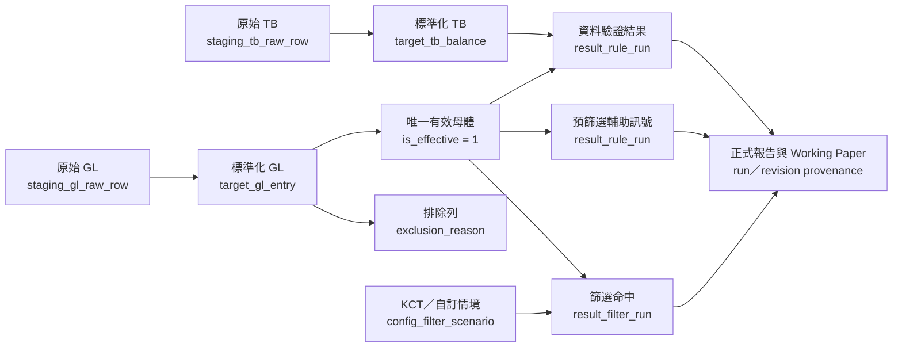

# JET 開發指南 (Journal Entry Testing — Single Source of Truth)

本文件是 JET 新系統唯一的深度參考。它涵蓋業務領域、規則規格、系統架構、資料策略、AI 協作方式與遷移計畫這幾個面向。

> **實作這個系統，你只需要讀這份文件，不需要逐行讀 `legacy/idea-script.bas` 那 11,000 行原始碼。**
> 如果你發現本文件有歧義或缺口，請直接修正本文件，不要照抄 VBA 的實作細節。
> 分工提醒：本文件定義**現行實作契約**；`legacy/idea-script.bas` 與 `legacy/jet-legacy-notes.md` 只對已有明確 legacy 映射的規則構成**審計語意 golden master**，不是所有現行功能的來源。要核對已映射規則是否忠於 legacy 語意，或執行使用者已裁示的報表填值落點工作時，才讀對應原文；KCT A–J 的 legacy 來源邊界見 §3，日常實作仍以本文件為準。

---

## 目錄

- [A. 業務與領域](#a-業務與領域)
  - [1. JET 是什麼](#1-jet-是什麼)
  - [2. 核心資料實體](#2-核心資料實體)
  - [3. 審計業務模型與六步工作流程](#3-審計業務模型與六步工作流程)
  - [4. 資料驗證規則](#4-資料驗證規則)
  - [5. 預篩選規則聲明式規格](#5-預篩選規則聲明式規格)
  - [6. 進階篩選邏輯](#6-進階篩選邏輯)
  - [7. 審計工作底稿](#7-審計工作底稿)
  - [8. 台灣在地化](#8-台灣在地化)
- [B. 技術決策](#b-技術決策)
  - [9. 技術約束與排除選項](#9-技術約束與排除選項)
  - [10. 為什麼選 .NET 10 + WinForms + WebView2 + HTML](#10-為什麼選-net-10--winforms--webview2--html)
- [C. 系統架構](#c-系統架構)
  - [11. 架構總覽](#11-架構總覽)
  - [12. 層級職責](#12-層級職責)
  - [13. SQLite / DuckDB / SQL Server Provider 策略](#13-sqlite--duckdb--sql-server-provider-策略)
  - [14. 專案結構規劃](#14-專案結構規劃)
  - [15. 命名與分層原則](#15-命名與分層原則)
- [D. 開發與協作](#d-開發與協作)
  - [16. AI-agent 開發工作流](#16-ai-agent-開發工作流)
  - [17. 從 idea-script.bas 遷移的做法](#17-從-idea-scriptbas-遷移的做法)
  - [18. 欄位對照表](#18-欄位對照表)
  - [19. 術語對照](#19-術語對照)

---

# A. 業務與領域

## 1. JET 是什麼

日記帳分錄測試（Journal Entry Testing，JET）是一種實質性審計程序，依 ISA 240 與 ISA 330 兩號審計準則執行。它要因應的是「管理階層凌駕控制（Management Override of Controls）」這項舞弊風險，也就是管理階層繞過內部控制去操縱帳務。

實務上，JET 針對一個會計期間內的全部日記帳分錄，依風險導向的條件做全母體篩選，目的是辨識出高風險或異常的分錄，交給審計人員後續調查。

管理階層通常透過下列幾種方式操縱財務報表，這些正是 JET 要鎖定的風險面向：

- 記錄虛構或不當分錄（特別是期末結帳前後）
- 不當的估計調整
- 隱匿或延遲認列

一言以蔽之，JET 要做的事就是從數十萬筆分錄裡，把有風險的那些分錄篩出來。

---

## 1.5 資料量規模與處理原則 (Non-Negotiable)

JET 的所有設計決策都由母體規模驅動。本節列出的原則沒有妥協空間，因此用「不可協商（Non-Negotiable）」標示。違反這些原則的程式碼，不管寫得多漂亮，在真實案件的資料量下都會崩潰，所以必須拒絕合入。

### 1.5.1 規模假設

下表界定設計時必須涵蓋的資料量範圍。「典型」指常見的案件規模，「上界」指系統在設計上必須能承受的極端情形。

| 維度 | 典型 | 上界 (必須能跑) |
|:---|:---|:---|
| GL rows | 約 **1,000 萬** 以下的 local persistent case | **10 億** rows 的 large-data / cloud case 設計上限 |
| TB accounts | 約 **1,000** | **1 萬** |
| AccountMapping rows | 數百 ～ 數千 | 1 萬 |
| SQLite path | 小於 1,000 萬 GL rows 的本機持久案件 | 不作為 10 億 row 執行引擎 |
| SQL Server path | 大於 1,000 萬 GL rows 或 cloud / shared data case | 10 億 row 等級的 set-based execution target，需採分析型索引策略 |
| Workpaper Excel 大小 | 數 MB ～ 數百 MB | 需以 OpenXML SAX writer 控制記憶體 |

ISA 240 要求對全母體執行 JET，不允許用抽樣來取代規則篩選。因此資料驗證、預篩選與自訂 filter 全部都必須以全母體為計算基底。

### 1.5.2 唯一允許的計算位置：資料庫引擎（Set-Based Pushdown）

規則計算只能在資料庫引擎內進行，也就是把計算「下推（pushdown）」到 SQL，以集合運算（set-based）一次處理整批資料。禁止在 Application 層（C# / LINQ）對 GL/TB 的資料列集合執行驗證（Validation）、預篩選（Rule）或進階篩選（Filter）規則，以下統稱 V/R/Filter 規則。所有規則都必須寫成 SQL，由 SQLite、DuckDB 或 SQL Server 引擎執行。

這樣規定有三個理由：
1. **記憶體**：1,000 萬筆 GL 列乘上 12 欄、平均每欄 50 byte，本身就已經是數 GB 等級。再加上 C# Dictionary 的額外 overhead，記憶體用量還會是 2 到 3 倍。把這些載進 Application 程序會直接 OOM（記憶體耗盡）。10 億列等級更只能交給資料庫引擎，搭配分頁與匯出管線處理。
2. **效能**：資料庫引擎的 hash join、index scan、parallel aggregation 比手寫 LINQ 快 1 到 3 個數量級。
3. **可重現**：SQL 規則可以單獨拿到資料庫工具裡重跑驗證，C# LINQ 規則做不到這點。

**正確的寫法**（對應 §13 的設計）：

```csharp
public interface IGlRepository
{
    Task<RuleResult> RunValidationAsync(ProjectId id, ValidationKind kind, CancellationToken ct);
    Task<RuleResult> RunPrescreenAsync(ProjectId id, RuleSpec rule, CancellationToken ct);
    Task<FilterResult> RunFilterAsync(ProjectId id, ScenarioSpec scenario, CancellationToken ct);
}
```

Repository 內部會生成 SQL，例如借貸不平測試會產生這樣的查詢：

```sql
SELECT doc_num, SUM(amount_scaled) AS net_scaled
FROM target_gl_entry
WHERE project_id = @projectId
GROUP BY doc_num
HAVING ABS(SUM(amount_scaled)) > 0;
```

**禁止的寫法**：

```csharp
var v2NullDocNums = gl.Count(r => string.IsNullOrWhiteSpace(GetGlVal(r, "docNum", mapping)));
// GL rows 被載入 Application 記憶體後以 LINQ 計算 → 規模禁忌
```

### 1.5.3 金額精度：資料庫計算一律使用 Scaled Integer

JET 的金額計算屬於審計證據，不接受浮點近似。問題在於 SQLite 沒有原生的 `decimal` storage class。如果把金額存成 `REAL`，`SUM` 與 `ABS(diff)` 這類運算可能出現浮點誤差。如果改用文字保存 decimal，跨 provider 聚合的語意又不穩定。

為了避開這兩個問題，資料庫的權威計算欄位一律使用 `BIGINT` 的縮放整數（scaled integer），也就是把金額乘上固定倍率後以整數儲存：

| 欄位 | 型別 | 說明 |
|:---|:---|:---|
| `AmountScaled` | `BIGINT` | GL 標準金額，正借負貸 |
| `DebitAmountScaled` | `BIGINT` | 借方金額，非負 |
| `CreditAmountScaled` | `BIGINT` | 貸方金額，非負或依 schema 統一為非負 |
| `ChangeAmountScaled` | `BIGINT` | TB 期間變動額 |
| `MoneyScale` | `INTEGER` | 專案層級金額 scale，例如 `10000` |

規則如下：

1. 匯入時先把來源金額轉成 `decimal` 驗證，再乘以固定的 `MoneyScale`。所採用的四捨五入策略必須寫入 project config。
2. SQLite、DuckDB 與 SQL Server 的 V/R/Filter SQL 只對 scaled integer 做 `SUM`、`ABS`、比較與取模運算。
3. 前端、報表與工作底稿要顯示金額時，再除以 `MoneyScale` 還原。
4. 所有 provider 必須用同一組 fixture 驗證 scaled 結果一致。

連續零尾數測試也應該用整數取模來判斷，不要用 `RIGHT` 或 `REPEAT` 這類各 provider 方言差異很大的字串函式。

### 1.5.4 Bridge 不得搬運完整資料列集合

WebView2 與 .NET 之間的 `postMessage` 通道是把 JSON 當字串傳遞的。如果對 100 萬列、數十欄的資料做 `JSON.stringify`，會出現三個問題：

- JS 端記憶體耗盡（OOM）。
- 序列化本身耗時超過 10 秒，並且阻塞 UI thread。
- 反序列化時 .NET 端還要再耗一次。

**規則**：

| 動作 | 正式契約要求 |
|:---|:---|
| `import.gl.fromFile` / `import.tb.fromFile` | `{ filePath, fileName?, mode? }`；handler 透過 file reader streaming 直入 DB；payload 不帶 rows |
| `validate.run` | 回 summary 數字 + `resultRef`；五種不同 row shape 的明細分別走 `query.completenessDiffPage`／`query.docBalancePage`／`query.nullRecordsPage`／`query.sourceQualityPage`／`query.infSamplePage` |
| `prescreen.run` | 回每條規則命中數 + `resultRef`；明細走 `query.prescreenPage` |
| `filter.preview` | 回 count、voucherCount 與 `previewRows`（上限 50）；preview 無狀態且沒有 `resultRef` |
| `query.*Page` | 使用 active project 與 keyset paging：各 action 的識別參數＋`{ cursor?, pageSize? }`；通常回 `{ rows, nextCursor }`，`query.filterHitsPage`／`query.infSamplePage` 則回 backend-owned `{ columns, rows, nextCursor }` |

以資料列為單位的 demo 與 import action 只是歷史相容路徑，不得出現在正式 UI、測試資料管線或新程式碼中。

五個開發 fixture action（`project.loadDemo` 與四個 `demo.export*File`）只在 Debug 與不可發布的 `AgentGuiTest` 組建註冊；Release composition 完全不含這些 handler，直接呼叫會得到 unknown action。靜態 `JetApi` facade 仍保留同名 method 供兩種開發組建使用，正式介面也不顯示入口。這項移除只限 Release wire，不刪除 deterministic fixture 型別，也不分裂 Domain 的 `ActionExecutionPolicy` 分類。

### 1.5.5 Excel 工作底稿採用 OpenXML SAX Writer

`export.workpaper` 預期會輸出多張工作表，明細層的總大小可達數百 MB。因此正式實作必須走 OpenXML 的 SAX writer（例如 `DocumentFormat.OpenXml` 的 `OpenXmlWriter`），大型明細列使用 inline string 寫出。禁止把整份 result set 先載入 `DataTable`、`List<>` 或 DOM workbook 之後再寫，否則同樣會撐爆記憶體。

ClosedXML 可以用來做小型 summary sheet 的實驗，但不得拿來當大資料量工作底稿的 writer。

### 1.5.6 Session State 只保存輕量指標

Session store 只能保存目前的 projectId、目前的 mappings、UI 暫態與最新的 resultRef。它不得持有 GL/TB 的資料列。GL/TB 的原始列一律落地到 `staging_*` 資料表，標準化後的資料落地到 `target_*`，規則結果落地到 `result_*`。

### 1.5.7 自我檢查清單

每次新增或修改 handler 時，請逐項自問下面幾題：

1. 我有沒有把任何 GL/TB 列集合載入 `List<>` 或 `Dictionary<>`，然後跑 LINQ？
2. 我有沒有讓 bridge 的 payload 或 response 攜帶超過 1000 列的明細？
3. 我有沒有建立 in-memory cache 去取代資料庫查詢？
4. 我的金額計算是否全程使用 scaled integer，而沒有用到 SQLite 的 `REAL` 或文字 decimal 聚合？
5. 我寫的 SQL 在 1,000 萬筆本機 GL、以及更大型的 SQL Server case 上，執行形狀合理嗎？也就是有沒有用 index、有沒有避免 `SELECT *`、有沒有用 keyset 分頁？
6. SQL Server 的大資料表，我有沒有評估過 columnstore 或 rowstore 輔助索引？
7. 我的 Excel 寫入是否使用 OpenXML SAX writer？

只要有任何一題違反上述的安全形狀，這個設計就需要重做。

---

## 2. 核心資料實體

整個 JET 系統只圍繞 5 個核心實體運作：總帳（General Ledger，GL）、試算表（Trial Balance，TB）、科目配對表（AccountMapping）、日期維度（DateDimension）與規則結果（RuleResult）。只要理解這五者的欄位與彼此的關係，就掌握了全系統的資料模型。

### 2.1 總帳分錄（GL，General Ledger）

每一筆 GL 代表一張傳票裡的一個分錄行，是 JET 主要的分析對象。

#### 必要欄位

| 標準欄位 | 型別 | 必填 | 說明 |
|:---|:---|:---|:---|
| `DocumentNumber` | string | ✅ | 傳票號碼 |
| `LineItem` | string |  | 同傳票內的分錄序號 |
| `Amount` | decimal | ✅ | 顯示 / DTO 用金額；DB 權威計算使用 `AmountScaled` |
| `AmountScaled` | long | ✅ | DB 標準金額，正借負貸，依 project `MoneyScale` 縮放 |
| `AccountCode` | string | ✅ | 會計科目編號 |
| `AccountName` | string |  | 會計科目名稱 |
| `DocumentDescription` | string |  | 傳票摘要 |
| `ApprovalDate` | date |  | 傳票核准日 (期末後核准、週末/假日核准規則必要) |
| `PostDate` | date |  | 總帳日期 |
| `VoucherDate` | date |  | 傳票日期 (選填；回溯過帳規則必要，比對過帳日是否早於傳票日) |
| `CreatedBy` | string |  | 編製人 (編製者彙總必要) |
| `ApprovedBy` | string |  | 核准人 |
| `SourceModule` | string |  | 來源子系統 (AP、AR、GL…) |
| `IsManual` | bool |  | 是否人工傳票 |

#### 衍生欄位 (匯入後計算)

| 欄位 | 計算 | 用途 |
|:---|:---|:---|
| `DebitAmountScaled` | `AmountScaled >= 0 ? AmountScaled : 0` | 編製者/罕用科目彙總 |
| `CreditAmountScaled` | `AmountScaled < 0 ? ABS(AmountScaled) : 0` | 編製者/罕用科目彙總 |
| `DrCr` | `AmountScaled >= 0 ? "DEBIT" : "CREDIT"` | 借貸方向 |

#### 金額模式（四選一）

不同 ERP 記錄金額的方式各不相同，因此匯入時由使用者指定採用哪一種模式：

| 模式 | 來源欄位 | 轉換為標準 `Amount` 的規則 |
|:---|:---|:---|
| `SignedAmount` | 單一金額欄 | 直接使用 (正=借、負=貸) |
| `AmountWithSide` | 絕對值 + 借貸別欄 | 借貸別 = "D" 取正，"C" 取負 |
| `AmountWithFlag` | 絕對值 + 借方標誌 (0/1) | flag=1 取正，flag=0 取負 |
| `DualAmount` | 借方金額 + 貸方金額 | `Amount = Debit - Credit` |

> **殘餘語意（legacy 差異，記錄不強修）。** side / flag 兩模式，JET 取來源金額欄的 `Math.Abs(magnitude)` 再依借貸別上號；legacy idea-script.bas 則保留原值、視借貸別乘 −1。兩者僅在「來源金額欄自帶負號」時分歧——正常 ERP 匯出（無號絕對值＋借貸旗標）兩者等價。JET 對「絕對值＋借貸別」契約更嚴謹，屬防禦性硬化，不改。

### 2.2 試算表（TB，Trial Balance）

試算表是各會計科目在會計期間內的餘額彙總，用於完整性測試（`completeness_test`）。

| 標準欄位 | 型別 | 說明 |
|:---|:---|:---|
| `AccountCode` | string | 科目代號 |
| `AccountName` | string | 科目名稱 |
| `ChangeAmount` | decimal | 顯示 / DTO 用期間淨變動額 |
| `ChangeAmountScaled` | long | DB 權威計算用期間淨變動額 |
| `OpeningBalance` / `ClosingBalance` | decimal | 顯示 / DTO 用期初 / 期末 |
| `OpeningBalanceScaled` / `ClosingBalanceScaled` | long | DB 權威計算用期初 / 期末 |
| `OpeningDebitBalanceScaled` / `OpeningCreditBalanceScaled` | long | DB 權威計算用期初借 / 期初貸 |
| `ClosingDebitBalanceScaled` / `ClosingCreditBalanceScaled` | long | DB 權威計算用期末借 / 期末貸 |
| `DebitAmountScaled` / `CreditAmountScaled` | long | DB 權威計算用本期借方 / 貸方合計 |

#### TB 變動金額計算模式（匯入時決定）

四種模式皆已實作（對應 legacy idea-script.bas 的 status_SA；wire `changeMode` 見 manifest 的 TB Mapping Keys 章）：

| 模式 | wire `changeMode` | 可用欄位（mapping key） | `ChangeAmount` 計算 | legacy |
|:---|:---|:---|:---|:---|
| `DirectChange` | `direct` | `amount` | 直接採用 | SA=1 |
| `DebitCredit` | `debitCredit` | `debitAmt` + `creditAmt` | `Debit - Credit` | SA=3 |
| `OpenClose` | `openClose` | `openingBalance` + `closingBalance` | `Closing - Opening` | SA=2 |
| `OpenCloseBySide` | `openCloseBySide` | `openingDebit` + `openingCredit` + `closingDebit` + `closingCredit` | `(ClosingDr - ClosingCr) - (OpeningDr - OpeningCr)` | SA=4 |

四種換算結果都進同一統一比較基準（借正貸負的本期變動 `change_amount_scaled`，與 `DirectChange` 同語意）；**定標順序＝逐欄解析 decimal → 以 decimal 運算 → 尾段單次 `MoneyScaling` 定標**（away-from-zero 只在尾段套一次，與 GL `DualAmount`、TB `DebitCredit` 既有慣例及 legacy IDEA equation 語意一致；「每欄先定標再相減」是不同的捨入機制，勿照此改碼），完整性測試（§4）等下游零改動。每種模式要求一組必填欄位，缺漏由 `mapping.commit.tb` 以 `missing_required_mapping` 擋下；跨模式殘留指派由前端切模式時清除、後端投影僅讀當前模式欄位（多餘指派被忽略，不報錯）。

> **領域背景：為何 TB 比對的是「本期變動」而非餘額。** 會計科目編號開頭的碼段決定了這個科目的時間語義。開頭是 `1` 到 `3` 的屬於資產、負債、權益，是資產負債表科目，有期初與期末的累計餘額概念，它的本期變動等於期末減期初。開頭是 `4` 到 `7` 的屬於收入、費用之類的損益表科目，記的是當期數值、每期歸零，因此當期數本身就是本期變動。
> 這正是上表 `OpenClose` 與 `OpenCloseBySide` 這兩個模式存在的理由。它們把資產負債表科目的期初與期末推算成「本期變動」，讓這些科目能和 GL 的本期借貸彙總落在同一個基礎上比對（這就是完整性測試，見 §4）。損益表科目的當期數則可以直接當成本期變動使用。
> 這一段講的是領域語義。要注意的是，變動模式是在匯入時決定的（見上表），不是規則程式裡依科目碼做的分支。

#### 操作指引：期初 / 期末分屬兩檔的案件

有些客戶給的不是一張含期初、期末兩欄的 TB，而是兩個檔（例如期初TB.csv＋期末TB.csv），各自只有一欄餘額。這種案件的標準路徑是：

1. **先在 Excel（或其他外部工具）以科目編號 join 成一張寬表**：把兩檔依科目編號對齊，成為單一含「期初餘額、期末餘額」兩欄的寬 TB（四欄借貸版同理，join 成期初借、期初貸、期末借、期末貸四欄）。這一步和 legacy 當年在 IDEA GUI 以「All records in both files」手動前置 join 的做法一致——legacy 的 idea-script.bas 本身也只讀 join 後的單一檔。
2. **再以 `OpenClose` 或 `OpenCloseBySide` 模式配對匯入這張寬表**，由 JET 算出本期變動。

要特別說明的限制：**JET 的「加入來源」（`import.append`）是垂直堆疊、不做 key join。** 它要求各來源欄位集合完全一致、把列往下續接成同一母體，並不會依科目編號把兩檔橫向合併成寬表。因此「兩檔各一欄餘額」的橫向 join 必須在匯入前於外部完成，不能靠「加入來源」達成。

> **2026-07-31 需求銷帳：** JET 不新增依科目編號 full-outer join 期初／期末 TB 的匯入模式。這種鍵值合併會改變現行多來源匯入「同欄位垂直 append」的整體語意；外部先合併成單一寬表仍是唯一權威流程，日後不得把已取消需求誤列為待辦。

### GL／TB 欄位權威目錄

GL／TB 欄位語意集中在 Domain 的 internal `JetFieldCatalog`。目錄同時記錄 semantic field identity、來源 mapping slot、欄位型態與順序、各 mapping mode 的必填性、正式表 storage nullability、semantic SQL target、顯示標籤，以及可為 null 的正準中文名。GL 的 `debitAmount`、`creditAmount`、`dcField` 與 `dcDebitCode` 都是產生 `amount` 的來源位置；TB 各種金額位置則共同產生 `changeAmount`。因此來源位置不等於正規化後的語意欄位，從來源位置查到的 SQL target 與 filterability 都描述它所產生的 semantic output，不表示該位置可直接用作 SQL filter。

Mapping requiredness 與 storage nullability 是兩個獨立維度。像 `docNum`、`postDate`、GL／TB 的 `accNum` 必須完成來源配對，但正式表中的個別列值仍可為 NULL；scaled amount target 不可為 NULL，但使用者必須配對哪一組來源金額位置，取決於選定的 GL／TB mode。目錄不得把其中一種必填性推導成另一種。

既有 public `GlMappingKeys`、`TbMappingKeys`、`GlFieldWhitelist` 與 `GlCanonicalNames` 都是這份目錄的相容投影。Schema v7 契約加入選填 `postingStatus` slot；它在「前端工作流整合」階段隨過帳狀態政策編輯器一併曝光到配對畫面，因此 `IncludeInMappingUi` 已改為 true。`MappingValidator`、欄位全空警示、backend filter label 與 WorkingPaper 現行 Field Info 相容 renderer 也消費同一份 metadata；Validation Field Info 已改讀保存的 target TableDef facts，見 §7.2。目錄本身不產生 provider DDL、wire contract 或 frontend code；runtime frontend 只鏡射 `IncludeInMappingUi=true` 的固定 slots，任何新的 contract-only slot 要曝光，都必須和前端 workflow 在同一變更包調整並通過 mirror guard。

### 2.3 科目配對表（AccountMapping）

科目配對表把企業自己的科目對應到一組標準化分類，用於未預期借貸組合規則與科目配對分析（見 §6.1）。

| 欄位 | 說明 |
|:---|:---|
| `AccountCode` | GL 科目代號 |
| `AccountName` | 科目名稱 |
| `CategoryId` | 穩定 taxonomy identity；built-in 為 `builtin.revenue` / `builtin.receivables` / `builtin.cash` / `builtin.receipt_in_advance` / `builtin.others` |
| `StandardizedCategory` | v7 過渡相容 label；舊 writer／reader 可繼續讀寫，規則身份逐階段改以 `CategoryId` 為準 |

Schema v7 的 `config_account_taxonomy` 以 replace-all revision 保存 ID、label、ordinal、semantic role 與 built-in flag。v6→v7 依既有五個 exact label 按原順序建立 built-ins，並把可辨識的 `target_account_mapping.standardized_category` backfill 成 ID；無法辨識的值不猜測。`accountTaxonomy.save` 採 optimistic revision：內建五個 ID 不可刪、semantic role 不可改；新增 custom 省略 ID，由後端產生 `custom.<32 lowercase hex>`，之後沿用同一 ID。label 以 trim 後不分大小寫保持唯一，ordinal 為不重複非負整數，semantic role 可由 custom 指定。仍被 AccountMapping 或已存 filter scenario 精確引用的 custom 不可刪；revision 檢查、引用檢查、replace 與 prescreen／filter 結果失效在同一 provider transaction 完成。taxonomy label／ordinal 可改，但商業規則只比較 semantic role，不比較顯示文字。

#### 科目配對範本產生（`export.accountMappingTemplate`）

完整性測試之後，工具可產出一張**空白科目配對範本** `.xlsx` 讓審計員填分類，填完 C 欄後原檔上傳回 `import.accountMapping.fromFile`（round-trip；審計員不必從零手做翻譯表）。

- **母體＝GL∪TB（不是只有 GL）**：範本科目清單取自完整性測試的 `diff` 集合（`JET.AuditCore.ValidationProcedures.CompletenessDiffCte` 的有效 GL 逐科目彙總與 TB 以 FULL OUTER JOIN 併集；GL 側 `is_effective=1`、TB 側取全部）。理由：審計員要能對「出現在 GL 或 TB 任一邊」的每個科目指定分類——GL-only 科目也進測試母體、預篩選／科目配對分析會用到其類別。
- **三欄格式（與匯入契約反向對齊）**：標頭採 legacy 契約名 `GL_NUMBER`／`GL_NAME`／`STANDARDIZED_ACCOUNT_NAME`，逐一被 `AccountMappingColumnResolver` 的關鍵字（`gl_number`／`gl_name`／`standardized`）命中。A=科目編號、B=科目名稱、C=**空白 + 下拉**；下拉逐次讀目前 project taxonomy 的 ordinal 順序，包含五個 built-ins 與所有 custom labels。匯入接受目前 taxonomy 的 label（trim 後不分大小寫）或 exact category ID；C 欄空白依 legacy 實際行為投影為 `builtin.others`，未知非空白值回 `projection_failed` 並使整批 rollback。
- **預覽語意**：右側「科目配對」預覽讀最新匯入批次的 staging 三欄，而不是只讀 target。這讓 C 欄仍空白的合法列保持可見；預覽是有界的來源查閱，不改變預篩選與進階條件仍只以 `target_account_mapping` 為權威的規則邊界。
- **對 sheet 15 的刻意偏離**：匯出底稿 sheet 15 對 GL-only 科目的名稱欄寫字面「Not in TB」；範本的 B 欄則寫該科目**真實的 GL 名稱**——審計員要靠名稱辨識科目才能正確分類，故此處刻意不沿用「Not in TB」。
- 正式流程由 `export.validationArtifacts` 在 validation run 的原子三檔批次內產生；`export.accountMappingTemplate { runId }` 只供同一 run 的單檔重試。兩者都由 project-local artifact store 落在目前專案目錄，不接受 `outputPath`；新產生的 Excel 檔名一律使用精確小寫 `.xlsx` 副檔名。母體為空時以 `no_target_data` 擋下。
- **直接填範本現況**：production `AccountMappingTemplateWriter` 先複製固定 `AccountMapping.xlsx`，再由 internal allowlist editor 以 forward-only XML 只重寫 `AccountMapping`／`List` worksheet parts；不再建立第二本 current-result workbook。`AccountMapping` 的資料區是第 4 列至實際末列，`List` 的資料列、dimension 與 validation formula 依 project taxonomy 動態伸縮；styles part 只追加由範本 A／B prototype 衍生的兩個 locked cellXf。來源範本本身、shared strings、workbook、relationships、drawing、圖片與 printer settings 不變。
- **A2 後端權威鏡像**：輸出副本的 A2 由後端 writer 依本次 taxonomy labels 組成「允許分類僅限 …」說明；既有 style、merge、row height 與來源 shared string 均保留。前端或範本不得另維護一份分類清單。

### 2.4 日期維度（DateDimension）

日期維度是審計期間內每一天的屬性表，用於週末與假日的過帳、核准規則。

| 欄位 | 說明 |
|:---|:---|
| `DateKey` | YYYYMMDD |
| `FullDate` | 日期 |
| `DayOfWeek` | 1=日 … 7=六 |
| `IsWeekend` | 依專案的非工作日週幾設定判定（`calendar.setNonWorkingDays`，未設定時預設週六日）；對齊 legacy `#Weekend` 每週各日工作日表 |
| `IsHoliday` | 由使用者上傳的假日曆覆寫 |
| `IsMakeupDay` | 補班日 (假日曆的例外) |
| `HolidayDesc` / `MakeupDayDesc` | 說明 |

假日與補班日的名稱（`HolidayDesc` 與 `MakeupDayDesc`）存放在 `staging_calendar_raw_day.day_name`，由行事曆檔案匯入時一併帶入（見 §3.1）。如果走的是以 `dates` 陣列匯入的相容路徑，名稱會是 null。

日期維度的流程完成狀態不由資料筆數推測。任一假日／補班 replace 成功後，`project.json` 會保存 `calendarImported:true`，因此合法零筆檔案與從未成功匯入可以區分；每週非工作日只要曾明示保存，既有 `nonWorkingDays` 欄位本身即構成另一個完成依據。`project.load` 分別回傳 `calendarImported` 與 `nonWorkingDaysConfigured`，前端只鏡射兩者，不另算規則。

### 2.5 規則結果（RuleResult）

規則結果記錄每一條規則執行後產生的標記與狀態。

| 欄位 | 型別 | 說明 |
|:---|:---|:---|
| `RuleSlug` | string | 命名登錄表的 slug（例 `post_period_approval`，見 §4） |
| `DocumentNumber` | string | 被標記的傳票 |
| `LineItem` | string | 被標記的分錄行 (可為空，表示整張傳票) |
| `Status` | enum | `V` (有結果) / `N/A` (無結果或未執行) |
| `TagColumn` | string | 結果標記欄名，由 slug 推導 (例 `tag_post_period_approval`) |

**結果失效不變量（衍生資料，不可協商）**：規則結果必須對應到它真正讀取的上游資料。失效不能一律全清，也不能少清。GL 匯入或 GL 重投影會清除 validation、prescreen 與 `result_filter_run`，因為三者都讀 GL 母體。TB 匯入或 TB 重投影只清 validation；prescreen 與 filter 命中不讀 TB，所以必須保留。科目配對、授權編製人員清單與行事曆匯入只清 prescreen 與 filter 命中，不清 validation。這使正式流程可以先執行 validation、匯入剛產生的 AccountMapping，再接著執行 prescreen，而不用重跑不受影響的 validation。

「保留不受資料依賴影響的衍生結果」不等於後續流程仍可繼續。完整性硬閘另要求目前資料世代存在適格 validation run：因此 TB 匯入／重投影雖保留既有 prescreen 與 filter 命中，`prescreen.run`、`filter.commit` 與完整性下游正式報表仍會暫停，直到重新執行 validation 且完整性適格。這個 workflow gate 與依賴矩陣各自回答「哪些結果需重算」及「目前能否繼續」，不得以全清結果取代其中任一層。

清除動作與上游改寫在同一個 transaction 內完成。上游 rollback 時，清除也跟著回退，所以不會出現資料與結果只改一半的狀態。情境定義和共同 revision 不因命中資料失效而刪除；需要明細時，`filter.commit` 或分頁查詢會依目前資料重新 materialize。實作的單一入口是 `RuleRunResultReset.ClearWithinAsync`；呼叫端只傳入具名的上游改寫事件 `AuditMutation`，Domain 的 `AuditDependencyPolicy` 再把該事件唯一映射成應清除的 `AuditDependencyImpact`，repository 不自行決定失效範圍。

Schema v7 另以 singleton `config_result_stale_state` 持久化 validation／prescreen／filter 三個布林狀態。只有「該類結果實際存在後又被 mutation 失效」才設為 true，從未執行仍是 false；成功發布同類新結果時在同一 transaction 清回 false。Filter 的存在性看已發布的情境 definition／revision，而不是命中列數：合法執行可以是 0 命中，所以 `result_filter_run` 為空不能冒充 never-run。`SchemaV7Migration` 影響三類結果，`AccountTaxonomy` 只影響 prescreen 與 filter；兩者仍共用上述 policy 與 reset 入口，不在 migration 或 provider repository 複製第二份失效矩陣。Artifacts 不參與資料庫 transaction：migration 保留 manifest 與檔案，下一次 `project.load` 依其 source reference 惰性標記既有 `reportArtifacts[*].stale`。

Validation 與 prescreen 的 `resultRef` 另帶 `logicVersion`。它是持久化摘要與目前規則／明細 SQL 的相容版本；規則集合、判定方式或明細集合語意改變時，必須推進對應常數。`project.load` 不回放缺少或不符合目前版本的摘要，正式報告也拒絕使用，避免升版後把舊摘要和新 SQL 混在同一份報告。

`source_row_number` 是唯一一個可以跨重投影持久化的批次穩定鍵。`entry_id` 是 AUTOINCREMENT，重投影後會重新編號，所以不能拿來當跨重投影的持久參照。正因如此，INF 抽樣才改以 `source_row_number` 排序（見 §4）。

### 2.6 三層表名登錄（AuditCore 的單一事實來源）

JET 的審計方法學承襲自一套 legacy 的 Excel-VBA 工具。那套工具的資料表是一個乾淨的三層結構，分別是來源層（Source，受查者提供的資料原貌）、暫存層（ETL-Staging，標準化後的測試母體）與報表層（Target-Report，可判讀的結果），並且以審計詞彙命名，例如 `JE_PBC`、`JE`、`ACCOUNT_MAPPING` 等。現行系統的實體資料表則改用工程詞彙命名，例如 `staging_gl_raw_row`、`target_gl_entry` 等。

為了讓審計人員看到熟悉的審計名稱、同時又不冒任何審計邏輯上的風險，本系統採用一種「只加不改」的 metadata 模型。實體表名維持不變，另外建立一份中央表名登錄，把每張實體表對應到它的正準審計名、所屬層、曝光程度與一句中文說明。這份登錄是程式內的單一事實來源，放在 AuditCore 的 internal `JetSchemaCatalog`。它不依賴任何框架、不做 I/O，只承載純審計詞彙與 metadata。資料預覽日後會改以登錄的正準名呈現，不過那是後續任務，本節只描述登錄本身。

**為什麼不直接把實體表改名（一個顯式的取捨，由使用者拍板）。** 全庫約有 341 處 inline SQL 直接以實體表名查詢。如果真的去改實體表名，等於要改掉全部這些 SQL、加上一次 schema migration、再重跑整套驗證，對已經穩定的審計計算來說風險很高。改用「登錄才是事實來源、實體表名一律不動、不加 migration、不改任何 inline SQL」這個只加不改的模型後，審計邏輯的風險為零。代價是多了一層名稱對照，但這層對照由 `JetSchemaCatalog` 集中吸收，呼叫端只透過一組窄查詢介面（`All`、`ByAudience`、`ByLayer`、`ResolveCanonical`、`TryGet`）取用，不需要知道對照的細節。

**層（Layer）表達的是審計語義，不是實體表的前綴。** 登錄裡的「層」描述的是資料在審計流程中扮演的角色，依序是來源、暫存、報表、系統。這跟實體表名的前綴（`staging_`、`target_`、`result_`、`config_`，見 §13 的「Schema 分層」）是兩條不同的軸，兩者不能混為一談。舉例來說，`target_account_mapping` 的實體前綴是 `target`，但在審計語義上它其實是 Source，因為科目對照是受查者提供的。同樣地，`staging_calendar_raw_day` 的實體前綴是 `staging`，但審計語義上它也是 Source，因為假日曆也是受查者提供的。登錄是依正準名來分層，而不是依實體前綴。

**曝光程度（Audience）** 決定資料預覽與結構總覽要如何呈現某張表：

| 曝光 | 意義 |
|:---|:---|
| `DataView` | 可逐列瀏覽，且出現在結構總覽（審計工作流程會直接接觸的資料） |
| `StructureOnly` | 出現在結構總覽，但此處不開放逐列瀏覽（結果與組態，語義以摘要或專用頁呈現） |
| `Hidden` | 純系統或 ETL 暫存 scratch，完全不對外曝光 |

下表是「實體表 → 正準名 → 層 → 曝光」的完整對照，涵蓋 schema v7 專案資料庫全部實體表，以 Infrastructure 的 fresh-create／migration schema inventory 為準逐一登錄：

| 實體表名 | 正準審計名 | 層 | 曝光 | 說明 |
|:---|:---|:---|:---|:---|
| `staging_gl_raw_row` | `JE_PBC` | Source | DataView | 匯入原貌 GL（受查者提供，未標準化） |
| `staging_tb_raw_row` | `TB_PBC` | Source | DataView | 匯入原貌 TB（受查者提供，未標準化） |
| `target_account_mapping` | `ACCOUNT_MAPPING` | Source | DataView | 科目 → 標準化分類對照 |
| `target_authorized_preparer` | `AUTHORIZED_PREPARER` | Source | DataView | 授權編製人員清單 |
| `staging_calendar_raw_day` | `DATE_DIMENSION` | Source | DataView | 日期維度：假日 / 補班日 |
| `target_gl_entry` | `JE` | Staging | DataView | 全部成功正規化的 raw 分錄；`is_effective`／`exclusion_reason` 形成唯一測試母體分割 |
| `target_tb_balance` | `TB` | Staging | DataView | 標準化試算表餘額（本期變動額） |
| `result_rule_run` | `VALIDATION_OVERVIEW` | Target | StructureOnly | 資料驗證 / 預篩選結果摘要 |
| `result_filter_run` | `FILTER_HITS` | Target | StructureOnly | 進階篩選命中的行層落地 |
| `result_inf_sampling_test_sample` | `INF_SAMPLE` | Target | StructureOnly | INF 抽樣抽中的分錄樣本 |
| `config_field_mapping` | `FIELD_MAPPING_INFO` | System | StructureOnly | 已提交的欄位對應（GL / TB 各一列） |
| `config_filter_scenario` | `FILTER_CRITERIA` | System | StructureOnly | 使用者著作的進階篩選情境（條件樹） |
| `import_batch` | `IMPORT_BATCH` | System | StructureOnly | 匯入批次（每個資料集一筆） |
| `import_batch_source` | `IMPORT_BATCH_SOURCE` | System | StructureOnly | 匯入批次的多來源明細 |
| `gl_control_total` | `GL_CONTROL_TOTAL` | System | Hidden | 完整性 part(a) 控制總數（中間計算） |
| `app_message_log` | `APP_MESSAGE_LOG` | System | Hidden | 前端狀態與訊息（UX 輔助，非審計留痕） |
| `schema_info` | `SCHEMA_INFO` | System | Hidden | schema 版本（遷移鏈判斷用） |
| `staging_account_mapping_raw_row` | `ACCOUNT_MAPPING_PBC` | Staging | Hidden | 科目配對匯入原貌暫存；實體表不曝光，`accountMappings` 只以固定三欄有界預覽 |
| `staging_authorized_preparer_raw_row` | `AUTHORIZED_PREPARER_PBC` | Staging | Hidden | 授權編製人員匯入原貌暫存（ETL scratch） |
| `config_gl_rde_field` | `GL_RDE_FIELD` | System | Hidden | GL RDE stable field definition 與 ordinal |
| `target_gl_rde_value` | `GL_RDE_VALUE` | Staging | Hidden | 非空白、依型別保存的 GL RDE value |
| `config_account_taxonomy` | `ACCOUNT_TAXONOMY` | System | StructureOnly | 科目 taxonomy identity、role 與 revision |
| `config_result_stale_state` | `RESULT_STALE_STATE` | System | Hidden | validation／prescreen／filter 持久失效狀態 |

**計算檢視（衍生資料，不落地成表）。** legacy 的 `COMPLETENESS_CALCULATED`、`COMPLETENESS_DIFF`、`COMPLETENESS_DETAIL` 與各個 `*_OVERVIEW`，在本系統都是查詢當下才以 CTE 算出的檢視。Legacy `JE_IN_PERIOD`／`JE_NOT_IN_PERIOD` 不另建實體表：期間與 posting policy 已在 GL projection 同一交易內落成 `is_effective`／`exclusion_reason`，下游只讀這個分割，不在 query 層重算。這些衍生名稱不列入實體登錄，也不該為它們臆造資料表。

**漂移守門。** 登錄與真實 schema 是否一致，由兩道測試把關。第一道是 AuditCore 單元測試，負責鎖住結構不變量（實體名與正準名都唯一、每一筆都有層與曝光、曝光表的正準名非空），並逐表比對決策（physical 對應到 canonical、layer、audience，只要改動任一項測試就轉紅）。第二道是 Infrastructure 測試，它用真的 SQLite 建一個全新的專案庫，查 `sqlite_master` 取出全部使用者表，再跟登錄做雙向比對。這道測試的用意是：日後如果新增了實體表卻忘了登錄（漏登錄），或登錄了一張其實不存在的表（幽靈條目），測試都會轉紅。

---

## 3. 審計業務模型與六步工作流程

JET 的邊界從查核團隊把 PBC（Provided by Client，受查者提供資料）帶入案件開始，到可追溯的測試結果與底稿為止。JET 不替查核員理解交易背景，也不把任一預設訊號直接宣告成高風險結論；它保存來源、把資料投影到一致語意、以資料庫執行規則，並留下足以讓一般審計員（General Auditor，GA）判讀與追查的結果。

### 上游 PBC 脈絡

GA（包含參與 KCT 方法學小組的審計員）在 JET 之外向受查者取得 GL、TB 與必要輔助資料，先確認欄位意義和期間。有些來源必須在外部先整理成一個可解釋的欄位，例如把多個原始文字欄合併為完整傳票摘要，或把分開提供的期初／期末 TB 依科目對齊成一張寬表。這些是 PBC 整理，不是 JET 的規則計算；JET 不應猜測缺失的交易語意，也不把 `import.append` 誤用成橫向 join。整理完成後，原始檔才進入案件的匯入與欄位配對。

### 六步業務流

畫面與 `ProgramGraph` 共用下列六步編號。底稿中的所有 `stepN`／`stepN-M` 是審計方法學分頁名稱，不是這套畫面步驟；兩者不得混用。


| 步驟 | 業務意圖 | 後端權威結果 |
|:---|:---|:---|
| 0 建立案件 | 固定案件識別、查核期間、provider 與本機資料邊界 | project session／project metadata |
| 1 匯入資料 | 保存 GL／TB 與輔助來源的原貌及批次身分 | staging rows、import batch |
| 2 欄位配對 | 把來源欄位投影為 GL／TB 正準欄位，建立唯一有效母體分割 | committed mapping、`target_gl_entry`／`target_tb_balance` |
| 3 資料驗證與測試 | 先證明母體完整、平衡且可測；預篩選只提供一般風險訊號、摘要與明細入口，供 GA 自由選用、判讀或後續重用 | validation run、選用的 prescreen run |
| 4 進階條件篩選 | KCT A–J 是實務主線；GA 可組合 KCT、預篩選述詞與自訂條件，收斂出要測試的分錄 | filter definition revision、materialized hits |
| 5 匯出底稿 | 把選定 run／revision 與結果寫入正式報告，保留資料版本與條件留痕 | report artifacts、Working Paper |

> **審計方法論對照。** 最終底稿仍服務五段工作：① 母體完整性、借貸不平與編製者彙總；② 攸關資料元素（Relevant Data Elements，RDE）可靠性測試；③ 高風險範圍條件彙總；④ 符合高風險條件之分錄測試；⑤ 財務報表關帳後的調整分錄。五段方法學內容和六步工具流程是不同維度，不得再以「Step N」互相代稱。

### 資料生命週期

來源資料與衍生結果分層保存；任何規則結果都不回寫或覆蓋原始 GL／TB。



`target_gl_entry` 保存所有成功正規化的 GL 列，再以 `is_effective`／`exclusion_reason` 做互斥分割；validation、prescreen、filter、INF、tag matrix 與正式報告都只讀同一份有效母體。Validation 另讀 TB 與來源控制總數；prescreen 與 filter 不讀 TB。情境定義和命中是不同生命週期：上游變更可使命中失效，但定義與 revision 仍保留供重新驗證與保存。精確失效矩陣見 §2.5。

### 從業務決定到程式責任

| 邊界 | 在這套模型中的責任 | 不得承擔 |
|:---|:---|:---|
| Frontend | 收集欄位配對、KCT／自訂條件與參數；鏡射後端狀態、摘要、分頁與錯誤 | 不判定母體、N/A、風險命中或 SQL |
| Host／Bridge／Dispatcher | 提供視窗／檔案能力、收送 JSON、依 action 分派 | 不放審計規則或 provider 分支 |
| Application | 解析 payload、組裝 session／mapping context、協調 typed lifecycle、保存與 wire DTO | 不在記憶體重算 GL／TB 規則 |
| AuditCore | 擁有程序前置、N/A、有效母體述詞、規則述詞、條件 AST 驗證後的計畫與 SQL 編譯語意 | 不做 I/O、不建立 provider 連線 |
| Domain | 擁有純契約、欄位目錄、taxonomy identity、失效政策與通用不變量 | 不依賴外層框架或資料庫 |
| Infrastructure | 保存來源與結果、綁定參數、套用 SQL 方言、在 SQLite／DuckDB／SQL Server 執行集合式查詢並寫出產物 | 不自行裁定審計語意 |

詳細依賴方向與例外仍以 §11–12 為準；本表只把同一架構翻成業務資料流的責任語言。

### 篩選條件轉換鏈

KCT 卡、預篩選述詞與自訂條件都收斂到同一份條件 AST。`prescreen` 類規則在 filter 中直接重用 `GlRulePredicates` 即時計算，不讀取先前 `prescreen.run` 的命中檔或 `result_rule_run`。

```mermaid
flowchart LR
  draft["前端條件草稿<br/>ui-core.js: FILTER_KCT_CHECKLIST／FILTER_RULE_TYPES<br/>filter-step.js: newFilterRule／toWireScenario"]
  transport["JSON action 邊界<br/>jet-api.js: filter.preview／filter.commit<br/>JetWebMessageBridge／ActionDispatcher.DispatchAsync"]
  app["Application 解析與 context<br/>FilterPreviewHandler／FilterCommitHandler<br/>FilterScenarioPayloadParser"]
  plan["Typed lifecycle 與驗證<br/>FilterProgram.Plan／ExecuteAsync／Finalize<br/>FilterScenarioValidator.Validate"]
  compile["provider 中立編譯<br/>GlFilterWhereBuilder.BuildPlan<br/>GlRulePredicates／GlPopulationScopeSql"]
  execute["provider 執行<br/>FilterFactsPort<br/>LocalFilterRunRepository／LocalFilterCommitRepository<br/>SqlServerFilterRunRepository／SqlServerFilterCommitRepository<br/>FilterSqlPlanBinding＋ISqlDialect"]
  result["有界預覽或原子發布<br/>FilterScenarioSummaryRenderer<br/>config_filter_scenario／result_filter_run"]

  draft --> transport --> app --> plan --> compile --> execute --> result
```



每個節點只有一種權威：前端決定使用者送出的 AST 形狀；Application 決定 wire 與 orchestration；Domain／AuditCore 決定合法性和命中語意；Infrastructure 只執行參數化 plan。完整 AST 契約見 action manifest 的 Filter / Criteria 章，精確布林與 `sameVoucher` 語意見 §6。

### 預篩選與 KCT 的定位

- **預篩選是輔助條件。** 它提供一般常見的初步訊號、彙總與 Pre-screening Report；在業務模型上由 GA 自由選用與判讀，也可在進階篩選中把 row-tag 述詞當成條件來源。它不是審計必要程序，也不自行決定「真正高風險」範圍。歷史上把它排在進階篩選之前，是為了提前取得部分彙總資訊並預先建立結果，節省後續計算。
- **KCT A–J 是實務主線。** 現行 repository 已登錄十張卡與其執行對應；A／C／D／H／J 使用專屬 filter type，E／F／G／I 重用既有型別或 prescreen 述詞，B 保留為未實作的 Phase 2。
- **執行順序與報告 provenance 分開。** `stepGate` 只要求目前 validation 的後端完整性裁定適格；GA 不先執行 prescreen 也可進入進階條件篩選。Pre-screening Report 綁目前 prescreen run；Criteria Selection 與 Working Paper 只綁 validation 與 filter revision，所以不執行 prescreen 也能完成正式報告鏈。prescreen 失效只連坐 Pre-screening Report；validation 或 filter 失效仍使後兩份報告 stale。
- **Pre-screening Report 是預設輸出、但仍可取消。** 步驟五匯出面預設把 Pre-screening Report 納入輸出家族（勾選框預設勾選）。有目前有效的 prescreen run 時，按下產生就一併輸出；沒有時畫面先明示「會先執行一次預篩選」，使用者按同一顆按鈕即依序補跑並產出。取消勾選只少這一份，其餘報告與 Working Paper 內容不受影響；完整性不適格時無法補跑，匯出面只保留 Working Paper。這只是前端以既有 action 編排的序列，`prescreen.run`、`export.prescreenReport` 與 `export.workpaperStream` 的判定語意、provenance 與 step gate 都沒有改變——Criteria Selection 與 Working Paper 仍不綁 prescreen。
- **步驟四的呈現主次。** `creator_summary`（依分錄編製者彙總）與 `rare_accounts`（較少使用之科目）是常用母體判讀面，執行預篩選後在原步驟直接主要呈現；其餘 row-tag 命中與既有 `query.prescreenPage` 明細入口收在「逐筆輔助訊號」次要區。可見定位文案由 AuditCore `PrescreenPositioningRenderer` 形成，Application 只轉成 `prescreen.run.positioning` wire，前端只鏡射；舊摘要缺欄時使用受 mirror 守衛鎖定的逐字 fallback。執行 `prescreen.run` 只更新結果，不自動匯出；步驟四保留獨立的「先產生」入口。

| KCT 項目 | 現行通用定義 | 執行對應／狀態 |
|:---|:---|:---|
| A | 季末前指定天數內的收入借方分錄 | `revenueDebitNearQuarterEnd`；天數由 GA 輸入 |
| B | 借記固定資產（不含在建工程）且貸記費用 | Phase 2；待完整 BS／IS／PPE 分類清單，尚無 wire type |
| C | 收入貸方但缺少一般對方科目借方 | `revenueWithoutNormalCounterpart` |
| D | 收入類人工分錄 | `manualRevenueEntry` |
| E | 特定人員建立的分錄 | `text(createBy, exact)` 預填 |
| F | 摘要含 GA 指定文字 | `customKeywords` 預填 |
| G | 摘要為空白 | `prescreen(blankDescription)` 預填 |
| H | 主單位整數金額符合 GA 指定尾數 | `trailingDigits` |
| I | 非營業日過帳 | `prescreen(weekendPosting OR holidayPosting)` 預設群組 |
| J | 編製人員與核准人員相同 | `preparerEqualsApprover` |

**Legacy 查證邊界。** `legacy/idea-script.bas`、`legacy/idea-tool.bas` 與 `legacy/drawio/JE_diagram.drawio` 都沒有 KCT 名稱、A–J 清單、B 的分類表或一份十條原始參數定義。它們只證明部分通用機制早已存在，例如特定人員／摘要、空白摘要、尾數、人工分錄與非工作日；其中 `idea-tool.bas` 的預篩選畫面還明載這些程序只供初步判斷、本身不是實際高風險範圍條件。故上表是**現行 repository 契約的登錄**，不得冒稱由 legacy 還原；KCT 原始來源、KCT 全稱與 B 的完整分類清單仍待使用者提供。§6.2–6.3 保存已落地條件的精確述詞與參數邊界。

> **狀態：六份正式報告已完成內嵌範本整合、自動化驗證與既有人工驗收。** Validation／AccountMapping／INF 在驗證後原子發布，Pre-screening 綁 prescreen run，Criteria Selection 綁 validation run、revision 與完整 positions，步驟 5 再依所選情境產出 Working Paper，並預設把 Pre-screening Report 一併納入該次輸出（可取消）。Infrastructure 先複製隨 JET 發布的固定範本，再只把目前專案的動態結果填入副本；不要求使用者選擇範本。詳見 §7.2；前端現況見 `docs/jet-frontend-description.md`。

### 3.1 匯入格式與案件設定

正式匯入格式支援 `.xlsx`、`.csv` 與 `.txt`，其中 `.txt` 的內容一律當成 CSV 文字處理。若未來要新增格式，必須先更新本文件與 `docs/action-contract-manifest.md`，再去補對應的 reader 與 handler。

#### 3.1.1 文字檔（.csv / .txt）讀取規則

- **編碼偵測**：採確定性的判斷鏈，不做啟發式猜測。先看 BOM（可分辨 UTF-8、UTF-16 LE/BE）。若沒有 BOM，就用嚴格的 UTF-8 解碼去驗證取樣段，能通過就判定為 UTF-8。再不行就視為 Big5（CP950）。如果連 Big5 都解不開，回報 `file_read_error`，並建議使用者把來源另存成 UTF-8。匯入參數也可以明確指定編碼（`utf-8`、`big5`、`utf-16`）來覆寫自動偵測。
- **分隔符偵測**：候選的分隔符有 `,`、Tab、`;`、`|`。做法是以引號感知（quote-aware）的方式取樣前面若干個邏輯列，統計每個候選在引號外出現的次數，取各列都一致的那一個。如果有多個候選並列，就依固定優先序 `,` > Tab > `;` > `|` 取捨。如果統計結果全為 0，就判定為單欄檔，這是合法的。匯入參數同樣可以覆寫。
- **引號**：依 RFC 4180 處理。被雙引號包覆的欄位內，分隔符與換行都不切欄，而 `""` 會跳脫成單一個 `"`。這正是含千分位逗號的金額在 CSV 裡不會錯位的關鍵保證。
- **標頭正規化**：與 `.xlsx` 共用同一套規則，包含 trim、把空白標頭改成 `COL_{n}`、把重複的標頭加上 `_2` 或 `_3` 字尾。這樣做是為了確保到了 mapping 階段，欄名能一字不差地對得上。

#### 3.1.2 金額欄位接受格式

匯入投影階段以 InvariantCulture 的 `decimal` 解析金額。這裡採寬鬆策略，是為了對齊審計員會先行做初步清理的工作習慣。具體規則如下：

- 接受千分位逗號（`4,353,170.00`）、前置正負號（`-50`、`+50`）與小數點。
- 接受會計格式的零。也就是 trim 後恰好只剩一個半形連字號 `-` 時，視為 0。這是 Excel 會計數字格式（內建的 numFmtId 43 等，格式碼為 `_-* #,##0.00_-;…;_-* "-"??_-`）對零的標準顯示方式，真實 PBC 提供的 TB 匯出普遍都長這樣。要注意只有這一個字元成立，全形的 `－`、em-dash `—`、`--`、`-.`、`- 0` 一律仍然拒絕。
- 不處理貨幣記號（`NT$`、`$`、`元` 等）、括號負數、全形數字、歐陸格式（`1.234,56`）。遇到這些就回報投影錯誤，並逐列指出是哪個欄位、原值是什麼。這裡的前提是期待來源資料已先完成初步清理。
- 解析成功後，金額會乘上專案的 `MoneyScale` 轉成 scaled integer（見 §1.5.3）。權威計算只在 scaled BIGINT 上進行。

#### 3.1.3 日期欄位接受格式

日期的判定順序是固定的，先到先得；不論命中哪一條，輸出一律是 `yyyy-MM-dd` 字串：

1. ISO 格式 `yyyy-MM-dd`。
2. 顯式的西元格式：`yyyy/M/d`、`yyyy.M.d`、8 位數的 `yyyyMMdd`。
3. 民國年（由專案設定 `rocDateEnabled` 控制，預設啟用）。涵蓋兩種寫法：3 位數年加上 `/` 或 `.` 分隔（例如 `114/6/11`），以及 7 位數的 `1140611`（格式為 `1yy MMdd`）。判定時把民國年加上 1911 轉成西元。要注意 7 位數的民國年和 Excel 日期序列值的數字範圍會重疊，此時民國年判定優先於序列值。如果關閉了 `rocDateEnabled`，7 位數就回歸序列值判定。
4. Excel 日期序列值，範圍 `1` 到 `2958465`（OADate）。
5. 寬鬆 fallback，使用 InvariantCulture 的 `DateTime.TryParse`。但解析出來的年份必須落在 1900 到 2100 之間，否則視為解析失敗。這條限制是為了避免 `114/6/11` 在民國年關閉時，被默默當成西元 0114 年吞掉。
6. 兩位數年（例如 `11/05/06`）因為無法分辨到底是民國年、西元年，還是日月的順序，所以一律拒絕，並回報投影錯誤。

日期來源值若為空白，會合法正規化成 `NULL`；這不等同解析失敗。GL projection 先以日期分類，空白／期外 `post_date` 都保留在 raw target，但固定落 `is_effective=0, exclusion_reason='period'`；validation／prescreen／filter／INF／report 不會把它重新混入有效母體。空白過帳日另由 Source Quality 的 raw source-provenance 查詢揭示。相反地，**非空白但無法解析**的日期一律回 `projection_failed`，而且 staging→target 投影在同一 transaction 內整批 rollback；不會先寫入合法列、再把錯誤列偽裝成 NULL。

#### 過帳政策、有效母體與值分布

`mapping.commit.gl` 對每筆成功正規化列採固定 period-first 分類：先判定 `post_date` 是否在專案閉區間內；只有期內列才套用選用的 `postingStatusPolicy`。配對 `postingStatus` 時 policy 必填，accepted values 以 .NET whitespace trim、OrdinalIgnoreCase 比對，可多值並可明示接受 blank；未配對時期內列一律有效。Raw 必須精確分割為 effective、period-excluded、posting-status-excluded 三個互斥集合，並在同一 provider transaction 保存 target、control totals 與 canonical mapping metadata。有效母體為零或有效借貸總額皆為零都整批 rollback；金額不可正向化或控制總數溢位亦 fail closed。

AuditCore `GlEffectivePopulation.SqlPredicate` 是下游唯一述詞，固定為 `is_effective = 1`。Validation rules、prescreen、filter 的 outer／counterpart／frequency、INF、tag matrix 與正式報告全部共用；production query 不得另寫 `BETWEEN` 模擬母體。Source Quality 的 raw source-provenance 查詢是獨立品質邊界，不是有效母體規則例外。三組規則 logicVersion 已因本階段語意改變而推進。

`mapping.valueProfile` 是 mapping review 用的有界、唯讀來源欄分析：只查最新 GL import batch，欄名 exact match，limit 預設 50／只允許 1–100。空白判定與 policy 同為 .NET `string.Trim()` whitespace；非空值 case-sensitive 分組，回 blank count、全部 distinct count、count DESC／binary value ASC 的前 N 與 truncated。三 provider 都用參數化 set-based JSON aggregation，不把來源母體載入 Application。Runtime 前端尚未加入 posting policy 控制，但 backend contract／projection 已啟用。

#### 核准日、人工／自動與 typed RDE projection quality

GL mapping v2 的 `approvalDateMode` 固定為三個互斥值：`unmapped` 不得配 `docDate` 且 target 核准日為 NULL；`mapped` 必須配 `docDate`，以共同日期正規化器投影；`sameAsPostDate` 不得配 `docDate`，直接沿用同列已正規化的 `post_date`，不做第二次 parse。空白過帳日因此得到空白核准日並仍由 period-first 分類排除，非空 malformed 過帳日照常使 projection 失敗。`sameAsPostDate` 的 target `import_field_definition` 會補入「傳票核准日_JE」日期欄，provenance 明示為系統由總帳日期產生；prescreen 與 Validation writer 判斷核准日可用性時讀 committed mode，不再以是否存在 `docDate` 猜測。

人工／自動欄未配對時 `is_manual` 固定為 NULL，不臆造 automatic。配對時 `manualAutoPolicy` 預設人工 `1`、自動 `0`；兩組代碼以 .NET whitespace trim、OrdinalIgnoreCase 去重並保留首次 casing／順序，兩組都至少一個非空值且不得相交。逐列分類同樣 trim、OrdinalIgnoreCase；任何來源列的空白或未知代碼都回列級錯誤，即使該列其後會因期間或 posting status 被排除也不例外。

`rdeFields` 只保存 mapping 畫面選入的額外來源欄，type 限 `text | date | money`。新欄由後端產生 `rde.<32 lowercase hex>`；payload 只有同一案件目前 committed definition 的既有 ID，或同 project／current import batch 已由 `mapping.restoreDraft` 驗證且完整 canonical definition 不變的既有 ID可以沿用，陌生或 caller-minted ID fail loud。restore 授權只存在 Application 記憶體，不保存 draft；重匯後可由同一份報告再次 restore，batch 改變即須重驗。source 欄必須存在、RDE 之間不可重複，也不可重用核心 mapping source；label trim 後限 1–400 個 UTF-16 code units。空白／純 whitespace 值合法且不產生 `target_gl_rde_value` row；非空 text 原樣保存，三 provider 共同上限為 450 個 UTF-16 code units且絕不截斷；date 沿共同日期規則，money 沿 `MoneyScaling` 與案件 `MoneyScale`。每個 value row 只填一個 typed value 欄。

上述 quality checks 一律先掃全部 staging rows，再進 period／posting 分類。Repository 即使找到第一個錯誤仍掃完整來源取得精確 `TotalErrorCount`，只保留有界 sample；任何 quality error、取消、target／definition／value writer 失敗都 rollback 同一 provider transaction，保留呼叫前完整 generation。全綠時才一起 replace target、control totals、canonical metadata、`config_gl_rde_field` 與 `target_gl_rde_value`；SQLite、DuckDB、SQL Server 不留下新 ID、孤兒或部分 typed values。

#### 3.1.4 多來源合併（一個資料集可由多個檔案／工作表組成）

實務上，一個年度的 GL 可能拆成多份交付，例如同一個活頁簿裡的 Q1 到 Q4 季別工作表、逐月的 CSV，或好幾個各只有一張表的 `.xlsx`。為了處理這種情形，匯入模型維持一條不變式：一個資料集對應一個匯入批次。一個批次可以由一到多個來源（source）組成，規則如下：

- 一次匯入 action 接受一到多個來源，根層 `mode` 套用整批：`replace` 以這批來源取代既有資料集，`append` 則把這批來源依序接到既有批次。每個來源都記錄在 `import_batch_source` 裡（包含檔名、工作表、編碼、分隔符、列數、匯入時間），供介面顯示與審計留痕；單來源 payload 仍保留相容，但多來源不得拆成多個 action。
- 所有來源的有效欄位集合必須一致（與順序無關；有效欄位的定義見 §3.1.5 的收斂規則）。只要不一致就拒絕，回報 `column_mismatch`。這是因為欄位配對是批次層級的概念，不允許出現「半個資料集換了欄位結構」這種情況。
- 附加時的欄位驗證分成兩階段。第一階段在串流寫入之前，先比對既有批次與本 action 所有來源的具名標頭集合，目的是快速失敗，避免白白讀完一個大檔。第二階段在各來源串流完成之後，再用收斂後的有效欄位集合做終檢，這一步能涵蓋「沒有標頭但帶資料的欄」這種情形，確保有資料的欄位永遠不會被靜默丟掉。任一來源讀取、寫入或終檢失敗都 rollback 整個 action：本次較早來源不得留下，呼叫前的既有批次也完全不受影響；錯誤必須指名失敗來源與原始原因。
- 附加和 replace 一樣會讓下游失效，也就是會清除 target 投影與已提交的配對。原因是母體變了，配對與規則結果都必須重做。
- 三個 provider 都以單一 connection／transaction 包住本 action 的全部來源、批次／來源 metadata、staging、欄位定義收斂與下游失效，全部成功後只 commit 一次。SQLite／DuckDB 的逐列或 appender 寫入與 SQL Server 的 `SqlBulkCopy` 都加入同一 transaction；這些 provider 不需要前端或 handler 補償。取消與例外在 commit point 前一律 rollback，同一 payload 可直接重試。
- 暫存列保有兩個不同的列號概念。`source_row_number` 是來源檔案內的實際列號，作用是讓投影錯誤訊息能指回使用者在檔案裡看得到的那一列。`row_number` 則是批次內單調遞增的排序鍵，是 INF 抽樣穩定性的基礎；附加來源時，它會從既有的最大值繼續往下編。

#### 3.1.5 Excel（.xlsx）讀取規則與欄位集合收斂

`.xlsx` 一律以 OpenXML 的 SAX 串流方式讀取，也就是 forward-only、不建立 worksheet 的 DOM。系統只有單一一個讀取器，不會依檔案大小分支：百萬列等級的真實 PBC 活頁簿和小檔走的是同一條路徑（實際驗證過 114MB、兩張工作表合計 1,403,327 列的案例）。檔案檢視（inspect）與讀取欄名都只讀到標頭列就停，所以檢視的回應時間和檔案大小無關。

讀取行為如下（標頭正規化與 CSV 讀取器共用同一套，因此 staging 的輸出形狀一字不差）：

- **標頭列**指的是第一個含有非空萃取值的列；只有樣式、沒有值的列不算。cell 依實際欄號對應。OOXML 容許省略列號或 cell 參考（`r` 屬性），缺席時就以連續計數遞補。
- **共用字串**：`sharedStrings.xml` 會一次串流載入，只取 `<t>` 與 rich text run `<r><t>` 的文字。要特別排除 `<rPh>`（注音讀音 run）與 `<phoneticPr>`，因為台灣 ERP 匯出的活頁簿常帶注音標記，這些東西混進來會污染欄名與摘要。
- **cell 型別**：`t="s"` 是共用字串、`t="inlineStr"`、`t="str"` 是公式的字串結果、`t="b"` 解析成 `true`/`false`、`t="d"` 依 native ISO 8601 值記為日期、`t="e"` 取錯誤原文；沒有型別屬性就當數值。公式 cell 取它的快取值 `<v>`；如果沒有快取值就視為空，因為串流讀取不會去重算公式。
- **數值正規化**：先把 `<v>` 以 `double` 解析（容許科學記號），接著轉成 `(decimal)`，再轉成 InvariantCulture 字串（如果超出 decimal 範圍，就退回 round-trip 的 `"R"` 格式）。這裡 double 轉 decimal 的步驟會吸收浮點殘影，例如把 `535.04999999999995` 修正成 `"535.05"`，這是 staging 顯示值與金額解析能保持穩定的關鍵。
- **日期樣式判定**：`styles.xml` 會一次解析。如果一個數值 cell 的樣式 numFmtId 屬於日期格式，就用 `FromOADate` 轉成 `yyyy-MM-dd`。判定日期格式的依據是：numFmtId 落在內建日期 id 集合內，或自訂格式碼在「引號字面值、`[...]` 區段、反斜線跳脫」之外含有 y/m/d 記號。若格式只含 h/m/s 則視為時間值。要注意型別優先於樣式，也就是共用字串 cell 即使套了日期樣式仍然是字串。`date1904` 活頁簿的序列值要 +1462 校正。至於沒有套日期樣式的日期序列值，留待投影階段由 `DateNormalizer` 以 OADate 規則兜底處理（對應 §3.1.3 的第 4 順位）。
- 只有樣式、沒有值的 cell（`<c s="2"/>`）視為空；全空的列直接跳過；`SourceRowNumber` 取工作表內的實際列號。
- 工作表以名稱解析，不分大小寫；沒指定時取第一張。chartsheet 不算資料工作表，會從清單裡剔除。

**欄位集合收斂（決定批次的有效欄位）**：staging 是以欄名當鍵的，所以「一個欄位到底算不算存在」必須有一個跨來源都穩定的定義。規則是這樣：

- 具名標頭一律算批次欄位，即使整欄都沒有資料也一樣。原因是具名的空欄本身就是來源 schema 的一種聲明。
- 至於空白標頭產生的 `COL_{n}` 佔位欄，只有在串流過程中實際觀察到至少 1 個非空值時，才算批次欄位。標頭列縫隙產生的佔位欄是這樣，標頭範圍之外冒出資料 cell 時 lazy 合成的佔位欄也是這樣。後者保證了「有資料的欄絕不會被靜默丟棄」，而且不依賴 `<dimension>` 元素是否正確。
- 收斂這個動作，在倉儲串流寫入結束之後、於同一個交易內完成，並把結果回寫到批次的 `columns_json`。真實的動機案例是這樣的：同一個活頁簿裡，「上半年」表在 S、U 兩欄之間夾了一個空標頭、整欄無資料的 T 欄（佔位欄 `COL_20`），而「下半年」表沒有這一欄。由於兩張表的具名標頭集合完全相同，收斂之後就能正常合併成一個批次。反過來說，如果 T 欄其實有資料，終檢就會誠實地回報 `column_mismatch`，而不是默默把欄丟掉。
- 收斂是一個 provider 中立的純函式（Domain 的 `TabularHeaderNormalizer.FinalizeBatchColumns`），SQL Server 與 DuckDB 的倉儲實作可以直接重用。本規則生效之前建立的批次，其 `columns_json` 可能還殘留著無資料的佔位欄，但這不需要做資料遷移，因為對一個全空的欄做配對本來就沒有意義。

#### GL／TB Legacy 等價欄位定義

每個 fresh GL／TB import batch 都在 hidden `import_field_definition` 保存兩個 scope。`source` 是匯入後、配對前的完整欄位定義；`target` 是成功配對投影後的完整 post-mapping 定義。兩者共同的 internal contract 是 1-based ordinal、field name、nullable description、`Text／Number／Date／Time`、只對 Text 有值的文字長度，以及只對 Number 有值的小數位數。AuditCore 的 `ILegacyFieldDefinitionFactsPort` 只暴露這組 provider-neutral facts；Infrastructure 依案件 provider 從 SQLite、DuckDB 或 SQL Server 讀取。這個 contract 沒有 public action 或 wire shape；Validation 與 WorkingPaper 目前都透過 `JetAuditProgram.ProjectFieldInfo` 消費同一份 finalized canonical projection。

來源 metadata 在 import repository 原本那一遍 staging row stream 內同步彙總；不重開 GL／TB 資料流，也不掃 staging 第二遍，記憶體只保存每欄一個 accumulator，因此是 O(columns)。讀標頭本來就是既有 reader 的 bounded 前置動作，不算第二遍全資料掃描。具體規則如下：

- XLSX 以 native cell type 為準；plain number 再由 number format 分成 Number／Date／Time，date-time format 採 Date 優先。公式只看 cached result；沒有 cache 的公式與空白 cell 都不提供型態證據。`t="d"` 直接依 ISO 8601 native value 記 Date。CSV／TXT 的所有非空 cell 固定記 Text，不從字面值猜數字或日期。
- 空白 cell 對型態、長度與 precision 都是 neutral；具名但整欄無值時確定收斂為 Text、長度 0。同欄觀察到不同型態時收斂為 Text。Text 長度與型態衝突後的長度取所有 normalized rendered value 的最大 `.NET string.Length`（UTF-16 code units）；Number 的小數位數取 numeric cached value 正規化後的 decimal scale，不從顯示格式猜 precision，尾端零會先正規化。
- Replace 依欄位收斂後的 schema 建立 1-based ordinal。Append 不因新來源欄序改寫 ordinal，沿用第一個來源的順序，文字／rendered 長度與 numeric precision 取歷次最大值，任一跨來源型態衝突即收斂為 Text。metadata 與 staging rows、source record、row count 及下游失效在同一交易內 commit／rollback。
- `COL_{n}` lazy placeholder 只有實際帶值才加入，且保留該 cell 的 native observation；因此 header 之外的真實數字欄不會被錯記成空文字欄。

成功 mapping 會在同一個 target transaction 內重建 `target` scope。Legacy `Z_renameFields` 型態規則是：普通 rename 只改 field name，description 記原始來源名，Type／Length／Decimals 保留；傳票號碼與 GL／TB 科目編號若原為 Number，則依 `Z_Modidy_Field_Num_to_Char` 的明示 Num→Char 路徑，把原 ordinal 的欄改成 Text 型 `{canonical}_Temp` shadow，再以同一 description／最大 rendered length 在尾端 append canonical Text 欄；來源本來就是 Text 時只在原位改成 canonical，不產生 shadow。這兩列都是 target TableDef facts，Field Info 會完整顯示；只有 canonical suffix 投影到「配對後欄位名稱」，`_Temp` shadow 不會冒充 mapping target。`voucherDate` 沒有 Legacy 標準名，故維持來源欄名與空 description。較新的 `idea-tool.bas` 對 GL 四種現行金額模式都保留 operand 欄，並在尾端追加 Number 型 `傳票金額_JE`；TB Direct 只 rename 來源變動金額，另外三種模式則保留 operands、在尾端追加 `試算表變動金額_TB`。真正衍生的 amount 以 project `MoneyScale` 決定小數位，未配 line item 時由現行 target 產生的 `傳票文件項次_JE_S` 是 Number／0 decimals；system-generated amount description 也隨 target facts 保存，不在匯出時重建或猜測。

Field-definition 功能本身仍刻意不替舊批次 backfill，也不從新來源片段猜測舊母體。沒有 `source` definitions 的既有批次可沿用原本的 mapping／target 資料行為，但 facts 保持空白；Append 因無法誠實合併既有母體的型態與 maxima，會回既有 `invalid_project_schema` 並要求以 Replace 重新匯入。現行 schema version 已因後續 step4-1 numeric line-item 排序鍵升為 6；v5→v6 只 additive 新增 nullable sort-key 欄，不補 field definitions，也不替既有 line item 猜 key。只有 fresh Replace 建立的批次具備完整 definitions，可供目前 Validation Field Info 與 WorkingPaper 使用。

#### 3.1.6 行事曆檔案匯入（事務所假日／補班表）

事務所的行事曆表（假日表、補班與結帳日表）以 `import.holiday.fromFile` 與 `import.makeupDay.fromFile` 匯入，只支援 `.xlsx`（範本帶有樣式標題列；非 `.xlsx` 的檔案會回報 `unsupported_file_type`）。和一般匯入不同的是，這類範本的標頭固定在第 2 列，第 1 列是樣式標題，因此後端以 reader 的 `LeadingRowsToSkip=1` 略過第 1 列。

- 欄位辨識沿用既有的關鍵字命中機制。日期欄（`Date_of_Holiday` 或 `Date_of_MakeUpday`）是必要的，缺了就回報 `projection_failed`。名稱欄（`Holiday_Name` 或 `MakeUpDay_Desc`）與 `IS_Holiday` 則是選用的。假日表在 `IS_Holiday` 欄存在時只收值為 `Y` 的列，缺這個欄則全收；補班表沒有這層過濾。
- 多年度的資料一律照單全收（不依檔名的年度做過濾），同一天的資料會去重。只要有任一資料列的日期不是 `yyyy-MM-dd`，就回報 `projection_failed`（列出前 10 筆，且整批不寫入）。寫入 `staging_calendar_raw_day`（含 `day_name`）採 replace 語意，並且在同一個交易內清除規則結果（對應 §2.5 的不變量）。完整契約見 `docs/action-contract-manifest.md`。
- 只有完整投影與 replace 成功後才把 project 文件的 `calendarImported` marker 寫成 true；被拒絕或失敗的檔案不會留下成功紀錄。Marker 的後置保存失敗會向上回報，重試仍走冪等 replace。即使合法檔案經篩選後是 0 筆，成功 marker 仍為 true。

#### 3.1.7 授權編製人員清單匯入（子專案 C，授權編製人員清單與相關規則）

授權編製人員清單是查核團隊維護的一份單欄姓名名單，提供給 `non_authorized_preparer`（非授權編製人員）規則（見 §5）拿來比對 `created_by`。它以 `import.authorizedPreparer.fromFile` 匯入，只支援 `.xlsx`（單欄、英文標頭，例如 `AUTHORIZED_PREPARER`）。

- **解析**：沿用既有的 OpenXML SAX 讀取器與關鍵字命中的欄位解析方式（與科目配對、行事曆匯入是同一套範式），只認姓名欄，空白列會略過，姓名以 `TRIM` 正規化後再存。
- **語意**：採 replace-only，也就是重新匯入時會整份換掉，而且匯入即投影。它不寫 `import_batch`，因為這不是 GL/TB 母體匯入，不需要批次的概念。
- **schema**：三個 provider 都建表。本機 SQLite／DuckDB 經共用 Local schema 路徑建立，SQL Server 使用 `IF OBJECT_ID`；這批附加表不升 schema 版本，沿用 `app_message_log`、`gl_control_total`、`result_filter_run` 的先例。涉及的表有 `staging_authorized_preparer_raw_row`（staging 層）與 `target_authorized_preparer(name PRIMARY KEY)`（去重、TRIM 後儲存）。
- **失效**：重新匯入時，依賴這份名單的 `non_authorized_preparer` 規則結果必須一併失效。做法是讓授權清單的 replace 與 `RuleRunResultReset.ClearWithinAsync` 在同一個交易內執行，使相關的預篩選與進階篩選結果重算（對應 §2.5 的不變量）。
- **resume**：`project.load` 的 importState 會輸出 `authorizedPreparer.rowCount`（取自 store 的計數），供使用者重開案件續作時還原名單的匯入狀態。完整契約見 `docs/action-contract-manifest.md`。

案件設定（Case config）必須能重新載入案件參數，至少要保存下列幾項：

- 案件 metadata：客戶、期間、操作者、產業、報表準備基準日。
- 欄位配對（field mapping）：原始欄位到標準欄位的對應。
- 科目配對與分類設定（account pairing / classification settings）。
- 已保存的查詢與篩選情境（saved query / filter scenarios）。
- 可重新載入的案件參數（reloadable case parameters）：重跑驗證、預篩選、匯出所需的參數。

### 3.2 專案組態持久化

JET 需要保存使用者在單一專案內的操作脈絡，避免重新開啟應用程式後遺失前一次的輸入。這項能力屬於架構基礎，不等同於 GL/TB 的規則計算。

初期雛形只需要建立本機的專案組態持久化（project configuration persistence），要求如下：

- 保存專案 metadata、欄位配對草稿、流程狀態、使用者選項，以及未來可重跑所需的參數。
- 儲存位置由 Infrastructure provider 管理。前端不得成為唯一的狀態來源。
- 一開始先由 SQLite 承擔本機組態儲存的雛形。後續如果要新增 DuckDB 或其他 provider，仍應透過同一組 application 與 domain 的邊界來替換。
- `docs/development-status.md` 記錄開發現況與未決事項，`docs/development-log.md` 記錄跨 session 的決策脈絡。正式的領域規則與架構決策仍然回寫到本文件與 action manifest（整個文件體系見 `docs/README.md`）。

`project.json` 是本地案件的錨定組態。每次保存都先在同一專案資料夾寫入唯一暫存檔，再以 `File.Replace` 原子取代既有文件；第一次寫入則以 `File.Move` 原子發布。失敗路徑會清掉本次暫存檔。當正式文件被截斷或無法解析時，單案載入回 `file_read_error`；專案清單則略過該案，不讓單一損壞檔案拖垮整份清單。

正式本機專案根目錄為 `%USERPROFILE%\JET`，案件位於 `%USERPROFILE%\JET\{projectId}`。開發、測試與 portable 環境可以用 `JET_PROJECTS_ROOT` 明示覆寫；相對值固定以 `AppContext.BaseDirectory` 解析，不使用 process working directory。正式根與 override 只接受 Windows `DriveType.Fixed` 或 `DriveType.Removable`；UNC、映射網路磁碟與 Unknown／NoRootDirectory／CD-ROM／RAM drive 都拒絕。跨機共用案件仍走 SQL Server 路線。

> **2026-07-31 需求銷帳：** 預設根不改到 Windows Documents。Documents 在企業環境可能被 OneDrive 重新導向、受 Controlled Folder Access 政策限制，或解析到不符合本機原子檔案假設的 UNC／網路位置；固定 `%USERPROFILE%\JET` 可維持目前路徑、鎖與原子置換邊界。這是已裁決的產品設定，不是待辦。

專案根採直接切換，產品只使用本次解析出的 `%USERPROFILE%\JET` 或 `JET_PROJECTS_ROOT`。它不偵測、列出、讀取、搬移或刪除先前使用的 `%LOCALAPPDATA%\JET\projects`、`AppContext.BaseDirectory\projects` 或其他舊根；也沒有舊根環境變數、搬遷 action、journal、receipt 或 pending gate。診斷 logs 與使用者設定仍留在 `%LOCALAPPDATA%\JET`，不隨專案根移動。

**Picker 採本機先顯示、線上手動同步。** 啟動、返回 picker 與「重新整理本機」只呼叫 `project.listLocal`，從目前 root 投影 SQLite／DuckDB 案件；它不持有 registry、SQL Server lock 或其他遠端 port，也不把 SQL Server 本機快取混進第一份 snapshot。只有使用者按下「同步線上案件」才呼叫既有 `project.list`，把目前 root 與可見 registry 案件合併。該 action 先完成本機掃描，再讓 registry 與 lock snapshot 共用同一個 30 秒 deadline 並行；caller 取消照常回取消，registry 失聯／逾時則以 `online.reachable=false` 降級，lock 失敗只省略 lock 資訊。前端在同步取消或失敗時保留既有本機 snapshot；本機刷新、同步、離開 picker 或開案都推進同一個 generation guard，晚到成功與晚到失敗不得污染新畫面。

**本地案件的備份與還原。** 本地（SQLite／DuckDB）案件的全部狀態都在 `{root}\{projectId}` 單一資料夾內（project.json、資料庫主檔與邊檔、報告 artifact 與 manifest）。備份＝在 JET 關閉時整夾複製到備份位置；還原＝把整夾放回目前專案根後照常開啟。這是使用者操作的冷複製，產品不會自行尋找或處理來源。不支援「app 執行中」的熱備份——WAL 邊檔可能不一致。SQL Server 線上案件的資料在伺服器端，備份屬 DBA 職責，本機資料夾只是快取。

---

## 4. 資料驗證規則

四項資料驗證在六步流程的步驟 3 執行，目的是在進入風險篩選之前，先確認資料母體是完整、平衡且可信的。只要任何一項驗證失敗，就代表後續測試所依據的基礎資料可能不可靠。

### 規則命名登錄表（Rule Naming Registry）

JET 的規則一律以具體名稱來識別，不使用 V/R/A 這類流水代號。不用流水代號是因為歷史代號跨世代會產生歧義：legacy 系統的 V1 到 V4 指的是空值計數、V5 是完整性測試，這跟後來重新編號過的 V1 到 V4 指涉的根本是不同的測試。命名公約如下：

- **wire key**（用於 JSON 屬性、filter 的 `prescreenKey`）採 lowerCamelCase。
- **slug**（用於資料表、命名追溯）採 snake_case。
- **UI 與工作底稿分頁**用中文名。
- 程式內的單一事實來源是 internal `JET.AuditCore.RuleCatalog`。

| slug | wire key | 中文名 | 類別 | 歷史代號 |
|:---|:---|:---|:---|:---|
| `completeness_test` | `completenessTest` | 完整性測試 | 資料驗證 | V1（legacy V5） |
| `doc_balance_test` | `docBalanceTest` | 借貸不平測試 | 資料驗證 | V2（legacy V6） |
| `inf_sampling_test` | `infSamplingTest` | INF 抽樣測試 | 資料驗證 | V3 |
| `null_records_test` | `nullRecordsTest` | 空值紀錄測試 | 資料驗證 | V4（legacy V1–V4） |
| `post_period_approval` | `postPeriodApproval` | 期末財報準備日後核准之分錄 | 預篩選（row tag） | R1 |
| `suspicious_keywords` | `suspiciousKeywords` | 分錄摘要出現特定描述 | 預篩選（row tag） | R2 |
| `unexpected_account_pair` | `unexpectedAccountPair` | 未預期出現之特定借貸組合 | 預篩選（row tag） | R3 |
| `trailing_zeros` | `trailingZeros` | 分錄金額中有連續零的尾數 | 預篩選（row tag） | R4 |
| `creator_summary` | `creatorSummary` | 依分錄編製者彙總 | 預篩選（彙總） | R5 |
| `rare_accounts` | `rareAccounts` | 較少使用之科目 | 預篩選（彙總） | R6 |
| `weekend_posting` / `weekend_approval` | `weekendPosting` / `weekendApproval` | 週末過帳／週末核准 | 預篩選（row tag） | —（legacy Step 3 無對應；週末條件位於後續 Step 4） |
| `holiday_posting` / `holiday_approval` | `holidayPosting` / `holidayApproval` | 假日過帳／假日核准 | 預篩選（row tag） | —（legacy Step 3 無對應） |
| `backdated_posting` | `backdatedPosting` | 回溯過帳（過帳日早於傳票日） | 預篩選（row tag） | —（legacy Step 3 無對應） |
| `non_authorized_preparer` | `nonAuthorizedPreparer` | 非授權編製人員 | 預篩選（row tag） | —（legacy Step 3 無對應） |
| `low_frequency_preparer` | `lowFrequencyPreparer` | 低頻編製者 | 預篩選（row tag） | —（legacy Step 3 無對應） |
| `low_frequency_account` | `lowFrequencyAccount` | 低頻科目 | 預篩選（row tag） | —（legacy Step 3 無對應） |
| `blank_description` | `blankDescription` | 摘要空白 | 預篩選（row tag） | R7（舊 wire 鍵 descNull） |
| `account_pair` | `accountPair`（filter type） | 科目配對分析 | 進階篩選條件 | A3＋§6.1 |
| `custom_keywords` | `customKeywords`（filter type） | 自訂關鍵字 | 進階篩選條件 | A2 |
| `custom_trailing_zeros` | `customTrailingZeros`（filter type） | 自訂尾數位數 | 進階篩選條件 | A4 |
| `custom_preparer_entry_count` | `customPreparerEntryCount`（filter type） | 自訂編製人員張數 | 進階篩選條件 | — |
| `custom_account_entry_count` | `customAccountEntryCount`（filter type） | 自訂科目張數 | 進階篩選條件 | — |
| `revenue_debit_near_quarter_end` | `revenueDebitNearQuarterEnd`（filter type） | 季末前借記收入 | 進階篩選條件（KCT） | — |
| `revenue_without_normal_counterpart` | `revenueWithoutNormalCounterpart`（filter type） | 收入無一般對方科目 | 進階篩選條件（KCT） | — |
| `manual_revenue_entry` | `manualRevenueEntry`（filter type） | 收入之人工分錄 | 進階篩選條件（KCT） | — |
| `trailing_digits` | `trailingDigits`（filter type） | 特定金額尾數 | 進階篩選條件（KCT） | — |
| `preparer_equals_approver` | `preparerEqualsApprover`（filter type） | 編製與核准同一人 | 進階篩選條件（KCT） | — |

表中的「歷史代號」欄只是為了方便回查 legacy 文件與舊版工作底稿，它不得出現在 UI、wire contract、資料表名或新的使用者可見敘述裡。Legacy Step 3 的 R 代號對映只到 R7：R1–R4 與 R7 是可直接比對 E／F 雙數字的 row-tag oracle，其中 R7 是第 17 列的 `blank_description`；R5／R6 是 aggregate 明細，E／F 固定 N/A。JET 的 `holiday_posting`、`holiday_approval`、`backdated_posting`、`non_authorized_preparer`、`low_frequency_preparer`、`low_frequency_account` 這六條 canonical row-tag 規則在 legacy Step 3 無對應項。`weekend_posting`／`weekend_approval` 雖可組成聯集的 row／voucher metrics，條件卻位於 legacy 後續 Step 4，因此這兩個聯集 metrics 在 Step 3 parity 也必須登錄為 structural legacy-no-counterpart，不得映射為 R7。

### 完整性測試（completeness_test）

| 項目 | 內容 |
|:---|:---|
| **目的** | 兩段核對。part(a)：eligible source 與 effective target 的列數、借方及貸方控制總數一致；raw 與兩類 excluded 另列，不能混入比對。part(b)：有效 GL 按科目加總應等於 TB 期間變動額；不等則代表測試母體不完整 |
| **邏輯（part a）** | 投影時同一交易保存 raw／effective／兩類互斥 excluded counts 與 raw／effective 借貸總額。`stats` 只代表 effective target；`populationSummary` 分列 raw、effective、excluded。`partA.eligibleSource` 對 `partA.effectiveTarget` 在 scaled integer 域比較；controls 不可得時兩個 object 與 match flags 一起為 null |
| **邏輯（part b）** | `FULL OUTER JOIN` GL_Sum_ByAccount × TB ON AccountCode；差異 = `TB.ChangeAmountScaled - GL.AmountScaledSum`。GL 彙總固定只讀 `is_effective=1`，TB 側取全部（TB 本身即本期變動）。`JET.AuditCore.ValidationProcedures.CompletenessDiffCte` 與 `GlEffectivePopulation.SqlPredicate` 是單一事實；validate.run、完整性分頁、科目配對匯出及 Working Paper 一律套用同一份 |
| **異常條件** | part(a)：列數不一致 OR 金額不一致；part(b)：`ABS(差異) > 0` |
| **產出** | part(a)：eligible source／effective target 各自的列數、借方總額、貸方總額，以及 nullable「列數一致」「金額一致」；另有 raw／effective／excluded 母體摘要。part(b)：差異科目清單 (科目 / TB 金額 / GL 金額 / 差異)，差異列附 `notInTb` 記號 |

目前 `completenessTest.status` 與 `diffAccountCount` 只反映 part(b)：差異科目數大於 0 時為 `V`，為 0 時為 `na`；缺少 TB 配對時同樣為 `na`，並帶固定的 `naReason`。part(a) 的不一致只由 `rowCountMatch`／`amountMatch` 明確呈現，不改寫這個 outward status。這是既有 wire 行為的相容邊界，不得在 ownership 重構中順手修正；若要讓 part(a) 影響整體狀態，必須另做行為裁決並推進契約與測試。

**完整性適格與後端硬閘。** AuditCore 另以同一 validation run 的 typed facts 形成單一 `CompletenessEligibility` 裁定；它不改寫上述相容 status。只有 part(a) 的 `rowCountMatch`、`amountMatch` 均為 true，且 part(b) 適用、差異科目數為 0 時才適格。不存在目前有效 run、摘要缺漏／損毀、缺 TB 或任一核對有差異都 fail-closed，理由由後端以審計員語言 renderer 輸出到 `completenessTest.eligibility`。沒有人工 override。

Application 只透過共用前置支援載入 `result_rule_run.summary_json` 的既有 facts、呼叫上述 AuditCore 裁定；handler 不重算。`prescreen.run`、`filter.commit`、`export.prescreenReport`、`export.criteriaSelectionReport` 與 `export.workpaperStream` 在任何 SQL materialize／artifact temp 建立前都必須通過。ValidationReport／INF／AccountMapping 三檔與 AccountMapping 單檔重試仍是診斷及修復完整性差異的必要路徑，故不受完整性閘；`filter.preview` 與唯讀查詢也不納入。另有 composition-level mapping review guard：任一已存在 v1 GL／TB mapping 時，上述新邏輯與 effective／excluded queries／exports 全在 inner handler 前回 `mapping_review_required`，repair actions 不受阻擋。本階段的 Validation、正式報表 provenance 與 dynamic RDE column 語意分別把 validation／prescreen／filter logicVersion 推進至 v4／v6／v10。

> **Not-in-TB 具名化。** 在 part(b) 的差異裡，有一支是「科目在 GL 出現過、但 TB 沒有對應科目」的情形，也就是 GL 加總非零、而 TB 變動為 0。對於這種差異列，會加上一個 `notInTb` 的布林記號。這只是一個字面值的記號，用途是讓查核員辨識並呈現在底稿上，它不是一個獨立的旗標欄。要完整列舉出全部的 Not-in-TB 科目，屬於分頁能力（跨子專案），本測試只負責逐列判斷並打上記號。

### 借貸不平測試（doc_balance_test）

| 項目 | 內容 |
|:---|:---|
| **目的** | 每張傳票借貸應平衡；不平衡可能為資料品質問題 |
| **邏輯** | 只讀 `is_effective=1` 後，按 `DocumentNumber` 加總 `AmountScaled`，篩 `SUM <> 0` 的傳票並取完整明細。計數端與 doc_balance 分頁共用 `JET.AuditCore.ValidationProcedures.UnbalancedCore` 與有效母體述詞，口徑一致 |
| **產出** | 不平衡傳票 + 其所有分錄 |

除了回報不平衡傳票的筆數之外，本測試在投影後還會額外提供最多 50 張不平衡傳票的明細樣本，供 UI 展開檢視。要注意這份明細是衍生出來的顯示值，不得拿來當作任何規則計算或抽樣的依據。SQLite、DuckDB 與 SQL Server 三個 provider 的產出是等價的。

### INF 抽樣測試（inf_sampling_test）

| 項目 | 內容 |
|:---|:---|
| **目的** | 隨機抽樣供人工驗證非財務欄位 (摘要、日期、科目名等) 可靠性（INF = Information Produced by the Entity） |
| **邏輯** | 以 `is_effective=1` 為母體，依案件 seed 版本算出非負 BIGINT 排序鍵，以 `entry_id` 作唯一 tiebreak 後取 N 筆（正式報告固定 59，母體不足時取全部）。新建案件走 v2 三輪 keyed Feistel PRF；無版本 marker 的既有案件走逐字保留的 v1 線性式。`source_row_number` 是跨重投影穩定鍵，`entry_id` 會重編而只供 tiebreak。三 provider 共用 `JET.AuditCore.ValidationProcedures.InfSampleInsert`，PRF 與方言渲染走 `JET.AuditCore.ISqlDialect` |
| **產出** | 抽樣明細 |

**v2 canonical PRF。** 令 `p = 2147483647`。把正的 `source_row_number` 拆為 `L = floor(source_row_number / p) mod p`、`R = source_row_number mod p`；依序使用 `(a,b) = (48271,1)、(69621,104729)、(65539,130363)` 做三輪：`K = (seed×a+b) mod p`、`F = (R²+K) mod p`、`(L,R) = (R,(L+F) mod p)`，最後輸出 `L×p+R`。輸出域是 `[0,p²)` 的非負 62-bit 值，以 signed BIGINT 承載；每一步的乘法與加法都不超出 signed BIGINT。AuditCore 的 C# 實作是固定向量 oracle，不參與 production 排序；SQLite、DuckDB、SQL Server 各自只渲染同一整數式與整數商，不得改用 provider hash、浮點或不可重現函式。抽樣仍是資料庫內的 set-based `ORDER BY ... LIMIT/OFFSET`，不把 GL 母體載入 Application 記憶體。

**種子生命週期與版本分流（per-project）。** seed 於建案（`project.create`）時**隨機生成一次**（範圍 `[1, 2147483646]`），與 `sampleSeedVersion: 2` 一起寫進 `project.json`，專案終身固定；SQL Server 控制面只在 `dbo.project_registry.project_json` 原樣鏡射同一份文件，沒有另建 seed 資料表，也沒有推進 provider DB schema version。已存在且**沒有 `sampleSeedVersion`** 的案件一律視為 v1，即使它已有 `sampleSeed` 也仍走原式 `(source_row_number × seed) mod 2147483647`；連 `sampleSeed` 都沒有的更舊案件才回退固定值 `48271`。因此複製舊案件重開或重跑不會改抽；新案才採 v2。讀取 `project.json` 或 registry 時會檢查 seed 的 JSON 格式、位數、範圍、版本及兩欄配對；損壞即回 `file_read_error`，不靜默生成新值。wire action、payload、response 的 `seed` number 形狀與 59 筆規則都不變。

INF 抽樣必須可重現。每次抽樣都要保存 seed、抽中的 key 與 runId。禁止使用不可重現的隨機函式，也禁止把 SQL Server 的 `TABLESAMPLE` 拿來當作正式審計抽樣的依據。**再現性的邊界**：可重現保證的是「同一批次（同 `source_row_number` 分佈）＋同種子」重跑得同一樣本；若**換新批次重匯入**（來源檔或列序改變 → `source_row_number` 依新檔重編），排序鍵改變、樣本可能改變——這是既有語意邊界，非退化。

> **審計方法論背景：INF 抽樣對應 RDE 可靠性測試。** INF 抽樣是「攸關資料元素（Relevant Data Elements，RDE）可靠性測試」目前在審計上的實作形式。RDE 指的是被納入高風險篩選條件的那些欄位，分成兩類。財務類包括會計科目編號與名稱、借貸別、金額，這些欄位的可靠性大多在完整性測試比對 TB 時就已經取得。非財務類則包括過帳日期、摘要關鍵字、人工或自動的註記、特定的編製或核准人員，這些需要抽樣核對傳票附件才能確認。
> 依 ISA 240 與 ISA 330（KAEG）的要求，被納入篩選的 RDE 必須在執行高風險篩選之前先確認可靠性。但如果還停留在風險評估的預篩選（screening）階段，就不需要先確認。完整的逐欄可靠性核對程序（財務類為 A，非財務類為 B 到 G）屬於審計方法論的範疇，詳見 `legacy/jet-legacy-notes.md`。這裡的 INF 抽樣，是那套程序在工具內的可重現抽樣機制。

### 空值紀錄測試（null_records_test）

| 項目 | 內容 |
|:---|:---|
| **目的** | 找出關鍵欄位為空的分錄 |
| **邏輯** | `nullAccount`／`nullDocument`／`nullDescription` 先限 `is_effective=1` 再篩各欄空值；`outOfRangeDate` 同樣限有效母體，再以核准日判定 `ApprovalDate IS NOT NULL AND (ApprovalDate < PeriodStart OR ApprovalDate > PeriodEnd)`。四類完整 predicate 以 `NullRecordsCategoryPredicate` 為單一事實，計數、內嵌明細與分頁共用 |
| **產出** | 三類既有空值與核准日離期，共四類計數與明細。空白過帳日改由 `sourceQuality`／`query.sourceQualityPage`／`Source_Quality` 工作表揭示，不屬於 nullRecords |

除了回報各類空值的筆數之外，本測試在投影後還會額外提供最多 50 列命中的明細樣本，供 UI 展開檢視。每一列都用 `issues` 標明它命中了哪幾項檢查，因為同一列有可能同時命中多項。要注意這份明細是衍生出來的顯示值，不得拿來當作任何規則計算或抽樣的依據。SQLite、DuckDB 與 SQL Server 三個 provider 的產出是等價的。

### 有效母體與殘餘語意（§2，2026-08-14）

- **範圍與唯一述詞**：驗證規則、預篩選、filter、完整性 GL 彙總、INF、tag matrix 與正式報告一律使用 projection 落地的 `is_effective=1`。單一事實來源是 `JET.AuditCore.GlEffectivePopulation.SqlPredicate`；`ValidationProcedures.PeriodBounds*` 不再有 production consumer，只保留 frozen benchmark baseline。Source Quality 是獨立的來源品質查詢，不冒充驗證規則。
- **空 `post_date` 邊界**：來源空白合法正規化為 NULL 並保留在 raw target，period-first 分類固定標為 `is_effective=0, exclusion_reason='period'`；只有 `sourceQuality`／`query.sourceQualityPage`／`Source_Quality` 直接讀 raw `post_date IS NULL`。非空但無法解析仍回 `projection_failed` 並整批 rollback。
- **KCT／自訂情境（filter）**：revision-level token 唯一仍為 `populationScope:"auditPeriod"`，但目前版本代表完整有效母體（期間＋選用 posting policy），不是 date-only predicate。省略／null／空白或明示此值都正規化；舊 logicVersion、`allProjected`、scope 缺漏／不一致時只回放 definition，不發布 resultRef，也不得以目前 SQL 惰性補算。
- **外層與子查詢同母體**：被標記列、同傳票 `EXISTS`／`NOT EXISTS`、account pair、低頻編製者／科目 frequency，以及 tag matrix 重新展開的行與 `voucherTotal` 全部使用同一 `is_effective=1`。這保留 legacy「先擷取期間、再執行規則」順序，並加入 master spec 已裁決的 posting policy；期外或 status-excluded companion row 都不能改變有效列答案。

---

## 5. 預篩選規則聲明式規格

本節以聲明式規格描述每一條預篩選規則。所謂聲明式，是指這份規格本身就足以直接生成實作（Command Handler、Repository Query、SQL），完全不需要回頭去翻 `idea-script.bas`。規則的識別一律使用命名登錄表（§4）裡的 slug、wire key 與中文名。

本節的規則是一般常見的**輔助訊號**：它們先給 GA 摘要、明細入口與報告，也能在進階篩選中被重用為條件述詞，但不自行構成高風險範圍的唯一裁定。KCT A–J 才是目前實務主線；兩者都直接在同一有效母體上執行，filter 不依賴任何既有 prescreen run 的命中結果。

每一條規格用到的欄位，意義如下：
- **Name**：規則的中文名稱。
- **Slug / Wire key**：命名登錄表裡的識別字。
- **Rationale**：這條規則的風險意義，也就是為什麼它是一個風險指標。
- **Preconditions**：執行前必須滿足的條件。若未滿足，則 `Status = N/A`。
- **Input**：資料來源。
- **Predicate / Aggregation**：核心邏輯，以類 SQL 的偽碼表示。
- **Output**：回傳結果的形式，是 tag 還是彙總。
- **N/A When**：明確會判定為 N/A 的條件。
- **Work Paper Sheet**：匯出工作底稿時對應的分頁名，也就是中文的規則名。

### 期末財報準備日後核准之分錄

| | |
|:---|:---|
| Name | 於期末財務報表準備日後核准之分錄 |
| Slug / Wire key | `post_period_approval` / `postPeriodApproval` |
| Rationale | 期末後才核准的分錄可能是操縱期末數字 |
| Preconditions | GL 含 `ApprovalDate`；專案設定 `LastAccountingPeriodDate` |
| Input | GL |
| Predicate | `WHERE ApprovalDate >= LastAccountingPeriodDate` |
| Output | Tag |
| N/A When | 無 `ApprovalDate` 欄位 OR 0 筆符合 |
| WP Sheet | `期末後核准` |

### 分錄摘要出現特定描述

| | |
|:---|:---|
| Name | 分錄摘要出現特定描述 |
| Slug / Wire key | `suspicious_keywords` / `suspiciousKeywords` |
| Rationale | 摘要含調整 / 沖銷 / 錯誤等關鍵字可能是異常 |
| Preconditions | GL 含 `DocumentDescription` |
| Input | GL |
| Predicate | `WHERE REGEX_MATCH(UPPER(TRIM(DocumentDescription)), KEYWORDS)` |
| Keywords | 見 [附錄：摘要關鍵字預設清單](#附錄摘要關鍵字預設清單) |
| Output | Tag |
| 自訂變體 | 進階篩選條件 `customKeywords`（使用者關鍵字，§6.2） |
| WP Sheet | `摘要特定描述` |

### 未預期出現之特定借貸組合

| | |
|:---|:---|
| Name | 未預期出現之特定借貸組合（否定面；2026-07-08 spec 落地） |
| Slug / Wire key | `unexpected_account_pair` / `unexpectedAccountPair` |
| Rationale | 「貸 Revenue 卻缺正常對方科目（Receivables/Cash/Receipt in advance 借方）」為虛假收入模式——正常銷售（貸收入、借應收/現金/預收）**不**命中；收入貸記缺對方才命中。這是 unexpected pair 的審計原意（否定面），2026-07-03 裁決修正舊正向實作 |
| Preconditions | AccountMapping 已匯入且至少一項 taxonomy category 的 semantic role 為 `revenue`，並至少一項為 `receivables`／`cash`／`receipt_in_advance` |
| Input | GL ⨝ AccountMapping |
| Predicate | **Step 1**：本列分類的 `semantic_role = 'revenue'` 且為貸方（`AmountScaled < 0`）。<br>**Step 2**：同一 `DocumentNumber` **無任何**「借方金額 `AmountScaled > 0` 且 semantic role ∈ (`receivables`,`cash`,`receipt_in_advance`)」的分錄（`NOT EXISTS`）。<br>兩者皆成立才命中；built-in 或 custom label 都不影響結果。 |
| Output | Tag（**只標** Revenue 貸方列；不標整張傳票，與 KCT 條件 C 標記慣例一致） |
| 借貸側判定 | 被標記的收入貸方列仍以 `AmountScaled < 0` 判定。**零元邊界例外（2026-08-14）**：本規則的正常對方借方採 `AmountScaled > 0`——0 元分錄不代表已收到對價，不足以消解「收入貸記缺正常對方科目」的疑慮。這是唯一採 `> 0` 的借貸組合規則；§6.1 的 `accountPair`／`specialAccountCategoryPair` 與 KCT 條件 C 維持 `AmountScaled >= 0` 屬借方側的統一判定（2026-06-11 裁決：0 元分錄歸借方側） |
| 與 KCT 條件 C 的重疊 | 兩者同為「貸 Revenue 且無正常對方借方」，差別有二：**對方集合**（本規則含 Cash、C（`revenueWithoutNormalCounterpart`）不含）與**零元邊界**（本規則要求對方借方 `> 0`、C 維持 `>= 0`）。沒有零元正常對方借方時，本規則條件較嚴 → **命中集 ⊆ C**（現銷傳票：貸收入借現金——C 命中、本規則不命中）。唯一的分歧點是「正常對方借方剛好 0 元」的傳票：本規則命中、C 不命中。兩規則刻意並存：一個是預篩選窄網、一個是 KCT 進階篩選寬網 |
| 自訂變體 | 進階篩選條件 `accountPair`（使用者指定分類與模式，§6.1）；C = `revenueWithoutNormalCounterpart` |
| WP Sheet | `未預期借貸組合` |

### 分錄金額中有連續零的尾數

| | |
|:---|:---|
| Name | 分錄金額中有連續零的尾數 |
| Slug / Wire key | `trailing_zeros` / `trailingZeros` |
| Rationale | 整數金額 (如 10,000、1,000,000) 可能為估計或人為捏造。有效高風險條件須與授權金額門檻組合(圓整數**且**大額);以進階篩選 `customTrailingZeros(N)` AND `NumRange(金額≥門檻)` 表達。 |
| Preconditions | 無 |
| Input | GL |
| Predicate | **Step 1**：固定預設 6 個尾數 0（`TrailingZeroThreshold.DefaultZerosThreshold`；可設定性走進階篩選 `customTrailingZeros` 1–12）。<br>**Step 2**：以 provider 的向零整數商取得 `intAmount = ABS(amount_scaled) / MoneyScale`，再判斷 `intAmount <> 0 AND intAmount % 10^N = 0`。小數位不參與，0 不命中；等價 legacy `@int` 後再看尾零。 |
| Output | Tag |
| 自訂變體 | 進階篩選條件 `customTrailingZeros`（固定位數 1–12 取代動態計算，§6.2） |
| WP Sheet | `連續零尾數` |

### 依分錄編製者彙總

| | |
|:---|:---|
| Name | 依分錄編製者彙總分錄 |
| Slug / Wire key | `creator_summary` / `creatorSummary` |
| Rationale | 分錄集中於少數人員可能代表職能分離不足 |
| Preconditions | GL 含 `CreatedBy` |
| Input | GL |
| Aggregation | `GROUP BY CreatedBy` (若有 `IsManual` 則 `GROUP BY CreatedBy, IsManual`)<br>`SELECT SUM(DebitAmountScaled), SUM(CreditAmountScaled), COUNT(*)` |
| Output | 彙總表 (非 tag) — 供審計人員判讀，不可作進階篩選列述詞 |
| WP Sheet | `編製者彙總` |

### 較少使用之科目

| | |
|:---|:---|
| Name | 較少使用之科目 |
| Slug / Wire key | `rare_accounts` / `rareAccounts` |
| Rationale | 低頻率使用的科目可能被用來隱藏不當分錄 |
| Preconditions | 無 |
| Input | GL |
| Aggregation | `GROUP BY AccountCode, AccountName`；`SELECT COUNT(*), SUM(DebitAmountScaled), SUM(CreditAmountScaled)`；`ORDER BY COUNT(*) ASC` |
| Output | 彙總表 (非 tag)，不可作進階篩選列述詞 |
| WP Sheet | `罕用科目` |

### 週末過帳 / 核准之分錄

| | |
|:---|:---|
| Name | 於週末過帳或核准的分錄 |
| Slug / Wire key | `weekend_posting`（總帳日）與 `weekend_approval`（核准日）/ `weekendPosting`、`weekendApproval`（wire 摘要物件 `weekendActivity`） |
| Rationale | 正常企業運作不應週末處理傳票 |
| Preconditions | GL 含 `ApprovalDate` 或 `PostDate` |
| Input | GL ⨝ DateDimension |
| Predicate | `WHERE DateDimension.IsWeekend = TRUE AND DateDimension.IsMakeupDay = FALSE` (台灣：補班日排除) |
| Output | Tag（過帳／核准各一） |
| WP Sheet | `週末過帳核准` |

### 假日過帳 / 核准之分錄

| | |
|:---|:---|
| Name | 於國定假日過帳或核准的分錄 |
| Slug / Wire key | `holiday_posting`（總帳日）與 `holiday_approval`（核准日）/ `holidayPosting`、`holidayApproval`（wire 摘要物件 `holidayActivity`） |
| Rationale | 假日不應處理傳票；含彈性假日 |
| Preconditions | 使用者已上傳假日曆；GL 含 `ApprovalDate` 或 `PostDate` |
| Input | GL ⨝ DateDimension |
| Predicate | `WHERE DateDimension.IsHoliday = TRUE` |
| Output | Tag（過帳／核准各一）+ 假日名稱（契約擴充待定，見 manifest `import.holiday` 備註） |
| WP Sheet | `假日過帳核准` |

### 回溯過帳之分錄

| | |
|:---|:---|
| Name | 過帳日早於傳票日之分錄（回溯過帳） |
| Slug / Wire key | `backdated_posting` / `backdatedPosting` |
| Rationale | 過帳日早於傳票（憑證）日，可能是回溯記帳以操縱會計期間歸屬，為公認舞弊跡象（屬非財務 RDE，對應事務所底稿高風險條件「過帳日期早於傳票日期」） |
| Preconditions | GL 含選填 `VoucherDate` 欄；傳票日為空者不命中（NULL 安全） |
| Input | GL |
| Predicate | `WHERE voucher_date IS NOT NULL AND post_date < voucher_date`（日期比較沿用既有過帳／核准日的正規化日期作法） |
| Output | Tag — 落地 `result_rule_run`，可作進階篩選列述詞 |
| N/A When | 無 `VoucherDate` 欄位（來源未配對傳票日）OR 0 筆符合 |
| WP Sheet | `回溯過帳` |

### 非授權編製人員

| | |
|:---|:---|
| Name | 由非授權人員編製之分錄 |
| Slug / Wire key | `non_authorized_preparer` / `nonAuthorizedPreparer` |
| Rationale | 分錄由不在查核團隊維護之授權名單內的人員編製，可能是越權或不當記帳（屬非財務 RDE，對應事務所底稿「傳票建立人員不在授權清單」） |
| Preconditions | 已匯入授權編製人員清單（見下文「授權編製人員清單匯入」）；GL 含 `CreatedBy` |
| Input | GL ⨝ 授權編製人員清單 |
| Predicate | `WHERE created_by IS NOT NULL AND TRIM(created_by) <> '' AND TRIM(created_by) NOT IN (SELECT name FROM target_authorized_preparer)`（`created_by` 空白者不命中——無從判定授權與否） |
| Output | Tag — 落地 `result_rule_run`，可作進階篩選列述詞 |
| N/A When | 授權清單尚未匯入（`status="na"`、`naReason` 說明未匯入名單）OR 0 筆符合 |
| 雙重閘控 | 預篩選端以 `HasAuthorizedPreparers`（名單表非空）放行，未匯入則整條 `na`；filter 端 validator 對空名單回 `invalid_scenario`，述詞另以 `EXISTS` 自保，避免「`NOT IN` 空集合 → 全部命中」的反轉風險（鏡射 `unexpectedAccountPair` 需科目配對的閘控模式） |
| escalation | 此 row-tag 可入篩選情境；查核員存「非授權編製人員」情境後，用 D1 `query.filterHitsPage` 取回**全部命中分錄**（C 不另造 escalation 基礎設施） |
| WP Sheet | `非授權編製人員` |

### 低頻編製者

| | |
|:---|:---|
| Name | 由低頻編製者編製之分錄 |
| Slug / Wire key | `low_frequency_preparer` / `lowFrequencyPreparer` |
| Rationale | 查核期間內編製分錄筆數過少之人員（< 12 筆，即 ≤ 11），其編製之分錄風險較高（對應事務所底稿「編製人員張數 ≤ 11」） |
| Preconditions | GL 含 `CreatedBy` |
| Input | GL |
| Predicate | `WHERE created_by IN (SELECT created_by FROM effective_gl GROUP BY created_by HAVING COUNT(*) <= 11)`（外層與 GROUP BY 子查詢都限 `is_effective=1`；門檻取 Domain 常數 `PreparerFrequency.DefaultMaxEntries = 11`，參數綁定） |
| Output | Tag — 落地 `result_rule_run`，可作進階篩選列述詞 |
| N/A When | 0 筆符合 |
| 自訂變體 | 進階篩選條件 `customPreparerEntryCount`（門檻 `maxEntries ≥ 1` 由查核員輸入，取代固定的 11；同一述詞、單一事實，§6.2） |
| WP Sheet | `低頻編製者` |

### 低頻科目

| | |
|:---|:---|
| Name | 屬低頻科目之分錄 |
| Slug / Wire key | `low_frequency_account` / `lowFrequencyAccount` |
| Rationale | 查核期間內分錄筆數過少之科目（< 12 筆,即 ≤ 11),其分錄較易藏匿違規或錯誤,風險較高(對應事務所底稿高風險條件 step3 C9「較少使用之科目」,科目張數 ≤ 11) |
| Preconditions | GL 含 `AccountCode` |
| Input | GL |
| Predicate | `WHERE account_code IN (SELECT account_code FROM effective_gl GROUP BY account_code HAVING COUNT(*) <= 11)`（外層與 GROUP BY 子查詢都限 `is_effective=1`；門檻取 Domain 常數 `AccountFrequency.DefaultMaxEntries = 11`，參數綁定；純 ANSI、自足無外部清單、無 `NOT IN` 反轉風險） |
| Output | Tag — 落地 `result_rule_run`,可作進階篩選列述詞 |
| N/A When | 0 筆符合 |
| 自訂變體 | 進階篩選條件 `customAccountEntryCount`(門檻 `maxEntries ≥ 1` 由查核員輸入,取代固定的 11;同一述詞、單一事實,§6.2) |
| escalation | 此 row-tag 可入篩選情境;查核員存「低頻科目」情境後,用 D1 `query.filterHitsPage` 取回**全部命中分錄**(本補遺不另造分頁) |
| 與 `rare_accounts`（R6）關係 | 兩者並存不取代：`rare_accounts` 為 top-50 **彙總視圖**（`RuleShape.Aggregate`，供判讀，**不可作進階篩選列述詞**）；`low_frequency_account` 為同維度的 **RowTag 版本**（可作列述詞、可入情境）。鏡射 `low_frequency_preparer` 與 `creator_summary`（R5）彙總並存的模式；兩個 low-frequency RowTag 在 legacy Step 3 都無對應項 |
| WP Sheet | `罕用科目` |

### 摘要空白

| | |
|:---|:---|
| Name | 摘要空白之分錄 |
| Slug / Wire key | `blank_description` / `blankDescription` |
| Rationale | 摘要缺漏的分錄無法說明交易性質，屬資料品質與風險雙重指標 |
| Preconditions | 一般 prescreen 由既有已投影 GL 執行；作為 KCT 清單 G 使用時，`description`（傳票摘要）必須已配對，缺少時 preview／commit 直接拒絕，不得把投影後全 NULL 誤當全母體命中 |
| Input | GL |
| Predicate | 行級 `WHERE DocumentDescription IS NULL OR TRIM(DocumentDescription) = ''`；只標記實際為 NULL、空字串或純空白的分錄。同一傳票另有非空摘要列時，不得因傳票內其他空白列而連帶標記該非空列 |
| Output | Tag |
| WP Sheet | `摘要空白` |

> 原本的 A2 到 A4「自訂變體」已經不再是獨立的預篩選規則。自訂關鍵字（`customKeywords`）、自訂科目配對（`accountPair`）、自訂尾數位數（`customTrailingZeros`）現在一律以進階篩選條件的形式呈現（見 §6）。它們可以和預設規則同時使用，不再互斥。分工是這樣的：預篩選跑預設規格供初步判斷，進階篩選則用自訂參數進一步收斂母體。

#### 與 legacy 的已知差異與既有裁決

對照 `legacy/idea-script.bas`，現行的預篩選規則涵蓋並擴充了 legacy 的篩選意圖；但 legacy Step 3 的數字 oracle 映射必須以 §4 的 R1–R7 對映為準，不得因後續 Step 4 也有週末條件就把它當成 R7。下列第 1–2 項是刻意保留的產品差異；第 3 項已於 2026-07-08 對齊；第 4–5 項已於 2026-07-11 的 P1 對齊。日後若要再次改動，仍屬規則變更，必須先更新本 §5 與 `docs/action-contract-manifest.md`，再另案實作。

1. **編製者列級標記已補齊（子專案 C）**：`creator_summary` 目前仍是 top-50 的彙總表，只供判讀，不能當進階篩選的列述詞，這一輪不動它。至於「篩出某個低頻人員的全部分錄」與「篩出非授權人員的全部分錄」這兩個需求，現在由 `low_frequency_preparer`（門檻固定為 ≤ 11）與 `non_authorized_preparer`（名單比對）兩條 RowTag 規則支援；它們在 legacy Step 3 沒有對應代號或數字 oracle。這兩條規則可以存成篩選情境，再用子專案 D1（全量明細分頁基礎設施）的 `filterHitsPage` 取回全部分錄。低頻門檻另外還有進階篩選條件 `customPreparerEntryCount` 可供自訂。
2. **尾數比對只限於「連續零」**：`trailing_zeros` 與進階篩選的 `customTrailingZeros` 都只判斷尾端的連續零。legacy 另外還有任意尾數樣式的比對（例如結尾是 9 或 99）；進階篩選的 `trailingDigits`（KCT 清單 H）已提供任意尾數樣態的自訂比對，預篩選端維持連續零。
3. **未預期借貸組合的條件方向（2026-07-08 已落地）**：legacy（ideascript 約 6345–6431 行，經 `WI_JOIN_NOC_SEC_MATCH` 反配對）挑的是「貸 Revenue 且同傳票**沒有**任何 Receivables/Cash/Receipt in advance 借方」（收入缺正常對方科目）。**2026-07-08 單庫控制面第二輪已將 `unexpected_account_pair` 改回此否定面方向**（貸收入且無正常對方借方才命中），且**只標 Revenue 貸方列**（不標整張傳票——與命中計數口徑穩定、且與 KCT C 標記慣例一致）。對方集合含 Cash，較 KCT C（不含 Cash）嚴，故在沒有零元正常對方借方時命中集 ⊆ C；2026-08-14 零元邊界後，「正常對方借方剛好 0 元」的傳票是唯一分歧點——本規則命中、C 不命中（見 §5「未預期出現之特定借貸組合」規則卡的重疊表；現銷傳票 C 命中、本規則不命中）。權威衝突誠實記錄：repo 可查的 legacy C# port 實作為**正向**且標整張傳票，2026-07-03 判定為誤植、以審計方法論原意（否定面）為準；若日後 IDEA 原稿推翻，修正點只在 `GlRulePredicates.UnexpectedAccountPair` 一處。
4. **有效母體界定**：legacy 先以 `@BetweenDate` 擷取期間，再選擇性接受一個 posting status（`XXXX` 代表 blank）；未啟用 posting 條件時只做期間擷取。JET 保留全部成功正規化 raw 列，period-first 後再以 multi-value／includeBlank／trim＋case-insensitive policy 形成 `is_effective`，這是 master spec 對 legacy 的明示擴充。Validation、prescreen、filter、INF、tag matrix 與報告全部只讀同一有效母體；期外、空白日期或 status-excluded companion row 不得改變答案。精確契約見 §4「有效母體與殘餘語意」。
5. **連續零尾數的小數位語意（2026-07-11 已對齊）**：legacy 只看金額**主單位整數部分**的尾數，小數位非零仍可命中。JET 現在先以 provider 方言取得 `ABS(amount_scaled) / MoneyScale` 的向零整數商，排除 0 後再對 `10^N` 取模；`trailing_zeros`、`customTrailingZeros` 與 `trailingDigits` 共用此口徑。

### 結果狀態碼

| Status | 意義 |
|:---|:---|
| `V` | 已執行且有結果 |
| `na` | wire 狀態：未執行（缺欄位或設定）或已執行但 0 筆命中。前者可帶 `naReason`；後者的 count 為 0，且不虛構原因。UI 可顯示為 N/A |

### 附錄：摘要關鍵字預設清單

| 關鍵字 | 語言 | 審計意義 |
|:---|:---|:---|
| ADJ | EN | Adjustment |
| REV | EN | Reversal |
| RECLASS | EN | Reclassification |
| SUSPENSE | EN | Suspense |
| ERROR | EN | Error |
| WRONG | EN | Wrong |
| 調整 | ZH | 調整分錄 |
| 迴轉 | ZH | 迴轉分錄 |
| 沖銷 | ZH | 沖銷分錄 |
| 重分類 | ZH | 科目重分類 |
| 避險 | ZH | 避險交易 |
| 重編 | ZH | 重新編製 |
| 錯誤 | ZH | 錯誤更正 |
| 計畫外 | ZH | 計畫外的調整 |
| 預算外 | ZH | 超出預算的調整 |
| 帳外 | ZH | 帳外交易 |

比對方式：`REGEX_MATCH(UPPER(TRIM(DocumentDescription)), '<關鍵字 1>|<關鍵字 2>|…')`

---

## 6. 進階篩選邏輯

進階篩選位於六步流程的步驟 4。KCT A–J 是實務主線；審計人員也可疊加自訂條件，或重用預篩選 row-tag 的同一份述詞，最終收斂出真正要拿去測試的分錄母體。所有條件都對共同有效母體即時計算，不讀先前 prescreen run 的命中結果。各條件型別與其 AST 形狀的 wire 契約，見 `docs/action-contract-manifest.md` 的 Filter / Criteria 章節。

每一版情境以唯一的 `populationScope:"auditPeriod"` 鎖定共同有效母體 `is_effective=1`；token 名稱為相容契約，語意已包含期間與選用 posting policy。這個 scope 同時約束被標記列、同傳票對方與頻率子查詢、materialized hits、tag matrix 和正式報告；前端不能自行擴張母體。`populationScope` 與 `filter-2026-08-14-v10` 是 revision definition 的版本守衛；舊版與 `allProjected` 只可回放供重新保存，不可執行或惰性補算。

情境的執行語意由 AuditCore 的 `FilterCompilation` 定義。組內規則與組間群組都依每一條邊保存的 `join` 逐步左折疊，累積成 `((c1 OP c2) OP c3)`；第一條規則與第一個群組的 `join` 經 validator 檢查，但不參與運算。合法的 AND／OR 可以混合，系統不會拒絕或改寫；這是既有落地資料與呼叫端的相容契約。

群組的 `matchScope` 省略或為 `row` 時，上述同列左折疊語意完全不變。`sameVoucher` 是封閉的第二種群組範圍：第一條規則只錨定要輸出的 GL 列，後續每條規則各自要求同一 `document_number` 在 `auditPeriod` 內至少存在一列符合，允許不同列分別提供佐證；佐證列不會被擴張成命中列，多筆佐證也不會複製錨點。這類群組至少兩條規則且只允許 AND，群組本身仍可用既有 `group.join` 與其他群組左折疊。AuditCore 以參數化的傳票集合半連接一次編譯，SQLite、DuckDB、SQL Server 共用同一語意；Application 與前端不得在記憶體另算傳票集合。`type`／`mode`／`matchScope`／`normalization` 的非空白 closed token 必須使用正準拼法，前後 padded token 在保存前 fail closed，避免執行時 trim 後的語意與原樣保存的 read-back 分裂。

現行前端編輯器會把同一群組的控制項整理成一個組內運算子，也會把可編輯群組整理成一個情境層運算子。Application 的 `FilterConditionRenderer` 讀 raw wire JSON，依這個編輯器形狀重建保存當下的中文 read-back，供底稿顯示。這套呈現算法不決定 SQL 命中語意；若收到合法但組內有效邊混合 AND／OR 的歷史或外部情境，前端與 backend renderer 都依 AST 左折疊顯示精確全形括號。Uniform group 與歷史 lowercase join 的既有輸出不變，且不得靜默正規化。

### 6.1 科目配對分析（三種模式）

這是 filter 的條件型別 `accountPair`（slug 為 `account_pair`）。它與姊妹條件 `specialAccountCategoryPair` 的內容式前置條件，都是 `target_account_mapping` 至少存在一筆已解析 taxonomy identity。借貸側的判定方式統一為：`AmountScaled >= 0` 屬借方側，`< 0` 屬貸方側，這跟 `DrCr` 的推導一致。

**雙側多選（2026-08-14 落地）。** 這兩個條件的借方與貸方都接受一組分類身分（`debitCategoryIds`／`creditCategoryIds`）。分類身分只用來查出該分類的 semantic role，SQL 比較的仍然是 role（`semantic_role IN (…)`），身分本身一律綁定為參數、永遠不會成為 SQL 識別字。這與所有內建規則一致：商業判定只看 semantic role，不看顯示名稱，因此改名不改命中，而**與內建分類同 role 的自訂分類會一併參與同一個商業結果**；要讓某個分類自成一組語意，就給它一個自訂的 semantic role。

| pairMode | 邏輯 | 使用時機 |
|:---|:---|:---|
| **exact 精確** | 同一傳票同時有「指定借方分類 + AmountScaled >= 0」與「指定貸方分類 + AmountScaled < 0」的分錄 → 兩類分錄行都輸出 | 已知可疑的借+貸組合 |
| **debitAnchor 借方錨定** | 先找出含「指定借方分類 + AmountScaled >= 0」的傳票 → 輸出借方分錄 + 同傳票所有貸方分錄 (AmountScaled < 0) | 已知可疑的借方，想看對方科目 |
| **creditAnchor 貸方錨定** | 先找出含「指定貸方分類 + AmountScaled < 0」的傳票 → 輸出貸方分錄 + 同傳票所有借方分錄 (AmountScaled >= 0) | 已知可疑的貸方，想看對方科目 |

`specialAccountCategoryPair` 另提供三個特殊模式，輸出只標記下表列出的 A／B 錨定列，不把整張傳票全部展開：

| pairMode | 正準邏輯 |
|:---|:---|
| `drAndCr`（借 A 且貸 B） | 同一傳票同時存在 A 類借方與 B 類貸方；只輸出該 A 借列與 B 貸列 |
| `drNotCr`（借 A 且貸非 B） | 同一傳票存在 A 類借方，且**整張傳票完全不存在任何 B 類貸方**；只輸出 A 借列 |
| `notDrCr`（借非 A 且貸 B） | 同一傳票存在 B 類貸方，且整張傳票不存在 A 類借方；只輸出 B 貸列 |

多選是集合語意：重複選取會去重、選取順序不影響 SQL 與命中，而且不產生分類的笛卡兒積——同一筆 GL 列最多輸出一次。選了兩個同 role 的分類與只選其中一個等價（兩者解析出同一個 role）。每一側最多 100 個分類，整個情境仍受 2,000 個 SQL 參數的總預算約束。使用中的那一側至少要選一項；明示送出空集合會被擋成 `invalid_scenario`，因為否定模式的 `NOT EXISTS` 遇到空集合會反轉成全命中。錨定模式只驗證並判定實際使用的那一側。舊案保存的單選值（legacy 五個顯示名稱）等價於「該內建分類的單元素集合」，命中不變；`filter` 的 logic version 當時推進到 `filter-2026-08-14-v8`（現行版本沿革見 §6.3），舊情境一律 stale，必須重新保存才能執行。底稿與讀回顯示目前 taxonomy 的顯示名稱，多選以「、」串接並依查核員的選取順序呈現。

> **2026-07-31 定義確認與需求銷帳：** `drNotCr` 的 Cr not B 是 voucher-level 的 `NOT EXISTS(B credit)`，不是「存在任一非 B 貸方」。同一張傳票即使同時另有非 B 貸方，只要仍有一列 B 貸，就必須排除。SQLite、DuckDB、SQL Server 的三模式矩陣以混合 B／非 B 貸方反例共同鎖定此語意；此定義已確認，不再列為未決需求。

### 6.2 可疊加的自訂條件

| 條件（filter type） | 邏輯 |
|:---|:---|
| 預篩選標記組合（`prescreen`） | row-tag 規則的述詞即時計算，如 `期末後核准 AND 未預期借貸組合`、`摘要特定描述 OR 連續零尾數` |
| 日期區間（`dateRange`） | `PostDate / ApprovalDate / VoucherDate BETWEEN … AND …` |
| 金額區間（`numRange`） | `ABS(AmountScaled) BETWEEN … AND …` |
| 文字比對（`text`） | 指定欄位 contains / exact / notContains / notExact，不分大小寫 |
| 結構化文字值集合（`textSet`） | 指定文字欄位對 1–100 個 `values[]` 做 contains-any 或 exact-any，不分大小寫、NULL 以空字串參與；值是 JSON array，不解析逗號、不執行 regex。`normalization:removeAsciiSpaces` 只 trim 並移除輸入值的 U+0020 ASCII space，不改寫資料欄；`preserve` 為預設。每情境的完整 SQL plan 另有 2,000 參數總預算，超出時在該情境的 command 綁定／執行前統一 fail closed；整批先前命令仍由既有交易 rollback |
| 借 / 貸限定（`drCrOnly`） | `DrCr = 'DEBIT'` 或 `'CREDIT'` |
| 人工 / 自動（`manualAuto`） | `IsManual = TRUE/FALSE`（NULL 永不匹配） |
| 自訂關鍵字（`customKeywords`，原 A2） | 同摘要特定描述述詞，關鍵字為使用者輸入 |
| 自訂尾數位數（`customTrailingZeros`，原 A4） | 同連續零尾數述詞：先取主單位整數、排除 0，再以 `10^N` 取模；位數可設定 1–12（取代 prescreen 的固定預設 6）。與 `NumRange` 組合即授權金額門檻閘 |
| 自訂編製人員張數（`customPreparerEntryCount`） | 同低頻編製者述詞（`COUNT(*) <= @maxEntries`，依 `created_by` 分組），門檻 `maxEntries ≥ 1` 由使用者輸入，取代 prescreen 的固定預設 11；外層與頻率子查詢都跟隨 revision scope |
| 自訂科目張數（`customAccountEntryCount`） | 同低頻科目述詞(`COUNT(*) <= @maxEntries`,依 `account_code` 分組),門檻 `maxEntries ≥ 1` 由使用者輸入,取代 prescreen 的固定預設 11；外層與頻率子查詢都跟隨 revision scope |
| 科目配對分析（`accountPair`，原 A3） | 見 §6.1 三模式 |
| 季末前借記收入（`revenueDebitNearQuarterEnd`，KCT 清單 A） | 科目=Revenue 且借方側(`AmountScaled >= 0`)，且 `PostDate` 落在曆年季底(3/31、6/30、9/30、12/31)前 `windowDays` 天(含季底當日)的視窗；視窗由查核期間＋天數枚舉，`windowDays` 整數 1–92；target 必須含 Revenue 分類 |
| 收入無一般對方科目（`revenueWithoutNormalCounterpart`，KCT 清單 C） | 本列為 Revenue 貸方(`AmountScaled < 0`)，但同傳票無「借方側且分類 ∈ {Receivables, Receipt in advance}」的分錄(不含 Cash)——`unexpectedAccountPair` 的否定面；target 必須同時含 Revenue，且至少含 Receivables／Cash／Receipt in advance 任一一般對方分類。Cash 只作資格閘，不改變本條命中述詞仍排除 Cash 的語意 |
| 收入之人工分錄（`manualRevenueEntry`，KCT 清單 D） | 科目=Revenue 且 `IsManual = TRUE`(NULL 永不匹配)；target 必須含 Revenue 分類，GL 的 `manual`（人工/自動分錄）必須已配對 |
| 特定金額尾數（`trailingDigits`，KCT 清單 H） | 純機械式尾數比對：金額主單位整數(`ABS(AmountScaled) / MoneyScale`，整數除法捨小數，＝legacy `@int(amount)`)末 k 位與審計員指定樣態逐字相等即命中(`keywords` 承載，每組 1–12 位純數字)。不納入小數/補零/scale/格式化；工具只答「尾數是否相符」，風險/門檻/舞弊由審計員判斷。等價 legacy `@Right(@Str(@int(amount),1,0),k)=pattern`：k≥2 須整數 ≥ 10^(k-1)(字串短於樣態即不相等)；k=1 不設下界。勿改成對 scaled 值或含小數位取模。 |
| 編製與核准同一人（`preparerEqualsApprover`，KCT 清單 J） | `created_by` 與 `approved_by` 皆非空白且(忽略大小寫與前後空白)相等；GL 的 `createBy`（傳票建立人員）與 `approveBy`（傳票核准人員）必須都已配對 |
| Typed RDE 動態欄位條件（`typed`，2026-08-14 凍結並落地） | 目前案件 committed 的 RDE 欄位（text／date／money）依 closed operator menu 參與條件；語意卡見 §6.4 |

> **KCT H 範例的刻意偏離（2026-07-31 需求銷帳）：** 「例如：999999、000000」維持在輸入欄下方常駐顯示，不改成 hover-only 提示。滑鼠懸停無法可靠服務鍵盤、觸控與螢幕閱讀器使用者，而欄位已有預設值、不能再用 placeholder 承載範例；因此本項以可存取性優先，屬已核准偏離而非待修缺口。

### 6.3 KCT 小組條件分組（Phase 1）

進階篩選的條件型別在前端是依審計意圖分組呈現的。自 2026-06-23 起，獨立的「KCT 小組條件」分組承載實務主線的 A–J 方法學清單；十條的通用名稱、現行對應與來源邊界見 §3。A、C、D、H、J 是專屬 filter type；E（特定人員）、F（特定摘要）、G（空白摘要）、I（非營業日）不另立型別，而由前端預設按鈕帶入 `text`、`customKeywords`、`prescreen blankDescription`、`prescreen weekendPosting OR holidayPosting`。B（借記固定資產、貸記費用）仍是 Phase 2，須等 KCT 提供完整 BS／IS／PPE 分類清單後另案實作。指定的 legacy 三來源未記錄 KCT 全稱、A–J 清單或這份分類表，因此不得由舊程式推測補完。

KCT 情境的 wire 根層必須帶 `source:"kct"`。名稱與動機由前端依所選卡片自動帶入但可編輯、也可留白；保存時後端以位置穩定的非空名稱與固定動機補足審計留痕，commit response 與 `project.load` 共用同一份正準摘要。一般自訂情境不帶此 source，名稱與動機仍必填。D／E／G／J 在 preview 與 commit 共用同一個 mapping-aware validation context：D 需 `manual`、E 需 `createBy`、G 需 `description`、J 需 `createBy`＋`approveBy`。availability 只由 `JetFieldCatalog` 的 semantic field／mapping slot 關係判定；任何缺口都以 `invalid_scenario` 回「缺少前置資料」並指名欄位，且在 SQL、replace-all 與 hits materialize 前 fail closed。這項判定與來源語意變更曾把 filter `logicVersion` 推進為 `filter-2026-08-01-v5`；其後 `sameVoucher`／`textSet`（v6）、有效母體（v7）、借貸組合多選（v8）、typed 動態 RDE 條件（v9）與 dynamic result/report columns（v10）再各推進一次，現行版本為 `filter-2026-08-14-v10`（見 §6.1／§6.4；版本常數的唯一權威是 `RuleLogicVersions`）。舊 definition 仍可回放供修正，但不發布 resultRef、不得直接補算；必須重新預覽並依現行版本重新保存。

### 6.4 Typed RDE 動態欄位條件（`typed`，2026-08-14 凍結並落地）

使用者在欄位配對勾選的額外 RDE 欄位（§3.1「核准日、人工／自動與 typed RDE projection quality」）可以直接參與進階條件。這是 declarative closed menu：沒有 free-form formula、regex 或 SQL 片段，wire contract 的唯一權威是 `docs/action-contract-manifest.md` Mapping 段的「Typed dynamic rule（2026-08-14 契約凍結）」條目。核心 GL 欄位仍走既有條件型別，不建立第二套重疊語意。

- **Registry 與識別字安全**：`fieldId` 只接受目前案件 committed、`valueType` 為 `text | date | money` 的 RDE 欄位；它只作 registry lookup 與參數綁定，**永遠不會成為 SQL 識別字**，所有 operand 一律參數化。編譯層在 validator 之外另設同一套 fail-loud 防線，未經驗證的回放路徑也不會編出錯型別 SQL。
- **Operator matrix**：text 為 `equals`／`notEquals`／`contains`／`notContains`／`in`／`notIn`／`isBlank`／`isNotBlank`；date 為 `on`／`before`／`onOrBefore`／`after`／`onOrAfter`／`between`／`isBlank`／`isNotBlank`；money 為 `equals`／`notEquals`／`greaterThan`／`greaterThanOrEqual`／`lessThan`／`lessThanOrEqual`／`between`／`isBlank`／`isNotBlank`。
- **比較語意**：text 兩側都 trim＋不分大小寫（同 `TextMatch` 家族的 `UPPER(TRIM(...))`；儲存的原始 RDE text 不改寫）；date 以投影正規化後的 `yyyy-MM-dd` 字串精確比較；money 依專案 MoneyScale 轉 scaled integer，並依必填 `amountBasis: signed | absolute` 決定帶號或絕對值比較。`in`／`notIn` 依該型別的正規化語意去重（1–100 值），整情境仍受 2,000 SQL 參數總預算。
- **Blank 語意**：blank＝沒有 `target_gl_rde_value` row（投影時空白值不落 value row）。blank **不命中任何比較 operator**——包含 `notEquals`／`notContains`／`notIn` 這些負向 operator；`isBlank` 專門命中 missing row、`isNotBlank` 專門命中存在合法 value row。負向 operator 是 value row 自身的述詞（每列每欄至多一筆值），不會被重新解讀成 voucher-level `NOT EXISTS`。
- **組合語意**：typed 條件與其他型別一樣參與左折疊與 `sameVoucher` 同構——第一條仍是輸出列錨點，typed 佐證規則＝同傳票有效母體內至少存在一列符合，不展開佐證列、不複製錨點。
- **RDE lifecycle**：GL 重投影或 RDE definition 變更時，相關 filter results 與 artifacts 依既有失效政策 stale；已存 definition 保留且可回放供修正。欄位被移除、unknown 或 operator 與新型別不相容時，preview／commit 回 `invalid_scenario` 並指名 field、不發布 resultRef、不刪 definition。僅顯示 label 改名（型別與身分不變）時情境仍合法，Criteria／底稿讀回直接採用目前 metadata 的新名稱；型別改變時必須由使用者修正 operator／operand 後重新保存——判定是無狀態的：以目前 registry 重新驗證，修正後全部合法即可重存。
- **版本**：typed compiler 啟用曾把 filter `logicVersion` 推進為 `filter-2026-08-14-v9`；本階段加入 dynamic result／report columns 後現行版本為 `filter-2026-08-14-v10`。所有非 v10（含 v9）definitions 可回放供修正，但不得沿用舊 resultRef 或直接惰性補算。
- **前端現況**：runtime 前端已於「前端工作流整合」階段提供 typed 條件的編輯控制項——欄位清單只列已提交的 RDE，operator 選單與 operand 輸入形狀跟著欄位型別走，送出時只帶該 operator 使用的 carrier（見 `docs/jet-frontend-description.md` §10）。operator 標籤、amountBasis 標籤與 per-type 集合都有 mirror 守衛對 Domain 逐鍵比對。

---

## 7. 審計工作底稿

JE Testing 的審計證據不是到匯出底稿時才一次產生。依 `idea-script.bas` 的流程，每個里程碑都要發布可追溯到該次 run／revision 的正式報告：

| 里程碑 | 正式產物 | 來源版本 |
|:---|:---|:---|
| `validate.run` 完成 | `ValidationReport.xlsx`、`AccountMapping.xlsx`、`INFReport.xlsx` | validation runId（同一原子批次） |
| `prescreen.run` 完成 | `PrescreeningReport.xlsx` | prescreen runId |
| 進階條件完成 | `CriteriaSelectionReport.xlsx` | validation runId + filter revision + 全部 scenario positions |
| `export.workpaperStream` | `WorkingPaper.xlsx` | validation runId + filter revision + scenario positions |

六份報告都只能寫入目前專案資料夾，並由 `report-artifacts.json` 保存不含絕對路徑的來源與 SHA-256。正準欄位名是 `generatedUtc` 與 `sourceRef`；讀取器可遷移舊版 `createdUtc` 與 `sourceRefs`。來源 run、revision 或必要的 position 集合換版後，目前檔案先標為 stale；filter hits 已被上游 mutation 明示失效時，即使 scenario revision 保留，CriteriaSelectionReport 與 WorkingPaper 也必須 stale。舊版兩份報告若 sourceRef 仍含 prescreen runId，讀取器原樣保留該欄，但 validity 與 stale 判定忽略它，不改寫既有 artifact。系統不得以目前資料冒充舊來源重製。每一專案、每一報告種類只保留一個固定檔名；同種類重匯會先完整 stage，再原子覆寫固定路徑並以新 artifact 取代 catalog 舊項目，不產生第二份版本。帶時間戳與 artifactId 的 legacy 檔仍可讀，該種類下次成功重匯時一併收斂。完整格式與 action 契約見 `docs/action-contract-manifest.md`。

Artifact catalog 的讀寫、匯出發布、stale 更新與刪案共用 projects-root-local cross-process lock，並在每次操作前復原 durable mutation journal。同種類覆寫時，舊正式檔先移入 journal 管理的 quarantine、新檔再發布到固定路徑；manifest atomic replace 是 commit point，之前失敗還原舊檔，之後 recovery 完成新檔與 quarantine 收尾。匯出底稿步驟的 `report.cleanupPreview`／`report.cleanupConfirm` 保留用來處理尚未被重匯收斂的 legacy 多版本與 stale 檔；舊 catalog 仍沿既有 retention／最新有效版保護規則，正常的新產檔流程不再製造 retention 候選。

WorkingPaper 的版面固定為 14 張正準方法學工作表：封面與說明、step1／step1-1／step1-2、條件式 step1-3、step2、step3、step4、step4-1、step5，以及三張「自動化工具」參考表。`step1-3-1` 已從 catalog、plan 與 writer 完全移除。使用者在匯出底稿步驟選的是要納入的已存情境，不是工作表；正式底稿不得讓前端裁切工作表。

### 7.1 欄位名稱與可追溯性

審計員最終的底稿，在需要追溯來源資料時，應該顯示原始資料的欄位名稱。標準化欄位主要是給內部使用的，用於內部查詢、完整性測試、預篩選規則、進階篩選，以及與 provider 無關的執行。因此 `Field Mapping Info` 這張表必須清楚地把原始欄位和標準欄位連結起來，避免底稿上只剩內部欄位名稱、導致難以回查客戶資料。

Pre-screening Report 另受「欄位來源忠實性」約束（2026-08-14 裁決）：

- `R1`–`R4`／`R7` 原始 GL 明細頁的欄位集合，必須是該報表實際讀取的 GL 匯入批次完整欄位目錄（raw row 儲存的欄位目錄；schema metadata 持久化於 `import_field_definition` 的 source scope），包含未被欄位配對選中的欄位，並維持實際來源欄位名稱與 ordinal。欄位配對只決定審計語意，不得刪減或改名這些來源欄位。
- `R6` 取自 GL 來源欄位的前兩欄標題，沿用與上述明細頁相同的 schema lineage——即目前 committed GL mapping 的 `accNum`／`accName` 來源欄名。`ACCOUNT_CODE`／`ACCOUNT_NAME` 只有在來源資料表確實存在同名欄位時才會出現；彙總結果本身的衍生欄維持既有輸出契約名稱（`ENTRY_COUNT`／`DEBIT_TOTAL`／`CREDIT_TOTAL`），不冒充來源欄位。沒有 committed GL mapping 時 R6 不產生固定 alias 標題，一律 fail closed。
- 欄位來源忠實性修正曾把 prescreen logicVersion 推進為 v5；本階段再把六報表共同 provenance／metadata 契約納入正式輸出，現行版本為 `prescreen-2026-08-14-v6`。所有非 v6（含 v5）prescreen run 與 Pre-screening artifacts 一律 stale，必須重新執行預篩選後重新匯出。

### 7.2 六份報告 writer 與內嵌範本（2026-07-31 修補候選已通過人工驗收）

六份報告都由 Application handler 依 run／revision 編排，再由 Infrastructure writer 使用固定範本產生。`ReportTemplateCatalog` 只解析 `AppContext.BaseDirectory/Templates/` 下的封閉檔名集合，不接受使用者路徑；`ReportTemplatePackage` 先把範本複製到 artifact store 提供的 staging stream。ValidationReport、AccountMapping 與 INF_Report 使用 internal `FillDirectAsync`，Pre-screeningReport、CriteriaSelectionReport 與 WorkingPaper 使用同一 allowlist package boundary 的 `FillDirectStreamingAsync`；六份報告都直接填範本副本，不建立第二本 current-result workbook。WorkingPaper 只把 12 張動態 worksheet part 交給專用 session，Intro／Step5 不開放 mutation。每一種類採固定檔名 `{案件前綴}_{報告種類}.xlsx`；`generatedUtc` 與 opaque `artifactId` 只留在 metadata，不拼進檔名。重新執行會覆寫同一路徑並取代同 kind catalog 項目，目錄不累積隨機碼副本。檔案只會透過既有 artifact store 原子發布到目前專案目錄；`report-artifacts.json` 保存相對檔名、SHA-256、來源 reference 與 stale 狀態，wire 不回傳絕對路徑。

六份正式輸出另共用下列呈現契約（2026-08-26 使用者裁決）：

- 最終活頁簿的 SpreadsheetML style fonts 與 worksheet／shared-string rich-text run fonts 一律正規化為「微軟正黑體」。這是刻意核准的 legacy 外觀差異；只統一字族，不改寫各 cell 既有的字級、粗體、顏色、填色、數字格式、對齊或保護語意。
- Validation Report 與 Working Paper 的「自動化工具-檔案欄位資訊」可見 A:E 區共用無框線外觀；兩欄隱藏 metadata 仍維持既有機器契約。
- Working Paper「step1-2 分錄編製人員說明」每筆資料列的 C／F／G／H 人工填寫格維持未鎖定，但不使用提示底色；其他工作表原本有意用於提示輸入的淡黃底不因此取消。
- Working Paper「step4-1 符合高風險條件傳票明細」整張工作表不套用黑色框線；finalized writer 對 cell、row 與 column style 都只移除 border，包含資料右側、資料末列後方的範本預格式區與續頁，其他字體、填色、數字格式、對齊與保護語意維持。這同樣是使用者明示核准的 legacy 外觀差異。

六份正式活頁簿另共用一張 `VeryHidden` 的 `JET_Metadata`，不改任何 legacy 可見工作表名稱或順序。
`A1/B1/C1` 固定為 `JET_REPORT_METADATA`、format version `1` 與 payload chunk count；canonical JSON
依序含 `formatVersion`、`approvalDateMode`、`populationPolicy`、`taxonomyRevision`、`mapping`。
Population policy 保存案件 period 與 posting-status 是否配對、accepted values／includeBlank；mapping
保存 format v2 committed snapshot，GL／TB 任一側不存在時只把該側明示為 null，不得讓整份 provenance
消失。payload 依 Excel cell text 上限切成有序 chunks，不以可見欄位反推。這份 metadata 在 Application
由已驗證的 current mapping／taxonomy 組一次，由 AuditCore plan 驗必要性，Infrastructure 只作
canonical serialization；取消或 writer 失敗仍走原 artifact staging／atomic publication，不發布半套。

| 報告 | 固定與條件式版面 | 資料與互動重點 |
|:---|:---|:---|
| ValidationReport | 固定摘要、檔案欄位資訊與差異指引；驗證明細頁、`Source_Quality` 與 step1-3 差異說明依結果產生 | 與 AccountMapping、INF_Report 綁同一 validation run，三檔全成才原子發布。摘要 count 永遠保留；`V_Report 1–4` 只在各自 `0 < count <= 10,000` 時讀取及輸出明細，超量是 summary-only。V1–V6 身分與順序不變，blank post date 不建立 V7，改由 `Source_Quality` 以來源列號、來源標籤及 context 欄揭示。Legacy V5 每次都輸出完整 GL／TB 科目調節表；完整性差異科目數大於零時才輸出 `step1-3 完整性測試之差異說明`。Legacy V6 以借貸不平傳票回接有效 GL 後的 raw row count 為門檻，只在 `0 < detailRowCount < 10,000` 時輸出完整原始 GL 明細；摘要 D25 仍是 distinct 不平傳票數 |
| AccountMapping | `AccountMapping`、`List` | 直接填固定範本副本；A/B 自第 4 列寫科目並鎖定，只有 C4 到實際末列解鎖並套目前 project taxonomy label 下拉，下一列恢復鎖定；List、dimension、validation formula 與 A2 說明依 ordinal 動態伸縮，填完後走既有匯入流程 |
| INF_Report | 可靠性測試主表、所有欄位明細 | 直接填固定範本副本；明細顯式綁 validation runId，固定取 59 筆，人工核對欄保留空白可填；B:L 既有落點不動，所有 committed GL RDE 另依 mapping ordinal 輸出 typed 值（缺值明示空白）；欄寬由完整 59 筆形成，只放大、不縮小範本欄寬 |
| Pre-screeningReport | 摘要與條件式規則明細 | 直接填 `Pre-screening_Report`，rows 8–17 依序保留 R1–R6、A2–A4、空白摘要。R1–R4 與 R7（第 17 列空白摘要）的 E 欄是 distinct voucher count、F 欄是 GL row count；Application 先透過 typed planning facts 取得 count，AuditCore finalized `PrescreenReportPlan` 再裁定：`0 < rowCount < 10,000` 才讀取及輸出明細，`rowCount >= 10,000` 只在 D 欄顯示 `明細筆數超過10,000筆，明細資料不匯出` 且對明細 repository 零讀取，零命中也不建表。Legacy R5／R6 是 aggregate 明細，但 E／F 固定 N/A；A2–A4 已移到 legacy 後續 Step 4，整列固定 N/A。Legacy Step 3 沒有週末聯集的數字 oracle。明細頁欄位集合與 R6 前兩欄標題受 §7.1 欄位來源忠實性約束：明細頁輸出 GL 匯入批次完整欄位目錄（含未配對欄位、實際名稱與 ordinal），R6 前兩欄沿用 `accNum`／`accName` 配對來源欄名，不得使用固定 alias |
| CriteriaSelectionReport | 摘要與每個已存情境的明細頁 | 直接填 `Summary Inforamtion`；row 3 留白、row 4 只有 B4 的 `條件的內容`。每個情境的 C 是命中傳票數、D 是命中列數；明細輸出命中傳票的全部原始 GL 分錄，並只附所匯出情境 typed rules 引用 RDE 的去重 union，欄序取 committed mapping ordinal。同時綁 validation runId、filter revision 與當下全部 positions，不讀 prescreen 結果；最多十個情境，超過單張容量時續頁並重複欄標 |
| WorkingPaper | 固定 14 張正準方法學工作表；只有 step1-3 依完整性差異決定是否產生 | 沿用 Criteria 的 validation／filter 來源，再加匯出底稿時所選 positions 子集；不讀 prescreen 結果。step2 與 step4-1 只附所選情境引用 RDE 的去重 union；step3 固定 B:E，step4 每個命中傳票只列一列並依固定 C1–C10 槽位標 Y；step4-1 維持 native typed cells、帶號金額與 row-hit tags；三張參考頁固定產生 |

所有六報表的動態資料欄共用 `ExcelDisplayWidth`。每行 tab 計 4、ASCII rune 計 1、其他 rune 計 2，取表頭與完整格式化資料的最長行後套 `Ceiling(measured × 1.15 + 2)`，最後限制在 8–255；direct-template overlay 只把範本欄放大到這個安全值，不縮小。legacy 登錄的 `EntireColumn.AutoFit` 在 OpenXML 輸出中以 `bestFit=true`／`customWidth=true` 表達，但有效寬度仍取「範本現有寬度、`ExcelDisplayWidth` 安全寬度」的較大值；這是 legacy AutoFit 與 2026-07-31 已驗收動態欄寬的合併裁定，禁止為了 AutoFit 縮窄欄位或回退防止 `###`／裁切的既有行為。生成的動態資料 cell 明示不換行、縮排 0、不縮小字型；Legacy 範本的說明、方法學與刻意多行表頭仍保留原換行，不能把它們誤列為資料欄缺陷。大量原始明細以 DeleteOnClose 投影 spool 在同一次 repository pass 量寬，再重播到 SAX，不為量寬把完整列集合載入記憶體。WorkingPaper 的 `step1` 至 `step4` 方法學工作表也遵守同一規則；finalized step4 只啟動一次資料庫 stream。

使用者提供的範本來源保留在 `data/` 作為實物錨點；runtime 固定範本位於 `src/JET/JET/Templates/`。2026-08-19 的封閉衛生例外只處理 `INFReport.xlsx` 與 `WorkingPaper.xlsx`：移除 external-workbook references、其 package parts／relationships，以及只指向外部活頁簿的 defined names；不改任何 worksheet cell、formula、style、順序、drawing、embedding 或列印設定，WorkingPaper 既有的使用者可點 hyperlink 也原樣保留。其餘四份正式報表範本仍是來源錨點的位元組不變副本。Direct writer 只清除 legacy 寫入區及現行 JET 擁有的動態明細／續頁區，不以整張工作表或 `UsedRange` 清除。明示的靜態輸出副本例外只有 AccountMapping A2 的 project taxonomy mirror；每項都受精確 package oracle 約束。範本的其他非動態儲存格、公式、樣式、工作表順序、非 external-workbook 定義名稱、圖片／drawing、hyperlink／embedding parts、列印設定及其 package relationships 均保留；JET 不重畫這些內容，也不建立 VBA／macro parts。現行結果需要而範本沒有的條件明細或續頁，仍由對應 writer 依受測命名、欄位與分頁規則新增；Pre-screening／Criteria 的動態頁一律建立新的 `WorksheetPart`，不得 clone 帶有 summary drawing 的範本工作表。WorkingPaper 會逐字保留基底範本既有的 `pageSetup` 及其 relationships；新建續頁只複製鄰近範本列／欄的資料格式，不加入 `sheetViews`／`pane`、`pageMargins`、`pageSetup` 或 `printerSettings`。JET 原先在 step1、step1-1、step1-2、step1-3、step2、step3、step4、step4-1 與三張自動化工具參考頁自行加入的窗格及列印設定已移除。

> **Legacy 外觀規格來源與驗收基礎（2026-08-04）：** `legacy/idea-script.bas` 與 `legacy/idea-tool.bas` 仍是腳本有明定區域的首要權威；測試專案內的 `Infrastructure/Fixtures/legacy-appearance-registry.json` 是供後續 JET 落點驗收使用的機器可讀權威投影。登錄依同一擷取模式從五個具名程序取得 69 個實際行為，逐項保存報表、工作表、固定或動態範圍、條件、正規化屬性／值、JET 輸出位置，以及兩份腳本各自的真實行號。測試每次都從原檔重新推導條目數、多重集與逐程序分布，並依 BOM 以 UTF-16 LE 讀取 `.ism`；69 只是本次實際結果，不是硬編通過門檻。VBA `ColorIndex` 與 `RGB(...)` 已轉為實際 ARGB，TB／GL 表頭的 `FFF0F000`／`FFE6E600` 歧異維持兩筆不同規格。
>
> 測試專用 `SpreadsheetAppearanceFingerprint` 以唯讀串流只取 worksheet cell 的位址與 style index，略過 cell subtree，且不開啟任何字串表；輸出只含工作簿非標準基準與逐格有效樣式、sheet default、列欄尺寸／隱藏／有效樣式、合併範圍、sheet view、page setup 與 protection。等效但分段不同的 `<col>` 會先展開最後生效設定再合併成同一 canonical run，數字與布林 XML 表示也會正規化；合法但沒有 styles part 的 workbook 則使用 Excel canonical defaults。它會把 indexed color、theme color 與 tint 解析成實際 ARGB，並把 VBA `NumberFormatLocal` 對齊 OpenXML 的有效 format code，產生決定性 JSON 與可指出 `工作表!儲存格`、屬性及雙方有效值的差異訊息。六份 `data/` 正式空白範本已各自通過連續兩次擷取位元相同的守衛。
>
> 2026-08-06 的 Stage 8 已把腳本明定的 69 筆逐格落地：WorkingPaper 43／43，其餘五份 26／26，合成 fixture 的 diff 皆為空；完整性差異與借貸不平各自的有／無雙態、TB `FFF0F000`／GL `FFE6E600` 歧異、範本 `pageSetup` 保留及 JET 自加實體設定移除都由測試固定。並列的 `SpreadsheetContentFingerprint` 只保存工作表順序、列欄界線、欄位標題序列及每列值雜湊，兩案件 × 六份報表在 Stage 7／8 間 12／12 檔案逐位元相同。`ClosedXmlUsageArchitectureTests` 另以 method-body IL 掃描把 ClosedXML 限定在 `DemoWorkbookWriter` 與 `AccountMappingTemplateWriter`，且保留實際違反時會紅、修正後轉綠的有效性證據。IDEA `ExportDatabase` 產生的 Validation 6 張、INF 1 張、Pre-screening 10 張、Criteria 10 張及 WorkingPaper step4-1，共 28 張基底頁仍是「腳本未規定」；只有後續實物樣本階段可補足，Stage 8 不宣稱已由實物 oracle 證實。
>
> **Stage 9 實物外觀證據分類（2026-08-06）：**
>
> 1. **已由 legacy 腳本證實**：Stage 8 的 69 筆仍是腳本明定位置的唯一權威（Track W 43／43、Track O 26／26）。兩案件都沒有產生 `step1-3 完整性測試之差異說明`；該條件式頁面因此只宣稱由 legacy 腳本規格與合成雙態測試證實，**沒有實物樣本佐證**。
> 2. **已由實物樣本證實**：Stage 9 已在本機只讀比對 case-A／case-B × 六份報表，並把精確 12 份 value-blind 樣式 JSON 凍結於 `Infrastructure/Fixtures/legacy-sample-appearance/`。28 張腳本未規定的基底頁精確分為：18 張直接實物頁（case-A 18、case-B 9，聯集 18）、7 張同 writer family 投影頁（`V_Report 1`／`2`／`6` 與 `#Criteria Select 7`–`10`），以及 3 個只存在於 Pre-screening 摘要、**不建立 worksheet** 的 A2／A3／A4。直接實物頁的 font／border／fill／bold／vertical alignment／default row height 未再留下未分類差異。
> 3. **JET 標準、未經舊版驗證**：樣本沒有直接涵蓋的 writer-family 成員、固定範本區與非基底頁外觀不得冒稱 legacy parity。它們維持目前 JET 標準並由合成／provider／template tests 凍結；未來若要改判，必須取得新的實物或腳本權威，不能從現有兩案件推論。
>
> 實物逐格差異全部經封閉 decision catalog 分類，未知項為 0。腳本與樣本衝突仍採腳本值；樣本固定／較窄欄寬不覆寫完整資料安全欄寬；raw／INF 的 number format 依已保存來源欄位型態；V5／R5／R6／step4-1 保留 finalized 日期與四位小數顯示；step4-1 的保護、鎖定與既有 layout 不因樣本改寫；預格式空白 cell 的 shape／深層樣式 hash 差異另具名登錄。`legacy-appearance-registry.json` 對 A2／A3／A4 的 `jetOutput` worksheet 投影與本節既有「已移到 Step 4、摘要列固定 N/A」語意衝突；依 living guide 與 production 現況，不建立三張 worksheet，並由凍結測試固定 E14:F16 的 N/A。
>
> Stage 9 的樣式快照 schema 只允許封閉 property／value 詞彙、精確 12 檔 inventory 與 canonical JSON；指紋 cell branch 只讀位址與 style index，且以全 cell-stream SHA-256 補足前 200 列的有界明細。假日／補班各自缺少「已匯入但合法零列」marker 的限制沒有在實物比對中形成可合法擴張 schema 的依據，故仍維持原模型限制。

Validation、Pre-screening 與 CriteriaSelection 的 `Prepared by` 只取已保存的 `ProjectDocument.OperatorId`，不得讀目前登入的 Windows 帳號。INF 主表與 WorkingPaper step2 的 legacy 欄位落點一致：E 欄是來源 GL 的原始借貸代號，F 欄是 `DebitScaled - CreditScaled` 的帶號金額，J 欄是來源模組，L 欄是核准人員。Production WorkingPaper 透過 internal raw-GL port 取得 E／J；public plan-less 相容路徑沒有該 port，因此只以 normalized 借貸方向補 E，J 留空，不臆造來源值。

> **狀態誠實聲明：** 最新自動化基線只在 `docs/development-status.md` 檔首單點維護。使用者在 2026-07-28 以原始 20,260,435 列案件確認舊候選仍有 `###`／裁切及 WorkingPaper 停滯，該場未通過；修補與新候選完成後，使用者已於 2026-07-31 以專案 A SQLite、專案 B SQLite 與專案 B DuckDB 完成一場制人工驗收，並回報六份 Excel 報表、WorkingPaper、前端與其餘驗收項目全部通過。既有 external relation 從未以「必須為零」作為驗收條件；實際案件摘要與耗時見 `docs/development-log.md`。

2026-07-28 的首次整合封裝已被人工場發現的欄寬、Working Paper 停滯與紀錄問題取代。修補後重新執行六份 current artifact、32 張工作表 inspect／render、Release 完整套件、三 provider、15 場 Agent GUI 與發布封裝 verifier；自動修補證據見 `docs/specs/evidence/2026-07-28-acceptance-repair.md`。更新後的正式發布程式已於 2026-07-31 通過使用者人工驗收；精確封裝身分只保留在內部 evidence。

#### 正式匯出進度契約

五個正式 export action 共用 `export.progress`，固定只送
`artifactKind`、`phase`、`sheetName`、`sheetsCompleted`、`rowsWritten` 與
`elapsedMilliseconds`。Application 的 `ExportProgressSession` 對一次 action 只建立一個
monotonic clock；Validation 三檔批次也不重啟計時。Writer 原始 callback 的列數仍是
目前工作表內的局部計數，Application 會把它轉成同一 artifact 的累計列數；換表不歸零，
不同 artifact 則各自從零開始。

Phase 只可依 `preparingData`、`writingSheet`、`finalizingWorkbook`、
`publishingArtifact` 單向前進。SAX sheet writer 必須先關閉並 dispose，才可增加
`sheetsCompleted`。Production writer 與 template package 全部返回後才發布
`finalizingWorkbook`；`ProjectReportArtifactStore` 則在整批 stage stream 已關閉、durable
flush 與 hash 都完成，而且 journal 尚未建立前發布 `publishingArtifact`。Validation 三檔
在同一個 batch boundary 依 plan 順序發布。取消或失敗後不補發後續 phase；
`publishingArtifact` 也不是成功旗標，只有 action response 才是完成權威。

前端只把這六欄鏡射到 busy overlay，顯示 artifact、phase、實際工作表、累計完成張數、
累計列數與耗時。契約沒有總張數或總列數，所以 UI 不計算百分比，也不從 phase 推斷成功。
不完整、未知或語意不合法的 event payload 會被安靜忽略。

WorkingPaper 的 step4 與 step4-1 必須在昂貴資料庫 stream／prepared spool 開始前先送一筆
`phase=writingSheet`、目標 `sheetName`、`rowsWritten=0` 的 sheet-start checkpoint；
此事件不增加 `sheetsCompleted`，也不是成功旗標。它讓使用者能判斷停滯發生在查詢、寫列或
關閉工作表哪一段，且取消／失敗的精簡訊息可保存最後可見 checkpoint。

#### writer 是 deep module，每張 sheet 是資料而不是分支

Production `ExportWorkpaperStreamHandler` 先驗證目前 validation run 與 filter revision，並讀取後端 `staleState.filter`，再透過既有 `ReportArtifactCleanupSupport.RefreshCatalogAsync` 與 `ReportExportSupport.IsSourceStale` 惰性更新 artifact catalog。Handler 只接受 catalog 中仍為 current 的 CriteriaSelectionReport，接著備妥目前 revision 的篩選命中，並建立 internal `WorkpaperRequest`；prescreen run 只供刷新 Pre-screening artifact 自身的 current 狀態，不是 WorkingPaper 前置。WorkingPaper 不再渲染或攜帶 step3 條件文字。這條路徑沒有第二套 stale 判定，也沒有建立 run snapshot。

Infrastructure `WorkpaperPlanningFactsPort` 只讀完整性差異與借貸不平的第一列 presence、最多十個情境的既有 count map，以及有界的 target TB／GL field-definition facts；它不依賴或讀取 Validation null-detail repository。AuditCore 以 `WorkpaperPlan` 的 `Plan → ExecuteAsync → Finalize` 決定固定工作表是否產生、step1-1 是否附例外表、step4／step4-1 的情境欄集、Field Info projection，以及審計條件、方法學、結論與 N/A 文字。`Explain` 只供 finalized plan 的程式審查。

`WorkpaperWriter` 仍保留工作表名稱、欄標、cell 座標、layout、style、OpenXML SAX、keyset paging、continuation、cancellation 與 progress。Production handler 必填 internal `IWorkpaperPlanWriter` 與 `IWorkpaperPlanningFactsPort`，無條件執行 `Plan → ExecuteAsync → Finalize` 並只把 finalized plan 交給 typed writer；production 已沒有 compatibility adapter 或 legacy fallback。既有 public `IWorkpaperWriter.WriteAsync(Stream, context)` 與 `WorkpaperContext` 只為 assembly 外相容保留，不是 production 匯出路徑。

#### 串流寫出，不整份載入（與 §1.5.5 一致）

writer 走的是 `DocumentFormat.OpenXml` 的 SAX（`OpenXmlWriter`），大型明細列用 inline string 逐列寫出。它不會把整份 result set 載入 `DataTable`、`List<>` 或 DOM workbook。WorkingPaper 既有 worksheet 先把來源 XML spool 到 DeleteOnClose 的非 xlsx stream，再以 `XmlReader`／`XmlWriter` 只持有目前範本列、目前 emitter 列與有界 layout element，直接覆寫同一 part；不建立第二個 workbook、不讀取完整 `Worksheet` DOM，也不以 `Descendants<Cell>` 掃描。一般大型明細仍以 keyset page 逐頁流過 writer；finalized WorkingPaper step4 則以一次 hit-first ordered database stream 取得去重命中傳票，step4-1 以單一 ordered database reader 取得 typed rows。兩者都在同一遍投影到 DeleteOnClose disk spool、更新完整資料欄寬，再由 spool 逐列 replay 到 SAX；不為量寬重跑資料庫，也不把百萬列載入 Application 或前端記憶體。Criteria detail 也先完整寫入 DeleteOnClose disk spool；legacy AutoFit 只在這次實際 spool 的完整傳票明細列數不超過 1,000,000 時標示，超過門檻仍輸出全部內容與續頁，不截斷、不省略，也不額外重讀 repository。審計 count、UI 有界樣本與使用者明示分頁都不因 Excel 版面門檻截斷；Validation 的具名明細頁依上表各自採 exact 10,000 邊界，Pre-screening R1–R4／R7 則以 `rowCount >= 10,000` 為 summary-only，兩者超量時都只省略 Excel 明細。未受具名 summary-only 政策約束且超過單張容量的 Criteria／WorkingPaper 大型表，仍建立帶序號的續頁並重複欄標。ClosedXML 的 production 使用只允許兩個既有例外：`DemoWorkbookWriter`（dev fixture）與 `AccountMappingTemplateWriter`（DataValidation 下拉）；其餘正式報表 writer 一律不得引用，並由架構測試在 IL 層固定（見 §1.5.5）。

#### Validation 與 WorkingPaper Field Info 的唯一投影

`JetAuditProgram.ProjectFieldInfo` 是 target TableDef facts 到可見 Field Info 列的 canonical backend projection。它按保存的 1-based ordinal 完整輸出 TB，再保留兩個實體空白列與 GL 標題列，最後完整輸出 GL；因此 JET 的 GL 表頭實際列是 `TB field count + 7`。legacy 腳本內的變數 `i` 是 `TB field count + 6`，因其原始工作表只留一個空白列；Stage 8 為遵守已凍結的內容指紋，不搬動 JET 的列集合，而是把該 legacy 樣式語意對映到 JET 的 `+7` GL 表頭。description 非空時作顯示名稱，否則使用 field name。Text／Number／Date／Time 分別輸出「文字型態／數字型態／日期型態／時間型態」，文字長度只屬 Text，小數位數只屬 Number；只有帶正準 `_TB`、`_JE` 或 `_JE_S` suffix 的 target field 才進「配對後欄位名稱」。Validation 與 production WorkingPaper 都對 A:E 全資料 AutoFit，欄寬上限為 255；F:H 保持隱藏並保存既有 mapping metadata round-trip。

ValidationReport 與 production WorkingPaper 都只消費這份 projection，不再由各自 writer 依 mapping 或 `JetFieldCatalog` 另造可見列。WorkingPaper 的 public plan-less writer 仍保留舊 renderer 作 binary compatibility fallback；production composition 不走該分支。

#### writer 是查詢結果的消費者，不重做業務邏輯

writer 注入既有的 ProviderRouting 查詢 repo、step4-1 prepared-session factory 與 store，依 finalized plan 逐列寫出。除 step4-1 使用下述單一 ordered reader 外，其餘需要大型資料的表維持 keyset paging。其中 scaled 值換算成顯示值（`(decimal)scaled / moneyScale`）這一步是在 writer 內做的，但它只是純算術，writer 內不會重算規則、sheet emit 或審計文字。各張表的 JET 資料來源如下：

| 工作表 | 來源 |
|:---|:---|
| step1 完整性測試（全科目） | `query.completenessDiffPage`（逐頁，全科目） |
| step1-1 借貸不平測試 | 結論文字 + `query.docBalancePage`（**有不平傳票才 emit 例外表**） |
| step1-2 分錄編製人員說明 | **全編製人員彙總查詢（E1 新增，去 LIMIT 不截斷）** |
| step1-3 完整性差異說明 | `query.completenessDiffPage` WHERE diff≠0；至少一個差異科目才 emit，無差異時不產生 |
| step2 可靠性測試 | `query.infSamplePage`（抽樣行）＋ production internal raw-GL port；欄位落點依本節前述 INF／WorkingPaper 共用定義 |
| step3 高風險條件彙總 | `query.tagMatrixScenarios`；可見情境表固定為 B 代號、C 名稱、D 動機、E 命中傳票數，F 不承載資料 |
| step4 符合高風險條件傳票 | finalized production internal hit-first single stream（每個命中傳票一列，所選 position 以固定 C1–C10／F:O 槽位標 Y）；public `query.tagMatrixVoucherPage` 分頁相容入口不變 |
| step4-1 符合高風險條件傳票明細 | internal provider-neutral prepared export session：一次命中傳票 materialization、一次 row-tag materialization、一個 ordered forward-only reader＋finalized Legacy 欄位 plan＋動態 `C{position}_TAG` 欄；public `query.tagMatrixRowPage` 的 wire shape、paging 與 `entry_id` cursor 契約不變 |
| 自動化工具-檔案欄位資訊 | target TB／GL field-definition facts 經 `JetAuditProgram.ProjectFieldInfo` 的唯一 finalized projection；mapping metadata 只保存在隱藏 F:H |
| 自動化工具-假期假日資訊 | 行事曆 store（週末表 + 假日/補班表） |
| 自動化工具-科目配對資訊 | 科目配對 store；**GL 有、TB 無的科目 `GL_NAME` 寫字面值 `Not in TB`**（B 已落地的 Not-in-TB 記號） |

Stage 8 的參考頁樣式條件沿用可觀測的 production 狀態：假日與補班各自有實際列時才套對應動態表頭；科目配對則透過既有 `IAccountMappingStore.FindStateAsync` 區分「未匯入」與「已匯入但合法零列」，後者仍套表頭。現行 `ProjectDocument.CalendarImported` 只是「曾替換任一行事曆來源」的合併 marker，`ICalendarStore` 也只回傳每類現有列，沒有假日／補班各自的 source-exists marker；所以單一類別「已匯入但合法零列」目前無法和該類別從未匯入區分。Stage 8 明禁 wire／schema 變更，故未臆造新狀態；這是現行持久化模型的明示限制，不得把可表示狀態的測試誤寫成已證明該不可表示狀態。

#### step4-1 Legacy 可見語意、歷史 baseline 與 prepared production

Production step4-1 的 finalized schema 先依 `Sort_FieldName` oracle 放入實際存在的 12 個優先欄：`傳票號碼_JE`、`傳票文件項次_JE_S`、`傳票核准日_JE`、`總帳日期_JE`、`傳票建立人員_JE`、`傳票核准人員_JE`、`會計科目編號_JE`、`會計科目名稱_JE`、`傳票金額_JE`、`傳票摘要_JE`、`分錄來源模組_JE`、`人工傳票否_JE_S`。其餘實際 `_JE`／`_JE_S` 欄依保存的 target schema ordinal 接續，最後只加入本次選入且至少有一列命中的 compact `C{position}_TAG`；每列命中時寫 `Y`，未命中留空。`voucherDate` 的來源欄不輸出。欄位來源 provenance 或輸出欄名若不唯一，AuditCore 會 fail closed，不任意刪欄或挑第一筆。

`傳票金額_JE` 是帶號 numeric 金額。其餘實際欄依 target TableDef 保存的 `Text／Number／Date／Time` 型態、數字小數位與日期／時間格式輸出，不把 native 值一律字串化；`人工傳票否_JE_S` 維持 Number 的 0／1。排序依序為傳票號碼、依保存 native kind 排序的傳票文件項次、不可見的 `entry_id` tie-break；Number 項次不得以文字序比較，null 固定在非 null 之前。Numeric line item 在 projection 時另保存固定 40 字元、provider-neutral 的 ordinal sort key，等值表示法得到同一 key，可表示 scale 28 與有限 `1E+100`；SQL Server 欄與比較明示 `Latin1_General_BIN2`。v5→v6 不猜測舊列，非空 Number line item 缺 key 時匯出以 `stale_result` fail closed，要求重新匯入、配對與投影。這是 export-only internal cursor，沒有改 public `query.tagMatrixRowPage`。

欄寬由完整資料的表頭與每一個可見值決定，不使用 sample；演算法就是 §7.2 的共用 `ExcelDisplayWidth`（tab=4、ASCII=1、其他 rune=2、`Ceiling(measured × 1.15 + 2)`、範圍 8–255），全部可見欄都寫 `BestFit=true`。下列歷史 baseline 刻意先保留完整逐頁預掃與逐頁寫出，兩遍各 5,243 頁，共 10,486 次 typed page calls；每次非空 page call 的 row／tag reader 有兩個 data commands，local 路徑每次 typed call 另有 schema ensure，schema 與 reader 各開一條 fresh connection。這些數字與舊 fingerprint 是重構前的 frozen slow-path oracle，不是目前 production 命令形狀或顯示寬度 golden。

原始 baseline 刻意保留 page size 200、兩遍 paging，以及先用 SAX 產生 current-result workbook、再 bounded merge 到固定範本的第二 workbook 路徑。固定 seed `20260727` 的 DuckDB Release fixture 恰好 1,048,571 列，資料佔 rows 6–1,048,576 且只有一張 step4-1；三次輸出 normalized fingerprint 都是 `D59613C88E6863AF0DDD65363D3D7C9B49C9A697AFCB05422F131D09B8FF1018`，耗時 2,222,087.6258／2,114,888.8913／2,066,202.9736 ms，中位數 2,114,888.8913 ms，三份各 124,055,972 bytes。完整環境、欄寬與 SHA-256 見 `docs/specs/evidence/2026-07-27-step4-1-legacy-baseline.md`。

後續的 direct-SAX 歷史 candidate 移除第二 workbook，但刻意未改 paging：相同 fixture 的一次 Release 輸出仍是 1,048,571 列、rows 6–1,048,576、一張 step4-1、dimension `A1:P1048576` 與 10,486 typed page calls，normalized fingerprint 精確維持 `D59613C88E6863AF0DDD65363D3D7C9B49C9A697AFCB05422F131D09B8FF1018`；elapsed 2,076,364.871 ms、124,056,313 bytes、peak working set 2,744,832,000 bytes。它只證明 direct-template 架構與輸出等價，不是目前效能結果。

目前 finalized production 的 step4-1 區段改由 AuditCore internal provider-neutral prepared factory／session／metrics contract 與 Infrastructure provider adapters 執行。每個正常完成的 session 固定一條 dedicated physical connection 與一個 transaction：一次 schema-version readiness probe 後初始化 temp sets，一次 materialize 命中傳票、一次 materialize row tags，再以 `SequentialAccess`／`SingleResult` 開一個依傳票號碼、native line-item ordinal key、`entry_id` 排序的 forward-only reader。Readiness probe 不做 migration／`EnsureCreated`。SQLite 使用停用 pooling 的 cloned connection、DuckDB 使用獨立 physical connection、SQL Server 使用停用 pooling 的 cloned connection；SQLite／DuckDB 是 transaction snapshot，SQL Server 使用 `Serializable` 並沿用產品 exclusive action，不宣稱 MVCC snapshot。這個常數命令契約只屬 finalized production step4-1；public plan-less compatibility writer 與 public tag-matrix query 仍保留 paging。

Ordered reader 每列投影成 exact native typed row，同一遍更新完整欄寬並寫 DeleteOnClose typed disk spool；這是一次 in-process width aggregation／projection，不是額外 SQL command。Reader EOF 後先在 transaction 內清 temp objects，再 commit、dispose transaction／connection，之後才由 spool replay 到 direct-template SAX。取消、例外或 early stop 先 rollback，再以 5 秒 command timeout／10 秒 cancellation deadline bounded cleanup；spool 建立／dispose 失敗也以 nested fallback 嘗試 stream cleanup。成功 candidate session 精確為一個 schema-version readiness probe、connection、transaction、temp initialization、hit-voucher materialization、row-tag materialization、ordered reader、cleanup 與 width aggregation，SQL command attempts 固定六個、typed page calls 為 0；continuation test 證明這些數量不隨 Excel page 數成長。SQLite deterministic UDF 精確覆蓋 materialization SQL 內取消；SQLite／DuckDB 另覆蓋 ordered-reader rollback／cleanup／dispose，SQL Server 則有正常 constant-shape／cleanup 與 production correctness parity，不宣稱 SQL Server mid-prepare cancellation。

同一 frozen DuckDB Release writer fixture 的 full-page candidate 三次為 40,953.1581／40,789.2543／40,576.9437 ms，中位數 40,789.2543 ms；相對 writer baseline 中位數的比率為 51.84916781624026x，通過至少 5.0x。計時不含 fixture setup、handler planning、filter materialization 或 artifact publication，也不是 SQLite／SQL Server SLA。三次皆為 1,048,571 data rows、rows 6–1,048,576、一張 step4-1、dimension `A1:P1048576`、124,056,313 bytes，normalized fingerprint 都精確維持 `D59613C88E6863AF0DDD65363D3D7C9B49C9A697AFCB05422F131D09B8FF1018`；不宣稱 raw xlsx byte-identical。三次 `PeakWorkingSet64` 是同一 test process 的 lifetime 累積 high-water，不是 per-run 隔離 peak、固定 memory ceiling 或無 leak 證據。完整 environment、command metrics、provider／取消 gates 與 raw SHA-256 見 `docs/specs/evidence/2026-07-27-step4-1-prepared-performance.md`。

#### WorkingPaper public 相容 renderer 邊界

只有 assembly 外仍可直接呼叫的 public plan-less `IWorkpaperWriter` 相容分支，才保留依 mapping 與 `JetFieldCatalog` 組出舊可見列的 renderer。它不是 production 權威，也不能用來反向重建完整 mapping 或金額模式；production handler 必須經 finalized `WorkpaperPlan.FieldInfo`。

P2 round-trip 已另以版本化 logical-key metadata 落地。ValidationReport 與 WorkingPaper 都在既有欄位資訊工作表的隱藏 F:H 欄寫 marker、版本與同一 JSON；內容保存實際 GL／TB mapping、GL `amountMode`、TB `changeMode` 及 `dcDebitCode` 字面值，不保存舊 batch identity。這份 hidden metadata 與唯一可見 projection 正交。`mapping.restoreDraft` 只在 metadata 與目前兩個 import batch全數相容時回傳草稿，不自動 commit／projection；缺 marker 的舊檔明確拒絕，不用正準中文名猜測。

#### 條件文字 renderer 的保留用途

`FilterConditionRenderer`（Application 層）仍負責 CriteriaSelection summary 與前端藍色 read-back 的中文布林式 mirror；條件型別顯示名與 renderer 使用的中文標籤都以 `Domain/FilterConditionLabels` 為正本，前端 `ui-core.js` 鏡像並由 architecture tests 鎖定。WorkingPaper step3 已收斂為 B:E，production handler 不再渲染、攜帶或輸出該文字；public `WorkpaperContext.ScenarioConditionLogic` 只為相容保留，writer 明確忽略它。

#### 多情境矩陣的惰性 materialize 交給 handler 負責

step3、step4、step4-1 的高風險矩陣來自子專案 D2 的 `tagMatrix*` 查詢。handler 會先依匯出底稿時所選的 scenario positions 備妥命中資料，再把目前 validation run 與 filter revision 交給 Workpaper lifecycle。Finalized plan 只保留所選 position；writer 只讀已備妥的查詢結果，不觸發 materialize，也不會把未選情境重新加回底稿。

#### 手填欄一律留空

方法學裡標示為手填的欄位，由 writer 寫出空白骨架供查核員填寫，E1 不會自動去計算這些值。這些手填欄包括 step1-2 的部門、職稱、說明；step1-3 的原因、調節、調節後；step2 的結果 A 到 G 與詳細說明；step4 的 P 到 U；以及 step5 的內文。封面的 CAATs 段只寫一個檔名字串 `{客戶}_CAATS_JE_WP_{yyyymmdd}.docx`，並不會真的產生這份 docx，因為那是外部文件、由查核員自備。

WorkingPaper 的逐表內容與來源對碼由本章維護；現行 wire 契約以 `docs/action-contract-manifest.md` 的 Export 章節為準。

---

## 8. 台灣在地化

JET 針對台灣的審計環境，需要處理彈性假日、補班日與中文關鍵字這類在地化規則。

### 8.1 彈性假日與補班日

- **彈性假日**：當國定假日落在週二或週四時，會把前一個週一或後一個週五也放假。
- **補班日**：因為彈性假日而改成要上班的那個週六。

實作上要注意兩件事：
- 週末規則必須排除 `IsMakeupDay = TRUE` 的日期，因為補班的週六實際上是工作日。
- 假日規則必須納入 `IsHoliday = TRUE` 的工作日，因為彈性放假的那天本來是平日。

`Holiday2025TW.xlsx` 與 `MakeUpDay2025TW.xlsx` 會隨 JET 發布在 `Templates/`，但它們只是現有明示匯入流程可使用的固定資產。建立專案與匯出報表都不會自動套用；日期維度仍只在使用者執行 `import.holiday.fromFile` 或 `import.makeupDay.fromFile` 後變更。

### 8.2 中文摘要關鍵字

「分錄摘要出現特定描述」規則的預設關鍵字清單，已經包含了台灣審計常見的中文字彙，清單見上文附錄。

### 8.3 專案元資料

| 欄位 | 值 |
|:---|:---|
| `Version` | `TW` |
| `Language` | `CHT` |
| `PeriodStartDate` | 會計期間起始 |
| `PeriodEndDate` | 會計期間結束 |
| `LastAccountingPeriodDate` | 期末後核准規則的基準日 |

---

# B. 技術決策

## 9. 技術約束與排除選項

JET 的正式方案受到三個硬限制約束：

1. 前端必須能用 HTML / CSS / JS 快速迭代審計工作流程。
2. V/R/Filter 計算必須交給資料庫以 set-based SQL 執行。
3. 正式方案必須符合 Windows、.NET、以及企業資安與部署上的限制。此外，公司禁止把 Python 當成正式產品的技術路徑。

基於這三個限制，下列選項都不會被當成正式架構：

| 選項 | 不採用原因 |
|:---|:---|
| Caseware IDEA / IDEAScript | 不再訂閱 IDEA 授權；`.IDM` 與 `client.OpenDatabase` 是專有執行環境 |
| Excel VBA + Access | Access 單檔 2GB 上限、巨集安全政策、測試與 AI 協作能力不足 |
| Python pipeline | 公司資安規範不允許作為正式產品路徑 |
| Electron | HTML UI 強，但額外帶 Chromium / Node.js，部署與資安審查成本高 |
| Tauri | Windows UI 可用 WebView2，但後端主力是 Rust，會破壞 .NET / SQL Server / Visual Studio 主線 |
| Blazor Hybrid | 可行但會引入 Razor/component runtime，與「靜態 HTML 模板 + JetApi contract」方向不一致 |
| Local ASP.NET Core server | 架構乾淨，但會變成本機 server / port / firewall 問題，違反不架 server、不開 port 的部署限制 |

`legacy/` 裡的內容不得被逐段翻譯成新架構，也不得覆蓋目前 JET 的審計語意。正式開發仍以本文件、`docs/action-contract-manifest.md` 與 `docs/jet-frontend-description.md` 為權威；只有規則遷移、legacy 相容或已由使用者裁示的報表填值落點，才依對應規格把相關 legacy 原文當成 oracle。

## 10. 為什麼選 .NET 10 + WinForms + WebView2 + HTML

下表逐項說明技術選型，並列出每一項被排除的替代選項與原因：
| 項目 | 選擇 | 被排除的選項與理由 |
|:---|:---|:---|
| 語言 | **C#** | VB.NET — 社群小、AI 品質低 |
| 執行時 | **.NET 10 LTS** | .NET Framework — 不支援現代 CLI / AI workflow |
| 桌面 Host | **WinForms** | WPF / WinUI 3 對薄 host 沒有足夠收益；Blazor Hybrid 會改變前端形態 |
| UI 引擎 | **WebView2** | 原生 WinForms 控件 — AI 不擅長生成，UI 迭代慢 |
| 前端語言 | **HTML / CSS / JS** | AI 生產力最高；設計參考見 `docs/design_handoff_jet_frontend/` |
| 本機資料庫 | **SQLite + DuckDB** | 散落 JSON — 不利狀態管理與查詢統一；SQLite 是預設本機 provider，DuckDB 是已落地的第二本地引擎，是否成為大母體建議選項仍待 benchmark gate |
| 主資料庫 | **SQL Server** | Access — 資料量天花板；PostgreSQL / MySQL — 企業 Windows 環境已標配 SQL Server |
| IDE | **VSCode（日常迴圈）＋ Visual Studio 2026（Designer 場景）** | 日常開發迴圈以 VSCode + agent 工具為準（skill 路由見 `AGENTS.md`）；WinForms Designer 相關工作仍用 VS |
| AI 主力 | **Claude Code / Codex CLI（agent 開發迴圈）** | agent 自跑 build/test、讀診斷日誌 |
| AI 輔助 | GitHub Copilot | IDE 內建輔助與 repository 指引（`.github/copilot-instructions.md`） |

**為什麼採用「WinForms 包住 WebView2、再載入 HTML」這層夾心結構**，理由有三個：
- WinForms 能打包成單一一個 .exe，這符合資安與部署上的限制，也就是不架 server、不開 port。
- WebView2 用來承載 HTML 前端，而 HTML 前端正是 AI 最擅長產生的。
- `Form1` 維持極薄，只當 WebView2 的容器，不放任何業務邏輯。

核心決策可以濃縮成一句話：WinForms 只當薄薄的桌面外殼，HTML 只當 UI，Bridge 只傳遞 JSON action，Application 負責 orchestration（編排），AuditCore 定義審計程序語意與 provider 中立 SQL，Infrastructure 再交給各資料庫以集合式 SQL 執行。

---

# C. 系統架構

## 11. 架構總覽

```
HTML / CSS / JS Frontend
          │ action + payload (JSON)
          ▼
WinForms Host / Thin Bridge / Action Dispatcher
          │ dispatch
          ▼
Application (Commands / Queries / Handlers)
          ├──────────────→ Domain（純模型、跨層契約與 ports）
          └→ AuditCore（Plan / ExecuteAsync / Finalize / Explain、程序語意）
                               │
                               └→ Domain

Infrastructure ───────────────→ AuditCore（實作 typed facts ports / dialect）
       └──────────────────────→ Domain（實作 repositories / stores）
       │
       ├→ SQLite（本機）
       ├→ DuckDB（本機）
       ├→ SQL Server（企業）
       └→ Excel / CSV / OpenXML
```

### 架構模式總結

| 模式 | 套用範圍 |
|:---|:---|
| **Thin-Bridge** | WebView2 ↔ .NET 之間只有 `postMessage` + JSON，不夾邏輯 |
| **Action Dispatcher** | 單一進入點 (字典查表) 把 `action` 分派到 Handler |
| **Application CQRS** | Commands (變更) 與 Queries (讀取) 分離，各自有 Handler |
| **Clean Core** | `Application` 依賴 `AuditCore` 與 `Domain`；`AuditCore` 只依賴 `Domain`；`Domain` 不依賴任何外層；`Infrastructure` 實作兩個核心層的 ports |
| **Repository 三 Provider** | 單一 `IGlRepository` 介面；SQLite／DuckDB 共用 `LocalGlRepository`，SQL Server 使用 `SqlServerGlRepository`，執行期依案件設定路由 |

> `AuditCore` 是刻意建立的審計程序語意層，讓規則定義不再散落於 Application 與 provider。現行依賴方向由架構測試鎖定；未來若要新增層級，必須先證明有至少兩個實際消費者，並留下明確的架構裁決。

---

## 12. 層級職責

本節逐層說明 Host、Bridge、Action Dispatcher、Application、AuditCore、Domain 與 Infrastructure 各自的職責邊界，以及每一層明確不該做的事。

### Host（WinForms）

- 管理 WebView2 的生命週期。
- 處理系統視窗與檔案對話框。
- `host.selectFile`、`host.selectFiles` 與 `host.selectSavePath` 的 wire 不接受 initial directory；Application 只在 action 執行當下，以 active `ProjectSession` 的 projectId 經 internal locator 解析案件目錄。Host 僅在該目錄實際存在時設定 `InitialDirectory`／`RestoreDirectory`；沒有 active project 時沿用 Windows 預設。
- `host.openFolder { target:"projectFolder" }` 同樣在每次呼叫時解析當下 active project，前端不接收也不傳送實體路徑；切案後下一次 Explorer 操作必須跟隨新 session。
- 透過同一條 WebMessage action 通道，對外提供少數幾項 host 能力，例如檔案選擇。
- `Form1.cs` 維持極薄，永遠不放業務邏輯。

### Bridge（WebView2 與 .NET 之間）

Bridge 的主通道固定使用 WebView2 的 `postMessage`、`WebMessageReceived` 與 `PostWebMessageAsJson`。前端以一個 JSON envelope 送出請求：
```json
{ "requestId": "<uuid>", "action": "import.gl.fromFile", "payload": { "filePath": "..." } }
```

Bridge 只做三件事：
1. 把收到的訊息反序列化。
2. 呼叫 `ActionDispatcher.Dispatch(action, payload)`。
3. 把結果包成 `{ "requestId", "ok", "data"/"error" }` 回傳。

Bridge 內不得內嵌任何 SQL、規則或檔案操作。

`AddHostObjectToScript` 與 host object 不作為一般的 bridge 模式使用。如果未來真的需要用到，只能限縮在極小、明確、而且不會被 UI 高頻呼叫的 host capability 上，並且不得繞過 action manifest。

### Action Dispatcher

Action Dispatcher 本質上是一個 `Dictionary<string, IActionHandler>`，依 `action` 把請求分派到對應的 Command 或 Query Handler。建議的 action 命名空間如下：

| Namespace | 範例 |
|:---|:---|
| `project.*` | `project.create`、`project.load` |
| `operation.*` | `operation.cancel` |
| `import.*` | `import.gl.fromFile`、`import.tb.fromFile`、`import.accountMapping.fromFile`、`import.holiday` |
| `validate.*` | `validate.run` |
| `prescreen.*` | `prescreen.run` |
| `filter.*` | `filter.preview`、`filter.commit` |
| `export.*` | `export.validationArtifacts`、`export.accountMappingTemplate`、`export.prescreenReport`、`export.criteriaSelectionReport`、`export.workpaperStream` |
| `query.*` | `query.dataPreview`、`query.prescreenPage`、`query.filterHitsPage`、`query.tagMatrix*` |

不要引入 MediatR 來當 in-process 的 mediator。這裡的 CQRS 只是一條程式碼組織原則，不是要引入特定套件。Action Dispatcher 手寫就好，這樣比較便於稽核、測試與控制授權風險。

### Application (CQRS)

```csharp
public sealed record ImportGlCommand(ProjectId ProjectId, string FilePath, GlAmountMode Mode);

public sealed class ImportGlCommandHandler(IGlRepository gl, IGlFileReader reader, IProjectRepository projects)
{
    public async Task<ImportResult> HandleAsync(ImportGlCommand cmd, CancellationToken ct)
    {
        // 1. 驗證 project 存在
        // 2. reader.ReadAsync(cmd.FilePath, cmd.Mode) → IAsyncEnumerable<GlEntry>
        // 3. gl.BulkInsertAsync(...)
        // 4. 回傳 ImportResult
    }
}
```

每一類規則的執行各對應一個 Handler（例如 `validate.run`、`prescreen.run`、`filter.preview`）。`project.create`、GL／TB import 與 mapping commit、Account Mapping／Authorized Preparer／Calendar、`validate.run`、`prescreen.run`、`filter.preview`、`filter.commit`，以及五個正式 export actions 的 production handlers 都走 internal typed `JetAuditProgram.Plan → ExecuteAsync → Finalize`。Handler 只保留 payload、session、wire、clock／entropy、lock、保存與 milestone orchestration。Typed lifecycle 另保留 `Explain`，它從同一份 finalized result 或 manifest 產生審閱敘述，但 production handler 目前不呼叫它。

四個來源報表 export 的 `ReportExportPlan` 決定 artifact 種類與順序、source references，以及 validation 三檔是否使用原子 batch。Application `ReportArtifactExecutionPort` 在 store call 前檢查 content writers 與 plan 一致，再調用既有單檔或批次 artifact store；writer delegates 不會穿過 AuditCore。Working Paper 另以 bounded planning facts 與 `IWorkpaperPlanWriter` 執行 sheet plan，typed plan 是 production handler 的唯一路徑；既有 public writer 只保留 assembly 外相容，不參與 production rollback 或 fallback。

Filter 的 canonical document 同時保留 raw JSON persistence authority 與 typed projection；未知屬性和原數字 lexeme 不從 typed projection 重建。Infrastructure facts ports 委派既有 streaming repositories、provider routing、transaction 與 rollback，不裁定 mapping requiredness、normalization、status、N/A 或 filter scenario validity。provider 中立的規則述詞、條件 AST→WHERE 編譯、母體 scope 與 null-record category SQL 均位於 AuditCore；AuditCore 只回 pure SQL fragment 與有序值，不依賴 `System.Data.Common`。Infrastructure 注入 dialect、建立並綁定 `DbCommand`、執行既有 repository，並把 reader 結果映射回有界 facts 或 Domain row。

### AuditCore（審計程序核心）

- 對外只以 `JetAuditProgram` 作為 facade。公開 review 面保留 `Plan`、`Finalize` 與 `Explain`；case／intake／mapping／reference-data／validation／prescreen／filter／report-export／workpaper internal typed lifecycle 具備 `Plan`、`ExecuteAsync`、`Finalize` 與 `Explain`。Production handler 目前執行前三者，`Explain` 保留為 finalized result 或 manifest 的審閱入口。
- 擁有 case／intake／mapping／reference-data／validation／prescreen／filter／report-export／workpaper 的 typed plans 與 results、前置條件與 N/A 裁定、有效母體分類／唯一 SQL 述詞、程序 catalog、provider 中立規則述詞、進階篩選編譯、schema metadata 登錄，以及各 typed facts ports 與 `ISqlDialect`。Report export plan 擁有 artifact set、source references 與原子批次選擇；Workpaper plan 擁有 sheet emit、optional table、情境欄集與正式審計文字。
- Validation 已由 internal `ValidationRequest`、`ValidationPlan`、`ValidationFacts` 與 `ValidationResult` 集中 typed lifecycle。`CompletenessPartBProcedure` 仍是 part(b) applicability 與 status 的 owner；part(a) raw control totals 由 facts port 回傳，row／amount match 在 AuditCore finalize 計算。`ValidationProcedures` 保留既有 public SQL 與相容入口。
- Prescreen 已由 internal `PrescreenRequest`、`PrescreenPlan`、`PrescreenFacts` 與 `PrescreenResult` 集中 typed lifecycle。Production typed facts-port 路徑只從 Infrastructure 取得 non-nullable raw counts 與有界摘要；AuditCore 依同一 review plan 套用 prerequisites、N/A precedence、跳過規則 outward 0／null、零命中 status 與固定尾零門檻。
- `ProgramGraph` 是 internal 程式審查目錄。它直接引用 `JetAuditProgram.Procedures`，登錄所有 included non-query mainline actions 與 milestone；所有登錄 action 都已走 typed lifecycle。`ProgramMigrationState` 已刪除，`query.*` 不在目錄中，Graph 永不參與 `ActionDispatcher` runtime dispatch。
- 不做 I/O、不建立資料庫連線，也不依賴 Application、Infrastructure、Bridge 或 WebView2。

### Domain（純邏輯層）

- 各種 entity，例如 `GlEntry`、`TbEntry`、`AccountMapping`、`DateDimension`。
- 各種 enum，例如 `GlAmountMode`、`TbChangeMode`。
- Internal `JetFieldCatalog` 擁有 GL／TB semantic fields、mapping slots、mapping-mode requiredness、storage nullability、semantic SQL targets、顯示標籤與 nullable canonical names；既有 public mapping keys、filter whitelist 與 canonical-name dictionaries 是相容投影。
- Internal `AuditDependencyPolicy` 是 GL／TB／Calendar／Account Mapping／Authorized Preparer mutation 對 validation、prescreen 與 filter hits 失效矩陣的唯一政策來源；filter scenario definition／revision 與 `gl_control_total` 是明列保留例外。
- `FilterScenario`／`FilterRuleSpec` 等通用純資料契約；審計程序 catalog、規則述詞與 SQL 定義則由 AuditCore 擁有。
- 各 Repository／Store 介面，例如 `IGlRepository`、`ITbRepository`、`ICalendarStore`、`IProjectStore` 等。
- Domain 層不得有任何框架依賴，也就是不能出現 `using System.Data.*`、`Microsoft.Data.*`、`System.IO.*` 之類的東西。（唯一文件化例外：`IWorkpaperWriter` 這個串流匯出 port 以 `System.IO.Stream` 為參數——它只是抽象的資料通道、不含任何 I/O 行為，屬刻意取捨。）

### Infrastructure

- `LocalGlRepository` 與 `SqlServerGlRepository`（其餘 provider-sensitive repository 同樣採 `Local*`／`SqlServer*`／`ProviderRouting*` 三件套；Local 家族由 SQLite 與 DuckDB 共用）。
- 實作 case／intake／mapping／reference-data／validation／prescreen／prescreen-report／filter／workpaper planning typed facts ports、planned report writers、`IWorkpaperPlanWriter` 與共用 `ISqlDialect`，把已規劃的程序交給既有檔案、provider repositories、OpenXML writer 與參數化集合式 SQL 執行。Facts ports 不裁定 mapping requiredness、normalization、status、N/A、固定門檻、控制總數 match 或 Working Paper sheet decisions。
- `OpenXmlSaxTableReader` 與 `CsvTableReader`，經 `CompositeTabularFileReader` 統一入口（正式匯入格式支援 `.xlsx`、`.csv` 與 `.txt`）。
- `WorkpaperWriter`（OpenXML SAX writer）。
- `ReportTemplateCatalog` 與 `ReportTemplatePackage` 唯讀定位隨程式發布的固定 `.xlsx` 並先複製到 staging；六份正式報告都走 internal allowlist direct-template editor。WorkingPaper 的大型既有 worksheet 另以專用 forward-only overlay 直接重寫同一 part，續頁在同一 package 建立。這些元件不接受任意使用者路徑、不持有專案路徑，最終檔案仍由既有 artifact store 發布。
- 引擎連線與 schema 能力內聚於 `SqliteProjectDatabase`、`DuckDbProjectDatabase` 與 `SqlServerProjectDatabase`；前兩者每專案一檔，SQL Server 則使用單庫與 schema 限定命令工廠。

---

## 13. SQLite / DuckDB / SQL Server Provider 策略

JET 同時支援三個資料庫 provider，依案件規模與部署情境來選用，但三者共用同一組 repository contract。本節說明它們各自的定位、設計如何落實、方言差異怎麼處理，以及如何做等價測試。

三個 provider 都已全面落地：SQLite 與 SQL Server 於 2026-06-14、DuckDB 於 2026-07-07。每一個 per-project（每專案）的 repository 備有兩族實作：**本地共用的 `Local*` 家族**（SQLite 與 DuckDB 兩個檔案引擎共用同一套類與 SQL 文本，建構時注入 `ILocalProjectDatabase` 引擎類——`SqliteProjectDatabase` 或 `DuckDbProjectDatabase`——引擎差異由引擎類、參數轉接器與 `ISqlDialect` 吸收）與 `SqlServer*` 家族，再經 `ProviderRouting*` 包裝，依案件所選的 provider 做三臂路由。涵蓋 Gl、Tb、Import、MappingState、MappingValueProfile、Calendar、AccountMapping、validation facts、PrescreenRun、FilterRun、RuleRun、FilterScenario、DataPreview、MessageLog 與 DevDatabaseInspector。完整流程在三 provider 下由 golden journey、述詞等價與 provider parity 測試把關；SQL Server 路徑另受 SQL Server 2022、非 Express 的環境閘控。

### 核心原則

SQLite 與 DuckDB 是本機持久案件的 provider，SQL Server 則是大資料量或共享資料情境的 provider。它們不是多寫架構，而是同一組 repository contract 的三種不同執行實作。

單次案件執行只會使用一個 provider。要用哪一個，可以由案件設定指定，也可以依資料量門檻來建議切換。

三個 provider 的案件定位如下：

- **SQLite**：適用於小於 1,000 萬筆 GL 列的本機持久案件，提供本機持久資料庫的路徑。
- **SQL Server**：適用於大於 1,000 萬筆 GL 列、多人共享資料、或 10 億列等級的大資料案件的執行路徑。
- **DuckDB**：本機分析型的第二選項（2026-07-07 納入）。與 SQLite 同屬「一案一資料夾」的檔案式模型（`jet.duckdb`）、共用 `Local*` repository 家族與可攜性語意；不取代 SQLite 的預設地位，大母體情境是否建議改用 DuckDB 由下方 benchmark gate（效能建議門檻）決定。

### 設計落實

`IGlRepository` 的現行窄介面只負責把指定 staging batch 依 `GlMappingSpec` 投影到 target，並回傳 `ProjectionResult`。規則摘要與明細各有專用的 repository contract；不得把匯入、任意查詢與所有規則重新塞回一個萬用 `IGlRepository`。

**實作分兩族同時存在**：
- `LocalGlRepository`（本地共用；2026-07-07 由 `SqliteGlRepository` 更名並引擎中立化）——SQLite 引擎經 `Microsoft.Data.Sqlite`、DuckDB 引擎經 `DuckDB.NET`，由建構時注入的 `ILocalProjectDatabase` 決定；repository 本身只面對 `System.Data.Common` 抽象。
- `SqlServerGlRepository` 採用 `Microsoft.Data.SqlClient`。

Repository contract 只回傳 summary、resultRef 與分頁過的列，不回傳完整母體。Application 層不得感知 provider 的方言或資料庫型別。

### 執行期選擇（實作現況）

Provider 在案件建立時就選定，並寫入 `project.json` 的 `databaseProvider` 欄位（值為 `"sqlite"`（預設）、`"duckdb"` 或 `"sqlServer"`；`project.create` 接受這個欄位，而且建立之後就不能再改）。provider 的選擇不走全域 DI 切換，而是每個 repository 各包一層 `ProviderRouting*`：

- `ProjectProviderResolver` 以 projectId 為鍵，快取該案件的 provider。因為 provider 一旦選定就不可變，所以這個快取是安全的。所有路由包裝共用這份快取，避免每次呼叫都重讀 `project.json`。
- 每個 `ProviderRouting*` 方法會先呼叫 `ResolveAsync(projectId)`，再用 `ProviderSelection.Pick` 做三臂選擇：SQLite／DuckDB 都委派給注入不同 `ILocalProjectDatabase` 的 `Local*` 實作，SQL Server 委派給 `SqlServer*`。遇到未知的 provider 就回 `unsupported_provider`。
- Application 層的 handler 只注入 repository 介面，完全不感知 provider 或方言。

隔離模型是「本地每專案一檔資料庫，SQL Server 每專案一個 schema」。本地引擎的資料庫落地在 `{root}/{projectId}/` 內（sqlite＝`jet.db`、duckdb＝`jet.duckdb`），這個檔案本身就構成 scope。SQL Server 則是**單一資料庫、每專案一個 schema**（`prj_<淨化>_<8hex>`，由純函式 `SqlServerProjectSchema.For` 衍生）：所有專案共用同一個資料庫 `JET`（單一設定、不再分開發／生產；測試另以隔離庫 `JET_Test`（jetapp 擁有）執行、由 `singleDatabaseNameOverride` 釘住），事實表建在各自 schema 內、不帶 `project_id` 欄；schema→專案的反查以 `dbo.project_registry` 的 `schema_name` 欄為準（第四輪起原獨立反查表 `dbo.project_schema_map` 已併入 registry 並冪等移除、消滅雙表）。隔離只靠 schema 牆，故所有專案表 SQL 一律經單一收斂點加 schema 限定（`SqlServerProjectDatabase.CreateCommand` 的 `{s}` 哨兵或述詞層 `schemaPrefix`）；此不變量由 `SchemaIsolationGuardTests`（原始碼靜態掃描）與 `SchemaIsolationJourneyTests`（雙專案行為）雙守衛機器把關。SQL Server 的連線設定收斂在單一 `appsettings.json` 的 `Sql:*`（伺服器 `localhost` 或指定 `ip,port`、資料庫 `JET`、**SQL 驗證**帳號 `jetapp`、非 Windows AD），不再分開發／生產版本；環境變數 `JET_SQLSERVER_CONNECTION` 為選用覆寫（正式佈署以它注入安全憑證、密碼不進版控）。`InitialCatalog` 即該單一資料庫、由 provider 依設定覆寫（不再依專案切換庫名）。app 開啟時即測試連線並確保單庫 `JET` 存在（`EnsureDatabaseReadyAsync`：不存在則以設定登入建立，該登入需 `dbcreator`）。連線設定缺失時，SQLite／DuckDB 專案不受影響；選了 sqlServer 的案件會在連線時得到明確的 `sql_server_not_configured` 錯誤。**SQL Server Express（含 LocalDB）已淘汰**：單庫模型下所有專案共用一個資料庫，會撞 Express 的 10 GB 上限，故「SQL Server」選項的目標引擎為 SQL Server 2022（開發用 Developer、生產用 Standard／Enterprise）；連到 Express（`EngineEdition=4`）時第一次資料庫觸碰即以 `sql_server_express_unsupported` 擋下、不建庫，開發／測試環境亦以「非 Express 且 ≥ 2022」為閘控。2022 的各版別（Developer／Standard／Enterprise）共用同一套實作，差異僅在連線字串。

已建立的案件，不得在同一次規則執行中混用 SQLite、DuckDB 與 SQL Server。刪除專案（`project.delete`）時會把資料庫一併移除：SQLite 走刪除 `jet.db` 的路徑（刪之前以該專案連線呼叫 `SqliteConnection.ClearPool(connection)` 釋放檔案鎖，不清其他專案的 pool），DuckDB 走刪除 `jet.duckdb`（含 `.wal` 殘檔）的路徑，SQL Server 走**單一連線、單一顯式交易**的原子刪除（單庫是 sqlServer 專案的唯一管家）：同交易內 drop 該專案 schema 內的表後 `DROP SCHEMA`、寫一列 `dbo.audit_log` 留痕、再刪 `dbo.project_access`／`dbo.project_registry`／`dbo.project_lock`（第六輪：刪案即清鎖）對應列——全成或全回滾（單庫保留、只移除該專案 schema 與其控制面登記）。這三條 provider 路徑都經過 `ProviderRouting`。**本機資料夾清理**在 DB 刪除交易 commit 之後才做，屬 best-effort：清理失敗不使已成功的刪除回報失敗（只在 response 附 `message`）。

### 本地專案資料夾可攜性

SQLite 與 DuckDB 的正式可攜單位都是完整的 `{projectsRoot}/{projectId}/` 案件資料夾。來源 JET 必須先正常離開案件並釋放鎖，再複製或搬移；SQLite／DuckDB 的 WAL 尚在使用時做熱複製不在保證範圍。把關閉後的資料夾放到另一個受支援的本機固定磁碟或可移除磁碟根目錄後，JET 只依新的 projects root 與同一個 `projectId` 重新解析資料庫、報告與資料夾位置，不依賴原電腦、原使用者目錄或原磁碟機代號。SQL Server 案件的權威資料在伺服器單庫，不屬於這項本地資料夾可攜性。

持久化內容的路徑邊界如下：

- `project.json` 只保存案件 metadata、provider、resume 步驟、行事曆狀態與 INF seed，不保存 projects root。執行期 `ProjectSession` 只在記憶體保存目前 `projectId`；可恢復進度以 `project.json.currentStep` 為準。
- `jet.db`／`jet.duckdb` 保存匯入、mapping、latest runs、情境與命中、message log 及 `audit_event_log`。匯入來源只保留 leaf filename 作顯示與來源列定位；host 即使把選填 `fileName` 傳成路徑，Application 與本地 repository 邊界都會正規化為最後一段。legacy 實體欄 `source_file_path` 不再保存絕對路徑，新匯入直接寫同一檔名，既有本地案件每次開啟時冪等收斂舊值，不升 schema、不改匯入列或結果。原始匯入檔不需要跟著案件搬移，續作只讀已落地資料。
- 正式報告與 `report-artifacts.json` 留在案件資料夾；manifest、durable mutation journal 與清理 audit 只保存受控的 direct-child 檔名。讀取器拒絕 rooted path、path traversal 與檔案系統連結，實際絕對路徑一律以目前案件資料夾重新組合。catalog revision 由這些相對 metadata 計算，不保存 root。
- Message log 文字、案件 operator 與報告清理 requested-by 是歷史顯示／歸屬資料，不作路徑、授權或重新開案的解析鍵。`LocalFileLockService` 的機器名與時間只存在於持鎖程序記憶體；鎖檔在 projects root、內容為空，案件搬到新 root 後以新 canonical path 重新計算，不屬於案件資料夾的持久相依。

自動守衛會分別以 SQLite／DuckDB 建案、匯入、驗證、預篩選、保存篩選情境並產出正式報告，關閉來源 host 後把整個案件資料夾搬到不同 root，再驗證案件載入、resume、latest runs、artifact 開啟與清理預覽、message／audit 狀態，以及所有正式資料預覽與 keyset 分頁入口；另有最低 repository seam 鎖住新舊 `source_file_path` 值與 schema v9 不變，artifact store 也有 rooted manifest 的負向守衛。

### 專案鎖（SQL Server 租約＋本地跨程序檔案鎖）

同一個單庫 `JET` 由多位使用者共享專案清單，開啟同一個線上（sqlServer）案件必須互斥；本地 SQLite／DuckDB 案件雖無共享伺服器，也可能被同一台電腦上的兩個 JET 程序同時開啟。兩條路徑共用 `ILockService` 埠，但鎖的生命週期各自符合引擎模型：

- **為什麼是租約表＋心跳、而非 `sp_getapplock`**：JET 每個指令開短連線、不留長連線；`sp_getapplock` 綁連線或交易，連線一關鎖就掉，撐不住「整個開啟期間持鎖」。故用租約表——持有人每 `lock.heartbeatSeconds`（預設 30 秒）更新 `heartbeat_utc`；崩潰未釋放者，心跳過期（`lock.timeoutSeconds`，預設 120 秒）後由他人接管。與短連線模型相容，且不需人工介入即可解大多數卡鎖。
- **埠與 provider 路由**：`ILockService`（Domain/Abstractions）——`AcquireAsync`／`RenewAsync`／`ReleaseAsync`／`ListActiveAsync`。sqlServer 走 `SqlServerLockService`，取鎖是單一交易＋`HOLDLOCK` 原子臨界區（MERGE 對該鍵範圍持鎖至 commit，並行取鎖序列化：兩並行取鎖恰一取得、另一得知被鎖）；本地 sqlite／duckdb 共用 `LocalFileLockService`，以 canonical 專案路徑的 SHA-256 雜湊在 projects 根目錄下開排他鎖檔。鎖檔刻意放在專案資料夾外，避免持鎖 handle 擋住案件資料夾刪除；程序死亡時 OS 自動釋放 handle，殘留的空鎖檔不代表仍持鎖。路由由 `ProviderRoutingLockService` 依專案 provider 選臂。
- **參數住 `dbo.app_config`**（第四輪地基的消費者）：`lock.heartbeatSeconds`／`lock.timeoutSeconds` 以 `IAppConfigStore.GetAsync` 讀、缺鍵回程式常數（`ProjectLockDefaults`）。`timeout` 於取鎖 SQL 綁 `@timeout`；`heartbeatSeconds` 由 `project.load` 回應帶給前端計時器（伺服器驅動間隔）。
- **編排**：`project.create` 先在 projects root 的唯一 staging directory 完整寫好 `project.json`，再以 directory rename 原子發布本機案件資料夾；之後先取得 provider create ownership，再取得工作鎖，最後才 materialize provider 儲存體。SQL Server ownership 是 `project_registry` key 上跨階段持有的 Serializable key-range transaction；schema／tables 在工作鎖成功後才於同一未提交 transaction 建立，registry／建立者 access／`project.create` audit 則等 finalize、response 物化與 session staging 全部完成後才 final commit。新案只接受 `Acquired(NewlyAcquired:true)`；另一持有人與同 principal reentrant lease 都 fail closed 為 `project_locked`。commit 前失敗固定先釋放本次新鎖，再 rollback backend ownership，最後刪本機資料夾；這個順序確保等待中的同 principal attempt 不會繼承一把隨後被敗方刪除的 lease，且任一關鍵補償失敗會保留 `project.json` 作 reconcile 錨點。`project.load` 則在授權通過後、進入 session 前取鎖，失敗補償仍只放掉本次新取得的鎖；load 另須在 resume I/O 全部成功並建好 response 後才發布 `LastOpenedUtc` 與 session。外部本地程序的排他 handle 無法可靠回讀機器與起始時間，因此 `project_locked` 只說明另一個 JET 執行個體正開啟並引導先離開，不顯示臆造時間戳；SQL Server 的真租約資訊仍照常顯示。`project.heartbeat` 維持 concurrent，本地 heartbeat 不需續租但保留 handle；`project.releaseLock` 則是 handler-owned conditional-gate action，必須先非阻塞取得與所有變更型作業共用的 execution gate，才可關閉 handle／刪除租約並以 expected projectId 條件式清 session，最後還閘。取不到即回 `operation_in_progress`，不碰底層鎖也不清 session；底層放鎖失敗或取消同樣保留 session 與心跳，只有成功才離場。前端保留心跳與目前畫面：有可取消 requestId 時引導先用 `operation.cancel` 取消並等待結束，否則引導等待目前作業完成，再重試離場。頁首結束、返回 picker 與原生標題列 X 都先走同一條 save → releaseLock 前綴；返回 picker 在成功後重載清單，結束與標題列 X 則再呼叫 host exit。WebView 未 ready 的原生 fallback 仍須先取共用閘。runtime 的 shutdown deadline 只允許視窗先離場，若已登錄 request 尚未 drain，必須延後釋放本地鎖 handle，不能讓仍在寫入的作業與第二程序重疊。sqlServer `project.delete` 仍於原子刪除交易內一併清租約；本地 `project.delete` 在刪 DB 前試取同一檔案鎖，拿不到回 `project_locked`，避免閒置案件被另一程序刪除。只有使用者明示同步時呼叫的 `project.list` 會以共用 30 秒 remote deadline 取得線上 `ListActiveAsync` 並附持鎖者資訊；`project.listLocal` 完全不碰 lock service，本地案件仍以 load/delete 時的權威試取判定、不預先顯示徽章。SQL Server 的 admin 強制釋放、principal 重設計與 fencing epoch 仍延後。
- **執行閘維持 fail-fast，不做 FIFO**：變更型 action 仍同一時間至多一項；`project.heartbeat` 與 `operation.cancel` 必須穿閘，確保長作業期間租約可續期且可合作取消。`log.append` 是唯一允許 concurrent 寫入目前案件資料庫的文件化例外，因為進度與取消訊息不能被它所描述的長作業自我阻塞；其 handler 只能經 `IMessageLogStore` 寫入 `app_message_log`，兩個 leaf store 的 DML target 守衛禁止觸及 `staging_*`、`target_*`、`config_*`、`result_*` 或其他案件資料表。四支篩選命中 query 的空結果惰性補算仍沿用同一把閘，且取閘後必須先重驗 active session 仍為同一 projectId；若 releaseLock 已先完成，不得再讀寫 former project。已有結果的讀取分支不取閘。

### 金額儲存與計算

SQLite、DuckDB 與 SQL Server 三個 provider 的權威金額欄位都使用 scaled integer：

```sql
amount_scaled BIGINT NOT NULL
```

顯示用的 decimal 只存在於 DTO、UI 與匯出格式這幾個邊界上。Provider 的 SQL 不得用 SQLite 的 `REAL` 或文字 decimal 聚合來做審計判斷。

### SQL Server 大資料量的索引策略（columnstore：已評估、暫不採用，控制面第七輪 §4）

在 SQL Server 路徑上，`target_gl_entry` 與大型的 `result_*` fact table 曾規劃評估 clustered columnstore（匯入後以附加＋讀取為主的分析型負載、依 `PostDate` 排序可提高 segment elimination）。**控制面第七輪結案：已評估、暫不採用**，理由如下（可逆的除名，非永久否決）：

- **無實測效益佐證**：有意義的評估需真實 PBC 規模（約 140 萬列）對 SQL Server 實測，而該資料（`JET_PBC_DIR`）不在自動化 agent 環境內，DuckDB 的同規模 benchmark 亦因此擱置（見 `development-status.md` 規劃段）。**未做 benchmark**，故不在無數據下引入。
- **複雜度成本明確**：columnstore 會增加建表 DDL 與遷移故事的複雜度（新 schema 生效、舊 schema 隨遷移升級）。
- **現有形狀已足**：rowstore ＋既有 keyset 分頁索引（`config`／mapping／小型 lookup 及分頁查詢鍵）已滿足 prototype 規模。
- **可逆**：若日後使用者提供 PBC-scale 環境願跑 benchmark，再依下節「schema 版本化遷移機制」把 columnstore 納入 DDL——屆時該機制正好承載這次 schema 變更（既有 schema 讀版本、落後才跑守欄冪等遷移補齊新形狀）。

### SQL Server schema 版本化遷移機制（控制面第七輪 §1）

SQL Server 路徑的 per-project schema 目前一路 forward-only（無 legacy 專案，新 schema 直接建到現行版本 `SchemaVersion`），但**版本化遷移機制已就位**，比照 SQLite 的 SQL script migrator（§15.2「SQL script migrator、非 EF migrations」，非 EF Migrations）：

- `SqlServerProjectDatabase.EnsureCreatedAsync` 對**既有** schema 不再無條件 early-return，而是讀 `{s}.schema_info` 的 `schema_version`：等於現行 `SchemaVersion` → no-op（冪等，不重跑 DDL）；低於現行（或版本列缺失）→ 於單一交易內重跑**守欄冪等**的 schema DDL（每表 `IF OBJECT_ID … IS NULL`、每欄 `IF COL_LENGTH … IS NULL ALTER … ADD`、每索引 `IF NOT EXISTS(sys.indexes)`），補齊落後形狀並把版本回填現行；既有資料列不受影響。
- **惰性升級**：碰到才升（`project.load`／建案時逐 schema），不做啟動時全庫掃描（百 schema 級啟動成本不可控）。
- step4-1 已實際把現行版由 v5 升到 v6：既有 SQL Server schema 會 additive 補上 nullable `line_item_numeric_sort_key NVARCHAR(40) COLLATE Latin1_General_BIN2` 並保留資料，不推測回填舊列；合成 v5 fixture 與現行版 no-op fixture 都鎖住遷移與冪等。後續版本 bump 仍沿用同一機制。

### 單庫維運（備份、還原、佈署、憑證；控制面第七輪 §3）

單庫模型（`JET`＝全部案件共用一庫、每專案一 schema）把維運責任集中到 DBA 級，供公司佈署離線照做：

- **備份責任（DBA 級，非各自資料夾）**：`JET` 一庫承載所有案件，故備份是**伺服器管理者責任**——每日**完整備份**＋**交易記錄備份**（`RECOVERY FULL` 下）由 DBA 排程，非本工具、非各使用者的本機資料夾。本地引擎（SQLite／DuckDB）才是「一案一資料夾、隨資料夾備份」；線上（sqlServer）案件的權威副本只在 `JET` 庫。
- **單一專案誤刪還原**：`project.delete` 是原子刪除（drop 該 schema ＋清控制面登記），無 recycle bin。誤刪還原程序＝從備份**還原到旁庫**（如 `JET_Restore`，`RESTORE DATABASE … WITH MOVE`）→ 用 `dev.db.reconcile`（第四輪）比對兩庫 → 把該單一專案的 `prj_<…>` schema（連同其表與資料）**搬回** `JET`（`ALTER SCHEMA … TRANSFER` 逐表移入目標 schema，或整庫層級的 schema 搬移），並補回 `dbo.project_registry`／`dbo.project_access` 對應列。整庫還原是最後手段（會覆蓋其他案件的新資料），故優先走「旁庫還原＋單 schema 取回」。
- **一次性伺服器佈署**：①SQL Server 2022（非 Express）啟用**混合模式**（或 AD 整合免密碼）；②`CREATE LOGIN jetapp`＋授 `dbcreator`（讓 app 首次觸碰時自建 `JET`），**或**由 DBA 預建 `JET COLLATE Latin1_General_BIN2` 並把 `jetapp`／AD 群組授為 owner；③重啟 SQL Server 服務讓驗證模式生效；④app 端 `appsettings.json` **只改** `Sql:Server=ip,port`（其餘 `Sql:Database=JET`、SQL 驗證 `jetapp` 不動；密碼走環境變數 `JET_SQLSERVER_CONNECTION` 覆寫、不進版控）。
- **`Sql:AssumeDatabaseExists`**（第四輪 §4，master 依賴最小化）：DBA 預建庫、且**禁止** `jetapp` 連 `master` 的鎖定環境，設 `Sql:AssumeDatabaseExists=true`——所有存在性/就緒檢查一律當「已存在」、完全不連 `master`（不自建庫、不驗引擎版別），建庫責任外移給 DBA。一般（`jetapp` 有 `dbcreator`）環境維持 `false`，由 app 自建。
- **`TrustServerCertificate` → 正規憑證**：開發/內網常以 `TrustServerCertificate=true` 略過憑證驗證。公司環境為 SQL Server 佈署**正規（企業 CA 或受信任）憑證**後，應把連線字串的 `TrustServerCertificate` 改 `false`（保留 `Encrypt=true`），使傳輸加密同時驗證伺服器身分、杜絕中間人。此為連線字串調整（環境變數或 `appsettings`），不涉程式碼。

### SQL Server 匯入暫存寫入（SqlBulkCopy 串流）

GL/TB 投影（staging 轉 target）與匯入暫存寫入（由 `SqlServerImportRepository` 寫入 `staging_*_raw_row`）都採用 `SqlBulkCopy` 搭配串流的 `DbDataReader`，這是本節指定的大資料寫入形狀。

匯入路徑原本是逐列（row-by-row）的 prepared insert，每一列都要做一次 `ExecuteNonQueryAsync` round-trip。實測 1,403,327 列約需 212 秒，是主要的瓶頸。為此在 2026-06-14 改為 `SqlBulkCopy`（設定 `EnableStreaming = true`、`BulkCopyTimeout = 0`，並沿用既有的 transaction），由一個串流 reader 餵入。這個 reader（`StagingBulkCopyDataReader`）包住一個 `IAsyncEnumerable<StagingRow>`，對外曝出 staging 的 5 個欄位：`batch_id`、`row_number`、`source_no`、`source_row_number`、`row_json`。

`ReplaceBatchAsync` 與 `AppendToBatchAsync` 共用同一個 reader 形狀，它與資料種類無關（kind-agnostic），所以 GL 和 TB 都受惠。AccountMapping 與 Calendar 走的是各自獨立的 store，屬於小量的參考資料，不在這個範圍內。SQLite 路徑（transaction 加 prepared batch，約每秒 44k 列）維持原狀。

**本地引擎的批量列寫入（2026-07-07；SQLite 與 DuckDB 共用縫，設計正本 spec §7）**：本地兩引擎的四熱路徑（匯入 staging replace/append、GL/TB 落地投影）原本一律走「單一顯式交易內、逐列參數化 INSERT」。對 SQLite 這沒問題，但對 DuckDB（列存 OLAP）是最慢形——GUI 驗收實測 12.1 萬列 GL：staging 33955ms、投影 79220ms，慢 SQLite 一個數量級。修法是在本地引擎中立層加「批量列寫入」抽象 `ILocalProjectDatabase.CreateBulkRowWriter(connection, transaction, table, columns) → IBulkRowWriter`（`AppendAsync`＋`CompleteAsync`），業務邏輯與共用 SQL 文本零改動、各引擎自適配：SQLite 臂包裝現行參數化 INSERT（行為凍結，落庫值逐字相同）；DuckDB 臂走原生 Appender（`DuckDBConnection.CreateAppender`），auto-id 欄（`entry_id`／`balance_id`）因 1.5.3 的 `AppendDefault` 不支援 `nextval` 預設而改由寫入器以 `MAX(col)+1` 顯式供值，`Close()`（flush）延到 staging reader 迴圈結束後於同交易內呼叫（本機探針實證同交易可見）。account_mapping（列數有界）不改、續用參數化。效能：50k 列 DuckDB staging 291ms／投影 554ms，與 SQLite（306ms／668ms）相當且略快——量級翻轉。

**async 與 sync 的橋接**：資料來源是 `IAsyncEnumerable<StagingRow>`，但 `SqlBulkCopy` 需要的是同步的 `DbDataReader`。中間用一個有界的 `Channel` 做 producer-consumer：背景 task 把資料餵進 channel，而 reader 覆寫 `ReadAsync`，改走 `WaitToReadAsync` 與 `TryRead` 來消費。之所以覆寫的是 `ReadAsync`，是因為 `SqlBulkCopy.WriteToServerAsync` 的 async 路徑本來就是靠 `ReadAsync` 來推進每一列；這樣就不會在同步的 `Read()` 裡阻塞 async。

producer 必須用 `Task.Run` 放到獨立的執行緒上跑。原因是 xlsx 的 SAX 解析是 CPU 密集的同步工作，如果把它留在呼叫緒上，會和 bulk copy 互相爭用 CPU，退化成序列執行。實測也證實：不用 `Task.Run` 時，解析與寫入沒有重疊；用了之後才有重疊。

取消或失敗的處理是這樣：linked CTS 會解除那個卡在 `WriteAsync` 的 producer，接著 `await producerTask` 把它收束掉，確保 producer 不會洩漏；至於例外，則交給呼叫端的 `await using transaction` 去 rollback。另外，重匯入時的清除、以及附加時的失效，那種百萬列等級的 `DELETE`，會設 `CommandTimeout = 0`，因為它是長批次，這跟 `BulkCopyTimeout = 0` 是對齊的。

新版的語意和原本的逐列版逐項一致（這由特徵化測試鎖定）：空來源會 rollback、附加時從最大的 `row_number` 繼續往下編、欄位集合在串流結束後於同交易內回寫、取消時整批 rollback 且 `JET_` 庫裡不留任何已提交的殘留。

**實測數字（歷史數據，量測當時為 LocalDB——該引擎現已淘汰；1,403,327 列）以及比值的本質**：匯入從 211.9 秒（逐列版）降到約 38 秒（SqlBulkCopy 串流版）。耗時可以分解成兩部分：Excel SAX 解析加 JSON 序列化的下限約 29.7 秒，bulk copy 本身約 15.7 秒，兩者重疊之後總計約 38 秒。換句話說，staging 寫入已經不再是瓶頸，主導成本上移到了 xlsx 解析，而那屬於上游，不在這一輪的範圍內。至於 GL 投影約需 17 到 20 秒。

匯入耗時除以投影耗時的比值約為 2.0 到 2.2，並且會因為投影耗時浮動而在 1.9 到 2.2 之間擺動。1.5 是這個比值的結構下限（約等於解析下限除以投影），它不是一個可以再壓低的目標，因為匯入必須解析 114MB 的 xlsx，而投影卻只讀已經提交好的 staging。正因如此，規模測試（`SqlServerImportScaleSmokeTests`）只斷言列數正確，耗時與比值只記錄下來供人工判讀，這也對齊了既有 scale 測試「不做 wall-clock 斷言」的慣例。

### SQL 方言差異的處理

- **盡量使用 ANSI SQL**，例如 `INNER JOIN`、`GROUP BY`、`SUM`。
- **方言差異一律由 Provider 自行封裝**，不讓 Application 層感知。常見的差異點如下：
  - 參數占位符：SQLite 用 `@p`，SQL Server 也可以用 `@p`（兩者都支援，方便統一寫法）。
  - 大量插入（`BULK INSERT`）：SQL Server 用 `SqlBulkCopy`；本地兩引擎經 `ILocalProjectDatabase.CreateBulkRowWriter` 的「批量列寫入」縫（`IBulkRowWriter`）各自適配——SQLite 包裝 transaction 加 prepared statement batch（行為凍結）、DuckDB 走原生 Appender（2026-07-07，見下方「本地引擎的批量列寫入」）。
  - 不分大小寫的關鍵字比對：實作不用 regexp UDF、`PATINDEX` 或 `LIKE`，統一走 `ISqlDialect.ContainsIgnoreCase`（SQLite `instr(UPPER(...))`、SQL Server `CHARINDEX(..., UPPER(...))`），關鍵字值一律參數綁定（§5 規格表的 `REGEX_MATCH` 是語意偽碼，不是實作形狀）。
  - `FULL OUTER JOIN`：SQLite 不支援，需要用 `LEFT JOIN` 加 `UNION ALL` 這類等價形狀封裝出來；SQL Server 可以直接使用。
  - 主單位整數商：尾零與特定尾碼都先取 `ABS(amount_scaled) / MoneyScale` 的向零整數商。SQLite 明確 `CAST(... AS INTEGER)`，DuckDB 使用 `//`（其 `/` 會回浮點），SQL Server 以整數 `/`；這個差異只存在 `ISqlDialect.IntegerQuotient`。取得 `intAmount` 後才以 ANSI `%` 判斷尾數，不使用 provider 字串格式化。
- **遇到差異時的分工（2026-07-07 起）**：本地兩引擎（SQLite／DuckDB）共用同一份 SQL 文本，差異一律收進 `ISqlDialect` 或引擎類——具名參數記號的差異（DuckDB 只認 `$name`）由 DuckDB 引擎的參數轉接器在執行前吸收（引號感知的 `@ident`→`$ident` 改寫），repository 的 SQL 一律照 `@name` 寫。本地與 SQL Server 之間才寫兩版 SQL，分別放進 `Local*` 與 `SqlServer*`；無論哪一種，都不要在 Application 層寫動態的方言切換。

### 全量明細 keyset 分頁（query.*Page）

匯入的母體可達 140 萬列以上，所以明細不可能一次全部回給前端。如果只是互動式的審閱，用 `validate.run` 或 `filter.preview` 的 50 列以內預覽就夠了。但要走訪全量明細時（例如 GUI 的「載入更多」、未來的底稿匯出），就改走一組 keyset 游標分頁的 action：

| Page action | 資料 | 排序／游標鍵（唯一） | 其他參數 |
|:---|:---|:---|:---|
| `query.completenessDiffPage` | 完整性逐科目差異（diff≠0） | `account_code` ASC | — |
| `query.docBalancePage` | 借貸不平傳票 | `document_number` ASC | — |
| `query.nullRecordsPage` | 空值紀錄 | `entry_id` ASC | `category`（空值分類） |
| `query.filterHitsPage` | 單一已存情境命中（行層） | `entry_id` ASC | `scenarioPosition` |
| `query.infSamplePage` | INF 抽樣明細（樣本數 = 該 run 的 sampleSize） | `entry_id` ASC | — |

契約的形狀如下（權威的逐字定義在 `docs/action-contract-manifest.md`）：

- **請求**是 `{ projectId, cursor?, pageSize?, ... }`。其中 `cursor` 在取第一頁時傳 null。`pageSize` 預設為 200、上限為 500，由 Domain 的 `PageCursor` 與頁大小常數做夾擠：傳 0 或負數會回到預設值，傳大於 500 會被夾到 500。
- **回應**通常是 `{ rows, nextCursor }`；`query.filterHitsPage` 與 `query.infSamplePage` 因為帶 backend-owned dynamic schema，固定為 `{ columns, rows, nextCursor }`。`nextCursor` 是 opaque 字串，由 Domain 純函式把最後一列排序鍵編碼；翻到底為 null。游標格式不符時 handler 回參數錯誤，不靜默處理。

之所以選 keyset 而不用 OFFSET/FETCH，原因是 OFFSET 分頁要資料庫先處理掉被略過的那些列再丟棄，略過得越多就越慢，而且在並發變動下會跳列或重複。keyset 則是用 `WHERE` 帶上「上一頁最後一列的鍵」來跳過，在有索引的情況下既高效、對並發又穩定（可參考 Microsoft Learn 的 EF Core Pagination 與 T-SQL ORDER BY OFFSET/FETCH 文件）。

**游標述詞一律寫成展開的布林式，不得用元組比較。** 多數資料庫（包含 SQLite 與 DuckDB）支援 row-value 元組寫法 `WHERE (k1,k2) > (@k1,@k2)`，但 SQL Server（T-SQL）不支援這種寫法。因此三個 provider 共用展開的布林式：

```sql
-- 單鍵游標（entry_id / account_code / document_number）：
WHERE <key> > @cursor
-- 多鍵游標（若日後需 tiebreaker）：
WHERE k1 > @c1 OR (k1 = @c1 AND k2 > @c2)
```

每頁要取幾列，沿用各 provider 的方言，由 `ISqlDialect.LimitClause` 產出對應子句：SQLite 用 `LIMIT @pageSize`，SQL Server 用 `ORDER BY ... OFFSET 0 ROWS FETCH NEXT @pageSize ROWS ONLY`。要注意 SQL Server 這裡的 OFFSET 恆為 0，只是拿來做 TOP-N（且 FETCH 需要搭配 ORDER BY），並不是真的在做 offset 分頁。排序鍵必須唯一且有索引，否則翻頁會漏列或重複，而且 seek 會退化成全表掃描。各查詢的排序鍵安排如下：completeness 用既有的 account 索引、docBalance 用 doc 索引、其餘的用主鍵 `entry_id`；`result_filter_run` 則由它的 `(scenario_position, entry_id)` 主鍵天然覆蓋。

各查詢的「50 列以內預覽」語意，與「Page 走訪全量」的職責是分開的。舉例來說，completeness 的預覽維持 `ABS(diff) DESC`（差異最大的優先），而 Page 走全量時改用 `account_code` ASC（這個鍵可索引、又穩定）。隨機跳頁碼（也就是任意 offset 跳頁）不支援，實際上也不需要，因為底稿匯出與 GUI 審閱都只需要「下一頁」往前走。

### `result_filter_run`：已存篩選情境命中的行層落地

`filterHitsPage` 需要知道「某個情境命中了哪些 `entry_id`」。這些命中資料持久化在一張新表 `result_filter_run(scenario_position, entry_id, PK(scenario_position, entry_id))` 裡。這張表只存行層的參照，不存去正規化後的整列資料，這樣才能避免資料重複與失去同步。傳票層的資訊則由 distinct 的 `document_number` 推得。

- **建表**：跟著基底 schema 一起建立，SQLite 用 `IF NOT EXISTS`、SQL Server 用 `IF OBJECT_ID(...) IS NULL`，而且不升 schema 版本，這沿用 `app_message_log` 與 `gl_control_total` 的先例。
- **落地時機與原子性**：在 `filter.commit` 保存情境時，Application 以 internal filter lifecycle 規劃並驗證 canonical document；AuditCore 的 `GlFilterWhereBuilder` 只把 typed AST 編成 pure SQL fragment plan 與有序值，Infrastructure 的 binder 再依序建立 provider command parameters。SQLite、DuckDB、SQL Server 都以同一 connection／transaction 先清除舊 definitions 與 hits、寫入整批新 definitions，再以集合式 `INSERT ... SELECT` 寫入各情境命中的 `entry_id`，全部成功後只 commit 一次。任一 definition／materialize 寫入、取消或 provider 例外都 rollback 到呼叫前的完整 revision 與 hits，同一 payload 可直接重試；不得留下「新情境＋空白或部分 hits」。惰性補算仍只負責既有 definition 的失效命中，不取代這個 commit 邊界。
- **revision 與母體守衛**：同批 definition 的 `logicVersion`、`SavedUtc` 與 `populationScope` 必須一致，而且 scope 必須是唯一正準值 `auditPeriod`；`result_filter_run` 本身不重複存 revision。任何 direct query／惰性補算／報告都必須先驗證 definitions，再讀命中表。materialize 只寫 `is_effective=1` entry；舊 v6／`allProjected` definition 視為 stale，不可讀舊命中或以目前 SQL 補算。
- **惰性補算**：`filterHitsPage` 在讀取時，如果發現該 position 還沒有落地的列（例如在這個機制上線之前就保存好的舊情境），就會即時用同一套述詞補算、落地之後再回傳。這是一次性的補算，做得很穩健（robust）。
- **動態結果欄**：response 固定含 backend column registry。固定欄依 manifest 排在前；custom 欄只取該情境 typed rules 引用的 RDE 去重 union，再按 committed mapping ordinal 排序，不依 AST 出現順序。每列 `customValues` 的 key set 精確等於 custom columns，缺值明示 null；unknown／removed／type-incompatible field 先 fail closed，不得把欄位靜默刪掉。
- **失效不變量**：`result_filter_run` 屬於依當前母體算出來的衍生資料，所以也納入結果失效集合。當重投影清掉 `target_gl_entry` 時，會在 `RuleRunResultReset.ClearWithinAsync` 的同一個交易內一併執行 `DELETE FROM result_filter_run`（這跟 §2.5、以及 `gl_control_total` 是同一個模式）。這樣命中參照就永遠不會指向已經失效的母體，而且也不會破壞 `result_rule_run` 的回放。

### INF 抽樣明細回取（infSamplePage）

INF 抽樣（見 §4）原本只回傳筆數與 seed，沒有一條路徑可以把明細讀回來。`infSamplePage` 補上了這條路徑：它讀取既有的 `result_inf_sampling_test_sample`（裡面是已經落地的抽樣 `entry_id`），join 回 `target_gl_entry`，並且只接受目前 logicVersion 的 latest validate run，以 `entry_id` ASC 做 keyset 分頁；舊 run fail closed，不得配目前 SQL。response 固定為 `{ columns, rows, nextCursor }`。固定欄依序是傳票號、科目編號與名稱、借方、貸方、過帳日、核准日、編製人員、核准人員、摘要；其後附全部 committed GL RDE，按 mapping ordinal 排序。每列 `customValues` 的 key set 精確等於 custom columns，text／date 為 string|null、money 由 scaled BIGINT 換算為 number|null，缺值明示 null。這個查詢不會重新抽樣，只把已落地樣本及 bounded typed values 讀回。

### 來源品質明細回取（query.sourceQualityPage）

`query.sourceQualityPage` 是目前成功 GL generation 的 bounded source-quality 查詢，不是失敗 attempt 的旁路儲存。現階段 closed finding 只有 `nullPostDate`：查詢以保留全部 raw rows 的 `target_gl_entry` 為根，不加 `is_effective=1`，再用 batch-global row number join staging 與 source metadata，還原來源檔內實際列號及「檔名 `[工作表]`」標籤。因此期外分類已排除的空白過帳日仍可定位；blank approval 不自行擴張為 finding，manual／RDE hard errors 則仍只在 `projection_failed` 的總數與樣本出現並 rollback。以 `entry_id` ASC 做 keyset，opaque cursor 是 Base64 包裝的十進位 entry ID，page size 預設 200／上限 500；row 固定為 `{ category, sourceRowNumber, sourceLabel, documentNumber, accountCode, postDate, description }`，其中 category 固定 `nullPostDate`、postDate 固定 null，三個文字 context 欄可為 null。

### 多情境 tag 矩陣（query.tagMatrix*；對應方法學 step4／step4-1）

事務所方法學的 step4「符合高風險條件傳票」（在傳票層用 C1 到 CN 表達命中與否的布林矩陣）與 step4-1「符合高風險條件傳票明細」（在行層逐行標記 C*_TAG），都需要一份矩陣，內容是「跑過全部已存情境之後，逐傳票、逐行標記出它命中了哪些情境位置」。子專案 D1 的 `filterHitsPage` 一次只能回單一情境的命中行，所以子專案 D2 補上了跨情境矩陣的查詢基礎設施。這份矩陣會餵給子專案 E（也就是 writer）使用；D2 本身只提供查詢，不做匯出。

| Page action | 資料 | 排序／游標鍵（唯一） | 列形狀 |
|:---|:---|:---|:---|
| `query.tagMatrixScenarios` | 矩陣表頭／step3 交叉參考：全部已存情境 + 命中數 | 依 `position` 升冪（非分頁） | `{ position, name, voucherHitCount, rowHitCount }` |
| `query.tagMatrixVoucherPage` | step4 傳票層：去重命中傳票 | `document_number` ASC | `{ documentNumber, postDate, createdBy, voucherTotal, matchedPositions:[int] }` |
| `query.tagMatrixRowPage` | step4-1 行層：命中傳票之**所有行**（含非命中行） | `entry_id` ASC | `{ documentNumber, lineItem, postDate, approvalDate, createdBy, approvedBy, accountCode, accountName, amount, matchedPositions:[int], description }` |

上表是 public 查詢／wire 相容入口。Finalized WorkingPaper 不再用
`query.tagMatrixVoucherPage` 的 200-row 分頁反覆產生 step4：Infrastructure 以一個 parameterized、
hit-first CTE 先去重命中傳票／位置、再只 join 一次有效 GL，透過一個 ordered
forward-only reader 回傳 voucher rows。step4-1 則使用 §7.2 的 prepared session／single
ordered row reader。兩個 internal stream 都不改 public action 名稱、payload、response 或游標。

- **矩陣即時從 `result_filter_run` 算出，不落地一張新的矩陣表**。命中資料本來就已經落地在 `result_filter_run` 裡（行層的 `(scenario_position, entry_id)`），所以算矩陣（pivot）只是便宜的 `JOIN`、`GROUP BY` 與 keyset 查詢。`result_filter_run` 的行層結構同時導得出兩種矩陣：step4 的傳票層（某傳票命中情境 S，等價於該傳票有任一行在 `result_filter_run` 裡被標記為 S）與 step4-1 的行層（某行命中 S，等價於 `(S, 該行 entry_id)` 這筆存在）。如果另外存一張 pivot 矩陣表，就會造成資料重複、引入新的失效來源、還可能跟 `result_filter_run` 不一致。所以 D2 選擇即時計算，這樣它永遠和命中資料一致，也不會多出任何新的失效不變量要維護。分頁同樣沿用 D1 的 Page 原語（PageCursor、PageRequest、PageResult）做 keyset 分頁。
- **每頁採兩段查詢（為了 provider 中立、避開方言聚合）**。「每傳票或每行命中了哪些情境位置」是一個一對多的關係。如果要在單一 SQL 內把這些位置聚成一欄，就得用 `group_concat`（SQLite）或 `STRING_AGG`（SQL Server）這類各 provider 寫法不同的聚合函式。為了維持 provider 中立、也讓 keyset 分頁保持乾淨，改成每頁跑兩段查詢。第一段是實體頁查詢（keyset），取本頁去重後的傳票（以 `document_number` ASC 為鍵）或命中傳票的所有行（以 `entry_id` ASC 為鍵），連同核心顯示欄一起取，用 `ORDER BY 鍵` 加上 `Dialect.LimitClause`，回傳本頁的鍵範圍。第二段是位置查詢，針對同一個鍵範圍取出 `(實體鍵, scenario_position)`，再在 handler（C# 端）分組成每個實體的「命中位置有序去重清單」，也就是 `matchedPositions`。這兩段查詢都是參數綁定、純 ANSI（只有 LimitClause 走方言），而且每頁是有界的（最多 pageSize 個實體，每個實體最多 10 個位置）。至於把位置對映到 C1 到 CN 欄，那屬於子專案 E 的工作。
- **矩陣完整跟隨有效母體**。第一段頁查詢的命中 `hit`、重新展開的 outer GL 行，以及第二段位置查詢都套用 `is_effective=1`；期外、NULL 與 posting-status-excluded companion row 都不會混回 step4-1。
- **`voucherTotal` 等於該傳票在同一 scope 內的 `SUM(debit_amount_scaled)`**，也就是母體內的傳票借方總額。scaled 換算成 decimal 的顯示由 handler 負責。這對齊樣本 step4「傳票總金額」是以毛額正數呈現的做法，同時避免 audit revision 重新混入期外借方。row 矩陣裡的 `amount` 則是帶正負號的 scaled 值。非命中的行，其 `matchedPositions` 是一個空清單 `[]`。
- **輔助索引（只加不改、不升版）**。`result_filter_run` 的主鍵是 `(scenario_position, entry_id)`，`entry_id` 不是前導鍵，因此「以 entry_id join 回 `target_gl_entry` 算傳票」與「行頁的位置查詢 `WHERE entry_id` 範圍」都得不到最佳的索引。為此新增一個索引 `idx_result_filter_run_entry ON result_filter_run(entry_id, scenario_position)`（三個 provider 都建，本機 schema 使用 `IF NOT EXISTS`、SQL Server 使用 catalog guard，且不升 schema 版本，沿用前述只加不改的建表慣例）。
- **惰性 materialize（沿用 D1 的做法，並提取成共用服務）**。矩陣必須反映出全部已存的情境。這裡沿用 `filterHitsPage` 的惰性補算：首次查詢時如果結果是空的（或 summary 全為 0），而 `config_filter_scenario` 裡其實有定義，就重用 `IFilterRunMaterializer` 把全部情境落地之後，再重取一次。為了避免重複實作，把 `filterHitsPage` 原本私有的 `MaterializeAllAsync` 提取成一個共用的 Application 服務 `FilterRunMaterializeService`，由 `filterHitsPage` 與 D2 的三個 handler 共用（這是 DRY 原則，維持單一事實來源）。

### Schema 分層（三 Provider 共通）

| Schema | 內容 |
|:---|:---|
| `staging` | 原始匯入 (未處理) |
| `target` | 標準化後的 GL / TB / AccountMapping / DateDimension |
| `result` | 規則執行結果與彙總表 |
| `config` | 專案設定、欄位映射、規則參數 |

`import_field_definition` 是不出現在 wire 的 hidden import metadata table，以 `(batch_id, definition_scope, ordinal)` 為主鍵，scope 只允許 `source／target`，kind 只允許 `text／number／date／time`。SQLite／DuckDB 的名稱與 description 使用無界 `TEXT`；SQL Server 對應 `NVARCHAR(MAX)`，不對合法來源 header 額外套 400 字限制。三個 provider 都保存同一組 nullable Text length／Number decimals、max rendered length 與 observation state；正式 facts 只投影前述六個 Legacy 欄位定義屬性。Field-definition shape 仍不推測回填舊資料。

現行 database schema version 是 9；`ProjectDocument` 仍維持原版本。v6→v7 在三個 provider 都是單一顯式 transaction：先擴充 `target_gl_entry`、`gl_control_total`、`config_field_mapping` 與 `target_account_mapping`，再建立 RDE／taxonomy／stale-state 表與索引、seed taxonomy、正規化舊 category 與 scalar pair，最後透過 `RuleRunResultReset` 使真正存在的受影響結果失效，並在最末一步才把 `schema_info` 推進至 7。v7→v8 只在另一個單一 transaction 新增 hidden `audit_event_log` 與 `(occurred_utc,event_id)` 索引，再把版本推進至 8；沒有資料重寫，也不清 validation／prescreen／filter 結果。v8→v9 同樣只加防護：SQLite 建立 `audit_event_log` 的 BEFORE UPDATE／BEFORE DELETE trigger，SQL Server 建立同一張表的 INSTEAD OF UPDATE, DELETE trigger，兩者都不動既有列；DuckDB 沒有可用的引擎機制（見下段），該 provider 的 v8→v9 只推進版本號以維持三 provider 的版本鏈一致。任何 DDL、資料重寫、結果失效或 version bump 失敗都完整 rollback；重開只會看到完整的前一版或後一版。SQLite／DuckDB 的版本 DDL 不先混入 transaction 外的舊 base schema；SQL Server fresh create 與 existing-schema migration 都維持既有 schema ownership transaction。Cold-copy portability 只適用資料庫檔在專案資料夾內的 SQLite／DuckDB；SQL Server 是遠端單庫 per-project schema，對這一項標示 architecture N/A，而以 reopen／rollback／schema isolation 驗收。

`audit_event_log` 是 project-local、append-only 的最小稽核留痕；production 沒有 update／delete、wire query、UI、匯出或保留政策。自 schema v9 起，append-only 在具引擎機制的 provider 由資料庫層強制：SQLite 用 BEFORE UPDATE／BEFORE DELETE trigger 的 `RAISE(ABORT, …)`，SQL Server 用 INSTEAD OF UPDATE, DELETE trigger 的 `THROW`；INSERT 不受影響，`DROP TABLE` 會連同 trigger 一併移除（刪案路徑照舊）。**DuckDB 1.5.3 兩者都沒有**——引擎不支援 trigger，嵌入式模式也沒有 table-level 權限，`CREATE TRIGGER` 直接被拒；因此 DuckDB 專案的 append-only 仍是程式紀律，由 `LocalProjectAuditLog` 只發 INSERT／SELECT 與 persistence 層的來源守衛把關（`ProjectAuditLogAppendOnlySourceTests`）。引擎能力這一點本身也受測（`ProjectAuditAppendOnlyTests`）：DuckDB 日後補上 trigger 時該測試會轉紅，提醒補齊資料庫層防護。每列只含 event ID、UTC、closed operation、對象種類／識別與兩個非負計數，不保存科目、金額、人名、來源檔名或任意 detail JSON。現行操作為 GL／TB `data.reimport`、GL／TB `mapping.recommit`、正式報表 `report.publish`（`replaced_count` 同時表示汰換數）及明示 `report.cleanup`。SQLite／DuckDB 的 `project.delete` 會把 project DB 與資料夾一起移除，因此不把會隨案消失的 row 冒充持久證據；本機刪案留痕待案件外 audit store 另案設計。SQL Server 既有專案 schema 外 `dbo.audit_log` 仍保存 `project.delete` 治理紀錄。

Schema v7 minimum 包含：`target_gl_entry.posting_status/is_effective/exclusion_reason`；`gl_control_total` 的 raw／effective／excluded counts 與 effective debit／credit scaled totals；`config_gl_rde_field` 的 stable ID、來源欄、label、type、ordinal、RDE flag；`target_gl_rde_value` 的 `(entry_id,field_id)` 主鍵、exactly-one typed value check 與 field/type/value、entry indexes；`config_account_taxonomy`；以及 `config_result_stale_state`。`config_field_mapping.format_version/options_json` 保存 mapping metadata generation 與 v2 options。Effective-population projection、posting policy、raw retention、三 provider controls、approval／manual quality、RDE definition／typed value writer、source-quality page、taxonomy mutation／role-based rule SQL、pair arrays（§6.1 雙側多選）與 RDE typed filter rules（§6.4）均已啟用。

**為什麼不用 FOREIGN KEY 約束（刻意設計，2026-07-11 記載）。** 三個 provider 的 schema 都不宣告外鍵。理由：資料流是「staging 進、投影 replace-all 到 target、規則結果整批重建到 result」的批次管線，寫入端只有單一 app（單寫者模型），而批量路徑（SQL Server 的 SqlBulkCopy、DuckDB 的原生 Appender）在外鍵檢查下會失去效能或需要反覆停用／啟用約束，徒增三引擎行為差異。參照完整性因此由三件事承擔：`RuleRunResultReset` 集中執行結果清除（上游改寫時，在同一交易內接收具名的 `AuditMutation`，再由 Domain 的 `AuditDependencyPolicy` 唯一決定應清除的衍生結果範圍）、匯入／投影的交易邊界（要嘛全進要嘛全不進），以及三引擎 parity 測試對命中身分的鎖定。**不要**為了「補齊教科書」而添加外鍵——那會打破批量寫入路徑，且對這個單寫者管線不增加任何實質保護。

### 跨 provider 等價契約（2026-07-07 單庫控制面第一輪定案）

「同一份資料在任何引擎組合上算出同一個結果」不是期望，是契約。它站在三根支柱上，每一根都有機器守衛：

| 支柱 | 內容 | 守衛 |
|:---|:---|:---|
| **金額整數** | 金額全程 scaled BIGINT（匯入時定標一次、away-from-zero）；引擎只做整數加總/比較/取模，位元級一致 | `MoneyScaling` 單元測試、金額 roundtrip |
| **日期 ISO** | 日期一律 `yyyy-MM-dd` 文字（時戳 ISO "O"）；固定寬度使字典序＝時間序，範圍比較與排序跨引擎一致 | `DateNormalizer` 測試、述詞等價測試 |
| **文字鍵 BIN2** | SQL Server 凡參與 JOIN/WHERE/GROUP BY/UNIQUE/ORDER BY 的文字鍵欄，欄位層顯式 `COLLATE Latin1_General_BIN2`（＝SQLite BINARY 位元序；BMP 中文＝碼位序）；新建庫另在 `CREATE DATABASE` 釘同一預設定序（雙保險）。大小寫相異（`a001`/`A001`）、全形拉丁（`ＡＤＪ`）在兩引擎同樣是不同鍵 | `SqlServerCollationProbeTests`（sys.columns 欄位層探針＋行為探針，SQLite BINARY 為 oracle） |
| **Numeric line-item ordinal key** | Number 型傳票文件項次投影時正規化成固定 40 字元 ordinal key；等值表示法同 key，負／零／正、scale 28 與有限大指數維持數值序。SQLite／DuckDB 用 binary `TEXT`，SQL Server 欄位與 cursor 比較用 `NVARCHAR(40) COLLATE Latin1_General_BIN2` | `LineItemNumericSortKeyTests`、三 provider 205-row page-boundary fingerprint |

裁決依據（legacy 語意）：IDEA 的鍵比對分大小寫；ideascript 對科目編號／傳票號碼從不 `@Upper`。所以正確選擇是 case-sensitive 的二進位定序，與 SQLite BINARY 對齊。沒有欄位層顯式 `COLLATE` 的文字欄（例如 `line_item`、`account_name`、`document_description`、`source_module`、`day_name`、檔名路徑與 `*_json`）沿用資料庫層預設。其中 `line_item`、`account_name`、`document_description` 與 `source_module` 可由使用者明確選作進階文字篩選欄位；`day_name`、檔名路徑與 JSON payload 則只用於顯示或保存。

**已知殘餘差異（誠實清單）**：

- **現有 `JET` 庫的資料庫層預設定序**要等環境重置（DROP 後由程式以 BIN2 重建）才會是 `Latin1_General_BIN2`；已明確釘定序的鍵欄比較語意不受影響，但未釘且可選作進階篩選的文字欄會沿用舊庫預設，因此在環境重置前仍可能與 SQLite／DuckDB 的 BINARY 比較有差異。未釘的純顯示欄與未來新表忘記釘欄時的兜底行為同樣受資料庫預設影響。`JET_Test` 同理。
- **UPPER 折疊差異**：SQLite 的 `UPPER()` 只折 ASCII，SQL Server 依定序折疊——`ContainsIgnoreCase` 類比較對全形拉丁字母的折疊行為兩引擎仍略有差。屬次要分歧，記錄不強修（2026-07-03 裁決）。
- **增補字元（非 BMP）排序**：C# `StringComparer.Ordinal` 比 UTF-16 code unit、BIN2 比碼位，對增補字元理論上可能不同序；審計資料實務上不出現，記錄即可。
- **引擎錯誤語意**：SQL Server 特有的登入失敗／唯一鍵衝突／死鎖／逾時映射為 `sql_server_login_failed`／`duplicate_key`／`sql_server_deadlock`／`sql_server_timeout`；SQLite／DuckDB 的明確忙碌、外部檔鎖、儲存空間不足與損壞型樣映射為 `database_busy`／`database_locked`／`database_storage_full`／`database_corrupt`。兩組 translator 只認白名單錯誤碼或訊息型樣，未知例外仍是 `bridge_error`，不把程式缺陷美化成可重試故障（見 manifest Error Codes 章）。
- **顯示欄聚合的 casing**：`MAX(account_name)` 這類對「刻意不釘」顯示欄的聚合，在同一 `account_code` 存在大小寫相異名稱時，兩引擎理論上可能挑到不同 casing 的值（CI 定序 vs BINARY 的 MAX 序不同）。顯示欄、情境極罕見，記錄不強修（2026-07-07 對抗驗收發現）。

### Provider 等價測試

同時維護兩套方言是有成本的，這個維護成本必須用 golden tests 來支付，做法如下：

1. 同一組 `data/` fixture 同時在 SQLite、DuckDB 與 SQL Server 上跑（DuckDB 的述詞等價子類與旅程 parity 於 2026-07-07 加入；DuckDB 是本地檔引擎、不需外部後端，故不掛連線閘控、在所有環境恆跑）。
2. 每一條 V/R/Filter 規則，都比對 summary、resultRef 的 metadata、以及分頁過的明細列。
3. 金額的比對以 scaled integer 為準。
4. INF 抽樣則比對 seed 與抽中的 keys。
5. GL／TB 欄位定義另比對 source／target scope、ordinal、type、Text length、Number decimals、description、Replace／Append／reopen 與 mapping rollback；長 header／description 也必須跨 provider 等價。
6. 如果公司環境不能跑容器化（containerized）的 SQL Server，就必須提供一個固定的整合測試資料庫，或一條明確的替代驗證路徑。

### DuckDB 的 Benchmark Gate（效能建議門檻）

DuckDB provider 已於 2026-07-07 納入正式架構——正確性由 Provider 等價測試把關（`DuckDbGlRuleSqlEquivalenceTests` 述詞等價、旅程 parity、可攜性測試，皆隨全套件恆跑）。本節 gate 的角色因此調整為**效能建議門檻**：它不再決定 provider 能否存在，而是決定「大母體情境是否把建議的本機 provider 從 SQLite 改為 DuckDB」。評估時至少要比較下列幾項：

| 項目 | 比較內容 |
|:---|:---|
| 正確性 | scaled integer / decimal 匯入、完整性測試、借貸不平測試、連續零尾數結果是否一致 |
| 效能 | 100 萬 / 1,000 萬 GL rows 下完整性測試、借貸不平測試、期末後核准、連續零尾數、filter.preview |
| 方言成本 | 與 SQL Server 的 SQL 差異是否少於 SQLite |
| 治理 | .NET client 維護狀態、授權、資安審查、部署方式 |

在通過上述這道 gate 之前，**預設建議**的本機 provider 仍然是 SQLite；DuckDB 是可自由選用的第二選項。匯入／投影的寫入路徑已於 2026-07-07 改用 DuckDB 原生 Appender（經 `IBulkRowWriter` 縫，見上方「本地引擎的批量列寫入」）——50k 列實測 DuckDB 已與 SQLite 相當且略快，非再走「未用 Appender」的舊形；百萬列等級的完整 benchmark（含驗證／篩選）仍待此 gate 實跑。

---

## 14. 專案結構規劃

本節描述目前的實際目錄結構。JET 是單一一個 WinForms 專案，資料夾結構本身不強制 Clean Core；依賴方向由 `tests/JET.Tests/Architecture/LayerDependencyTests.cs` 以 namespace 界定並掃描 IL，與資料夾無關。原有四層維持單層 namespace（`JET.Bridge`／`JET.Application`／`JET.Domain`／`JET.Infrastructure`），即使拆子資料夾也不另建 namespace。`AuditCore/` 則使用獨立的 `JET.AuditCore` namespace。`src/JET/JET/.editorconfig` 已關閉 IDE0130，讓這兩項慣例都有白紙黑字的依據。

架構守衛要求 AuditCore 不得依賴 Application、Infrastructure、Bridge 或 WebView2，Domain 也不得反向依賴 AuditCore。Infrastructure 可以引用 AuditCore，以取用 SQL template／規則述詞、實作 typed facts ports、typed Workpaper writer 與 `ISqlDialect`。同一組架構測試也凍結 AuditCore 的 public surface：`ValidationProgram`、`PrescreenProgram`、`FilterProgram`、`IntakeMappingProgram`、`ReportExportProgram`、`WorkpaperProgram`、`ProgramGraph`、`PrescreenProcedures`、`GlRulePredicates`、`FilterCompilation` 與 `FilterSqlFragmentPlan` 內的型別、`RuleCatalog` 與 `JetSchemaCatalog` 全部保持 internal，不列入對外白名單；AuditCore 對 `System.Data.Common` 的 migration whitelist 已收斂為空。Report content writer delegates 只存在 Application／Domain contract／Infrastructure，不穿過 AuditCore。AuditCore 的 `JetSchemaCatalog` 是表級審計名稱與 layer／audience 目錄；Domain 的 internal `JetFieldCatalog` 是 GL／TB 欄位級語意與 mapping metadata 目錄，`AuditDependencyPolicy` 是失效矩陣政策，三者不互相取代。可執行程序的 `ActionName` 與 dispatcher 註冊動作之間，另有 parity 測試防止漂移。

```
src/JET/
├── JET.slnx
└── JET/
    ├── JET.csproj
    ├── appsettings.json            # 單一連線設定（Sql:*；見 §13）
    ├── Program.cs / AppCompositionRoot.cs / JetApplicationRuntime.cs / SqlServerStartupOrchestration.cs  # Main、手寫 composition 與 Host lifecycle
    ├── Form1.cs / Form1.Designer.cs # WebView2 host — 僅此而已
    ├── wwwroot/                    # HTML/CSS/JS 前端（模組結構見 docs/jet-frontend-description.md §3）
    ├── Templates/                  # 隨程式發布的固定 Excel 範本；正式匯出從副本填值
    ├── Bridge/                     # 3 檔維持扁平（使用者裁定不拆）
    ├── Application/
    │   ├── Ports/  Contracts/  Support/
    │   └── Handlers/{Import, Query, Host, Project}＋根（步驟與系統 handler）
    ├── AuditCore/                  # 扁平單層。facade（JetAuditProgram）、公開 review 契約、
    │                               # 各 typed program 生命週期、程序與述詞、filter 編譯、
    │                               # catalog 與 ISqlDialect。逐檔清單由 repository 直接讀取，
    │                               # 不在文件維護；public surface 由架構測試凍結（見上一段）。
    ├── Domain/
    │   ├── Abstractions/  Contracts/  Rules/（含 internal JetFieldCatalog.cs）  Primitives/
    │   └── 根＝跨層共用基石（JetActionException、JetJsonStorage、ProjectDocument、DiagnosticNdjson）
    └── Infrastructure/
        ├── Persistence/{Local, Sqlite, DuckDb, SqlServer, Routing}＋根（JetProjectFolder、JsonFileProjectStore、WorkpaperPlanningFactsPort；SqlDialect 僅留 provider 實作）
        │                           # Local＝SQLite/DuckDB 共用的本地 repository 家族＋ILocalProjectDatabase 縫（2026-07-07）
        │                           # Sqlite＝SqliteProjectDatabase 引擎類；DuckDb＝DuckDbProjectDatabase＋參數轉接器
        ├── Sql/                    # 分頁讀取、result reset、tag matrix、投影警示與 row mapping 等執行輔助
        └── FileIO/  Export/  Diagnostics/

src/JET/tests/JET.Tests/            # xUnit
    ├── AuditCore/                   # Plan／ExecuteAsync／Finalize／Explain、catalog 與 filter compilation 單元測試
    ├── Domain/                     # 純規則單元測試
    ├── Application/                # handler 黑箱驗收（真 dispatcher + temp root）＋ provider parity journey
    ├── Infrastructure/             # 真 SQLite／DuckDB／SQL Server 的 repo 與規則 SQL 測試
    ├── Architecture/               # LayerDependencyTests（含 AuditCore public surface）、AuditProgramParityTests、schema isolation 守衛／journey
    └── Bridge/                     # 傳輸與包裝（最薄）
```

子目錄的拆分原則不變：同一層的檔案超過 3 到 5 個、或已出現明確群組時才拆——上面的結構就是這條原則在 2026-07-01 兌現的結果（Bridge 3 檔在門檻內故不拆）。原有四層若只在同層子目錄間搬移，一律只動檔案位置，不動 namespace 與 `using`。

---

## 15. 命名與分層原則

下列十二項原則是維護 JET 分層邊界與可測試性的基本約定，所有新增與修改的程式碼都適用：

1. **Form1 只當 host**：`Form1.cs` 內不碰業務邏輯，只負責初始化 WebView2 與 Bridge。
2. **前端只送 `action + payload`**：前端不拼 SQL，也不呼叫資料庫。
3. **Bridge 不做業務**：它只負責協定的解析與分派。
4. **每條規則一個 Handler**：不要寫成一個龐大的 `ProcessAllRulesCommand`。
5. **Command 與 Query 的 record 都是 `sealed record`**：這樣才不可變、容易序列化、也容易測試。
6. **Handler 透過建構子注入介面**：不要在裡面 new 具體的 class。
7. **Domain 沒有 I/O 依賴**：只要 Domain 裡出現 `System.IO`、`System.Data`、`Microsoft.Data.*`、`ClosedXml` 之類的 using，就是寫錯了。
8. **使用參數化查詢**：所有進到 SQL 的使用者輸入，一律走 `SqlParameter` 或 `SqliteParameter`，拒絕字串拼接。
9. **金額一律用 scaled integer**：資料庫 schema、規則 SQL、測試與匯出，全部都以 scaled 欄位為權威。
10. **測試金字塔加上 golden tests**：Domain 寫純單元測試；Application handler 經 `HandlerTestHost` 的真 dispatcher 與 temp project root 驗收；Infrastructure 對真 SQLite／DuckDB 與可用的 SQL Server 跑整合及 golden test。Mock 只准用在 host boundary。
11. **不要引入非必要的 mediator 或 mapper 套件**：不使用 MediatR 或 AutoMapper，改用手寫的 dispatcher 與明確的 DTO mapping。
12. **action 契約要穩定**：action 名稱與 payload schema 都納入文件管理，前端改版時不可以改動 action 契約。

### 15.1 業務規則語意的權威位置

- 業務規則的語意，由本文件 `docs/jet-guide.md` 的 RuleSpec、`AuditCore` 的程序定義／裁定／provider 中立 SQL，以及 `Domain` 的通用純模型共同定義。
- `Application` 負責 use case 與 wire DTO 塑形；`Infrastructure` 負責把 AuditCore 的 plan 與 SQL 交給 SQLite／DuckDB 或 SQL Server 執行。
- Repository 的實作不應該成為業務規則的事實來源。
- SQL 字串也不應該成為業務規則的唯一事實來源。如果 SQL 和 RuleSpec 的語意不一致，要先修規格與測試，再去修 SQL。
- 前端的 JavaScript 不得承載具權威性的業務規則，它只能顯示狀態、收集輸入、呼叫 `JetApi`，以及呈現 summary、preview、page、export 的結果。

### 15.2 資料存取與匯出原則

- 規則 SQL 以原始的參數化 SQL 為主，資料存取可以用 ADO.NET 或 Dapper 這類薄層，但不要用 EF Core LINQ 來表達 V/R/Filter 規則。
- 大量匯入（bulk import）由 provider 家族各自實作：SQL Server 用 `SqlBulkCopy`，SQLite 用 transaction 加 prepared statement batch，DuckDB 用 Appender。
- Schema migration 採用以 SQL script 為基礎的 migrator，不用 EF migrations 來管理本專案的主要資料庫 schema。
- 匯出明細使用 OpenXML SAX writer，ClosedXML 不得拿來當大型工作底稿明細的 writer。
- 所有耗時較長的匯入、查詢、匯出操作，都必須串接 `CancellationToken`。

---

# D. 開發與協作

## 16. AI-agent 開發工作流

本節只保存「屬於 JET 領域與架構」的 agent 約束。派工、測試互斥、驗收層級、GUI harness 與收尾規則是跨工具的操作流程，唯一權威在 `AGENTS.md` 與 `.agents/harness/agent-workflow.md`；本檔不再保存第二份，避免兩處各自漂移。

### 16.1 讓 AI 提速的關鍵：**穩定契約**

AI 之所以能做得快，是因為邊界清楚；AI 之所以會做爛，是因為邊界模糊。JET 的穩定邊界固定放在下列位置：

| 穩定邊界 | 放哪 |
|:---|:---|
| Action 名稱與 payload JSON schema | `docs/action-contract-manifest.md` |
| Frontend action contract / step data outline | `docs/action-contract-manifest.md` |
| RuleSpec 表 | 本檔第 5 節 |
| 欄位標準名稱 | 本檔第 18 節欄位對照 |
| Repository 介面 | `Domain/Abstractions/` 與各 `Domain/Contracts/*Contracts.cs`（port 與契約同檔的既有慣例） |
| Frontend fixed binding ID | packaged `wwwroot/index.html` 的 `data-bind="*"` 屬性 |

### 16.2 AI 不該做的事（JET 專屬技術禁令）

下列是 JET 的架構與資料正確性決策，不是通用風格偏好：

- 不可自行更改 action 名稱或 payload 欄位。
- 不可自行更改 RuleSpec 的語意；AI 只能補實作，不能改規則。
- 不可動 `Form1.Designer.cs` 與 `Form1.resx` 以外的 Designer 生成檔。
- 不可在 Application 層寫 provider 判斷（例如 `if (isSqlite) ...`），方言差異一律在 Infrastructure 處理。
- 不可引入 MediatR 或 AutoMapper 當預設解法。本專案是靠手寫的 dispatcher、明確的 command/query handler 與 DTO mapping 來控制授權與複雜度。
- 不可在 SQLite 用 `REAL` 或文字 decimal 聚合來做金額的權威計算。
- 不可用 ClosedXML 或 DOM workbook 來寫大型明細的工作底稿。
- 不可為了一次性的對話就新增零散的文件。需要持久保存 context 時，維護既有權威文件與三個 JET skill，不另開檔。

### 16.3 驗證層級的互不冒充

驗證分三層，任何一層通過都不能改寫成另一層的結論：

1. Domain／AuditCore／Application／Infrastructure／Bridge 的自動測試，是業務語意、provider 等價、wire 與資料庫結果的權威。
2. `AgentGuiTest` smoke 只證明真實 DOM、WebView2 Bridge 與 workflow 接線；通過只能寫成「Agent GUI smoke 通過」，**不得寫成「GUI 已驗收」**，也不得用肉眼數字取代低層 oracle。
3. 正式發布程式的安全圍欄、Microsoft Excel、企業 SQL Server 與桌面政策下的原生 OS 整合、真實 PBC 長任務與主觀 UX，只由使用者依 `windows-handoff.md` 驗收；發布快照的名稱、身分與完整性由 agent 內部管理，不得轉成使用者步驟。

驗證入口、測試互斥鎖、exit code 與 GUI harness 的完整規則見 `AGENTS.md` 的 Verification Commands 與 `.agents/harness/agent-workflow.md`。環境不具備 .NET SDK、Windows Desktop targeting 或 restore 能力時，必須明確回報哪些檢查被跳過與原因，不得把沒跑過的驗證寫成「應該通過」。

### 16.4 UI/UX guardrails

JET UI 的目標，是讓審計員能清楚地完成案件建立、檔案匯入、欄位配對、科目配對、完整性測試、進階篩選與底稿輸出這一整套流程。它的優先順序是清楚、穩定、可追蹤，不追求華麗的效果。具體要求如下：

- 所有耗時較長的 action，都應該有 loading、busy、error、success 等狀態的呈現。
- 驗證、匯入、篩選的結果，都應該有一個讓人看得懂的 summary。
- 欄位配對的畫面，應該清楚區分來源欄（source column）、標準欄位（standard field）與配對狀態（mapping status）。
- 進階篩選的 UI，應該清楚呈現 AND 與 OR 的分組關係。
- 可點擊的元素，應該有明確的 affordance（讓人看出它可以點）。
- 鍵盤的 focus 狀態不應該被移除。
- 資料表格不應該一次載入完整的 GL/TB 列。
- 預覽、分頁、匯出都應該走後端控制的路徑（backend-controlled path）。
- UI 可以去改善互動體驗，但不能改變資料處理與業務規則的邊界。

不要加入行銷型 landing page 的版型、glassmorphism、neumorphism、cyberpunk 這類純風格化的設計，也不要引入大量的前端套件，或任何與 WinForms + WebView2 + 靜態 HTML 不相容的 UI stack。

---

## 17. 從 idea-script.bas 遷移的做法

遷移原則只有一句話：不要逐段翻譯。應該改採「聲明式規格加上重新實作」的做法，也就是一切以本文件的 RuleSpec 為準，而不是回頭去複製 VBA 的實作細節。

### 遷移四分類

| 類別 | 舊位置 (idea-script.bas) | 新位置 |
|:---|:---|:---|
| **Domain Rules** | 預篩選規則與自訂變體（legacy Step 3 代號 R1–R7／A2–A4）的業務邏輯 | 本檔第 5 節 RuleSpec → `Domain/Rules/*.cs` |
| **Application Use Cases** | `Step1_Validation` / `Step2_*` / `Step3_Routines` / `Step4` / `Step5_*` | `Application/Commands/*` |
| **Infrastructure** | `Z_DirectExtractionTable` / `Z_renameFields` / `Z_Rename_DB` / 檔案 I/O | `Infrastructure/*` |
| **UI Workflow** | `Intro_Dlg` / `TBDetail_Dlg` / `GLDetail_Dlg` / `Criteria_Dlg` | `wwwroot/*` + action 綁定 |

### Legacy parity 差異分類與 provider 一致性

#### 差異分類（五類）

以 legacy 實物複核 JET 時，每一筆審計差異必須落入下列一類；這是差異登錄的封閉分類，不得以「看起來合理」取代依據：

| 分類 | 意義 | 處置 |
|:---|:---|:---|
| **JET 缺陷** | 實作與本 guide 或 legacy 規則不符 | 修正並重跑受影響比較 |
| **已裁決的刻意差異** | JET 依 repository 既有裁決刻意採用不同語意 | 引用裁決出處，不改回 legacy |
| **舊系統缺陷或資料條件差異** | legacy 本身有缺陷，或兩邊輸入條件不同 | 記錄可重現依據，不修 JET |
| **legacy 無對應項（不可比較）** | JET 有而 legacy 沒有的規則／維度，或兩邊只能按聯集口徑比較 | 記錄對映與可比較口徑，不視為阻塞 |
| **待使用者裁決** | repository 與 legacy 來源都不足以判定何者正確 | 停下回報，不得自行選邊 |

#### Provider 一致性

SQLite、DuckDB 與 SQL Server 的一致性是另一條獨立硬規則：同一輸入與同一審計契約必須得到相同結果。Provider 間任何不一致一律歸為 JET 缺陷，不能套用「已裁決的刻意差異」。

### 實作優先序

1. **先鎖定資料相關的決策**：包括 schema 使用 scaled integer 金額、staging/target/result/config 的分層、resultRef，以及 keyset 分頁。
2. **Domain 先行**：把 5 個核心實體與 RuleSpec 寫成 C# 類別，並建立單元測試。
3. **建立 WebMessage Bridge 的最小閉環**：實作 `system.ping`，讓它回傳 host 狀態，藉此讓前端驗證 request/response 的 envelope。
4. **打通以檔案為基礎的 ImportGl 與 ImportTb**：把「檔案路徑 → reader streaming → staging → target」這條真實的資料流串接起來。
5. **加一條垂直的規則切片**：例如借貸不平測試或期末後核准，完整走過「Command/Query → Repository → SQL → result table → resultRef → 前端 summary/page」這一整條路。
6. **建立跨 provider 的 golden test**：用同一組 fixture 跑 SQLite、DuckDB 與 SQL Server，比對 scaled 金額、summary 與明細列。
7. **依 RuleSpec 量產其餘規則**：這部分 AI 可以批次生成，但每一條都必須通過 provider 的 golden test。
8. **實作進階篩選與工作底稿匯出**：filter.preview 與 filter.commit 走 resultRef，匯出則使用 OpenXML SAX writer。
9. **做 SQL Server 大資料量的強化**：補上 columnstore、大量匯入、query plan 與取消機制。
10. **做 DuckDB benchmark**：DuckDB provider 已落地；benchmark 只用來決定大母體情境是否建議從預設 SQLite 改用 DuckDB，不阻塞功能主線。

### 舊程式 → 新結構對照 (摘要)

如果需要查舊的規則名稱與來源欄位，可以參考 [`legacy/README.md`](../../../legacy/README.md)。但同樣不要從舊程式逐段翻譯，一律以本文件的 RuleSpec 重新實作。

---

## 18. 欄位對照表

下表列出標準的 C# 欄位與舊系統（IDEA 與 VBA）欄位之間的對應關係，供匯入時的映射與後續的可追溯性參考。

### GL (General Ledger)

| 標準 (C#) | IDEA 原名 | VBA 名 |
|:---|:---|:---|
| `DocumentNumber` | 傳票號碼_JE | FLD_DOCUMENT_NUMBER |
| `LineItem` | 傳票文件項次_JE_S | FLD_LINE_ITEM |
| `Amount` | 傳票金額_JE | FLD_AMOUNT |
| `AccountCode` | 會計科目編號_JE | FLD_ACCOUNT_CODE |
| `AccountName` | 會計科目名稱_JE | FLD_ACCOUNT_NAME |
| `DocumentDescription` | 傳票摘要_JE | FLD_DOCUMENT_DESCRIPTION |
| `ApprovalDate` | 傳票核准日_JE | FLD_APPROVAL_DATE |
| `PostDate` | 總帳日期_JE | FLD_POST_DATE |
| `VoucherDate` | 傳票日期_JE | FLD_VOUCHER_DATE |
| `CreatedBy` | 傳票建立人員_JE | FLD_CREATED_BY |
| `ApprovedBy` | 傳票核准人員_JE | FLD_APPROVED_BY |
| `SourceModule` | 分錄來源模組_JE | FLD_SOURCE_MODULE |
| `IsManual` | 人工傳票否_JE_S | FLD_IS_MANUAL |
| `DebitAmount` | DEBIT_傳票金額_JE_T | FLD_DEBIT_AMOUNT |
| `CreditAmount` | CREDIT_傳票金額_JE_T | FLD_CREDIT_AMOUNT |
| `DrCr` | DEBIT_CREDIT_JE_T | FLD_DR_CR |

> **`LineItem`（傳票文件項次）的來源與補編規則。** 如果來源沒有提供這個欄位（也就是欄位配對沒有對應到 `lineID`），投影時會在同一個交易裡替每張傳票自動編號補齊，用的是 `ROW_NUMBER() OVER (PARTITION BY 傳票號 ORDER BY source_row_number)`。要注意這個補出來的值是衍生值，不是客戶的原始資料。反之，如果來源有對應這個欄位，就照來源的值逐字保留。這個值會出現在預覽、命中結果與底稿明細中；它不供內建 validation／prescreen 規則或 INF 抽樣使用，抽樣一律依 `source_row_number`。使用者仍可明確選取 `lineID` 作進階文字篩選，此時自動補編值就是該條件的比較值。SQLite、DuckDB 與 SQL Server 的結果等價。

### TB (Trial Balance)

| 標準 (C#) | IDEA 原名 | VBA 名 |
|:---|:---|:---|
| `AccountCode` | 會計科目編號_TB | FLD_ACCOUNT_CODE |
| `AccountName` | 會計科目名稱_TB | FLD_ACCOUNT_NAME |
| `ChangeAmount` | 試算表變動金額_TB | FLD_CHANGE_AMOUNT |
| `OpeningBalance` | Opening_Balance_TB | FLD_OPENING_BALANCE |
| `ClosingBalance` | Ending_Balance_TB | FLD_CLOSING_BALANCE |
| `OpeningDebitBalance` | — | FLD_OPENING_DEBIT_BALANCE |
| `OpeningCreditBalance` | — | FLD_OPENING_CREDIT_BALANCE |
| `ClosingDebitBalance` | — | FLD_CLOSING_DEBIT_BALANCE |
| `ClosingCreditBalance` | — | FLD_CLOSING_CREDIT_BALANCE |
| `DebitAmount` | — | FLD_DEBIT_AMOUNT |
| `CreditAmount` | — | FLD_CREDIT_AMOUNT |

---

## 19. 術語對照

下表整理 JET 領域內的中英術語與簡要說明，作為跨文件用語時的一致基準。
| 中文 | English | 說明 |
|:---|:---|:---|
| 日記帳分錄 | Journal Entry (JE) | 會計系統的逐筆交易記錄 |
| 總帳 | General Ledger (GL) | 所有 JE 的匯總帳簿 |
| 試算表 | Trial Balance (TB) | 各科目期間餘額彙總 |
| 傳票 | Voucher / Document | 一組同時借貸的分錄集合 |
| 會計科目 | Account | 分類交易性質的編碼 |
| 借方 / 貸方 | Debit (Dr) / Credit (Cr) | 資產增加為借；負債收入增加為貸 |
| 過帳 | Posting | 將分錄記入總帳 |
| 完整性測試 | Completeness Test (`completeness_test`) | GL ↔ TB 勾稽 |
| 借貸不平測試 | Document Balance Test (`doc_balance_test`) | 逐傳票借貸平衡檢查 |
| INF 抽樣測試 | INF Sampling Test (`inf_sampling_test`) | 可重現抽樣驗證非財務欄位（INF = Information Produced by the Entity） |
| 空值紀錄測試 | Null Records Test (`null_records_test`) | 關鍵欄位空值檢查 |
| 預篩選 | Pre-Screening | 基於風險指標的自動篩選（規則名稱見 §4 命名登錄表） |
| 進階篩選 | Advanced Filtering | 組合條件得出最終測試母體 |
| 工作底稿 | Work Paper | 審計證據的書面記錄 |
| 管理階層凌駕 | Management Override | 管理層繞過內部控制 |
| 職能分離 | Segregation of Duties | 不同人執行不同職能 |
| 科目配對 | Account Mapping | 企業科目對應標準分類 |
| 母體 | Population | 測試範圍內的全部資料 |
| 實質性程序 | Substantive Procedure | 直接測試財報金額的審計程序 |

> **傳票號碼在不同地區與系統下的命名差異。** 同一個「傳票號碼」的概念，在不同會計系統裡的稱呼並不一樣。亞洲的會計系統常用 Voucher Number。SAP 這類 ERP 常用 Document Number，泛指原始單據的編號，涵蓋發票、收據、訂單等。西方的會計系統則常用 Journal Number，指的是日記帳分錄的識別碼。不論 PBC 來源欄位用的是哪一個名稱，欄位配對之後都一律映射到標準欄位 `DocumentNumber`（見 §2.1 與 §18 的對照表），而下游規則只認標準欄位。
