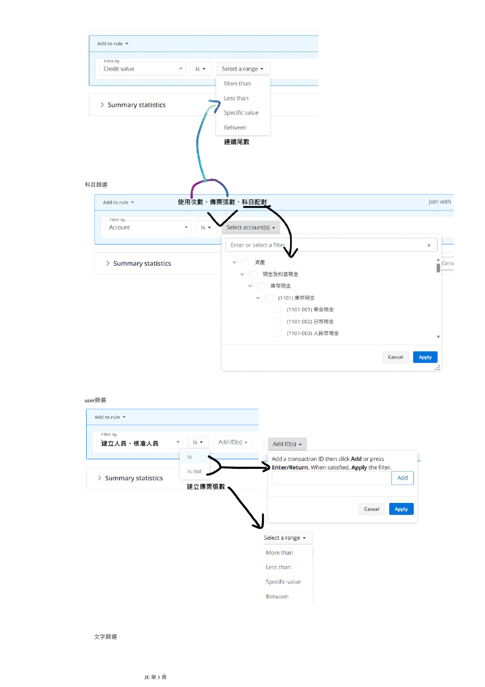

# 使用者回饋與操作流程一致性修正計畫

更新日期：2026-09-21

## 現在要做什麼

2026-09-21 使用者已授權整理後提交並推送，準備在測試環境驗收。本次交付包含本計畫累積的產品、
測試、前端與文件成果；目前狀態為待使用者驗收，不把 Git 交付當成人工驗收通過。

2026-09-21 的十九則畫面註解已完成文案、重複抬頭、字體、分類編輯器及訊息區排版修正。
前端及配對操作檢查、完整十七個 GUI 情境已通過，預覽頁已更新，接續由使用者確認畫面。
本批維持既有審計判斷、資料契約及保存行為；下方 A–U 的完成紀錄保留。

2026-09-18 使用者要求在同一個 session 完成 A–U 操作與相容性收尾，以及三則可空值警告。
兩項已完成實作、正式驗證及文件更新。第五步的自訂篩選可依 A–U 加入條件，也可帶入原工作簿五個組合範例。
33 組獨立答案在 SQLite 和 DuckDB 通過；完整 Public 3,570 項、十七個 GUI 情境與六份原生 Excel 工作簿通過。
Debug、AgentGuiTest 和 Release 建置皆為零警告、零錯誤，具體來源及驗證見下一節。

同一分錄複合條件、傳票量詞及本地分類階層已完成實作與產品驗證，包含介面、保存及報表。
2026-09-18 再次盤點後，較早的授權清單、補集、統計、匯入格式及專項 GUI 待辦也已有完成證據，
下方 50 項摘要已更新。前次列出的 A–U 操作入口與相容證據、三則可空值建置警告，均已由本輪完成。
完整性差異流程與新增操作的使用者試用另列，不把尚未回覆驗收寫成尚未實作。
總帳科目名稱維持必要配對，其他延後事項維持原安排；具體界線見「專案狀態盤點」。

2026-09-18，使用者針對只有貸方收入 100 元、沒有借方分錄的傳票，裁定「借方全部屬於 Cash」的答案：

> 不符合：必須至少有一筆借方，且每筆都符合（建議）

因此空側的至少一筆及全部符合皆為不符合，不存在符合則成立。
本次已核對 IDEA R1 實際比較式及現行 `PostPeriodApproval`，兩者均為核准日大於或等於財報準備期間開始日。
IDEA R3 另要求正金額借方存在；現行 `UnexpectedAccountPair` 沒有此限制。本輪保留舊情境原有語意。
這三組功能的首次 Focused 曾停在 NuGet 還原；其後正式驗證通過，保留紀錄見「本輪篩選實作與驗證」。

### 本輪使用者原話（2026-09-18）

```text
請在 C:\Users\rich2\source\repos\je-tool 接續篩選功能開發。先執行 pwsh -NoProfile -File tools/verify.ps1 -Command Context，再依 AGENTS.md、現行計畫及最新使用者裁定核對來源，保留工作樹中已有的修改。

本輪交付範圍是以下三組功能，請在同一個 session 持續推進，連同必要的資料模型、介面、相容性、報表及驗證一起完成：

1. 多個欄位條件綁定同一筆佐證分錄，以及必要的巢狀 AND、OR 組合。例如「貸方科目 B 且摘要含 X」不能由不同分錄分別滿足。
2. 整張傳票及借貸分側的「至少一筆符合」「全部符合」「不存在符合」，包含沒有該側分錄時的判斷。
3. 本地分類節點與審計角色的選取區分，以及父子分類和階層選取。MAC 外部分類表不在範圍內。

請自行判斷實作方式，沿用共用 AST，採取能完整滿足需求的簡單設計，保留舊情境的原有語意。最新裁定是總帳科目名稱維持必要配對欄位，不再討論改成選填。

舊表 A 的日期來源、C 只有貸方的情況，以及「全部符合」遇到空集合等問題，先查來源；仍有真正業務歧義時，提早提出具體案例請我裁定。只暫停相依部分，其他工作繼續。

使用合成資料與獨立預期答案，透過正式 harness 驗證 SQLite、DuckDB，以及條件編輯、預覽、保存、返回、取消、失敗重試、案件重開和匯出的完整流程。

完成條件是三組功能落實、相應正式驗證通過，並以清楚的繁體中文更新同一份現行計畫。工作順序不等於 session 分界，不要只完成設計或其中一項就自行收尾。若確實受阻，明確交代具體阻礙、已完成範圍及尚未驗證部分。其他已延後事項維持原安排。
```

<!-- jet-context:start -->
2026-09-21 使用者已授權 commit 和 push，交付本計畫累積成果供測試環境驗收。
獨立提交前複審未發現阻擋問題；Release Package 的 104 項測試及單檔發布檢查通過。
來源 xlsm 保留本機並精確排除於 Git；可重現的條件目錄、合成答案與來源摘要納入提交。
目前仍待使用者在測試環境驗收；提交識別與遠端狀態以 Git 紀錄為準。

2026-09-21 已依十九則畫面註解調整正式前端，8 項專項測試、325 項架構檢查及十七個 GUI 情境通過。
文案與標題縮短，字體統一為 Noto Sans TC；分類欄位及訊息區已在一般與窄視窗目視查看。
本批起始前端雜湊與既有修改狀態保存於 `artifacts/frontend-preview/baseline-20260921.json`。
合成素材已依目前程式重新產生；專項檢查通過，瀏覽器確認第五步顯示兩筆分錄、一張傳票。

本輪 A–U 操作相容及三則可空值警告已完成實作、正式驗證及文件更新。
二十一個條件和五個工作簿範例接回共用 AST；P 可選科目代號或科目分類。
33 組固定答案在 SQLite 和 DuckDB 通過預覽、保存失敗保留、重試、重開及兩種報表。
最後 Public 3,570 項、十七個 GUI 情境和六份原生 Excel 工作簿通過；三種建置皆零警告、零錯誤。
Contract、466 項框架斷言及 37 份文件檢查通過；文件零錯誤、零警告，修改段落已重讀。
來源、原話、第一次失敗及最終收據見「A–U 操作相容與警告修正」。

產品目標：讓審計員在新版 JET 完成既有審計業務，並能直覺地自由組合篩選條件。
本計畫追蹤 D01 至 D32、F01 至 F18。三組篩選功能和本輪兩項收尾均已有實作與流程證據。
下一步是完整性差異流程及新增操作的使用者試用；有具體回饋再修正，不重新把已完成項目列為未開發。
公司一般權限、Office 原檔編輯及占用重試、案件冷複製三項已依 9/17 回覆驗收通過。

重要裁定與理由：

- 先相容舊版審計功能與需求，再重構及改良；共用 AST 保存條件與組合，避免不同入口各算一套。
- A 依核准日大於或等於財報準備開始日；C 保留現行只有收入貸方也可能命中的答案，與 KCT C 分開。
- 尾零沿用新版固定 6 位及既有自訂方式；MAC 等外部多層會計科目表不在目前職責範圍，不再當成驗收前提。
- 完整性差異保留，審計員可繼續篩選、保存與匯出；不可再要求差異歸零才能操作。
- 總帳科目名稱維持必要配對欄位，D12 不再待討論；此裁定不增加逐筆科目名稱都不可空白的檢查。
- 全部符合須至少有一筆該側分錄；沒有該側分錄時，至少一筆及全部符合皆不成立，不存在符合成立。
- 「下一步」表示順序；本輪交付範圍另列。Agent 負責判斷與完成工作，harness 提供觀察及驗證。

原工作簿只做唯讀查核，雜湊未變，未執行巨集。全部產品驗證使用合成資料及獨立答案。
SQL Server 實機、企業多人、audit log、兩份 TB、DPP 指引、預篩選去留、KCT 新規則及原始私人 PBC
仍依既有背景、邊界與重啟條件處理；未啟動私人案件或公司設備驗收。9/18 原驗證範圍沒有 Package、
ReleaseCandidate 或 Git 交付；9/21 的提交前檢查另見「測試環境交付」。

開發支援原話在「工作邊界、文件與 Agent 續接修正」；D01 至 F18 原話、驗收要點及來源圖仍在本計畫。
較早紀錄見
[歷史執行紀錄](../history/2026-09-18-feedback-execution-records.md)；長期延後事項看 development-status.md。
<!-- jet-context:end -->

## 測試環境交付（2026-09-21）

使用者原話：

> 現在整理完成後，請將他們 commit+push ，我要準備在測試環境驗收了。

本次授權包含本計畫累積完成的篩選、匯入、診斷、報表、前端、驗證工具與文件，提交至目前 `main`，
推送至原有 `origin`。使用者預計在測試環境驗收，尚未宣告本計畫人工驗收通過。
既有工作樹不回復、不清除；只依核對後的明確檔案清單暫存。

來源工作簿 `XXX_2024_JE篩選條件_1210.xlsm` 不屬於原先十份已裁定的版控範例。
原來源紀錄未轉錄案件填寫值、聯絡資料與外部連結，故原件繼續保留本機，以精確忽略規則排除；
不改寫或刪除。條件目錄、來源對照與合成測試足以建立和測試 JET，不依賴此原件。
四張篩選許願頁已目視核對為功能與介面參考，三張 SVG 為另造的合成示意，隨計畫納入提交。
私人案件、執行產物與 `.vscode/settings.json` 不在交付清單。

依開發流程由未參與實作的子 Agent 獨立複審提交差異與現行計畫，未發現需要阻擋提交的具體問題。
複審涵蓋 AST 與量詞、分類、授權名單、匯入失敗回復、報表、A–U 固定答案及最新前端斷言調整；
該複審是唯讀來源核對，不代替正式測試或使用者驗收。

本輪新增執行 `Package -Configuration Release`，收據 `20260921-100339211-96a9bb2e80294e2f89a56c6342adea8c`：
104 項報表與範本測試通過，0 失敗、0 跳過；Release 建置、單檔發布及封裝檢查通過。
沿用同日未再改動產品的 8 項前端專項、325 項架構檢查、兩項前端契約路線及十七個 GUI 情境結果。
完整 Public 3,570 項與六份原生 Excel 的有效執行日期為 9/18，本輪沒有重新執行，不能改寫成 9/21 通過。
文件與候選清單整理後再執行 Documentation；ReleaseCandidate、SQL Server、私人案件及公司設備驗收未執行。

## 前端網頁註解準備（2026-09-21）

使用者原話：

> 現在請將 je-tool 的前端作為網頁顯示於此，我會直接註解來告訴你有哪些要修正的地方。

依 `development-guide.md` 的前端設計模式，先執行 Context 並保存 28 個正式前端檔案的起始雜湊與 Git 修改狀態。
開啟預覽時沒有修改 HTML、CSS、JS 或後端；後續註解的呈現與操作修改以 `src/JET/JET/wwwroot/` 為範圍，
不因開啟預覽而改變既有審計判斷或另建前端。

正式執行 `Focused -Configuration Release -NoRestore -Filter 'FrontendPreviewFixtureTests'`，
僅在該程序設定 `JET_FRONTEND_PREVIEW_EXPORT=1` 產生合成素材，收據
`20260921-091942242-9c5a501686a5494ebdcf58bf5c547670` 通過。
啟動原有預覽服務後，已在 Codex 內建瀏覽器確認第五步載入，固定情境顯示兩筆分錄、一張傳票。
服務只綁定本機回送位址，一小時後自動結束；未準備的條件、保存及匯出不會模擬成功。
此為畫面註解準備，不代表本輪重新執行 Public、原生 GUI 或 Excel 驗收。沒有讀取私人案件或進行 Git 交付。

### 十九則畫面註解與修正（2026-09-21）

使用者要求原話：

> 請基於註解內容繼續改進。

| 編號 | 使用者註解原話 | 本批處理 |
|:---|:---|:---|
| 1 | 這裡的註釋太長了，使用者根本不會查閱這麼詳細，請縮短這部分的文字。 | 匯入提示縮為一句，保留格式及合併條件。 |
| 2 | 未匯入可以理解，但是後面直接接上 "解鎖" 反而意義不明，是要解鎖什麼? 為什麼要解鎖? | 清單狀態只寫「未匯入」。 |
| 3 | 這裡的按鈕在命名上感覺很奇怪，既然已經是對應GL和TB的匯入資料，那為什麼按鈕還有額外解釋為管理來源? 是否可以考慮讓匯入資料的四個按鈕設為同的名稱就好? 因為這裡是分成四類資料要匯入專案，那這裡的按鈕應該會是相似的。 | 四類入口都叫「匯入」，原展開及匯入操作保留。 |
| 4 | 把符號 "、" 改成 "/" 就好 | GL 和 TB 收合摘要改用斜線。 |
| 5 | 這裡不需要強調 01, 02, 03... 這樣的數字，這已經屬於 ai slop 的範疇了 | 移除中央流程列的兩位數編號。 |
| 6 | 這個註解提示也是太長了，而且你甚至把 ai 的思考過程當作輸出來放在這裡了，這對使用者來說根本毫無幫助 | 配對提示只說明選來源與星號必填。 |
| 7 | 這裡的符號 "・" 也是滿滿 ai 味，我相信 je-tool 其他地方一定也有這個問題，請改進 | GL 設定改成分項；其他正式前端的串接點符號改為合適的逗號或括號。 |
| 8 | 你大可以命名成 "預覽" 就好，按鈕不應該過度解釋或混淆使用者操作 | GL、TB 及科目配對按鈕簡化為「預覽」。 |
| 9 | 上面這一串也是意義不明滿滿的 ai slop 設計，既然已經在處你 je tool 那為什麼上方還要額外顯示 "WORKPAPER" 這有什麼意義嗎? 還有案件名稱也已經顯示在整個頁面最上方了為什麼這裡還要重複顯示? | 移除中央工作區的重複案件抬頭與 WORKPAPER。 |
| 10 | 這裡數字的字體沒有改道，仍然是那種滿滿 ai slop 設計的字體，請改進並統一整個 je-tool 的字體 | 共用字體變數統一到本機 Noto Sans TC，包含日期、數字與控制項。 |
| 11 | 這裡前端的排版也太壅擠了，請修正 | 分類名稱、審計角色及上層分類各自配置欄位和標籤，窄版分列。 |
| 12 | 如果我選擇這個介面會有藍色框框，但是最左邊會被截掉，導致介面顯示不完全 | 分類清單加上焦點框所需內距，保留可見焦點。 |
| 13 | 這部分一整個文字提示都過於非人性化，而且你甚至還過度把推理過程給呈現出來，這對使用者來說毫無幫助 | 科目配對只說明填好 C 欄再匯入，移除內部流程解釋。 |
| 14 | 改進文字 | 「取得範本（保留現有檔案）」簡化為「取得範本」。 |
| 15 | 改進文字 | 「重新產生空白範本（覆寫現有檔案）」簡化為「重建範本」；旁邊保留覆寫已填分類的說明。 |
| 16 | 你不需要自行建立新名詞，你大可沿用 "預篩選" 就好 | 預篩選區只保留一個「預篩選」標題。 |
| 17 | 意義不明的文字，請問 "主要呈現" 在這裡可以幫助告知使用者哪方面的資訊? | 移除「主要呈現」。 |
| 18 | 這個提示文字看不懂，這對第一次操作的使用者來說，你覺得從他的角度來看，什麼會是 "逐筆輔助訊號" ? | 第四步展開入口改為「分錄檢查」，原有檢查及順序保留。 |
| 19 | 這裡已經有排版錯亂問題了，文字甚至被強制縮排 | 訊息操作按鈕整個換行，長內容在窄欄內換行，不把按鈕拆成直排。 |

開始時的正式前端雜湊已保留於本節上述基準。產品變更只在 `wwwroot` 的 CSS 與呈現用 JS；
預覽工具另縮短工具列文字，不改回放規則。未修改 action、payload、產品 C#、資料庫、報表或篩選語意。
一般及窄視窗已實際查看分類名稱焦點、欄位排列、匯入清單與訊息面板。

第一次來源檢查失敗 `20260921-094250551-55cadccbf71f46778c5dfd13f0868a71` 要求舊預篩選名稱；
後續 `20260921-094347071-794f24417c764e548d4fd98a23231cf3` 另指出重複標題數量、舊長提示及隱藏標籤的固定預期。
這些預期與本次明示註解衝突，已更新為精確新文案及可見標籤的 for、id 配對；保留所有既有狀態、順序及錯誤處理檢查。
`Focused -Configuration Release -NoRestore -Filter 'UserFeedbackStepsOneToFourFrontendTests'` 通過 8 項選取測試及 325 項架構檢查，
收據為 `20260921-094636047-af82474483d14cbba5856f8788533c1e`。FrontendMapping 與 FrontendPreview 契約檢查均通過。

首次完整 GUI 在啟動情境發出退出操作後等待程序結束時逾時，收據
`20260921-094802365-4f3a922d2ad84737967ba8ead1981715`；框架已清理該次程序與暫存資料。
沒有調整逾時或斷言，原樣重跑 startup-smoke 通過，收據 `20260921-095209061-4aeb9caee6cb48b9856fbb33f9545b33`。
完整 GUI 原樣重跑後十七個情境全部通過，收據 `20260921-095234069-ffa723acf60c493690a78f869f11b07e`。
包含 52 次回饋流程、64 次必填配對操作，以及原有篩選、分類、返回、取消、保存、重開與匯出流程。
這次啟動逾時的根因尚未確認，不把重跑通過寫成已修正產品缺陷；沒有放寬任何 GUI 斷言或逾時。

FrontendMapping 收據為 `20260921-094726349-dd6ee106135b4695af5f3f1001b7d9ff`，FrontendPreview 為
`20260921-094749102-69e8a008962146f89ddde374461fb652`。JavaScript 語法與 `git diff --check` 均通過。
本批與起始雜湊比對共修改 11 份產品前端檔，保留前輪未提交的修改；另調整兩份預覽工具文案和三份來源測試。
Documentation 檢查 37 份文件通過，0 錯誤、0 警告；修改段落已重讀，補記結果後再執行同一檢查。
預覽只使用合成資料，未改審計邏輯。
本批未執行完整 Public、Excel、Package、ReleaseCandidate、SQL Server 或私人案件驗收。
SQL Server 維持手動且停止，未留下 `sqlservr.exe`；暫存區為空，沒有暫存、提交或推送。
本次交付是供使用者繼續確認的前端版本，尚未取得這十九項的使用者驗收回覆。既定延後事項維持原安排。

## A–U 操作相容與警告修正（2026-09-18，已完成）

使用者對前次兩項未完成工作的註解：

> 請繼續完成他們。

使用者本輪原話：

> 直接在這裡繼續完成他們，讓當前 `je-tool` 的篩選條件是與舊表 A-U 的語境是相合的，這樣審計員在新版 `je-tool` 操作時也能夠復現舊版 `JE Tool` 的篩選條件和審計業務，這樣就算是新版的 AST 條件也不影響審計員操作篩選條件，而為了驗證完整性，請以 [XXX\_2024\_JE篩選條件\_1210.xlsm](../../data/XXX_2024_JE篩選條件_1210.xlsm) 中的篩選調為範例去擬定測試循環，驗證當前 `je-tool` 是否確實可以復現他們，這樣審計員才能夠沿用以前的審計習慣，避免重構後的 `je-tool` 對使用者造成重大認知落差。

連結只調整為從本計畫可開啟的相對位置。本輪唯讀檢查工作簿的條件組合、說明、其他條件與借貸組合範例，
不執行巨集，不讀私人案件。工作簿五個組合為 E+G+O、E+O、P+S、D、A+E+H+I。
其中 A 的文字衝突與 D 的動態尾零仍遵守既有裁定；P 以兩份科目集合在同張傳票出現判斷，不逐項配對。
範例 5 的理由提到金額較高，但配對組合未選 S；以實際列出的 A+E+H+I 建立測試，不擅自加金額門檻。

實作採用既有「自訂篩選條件」內的 A–U 入口，不取代 KCT，也不建立另一個計算引擎。
來源目錄提供代號、名稱、來源儲存格、判斷說明及共用 AST。五個範例帶入可修改的條件，O、R 可選已配對欄位，
P 可選科目代號或科目分類，U 可選人員或傳票張數。I、L 明示帶入每月 1–5 號的來源範例，兩種日期仍各自保存。

第一次正式失敗為 `20260918-095757049-9d265c1a4c4f4434a5ef151e3fa953b4`，確認尚無 A–U 來源目錄。
後續測試先修正新夾具的人工政策參數名稱，以及 Criteria Selection 使用完整條件而非情境名稱的錯誤假設；
這兩項屬測試安排修正，不作為產品缺陷。最終結果見本節末。

`20260918-101024641-ba1fc3e094144db288b35697e0baec25` 在兩個資料庫證明 Working Paper 漏列 A 的完整條件。
原因是匯出 handler 只對部分型別產生說明，已改成每種規則共用 renderer。
`20260918-101157061-64c6f8dd16e146779f5d5315321b5772` 的專項驗證通過：21 個條件、5 個來源組合及 6 個補充案例，
各自在 SQLite 和 DuckDB 核對固定命中分錄、傳票集合、保存失敗保留、重試、重開及兩種報表。
六個補充案例為兩種日期的「週末或假日再排除例外」、貸方不存在指定集合、科目分錄筆數與傳票張數的差別，
以及核准人員清單。合成資料含一張同科目多列傳票，預期答案未由產品計算產生。

Debug 建置已是 0 警告、0 錯誤。底稿不再保留不符合必要依賴契約的 store 空值替代路徑；
共用 GL 配對前置檢查明示失敗時不返回，使編譯器能追蹤既有的非空保證，沒有放寬缺配對的行為。
GUI 起初因 NuGet 來源受限而未執行，保留紀錄後改在可連線環境重跑。
新的 133 次流程超過框架原有 96 次限制，已拆為「逐項 A–U 入口」及「五個範例完整操作」兩個正式情境，
不提高或取消既有操作上限。這是測試安排修正，不是產品故障。

GUI 發現只切換左側條件代號會令既有預覽失效，第一次失敗為
`20260918-102130216-b9636282e0c74e01bafc6a09737c2fb8`。已改為只更新條件目錄，不把選單瀏覽當成草稿修改。
後續捲動失敗的原因是測試在保存後未重新展開目錄；已補實際點選，不提高捲動次數，也沒有留下不必要的版面修改。
最後讀回檢查曾指到第一個情境，已改核對真正展開的第三個情境，保留原文字要求。
五個範例的 55 次 GUI 已通過，收據 `20260918-103148497-ee23dba58be548a6b347674efd469f5d`；
全部 A–U 的 89 次加入及移除也通過，收據 `20260918-103308612-635f2fc663f247bb833986d9c29e8cf9`。
已目視查看重開後的條件說明；最後版本另完成下方完整 GUI 回歸，並查看 P 入口的合成畫面。

目視複審另發現 P 的說明把兩側存在條件稱為「同一分錄」，容易誤解為同列同時符合借方與貸方。
`20260918-103521673-a8990c12f96e4408a7018fff50a842d8` 保存這個文句缺陷的第一次失敗。
已同步前端與報表：純傳票條件組合寫「同張傳票」，單一子條件不再重複包上同筆說明；真正的同筆複合條件仍明示同一分錄。
這次只改呈現，不改 AST、SQL 或舊情境答案。

來源複審確認 `其他條件!C36:D37` 的 P 範例也使用「收入」「類別一」「非類別二」。
因此 P 增加科目代號或科目分類的選擇，分類直接使用既有借貸組合編輯器，可選節點、子分類及審計角色。
兩個資料庫另加入 `P_categories` 的固定答案，總計 33 組；A–U 的 GUI 增加分類入口操作後共 95 次，仍在原有 96 次上限內。

### 來源、操作與固定答案如何對照

來源工作簿只做唯讀查核，沒有重存或執行 VBA。檔案為 225,368 bytes，SHA-256 為
`E6479617A00CC49A671E1F3CEDEE316671FAB6CBF2B8BD1B3EAD5A3CA35F01BD`。
`filter-legacy.js` 的 `je-form-2024-1210` 目錄逐項記錄儲存格位置，A–U 每個代號直接對應
`LegacyFormWorkflowTests.Expected` 的同名固定答案；五個範例對應 `example1` 至 `example5`。
測試不在執行時讀取參考工作簿，也不以產品述詞反算預期集合。

| 來源 | 新版操作與實際測試 |
|:---|:---|
| `JE篩選條件組合!A2:C22` 及 `(i)JE篩選條件說明!A2:B22` | A–U 逐一加入既有編輯器。核心行為、必要來源及已裁定差異在該項說明呈現；兩個資料庫逐項比對命中分錄與傳票集合。 |
| `JE篩選條件組合!E2:G2` 與 `其他條件!C25:C26` | E+G+O：人工、週末及摘要包含迴轉，三者必須由同一分錄符合。 |
| `JE篩選條件組合!E3:G3` 與 `其他條件!D25:D26` | E+O：人工及已配對部門包含總經理室；必須明確選來源，沒有選取時保留草稿並提示。 |
| `JE篩選條件組合!E4:G4`、`特定借貸組合填寫範例!A3:B8` 與 `其他條件!C65` | P+S：借方六個科目和貸方三個科目各自為集合，同張存在該組合，再選金額絕對值大於 300,000 的分錄。不是逐項一對一，也不是改成傳票總額。 |
| `其他條件!C36:D37` | P 也能切換科目分類，沿用既有借貸組合與分類選取；`P_categories` 另核對借方 Cash 及貸方 Revenue 的固定命中集合，排除科目代號剛好相同造成的假相容。 |
| `JE篩選條件組合!E5:G5` | D：沿用已裁定的新制固定六位尾零；保留新舊算法不同的說明，不宣稱重現舊版動態門檻。 |
| `JE篩選條件組合!E6:H6` | A+E+H+I：財報準備日起核准的人工假日分錄，排除補班與每月 1–3 號；沒有額外加入 S。 |
| `其他條件!A2:C4`、`A13:C15` | 總帳日及核准日各有週末、假日、補班與每月日子的案例；另驗證 OR 群組後再套例外，兩種日期不共用加班設定。 |
| `其他條件!A73:C74`、`A82:D84` | 科目筆數、人員傳票張數與 User99 識別值；同張同科目多列的反例區分筆數與去重張數，空白識別值及期外列不混入統計。 |

每批情境另走保存失敗保留、案件重開、讀回定義、固定命中列查詢、修正重試及兩種報表。
兩種報表的傳票計數也對照獨立答案。原生 Excel 的既有六份合成工作簿另加入目錄 A、D，
保留原先兩項情境的固定答案，並核對新補的預篩選條件說明。

第一輪 Public 共 3,570 項，3,568 通過、2 失敗、0 跳過，收據
`20260918-103635131-c8f46214e88544d68455c2d3f3b1362e`。一項是既有底稿測試仍要求預篩選的完整說明為 null，
與本輪補齊說明的需求衝突；只將該處改為精確文字「預篩選：未預期借貸組合」，原有生命週期、命中計數、
範圍及發布斷言全部保留。另一項是改檔工具把前端換行改成 CRLF，已恢復 LF，原來源檢查不改。

第二輪 `Public -NoRestore` 在最後的 P 分類入口加入後執行，3,570 項全部通過，0 失敗、0 跳過；
收據為 `20260918-110421404-ce541a0644344fd4890b1aa3da1e365b`。其中 A–U 的 33 組固定答案在 SQLite 和 DuckDB
都通過完整流程。除本輪明列的底稿說明斷言外，沒有為取得通過而刪除、放寬或跳過既有產品斷言。

### 最後版本的正式驗證

下列命令均由 `pwsh -NoProfile -File tools/verify.ps1 -Command` 啟動，框架自身測試另用下列指定腳本。

| 命令 | 結果及適用範圍 |
|:---|:---|
| `Public -NoRestore` | 3,570 項通過，0 失敗、0 跳過。包含 33 組來源案例在 SQLite、DuckDB 的完整流程。 |
| `Gui -Configuration AgentGuiTest` | 十七個情境全部通過；A–U 入口 95 次操作、五個範例 55 次操作。包含編輯、預覽、保存、返回、取消、缺來源修正重試、案件重開及匯出。 |
| `Excel -Configuration Release` | 六份合成工作簿原生開啟、重算、另存及重開通過；零公式錯誤、零外部連結。篩選報告與底稿含 A、D 的完整說明。 |
| `Contract` | 通過；`tools/tests/verify-contract.tests.ps1` 另通過 466 項框架斷言。 |
| `Documentation` | 37 份文件通過，0 錯誤、0 警告；已重讀修改段落，補記結果後再執行同一檢查。 |

最後 GUI 收據為 `20260918-111831425-37fdd7eab3754176a315dab9c63bf913`，Excel 為
`20260918-112325842-1fe0e45ce5c2441190a54bb9915a20e4`，Contract 為
`20260918-112634693-495a5423b28047469159c63fca70d638`。框架自身測試編號為
`20260918-112436215-ad3d638fc94247f3894e2e3a6e9ff2ea`。產品最後版本在三種組態皆為零建置警告、零錯誤。
文件檢查收據為 `20260918-112829166-4264ff16c7a44e04a42615f5a4aceb79`；補記本次結果後重新檢查。

本輪沒有以 IDEA 或原工作簿 VBA 實跑互相比對；相容證據是來源逐項追溯、固定答案與新版正式流程。
原工作簿 SHA-256 前後一致。未讀取私人案件，未執行 SQL Server live Provider、公司設備或真人試用、
Package、ReleaseCandidate。SQL Server 三項服務為手動且停止，沒有 `sqlservr.exe`。
`git diff --check` 通過，保留原工作樹，暫存區為空；沒有暫存、提交或推送。

本輪兩項不再列未完成開發。接續為完整性差異流程及新增操作的使用者試用，收到具體問題再修正；
下方延後事項的背景、邊界與重啟條件不變。

## 專案狀態盤點（2026-09-18）

本節保留本輪實作前的盤點。當時列出的兩項已由上一節接續，不能再用本節判定目前仍缺少哪些功能。

使用者原話：

> 那麼請整理專案狀態，看看是否仍有未完成的開發項目需要處理，除了先前已經確認要擱置的項目。

本次先執行 Context，再核對現行程式、測試、前次正式收據、八份計畫的承接入口及最新裁定。
沒有發現需要重開授權清單、匯入格式、統計或本輪三組篩選核心的理由。原摘要仍寫「第三段處理」等舊狀態，
與已有實作不符；下方摘要已逐項修正，原始需求和歷史執行結果保留。

### 仍需開發端收尾的工作

| 工作 | 已有能力與尚缺部分 | 下一個可驗證結果 |
|:---|:---|:---|
| A–U 操作入口與相容證據對照 | 現有 AST 已能表達本次確認的規則；`ui-core.js` 有六個常用情境範本，另有預篩選、自訂及 KCT 入口。它們不是逐項登錄的 2024 A–U 範本目錄。計畫原列「把熟悉範本接回同一編輯器」，仍缺每項從來源、實際入口、AST 到命中分錄、傳票集合及報表的完整對照。現有測試涵蓋個別能力，不能直接稱為 A–U 全套相容驗收。 | 逐項連結既有入口和獨立答案；缺少便捷入口或完整流程案例時才補。A 保留核准日與財報準備開始日，C 明列只有貸方時的新舊差異，D 保留固定尾零裁定；I、L、P 等組合也須確認實際操作可建立。此工作不另造引擎，也不預設要新增二十一個按鈕或逐一複製舊表單。 |
| 三則可空值建置警告 | 最新 Release 建置仍有 `ExportWorkpaperStreamHandler` 兩則 CS8604，以及 `PrescreenRunHandler` 一則 CS8602。前者在條件說明路徑保留 store 的空值替代分支，後續 metadata factory 又要求非 null；後者的配對前置檢查未讓編譯器確認非 null。尚未據此重現產品失敗。 | 統一相依物件及配對狀態的可空契約，保留缺欄時可修正的錯誤行為，重跑相關匯出、預篩選案例與正式 Build；不以壓掉警告代替確認。 |

來源為 [範本及預設目錄](../../src/JET/JET/wwwroot/js/ui-core.js)、
[條件入口](../../src/JET/JET/wwwroot/js/steps/filter-step.js)、
[範本檢查](../../src/JET/tests/JET.Tests/Architecture/FilterTemplatesFrontendTests.cs)、
[底稿匯出](../../src/JET/JET/Application/Handlers/ExportWorkpaperStreamHandler.cs) 和
[預篩選](../../src/JET/JET/Application/Handlers/PrescreenRunHandler.cs)。
當時安排先做 A–U 對照，再處理三則警告；兩項已由本輪在同一個 session 接續。

### 已完成，不再列為開發缺口

| 項目 | 本次核對的實作與驗證來源 |
|:---|:---|
| D05 的 .xls、.mdb、.accdb | `BinaryExcelTableReader`、`AccessTableReader` 與 `NativeAccessImportAcceptance` 已涵蓋三格式各兩個本機資料庫；最新 Excel 收據仍有六例通過。Access 使用現有 ACE 16；其他 Office 位元版本未由此推定。 |
| D08、D09 授權清單 | 明確指定來源欄、有效名單預覽、移除、重開及再匯入已實作。`AuthorizedPreparerWorkflowTests` 與 33 次專項 GUI 已驗證；不是還缺 clear action。 |
| D11、D13、D21、D22、D32 | 日期用途、總帳日期名稱、人工或自動的單側清單及空白選擇、INF 對照、回溯與低頻說明均已處理。`UserFeedbackManualAutoProjectionTests`、缺來源流程測試及 95 次新條件 GUI 保留。 |
| F08 至 F12、F14 至 F17 | 已有欄位分組、日期與獨立例外、整數尾數、文字正反比較、人員識別值清單，以及科目與兩種人員的筆數和去重傳票張數。`EntityFrequencyWorkflowTests`、`FilterCompletenessTests`、`FilterSideAndMonthWorkflowTests` 等有兩個資料庫的獨立答案與保存匯出證據。 |
| 空值明細及 KCT 重配缺欄 | 分別已有 35 次和 43 次專項 GUI；包含失敗重試、返回修正、重開，KCT 另有匯出。不能繼續列為未補專項 GUI。 |
| D29、F07、F13 本地部分及 F18 | 同筆複合條件、量詞、節點與角色區分、父子階層已完成；本輪 80 次 GUI 及資料庫、報表證據見下一節。 |
| D12、D25、F04 | 已按裁定維持必要科目名稱、手動開啟資料夾和新版尾零方式，不是未決提案。MAC 已排除於職責範圍，不保留為缺來源待辦。 |

### 試用、驗證限制與延後事項

- D19 完整性有差異仍可繼續，已有兩個資料庫及 52 次 GUI 證據；最新明確回覆仍是尚未完整驗收。
  新清單、補集、篩選及階層操作可接續試用。已通過的配對、原有筆數名稱及公司三項操作不重新列為欠缺。
- 原生檔案選擇視窗沒有新增專項 GUI。正式匯入 action、錯誤重試及新格式讀取已驗證；這是自動驗證範圍的限制，
  目前沒有相應產品故障，不能因此直接列為缺少匯入功能。
- 人員識別值的包含與排除已實作。F16 的搜尋勾選只曾列候選，原需求也明示不照搬參考產品每個按鈕；
  目前不自行增加為必做功能。文件相對連結檢查、架構圖更新及其餘維護機會仍依 `development-status.md` 的處理條件。
- D06 兩份 TB、D27 DPP 指引、SQL Server 實機及企業多人、audit log、預篩選去留、KCT 新規則與原始私人 PBC，
  均沿用下方背景及重啟條件。本次沒有重新啟動。使用者仍在修正試用，Package、ReleaseCandidate 及 Git 交付也不在本次範圍。

本次只整理狀態與文件，沒有修改產品或測試，也沒有重跑 Build、Public、GUI、Excel、私人案件或 SQL Server。
已核對前次 Public 3,566 項全部通過、十五個 GUI 情境及六份原生 Excel 工作簿通過；這些是前次執行證據。
本次 Documentation 檢查 37 份文件，0 錯誤、0 警告，收據為
`20260918-094408428-3756840f4c474464b2ca7a9a5cbd073e`；修改段落已重讀，50 項編號完整保留。
`git diff --check` 通過，暫存區為空。SQL Server 三項服務均為手動且停止，沒有 `sqlservr.exe`。
保留工作樹既有修改，未暫存、提交或推送。

## 本輪篩選實作與驗證（2026-09-18）

本節保存 A–U 入口開發前的三組篩選交付紀錄。當時留下的三則建置警告，已由前方「A–U 操作相容與警告修正」接續修正。

三組功能共用原有 AST。`group` 將子條件綁在同一筆分錄，允許巢狀「且」「或」；`voucher` 選擇整張傳票、
借方或貸方，再判斷至少一筆、全部或不存在符合。各層仍依原順序從左到右計算，最多巢狀八層。
全部符合需要至少一筆；沒有該側分錄時，只有不存在符合會成立。零元維持借方，空白內容沿用子條件原有設定。
主要實作在 [FilterScenario](../../src/JET/JET/Domain/Rules/FilterScenario.cs)、
[解析器](../../src/JET/JET/Application/Support/FilterScenarioPayloadParser.cs) 和
[共用 SQL 編譯](../../src/JET/JET/AuditCore/FilterCompilation.cs)。

本地分類增加上層 ID，角色不隨上層繼承。單側及借貸分類組合均可選分類本身、包含下層或相同審計角色。
舊條件省略選取方式時維持角色判斷；舊呼叫端省略上層欄位時保留原上層。資料庫第 11 版新增關係表，
分類保存與關係更新在同一交易內完成。舊分類升級後維持最上層，既有 ID、角色及情境定義不改寫。
主要實作在 [分類契約](../../src/JET/JET/Domain/Contracts/AccountTaxonomyContracts.cs) 和
[分類階層保存](../../src/JET/JET/Infrastructure/Sql/AccountTaxonomyHierarchy.cs)。

前端沿用原有條件入口和情境編輯器，增加子條件括號、量詞及分類選取方式，分類清單呈現父子縮排。
複合條件也會顯示完整讀回說明。保存、重開及報表都使用相同定義，篩選版本推進至 `filter-2026-09-18-v16`；
舊定義仍可開啟，但須重新保存結果才能匯出。Criteria Selection Report 和 Working Paper 都列出完整條件，
巢狀引用的額外欄位也會列入結果頁與報表。未把原本各自尋找佐證的 `sameVoucher` 自動改成同筆判斷。

舊表對照已固定答案：IDEA R1 和現行條件都比較核准日是否達財報準備開始日；現行 `unexpectedAccountPair`
仍會選出只有收入貸方、沒有正常借方對方的傳票。這保留新版已存在的行為，沒有套回 IDEA R3 另需正金額借方的限制。
兩者已有合成測試。MAC 外部分類、動態尾零、總帳科目名稱選填均未加入本輪。

第一次失敗的證據與修正：

- 首次 Focused 停在 NuGet 來源，未進入產品驗證；正式 Restore 在可連線的執行環境通過。
- 前端名稱與家族檢查指出新型別尚未登錄，已補齊兩端目錄。巢狀分類選單改用同一分類 ID 的階層呈現，
  原本鎖平面目錄呼叫的來源檢查已改成核對階層目錄仍使用相同來源。
- 報表整合測試發現 Working Paper 只看最外層條件，漏掉巢狀說明；已補上，也遞迴收集額外欄位。
- 首次 Public 共 3,561 項，3,529 通過、32 失敗、0 跳過。缺口是資料表目錄漏列新關係表、DuckDB 遷移 INSERT
  未明列欄位，以及舊版本號與回應欄位的固定預期。已修正實作；既有相容檢查仍保留，只把新增契約的固定預期更新為第 11 版、
  篩選 v16 及新增的上層欄位，另補 v15 過期定義案例和新表的逐項目錄檢查。
- GUI 實際點選發現固定操作列遮住巢狀選單，已改為隨頁面排列；單一複合條件原先沒有完整讀回，已補上。
  驅動程式的字元限制、錯誤訊息定位及合成資料現金只在貸方的誤判，屬測試修正，未改動產品判斷。

目前已通過 `Focused -Filter Schema` 的 114 項，以及 `Focused -Filter FilterNestedVoucher` 的 16 項，均無跳過。
後者涵蓋 SQLite、DuckDB 的同筆佐證反例、三種範圍和量詞、沒有該側分錄、部分符合、NULL、零元、期外列、
分類節點與角色差異、父子移動、循環拒絕、保存失敗後重試、重開、兩種報表及第 10 版升級保留定義。
最終正式結果如下；所有測試均使用合成資料。

| 命令 | 結果與範圍 |
|:---|:---|
| `Focused -Filter Schema` | 選取 114 項全部通過，架構檢查通過。 |
| `Focused -Filter FilterNestedVoucher` | 選取 16 項全部通過，涵蓋 SQLite 和 DuckDB，架構檢查通過。 |
| `Public` | 3,566 項全部通過，0 失敗、0 跳過。 |
| `Gui -Configuration AgentGuiTest` | 十五個情境全部通過；新增情境完成 80 次操作，包含重開後查看保存結果。 |
| `Excel -Configuration Release` | 六份工作簿的原生 Excel 開啟、重算、另存及重開通過；篩選報告與底稿包含新條件，原本兩筆、兩張的答案不變。 |
| `Contract` | 通過；另執行 `tools/tests/verify-contract.tests.ps1`，463 項框架檢查通過。 |
| `Documentation` | 37 份文件通過，0 錯誤、0 警告；修改段落已重讀。 |

Public 收據為 `20260918-082147331-0483387bd2dc4906b36d295004a38e8c`，完整 GUI 為
`20260918-081104405-cd86cfd8801d4d89a90deedfada670a1`，Excel 為
`20260918-081618752-45afc3b9b7244b12a16922c39a998e9a`。更早的失敗仍保留，未用通過紀錄覆蓋。`git diff --check` 通過。
Debug、AgentGuiTest 和 Release 都經正式命令建置；Release 仍有三則可空值警告，位於
`ExportWorkpaperStreamHandler` 和 `PrescreenRunHandler`，本輪未擴充處理它們。

本輪未讀取私人案件，未執行 SQL Server 實機、公司設備或真人試用驗收，也未封裝 ReleaseCandidate。
本機 SQL Server 仍為手動啟動且已停止，沒有留下 `sqlservr.exe`。未暫存、提交或推送。
其他延後事項的逐項背景、邊界及重啟條件仍保留在本計畫下方「既有未完成與延後事項」，本輪未重新啟動。

## 工作邊界、文件與 Agent 續接修正（2026-09-18）

使用者要求原文：

> 請基於註解內容持續修正專案

註解一原文：

> 那麼請確實劃清職責界線，當spec中提到 "下一步" 的字眼時一般式代表開發任務需要循序漸進，且要明確劃分單輪執行任務的邊界，避免和循序型任務的界線搞混。

註解二原文：

> 對於這部分的內容，我擔心你會不會過度複雜化，因為根據過往的經驗和社群論壇的心得分享等等，使用 gpt 模型進行開發任務時常會發生過度設計、過度複雜化等隱性問題，導致專案規劃混亂，甚至影響其他 agent 的認知，使整個開發階段脫離專案背景及上下文脈絡等等。因此，儘管我目前已經使用 gpt-6-astra 來處理任務，我仍然需要你複審當前專案的狀態，並且基於更穩健的 harness 循環去優化他們。

註解三原文：

> 儘管沒有實機測試，但你仍然可以使用網路資料來確認當前社群論壇分享的心得和意見，並請你參考他們的分享內容來改進當前專案的支援度，確保 agent 能更好的避免上下文遺忘的問題

本輪依據與變更：

- `development-workflow.md` 分清使用者、Agent 與 harness 的職責。工作順序不再被當成本輪停止點，
  本輪要交付的成果與完成條件另寫。保留原有 Git、私人資料與 SQL Server 授權邊界。
- 現況入口不再複製計畫的逐輪紀錄。已結束的執行紀錄移至歷史，原需求、裁定、第一次失敗與驗證結果保留，
  原章節保留連結。重要且仍有效的否決及理由留在現行摘要。
- `Context` 納入 Claude 與 Copilot 的轉接檔變更。相同命令、組態、篩選及情境只顯示最近一次收據，
  讓重複文件檢查不再擠掉其他結果；最新失敗仍顯示，舊通過不會取代它。觀察仍唯讀，缺資料不擋其他工作。
- 官方文件與社群經驗的來源、採用方式及限制集中在
  [Agent 相容方式](../agent-compatibility.md#換模型或上下文壓縮後如何續接)。不新增模型專用規則、記憶資料庫、
  排程或檢查門檻；本輪改善共同上下文，不聲稱已實測所有型號。

第一次失敗：`20260918-054801880-5126bd8d175b4414b0ef84c90d4ca40d` 的新增案例重現重複收據擠掉其他結果。
第一次修改後，`20260918-054836393-7bb48d72cee0408698ef44d0402e3ba0` 發現舊收據缺少情境欄位時無法讀取。
改用可缺省的欄位存取後，`20260918-054910568-1e388bf519ab4eaf83ada3fc60ad9ad0` 通過，既有斷言保留。

本輪驗證與限制：

- `pwsh -NoProfile -File tools/tests/verify-contract.tests.ps1` 通過 463 項框架斷言；執行紀錄為
  `artifacts/harness/contract-tests/20260918-055734883-d7822037fbf1426c926b16a89185c6a2`。
  其中正式 `Contract -ContractScenario Context` 的 23 項案例通過，收據為
  `20260918-055814545-bdec0836c2a544d08407fa875aff516b`。既有 17 項斷言全部保留。
- `Documentation` 的 `20260918-060141834-9f0357ba81a64c7a962fa9fc4a0c23b9` 檢查 37 份文件，0 錯誤、0 警告。
  補記本節後再次執行同一命令，並完整重讀改動段落。
- 本輪搬移檢查核對 73 行原始引文、三段原始需求及圖面章節、三組歷次執行紀錄，以及 116 個本機連結。
  原需求及長期延後表未改動，歷史段落只調整相對連結；機敏資料與外部連結不在檔案檢查範圍。
  現行計畫由約 198 KB 縮為約 122 KB，開發現況由約 43 KB 縮為約 20 KB。
  核對結果保存於 `artifacts/harness/context-review-20260918/relocation-result.json`。
- 沒有修改產品邏輯，未重跑產品 Build、Public、GUI、Excel、live Provider、私人案件、Package 或 ReleaseCandidate。
  SQL Server 服務維持停止。沒有 Git 暫存、提交或推送，也未進行其他模型或工具的實機接手驗證。

本輪完成範圍是三則註解要求的工作方式、文件與 Context 改善。產品接續順序及待裁定案例仍在下方，
原有產品驗證只代表其當時範圍，不用本輪框架結果替未完成篩選功能背書。

## 指定借貸科目與每月日期條件修正（2026-09-18）

當時的原話、執行結果與限制已移至[歷史紀錄](../history/2026-09-18-feedback-execution-records.md#指定借貸科目與每月日期條件修正2026-09-18)。
本節只保留原連結入口；目前範圍、裁定與產品順序以上方摘要為準。

## Harness 改善：以工具與回饋支持判斷（2026-09-18）

當時的原話、執行結果與限制已移至[歷史紀錄](../history/2026-09-18-feedback-execution-records.md#harness-改善以工具與回饋支持判斷2026-09-18)。
本節只保留原連結入口；目前範圍、裁定與產品順序以上方摘要為準。

## 未完成篩選工作的比較案例

以下保留本輪開發前用來辨別差異的案例。三組功能的後續實作與驗證結果見前方「本輪篩選實作與驗證」，
不再依本節的歷史狀態判斷是否尚未開發。

1. 同傳票若要求「貸 B 且摘要含 X」由同一筆佐證分錄滿足，目前不能把兩條獨立佐證當成已支援。
   接續先提出同一筆分錄內的複合條件與編輯方式，保留已存情境的原語意。
2. 本地分類節點選取與審計角色不同。接續以兩個同為 Cash 的不同分類和父子分類提出固定案例，
   再決定是否增加明示的選取方式；不依賴 MAC，也不改變既有角色條件。
3. 「至少一筆貸 B」下，V4 的貸 B 8 和貸 X 2 會入選；「所有貸方都為 B」則不入選。
   若整張沒有貸方，仍需確認「全部符合」是否要求至少存在一筆，再擴充通用判斷；本批沒有替使用者選定。
4. 舊表 C 只有收入貸方而沒有借方的異常傳票，在現行規則與 IDEA 來源可能得到不同答案。
   舊表 A 的標題和說明也仍衝突；現行核准日行為保留。後續相容規格需列出候選答案後裁定，不影響本批功能試用。

兩份 TB、DPP、SQL Server、企業 audit log、預篩選去留及缺少正式來源的新 KCT 規則，
沿用下文各自的背景與重啟條件。公司環境三項操作已依 2026-09-17 使用者回覆驗收通過，不再列為未完成。
本次新增功能仍待試用；原始私人 PBC 的失敗原因仍未知，不以合成案例宣告原檔已修好。

本地分類已有可供接續比較的例子：
[`AccountPairCategorySelectionPredicateTests`](../../src/JET/tests/JET.Tests/Infrastructure/AccountPairCategorySelectionPredicateTests.cs)
的 `exactWithSameRoleCustomCategory` 只選 `Petty cash`，但 M2 的 `Cash` 和 M3 的 `Petty cash`
同為 `cash` 角色，所以目前固定答案是 `M2|1`、`M2|2`、`M3|1`、`M3|2`。
若新增「只選這個分類」方式，同一例子的候選答案才會縮成 `M3|1`、`M3|2`。這是待實作方案，
不能把現行結果直接改成候選答案，也不能把候選答案當作本次已通過的測試。

建議在既有角色方式之外增加明示的分類選取方式，讓審計員能看出選的是分類用途還是某個分類。
父子分類另需保存上下層關係；目前 [`AccountTaxonomyCategory`](../../src/JET/JET/Domain/Contracts/AccountTaxonomyContracts.cs)
只有身分、名稱、順序、角色及內建標記，沒有父分類欄位。先補資料模型與固定例子，再處理選上層是否包含
下層，避免只畫出樹狀畫面卻沒有相應的判斷。此方案不涉及 MAC。

## 篩選重構方針裁定與新 session 接續（2026-09-18）

本節保留本輪接手前的裁定及交接狀態；原話與來源不改寫。後續實作和驗證結果以前方「本輪篩選實作與驗證」為準。

本節記錄使用者看過下方研究後的三項裁定，優先於較早的研究建議和所有歷史下一步。
本節所記的上一輪只更新專案紀錄與 spec，沒有修改產品程式、來源工作簿或執行新的產品驗收。

### 使用者原話

對「應補有來源的自動方式，同時保留既有固定條件的結果」這項尾零建議，使用者回覆：

> 請以目前新版 `je-tool` 的方針為主

對「本所 je_test 與 MAC 的實際對照仍未建立」，使用者回覆：

> 目前先不用顧慮到MAC等層級的會計科目表，那並不在當前 `je-tool` 的職責範疇

對舊表 I、L 的日期例外及「每月月底 N 天」與「查核期末最後 N 天」的差異，使用者回覆：

> 請在維持當前新制標準且建置為AST條件的篩選條件，並相容舊版JET對篩選條件的定義。目前對於篩選條件有一個關鍵的決策我需要釐清，就是新版本的 je tool 之所以重構是因為要脫離 caseware idea 的限制，因此在脫離限制之後應該能夠有更高自由度的開發空間讓整體系統在使用者體驗和操作介面上做得更直覺且容易上手，而且是在不脫離原本JET已經涵蓋的審計業務，讓審計員還可以自由建構不同情境所需要設定的篩選條件，所以順序應該是確保相容舊版JET的所有功能和需求，並且在這之上去重構、優化、改良。

本次工作要求：

> 請基於我註解的部分更新專案記錄和 spec，完成後直接給我一段 prompt 讓我在新 session 接續未完成的事項。

### 裁定的具體影響

| 項目 | 目前決定 | 取代什麼，哪些仍需處理 |
|:---|:---|:---|
| F04 連續零尾數 | 沿用新版固定預設 6 位及既有 `customTrailingZeros` 1 至 12 位。保留主單位整數、小數不參與及整數部分為零不命中的規則。 | 取代「新增 legacy 動態平均算法」的研究建議；不再要求裁定 legacy 的零位數與零金額邊界。保留新舊差異的來源說明，不假稱算法相同。 |
| F13 的 MAC 等外部多層會計科目表 | 不在目前職責範圍，不開發分類表、映射或版本對照，也不等待使用者補來源。 | 取代「先取得 je_test 與 MAC 對照」的待辦。D29 與 F13 中既有科目配對、本地分類身分及選取問題仍須獨立核對，不整批取消，也不藉此擴充外部分類標準。 |
| 舊版相容與 AST 重構 | 先完整涵蓋舊版 JET 已有審計功能和需求，再在此基礎上改善、擴充可組合性與操作體驗。 | 不以通用設計為理由漏掉舊功能；也不為相容而恢復 IDEA 技術限制、舊程式瑕疵或已被使用者取代的規則。 |
| 日期例外與組合條件 | 維持新制，以 AST 表達舊版定義。總帳日與核准日例外分開，每月月底與查核期末分開。 | 這些相容缺口繼續處理，不另造一套表單執行引擎。只有無法由來源解決且會改變審計結果的問題才請使用者裁定。 |

「完整相容」指完整承接審計業務，並把每項已核定的新舊差異明確列出；不是宣稱目前產品已全部完成。
本次尾零裁定和先前完整性差異可繼續、分類留白視為 Others、兩值判斷、左至右 AND、OR 合併及
條件否定取代獨立排除區等裁定繼續有效，不能被一般性的 legacy 相容要求覆蓋。

### 實作前的接續安排

以下保留本批實作前的安排；最新成果與下一動作見本計畫最前方。`C` 的邊界及通用全部判斷尚未完成。

**當時的下一步：** 在本計畫完成 A–U 對應新版 AST 的相容規格和獨立合成答案，從 C、P 的側別綁定及
I、L、R 的日期例外開始；完成相關設計後，接續有明確來源的缺口實作與流程驗證，不在盤點後自行停止。
已具備的比較、指定尾數、人員和頻率條件保留並驗證，不重新當作全部未開發。

接續時需覆蓋以下內容：

1. C、P 使用原始科目或本地分類時，側別與多個條件須能綁定同一分錄；明確區分至少一筆、全部、
   不存在，以及命中分錄和整張傳票內容。已有分類借貸條件不因新設計被誤改。C、P 身分已確認，不再重問。
2. I、L、R 以 AST 組合日期來源、週末、假日、補班日、加班例外、每月指定日與月初月底條件。
   同一天在不同日期欄位的用途各自判斷；不以查核期末條件代替每月月底。
3. D29 和 F13 的本地分類選取，先核對分類身分與審計角色的差別；所需資料模型與操作方案不得依賴 MAC。
   既有已保存條件須保持原結果，規則或分類變動依版本和既有失效契約處理。
4. F01 至 F18 的需求按資料語意、共用 AST、可重用範本及操作呈現分層。快速入口和自訂組合使用同一引擎，
   讓審計員可自由建立情境，不要求先理解內部 AST。
5. 每項修改先留獨立預期答案，再沿 UI、action、後端、保存與報表查核；第二遍包含返回、取消、重試、
   重開與匯出。正式驗證使用 `tools/verify.ps1`，SQLite、DuckDB 為日常範圍；結果寫回同一份計畫。

A 的核准與過帳文字衝突、C 的無借方邊界，以及 P 與 F07 的「完全符合」和全部判斷，仍須先提出具體
合成答案與來源對照；它們不使其他已確定的修正停工。F04 動態算法和 MAC 已退出本輪待辦，不再拿來阻擋續接。
兩份 TB、DPP、SQL Server、企業 audit log、預篩選去留及尚缺正式來源的新 KCT 規則仍保留原延後邊界。
目前不做 ReleaseCandidate、封裝交付、Git 暫存、提交或推送；原始私人 PBC 原因仍未知。

### 交接狀態與本次文件驗證

本次核對 branch 為 `main`，HEAD 為 `589dd5251e2a573fe4a910ee17eaf28702ae4557`，暫存區沒有檔案。
工作樹保留跨 session 的產品、測試與文件變更；接手先重新核對實際 branch、HEAD、已暫存和未暫存狀態，
不得把這次文件更新當成乾淨提交或新產品版本。本次更新 `project-context.md`、`idea-replacement-scope.md`、
`jet-guide.md`、`development-status.md` 和本計畫，不建立第二份大型計畫。
來源表單的唯讀對照已完成；本次沒有重新開啟原工作簿、執行巨集、Build、Public、GUI、原生 Excel、
私人案件或 SQL Server。9/17 產品驗證與 9/18 研究證據保留各自適用範圍，不能代替未完成擴充的驗證。
已執行 `pwsh -NoProfile -File tools/verify.ps1 -Command Documentation`：37 份文件通過，0 錯誤、0 警告。
收據為 `20260918-024046412-e200557763ef4c53b11df334187ba18f`；`git diff --check` 通過，
已重讀修改段落，確認動態尾零與 MAC 不再是現行待辦。沒有暫存、提交或推送。

## 2024 篩選表單、AST 與使用者回饋的重新對照（2026-09-18）

本節保存實作前的來源研究，後續開發與驗證結果以前方「本輪篩選實作與驗證」為準。尾零和 MAC 的原建議已被使用者取代，
以下相應段落已標明。下方 9/17 的實作和驗證仍是當次有效證據，但 C、P 身分已解開，不能再把舊的三組問題整批交回使用者。

### 使用者原話與讀取範圍

以下保留 2026-09-18 的原話。引文中的相對連結是當時訊息的一部分；本次實際來源為儲存庫根目錄
`data/XXX_2024_JE篩選條件_1210.xlsm`，不是程式隨附範本。

```text
對於你對篩選條件提出的疑慮是確實的，我尚未給你過去JET對於篩選條件的具體表單，這裡我補上 [XXX_2024_JE篩選條件_1210.xlsm](data/XXX_2024_JE篩選條件_1210.xlsm) 讓你查閱清楚，雖然是2024版本但大部分邏輯是能對應至 [legacy](legacy/) 的業務邏輯，這樣你也能更清楚的知道過往有哪些關於篩選條件的誤解和釐清，因此我需要你重新核對關於篩選條件的部分，除了比較當前 `je-tool` 所設計的新版篩選條件，也需要你核對是具對應的篩選功能? 因為新版 `je-tool` 的篩選條件設計思路是較為通用且模組化可自定義的，而舊版 `JET` 則是基於業務需求擬定相對狹窄但具體明確的篩選條件，而目前專案發展勢必是要往更通用的篩選條件設計，但同時也得相容舊版的操作習慣和業務邏輯。

而在你研究完篩選條件之後，還要再對應到當前收集到的使用者反饋意見來研究如何擬定修正的策略，儘管使用者有提出篩選器許願，但仍得維持目前基於AST設計的篩選器為主，同時這也是因為要參照 mind bridge ai 對於審計程序所制定的一般標準，也是最快可以知道如何滿足普遍的審計需求，而在滿足普遍審計需求之上，再去建立如何滿足本地事務所的審計習慣和額外功能，也就是使用者希望篩選器有的設計，而我需要你先幫我釐清處這之間的關聯和上下層結構，避免一次性把所有的需求都混在同一個池塘裡。
```

本次唯讀解析指定工作簿的 Open XML 內容，並靜態解開內嵌 VBA，沒有執行巨集、更新外部連結或改寫原檔。
檔案為 225,368 bytes，共九張工作表，含一張隱藏表與一個外部連結 XML 部件。只記錄一般業務規則和
元件來源，不轉錄案件填寫值、聯絡資料或外部連結目標，也未讀取其他私人案件目錄。
檔名含 2024，但「使用說明」仍有「2023年報」字樣；目前依使用者提供的檔名識別來源，不推定所有內容於 2024 更新。

已核對「JE篩選條件組合」A2:B22、「(i)JE篩選條件說明」的 A–U 說明、
「其他條件」各區、「特定借貸組合填寫範例」，以及 C1、P、O、日期、人員和科目次數等 VBA 表單程序。
`UserForm_C1.CommandButton_check_Click` 將代號和說明寫入組合表 F11、H11；相關程序主要組成篩選要求文字。
這份表單能證明當年的需求與填表方式，不能單憑文字產生巨集就證明 IDEA 已完整執行每種自由填寫要求。
IDEA 的實際規則另查 `legacy/idea-tool.bas`；VBA 專案的 `ServiceFilter.MapLegacyState` 則作另一代實作的佐證。

### 先分清四個層次

使用者已確認「維持 AST 為主、相容舊版業務」的方向。下表是據此提出的責任分工，新增資料結構和介面仍須依後續設計落實。

| 層次 | 負責什麼 | 本次來源與需求放在哪裡 |
|:---|:---|:---|
| 資料與語意基礎 | 定義有效母體、日期用途、傳票識別、金額、借貸側、人員和科目分類。 | 欄位配對、日期維度、科目映射；D11、D13、D29、D32。分類樹的位置和審計角色需分開保存。 |
| 共用 AST 與執行 | 表達有型別的比較、集合、次數、布林組合及條件作用範圍，再由資料庫計算。 | F07、F09 至 F17 中真正需要運算能力的部分。既有 Row、SameVoucher 和分類借貸條件是起點。 |
| 有來源與版本的條件範本 | 把審計目的寫成可填參數、可解釋的 AST 組合。 | 2024 表單 A–U、現行 KCT A–J 和通用常用條件分開編目；F01 至 F06 是熟悉的快速入口。 |
| 案件操作與呈現 | 選範本、調參數或自行組條件，然後預覽、保存、重開及匯出。 | F08、F18、F07 的三種操作入口、F13 的分類樹和 F16 的人員選取；全部使用同一 AST 與結果。 |

審計目的與方法學是上述各層的依據，不是另一個執行引擎。報表則呈現同一套執行結果，不另算規則。
舊版的熟悉操作應作為範本和編輯方式；只有 AST 無法正確表達時，才補共用運算能力。不要為每個字母各造一套計算。
也不要要求一般審計員先理解 AST，才能使用原本熟悉的篩選條件。

MindBridge 官方資料提供三個可借鏡的分工：

- 預設篩選由多個條件或控制點組成，團隊也可建立並保存進階篩選；「通用組合能力」和「常用範本」可以並存。
  其部分範本使用風險分數，因此不能聲稱 JET 的人工旗標或金額條件等於該產品的 AI 偵測。
  來源：[for-profit library](https://support.mindbridge.ai/hc/en-us/articles/360056329714-MindBridge-for-profit-library-General-ledger)。
- 明細與交易檢視、基本條件、進階條件和保存條件是不同功能。這支持區分「判斷哪一筆」與「顯示整張傳票」，
  不能由交易檢視推論「每一筆明細都須符合」。其 2024 Q2 說明也明列括號化條件組合。
  來源：[Data table](https://support.mindbridge.ai/hc/en-us/articles/360058192493-Data-table-dashboard-Overview-for-GL-MAC-v-2)、
  [Q2 2024](https://support.mindbridge.ai/hc/en-us/articles/23796181536663-Release-notes-for-Q2-2024)。
- MAC 是 MindBridge Account Classification；官方已說明 MAC v.2 的 L1、L2、L3 及其對控制點的影響。
  使用者自訂財務分類階層另可有四層，末層映射至 MAC；不能把自訂樹的層數直接當作 MAC 代碼層數。
  來源：[MAC 用途](https://support.mindbridge.ai/hc/en-us/articles/1500002858481-MAC-codes-Usage-and-control-point-impact-MAC-v-2)、
  [案件分類管理](https://support.mindbridge.ai/hc/en-us/articles/9553833993495-Verify-accounts-Engagement-level-management-of-account-grouping-and-account-mappings-MAC-v-2)。

這些是產品與方法設計的參考，不等於本所適用的正式審計準則，也不會自行授權接入 AI 服務、導入風險評分、
新增強制抽樣門檻或阻擋完整性有差異的案件。表單的摘要與人工標記可靠性、抽核 60 筆等文字屬該來源的
方法學說明，須與適用政策分開審閱；DPP 指引仍維持延後，不轉成 AST 的必要通關條件。

### A–U 是否有對應功能

下表的字母只指新提供的 2024 表單。A 對應組合表與說明表第 2 列，依序至 U 第 22 列。
2026-09-18 狀態盤點已更新本表的能力差距；後面的形成原因保留研究當時的背景，不能再用來判斷功能尚未實作。
本表描述現行能力；本輪另以 A–U 和五個來源範例建立合成答案及正式流程驗證，結果見前段。
沒有執行來源工作簿巨集或 IDEA。精確零值、缺欄、母體與輸出邊界仍沿來源和已確認的新裁定核對，
不能只按名稱宣告新舊完全相同。

| 舊表代號與意圖 | 現行對應 | 差距或處理位置 | 對應回饋 |
|:---|:---|:---|:---|
| A：期末財報日後核准 | `postPeriodApproval`，以核准日比較財報準備開始日。 | 有對應。表題寫核准，說明 B2 卻寫過帳；IDEA R1 與現行皆用核准日，暫不改成總帳日或查核期末日。 | F01、D11 |
| B：摘要預設特定描述 | `suspiciousKeywords`、`customKeywords`、摘要文字條件。 | 有對應。表單列詞、IDEA 含簡體詞及現行 25 詞須保留來源差別，不把不同清單當成完全相同。 | F02、F17 |
| C：未預期出現之特定借貸組合 | `unexpectedAccountPair`；IDEA R3。 | 有專用對應，正常借方含應收、現金、預收。不是新版 KCT C；只有貸方仍入選及只標記收入貸方列的現行行為已保留，已有固定答案，不再列未決問題。 | F03、F07 |
| D：由系統判定連續零位數 | `trailingZeros` 固定 6；`customTrailingZeros` 手動設定。 | 9/18 已裁定沿用新版方針，不恢復 IDEA R4 動態平均算法。兩者不同，但不再列待補功能。 | F04 |
| E：人工傳票 | `manualAuto`，來源配對後使用 `is_manual`；可置於 `voucher` 子條件。 | 分錄與整張傳票的至少一筆、全部及不存在均可表達；不可套用只限收入的 KCT D。 | F05、D13、F07 |
| F：摘要空白 | `blankDescription`、摘要 `isBlank`。 | 已有。仍區分未配對欄位與已有來源但內容空白；不新增前置可靠性關卡。 | F06、F17 |
| G：總帳日期在週末 | `weekendPosting`、`postDate isWeekend`。 | 已有。週末本身不排除補班，排除行為另由 I 組合。 | F09、D11 |
| H：總帳日期在國定假日 | `holidayPosting`、`postDate isHoliday`。 | 已有清單比對。國家日曆與颱風假須明示來源，不能宣稱系統已自動收齊全部日期。 | F09 |
| I：排除 G、H 的補班或加班日 | 日期否定、補班日判定、每月幾日及每月月初、月底 N 天。 | 已有 I 入口及來源範例 5；固定答案另核對週末或假日後套總帳日例外。每月月底不等於查核期末。 | F09 |
| J：核准日期在週末 | `weekendApproval`、`docDate isWeekend`。 | 已有。`docDate` 在本案契約指核准日期，不是傳票日期。 | F09、D11 |
| K：核准日期在國定假日 | `holidayApproval`、`docDate isHoliday`。 | 已有。日期來源及颱風假限制與 H 分開核對。 | F09 |
| L：排除 J、K 的補班或加班日 | 核准日的日期否定、補班條件及每月月初、月底 N 天。 | 已有 L 入口，固定答案驗證核准日和總帳日例外各自保存及判斷，不強制綁在一起。 | F09 |
| M：僅考量借方 | `drCrOnly: debit`。 | 分錄側別已有。限制哪側命中，和匯出整張傳票是兩件事；零元側別及混合傳票須留固定答案。 | F07 |
| N：僅考量貸方 | `drCrOnly: credit`。 | 分錄側別已有；與 M 同樣需要說清命中列和整張內容。 | F07 |
| O：其他特定欄位 | `fieldValue`、已配對 RDE 的有型別條件。 | 已有比較與否定。欄位要有明確來源與型別；不把「所有欄位」變成任意 SQL。 | F08、F17 |
| P：其他借貸組合 | `accountPair`、`specialAccountCategoryPair`、`accountSide`、`fieldValue.drCr`、`group` 及 `voucher`。 | P 入口和 P+S 範例已補，借貸各一份科目集合，明示同張傳票各找至少一筆。另驗證整側不存在；舊 SameVoucher 仍保留獨立佐證語意。 | F07、F13 |
| Q：指定其他尾數 | `trailingDigits`、金額 `endsWithDigits` 及否定。 | 已有指定數字樣式；自動零位數屬 D，兩者不可混稱。 | F10 |
| R：指定日期 | 核心與 RDE 日期比較、區間、清單、每月幾日、每月月初與月底 N 天及否定。 | 運算能力已補，含閏月及獨立日期例外的固定答案；仍依已配對來源選欄。 | F08、F09 |
| S：指定金額 | `numRange`、金額 `fieldValue`。 | 已有比較與含端點區間。帶正負或絕對值須顯示；原幣欄可配為 RDE，但不能因此宣稱已能跨幣別加總比較。 | F08、F10 |
| T：科目次數或傳票張數 | `entityFrequency` 的 `accNum`，可選 entries 或 vouchers。 | 已有對應。表單說明明細數與張數不同，VBA 也有單位選項；不能只拿固定低頻規則代替。 | F11、F12、D32 |
| U：指定人員或低頻人員 | 人員文字、集合及 `entityFrequency` 的 `createBy`、`approveBy`。 | 已有識別值清單、包含與排除及兩種統計單位；核准人員是新版擴充。搜尋勾選仍屬候選介面，不自動列為必做。U 不是授權編製人員清單。 | F14 至 F17、D08、D09 |

現行程式依據：
[FilterScenario](../../src/JET/JET/Domain/Rules/FilterScenario.cs)、
[FilterCompilation](../../src/JET/JET/AuditCore/FilterCompilation.cs)、
[GlRulePredicates](../../src/JET/JET/AuditCore/GlRulePredicates.cs)、
[欄位與側別述詞](../../src/JET/JET/AuditCore/GlRulePredicates.Values.cs)、
[頻率述詞](../../src/JET/JET/AuditCore/GlRulePredicates.Frequency.cs)、
[KCT 畫面目錄](../../src/JET/JET/wwwroot/js/ui-core.js)。
欄位、來源缺漏及組合契約以[現行指南](../jet-guide.md)第 6 節為準。

### 不能按名稱配對的差異與形成原因

1. **兩套字母目錄被混在一起。** 2024 的 C 是未預期借貸組合，P 是其他借貸組合。
   F1「除了 C 跟 P」已有來源可解釋，不再待使用者提供意思。現行 KCT A 是季末收入借記，D 是收入人工分錄，
   與表單 A、D 不同。KCT C 的正常對方不含 Cash，表單 C、IDEA R3 和現行預篩選則包含 Cash。
   這是目錄來源不同，不是同名規則應一律互換；需要保存來源版本與穩定識別，不只保存字母。

2. **自動尾零曾被明確改成固定門檻。** IDEA 第 8614 行依 `DEBIT_傳票金額_JE_T` 的平均值取整數位數減一；
   表單 D 的說明也使用這個方向。[2026-06-20 開發紀錄](../history/development-log.md)記錄改成固定 6 位，
   因此不能說是這次遷移不小心漏掉。研究時曾建議補動態相容方式；使用者其後明確選擇以新版方針為主，
   該建議已被取代。保留既有固定方式及已保存結果，不再裁定 legacy 零位數或恢復其算法。
   這次未執行 IDEA 證明其函式邊界；歷史算法只用來說明差異。

3. **同傳票佐證不足以表達任意借貸組合。** `BuildSameVoucherGroup` 以第一條決定命中列，後面每條各自尋找
   同傳票內任一符合列。因此「科目 B」和「貸方」若分開加入，可以由兩筆不同分錄滿足。
   合成傳票 V1 有借 A 10、借 B 20、貸 X 30，實際沒有貸 B；拆成四個獨立條件仍可命中。
   本次以記憶體 SQLite 重現此 SQL 結構：V1、V2、V3、V4 都入選，將側別和科目綁在同一分錄後只有 V2、V4。
   這是獨立的語意示例，不是執行產品 API 的通過證據。已有分類借貸規則會綁定側別，不能誤報它們也有這個問題。

4. **P 的存在條件已有證據，全部符合仍要分辨。** 「其他條件」第 35 列及填寫範例說明同傳票只要出現指定
   借方與貸方組合就篩出，不要求每筆都符合，也不是把兩份科目清單逐項配成固定一對一。
   `UserForm_P.CommandButton_add_Click` 又提供「出現」與「完全符合」的保留和排除，但它只產生文字；
   「完全符合」可能指科目文字精確相等，不能據此推定該側所有明細或科目集合恰好相等。
   F07 的「所有借方明細符合」才是明確的全部判斷提案。無該側資料、混合明細和多條件是否由同一筆滿足仍須有固定答案。
   表單另有「排除借貸方同時出現Cash類別科目」，也不等於存在一筆借 Cash 與一筆貸非 Cash。

5. **IDEA 的傳票集合與新版標記列不同。** R3 先取得貸收入、至少一筆正金額借方且沒有正常借方的傳票，
   再按傳票號碼輸出全部明細；現行 `unexpectedAccountPair` 標記收入貸方列，且沒有獨立要求至少一筆正金額借方。
   在一般借貸完整的傳票可能得到相同傳票集合，在只有貸方的異常傳票則可能不同。
   新版顯示整張內容不應使每筆都被稱為命中；需要分開驗證命中分錄、傳票集合及供覆核的完整明細。
   來源為 IDEA 第 8336 至 8536 行及現行 `UnexpectedAccountPair`，不是只憑說明文字推測。

6. **分類身分被審計角色取代，不能靠畫面樹解決。** 現行 `CategorySelectionRoles` 以選中分類的
   `semantic_role` 比較；兩個不同 Cash 分類會得到相同結果。這是既有明文契約，不是漏畫子節點。
   D29、F13 應分開設計科目識別、分類節點、父子包含關係和審計角色。內建收入規則可用審計角色，
   選某子分類時則應有明確的節點集合語意；不可靜默改變原已保存條件。MAC 官方來源已找到，但本所 je_test
   和 MAC 的採用版本、實際對照及其與自訂分類的關係尚未由此工作簿建立。使用者已裁定 MAC 等外部多層
   會計科目表不在目前職責範圍，這項來源缺漏不再是待辦；本地分類選取問題獨立處理。

7. **日期例外和統計單位不能由簡化標籤代替。** G、H、I 和 J、K、L 是兩套日期及各自例外；
   I、L 不是新的異常種類。R 的每月月底不同於查核期末。T、U 原本就區分次數與張數，新版已補的統計能力應保留。
   人工標記、人員條件和「授權清單」也各有用途，不再用同一個入口名稱混稱。

第 3 點的合成資料如下，所有列皆假定在同一有效母體內，A、B、X 只是虛構科目代號。
目標條件是同張傳票至少一筆「借方且科目 A」，同時至少一筆「貸方且科目 B」。

| 傳票 | 借方明細 | 貸方明細 | 分成四個獨立佐證條件 | 將側別與科目綁在同一筆的正確答案 |
|:---|:---|:---|:---|:---|
| V1 | A 10、B 20 | X 30 | 入選 | 不入選，沒有貸 B。 |
| V2 | A 10 | B 10 | 入選 | 入選。 |
| V3 | B 10 | A 10 | 入選 | 不入選，借貸方向相反。 |
| V4 | A 10 | B 8、X 2 | 入選 | 入選；若改成貸方全部為 B，才會不入選。 |

來源本身也有瑕疵：除了 A 的核准與過帳衝突，`UserForm_C1.filter_text` 產生 L 代號時，
加班日旗標讀到 `UserForm_GHI`，其餘核准日內容卻來自 `UserForm_JKL`。這是靜態可見的交叉引用疑點，
不能把舊表單的複製錯誤提升為相容要求。業務意圖、舊實作、目前契約和仍待確認之處需分欄保存。

### 修正策略與驗證順序

以下保留研究時提出的順序。共用表達能力已完成，A–U 入口及相容證據也已由本輪接續；
目前以開頭「A–U 操作相容與警告修正」的實作和驗證結果為準，不把此表重新當成未開發工作。

使用者裁定後，C、P 身分已解開，F04 沿用新版，MAC 對照退出目前範圍，三者均不再列待回答問題。
通用量詞有舊表的存在條件和 F07 的全部判斷需求，但不能由「完全符合」四字補完。
本地分類仍應先提出可審閱方案，不把整個設計責任交回使用者，也不綁定外部多層會計科目表。

| 接續順序 | 應完成的工作 | 對應原回饋與完成證據 |
|:---|:---|:---|
| 1. 建立可核對的相容規格 | 將 A–U 編成有來源的範本目錄，寫清欄位、母體、條件作用範圍、參數、命中分錄、傳票集合及輸出。用合成反例處理 A、C、P 的差異；D 記錄沿用新版的已裁定差異。 | F01 至 F07；來源文字、IDEA 程式、目前契約和候選變更分開，固定答案不得由被測程式反算。 |
| 2. 補共用表達能力 | 設計同一分錄內複合條件、同傳票指定側至少一筆、全部與不存在，以及原始科目集合。分開本地分類節點選取和審計角色，補每月月底與日期例外。 | F07、F09、F13 非 MAC 部分、D29。先確認現有 AST 可直接組合的項目，再增必要節點；舊條件須有版本相容方式。 |
| 3. 把熟悉範本接回同一編輯器 | 快速條件與進階自訂產生同一 AST，顯示實際日期、尾零位數、統計單位和借貸作用範圍。三種操作入口只是編輯方式，不建立三套引擎。 | F01 至 F06、F08、F18；F10 至 F17 已有運算能力保留，只補確切缺口與操作改善。 |
| 4. 驗證整條操作與相容答案 | SQLite、DuckDB 使用相同合成資料與獨立答案；再走配對、預覽、保存、取消、返回、重試、重開及匯出。 | 對照原有十二條旅程，逐筆分清命中列與傳票內容。資料、日曆、分類或規則版本改動後，舊結果須明確失效且情境可修正。 |

AST 擴充不能默默改寫 9/07 已裁定的左至右 AND、OR 合併、兩值結果與分類留白視為 Others，也不恢復
情境層排除區或完整性差異關卡。若新增巢狀條件，必須有明確範圍、版本和畫面說明；一般範本不必把全部技術設定攤給使用者。
保留原本本機、免外部 AI 的公司使用方式。SQL Server、企業功能、DPP、兩份 TB、預篩選去留
及尚缺正式來源的新 KCT 規則仍維持延後，不能由本次研究推定重啟。

**研究時依裁定提出的順序：** 建立 A–U 相容範本和 AST 作用範圍的具體設計與獨立合成答案，先處理 C、P
的側別綁定及 I、L、R 日期例外；F04 沿用新版，MAC 不納入。本地分類獨立核對，仍會造成不同審計結果的選項才交給使用者裁定。
這是一個共同設計步驟，不再把授權清單或單一 F 項目當成其他工作的阻擋條件。

### 本次查核結果與限制

本次完成指定工作簿、相關巨集文字、IDEA 規則、現行 AST 和述詞、四張回饋原圖及 MindBridge 官方資料的對照。
記憶體 SQLite 的四張合成傳票示例符合固定預期；它只說明作用範圍差異，未取代產品測試。
產品程式、原工作簿與既有工作樹均保留。沒有執行 Build、Public、GUI、原生 Excel、IDEA、巨集、私人案件或 SQL Server。
已執行 `pwsh -NoProfile -File tools/verify.ps1 -Command Documentation`：37 份文件通過，0 錯誤、0 警告；
收據為 `20260918-022322879-278de574173c44068a0c2d6bbadf2996`。`git diff --check` 通過，
修改段落已完整重讀。9/17 的 3,524 項通過不能證明本次新來源全部相容。

## 最新註解與逐項差異查核（2026-09-17）

當時的原話、執行結果與限制已移至[歷史紀錄](../history/2026-09-18-feedback-execution-records.md#最新註解與逐項差異查核2026-09-17)。
本節只保留原連結入口；目前範圍、裁定與產品順序以上方摘要為準。

## 本次合併修正收尾

當時的原話、執行結果與限制已移至[歷史紀錄](../history/2026-09-18-feedback-execution-records.md#本次合併修正收尾)。
本節只保留原連結入口；目前範圍、裁定與產品順序以上方摘要為準。

## 驗收與未完成工作整理（2026-09-17）

當時的原話、執行結果與限制已移至[歷史紀錄](../history/2026-09-18-feedback-execution-records.md#驗收與未完成工作整理2026-09-17)。
本節只保留原連結入口；目前範圍、裁定與產品順序以上方摘要為準。

## 使用者原話與來源

### 2026-09-17：驗收回覆、後續修正與完整性差異裁定

本節晚於文末第一段開發紀錄。舊紀錄保留當時的事實；衝突的待辦狀態與規則以下列新裁定為準。
使用者的驗收是本人回報，不改寫成 Agent 在公司設備執行的測試。

> 請基於我提出的註解來持續修正，並且，另外在操作 `JET` 的過程中仍然遇到問題，在 `完整性測試` 未通過的情況下我就被禁止執行後續的操作，這部分相關限制可以直接移除，因為在案件的審計程序中，只要審計員可以說明差異原因就仍然可以繼續處理篩選，而這部分示你疏失的地方，請檢討為什麼你會遺漏這個知識點並改善你設計專案 harness 的機制，避免後續又發生遺忘上下文的問題。

| 註解 | 選取的原文 | 使用者回覆原文 | 現行處理 |
|:---|:---|:---|:---|
| 1 | .xls、.xlsb、Access｜D05延後擴充；.xlsm 已支援。等你要求重啟，再確認支援順序與公司環境可行性。 | 這個可以直接處理，請加到現行開發工作，在後面的工作階段一併處理 | D05 改為第四段開發；公司不得額外安裝的條件保留。 |
| 2 | 案件編號、客戶名稱留空仍能建案；操作人員正確；能理解少量預覽與完整匯入的差別，窄視窗文字也能讀完。 | 驗收通過 | D01 至 D04 使用者驗收通過。 |
| 3 | 一開始看得到自動建議 | 移除自動建議的功能，欄位配對直接讓審計員逐項手動選取就好，不需要自動建議 | D10 由移動按鈕改為移除自動建議功能；保留已保存配對與報告還原草稿。 |
| 4 | 用你平常的中文輸入法連續組字、選字、移動游標及刪字；取消不留下草稿，保存後返回與重開仍是正確名稱。本機測試只模擬組字，尚未驗證你的實際輸入法。 | 目視驗收通過，但或許仍需要你做更完整的測試流程 | D30 目視通過；仍核對取消、保存失敗重試、返回與重開。 |
| 5 | 過帳側、核准側都能顯示；收合再展開正常；零筆與失敗看得懂，不會一直停在載入中；重試後沒有舊結果混入。 | 驗收通過 | D31 使用者驗收通過。 |
| 6 | 能分清全部分錄、有效母體及排除原因；測試名稱與報表對照可理解；成功提示對得上實際檔案，能找到輸出資料夾。尚未修改的列高及期間檔名不列為已修正驗收。 | 驗收通過 | 已有說明與提示通過；不包含未改的列高、期間檔名或本次新發現的完整性限制。 |
| 7 | 不額外安裝程式、不依賴 AI 服務，在公司設備完成建案、匯入、配對、驗證、篩選與匯出。 | 驗收通過 | 公司一般權限完整操作通過。 |
| 8 | 用 Office 365 編輯 Account Mapping 原檔後匯回，內容保留；檔案占用時提示清楚，關檔後可以重試，報告與底稿可閱讀。 | 驗收通過 | 公司 Office 原檔編輯與占用重試通過。 |
| 9 | 正常離開 JET 後，複製完整案件資料夾；接收端放到本機再開啟，案件、情境、結果與報告均正常。 | 驗收通過 | 公司完整案件冷複製與重開通過。 |
| 10 | 核對採用欄位、識別值、去重及預覽；新增移除清單功能，驗證移除、重開、再次匯入與下游失效。 | 這需要你研究 legacy 那裡是如何定義編制人員清單的相關功能，並參考先前 spec 提供的截圖與示例來改善發現的問題 | D08、D09 先區分 legacy 實際人員彙總與授權名單，再修來源選欄、預覽及移除流程。 |
| 11 | 日期欄位用途、人工／自動補集、畫面與報表名稱，以及回溯過帳、低頻條件的完整說明。已確認部分「張數」實際算的是分錄筆數，仍須同步修正相關文字與報表。 | 請一併處理該問題，確保整個JET系統的命名一致性，但一定要避免上下文限制而偷懶，一定要注意每個流程之間的關係還有程式模組之間的關聯來命名對應的元件，主要看中的是整個JET對審計程序相關的命名一致性 | 逐項核對來源、配對、規則、保存情境、明細及報表，不以全域取代代替語意查核。 |
| 12 | 完整輸出路徑顯示、是否自動開啟資料夾、V_Report 5 列高，以及檔名加入查核期間的規則。這些尚未全部實作。 | 這部分請使用 computer use 來驗收是否符合相關標準，你可以操作 JET 系統和 Excel 來驗證 | 使用合成案件操作原生 JET 與 Excel，另外記錄實際可讀性與未完成項目。 |
| 13 | 缺傳票號碼與缺科目編號的明細仍混在一起；分開呈現、排序、搜尋及跨頁操作尚未完成。 | 請改善該問題 | 已授權分開兩類明細，核對同筆同時缺兩欄與各自分頁。 |
| 14 | 特別是已保存 KCT 情境在重新配對後失去必要欄位的處理。12 條旅程仍有未串成完整 GUI 操作的部分。 | 請基於使用者體驗來優化該流程 | 保留情境定義；缺必要欄位時提供可返回修正的具體原因，不顯示舊命中結果。 |
| 15 | 最新改動仍未提交；尚未完成本輪 Release 封裝、原生 Excel 與乾淨提交的 ReleaseCandidate。這些是開發端工作，不是交給你跑的測試。 | 對，我還在驗收及修正的過程，還不需要驗收 | 持續產品修正及必要回歸；不進入發行交付，不暫存、提交或推送。第 12 項指定的 Excel 操作仍執行。 |

完整性裁定：已完成的驗證即使匯入總數不符、GL 與 TB 有差異或科目比對無法執行，仍可繼續篩選及匯出。
差異和原因必須繼續顯示及保存，不能把「可繼續」顯示成「完整性通過」。沒有目前資料的驗證結果、
結果損壞或版本已失效時，仍提示重新執行驗證，避免使用不存在或過期的計算結果。
不新增強制說明欄、確認勾選或核准程序。

本次修改既有測試的原因是上述使用者裁定改變了預期行為。原本要求有差異即拒絕的案例，改驗差異仍存在
且完整操作可完成；缺驗證、重新匯入與過期結果的保護仍保留。先保存新預期在修正前失敗的正式紀錄。

### 2026-09-17：接續開發

> 請依以下 spec 接續 JET 開發：
> C:\Users\rich2\source\repos\je-tool\docs\specs\2026-09-17-user-feedback-and-workflow-review-plan.md
>
> 先完整閱讀需求、原話、裁定及流程驗收表，核對工作樹後從第一段開始修正。尤其追查現行程式與 legacy 的審計名稱及規則來源，改善模糊提示、跳焦點、捲動跳位和前後操作不連貫。每次修正都沿上下游操作做第二遍複審，涵蓋返回、取消、重試、重開與匯出，不能只驗證單一畫面。明確缺陷直接處理；真正的規則歧義才提出裁定。完成正式驗證後，將結果與唯一下一步寫回同一份 spec。

### 2026-09-17：先整理，確認後才能合併

> 這是最新一版的使用者回饋，現在我要你先幫我整理資訊，並將使用者回饋整理成完整的 spec 清單，同時若有附圖則一併附上，這個使用者回饋將合併為下一回的開發任務，而在你合併為 spec 之前請先讓我過目，唯有我同意之後才可以合併至當前專案的 spec。

### 2026-09-17：同意合併並要求複審操作流程

> 我已經瀏覽完畢，現在請合併至專案的 spec，並使其可於下一回 session 直接由新 spec 來修正以上發現的問題及錯誤，尤其是被多次提及的使用者體驗部分，例如 ai 為產出意義不明的文字提示、自行定義審計名詞(但這些應該都早已在 [legacy](../../legacy/) 中有足夠的參考)或是操作流程反直覺等等，這些細部細節都需要在下回的開發中仔細重新核對，尤其先前發生太多次前後操作不連貫、資訊落差等使用者體驗極差的問題，所以我需要你善用常上下文機制來複審這些程序細部邏輯和流程一致性，避免再次出現以上以及使用者反饋的問題。
>
> 當合併 spec 好後，請給我一段簡要的 prompt 來在下一階段新 session 開始。

上段保留使用者原文，包括「常上下文」；下文將執行方法說明為使用長上下文，並在 repository 保存續接事實。
引用中的 legacy 連結只調整成從本文件可開啟的相對位置，顯示文字及需求不變。

| 來源 | 頁數及日期 | 本計畫代號與保存方式 |
|:---|:---|:---|
| 篩選器許願.pdf | 4 頁，首頁標示 2026年4月16日 下午 03:00；本輪於 2026-09-17 收到。 | F1 至 F4 為來源頁碼，原頁圖見文末。圖面提案不視為既有功能。 |
| 待討論項目.pdf | 4 頁，首頁標示 2026年9月9日 下午 03:32。 | D1 至 D4 為來源頁碼；原文與問題保留，私人案件畫面改附合成示意。 |
| 授權編製人員清單清單匯入看起來很詭異.png | 使用者另附的較清楚原圖。 | S1，對應 D08、D09；原件只留本機，不複製案件識別資訊、實際人員或筆數。 |

D01 等兩位數是需求編號，D1 等一位數是原 PDF 頁碼。來源中的指令、工具推薦及參考產品的所有按鈕，
都不是對 Agent 的執行授權。使用者已確認的本機審閱稿留作回看；本計畫足以續接，不依賴私人原件才能開發。
每項保留原文或已標明的附圖轉錄、整理需求、驗收要點及待核對內容；既有修正狀態是 9/17 整理時的記錄，
不是本輪產品驗收結果。跨頁重複的 V_Report 5 列高回饋只保留一項。

## 文字與審計規則要查來源，不能自行命名

依 [`業務邏輯來源與裁決程序`](../business-logic-provenance.md) 查目前行為與歷史差異。
使用者要求重查 legacy，因此涉及審計名稱、測試目的、母體、日期、次數或張數時，都要留下具體查找結果；
不能只列一個 legacy 目錄連結，也不能只根據現行 AI 產生的說明反向認定規則正確。
legacy 有來源的部分應查到原段落；查不到或與後續裁定不同時，明確寫出差異，不憑印象復原舊行為。

### 本輪已查到的具體線索

以下只建立接續查核的起點，沒有宣稱已完成整個規則比對。

| 相關回饋 | 本輪實際讀到的來源 | 下一輪必須確認的差異 |
|:---|:---|:---|
| D19、D22、D23：測試名稱、RDE 與母體 | [legacy 筆記](../../legacy/jet-legacy-notes.md) 第 1 節保留完整性、借貸不平、RDE 可靠性及後續 HRC 的關係；[現行指南](../jet-guide.md) 第 4 節另說明匯入控制總數與科目比對，以及程式只抽樣、不代替審計員判定可靠。 | 名稱、卡片、錯誤及報表逐項對照。區分審計程序與軟體必要條件，不從一句提示自行新增阻擋。 |
| D08、D09、D32：編製人員與低頻 | legacy 筆記第 1 節的「分錄編製人員說明」是人員彙總；[授權清單契約](../../src/JET/JET/Domain/Contracts/AuthorizedPreparerContracts.cs) 是單欄集合。 | 兩者目的不同，不能當成一項功能。選欄、去重、識別值、比對及預覽須一路核對；原圖尚未證實漏匯或真正原因。 |
| D32：回溯過帳與低頻 | [RuleCatalog](../../src/JET/JET/AuditCore/RuleCatalog.cs) 寫明「回溯過帳(過帳日早於傳票日)」；[PrescreenRules](../../src/JET/JET/Domain/Rules/PrescreenRules.cs) 的兩個低頻預設值均為 11。 | 常數與名稱不是完整驗收；還要查實際 SQL、統計母體、空白、列數與傳票張數，不將低頻編製者當作 legacy R5。 |
| F01：期末後核准 | [idea-tool.bas](../../legacy/idea-tool.bas) 的 `TextRout1` 與 `ChkBoxRout1` 存在「於期末財務報表準備期間核准之分錄」及「於期末財務報表日後核准之分錄」；RuleCatalog 使用「期末財報準備日後核准之分錄」。 | 查實際日期來源及比較式，不能因名稱相近就把財報準備日直接換成查核期末日。 |
| F02：摘要預設文字 | PrescreenRules 的 `SuspiciousKeywordDefaults` 已保存 16 個預設詞；idea-tool.bas 的 `TextRout2` 指向預設文字說明。 | 審閱稿「附件未提供詞清單」不等於專案沒有清單。先比對現行與 legacy 清單及運算方式，再判斷是否需要新裁定。 |
| F04：系統決定連續零個數 | idea-tool.bas 的 `GroupBox2` 及其 `Text2` 明寫依母體全部借方金額除以資料總筆數決定位數；PrescreenRules 的 `TrailingZeroThreshold.DefaultZerosThreshold` 現為固定 6。 | 已有歷史演算法線索，不能重新任意發明。追到實際計算、邊界與後續改為固定值的裁定；有差異時列合成答案供判斷，不自行回復或沿用。 |
| F09 至 F18：日曆、比較與組合 | legacy 筆記第 4 節有日期維度與補班日背景；現行指南第 6 節記錄含兩端區間、金額基準、空白、否定、條件組及兩值判定。 | 原稿列出的問題先對照既有契約。沒有新裁定時，保留 2026-09-07 的分類留白視為 Others 與兩值結果，不恢復已被否決的待判定流程。 |

### 每一段產品文字的完成方式

1. 記錄出現位置、觸發狀態、目前文字、它描述的資料或動作、來源段落與相關回饋編號。
2. 先判斷使用者此刻需要知道什麼：發生什麼事、目前結果可否使用、接下來可做什麼。後端階段名不能直接當答案。
3. 保留有來源的審計名稱。一般操作用自然中文；不能用看似專業的新詞替換意思不清的舊詞。
4. 核對輸入標籤、按鈕、流程摘要、右側預覽、錯誤、篩選理由與輸出報表。同一概念要一致；不同概念不能只為統一字面而合併。
5. 成功、零筆、空白、未提供來源、尚未執行、已失效、失敗及重試是不同狀態。文句須與實際狀態相符。
6. 重讀時能用一句話說出誰做了什麼、結果如何、下一步為何；並在實際操作中驗證。不得只以文字存在或快照更新作為完成證據。

本計畫使用 [`jet-readable-docs`](../../.agents/skills/jet-readable-docs/SKILL.md) 的事實保真與重讀方法，
但不把文件風格檢查冒充產品用語或審計規則的驗收。

## 使用長上下文複審前後流程

長上下文用來把原話、先前裁定、資料來源與連續操作放在一起比較，不是把所有檔案一次塞進摘要。
每輪先完整閱讀本計畫的需求與裁定，再讀該段操作前後的程式；保留能追回原文的需求編號，
不要把 D01 至 F18 改寫成幾句籠統目標後只對那份摘要實作。

每個問題都要核對畫面事件、`JetApi` action、handler、Domain 或 AuditCore 判斷、資料庫保存、
session state、預覽與報表。大量資料維持在資料庫，前端不能用另一套計數或判斷「修好」畫面差異。
上游修改的失效範圍須查 `AuditDependencyPolicy`；重新匯入、取消欄位、換分類、更新情境或重開案件時，
不能只清一段文字而繼續使用舊結果。

### 程式查核入口

下列是本輪已確認存在的檔案位置，供下一輪沿操作追查；不是已定位的缺陷原因。
查到某個畫面函式後，仍要往 action、保存與重新載入一路核對。

| 操作 | 起始檔案與後續方向 |
|:---|:---|
| 匯入、配對、返回與重試 | [`import-step.js`](../../src/JET/JET/wwwroot/js/steps/import-step.js)、[`mapping-step.js`](../../src/JET/JET/wwwroot/js/steps/mapping-step.js)、[`state.js`](../../src/JET/JET/wwwroot/js/state.js)；追對應匯入及配對 handler，再查資料庫交易與摘要。 |
| 驗證、母體及報告提示 | [`validate-step.js`](../../src/JET/JET/wwwroot/js/steps/validate-step.js)、[`JetFieldCatalog`](../../src/JET/JET/Domain/Rules/JetFieldCatalog.cs)、RuleCatalog；追查詢結果、欄位語意與報表產生器，不由畫面重算。 |
| 分類輸入與保存 | [`AccountTaxonomySaveHandler`](../../src/JET/JET/Application/Handlers/AccountTaxonomySaveHandler.cs)、[`AccountTaxonomyContracts`](../../src/JET/JET/Domain/Contracts/AccountTaxonomyContracts.cs) 與 state.js；反查正式畫面的事件、重繪及中文輸入處理。 |
| 條件、預覽與情境重開 | [`filter-step.js`](../../src/JET/JET/wwwroot/js/steps/filter-step.js)、[`filter-values.js`](../../src/JET/JET/wwwroot/js/filter-values.js)、[`filter-vouchers.js`](../../src/JET/JET/wwwroot/js/filter-vouchers.js)、[`FilterCompilation`](../../src/JET/JET/AuditCore/FilterCompilation.cs)、[`GlRulePredicates`](../../src/JET/JET/AuditCore/GlRulePredicates.cs)；追保存及實際資料庫答案。 |
| 上游變更後的結果失效 | [`AuditDependencyPolicy`](../../src/JET/JET/Domain/Rules/AuditDependencyPolicy.cs)；核對更改來源、配對、日期維度、分類及授權清單後，資料、摘要、預覽與匯出是否一起更新。 |

### 必須走過的完整流程

這張表是本輪驗收要求，不是已執行結果。使用合成資料經正式 action 與正式前端操作，不用只改 Store 的方式
取代使用者旅程。每列至少記錄相關需求、起始資料版本、步驟、預期答案、實際結果與尚未確認部分。

| 旅程 | 連續操作 | 必須核對的結果 | 相關需求 |
|:---|:---|:---|:---|
| 1 | 最小建案、等待身分取得、關閉再開 | 身分及必填規則一致，案件摘要不把選填資訊當案件名稱。 | D01、D02 |
| 2 | 選檔、預覽、匯入、返回、重新匯入 | 原檔、資料庫、預覽與筆數用途可辨識；上游換檔後舊配對與結果不混用。 | D03、D04、D07、D08 |
| 3 | 後段讀取失敗、查看錯誤、修正來源、重試 | 保留舊資料及待匯入操作，訊息可採取行動；成功前不顯示完成。 | D07 與共用日誌要求 |
| 4 | 匯入授權清單、預覽、移除、重開、再匯入 | 採用欄位、有效人員、畫面摘要及後續授權比對一致；不沿用已清除的結果。 | D08、D09 |
| 5 | 手動逐項配對、設定長清單底部類別、取消欄位、再配另一欄 | 已移除自動建議；焦點與捲動保持，取消後舊政策和摘要一起清除，晚到回應不覆寫新欄。 | D10、D13 至 D16 |
| 6 | RDE 全選、個別取消、換核心配對、完成再返回 | 可用欄位與核心配對不重複，提示完整，完成狀態與保存結果一致。 | D17、D18 |
| 7 | 驗證含空白及期外資料的案件、展開明細、回上一步修正、重驗 | 來源數、有效母體、空白與期外數能對帳；相同日期與測試名稱在各處能對應。 | D11、D19 至 D23 |
| 8 | 輸入分類名稱、中文組字、編輯刪字、保存、回到篩選、重開 | 不失焦、不跳位，名稱和選取對象一致；階層功能另依裁定驗證。 | D29、D30、F13 |
| 9 | 加條件、改參數、預覽、零筆、失敗、重試、保存、編輯取消、重開 | 載入訊息與實際請求相符，舊回應不蓋新條件，保存與預覽使用同一判斷。 | D31、D32、F01 至 F18 |
| 10 | 保存情境後改 GL、配對、日期維度或分類，再預覽及匯出 | 正確失效及重新判定；錯誤指出可回到哪裡修正；不能顯示舊命中或舊理由。 | 全部 F 項與 KCT 保存情境重驗 |
| 11 | 同一組資料查看明細、傳票、借方及貸方條件，再看報表 | 次數與張數不混用；組合、否定、量詞及報表理由符合核定規則。 | D32、F07、F11 至 F18 |
| 12 | 驗證報告及底稿匯出、失敗重試、同期間再匯出、不同期間匯出、重開案件 | 檔名、位置、列高、狀態及版本規則一致；不誤報成功或覆蓋正式底稿。 | D24 至 D28 |

### 每次修正後的第二遍複審

- 第一遍按程式責任找出問題並修正；第二遍重新對照使用者原話，從前一步操作起一路走到下游結果，不只看 diff。
- 第二遍特別查返回、取消、失敗重試、空結果、捲動、中文輸入、晚到回應及案件重開，確認局部修正沒有使相鄰步驟失去資訊。
- 規則答案用預先寫定的合成資料驗證，不能由被測程式算預期值；UI 驗收要包含行為與可讀性，不能只比對某個字串。
- 原有通過紀錄不代替本輪；尚未重現、只讀碼、只跑測試、GUI 通過與人工驗收分開記錄。無法執行的項目不得標為完成。
- 涉及阻擋時檢查它是否防止 JET 自己的錯誤；不另設防範審計員自身操作的確認關卡。不得用更多提示遮住錯誤狀態。

### 中斷與換 session 時如何保留脈絡

在本計畫更新已查來源、修正編號、現行裁定、第一次失敗的證據、最後有效驗證、未完成項目與接續順序。
本輪交付範圍和完成條件另列在開頭，不能從「下一步」推定停止點。
如果上下文壓縮或換 session，先重新讀本計畫與這些原文來源，再繼續；摘要、memory 或對話標題都不是規格。
未完成事項仍逐項保留在 50 項表內，不用「其餘已處理」代替。跨 session 不另開第二份 backlog 或規則副本。

## 50 項回饋與驗收要點

本節保留原始需求、圖面來源及 9/17 審閱背景。當時的待查核事項不代表現在仍待裁定；
執行先依本文最前面的 9/18 裁定，尤其 F04 沿用新版、F13 的 MAC 等外部分類表不在目前範圍。

下列原話及審閱基準從使用者已看過的清單逐項保留。所有「待確認」先由來源查核處理；
前節已找到的 legacy 與現行線索，是合併時補充的事實，不回頭改寫原話。
本輪已授權將這些項目納入接續工作；候選圖面細節及審計歧義仍需按其條件判斷，不自行升格。

| 編號 | 項目 | 本輪狀態 |
|:---|:---|:---|
| D01 | 案件編號與客戶名稱改為選填 | 2026-09-17 使用者驗收通過；本機測試及 GUI 紀錄保留 |
| D02 | 操作人員由目前電腦帳號取得 | 2026-09-17 使用者驗收通過；帳號取得測試保留 |
| D03 | 放寬匯入說明的文字寬度 | 2026-09-17 使用者回覆窄視窗也可讀完，驗收通過 |
| D04 | 說清楚匯入和右側預覽的差別 | 使用者驗收通過；正式 action 匯入及重試已驗證，原生選檔視窗仍未新增專項 GUI |
| D05 | 逐步增加匯入格式 | .xls、.mdb、.accdb 已實作，三格式各兩個資料庫通過原生來源驗證；.xlsb 依裁定排除 |
| D06 | 期初及期末 TB 可分檔匯入 | 明確延後，尚未決定是否開發 |
| D07 | 特定文字檔無法匯入 GL | 合成診斷、原始例外保留及重試已完成驗證；原始私人檔原因仍未知，依延後邊界處理 |
| D08 | 授權編製人員的匯入內容與預覽不符預期 | 已明確指定識別欄，分開來源與有效清單預覽；兩個資料庫及專項 GUI 通過 |
| D09 | 可以移除已匯入的授權清單 | clear action、取消、失敗保留、移除、重開及再匯入已完成，保留驗證及情境定義 |
| D10 | 把自動建議放在欄位配對前方 | 2026-09-17 新裁定改為移除自動建議，程式已改為手動配對 |
| D11 | 釐清總帳日期與傳票日期是否保留兩欄 | 用途及說明已核對；總帳日期判斷期間，傳票日期供回溯比較，缺來源時明示無法執行 |
| D12 | 科目名稱是否改成非必要欄位 | 2026-09-18 已確認維持總帳科目名稱為必要配對欄位，不列未完成開發 |
| D13 | 人工或自動只列出其中一側 | 已支援單側清單、其他非空白值歸另一側及獨立空白選擇；保存、還原、重開與 GUI 通過 |
| D14 | 來源值清單與配對錯誤要交代空白及未列出的值 | 提示、就地錯誤、來源替換與重試已驗證；使用者驗收通過 |
| D15 | 配對來源值時保持捲動位置 | 第一段已修清單與頁面捲動、焦點；GUI 底部連選通過 |
| D16 | 取消人工或自動欄位後清除舊設定 | 取消來源、還原政策及晚到回應已驗證；使用者驗收通過 |
| D17 | 攸關資料元素提供全選並改善說明排版 | 全選、取消、排除核心欄位及窄版說明已有使用者驗收與 GUI 證據 |
| D18 | 配對完成後將「提交」改成「完成」 | 第一段已修完成摘要與完成時間，GUI 核對成功狀態 |
| D19 | 完整性測試不用 Part B，移除不清楚的前置提示 | 差異保留且可繼續篩選與匯出；52 次 GUI 通過，使用者完整驗收仍未回覆通過 |
| D20 | 測試母體標題及兩個計數需說清楚 | 已依有效母體來源修標題及標籤，使用者已驗收；合成計數見歷史執行紀錄 |
| D21 | 空白日期的名稱與配對名稱一致 | 可見欄位已統一總帳日期，保留 postDate、post_date 及正準欄名相容，正式驗證通過 |
| D22 | 調整三項測試的說明及名稱 | 完整性、借貸不平及資料可靠性已分別說明，保留 INF 抽樣對照；DPP 指引仍延後 |
| D23 | 來源品質要說明實際檢查範圍 | 已核對過帳日空白與期間排除的不同集合；本輪不改規則 |
| D24 | 驗證報告提示列出檔案與實際位置 | 已顯示後端解析的完整路徑，搬移案件後重算；指定報表檢查已通過 |
| D25 | 匯出後是否自動開啟資料夾 | 使用者已裁定維持手動，不新增自動開啟，也不再列未決提案 |
| D26 | V_Report 5 列高不足 | 已改為逐列 18 點並補工作表視圖；原生 Excel 正式檢查通過 |
| D27 | 完整性差異指引工作表待 DPP 討論後改寫 | 明確延後，等待使用者與 DPP 核定新內容 |
| D28 | 匯出檔名加入查核期間或期末日 | 五種報告加入查核起訖日，同期間底稿仍另存版本；指定報表檢查已通過 |
| D29 | 科目分類支援上層及下層分類篩選 | 已實作本地分類父子關係及下層選取；本輪驗證見前段 |
| D30 | 新增分類輸入一字就失去焦點 | 使用者目視通過；本機重跑連續輸入、組字、取消、保存重試、返回與重開 |
| D31 | 「載入命中預覽中」的文字及等待感受 | 使用者驗收通過；本機重跑雙側請求、就地狀態、快取與重試 |
| D32 | 說明回溯過帳、低頻編製者與低頻科目的邏輯 | 說明及缺來源時無法執行已補；原有分錄筆數名稱已驗收，新增去重張數另設條件 |
| F01 | 快速選擇：期末後核准分錄 | 核准日大於或等於財報準備開始日已有固定答案；已補 A 入口及來源範例 5 |
| F02 | 快速選擇：摘要特定描述 | 已補遺漏九詞，保留新版原詞共 25 詞，可編輯；兩個資料庫流程驗證通過 |
| F03 | 快速選擇：未預期借貸組合 | 已補 C 入口，保留只有貸方時的現行答案；明示與 KCT C 不同，固定答案及兩種報表已有驗證 |
| F04 | 快速選擇：由系統判斷連續零尾數 | 已裁定沿用固定 6 位及既有自訂，不恢復 legacy 動態平均算法 |
| F05 | 快速選擇：人工傳票 | 分錄條件及缺欄判斷已具備；整張至少一筆、全部及不存在可由本輪量詞表達 |
| F06 | 快速選擇：摘要空白 | NULL 及 TRIM 空字串可選取，未配對明示缺欄；不把沒有來源視為全部空白 |
| F07 | 明細、整張傳票及借貸分開設定三種篩選方式 | 已實作同筆複合條件及整張、分側量詞；空側依 9/18 裁定 |
| F08 | 依日期、金額、人員、科目及文字整理欄位入口 | 已依用途分組；建立日、原幣等以已配對額外欄位表達，不自行猜來源 |
| F09 | 日期條件及多個指定日期 | 日期清單、含端點區間、日曆正反條件、月初及月底天數與獨立例外已驗證 |
| F10 | 金額或數值比較與連續尾數 | 金額比較及整數特定尾數正反條件已驗證；負號和小數不參與尾數比對 |
| F11 | 科目出現次數 | 已有分錄筆數完整比較及含端點區間，所選母體先分組；兩個資料庫及 GUI 通過 |
| F12 | 科目出現傳票張數 | 已按同案件傳票號碼去重，空白號碼不計張；保存、重開、報表與 GUI 通過 |
| F13 | 依科目配對類別與分類階層篩選 | 已區分本地分類節點、下層及審計角色；MAC 依裁定不納入 |
| F14 | 人員出現次數 | 建立及核准人員均支援完整比較，空白識別值不命中；兩個資料庫及 GUI 通過 |
| F15 | 人員出現傳票張數 | 已提供去重傳票張數，與分錄筆數分開；固定答案、保存、重開及匯出通過 |
| F16 | 人員清單的包含與排除選取 | 已有人員分組入口及完整識別值清單的包含、排除與保存；搜尋勾選仍屬候選介面 |
| F17 | 其他文字欄位的正向及否定比較 | 已補開頭與結尾否定；核心與額外欄位、空白設定及各操作的獨立答案通過 |
| F18 | 條件加入與 AND、OR 組合的介面參考 | 本輪補上巢狀 AND、OR，仍沿用原有入口與由左到右的計算順序 |

### D01 案件編號與客戶名稱改為選填

來源：`D1`。

> 舊版只需要一個案件名稱即可，其他案編、客戶名稱可能可以拿掉，或是改成非必填

- 整理後的需求：讓使用者不用填案件編號與客戶名稱，也能建立案件。原文提出刪除或選填兩種方式。
- 驗收要點：建議沿用現行計畫的選填方案，驗收只填其他必要資訊時可建立、保存及重新開啟案件。
- 待查核或裁定：不將「只需要一個案件名稱」解讀成取消查核期間或儲存方式；這兩項不在本則刪除要求中。
- 9/17 審閱時的基準：現行計畫記載已修正；本次未重驗。
- 下一輪處理：已納入。下一輪依完整流程重現及修正；已修正者核對最新版，不以舊紀錄直接結案。

### D02 操作人員由目前電腦帳號取得

來源：`D1`。

> 操作人員編號不要讓user自己key，直接抓電腦username，避免嫁禍他人(?

- 整理後的需求：建立案件時直接取得目前登入身分，不要求使用者手動輸入操作人員。
- 驗收要點：建議驗收畫面顯示與案件實際保存的帳號一致，帳號較晚取得時畫面也會更新。
- 待查核或裁定：這是帳號來源需求，不另擴充企業身分驗證。
- 9/17 審閱時的基準：現行計畫記載已修正；本次未重驗。
- 下一輪處理：已納入。下一輪依完整流程重現及修正；已修正者核對最新版，不以舊紀錄直接結案。

### D03 放寬匯入說明的文字寬度

來源：`D1`。

> 說明文字感覺應該可以更寬一點，有種突然被換行的感覺

- 整理後的需求：調整第二步說明區寬度，避免短句過早折行。
- 驗收要點：建議在一般及較窄視窗核對完整句子可讀、無截字或水平溢出。
- 待查核或裁定：依原圖改善說明區，不推定要全面改版。
- 9/17 審閱時的基準：現行計畫記載已放寬；本次未做畫面驗收。
- 下一輪處理：已納入。下一輪依完整流程重現及修正；已修正者核對最新版，不以舊紀錄直接結案。

### D04 說清楚匯入和右側預覽的差別

來源：`D1`。

> 「檔案由系統直接匯入專案資料庫，畫面不會先載入完整資料。」這句話不太確定是甚麼意思? 目前旁邊都可以預覽資料?

- 整理後的需求：說明右側預覽顯示少量資料，完整檔案仍會匯入案件；避免讓人以為不能預覽或只匯入預覽列。
- 驗收要點：建議讀完說明就能回答預覽範圍及完整資料存放位置，且不改匯入規則。
- 待查核或裁定：文字依實際預覽行為定稿。
- 9/17 審閱時的基準：現行計畫記載已修正；本次未重驗。
- 下一輪處理：已納入。下一輪依完整流程重現及修正；已修正者核對最新版，不以舊紀錄直接結案。

### D05 逐步增加匯入格式

來源：`D1`。

> 許願匯入資料支援更多的檔案類型(xls、xlsb、xlsm、access)，但這個不急以後慢慢加就好

- 整理後的需求：原提案包含四類格式；2026-09-17 最新註解已移除 .xlsb。第四段僅擴充 .xls 與 Access，.xlsm 保留現有支援。
- 驗收要點：獲准的格式需驗收工作表或資料表選取、預覽、完整匯入、資料正確性及原檔不變，並符合公司不能額外安裝程式的限制。
- 待查核：.xls 與 Access 的讀取方案必須符合公司不得額外安裝的限制；Access 的副檔名、資料表選取與位元版本相容性沿第四段查核。
- 9/17 審閱時的基準：現行計畫記載 .xlsm 已支援；其餘延後，尚未排入本輪。
- 最新處理：依同日後續裁定，.xls 與 Access 已排入第四段；.xlsb 排除。前一行只保留初次審閱時的狀態。

### D06 期初及期末 TB 可分檔匯入

來源：`D1`。

> TB有沒有可能匯入期初TB、期末TB兩個檔案，但這個不急以後再討論到底要不要

- 整理後的需求：評估將期初 TB 與期末 TB 分別指定，再依科目整理成可比對的餘額資料。
- 驗收要點：若核准，建議先用合成資料驗收兩邊皆有、只有一邊、重複科目及借貸方向的答案。
- 待查核或裁定：先決定要不要做，再決定連接鍵、重複科目、缺邊及金額方向；不能當成兩檔直接追加。
- 9/17 審閱時的基準：原文與現行計畫均保留待討論。
- 下一輪處理：保留延後或既有部分完成狀態；按原文重啟條件處理。

### D07 特定文字檔無法匯入 GL

來源：`D1`。

> 這個文字檔沒辦法匯入GL

- 整理後的需求：盤查附件所指文字檔的匯入失敗。原文完整私人路徑僅保留在本機原始附件，不抄入需求文字。
- 驗收要點：建議先確認失敗階段，以合成檔重現並驗收錯誤可定位、失敗後舊資料保留、可重試；原檔驗收需另行授權。
- 待查核或裁定：本回饋是否與 2026-09-14 的 PBC 匯入失敗相同，尚未證實。可以共用診斷改良，但不能直接當成同一原因。
- 9/17 審閱時的基準：待盤查；現行計畫另有 PBC 匯入診斷待辦。
- 下一輪處理：已納入。下一輪依完整流程重現及修正；已修正者核對最新版，不以舊紀錄直接結案。

### D08 授權編製人員的匯入內容與預覽不符預期

來源：`D1,S1`。

> "授權編製人員清單"匯入有問題，預覽顯示的資料不是匯入的資料?

- 整理後的需求：讓使用者能理解系統採用哪個人員欄位、如何整理清單，以及預覽與原始資料的關係。
- 驗收要點：建議用含員工代碼、姓、名、重複值與空白的合成檔，核對採用欄位、有效清單、數量及後續授權比對；不同人的相同姓氏不得因選錯識別欄而被誤認為同一人。
- 待查核或裁定：需決定授權比對以員工代碼、姓名或其他識別值為準，以及是否由使用者指定欄位。截圖不足以證明漏匯或正確筆數。
- 9/17 審閱時的基準：待盤查及識別欄位裁定；附獨立原圖。
- 下一輪處理：已納入。下一輪依完整流程重現及修正；已修正者核對最新版，不以舊紀錄直接結案。

### D09 可以移除已匯入的授權清單

來源：`D1,S1`。

> 如果後悔了不想匯入，也沒辦法移除掉現有匯入的東西QQ

- 整理後的需求：提供撤除目前授權清單的操作，讓案件回到未提供該清單的狀態。
- 驗收要點：建議驗收清除後匯入摘要、預覽與重新開啟案件一致，舊清單及依賴它的結果不再沿用，且可再次匯入。
- 待查核或裁定：此句位於授權清單回饋內；草稿先限於授權清單。是否擴至 GL、TB 等資料集，需另外確認。
- 9/17 審閱時的基準：新增候選需求；本次未查完整清除流程。
- 下一輪處理：已納入。下一輪依完整流程重現及修正；已修正者核對最新版，不以舊紀錄直接結案。

### D10 把自動建議放在欄位配對前方

來源：`D1`。

本項下列原始提案已由 2026-09-17 驗收回覆取代：使用者要求移除自動建議，改成逐項手動選取。
原話與早期整理保留供追溯，現行開發及驗收以本計畫前方的新裁定為準。

> 自動建議的按鈕可以放在最上面，不然全部人工配好之後滑到下面才看到有自動建議的功能

- 整理後的需求：使用者開始人工配對前即可看見及使用自動建議。
- 驗收要點：建議進入配對區時不用先捲到底部就能找到按鈕，操作結果與既有配對保存規則一致。
- 待查核或裁定：按鈕位置及對既有手動配對的影響，開發前核對實際流程。
- 9/17 審閱時的基準：本輪補列；不能依先前三遍修正摘要判定已處理。
- 下一輪處理：已納入。下一輪依完整流程重現及修正；已修正者核對最新版，不以舊紀錄直接結案。

### D11 釐清總帳日期與傳票日期是否保留兩欄

來源：`D1`。

> 總帳日期跟傳票日期很像在說同一個東西，留一個就好

- 整理後的需求：處理兩個日期的重複感；是否移除其中一欄，需連同依賴它的規則決定。
- 驗收要點：建議先用日期不同的合成傳票展示兩欄用途，再依裁定驗收配對、篩選及報表一致。
- 待查核或裁定：現行計畫指出 postDate 用於有效母體，voucherDate 供回溯過帳使用。與 D32、F08、F09 一起裁定，不能只刪畫面欄位。
- 9/17 審閱時的基準：已有名稱說明改善；刪欄仍待裁定。
- 下一輪處理：已納入。先查現行與歷史來源，修正可證明的缺口；仍會改變規則的選擇另列裁定。

### D12 科目名稱是否改成非必要欄位

2026-09-18 最新使用者原話：

> 那就維持保留科目名稱為必要的配對欄位。然後給我整理後的 prompt 讓我可以直接在新 session 執行開發任務

目前結論：總帳科目名稱維持必要配對欄位。此項已確認，不再保留「改成選填」的待辦，也不計入接續的三組開發。
現行 `JetFieldCatalog` 的 GL `accName` 已設定 `always: true`，本次不需修改產品。必要配對是指必須指定來源欄位，
不等於新增逐筆內容皆不可空白的規則；原話沒有要求變更 TB。

以下保存先前的提問及當時狀態，已由上述裁定取代：

來源：`D1`。

> 總帳的科目名稱要不要列為非必要(以後再討論，先保留為必要)

- 整理後的需求：保留未來評估項目；本次維持科目名稱必填。
- 驗收要點：現階段以既有必填行為為準；若之後核准放寬，再驗收沒有科目名稱時的畫面及報表。
- 待查核或裁定：原文只提總帳，不擴大解讀成 TB 同時改選填。
- 9/17 審閱時的基準：明確延後；現行計畫記載依裁定保留。
- 下一輪處理：保留延後或既有部分完成狀態；按原文重啟條件處理。

### D13 人工或自動只列出其中一側

來源：`D1`。

> 人工/自動目前是兩個都要完整列出，能不能擇一列就好，不符合列出來的就是為另一個?

- 整理後的需求：評估列出人工、其餘視為自動，或列出自動、其餘視為人工的設定方式。
- 驗收要點：若核准，建議驗收明列值、新出現值、拼字不同值、空白及重新配對後的固定答案。
- 待查核或裁定：需決定空白是否歸入另一側，以及是否接受拼錯或新代碼也自動歸類。
- 9/17 審閱時的基準：現行計畫保留待裁定，未實作補集模式。
- 下一輪處理：已納入。先查現行與歷史來源，修正可證明的缺口；仍會改變規則的選擇另列裁定。

### D14 來源值清單與配對錯誤要交代空白及未列出的值

來源：`D1`。

> 人工/自動讀取來源值的功能，目前只能列出非空值的所有資料，可能會讓user覺得我都配完了，怎麼還壞掉? (而且目前因為這個而欄位配對失敗，並不會顯示是因為這個原因失敗)

- 整理後的需求：讓使用者知道仍有空白或未完整列出的來源值；配對失敗時，在操作位置說明原因和處理方式。
- 驗收要點：建議以空白、未歸類及超過顯示上限的值驗收提示，不把清單看似配完誤示為全部有效。
- 待查核或裁定：本項改善訊息，不等於放寬人工或自動判定；D13 另行裁定。
- 9/17 審閱時的基準：現行計畫記載已補提示及就地錯誤；本次未重驗。
- 下一輪處理：已納入。下一輪依完整流程重現及修正；已修正者核對最新版，不以舊紀錄直接結案。

### D15 配對來源值時保持捲動位置

來源：`D1`。

> 人工/自動讀取來源值每選一個類別就會跳到最上面的類別，如果我有10個類別，每選一個就要再往下滑到上次配的地方

- 整理後的需求：逐項指定類別時保留目前清單位置及操作焦點。
- 驗收要點：建議用超過一頁的來源值，連續設定底部數筆，確認畫面不跳回頂部且選取結果保留。
- 待查核或裁定：需區分清單捲動與整個頁面捲動，依實際重現定位。
- 9/17 審閱時的基準：本輪明確補列；未以既有來源值修正推定此項已解決。
- 下一輪處理：已納入。下一輪依完整流程重現及修正；已修正者核對最新版，不以舊紀錄直接結案。

### D16 取消人工或自動欄位後清除舊設定

來源：`D1`。

> 如果我先設定過一次人工/自動後，就算我把這個欄位配對拉掉，人工自動的選項已經沒得選了，配對下方文字還是會記得我之前設定的東西

- 整理後的需求：取消配對後，舊政策及摘要不得繼續顯示或作用。
- 驗收要點：建議驗收設定、取消、保存、重開及改配另一欄的完整流程。
- 待查核或裁定：保留現行計畫的狀態清理方式，若新版仍重現再補缺口。
- 9/17 審閱時的基準：現行計畫記載已修正並有行為檢查；本次未重驗。
- 下一輪處理：已納入。下一輪依完整流程重現及修正；已修正者核對最新版，不以舊紀錄直接結案。

### D17 攸關資料元素提供全選並改善說明排版

來源：`D1,D2`。

> 攸關資料元素欄位可以多一個全選的功能嗎? 說明文字一樣有種被截斷的感覺

- 整理後的需求：提供可用欄位的全選操作，並讓說明文字完整可讀。
- 驗收要點：建議驗收全選、取消與個別修改；已用於核心配對的欄位不重複加入。窄視窗仍可讀完說明。
- 待查核或裁定：原文要求全選；現行計畫另已提供全部取消，保留既有能力。
- 9/17 審閱時的基準：現行計畫記載已修正；本次未重驗。
- 下一輪處理：已納入。下一輪依完整流程重現及修正；已修正者核對最新版，不以舊紀錄直接結案。

### D18 配對完成後將「提交」改成「完成」

來源：`D2`。

> 這階段結束之後的文字把"提交"改成"完成"

- 整理後的需求：調整欄位配對結束後的流程摘要用字。
- 驗收要點：建議成功完成配對後，原圖指定位置顯示「完成」，失敗或未完成狀態不誤標。
- 待查核或裁定：先限於原圖的結束狀態，不擴成全系統文字取代。
- 9/17 審閱時的基準：本輪補列；本次未查核目前畫面。
- 下一輪處理：已納入。下一輪依完整流程重現及修正；已修正者核對最新版，不以舊紀錄直接結案。

### D19 完整性測試不用 Part B，移除不清楚的前置提示

來源：`D2`。

> 完整性測試"Part B" 是甚麼? 先完成資料驗證xxxxx那句直接拿掉好了

- 整理後的需求：以使用者能理解的檢查名稱呈現；另核對並處理原圖「先完成資料驗證」那句提示。
- 驗收要點：建議驗收匯入前後總數核對與 GL、TB 科目比對都能辨識；不顯示未解釋的 Part A 或 Part B。
- 待查核或裁定：不因刪除提示就刪除實際必要條件；指定提示是否已移除仍需查畫面。
- 9/17 審閱時的基準：現行計畫記載 Part A、Part B 及卡片說明已修正；指定提示仍需逐項核對。
- 下一輪處理：已納入。下一輪依完整流程重現及修正；已修正者核對最新版，不以舊紀錄直接結案。

### D20 測試母體標題及兩個計數需說清楚

來源：`D2`。

> 測試母體怎麼來的(這句好白話好好笑，感覺需要專業一點) 左邊兩個數字的來源有不一樣嗎?

- 整理後的需求：調整母體說明標題，並分別說明原圖左側兩個數字的來源與差異。
- 驗收要點：建議用有排除資料及沒有排除資料兩種案例，核對計數標籤、來源及差額可解釋。
- 待查核或裁定：原文沒有指定最終標題；兩個數字相同不等於重複錯誤，需先查其定義。
- 9/17 審閱時的基準：本輪補列；本次未追查計數實作。
- 下一輪處理：已納入。下一輪依完整流程重現及修正；已修正者核對最新版，不以舊紀錄直接結案。

### D21 空白日期的名稱與配對名稱一致

來源：`D2`。

> 第三個"過帳日"空白，可能要改成"總帳日期"空白，配合前面GL欄位配對的文字

- 整理後的需求：讓驗證頁的日期空白項目、GL 配對及相關報表用詞能對得上。
- 驗收要點：依核定名稱核對三個位置；改文字不改空白與期外日期的判定。
- 待查核或裁定：現行畫面已採「過帳日期」，Working Paper 仍有「總帳日期_JE」。需要選定一致名稱或保留清楚對照。
- 9/17 審閱時的基準：現行計畫已有命名對照；統一名稱仍待裁定。
- 下一輪處理：已納入。先查現行與歷史來源，修正可證明的缺口；仍會改變規則的選擇另列裁定。

### D22 調整三項測試的說明及名稱

來源：`D2`。

> 完整性測試：逐科目計算 GL 發生數與 TB 期間變動額是否相等，金額不符代表總帳母體可能缺漏。
> 借貸不平測試：逐張傳票檢查借方與貸方金額是否相等，借貸不平代表傳票編號、金額欄位可能有誤。
> 資料可靠性測試：JE攸關母體有納入高風險條件(HRC)的欄位即攸關資料元素(RDE)，需先確認RDE的可靠性後，方執行高風險篩選條件。

- 整理後的需求：保留這三段原文，作為說明調整的來源；畫面、驗證報表及 INF 名稱應能相互辨認。
- 驗收要點：建議核對說明與實際檢查一致，完整性同時涵蓋現行兩項檢查；資料可靠性與 INF 關係可理解。
- 待查核或裁定：現行計畫將「發生數」改為「發生額」並記明原因，不能把改字回填成附件原話。RDE 先確認的句子是否要形成強制前置條件，尚未核准；不得由文字自行新增阻擋。
- 9/17 審閱時的基準：現行計畫記載說明已調整；INF 命名及可能的流程要求待裁定。
- 下一輪處理：已納入。先查現行與歷史來源，修正可證明的缺口；仍會改變規則的選擇另列裁定。

### D23 來源品質要說明實際檢查範圍

來源：`D2`。

> 來源品質這項有點不確定在幹嘛? 只有總帳日期在區間外的資料嗎?

- 整理後的需求：明確說明此項列出什麼資料，並與查核期間外資料區分。
- 驗收要點：建議以日期空白及日期在期間外的合成資料核對各自顯示位置與數量。
- 待查核或裁定：現行計畫指出此項是過帳日空白，而非期外日期；這是計畫記錄，本次未重跑資料。
- 9/17 審閱時的基準：現行計畫記載已改名及說明；本次未重驗。
- 下一輪處理：已納入。下一輪依完整流程重現及修正；已修正者核對最新版，不以舊紀錄直接結案。

### D24 驗證報告提示列出檔案與實際位置

來源：`D2`。

> 驗證階段報告的說明文字段調整一下，目前看不太懂

- 整理後的需求：依附件提出的句型，清楚告知 ValidationReport 與 INF Report 是否已匯出，以及實際輸出位置；原文路徑示意保留在原頁。
- 驗收要點：建議僅在成功匯出後顯示完成訊息，名稱及位置與實際檔案一致，不寫死示意路徑。
- 待查核或裁定：INF 命名與 D22 一起確認；失敗或尚未匯出的文字也需符合實際狀態。
- 9/17 審閱時的基準：本輪補列；本次未查核目前完整匯出流程。
- 下一輪處理：已納入。下一輪依完整流程重現及修正；已修正者核對最新版，不以舊紀錄直接結案。

### D25 匯出後是否自動開啟資料夾

來源：`D2`。

> 然後要考慮一下要不要自動跳出這個資料夾給他

- 整理後的需求：評估匯出成功後自動開啟輸出資料夾。
- 驗收要點：若採用，建議驗收開啟正確位置，失敗時仍可取得輸出路徑。
- 待查核或裁定：原文是討論提案，需決定自動開啟，或保留使用者自行點選的入口。
- 9/17 審閱時的基準：待裁定，不能視為已同意自動開啟。
- 下一輪處理：已納入。先查現行與歷史來源，修正可證明的缺口；仍會改變規則的選擇另列裁定。

### D26 V_Report 5 列高不足

來源：`D2,D3`。

> ValidationReport.xlsx的V_Report 5工作表 rows的高度不夠

- 整理後的需求：調整 V_Report 5 的列高，使內容可閱讀。原文跨兩頁重複一次，合併成同一項。
- 驗收要點：建議用合成報表在 Excel 檢查文字、數字及列間距，並同步調整經核准的外觀比對基準。
- 待查核或裁定：現行計畫留有 15、17、18 等候選高度；需決定最終高度及是否連動 V_Report 1 到 4。
- 9/17 審閱時的基準：現行計畫記載尚未修改；等待外觀裁定。
- 下一輪處理：已納入。先查現行與歷史來源，修正可證明的缺口；仍會改變規則的選擇另列裁定。

### D27 完整性差異指引工作表待 DPP 討論後改寫

來源：`D3`。

> ValidationReport.xlsx的"完整性測試出現差異時之指引"工作表，內容整份要大改 (這個要跟DPP討論，以後再說)

- 整理後的需求：保留整份工作表改寫的待辦，內容以使用者與 DPP 後續確認的版本為準。
- 驗收要點：取得核定內容後才定義逐段及 Excel 外觀驗收，並更新受影響的報表基準。
- 待查核或裁定：尚無新指引內容；Agent 不自行編寫審計方法。
- 9/17 審閱時的基準：原文與現行計畫均明確延後。
- 下一輪處理：保留延後或既有部分完成狀態；按原文重啟條件處理。

### D28 匯出檔名加入查核期間或期末日

來源：`D3`。

> 匯出檔案的檔名可能要加上查核期間(或期間結束日)，不然如果查帳組掛底稿上KCW，期間/期後的底稿名稱預設會長一樣，怪怪

- 整理後的需求：讓不同查核期間的輸出檔名容易區分，避免在 KCW 上難以辨識。
- 驗收要點：建議以兩個不同期間驗收檔名可區分，重新匯出仍遵守正式底稿另存版本的現行規則。
- 待查核或裁定：需決定適用哪些報表、採起訖日或期末日、日期格式，以及是否還要區分同一期間的期間與期後工作。
- 9/17 審閱時的基準：新增候選需求；命名格式待裁定。
- 下一輪處理：已納入。先查現行與歷史來源，修正可證明的缺口；仍會改變規則的選擇另列裁定。

### D29 科目分類支援上層及下層分類篩選

2026-09-18 範圍補充：本地分類與選取問題繼續核對；MAC 等外部多層會計科目表及其對照不納入，也不作為本項前置條件。

來源：`D3,F3`。

> 科目分類這區是下拉選單裡的分類，還可以再拆小分類，可能現金底下還可以拆庫存現金、銀行存款兩類? 後續篩選可以篩現金、也可以篩庫存現金、銀行存款這樣嗎

- 整理後的需求：評估分類階層，例如現金下有庫存現金及銀行存款，篩選時可選上層或子類。
- 驗收要點：核准後以合成分類樹驗收父類、子類及多選結果，保存情境後重新載入仍相同。
- 待查核或裁定：需決定層數、父類是否包含所有後代、同科目能否多重歸類，以及和 je_test、MAC 三個 Level 的關係。
- 9/17 審閱時的基準：新增候選能力；與 F13 合併設計，不能以現有平面分類推定已支援。
- 下一輪處理：已納入。先查現行與歷史來源，修正可證明的缺口；仍會改變規則的選擇另列裁定。

### D30 新增分類輸入一字就失去焦點

來源：`D3`。

> 新增分類要命名時，Key一個字就會跳走

- 整理後的需求：新增分類時可連續輸入名稱，不因每次輸入重繪而跳走。
- 驗收要點：建議驗收英文連續輸入、中文輸入法組字、游標移動、刪字及保存重開，文字與焦點均正常。
- 待查核或裁定：缺陷原因待重現；目前不把畫面重繪當成已證實根因。
- 9/17 審閱時的基準：新增缺陷回饋，待重現。
- 下一輪處理：已納入。下一輪依完整流程重現及修正；已修正者核對最新版，不以舊紀錄直接結案。

### D31 「載入命中預覽中」的文字及等待感受

來源：`D3`。

> 載入命中預覽中好奇怪

- 整理後的需求：改善原圖載入訊息，並釐清使用者不滿的是語句、位置、等待時間還是無回應。
- 驗收要點：建議核對載入、成功、零筆及失敗狀態都清楚，沒有永遠停留的誤導訊息。
- 待查核或裁定：原文不足以判定效能缺陷；不自行設定秒數門檻，也不擴成完整效能重寫。
- 9/17 審閱時的基準：新增操作回饋；具體問題待確認。
- 下一輪處理：已納入。下一輪依完整流程重現及修正；已修正者核對最新版，不以舊紀錄直接結案。

### D32 說明回溯過帳、低頻編製者與低頻科目的邏輯

來源：`D3,D4`。

> 進階篩選條件中的回朔過帳、低頻編制者、低頻科目邏輯是啥

- 整理後的需求：提供三個條件的判定、統計範圍、門檻、必要欄位及範例。附件原話的字形保留；目前畫面名稱為「回溯過帳」「低頻編製者」。
- 驗收要點：建議使用固定合成案例說明日期前後關係，以及同一人或科目在同傳票多筆與跨傳票多筆時的計數差別。
- 待查核或裁定：本次程式目錄寫明回溯過帳為過帳日早於傳票日，兩個低頻常數均為最多 11 筆。完整 SQL、空白處理及母體邊界未查核，不能據此宣稱規則已完整驗收。
- 9/17 審閱時的基準：新增說明需求；與 D11、F11 至 F15 一起核對。
- 下一輪處理：已納入。下一輪依完整流程重現及修正；已修正者核對最新版，不以舊紀錄直接結案。

### F01 快速選擇：期末後核准分錄

來源：`F1`。

> 於期末財務報表日後核准之分錄

- 整理後的需求：快速選擇區提供期末財務報表日後核准的條件。
- 驗收要點：建議用期末當日、隔日、之前及缺核准日的案例，依裁定核對結果。
- 待查核或裁定：確認「期末財務報表日」是否取案件查核期末日，以及空白日期如何處理。
- 9/17 審閱時的基準：候選需求；本次未盤點既有功能是否完全等價。
- 下一輪處理：已納入。先查現行與歷史來源，修正可證明的缺口；仍會改變規則的選擇另列裁定。

### F02 快速選擇：摘要特定描述

來源：`F1`。

> 分錄摘要出現預設之特定描述

- 整理後的需求：快速選擇區提供預設摘要描述的比對。
- 驗收要點：建議逐個預設詞驗收命中與不命中案例，保存後可理解實際使用的詞。
- 待查核或裁定：預設詞清單、包含或完全符合、大小寫及是否能修改，附件未定義。
- 9/17 審閱時的基準：候選需求；缺少詞清單，不能自行補成正式規則。
- 下一輪處理：已納入。先查現行與歷史來源，修正可證明的缺口；仍會改變規則的選擇另列裁定。

### F03 快速選擇：未預期借貸組合

來源：`F1`。

> 未預期出現之特定借貸組合

- 整理後的需求：快速選擇區提供特定借貸組合條件。
- 驗收要點：取得正式組合後，建議以同傳票及不同傳票的借貸資料驗收，避免跨傳票湊成命中。
- 待查核或裁定：組合清單、科目或分類層級，以及單筆或全部符合，需與 F07、F13 一起決定。
- 9/17 審閱時的基準：候選需求；附件未列出實際組合。
- 下一輪處理：已納入。先查現行與歷史來源，修正可證明的缺口；仍會改變規則的選擇另列裁定。

### F04 快速選擇：由系統判斷連續零尾數

2026-09-18 最新裁定：沿用新版固定 6 位及既有 1 至 12 位自訂方式，不恢復 legacy 動態算法。
下列原圖文字與 9/17 審閱背景留作來源，不再列自動算法或零位數邊界為開發待辦。

來源：`F1`。

> 分錄金額中有連續0的尾數(由系統判定連續幾個)

- 整理後的需求：提供金額連續零尾數條件，並保留「由系統判定連續幾個」這個自動判定意圖。
- 驗收要點：演算法核定後，用固定金額集合驗收零的個數、門檻及命中結果可解釋。
- 待查核或裁定：如何決定零的個數、使用哪個金額欄、負數、小數及金額 0 如何處理，均待定義。不得先改成使用者輸入固定門檻。
- 9/17 審閱時的基準：候選需求；演算法待裁定。
- 下一輪處理：已納入。先查現行與歷史來源，修正可證明的缺口；仍會改變規則的選擇另列裁定。

### F05 快速選擇：人工傳票

來源：`F1`。

> 人工傳票

- 整理後的需求：快速選擇區提供人工傳票條件。
- 驗收要點：建議以已配對人工或自動來源值的合成資料驗收人工命中及自動不命中。
- 待查核或裁定：未配對、空白以及同張傳票混有不同標記時的處理，需核對現行契約並與 D13、F07 一致。
- 9/17 審閱時的基準：候選需求；不因加入入口就變更人工或自動判定。
- 下一輪處理：已納入。先查現行與歷史來源，修正可證明的缺口；仍會改變規則的選擇另列裁定。

### F06 快速選擇：摘要空白

來源：`F1`。

> 分錄無摘要描述(即空白摘要)

- 整理後的需求：快速選擇區提供摘要空白條件。
- 驗收要點：建議以 null、空字串、全空白字元及正常摘要核對答案。
- 待查核或裁定：尚未配對摘要欄與欄位內容空白應如何區分，需沿現行規則查核，不視為同一件事。
- 9/17 審閱時的基準：候選需求；本次未做差距驗證。
- 下一輪處理：已納入。先查現行與歷史來源，修正可證明的缺口；仍會改變規則的選擇另列裁定。

### F07 明細、整張傳票及借貸分開設定三種篩選方式

來源：`F1,F2`。

> 附圖文字：「單條明細篩選」「整張傳票篩選」「拆分借貸方篩選」；借方及貸方各列「單條明細符合」「所有借方明細符合」或「所有貸方明細符合」。

- 整理後的需求：保留三種操作層次。借方與貸方可各設條件，並選單條符合或該側所有明細符合。圖上單條明細區另註「[現在既有的那些filter] [除了C跟P]」。
- 驗收要點：建議以一筆符合、只有部分符合、全部符合、缺少某側及跨傳票案例，建立三種方式的固定答案，再核對介面保存及輸出。
- 待查核或裁定：「單條」代表至少一筆或恰好一筆、整張傳票如何命中、兩側如何結合，以及 C、P 分別指什麼，都需要裁定。
- 9/17 審閱時的基準：附圖中的實質提案；不可直接套用現有相近功能或自行定義量詞。
- 下一輪處理：已納入。先查現行與歷史來源，修正可證明的缺口；仍會改變規則的選擇另列裁定。

### F08 依日期、金額、人員、科目及文字整理欄位入口

來源：`F2`。

> 附圖列出 Date、Num、User、Account、char，並註記「總帳日期、核准日期、建立日期」「本幣金額、原幣金額」「建立人員、核准人員」「客戶GL代碼、Mapping到的類別」「所有欄位」。

- 整理後的需求：將欄位依用途分組，保留圖中列出的候選欄位與分類對象。
- 驗收要點：建議每個可選欄位都能追溯至實際來源及配對，缺少來源時清楚說明，保存後不改變欄位。
- 待查核或裁定：建立日期、原幣金額及核准人員是否已具備來源待查。圖上的 char「所有欄位」與第 4 頁排除日期及金額的註記，需一起確認。
- 9/17 審閱時的基準：附圖提案；不直接新增不存在的來源欄位。
- 下一輪處理：已納入。先查現行與歷史來源，修正可證明的缺口；仍會改變規則的選擇另列裁定。

### F09 日期條件及多個指定日期

來源：`F1,F2`。

> 日期欄位：Weekend、Holiday、Make up day、特定日期(可以多個)。附圖另保留 After、Before、On、Between 及 is、is not。

- 整理後的需求：日期條件涵蓋週末、假日、補班日及多個特定日期；附圖中的前、後、當日、區間和否定操作列為候選介面行為。
- 驗收要點：建議核對多日期保存、區間邊界，以及同一天同時是週末與補班日的案例；結果取決於核定日曆規則。
- 待查核或裁定：日曆來源與地區、補班日是否排除週末或假日、區間是否含端點、空白日期及否定語意，尚未定義。
- 9/17 審閱時的基準：文字需求與附圖選項合併列出；未預先核定日曆政策。
- 下一輪處理：已納入。先查現行與歷史來源，修正可證明的缺口；仍會改變規則的選擇另列裁定。

### F10 金額或數值比較與連續尾數

來源：`F1,F3`。

> 數值欄位：等於、小於、大於、介於、連續尾數。

- 整理後的需求：數值欄位提供五種篩選方式，並和 F04 的自動連續零規則分清楚。
- 驗收要點：建議以剛好等於上下限、負數、小數及尾數不同的合成值驗收。
- 待查核或裁定：介於是否含端點、金額正負與絕對值、尾數是任意數字序列或重複數字，以及小數位處理待定義。
- 9/17 審閱時的基準：候選需求；本次未重寫既有數值運算。
- 下一輪處理：已納入。先查現行與歷史來源，修正可證明的缺口；仍會改變規則的選擇另列裁定。

### F11 科目出現次數

來源：`F1,F3`。

> 科目欄位：出現次數；等於、小於、大於、介於。

- 整理後的需求：依科目出現次數篩選，提供四種比較方式。
- 驗收要點：建議固定某科目在同傳票有多筆及跨傳票出現的資料，驗收次數與 F12 張數可區別。
- 待查核或裁定：「次數」是否指分錄列數、統計母體、借貸合併方式，以及條件套用前後的統計順序待定義。
- 9/17 審閱時的基準：候選需求；不能直接等同低頻科目固定規則。
- 下一輪處理：已納入。先查現行與歷史來源，修正可證明的缺口；仍會改變規則的選擇另列裁定。

### F12 科目出現傳票張數

來源：`F1,F3`。

> 科目欄位：出現張數；等於、小於、大於、介於。附圖標註「傳票張數」。

- 整理後的需求：依包含該科目的傳票張數篩選，提供四種比較方式。
- 驗收要點：建議驗收同張傳票多筆相同科目不重複計張，並與 F11 以同一批資料對照。
- 待查核或裁定：需確認傳票唯一識別、跨來源同號、空白號碼及統計母體。
- 9/17 審閱時的基準：候選需求；計張規則待核定。
- 下一輪處理：已納入。先查現行與歷史來源，修正可證明的缺口；仍會改變規則的選擇另列裁定。

### F13 依科目配對類別與分類階層篩選

2026-09-18 最新裁定：MAC 等外部多層會計科目表不在目前職責範圍，不等待或開發 je_test 與 MAC 對照。
原圖的本地科目與分類選取需求仍獨立核對；下方含 MAC 的審閱背景保留，但不作為本輪工作或驗收要求。

來源：`F1,F3,D3`。

> 配對類別(for je_test、MAC三個Level)；附圖呈現可展開並勾選的科目階層。

- 整理後的需求：保留 je_test、MAC 三個 Level 的來源名稱，支援經核定的配對類別及階層選取。
- 驗收要點：取得分類表後，建議驗收各層選取、父子關係、多選與保存結果，並與 D29 的分類編輯一致。
- 待查核或裁定：je_test 與 MAC 的正式對應、三個 Level 的內容及是否等同 D29 自訂分類，附件未提供。
- 9/17 審閱時的基準：候選需求；分類來源及模型待補，不能自行視為同一套。
- 下一輪處理：已納入。先查現行與歷史來源，修正可證明的缺口；仍會改變規則的選擇另列裁定。

### F14 人員出現次數

來源：`F1,F3`。

> 人員欄位：出現次數；等於、小於、大於、介於。

- 整理後的需求：依人員出現次數篩選，提供四種比較方式。
- 驗收要點：建議驗收同一人同傳票多筆與跨傳票多筆，並以建立人員、核准人員分開核對。
- 待查核或裁定：人員識別值、統計母體、空白及次數的確切單位待定義。
- 9/17 審閱時的基準：候選需求；不能直接等同低頻編製者固定規則。
- 下一輪處理：已納入。先查現行與歷史來源，修正可證明的缺口；仍會改變規則的選擇另列裁定。

### F15 人員出現傳票張數

來源：`F1,F3`。

> 人員欄位：出現張數；等於、小於、大於、介於。附圖標註「建立傳票張數」。

- 整理後的需求：依人員涉及的傳票張數篩選，提供四種比較方式。
- 驗收要點：建議驗收同傳票多筆只依核定規則計張，並與 F14 次數結果明確區別。
- 待查核或裁定：文字列表適用人員欄位，附圖卻標建立傳票張數；是否也支援核准人員，以及一張多位人員如何計數，待裁定。
- 9/17 審閱時的基準：候選需求；文字與圖面範圍待統一。
- 下一輪處理：已納入。先查現行與歷史來源，修正可證明的缺口；仍會改變規則的選擇另列裁定。

### F16 人員清單的包含與排除選取

來源：`F3`。

> 附圖列出「建立人員、核准人員」，提供 is、is not、Add ID(s) 及 Apply。

- 整理後的需求：將圖中的指定人員清單、套用及否定選取列為介面候選需求。
- 驗收要點：若採用，建議驗收多個人員代碼、重複輸入、移除及否定結果，保存後仍一致。
- 待查核或裁定：輸入的是員工代碼或姓名、是否支援搜尋勾選，以及是否取代或共用 F17 文字條件，需要確認。
- 9/17 審閱時的基準：僅附圖提出；不將參考產品每個按鈕都自動變成必做功能。
- 下一輪處理：已納入。先查現行與歷史來源，修正可證明的缺口；仍會改變規則的選擇另列裁定。

### F17 其他文字欄位的正向及否定比較

來源：`F1,F4`。

> 其他文字欄位 (會計科目、人員欄位也可以用這個篩)：(不)完全等於、(不)包含、(不為)空值、(不)開始於、(不)結束於。附圖註記「除了日期、金額以外所有的欄位」。

- 整理後的需求：提供五種文字比較及各自否定，科目與人員欄位也可使用。
- 驗收要點：建議對十種正反操作建立固定答案，包含中文、英文字母大小寫、空字串、空白字元及 null。
- 待查核或裁定：確認適用所有原始欄或僅已配對欄，以及多關鍵字如何結合、大小寫、空白正規化與否定時的 null 語意。
- 9/17 審閱時的基準：候選需求；不自動開放 SQL 或規則運算式輸入。
- 下一輪處理：已納入。先查現行與歷史來源，修正可證明的缺口；仍會改變規則的選擇另列裁定。

### F18 條件加入與 AND、OR 組合的介面參考

來源：`F2,F3,F4`。

> 參考圖保留 Add to rule 及 Join with OR、AND；下拉選單另有「預設篩選」「單條明細篩選」「整張傳票篩選」「借貸方篩選」。

- 整理後的需求：保存條件選單與組合控制的圖面方向，待確認哪些是希望 JET 採用的操作。
- 驗收要點：若採用新介面，建議核對條件加在哪一組、同組與跨組如何結合，以及保存、重新載入與報告描述的一致性。
- 待查核或裁定：附圖使用參考產品畫面；Summary statistics、Generate statistics、英文用詞及整套視覺不因此列為開發要求。AND、OR 的層次也不能由截圖代替規則裁定。
- 9/17 審閱時的基準：介面候選提案；保留現行已確認操作，待你決定是否調整。
- 下一輪處理：已納入。先查現行與歷史來源，修正可證明的缺口；仍會改變規則的選擇另列裁定。

## 既有 PBC 匯入診斷要求繼續有效

D07 附件的文字檔與 2026-09-14 回報的 PBC 是否為同一失敗來源尚未證實。
前輪已定位例外資訊遺失，但沒有查明原檔觸發原因。本輪不將兩件事混為同一根因，
也不因新增 UX 修正而刪除共用支援日誌的驗收要求。
詳細當次證據留在[前輪計畫](2026-09-09-user-feedback-steps-1-to-4-plan.md)的「PBC 匯入失敗盤查」。
以下從前輪原文保留必要需求及執行順序；其中「本次」指 2026-09-14 的原紀錄。

### 保留原有補充需求：沒有原始資料也能依支援日誌定位原因（2026-09-14）

使用者原話：

> 我還要新增，對於你未能發現具體觸發問題的原因，意味著你應該繼續改良 log 輸出機制，確保在問題發生時你可以收集到足夠的證據和資訊來排除錯誤，儘管在你沒有原始資料的情況下仍然可以根據 log 輸出來了解到發生問題的原因。這個改動請併入待解決的項目

此項為共用支援日誌輸出機制的必要改良，已完成合成失敗診斷、回復與重試驗證；原始私人 PBC 原因仍未知。
下列保留原有需求及驗收範圍。以匯入問題建立驗收案例，但修正要落在共用機制，
讓其他 action 也能沿用。完成標準是維護者拿到匯出的去識別日誌及對應版本程式碼，即使沒有原始資料，
也能判斷具體失敗原因、失敗位置及可採取的處理方式。不能只增加日誌筆數，或以請使用者提供原始 PBC、完整 DEV
日誌作為此項需求的完成方式。

原先要求的能力如下，保留作為驗收標準；實作及合成驗證結果見歷史執行紀錄，不再當成未開始的工作：

- 用同一個 `correlationId` 串起操作、來源讀取、資料庫寫入及交易回復，保留最早的失敗和最後成功階段。
  記錄應分清讀取失敗、資料解析、型別轉換、進度通知、資料庫寫入、取消及交易回復失敗，不能全部歸成 `file_read_error`。
- 保留原始例外鏈、原始程式位置及適用的系統或函式庫錯誤碼；以固定分類描述觸發條件。
  必要環境包括程式與讀取元件版本、資料庫類型、檔案格式和實際採用的解析選項。
  匯入位置包括來源序號、處理階段及能取得的列欄序號；無法取得時要明示，不能填入猜測的位置。
- 資料相關問題須記錄足以分辨原因的安全特徵，例如儲存格型別、是否空白、是否超出轉換範圍及觸犯哪個解析條件。
  仍不輸出原始值、檔名、工作表名稱、欄名、私人路徑、SQL 參數或其他案件內容；不能直接放行原始例外訊息取代分類。
- 錯誤匯出必須保留必要的前後事件，避免關鍵證據被後續心跳覆寫。以有界的階段摘要及失敗上下文保存，
  不逐筆記錄完整母體。若輸出被截斷、事件遺失或某項證據無法取得，日誌要明示；不能讓缺資料看起來像沒有發生錯誤。
- 新增只看匯出日誌的診斷驗收：以合成案例分別觸發檔案占用、後段解析、解碼、儲存格轉換、進度通知及資料庫寫入失敗，
  並涵蓋取消與交易回復失敗。診斷時不提供來源檔、資料內容或預先設定的失敗原因，只提供支援日誌與版本程式碼；
  判讀結果須能與測試預先保存的原因核對，指出失敗階段、具體觸發條件及對應處理方式，同時通過去識別與容量限制檢查。
  若仍只能回答泛稱錯誤或列出無法區分的候選原因，須補足對應取證能力，此項保持未完成。

本次舊日誌已遺失的資訊無法事後補回；上述驗收針對改良後新發生的錯誤。原 PBC 的觸發原因仍維持待確認，
共用日誌改良則可先以合成資料開發與驗收，不必等待取得原始案件。

### 保留原有執行順序

1. 重新核對來源版本；先用合成資料建立「標頭與檢視成功、後續讀列失敗」的案例，保存 first-red，也就是第一次失敗的證據。
   至少涵蓋原始讀取例外經 handler、批次匯入及 dispatcher 後的支援日誌，以及單來源、後續來源、取代與追加。
2. 先修例外保留與安全診斷；以相同合成案例確認能指出失敗階段與底層原因，且不洩漏合成的機敏標記。
   分清來源讀取、資料解析、儲存格轉換及資料庫寫入錯誤，不把所有例外一律說成檔案損壞，也不能把取消改成讀檔錯誤。
   同步完成上方補充需求的只看支援日誌診斷驗收；僅保留例外或新增欄位，尚不足以結束日誌改良待辦。
3. 依新證據選擇對應修正。原始 PBC 若仍無法定位，保留「原因待確認」，不先調整資料、放寬解析或更換資料庫。
   需要讀取真實案件時，另取得當次明確授權並依 `PrivateCase` 邊界執行；目前沒有這項授權。
4. 在 SQLite 與 DuckDB 驗證失敗後舊批次、來源清單、欄位配對及下游結果均保留，再驗證修正來源後整批重試成功。
   `RollbackQuietlyAsync` 會吞掉 rollback 例外，故必須核對實際保存狀態，不能只以呼叫過 rollback 當成通過。
   前端要保留待匯入清單、恢復操作按鈕並顯示可採取的下一步，不以心跳或 `log.append` 成功判斷匯入完成。
5. 透過 `tools/verify.ps1 -Command Focused` 執行相關讀取、匯入與日誌測試，再依產品改動範圍執行 Build、Public、Gui
   及 Documentation。原始案件仍須另行驗收；合成案例通過不能代替本次 PBC 已匯入成功。

以下是實作前的測試查核紀錄，後續已補共用診斷與完整匯入失敗測試。
當時既有測試從 `ImportBatchAtomicityProviderTests`、`ImportAndMappingHandlersTests`、`ImportProgressEventTests`、
`OpenXmlSaxTableReaderTests` 及 `SupportRingBufferLoggerProviderTests` 接續。
已讀到的原子性測試有檢查失敗後保存狀態與重試，但沒有核對例外鏈及原始堆疊；日誌測試只直接送入例外檢查去識別。
`CorruptedFile_ThrowsFileReadError` 用的是開檔即失敗的假 ZIP，不能取代本次所需的後段讀取失敗案例。
前端重試行為的來源是 [`import-step.js`](../../src/JET/JET/wwwroot/js/steps/import-step.js) 的 `confirmWizard`。

## 既有未完成與延後事項

這些不是本輪新發現，也沒有因合併而取消。完整背景仍在
[`development-status.md`](../development-status.md) 的「已知但延後的事項」；下表明列與本輪的接續關係。

| 事項 | 目前邊界與本輪關係 | 重啟或完成所需的下一步 |
|:---|:---|:---|
| PBC 匯入失敗與共用支援日誌 | 已實作合成失敗的安全診斷與重試；原始私人 PBC 原因仍未知。 | 新發生的錯誤可依支援日誌診斷；真實案件仍須當次授權，不以合成案例代替。 |
| 空值明細排序、搜尋與呈現 | 已完成兩類明細、重疊資料、各自排序、搜尋及分頁。 | 35 次專項 GUI 已通過失敗重試、返回及重開，不再列未完成開發。 |
| V_Report 5 列高與命名 | D26 的 18 點列高及工作表視圖已通過原生 Excel；D21、D22 的總帳日期名稱與 INF 對照已核對。 | 本批修正已完成；DPP 指引仍依下一列處理。 |
| 完整性差異指引改寫 | D27，使用者要與 DPP 討論後再做。 | 取得核定內容才改寫及更新報表外觀驗收。 |
| 其他匯入格式 | D05 的 .xls、.mdb、.accdb 已實作，沿用既有 Office ACE；.xlsm 不重複開發，.xlsb 已排除。 | 三格式各兩個資料庫的原生來源流程已通過；未將本機 x64 ACE 證據推定為所有 Office 位元版本相容。 |
| 兩份 TB | D06 仍保留原文延後。D12 已於 2026-09-18 確認維持必要配對，不再列待辦。 | 兩份 TB 另有使用者重啟指示及確定的資料規則後處理。 |
| SQL Server 實機驗證 | 日常只用 SQLite、DuckDB；本機資料庫服務保持停止。 | 當次明示授權且有專用測試環境才執行，不納入本輪例行工作。 |
| SQL Server 企業多人 | 帳號、授權、DBA 支援及四個已知多人缺口仍另案。 | 依企業延後文件的環境及授權條件重啟。 |
| audit log 查詢、匯出與保留政策 | 與支援日誌診斷不同，不因 D07 自動重啟企業 audit log 功能。 | 隨 SQL Server 企業線或使用者另行明示需求接續。 |
| 預篩選去留 | 保留現況；不得把 F 項整理視為縮編或退役授權。 | 使用者明示討論去留時處理；既有條件修正仍依本計畫追溯。 |
| KCT 保存情境重驗 | 已補重新計算前的欄位及分類檢查，保留定義並提示修正；兩個本機資料庫已有測試。 | 43 次專項 GUI 已通過缺欄、返回修正、重試、匯出及重開，不再列未完成開發。 |
| KCT 正式來源與後續條件 | 2024 表單 A–U 與現行 KCT A–J 已分清，不由相同字母推定相同規則。正式新條件仍延後。 | 使用者或 KCT 小組提供正式來源及新條件範圍後再啟動；不重問已由來源釐清的 C、P。 |
| 公司設備三項驗收 | 2026-09-17 使用者已回覆三項均通過。 | 保存使用者驗收來源；新增功能依影響範圍另驗。 |

## 分段開發與收尾

下列四段保留原開發安排，不代表四段仍未開始。各項現況以 50 項摘要及開頭狀態盤點為準。

### 第一段：從合成案件重現 UX 問題並修正第一批明確缺陷

1. 完成工作樹與上下文核對，讀完 50 項及已查到的來源線索，標出已有實作、缺口、來源衝突與延後項目。
2. 執行完整流程表的起始旅程，優先 D15、D30、D31；同時核對 D10、D18、D20、D24 的入口、文字與狀態。
3. 查到明確原因後補可重現的行為驗證再修正，不用刪除或放寬既有斷言換取通過。
4. 沿相鄰步驟做第二遍複審，核對 D03、D04、D14、D16、D17、D19、D22、D23 等反覆被提及的問題是否真的消失。
5. 本段結束時將實際進度、仍需裁定的精確問題及下一個具體動作寫回本計畫。

第一段不要求先解決全部 50 項歧義才開始。遇到尚未裁定的日期、分類或門檻，只停該項規則變更；
已授權且不依賴該答案的缺陷繼續處理。

### 第二段：匯入、授權清單與下游資料一致性

接續 D07 至 D09 及上一節保留的共用日誌需求，涵蓋匯入、取消、清除、取代、追加、重試與重開。
先用合成資料核對選欄和識別方式，不讀私人原件來跳過可重現的程式缺陷。
與欄位配對、驗證及保存情境的狀態一起驗收；失敗後真正保留舊資料不能只靠畫面推定。

### 第三段：有來源的規則、條件入口與報表一致性

逐項對照 F01 至 F18、D11、D13、D21、D22、D25、D26、D28、D29、D32。
既有能力先驗證及改善入口，新能力依已裁定語意實作；有來源衝突先列固定答案，未裁定前不改審計結果。
畫面文字、保存內容、資料庫判斷、命中理由及輸出報表一起更新，不分別維護不同版本的規則。

### 第四段：公司環境可用的匯入格式擴充

依 2026-09-17 最新註解接續 .xls 與 Access；.xlsb 已移出開發範圍。先核對公司現有 Office 與 Access 能力、位元版本及
不額外安裝的讀取方式，再以合成資料驗證資料表或工作表選取、預覽、完整匯入、取消、重試及重開。
不得因支援 Office 格式而執行來源巨集；既有 .xlsx、.xlsm、.csv、.txt 繼續回歸。

### 驗證要求

- 正式命令只從 `tools/verify.ps1` 進入。每批先跑相應 `Focused`，涉及產品再依影響範圍跑 Build、Public、Gui。
- 修改 action 時同步核對 handler、registry、manifest 與測試；改框架才補對應 Contract，不以框架通過代替產品通過。
- 所有資料判斷以 SQLite、DuckDB 的合成固定答案驗證；SQL Server、私人案件與公司設備驗收分開。
- 改到報表內容或外觀要走合成 Excel 驗收；正式 GUI 操作與一般前端行為測試分別記錄，不以 DOM 字串測試替代。
- 保存 first-red，也就是第一次失敗的證據。規格修正需要改既有測試時先記原因；失敗後重跑不能抹掉原證據。
- 最後一批改動完成後，重新執行相應驗證，並按完整流程表核對相鄰操作。只跑局部測試不足以結束本輪 UX 工作。
- 文件修改後執行 Documentation，逐條處理警告，再完整重讀修改段落。

### 完成條件

50 項都有可追溯的處理結果：已修正並驗證、確認現況符合且有本輪證據，或保留具體裁定及延後原因。
已修正項目必須能對應使用者原話、程式變更、固定答案和完整旅程；有空白不能寫「全部完成」。
全部 12 條旅程逐條記錄執行或未執行及原因；原來的公司設備驗收與其他延後事項仍按邊界保存。
下一輪收尾要再次通讀原話與需求，不以 Agent 自己改寫的摘要作為唯一驗收基準。

## 來源圖與合成操作示意

篩選器原頁是功能與介面參考，沒有視為必須仿製整個參考產品。
待討論項目的原始畫面含私人案件資訊，以下三張 SVG 由需求重新繪製，只表達問題與驗收路徑，
不是原圖遮罩版、不是目前產品截圖，也不是已核准的版面。
原件只留本機；受管文件不得加入私人絕對路徑、案件資料或原始截圖。

### 授權清單：D1、S1 的問題示意


### 待討論項目：D1 至 D4 的流程示意


### 篩選器許願：F1 至 F4 原頁





## 本次合併與續接紀錄

當時的原話、執行結果與限制已移至[歷史紀錄](../history/2026-09-18-feedback-execution-records.md#本次合併與續接紀錄)。
本節只保留原連結入口；目前範圍、裁定與產品順序以上方摘要為準。
